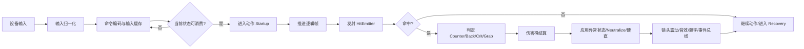
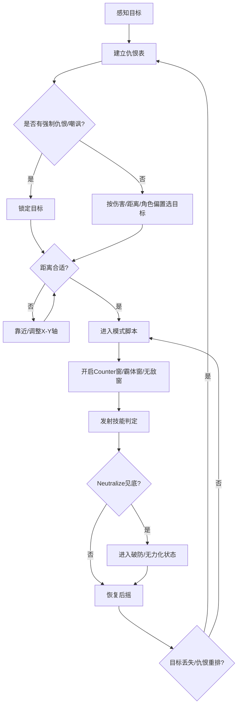
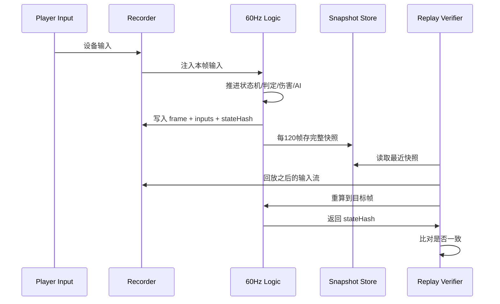

# 地下城与勇士战斗系统逆向重建与工程实现报告

## 执行摘要

这份报告的结论可以先说在前面：**公开可验证资料已经足够重建 DNF/DFO 战斗系统的“引擎契约”与大部分数值层规则，但不足以仅凭网页资料直接拿到“全职业、全技能、逐帧、逐盒”的完整 hitbox/hurtbox 与帧表**。能公开证实的部分包括：游戏是 PC 端、横版卷轴动作 RPG；官方开发者 API 暴露了职业与技能列表/详情接口；官方指南、更新公告和补丁文档明确暴露了 Counter、Invincibility、Super Armor、Aerial、Down、Grab-immune、Neutralize、Rupture 与异常状态体系；官方还公开了控制器映射、每角色技能热键、以及若干以 px 为单位的范围/判定数据。另一方面，开源工具明确证明客户端存在 `Script.pvf` 与 `.NPK` 资源包，并且有面向台湾分支的 PVF 解包/回包工具，但这些公开网页资料并没有直接给出“完整逐帧判定盒表”。citeturn8search1turn15view0turn16view0turn30view1turn31view0turn31view2turn36search8turn43view0turn10view0turn10view1turn10view2

因此，要想把开发团队真正带到“1:1 可落地”的层面，正确路线不是手工抄网页，而是采用**数据驱动战斗内核 + 合法持有本地客户端的资源抽取/校准管线 + 训练模式与高帧率录像校验**。官方 API 可以给你职业/技能索引；官方补丁与指南给你规则边界、异常状态、取消逻辑、px 单位与若干样例数值；资源工具链给你 `PVF/NPK` 级别的脚本与图像容器入口；最终再由工程侧统一收敛成一套确定性的 60Hz 逻辑帧战斗框架。citeturn16view0turn31view0turn31view2turn40view2turn10view0turn10view1turn10view2

本报告给出的核心交付物有四类：其一是**可直接编码的数据模型**，包括技能定义、动作段、判定盒、状态机、事件总线、AI 表与回放结构；其二是**公开可核对的公式与规则**，包括伤害计算桶、属性强化、状态异常生命周期、Counter/Back Attack/Grab-immune/Neutralize 的实现边界；其三是**关键算法伪代码**，包括输入缓存、取消消费、2.5D 判定、伤害结算、固定逻辑帧与渲染分离、回放还原；其四是**公开证据不足处的工程默认方案**，我会明确标成“推断/建议默认值”，避免把社区推导当成官方事实。citeturn30view1turn31view0turn31view2turn40view0turn43view1turn43view2

还有一个必须强调的前提：**分支差异是真实存在的**。现代韩服/国际服/国服 2025–2026 年分支已经有 Neutralize、Ignite、Rupture、TP 移除、控制器支持、若干技能进化与输入/取消边界更新；而面向entity["country","台湾","east asia"]分支的公开 PVF 工具与社区自建资料通常指向更旧的客户端家族。这意味着“引擎骨架可共用、平衡与技能表必须分支化”。把“现代 live 规则”与“旧台服泄露/私有分支规则”混成一套，是战斗 1:1 复刻里最常见也最致命的错误。citeturn29search0turn43view1turn19search7turn10view2turn14search3

## 证据基础与可信度

本报告采用四层证据体系。**A 级**是 entity["company","Neople","korean game developer"] / entity["company","Nexon","korean game publisher"] 官方站、官方 API、官方指南、官方更新页与官方开发者文档；**B 级**是官方站内玩家攻略/实测贴，尤其是韩服官网社区中按帧分析技能的帖子；**C 级**是公开开源客户端资源工具，如 PVF/NPK 解析器；**D 级**是高风险社区资料，包括自建服部署文档、旧客户端实践文章、台服 PVF 工具说明等。A 级用于锁定规则边界；B 级用于补齐时序、速度、帧感；C/D 级仅用于说明资源容器与分支存在性，不作为“官方数值真值源”。citeturn16view0turn30view1turn31view2turn10view0turn10view1turn10view2turn14search3

| 证据层级 | 典型来源 | 能证明什么 | 在本报告中的用途 | 可信度 | 法律/伦理风险 |
|---|---|---|---|---|---|
| A | 官方 API、官方指南、官方更新公告 | 系统规则、状态、范围值、接口存在性、控制器支持、训练模式标志 | 作为规则主锚点 | 高 | 低 |
| B | 官方站内玩家实测/帧分析贴 | 帧数、技能前后摇、技能体感、连招/后摇取消经验 | 用于补齐时序与手感层实现 | 中 | 低 |
| C | 开源 PVF/NPK 解析器 | 客户端资源容器存在、可解析性、脚本/图像分层 | 用于设计资源抽取管线 | 中 | 中 |
| D | 自建服/旧客户端实践资料、台服 PVF 工具说明 | 旧分支文件名、部署所见工件、分支差异存在 | 只用于风险与分支识别，不做真值数表 | 低到中 | 高 |

从官方侧可以明确确定两件非常重要的事。第一，开发者 API 确实有**职业信息、职业技能列表、职业技能详情**三类接口，但文档并没有公开帧数据、判定框、取消窗或根位移。第二，现代官方指南已经把训练中心/实战里真正影响实现的系统标签公开得很细：`Counter`、`Invincible`、`Super Armor`、`Aerial`、`Down`、`Grab-immune`、`Named/Champion`、`Boss` 都是系统级概念，而不是只写在某个职业技能说明里的“文本效果”。这意味着你必须用**引擎级标签与状态位**来做战斗框架，而不是把这些概念写死到少数技能脚本里。citeturn16view0turn30view1turn36search8turn43view1

从资源侧，公开工具明确说明了三层事实：一个开源库可解包 DNF 的 `PVF` 与 `NPK`；另一个工具箱可读取 `.NPK`、浏览包内图像并把帧序列转成 GIF；还有一个公开项目直接写明它面向“Dungeon Fighter Taiwan”的 `pvf script file` 做解包/回包。这组证据已经足够指导工程团队把数据层拆成**脚本数据层**与**图像/动画帧层**。但需要强调：公开工具证明“容器结构可被外界观察”，不等于你可以合法再分发任何官方资源，更不等于网页上已经存在全量技能盒表。citeturn10view0turn10view1turn10view2

社区与旧分支资料还能证明一些“工件级现实”。例如，自建/旧分支实践文档会反复提到 `Script.pvf`、`publickey.pem`、`df_game_r`、`game.ini`、`dnf.toml`，以及工具侧提到的 `ImagePacks2` 路径设置。这说明在工程上可以把客户端资源大致分成**内容脚本、资源包、版本/认证、网络配置**几类文件；但这类资料既不属于官方开发文档，也常伴随较高版权与合规风险，所以本报告只把它们当作“风险提醒与分支识别”，不把其数值内容当成权威真值。citeturn14search3turn13search1turn13search7

## 可直接落地的数据模型

官方文档说明 DNF 现有职业/技能是可查询的，而且当前国际服已经是 “16 classes / 60+ advancements” 级别的体量；同时，游戏仍然是典型的横版卷轴动作 RPG。这个规模决定了一个结论：**不能用手写 if/else 去复刻战斗，必须是数据驱动**。建议把战斗数据拆成五张主表：`SkillDefinition`、`ActionTimeline`、`HitEmitter`、`StateRule`、`AIProfile`。职业/技能 API 负责给你索引；PVF/NPK 抽取负责给你动作与资源；官方规则页负责给你系统标签与交互约束。citeturn8search1turn19search1turn16view0turn10view0turn10view1

### 战斗主数据表

| 表名 | 主键 | 关键字段 | 用途 |
|---|---|---|---|
| `SkillDefinition` | `skill_id` | `job_id`, `branch_id`, `attack_type`, `cooldown_ms`, `resource_cost`, `element_policy`, `cancel_tags`, `can_cast_air`, `can_cast_downed`, `grab_mode`, `counter_bonus_tag`, `rear_attack_tag` | 技能总表 |
| `ActionTimeline` | `action_id` | `logic_fps`, `startup_frames`, `active_windows[]`, `recovery_frames`, `input_buffer_open`, `cancel_open`, `root_motion_curve`, `speed_scale_type` | 动作/帧序总表 |
| `HitEmitter` | `emitter_id` | `shape`, `offset_x`, `offset_y`, `offset_z`, `size_x`, `size_y`, `size_z`, `radius`, `max_targets`, `hit_interval_f`, `once_per_target`, `force_move`, `status_payload` | 每段打点/判定盒 |
| `StateRule` | `state_id` | `super_armor`, `invincible`, `downed`, `airborne`, `can_turn`, `can_buffer`, `can_guard_cancel`, `can_backstep_upgrade`, `hurtbox_profile` | 状态机规则 |
| `AIProfile` | `ai_id` | `aggro_weights`, `pattern_tree`, `counter_windows`, `grab_immune`, `super_armor_rules`, `neutralize_profile`, `status_tolerance` | 怪物战斗 AI |

这套设计不是凭空拍脑袋。官方 API 明确区分职业、转职与技能；官方训练模式把 `Aerial / Down / Counterattack / Super Armor / Grab-immune / Boss / Named` 暴露为系统级测试开关；官方指南又把 `Invincible`、`Super Armor`、`Counter`、`Abnormal Status` 单独拿出来讲。这些都在告诉你：**“技能”只是数据引用点，真正的引擎实体是动作段、标签位、判定发射器与状态图**。citeturn16view0turn30view1turn36search8turn43view1

### 2.5D 坐标与单位

官方更新反复使用 `px` 表示范围与判定，包括 150px、500px、750px、800px、900px 这类整数值，而且多次强调 **Y-axis attack range**、**tracking range**、**around target 150 px**。这足以说明 DNF 战斗判定不是纯圆形 2D，更不是完整 3D physics，而是**地面平面上的 X/Y 判定 + 单独的空中 Z 层**。citeturn18search7turn18search11turn18search4turn36search1turn31view0turn31view2

| 维度 | 建议定义 | 依据 | 实现建议 |
|---|---|---|---|
| `X` | 面向方向前后轴 | 横版卷轴动作 | 用整数 px 或定点数 |
| `Y` | 纵深轴 | 官方多次写 `Y-axis range` | 与 X 独立判定，不与 Z 混合 |
| `Z` | 跳跃高度层 | 官方有 `Aerial`, 空中施放、空中连斩 | 只影响空中/地面重叠与落地 |
| 朝向 | `facing = +1 / -1` | Rear Attack/Back Attack、背后追踪 | Hitbox 本地坐标乘朝向镜像 |
| 单位 | `1 logic unit = 1 px` | 官方范围值直接以 px 给出 | 逻辑层全部整数化，渲染层插值 |

### 判定盒与受击盒规范

公开网页没有给出“全技能完整坐标盒表”，但足够指导**应当怎样存**。由于官方范围值明显存在矩形纵深维度、圆形半径与追踪距离三种表达，所以 `HitEmitter.shape` 至少要支持 `rect_xy_z`、`circle_xy`、`swept_segment`、`attach_holder` 四类。

| 字段 | 类型 | 说明 | 备注 |
|---|---|---|---|
| `shape` | enum | `RECT / CIRCLE / SWEEP / GRAB_ATTACH` | 技能使用不同判定拓扑 |
| `offset_x/y/z` | int | 相对角色锚点偏移 | 建议锚点在盆骨/脚底中心 |
| `size_x/y/z` | int | 盒尺寸 | 矩形判定专用 |
| `radius` | int | 半径 | 圆形/爆炸/溅射 |
| `active_from/to_f` | int | 逻辑帧窗口 | 与动画分离 |
| `max_targets` | int | 最大命中数 | 多目标处理 |
| `once_per_target` | bool | 单个激活窗是否只打一次 | 防止同窗多次命中 |
| `hit_interval_f` | int | 连续多段命中的最短间隔 | 多段/持续技 |
| `z_policy` | enum | `GROUND_ONLY / AIR_ONLY / BOTH` | 空地分层 |
| `rear_lock` | bool | 是否要求背击/背后附着 | 暗杀/背袭类 |
| `grab_mode` | enum | `NONE / SOFT / HARD / ALT_ON_IMMUNE` | 抓取与抓取免疫分支 |

### 公开可核对的判定尺寸样例

下表不是“全技能完整盒表”，而是**网页公开能直接核对的范围值样例**。这些值非常有用，因为它们能把工程上的单位系统和 2.5D 判定标尺定下来。citeturn31view0turn31view1turn18search7turn18search11turn18search4turn36search1

| 公开对象 | 类型 | 公开数值 | 工程含义 |
|---|---|---:|---|
| 燃烧扩散 | 圆形溅射半径 | 150px | 目标中心圆形 AoE |
| 女圣职者 Miracle Shine 初始 Y 轴范围 | 纵深范围 | 100px → 150px | 技能可单独配置 Y 轴盒深 |
| 男圣职者 Apocalypse 攻击范围 | 半径/范围值 | 840px → 900px（Lv10） | 大范围技能可直接使用 px 半径参数 |
| 部分协同/装备范围 | 团队 aura 半径 | 500px / 750px | 角色周围圆形检测 |
| 追踪/后方瞬移范围 | 目标搜索半径 | 800px | 追踪技目标搜索圈 |

### 公开可核对的时序样例

韩服官方站内玩家会直接按帧讨论技能施放时间；这类资料不等于官方数表，但因为发布在官方站内、且常带逐帧 GIF，对工程实现仍然很有价值。下面这张表只放**公开可核对样例**，目的是告诉你“帧表必须入库”，而不是宣称网页上已能拿到全职业全量帧表。citeturn8search2turn8search11turn18search5turn26search0turn38search1

| 技能/规则 | 公开事实 | 工程解释 | 可信度 |
|---|---|---|---|
| 韩服社区对 `일주연환격 / 섬극연환오의` 的逐帧分析 | 施放时间 25 帧 | `cast_total_f = 25` 可直接入表 | B |
| 同贴对 `횡보이심일격` | 施放时间 17 帧 | 属于“同技能分支动作长度变化” | B |
| Exorcist 全技能施放动作 | 改为受 Attack Speed 影响 | `speed_scale_type = ATK_SPEED` | A |
| 某些技能进化说明 | 可在上挑攻击激活后取消 | `cancel_open_f` 不是固定在收招末尾，而是可落在 active 期后半段 | A |
| 某些技能进化说明 | 可空中施放、可倒地/受击时施放 | `can_cast_air / can_cast_downed = true` | A |

结论很直接：**帧表、取消窗、速度缩放类型都必须是技能级字段，不是职业级默认值**。同一职业内也会存在“受攻击速度影响”“受施放速度影响”“固定速度”“可空中施放”“仅地面施放”“受击时可施放”“后摇可被连携技切断”等不同规则。citeturn18search5turn36search3turn26search0turn38search1

## 角色动作、输入与取消规则

官方训练模式和系统指南公开的标签，已经足够重建玩家状态机的骨架。训练模式明确有 `Aerial`、`Down`、`Counterattack`、`Super Armor`、`Grab-immune`；指南又单独定义了 `Counter`、`Invincible`、`Super Armor`；2022 系统更新再加入 `Backstep Upgrade`，允许角色在**技能中**或**受击/倒地时**使用强化后撤；2025 指导文档又说明某些 Guard 系统可以取消几乎任何动作，并由 Jump 反取消。这套证据串起来，说明 DNF 的动作系统不是“当前动画播完再说”，而是**显式状态机 + 多层覆盖标签 + 条件取消窗**。citeturn30view1turn31view2turn36search8turn37search1turn43view2

### 玩家状态机建议表

| 状态 | 进入条件 | 退出条件 | 关键标签 | 关键事件 |
|---|---|---|---|---|
| `Idle` | 无输入/无锁动作 | 移动、攻击、跳跃、施法 | 可缓冲 | `OnNeutral` |
| `Walk` | 方向输入弱位移 | 无输入/冲刺/攻击 | 可转向 | `OnMoveStart` |
| `Dash` | 方向输入阈值或双击 | 松键/攻击/跳跃 | 可切到 Dash Attack | `OnDashStart` |
| `JumpStart` | Jump 输入 | 到达离地帧 | 地面→空中 | `OnJump` |
| `Airborne` | 跳起后 | 落地/空中技/被击 | `airborne=true` | `OnAirborne` |
| `BasicAttack[n]` | 普攻链输入 | 连段结束/取消/受击 | 可设置 combo branch | `OnBasicHit` |
| `DashAttack` | 冲刺中攻击 | 动作结束/取消 | 地面高速前冲分支 | `OnDashHit` |
| `JumpAttack` | 空中攻击 | 落地/空连下段 | `airborne=true` | `OnAirHit` |
| `SkillStartup` | 技能启动成功 | 进 Active/被取消/被打断 | 资源已预留 | `OnSkillStart` |
| `SkillActive` | 到达有效窗 | 进 Recovery/分段循环 | 可发射 HitEmitter | `OnHitEmit` |
| `SkillRecovery` | Active 结束 | 中立/取消/后撤步强化 | 决定后摇 | `OnSkillRecover` |
| `HitStun` | 可被硬直的状态下受击 | 硬直结束/倒地/霸体覆盖 | 不可输入或缩限输入 | `OnStagger` |
| `Downed` | 吹飞/击倒/坠地 | 起身/后撤步强化/特殊受身 | `downed=true` | `OnDown` |
| `Guard` | 特殊键进入防御态 | 成功格挡、跳跃取消、用尽层数 | 可阻挡/反击 | `OnGuard` |
| `Dead` | HP≤0 | 复活/退出副本 | 清除可清除状态 | `OnDeath` |
| `Revive` | 使用币/脚本复活 | 无敌结束 | `invincible=true` | `OnRevive` |

### 输入兼容与设备归一化

当前国际服已经有官方控制器支持：某些需要固定键位的怪物机制可映射到控制器输入，模拟摇杆的倾斜程度会区分走路/跑步，且如果通过 entity["company","Valve","pc platform company"] 平台启动，官方建议使用它的官方控制器布局；韩服开发者笔记还明确提到“每角色独立技能热键设置”。这说明原作不是简单的“键位轮询”，而是**设备输入 → 统一逻辑命令 → 每角色映射层**三段式。citeturn43view0turn23view0

建议实现以下输入栈：

1. **设备层**：键盘、手柄、可选街机摇杆。
2. **归一化层**：把设备输入归一成 `MoveAxisX/Y`、`Jump`、`Basic`、`Skill[0..n]`、`Special`、`Guard`、`Backstep`。
3. **命令层**：把方向+按钮流转成命令编码，如 `↓↘→+Skill2`。
4. **角色映射层**：每个角色持有自己的 `SkillSlotMap`。
5. **消费层**：由当前状态机与取消窗决定是否取走该输入。

### 输入缓存与取消消费伪代码

官方公开的几个关键边界非常重要：自动施放的 Buff 动作可被移动/攻击/技能取消；某些技能允许预输入；某些技能允许在受击/倒地中施放；`Backstep Upgrade` 明确允许在技能中或受击/倒地时使用，且两种用法冷却不同；Raid Guard 又能取消大多数动作并可被 Jump 取消。可见 DNF 的输入缓存不是“统一 3 帧”，而是**状态依赖、技能依赖、动作段依赖**。citeturn26search3turn26search0turn31view2turn37search1turn38search1turn43view2

```cpp
struct InputSample {
    int logicFrame;
    int axisX;          // -1000..1000
    int axisY;          // -1000..1000
    bool jump;
    bool basic;
    bool skill[12];
    bool special;
    bool guard;
    bool backstep;
};

struct BufferedCommand {
    int bornFrame;
    CommandType cmd;
    int priority;
};

bool CanConsumeCommand(const Actor& a, const SkillDefinition& s) {
    const StateRule& st = a.stateRule();

    if (!CooldownReady(a, s) || !ResourceReady(a, s)) return false;
    if (a.isDead) return false;

    if (a.isAirborne && !s.can_cast_air) return false;
    if (a.isDowned   && !s.can_cast_downed) return false;

    if (a.state == SkillRecovery && !WindowOpen(a.cancel_open_f_begin, a.cancel_open_f_end))
        return false;

    if (a.state == HitStun && !s.castable_when_hit) return false;

    return MatchCommand(a.inputBuffer, s.command_pattern, s.buffer_window_f);
}

void TryConsumeBufferedInput(Actor& a) {
    // 优先级顺序必须数据化，而不是硬编码：
    // Guard / BackstepUpgrade > ForcedEscape > SkillCancel > SkillStart > BasicChain > Move
    for (auto candidate : a.priorityListCurrentState()) {
        if (candidate.kind == Guard && a.can_guard_now) {
            EnterGuard(a);
            Consume(candidate);
            return;
        }
        if (candidate.kind == BackstepUpgrade && a.can_backstep_upgrade_now) {
            EnterBackstepUpgrade(a);
            Consume(candidate);
            return;
        }
        if (candidate.kind == SkillStart && CanConsumeCommand(a, candidate.skill)) {
            ReserveCost(a, candidate.skill);
            SwitchState(a, SkillStartup, candidate.skill.action_id);
            Consume(candidate);
            return;
        }
        if (candidate.kind == BasicChain && CanChainBasic(a, candidate)) {
            SwitchBasicChain(a, candidate.chainIndex);
            Consume(candidate);
            return;
        }
    }
}
```

### 取消窗口建议表

| 场景 | 官方/社区可证事实 | 实现规则 |
|---|---|---|
| 自动 Buff 动作 | 自动施放 Buff 的动作可以被移动、攻击、使用技能取消 | `auto_buff.cancel_tags = MOVE|BASIC|SKILL` |
| 某些技能进化 | 可在有效打点激活后而非收招末尾才开放取消 | `cancel_open_f_begin` 可落在 active 期 |
| 某些技能 | 支持预输入 | `preinput_window_f > 0` |
| 受击/倒地特殊技 | 可在受击或倒地时施放 | `castable_when_hit`, `can_cast_downed` |
| Backstep Upgrade | 技能中或受击/倒地时可用，且冷却不同 | 状态机对来源场景区分 CD |
| Guard 系统 | 可取消绝大多数角色动作，Jump 可取消 Guard 本身 | `Guard` 作为高优先级全局取消层 |

### 动画根位移与强制位移

原作里大量职业/技能说明都指向一个事实：**动作位移不能只靠动画表现，必须逻辑化**。例如某些职业的基础/冲刺/跳跃攻击会被职业被动整体改写；某些技能具备“追踪到最强敌人后方”“后撤步射击并拉开距离”“地面与空中都能执行快速突进”的特性；官方修复还提到“空中连续斩过程中错误地允许使用 Backstep Upgrade”。这说明位移至少分三层：**动画根位移、脚本强制位移、外力位移**。citeturn37search0turn37search8turn38search1turn38search13turn39view0

建议采用下面的总位移公式：

```cpp
Vec3 deltaPos =
      SampleRootMotion(action, frameInAction)     // 动画根位移
    + SampleForcedMove(skill, frameInAction)      // 技能脚本位移：冲刺、闪到背后、抓取拉拽
    + ExternalImpulse(actor);                     // 外力：击退、吸附、推挤

if (actor.stateRule().invincible) {
    // 无敌并不等于不位移，通常只是不吃伤害/不吃受击
}

deltaPos = ResolveCollisionAndPush(actor, deltaPos, map, monsters);
actor.pos += deltaPos;
```

### 输入到伤害的关键流程



## 伤害、属性、异常状态与判定

从公开资料看，现代 DNF 伤害系统最可靠的实现方式不是写一条超长公式，而是按**桶（bucket）**做。官方“Special Object Damage Options”页面虽然讲的是特殊对象伤害，但它明确写到：这些对象伤害“遵循与角色技能相同的伤害计算”，只是有一部分角色 Buff/被动被排除。这个页面实际上非常宝贵，因为它把现代 DNF 伤害系统里真正参与计算的维度列了出来：`Stat`、`Physical/Magical/Independent Atk.`、`Atk. Increase`、`Atk. Amp./Overall Damage Increase`、`Elemental Damage`、`Abnormal Status Damage Conversion/Increase`、`Monster Def.`、`Dungeon Buff`。citeturn40view2

换句话说，战斗实现里应该把伤害流程设计为：

```cpp
DamageContext ctx;
ctx.baseCoeff      = SkillTable(skillId, skillLv, hitIndex);   // 技能百分比/固定值
ctx.attackType     = skill.attackType;                         // 物理/魔法/独立
ctx.mainStatBucket = GatherMainStat(actor, skill);
ctx.atkBucket      = GatherAttackPower(actor, skill);
ctx.damageValue    = GatherDamageValue(actor);                 // 现代统一“伤害增加”桶
ctx.skillAtkMul    = GatherMultiplicativeSkillAtk(actor, skill);
ctx.elementBucket  = ResolveElement(actor, skill, target);
ctx.statusConv     = GatherStatusConversion(actor, skill, target);
ctx.counterTag     = target.counterWindow;
ctx.rearTag        = CheckRearAttack(actor, target);
ctx.critTag        = RollCrit(actor, skill, target);
ctx.enemyDef       = target.defenseProfile;
ctx.dungeonBuff    = scene.dungeonBuffs;
```

### 现代伤害桶与可公开验证的相对公式

下面这组公式不是全部来自官方白皮书，而是来自**官方站内社区对现代 110 级伤害系统的整理**，因此应视为“高价值工程近似式”，不是法律意义上的官方公式真本。它们非常适合做实现的第一版与自动化校验。citeturn40view0

| 伤害桶 | 公开可核对的相对公式 | 实现含义 | 可信度 |
|---|---|---|---|
| 伤害增加 `Damage Value` | `f_rel ≈ (DV + ΔDV + 1000) / (DV + 1000)` | 新系统统一伤害增加桶，边际递减 | B |
| 属性强化 `Element` | `f_rel ≈ ((E + ΔE) * 0.45 + 105) / (E * 0.45 + 105)` | 单属性强化对比公式；敌方抗性会改变实际收益 | B |
| 技能攻击力 `Skill Atk.` | 乘算处理 | 不随现值递减，应单独乘桶 | B |
| 异常转伤/异常增伤 | `f_rel ≈ (1 + conv' * bonus') / (1 + conv * bonus)` | 适合计算上异常流派装备变化 | B |

这张表要这样用：**不要把它们揉成一条死公式写在一个函数里**。正确做法是把每个桶的“收集规则”与“结算函数”分开，这样你才能在不同分支、不同年代规则集之间替换某个桶，而不是重写整个伤害系统。尤其台服旧分支和 2025–2026 现代 live 分支很可能不是同一套桶定义。citeturn29search0turn40view0turn40view2

### 属性加成算法

现代实现推荐采用如下属性决策流程：

1. **先确定攻击元素**：来自技能固有元素、武器附魔、系统附魔或临时转换。
2. **同一击不要把四属性简单相加**。官方对象伤害规则明确写“Elemental Damage 只取最高值”；官方站内社区也把实际配装理解为通常选择一种主属性再堆高。citeturn40view2turn40view0
3. **按元素桶乘到伤害上下文**。
4. **再进入目标抗性修正**。
5. **状态异常转伤/异常增伤在独立桶里处理，不要和元素直接合桶**。citeturn40view2turn31view0turn31view2

一个比较稳妥的工程实现如下：

```cpp
ElementType ResolveElement(const Actor& a, const Skill& s) {
    if (s.fixedElement != NONE) return s.fixedElement;
    if (a.tempElementOverride != NONE) return a.tempElementOverride;
    return a.weaponElement;
}

double EvalElementBucket(const Actor& a, ElementType e) {
    int elem = a.elementStrength[e];
    // season-specific function:
    return SeasonRules::EvalElementRelative(elem);
}
```

### Counter、背击、暴击与抓取判定

`Counter` 在现代官方内容里被定义得很清楚：怪物只会在**攻击模式中的某些时刻**进入 Counter 状态，而不是整段攻击全过程都算 Counter。这点非常关键，因为很多团队会错误地把“怪物正在攻击”直接等价为“可破招窗口”。正确做法是让每个怪物动作在时间线上显式写 `counterWindow[]`。citeturn30view1turn43view1

`Back Attack/Rear Attack` 方面，官方历史系统变更说明明确存在一个通用的 `Rear Attack` 技能，说明“背击”在引擎里是一个独立标签；某些职业还会通过技能强制制造或保证背击，例如 Shadow Dancer 的技能可以让目标在背后受击时不转身，或让下一次技能“必定按背击结算”。因此工程上不要把背击做成单纯的“位置在后面”判断，而要做成**几何条件 + 技能标签改写**。citeturn33search1turn37search5turn33search3

暴击方面，公开网页资料足以确认现代规则至少存在**物理/魔法暴击机会**这一层，而且它曾被整理/合并为通用 Critical 系列，但当前可公开访问资料并没有给出一条可信、统一、适用于所有分支的“最终暴击倍率公示公式”。所以对克隆实现来说，最稳妥的做法是：**把暴击判定做成统一接口，把暴击倍率做成赛季表/分支表，而不是写死常数**。citeturn33search1turn18search3

抓取方面，官方和官方站内资料提供了非常强的证据链：训练模式可直接把怪物设为 `Grab-immune`；很多职业更新说明仍然区分“抓取免疫敌人”的替代分支；还有更新直接写“移除抓取免疫敌人区分”。这意味着抓取技能必须支持**正常抓取分支**与**抓取免疫替代分支**两条路径。citeturn36search8turn36search0turn36search3turn36search6turn36search9

```cpp
HitOutcome EvaluateSpecialTags(const Actor& atk, const Skill& skill, Target& tgt) {
    HitOutcome out{};

    out.isCounter = tgt.counterWindowActive;  // 不是“只要在攻击中就算”
    out.isRear = GeometricRearCheck(atk, tgt, skill.rearToleranceY) || skill.forceRearAttack;
    out.isCrit = RollCrit(atk, skill, tgt);   // critMul 走 season/branch config

    if (skill.grab_mode != NONE) {
        if (tgt.flags.grabImmune) {
            out.grabBranch = skill.alt_on_grab_immune ? ALT_BRANCH : STRIKE_ONLY;
        } else {
            out.grabBranch = NORMAL_GRAB;
        }
    }
    return out;
}
```

### 异常状态完整体系

现代官方指南与系统更新已经把异常状态按**伤害型**与**无力化/控制型**拆开，并给出了明确持续时间、tick、叠层与联动规则。下表把官方指南与后续系统更新中的关键点合并成一张可直接入策划表的实现表。citeturn31view0turn31view1turn31view2turn43view1

| 状态 | 类别 | 公开规则 | 建议字段 |
|---|---|---|---|
| 中毒 `Poison` | 伤害型 | 5 秒，每 0.5 秒结算；每多 1 层，下一次中毒伤害 +2%，最多 +10% | `duration_ms=5000`, `tick_ms=500`, `next_stack_bonus=0.02`, `max_bonus=0.10` |
| 灼伤 `Burn` | 伤害型 | 5 秒，每 0.5 秒结算；对周围 150px 敌人附加原始伤害 10%；若被冰冻解除，剩余灼伤伤害 ×110% 立刻结算 | `splash_radius=150`, `splash_ratio=0.10`, `freeze_cancel_bonus=0.10` |
| 感电 `Shock` | 伤害型 | 10 秒，每 0.5 秒持续；命中时按指定 hit 数与攻击力拆分；每多 1 层，下一次感电伤害 +0.5%，最多 +5% | `duration_ms=10000`, `tick_ms=500`, `next_stack_bonus=0.005`, `max_bonus=0.05` |
| 出血 `Bleeding` | 伤害型 | 3 秒，每 0.5 秒结算；每多 1 层，下一次出血伤害 +1%，最多 +10% | `duration_ms=3000`, `tick_ms=500`, `next_stack_bonus=0.01`, `max_bonus=0.10` |
| 束缚 `Bind` | 控制型 | 5 秒不能移动；若是弱点异常，额外削减 Neutralize | `immobile=true`, `duration_ms=5000` |
| 眩晕 `Stun` | 控制型 | 3 秒不能移动；连打技能键/攻击键可缩短持续；若是弱点异常，额外削减 Neutralize | `mash_reduce=true`, `duration_ms=3000` |
| 减速 `Slow` | 控制型 | 3 秒所有速度 -50% | `move_mul=0.5`, `duration_ms=3000` |
| 冰冻 `Freeze` | 控制型 | 5 秒不能移动；对移动中的怪会临时暂停位移；与灼伤有解除联动 | `immobile=true`, `duration_ms=5000` |
| 石化 `Petrify` | 控制型 | 10 秒不能移动；期间受伤减免 10%，且每秒下降 1% | `incoming_dmg_down=0.10`, `per_sec_decay=0.01` |
| 睡眠 `Sleep` | 控制型 | 10 秒不能移动；期间每秒回复 1% HP；被攻击立即解除，并给这次唤醒攻击 150% 效果 | `heal_per_sec=0.01`, `wake_bonus=1.5` |
| 盲目 `Blind` / 暗黑 | 控制型 | 命中率下降；玩家还伴随视野缩小 | `hit_rate_down=0.5` |
| 混乱 `Confusion` | 控制型 | 玩家方向键反向；怪物短暂停止行动 | `invert_input=true / ai_pause=true` |
| 诅咒 `Curse` | 控制型 | 随机施加一种非伤害型异常 | `random_pool=control_statuses` |
| 破裂 `Rupture` | Neutralize 型 | 可叠 3 层；角色承伤 +25/+50/+75%，怪物承伤 +5/+7/+8%；到时自动清；3 层后再上只刷新 3 层 | `stacks=3`, `refresh_on_max=true` |

### 状态生命周期与事件钩子

```cpp
void ApplyStatus(Target& t, StatusPayload p) {
    Status& s = t.statuses[p.type];

    if (p.type == CURSE) {
        ApplyStatus(t, RandomNonDamageStatus());
        return;
    }

    if (p.refreshPolicy == REFRESH || s.expired()) {
        s = MakeNewStatus(p);
    } else {
        MergeStatusStack(s, p);
    }

    if (p.type == BURN && t.HasStatus(FREEZE)) {
        double remaining = EvalRemainingBurnDamage(t);
        RemoveStatus(t, FREEZE);
        RemoveStatus(t, BURN);
        DealImmediateDamage(t, remaining * 1.10);
        return;
    }

    EmitCombatEvent(StatusApplied{t.id, p.type});
}
```

### 伤害结算伪代码

```cpp
DamageResult ResolveHit(const Actor& atk, Skill skill, Target& tgt, HitEmitter em, int hitIndex) {
    auto tags = EvaluateSpecialTags(atk, skill, tgt);

    DamageContext dc{};
    dc.baseCoeff     = GetSkillCoeff(skill, hitIndex);
    dc.atkScalar     = GetAtkScalar(atk, skill.attackType);
    dc.damageValue   = EvalDamageValueBucket(atk);
    dc.skillAtkMul   = EvalSkillAtkMul(atk, skill);
    dc.elementMul    = EvalElementBucket(atk, ResolveElement(atk, skill));
    dc.statusConvMul = EvalStatusConversion(atk, skill, tgt);
    dc.counterMul    = tags.isCounter ? GetCounterMul(skill, tgt) : 1.0;
    dc.rearMul       = tags.isRear    ? GetRearMul(skill, atk, tgt) : 1.0;
    dc.critMul       = tags.isCrit    ? GetCritMul(atk, skill) : 1.0;
    dc.defMul        = EvalDefenseMul(tgt, skill);
    dc.sceneMul      = EvalDungeonBuffMul(atk.scene);

    double raw = dc.baseCoeff
               * dc.atkScalar
               * dc.damageValue
               * dc.skillAtkMul
               * dc.elementMul
               * dc.statusConvMul
               * dc.counterMul
               * dc.rearMul
               * dc.critMul
               * dc.defMul
               * dc.sceneMul;

    if (tgt.flags.invincible) return DamageResult::NoHit();
    DealDamage(tgt, raw);

    if (!tgt.flags.superArmor) {
        ApplyHitStun(tgt, skill, hitIndex);
    }
    ApplyNeutralizeAndStatuses(tgt, skill, em, tags);
    return DamageResult::Hit(raw, tags);
}
```

## 怪物 AI、多目标命中与地图交互

怪物 AI 这部分，公开资料不像状态异常那样“显式”，但仍然能拼出比较可靠的骨架。官方内容页把怪物地图状态写成了 `Appearing / Reinforcing / Moving / In Presence` 这类离散状态；官方职业介绍与官方站内职业攻略又反复出现“吸引仇恨”“目标仇恨集中”“隐身后清除仇恨”“召唤物帮你吃仇恨”等描述。换句话说，DNF 的怪物并不是简单找最近目标，而是具有**显式状态机 + threat/aggro 表 + 模式脚本入口**。citeturn29search4turn34search0turn34search6turn39view0

### 怪物仇恨与目标选择模型

| 证据 | 公开事实 | 工程结论 |
|---|---|---|
| Summoner 站内攻略 | “让它去打那个！”会让目标怪物仇恨集中 | 存在强制 Threat 注入 |
| Male Mechanic 站内攻略 | 伪装能“去掉仇恨” | 存在 Threat 清零/衰减 |
| Dimension Walker 官方角色页 | 召唤物可吸引怪物仇恨，便于你施法 | Threat 目标可指向召唤物/NPC |
| Raid 状态板 | 怪物有 Appearing / Reinforcing / Moving / In Presence | 高层 AI 是显式状态图 |

建议 threat 函数如下：

```cpp
threat(target) =
    damageDealtToMonster * W_DAMAGE
  + tauntBonus(target)   * W_TAUNT
  + proximityScore       * W_DISTANCE
  + roleBias             * W_ROLE
  - stealthPenalty       * W_STEALTH
  - untargetablePenalty  * W_UNTARGETABLE;
```

其中 `tauntBonus` 来自技能脚本，`stealthPenalty` 来自隐身/伪装类状态，`roleBias` 用于实现某些怪更爱打召唤物、前排或最近目标。

### 建议的怪物状态机

| 状态 | 触发条件 | 行为 | 退出条件 |
|---|---|---|---|
| `Idle` | 未发现目标 | 巡逻、待机、播放预警 | 目标进入感知半径 |
| `Acquire` | 首次发现目标 | 选 target，建立仇恨表 | 进入 Approach / Cast |
| `Approach` | 距离不足 | 贴近、对齐 X/Y 轴、转向 | 进入攻击合适距离 |
| `PatternCast` | 满足技能条件 | 执行模式脚本、开 Counter 窗/无敌窗/霸体窗 | 进 Recover / HitReact |
| `Recover` | 技能收招中 | 等待后摇结束，可局部转向 | 进入 Idle / Recast |
| `HitReact` | 被命中且非霸体/非无敌 | 硬直、倒地、吹飞、受控 | 恢复 / Neutralized |
| `Neutralized` | Neutralize 条见底 | 进入 vulnerability/破防窗口 | 计时结束后回 Idle/Acquire |
| `Dead` | HP≤0 | 掉落、事件广播、门逻辑 | 房间清算 |

现代官方内容又指出，Neutralize 系统已改为更强地按角色造成的伤害比例削减，Ignite 会随着你打怪持续增长、被怪打到时下降/暂停；Counter 也只在怪物攻击模式特定时刻出现。这意味着 Named/Boss 怪物的 AI 需要至少再加三层附属时间轴：`counterWindow[]`、`neutralizeProfile`、`igniteResponseProfile`。citeturn31view2turn43view1

### 多目标命中与受击反应

DNF 官方资料已经明确出现“抓取多个敌人”“Aerial/Down/Counterattack/Super Armor/Grab-immune/Boss/Named 这些测试开关”，再加上很多技能说明与社区逐帧贴都指向“多段、多目标、追踪、后摇取消、抓取免疫替代分支”的存在，因此多目标命中不能做成一个简单的 `for each overlap -> damage`。需要至少区分四类命中语义：**一次窗一次目标**、**持续窗隔帧多次**、**抓取主目标+附属目标**、**追踪型重定向**。citeturn21search12turn36search8turn36search0turn33search14

建议多目标算法如下：

```cpp
vector<Target*> SelectTargets(const HitEmitter& em, const Actor& atk, vector<Target*>& candidates) {
    // 先过重叠判定
    auto overlapped = FilterOverlap2p5(em, atk, candidates);

    // 再按技能语义排序
    sort(overlapped.begin(), overlapped.end(),
        [&](Target* a, Target* b) {
            if (em.targetPolicy == STRONGEST_FIRST) return a->rank > b->rank;
            if (em.targetPolicy == PRIMARY_AXIS)    return DistX(atk, *a) < DistX(atk, *b);
            return Dist2(atk, *a) < Dist2(atk, *b);
        });

    // 抓取技能先选主目标
    if (em.shape == GRAB_ATTACH && !overlapped.empty()) {
        return { overlapped.front() };
    }

    if ((int)overlapped.size() > em.maxTargets) {
        overlapped.resize(em.maxTargets);
    }
    return overlapped;
}
```

### 受击硬直与逆硬直

这里必须实话实说：**公开官方网页没有给出“每种怪物、每种技能受击硬直帧”的全量表**。但官方已经明确两条底线：一是 `Super Armor` 表示“被打也不进入硬直”；二是 `Counter`、`Down`、`Aerial`、`Grab-immune` 都是系统级状态。因此工程上应把“受击表现”拆成三个互相独立的层：

- `victim_hitstun_f`：受击者硬直。
- `victim_displacement`：受击者位移/吹飞/击倒。
- `attacker_hitstop_f`：攻击者逆硬直/命中停顿。

这样一来，即使目标有霸体或 Boss 抵抗，也可以让 `victim_hitstun_f=0`，但保留 `attacker_hitstop_f` 做手感；若技能带“强制位移但不硬直”，则只写 `victim_displacement`。这才不会把“霸体”“击退”“命中停顿”搅成一个字段。

### AI 决策流



## 工程落地：固定逻辑帧、回放、评分、震屏、碰撞与事件总线

在“平台、网络需求、性能目标未指定”的前提下，最稳妥、也最接近 DNF 这类战斗的工程路线，是**60Hz 固定逻辑帧 + 变速渲染帧 + 确定性输入记录**。通用游戏工程资料与学术资料都一致指出：固定时间步更容易获得确定性仿真；而格斗/动作游戏常用的输入延迟/输入缓冲则可用环形缓冲存储输入与玩家状态。citeturn25search30turn25search33turn24search10

### 固定逻辑帧与渲染帧分离伪代码

```cpp
const double LOGIC_DT = 1.0 / 60.0;
double acc = 0.0;
double last = NowSeconds();

while (!quit) {
    double now = NowSeconds();
    acc += now - last;
    last = now;

    PollDeviceInputs();              // 设备层
    PushInputToRingBuffer();         // 输入层

    while (acc >= LOGIC_DT) {
        SampleCommandsForCurrentLogicFrame();
        UpdateBattleLogic60Hz();     // 只用固定 dt
        SaveReplayFrameIfNeeded();
        acc -= LOGIC_DT;
    }

    double alpha = acc / LOGIC_DT;   // 仅渲染插值
    Render(alpha);
}
```

### 回放系统建议

公开官方网页没有给出“战斗回放系统”的技术细节，因此这里给出的是**最适合 DNF 类动作战斗的工程方案**：输入记录 + 周期快照 + 状态哈希。它和固定逻辑帧天然兼容，也最容易用于 QA 复盘、Bug 复现与平衡验证。通用资料同样表明，固定 timestep 与输入缓冲是可重现仿真的前提。citeturn25search30turn25search33turn24search10

建议记录以下字段：

| 字段 | 说明 |
|---|---|
| `build_id` | 客户端/规则版本号 |
| `ruleset_crc` | 技能表、怪物表、状态表 CRC |
| `map_seed` | 地图/RNG 种子 |
| `logic_frame` | 逻辑帧号 |
| `input_frame[]` | 各玩家/召唤物主控输入 |
| `snapshot_every_n` | 每 N 帧快照一个完整状态 |
| `state_hash` | 每帧或每 10 帧状态哈希 |
| `event_log` | 可选，仅用于调试，不用于真正重播 |

```cpp
struct ReplayHeader {
    uint32_t buildId;
    uint32_t rulesetCrc;
    uint64_t mapSeed;
    uint32_t logicFps;   // 60
};

struct ReplayFrame {
    uint32_t frame;
    vector<InputSample> inputs;
    uint64_t stateHash;
};

if (frame % 120 == 0) SaveFullSnapshot(worldState);

void ReplayStep() {
    auto rf = replay.frames[curFrame];
    InjectInputs(rf.inputs);
    UpdateBattleLogic60Hz();
    assert(HashWorldState() == rf.stateHash || debugMode);
}
```

### 回放流程图



### 连击数与评分

官方更新里已经存在“连击练习模式”，而塔类内容还会显式追踪 `Back Attack`、`Counter Attack`、`Hit Count`、`Skill Use` 等破解条件。这足以说明 DNF 引擎至少天然支持“按命中、按标签、按上下文”累计统计，因此你也应该把连击与评分写成**标签聚合器**。citeturn38search6turn32search9

建议如下：

```cpp
if (hitConfirmed) {
    if (frame - combo.lastHitFrame <= combo.graceFrames) combo.count++;
    else combo.count = 1;

    combo.lastHitFrame = frame;
    combo.usedCounter |= outcome.isCounter;
    combo.usedRear    |= outcome.isRear;
}
```

评分建议可拆成：

- `combo_score`
- `counter_score`
- `rear_attack_score`
- `air_combo_score`
- `no_damage_bonus`
- `clear_time_bonus`
- `style_bonus`（取消、追击、抓取免疫正确分支等）

### 震屏与屏幕反馈

现代官方内容提到 Monster HP UI 的 shake 会按伤害强度细调；另一处角色改版又专门修正“某技能对队友产生过多屏幕震动”。这意味着原作至少在“伤害强度分级”和“多人体验抑制”两端都有显式处理。工程上不要简单让每个命中都震。正确做法是按 **hit tier** 做分档，并给“本地自震”“队友弱震”“远端只飘字”三档。citeturn43view1turn37search11

| 命中等级 | 触发条件 | 本地镜头 | 远端镜头 | 屏幕反馈 |
|---|---|---|---|---|
| Light | 普通轻 hit | 无或 1 帧 hit-stop | 无 | 小飘字 |
| Medium | 技能主段 / Counter | 2–4 帧 hit-stop + 轻震 | 极弱或无 | 颜色强化 |
| Heavy | 觉醒/破防/抓取终结 | 4–8 帧 hit-stop + 中震 | 弱震 | 大字/裂屏/低频 |
| Finisher | 处决、最终段 | 定制镜头脚本 | 仅特效共享 | 强反馈 |

### 碰撞、推挤、地图/地形交互

虽然公开网页没有给出完整碰撞半径表，但 2.5D 的实现原则已经能从官方范围值、纵深 Y 轴说明与职业描述中确定下来：**移动/推挤/寻位都发生在 X/Y 平面；Z 只参与空中重叠与落地**。因此建议：

- 角色地面碰撞体：`capsule/circle on XY`
- 目标排序：先 X 再 Y
- Push Resolution：**软推挤优先，硬穿透修正兜底**
- 技能位移：先应用动作位移，再做墙体/怪群修正
- 适配地形：房间是离散图，房内是 2.5D lane mesh

```cpp
Vec2 ResolvePush(Actor& self, vector<Actor*>& nearby) {
    Vec2 push{0,0};
    for (auto* other : nearby) {
        Vec2 d = self.xy - other->xy;
        double dist = Length(d);
        double minDist = self.pushRadius + other->pushRadius;
        if (dist < minDist && dist > 0.001) {
            push += Normalize(d) * (minDist - dist);
        }
    }
    return Clamp(push, self.maxPushPerFrame);
}
```

### 战斗事件总线

一个可维护的 DNF 式战斗系统，最后都要落在事件总线上。建议事件至少覆盖下面这些：

| 事件名 | 发送方 | 订阅方 |
|---|---|---|
| `InputBuffered` | 输入层 | 状态机、回放 |
| `ActionStarted` | 状态机 | 动画、音效、网络、回放 |
| `HitEmitterSpawned` | 动作系统 | 判定系统 |
| `HitConfirmed` | 判定系统 | 伤害、连击、镜头、音效 |
| `DamageResolved` | 伤害系统 | 飘字、HP UI、评分 |
| `StatusApplied` | 状态系统 | Buff/Debuff UI、AI |
| `CounterTriggered` | 判定系统 | 评分、VFX |
| `NeutralizeChanged` | 伤害/状态 | 怪物 UI、AI |
| `DeathEntered` | 生存系统 | 掉落、房门、任务 |
| `ReviveEntered` | 生存系统 | UI、无敌层 |
| `ReplayKeyframeSaved` | 回放系统 | 调试器、文件存储 |

## 分支选择、平台变量与法律伦理风险

### 未指定变量对实现的影响

题设没有指定平台、网络对战与性能目标，所以必须先把实现变量分开。原作当前可公开确认是 **PC-first**，而且已经有官方控制器支持。这意味着如果你的目标是“最接近当前 live DFO 的 1:1 体感”，默认方案应该是 **PC 键盘/手柄、60Hz 逻辑、可高刷渲染**。如果改做主机或移动，输入与 UI 必须让位于设备。citeturn8search1turn43view0

| 变量 | 方案 | 对战斗系统的影响 |
|---|---|---|
| 平台 = PC | 推荐默认 | 保留方向/普攻/跳跃/多技能键的原生密度 |
| 平台 = 主机 | 可行 | 需要手柄归一化、命令输入宽容度略增 |
| 平台 = 移动 | 不建议直接 1:1 | 必须重做技能栏、方向输入、空连与取消宽容 |
| 网络 = 无联机 | 最省事 | 只做本地确定性与回放 |
| 网络 = PvE 联机 | 推荐房主/服务器权威 | 输入上传 + 状态广播 + 回放哈希 |
| 网络 = PvP 联机 | 需更高成本 | 必须上确定性 + rollback/lockstep 之一 |
| 性能目标 = 60Hz 逻辑 | 强烈推荐 | 与输入缓冲、回放一致性最好 |
| 渲染目标 = 120/144Hz | 可选 | 只做渲染插值，不改逻辑帧 |

### 旧台服/泄露客户端与逆向资料的使用边界

这一部分要说得非常明确。公开资料已经能证明：有工具专门对“Dungeon Fighter Taiwan”的 `pvf script file` 做解包/回包；也有社区文档围绕 `Script.pvf`、`publickey.pem`、`df_game_r`、`game.ini`、`dnf.toml`、`ImagePacks2` 等工件讨论部署与替换。这说明旧分支/台湾分支/自建链路在公开网上确实存在；但**这不等于推荐直接依赖泄露客户端或第三方分发的官方资产**。citeturn10view2turn14search3turn13search1

我建议把风险分三档处理：

| 资料类型 | 用途 | 可信度 | 法律/伦理风险 | 建议 |
|---|---|---|---|---|
| 官方站/官方 API/官方补丁/官方指南 | 规则锚定、术语、样例数值 | 高 | 低 | 可直接使用 |
| 对**合法持有的本地客户端**做自研只读解析 | 生成内部帧表/盒表/动作表 | 中 | 中到高 | 仅内部使用，不分发资产 |
| 泄露客户端、第三方打包资源、私有服务器补丁包 | 追旧分支规则 | 低到中 | 很高 | 不建议作为生产依赖，不要在报告/仓库中传播 |

### 本报告对“1:1 开发”最重要的落地判断

真正把项目推进到可开发状态，你需要接受以下四个判断：

第一，**全职业技能逐帧表、逐盒表必须自动化生成**。当前可公开网页足以让你搭好 schema，却不足以让你从网页抄完所有技能。官方职业技能 API 可做索引，PVF/NPK 工具可做资源入口，训练模式录像可做 QA 校准。citeturn16view0turn10view0turn10view1turn36search8

第二，**战斗系统要做成“规则包”而不是“唯一真理”**。现代韩/国/国际服规则、旧台服/自建分支规则，不应共用一份技能表与公式常数。`SeasonRules`、`BranchRules`、`SkillTableVersion` 要从第一天就进工程架构。citeturn29search0turn19search7turn10view2turn14search3

第三，**引擎核心要围绕状态标签而不是文本描述**。`Counter`、`Invincible`、`SuperArmor`、`Aerial`、`Downed`、`GrabImmune`、`Neutralized`、`Rupture` 必须都是可网络同步、可回放、可调试、可训练模式强制设置的引擎位。citeturn30view1turn31view2turn36search8turn43view1

第四，**回放不是附属功能，而是 1:1 复刻的必需品**。没有确定性回放，你无法验证帧表、取消窗、状态交互、怪物 Counter 窗、Neutralize 见底帧与多目标打点顺序是否真的一致。citeturn25search30turn25search33turn24search10

### 术语对照表

| 中文 | English | 한국어 |
|---|---|---|
| 霸体 / 超级护甲 | Super Armor | 슈퍼아머 |
| 无敌 | Invincibility / Invincible | 무적 |
| 反击 / 破招窗口 | Counter | 카운터 |
| 背击 | Rear Attack / Back Attack | 백어택 |
| 抓取免疫 | Grab-immune | 잡기 불가형 / Grab-immune |
| 空中状态 | Aerial | 공중 |
| 倒地 | Down / Downed | 다운 |
| 无力化 / 破防槽 | Neutralize | 무력화 |
| 破裂 | Rupture | Rupture |
| 后撤步强化 | Backstep Upgrade | 백스텝 강화 |

综合所有公开证据，一个**最保守但最可靠**的结论是：
你已经可以立项开发一个**高度接近 DNF 的数据驱动战斗内核**，并且能把现代公开规则——状态异常、Counter、Invincible、Super Armor、Aerial/Down/Grab-immune、输入缓存、取消消费、60Hz 逻辑帧、回放系统、多目标打点、怪物仇恨与 Neutralize——全部做成可运行的第一版；但若目标是“全职业全技能逐帧 1:1 数值还原”，网页公开资料本身还差最后一步，这一步只能由**合法持有本地客户端的内部抽取与校准流程**补齐，而不应由泄露资产或第三方分发包来替代。citeturn16view0turn31view0turn31view2turn36search8turn40view2turn10view0turn10view1turn10view2turn14search3
