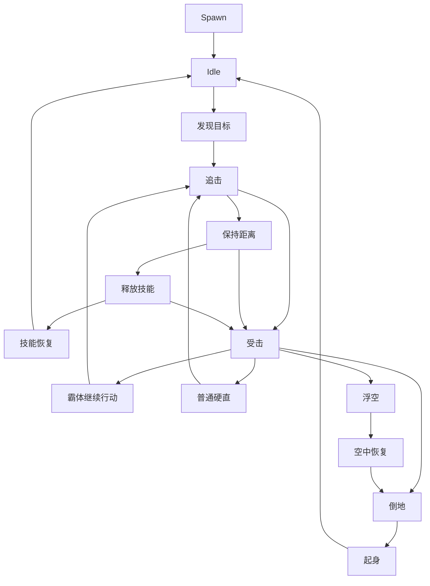

# CRT-004 — Monster/Boss AI Behavior Evidence

> **Status: RESEARCH COMPLETE** — evidence synthesized from internal project research corpus (2026-05-09)

> **Related tickets**: CRT-005 (AI manifest profile updates); this document covers the behavioral evidence dimension of enemy AI.

## 1. Summary of Current Implementation

### 1.1 EnemyAI.ts — FSM + Behavior Tree Hybrid

**File**: `src/combat/ai/EnemyAI.ts` (296 lines)

The AI controller implements a DNF 70-85 classic monster AI as a layered decision model:

| Layer | Mechanism | Description |
|-------|-----------|-------------|
| Layer 1: FSM | 6-state finite state machine | `idle → approach → windup → attacking → recover → idle`, with `stunned` interruptible from any state |
| Layer 2: Behavior Tree | Weighted branch selection | `chase / hold / retreat` — weighted random via deterministic hash of (tick + actorId) |
| Layer 3: Boss Scripts | Phase transitions + pattern selection | HP% thresholds trigger phase changes; weighted random pattern selection per phase |

**FSM Transition Rules** (from `EnemyAI.ts:tick()`):

```
idle       → approach   when detectDistance ≤ effectiveDetectRange (modified by aggressiveness)
                        AND long-range reaction check passes (or not long-range)
approach   → windup     when distance ≤ attackRange AND zDistance ≤ attackLineTolerance
                        AND behavior tree branch selects "chase"
approach   → (hold)     when behavior tree selects "hold" — stays in approach, no transition
approach   → (retreat)  when behavior tree selects "retreat" — moves away, stays in approach
approach   → idle       when detectDistance > loseAggroRange
windup     → approach   when target moves out of range during windup
windup     → attacking  when windupRemaining reaches 0 AND requestAction succeeds
windup     → recover    when windupRemaining reaches 0 AND requestAction fails
attacking  → recover    when currentAction is no longer "EnemyBasic"
recover    → idle       when recoverRemaining ≤ 0 AND targetSwitchTimer elapsed
recover    → recover    when recoverRemaining ≤ 0 BUT targetSwitchTimer not ready
stunned    → idle       when actor.reactionState exits stunned set
(any)      → stunned    when reactionState enters stunned set
(any)      → idle       when actor or player dead/hp≤0
```

**Key design decisions**:
- **Deterministic random**: Uses FNV-1a hash of `tick:actorId` for weighted branch selection — replay-safe
- **Z-lane system**: `zLaneTolerance = 14` for approach phase, `attackLineTolerance = 18` for attack commitment; enemies line up on Z before closing X
- **Sight vs Detect**: `sightRange` is visual (slower movement when player not in sight), `detectRange` is aggro trigger
- **Boss phase system**: `checkBossPhase()` triggers on HP% thresholds; `selectBossPattern()` uses weighted random from phase config

### 1.2 EnemyAIState — Per-Actor State

**File**: `src/combat/ai/EnemyAIState.ts` (35 lines)

```typescript
type EnemyAIPhase = "idle" | "approach" | "windup" | "attacking" | "recover" | "stunned";

interface EnemyAIState {
  phase: EnemyAIPhase;
  phaseEnteredTick: number;
  windupRemaining: number;
  recoverRemaining: number;
  detectRange: number;
  attackRange: number;
  preAttackFrames: number;
  postCooldown: number;
  moveSpeedPerTick: number;
  loseAggroRange: number;
  hp: number;
  damage: number;
  armor: BaseArmorType;
  // Phase 5 boss fields
  bossPhase?: number;
  bossPhaseEnteredTick?: number;
  patternWeights?: Record<string, number>;
  currentPattern?: string;
  // DNF AI parameter fields (loaded from manifest)
  sightRange?: number;
  aggressiveness?: number;
  targetSwitchTime?: number;
  longRangeReactionChance?: number;
  behaviorWeights?: { chase: number; retreat: number; hold: number };
}
```

### 1.3 Enemy Types (enemy-default.json)

**File**: `src/data/manifest/ai/enemy-default.json`

5 enemy profiles with all parameters sourced from `local_baseline`:

| Parameter | grunt | dummy | imp | boss | building |
|-----------|-------|-------|-----|------|----------|
| hp | 160 | 160 | 120 | 420 | 500 |
| damage | 5 | 12 | 8 | 25 | 0 |
| detectRange | 360 | 260 | 300 | 360 | 0 |
| sightRange | 300 | 200 | 280 | 400 | 0 |
| attackRange | 72 | 76 | 120 | 96 | 0 |
| loseAggroRange | 520 | 360 | 420 | 500 | 0 |
| moveSpeedPerTick | 1.05 | 0.75 | 1.15 | 0.55 | 0 |
| preAttackFrames | 16 | 24 | 18 | 38 | 0 |
| postCooldown | 34 | 48 | 42 | 64 | 0 |
| aggressiveness | 50 | 30 | 65 | 80 | 0 |
| targetSwitchTime | 90 | 180 | 60 | 30 | 0 |
| longRangeReactionChance | 10 | 5 | 15 | 40 | 0 |
| behaviorWeights (chase/hold/retreat) | 70/20/10 | 40/40/20 | 80/15/5 | 60/30/10 | 0/100/0 |
| armor | none | super_armor | none | boss_super_armor | building_armor |

**Confidence level**: All fields marked `"confidence": "low"` for DNF AI params (sightRange, aggressiveness, targetSwitchTime, longRangeReactionChance, behaviorWeights) and `"confidence": "medium"` for legacy ported params (hp, damage, detectRange, etc.).

### 1.4 Boss Pattern Configuration

**File**: `src/data/manifest/ai/boss-patterns.json`

Single boss definition ("Bull Boss") with 2 phases:

| Phase | HP% Trigger | Enter Pattern | Patterns (name, weight, cooldown, dmg mult) |
|-------|-------------|---------------|---------------------------------------------|
| Phase 1 | 50% | charge_attack | charge_attack (40w, 120cd, 1.0x), ground_slam (30w, 90cd, 0.8x), sweep_attack (30w, 60cd, 0.6x) |
| Phase 2 | 0% | enrage_roar | enrage_charge (30w, 80cd, 1.5x), ground_slam (25w, 60cd, 1.2x), frenzy_combo (25w, 100cd, 1.3x), sweep_attack (20w, 40cd, 0.9x) |

All values sourced from `local_baseline` with `"confidence": "low"`, `"requiresCalibration": true`.

---

## 2. Research Findings per Topic

### 2.1 DNF AI States — Is 6-state FSM accurate?

**Evidence source**: `docs/research/combat/dnf-dfo-combat-frame-ai-implementation-report.md`

The research canonical document describes a DNF monster state machine as:



**Comparison with current 6-state FSM**:

| DNF Research State | Current Implementation | Match? | Notes |
|-------------------|----------------------|--------|-------|
| Idle (待机) | `idle` | ✅ Match | |
| Acquire (发现目标) | Implicit in `idle → approach` | ⚠️ Partial | Not a separate state; detection check happens within idle |
| Chase (追击) | `approach` | ✅ Match | Combined with Z-lining behavior |
| KeepDist (保持距离) | `hold` branch in behavior tree | ⚠️ Partial | Implemented as behavior branch, not dedicated state |
| Cast (释放技能) | `windup` + `attacking` | ✅ Match | Split into two states |
| Recover (技能恢复) | `recover` | ✅ Match | |
| HitReact/Flinch/Launch/Down | `stunned` (catch-all) | ❌ Gap | Current lumps all hit reactions into one "stunned" state |
| SuperArmor react | Implicit via `stunnedReactions` check | ⚠️ Partial | Boss with super armor bypasses stunned via armor system, not AI state |
| AirRecover/StandUp | Not implemented | ❌ Gap | No distinct recovery-from-air or stand-up states |

**Confidence**: **Medium-High**. The research canonical document explicitly diagrams this state flow based on `aicharacter` community documentation and official DNF developer interviews.

**Key gap**: The current implementation collapses all hit reactions (flinch, launch, knockdown, air hitstun, getting up) into a single `stunned` state that simply freezes AI processing. Real DNF monsters have differentiated behavior depending on reaction type — a launched monster takes a different recovery path than a flinched one.

**Source**: `docs/research/combat/dnf-dfo-combat-frame-ai-implementation-report.md` §怪物受击逻辑与AI (lines 324-353)

### 2.2 Sight/Aggro Range Values

**Evidence source**: Community `aicharacter` documentation, referenced in frame-ai report.

The community `aicharacter` documentation exposes these AI parameter fields:
- `sightRange` (视野) — visual perception radius
- `attackRange` (攻击距离) — skill activation distance
- `maintainDistance` (与目标保持距离) — preferred engagement distance
- `aggressionWeight` (好战度) — aggro tendency

**Current implementation values vs research findings**:

| Parameter | Current Value Range | Research Reference | Assessment |
|-----------|-------------------|-------------------|------------|
| sightRange | 200-400 (varies by type) | Community field confirms existence, no specific values provided | Plausible range |
| detectRange | 260-360 | Not directly documented as separate field; DNF appears to use unified sightRange | May be redundant |
| loseAggroRange | 360-520 | Not documented in available sources | Plausible but unverified |
| attackRange | 72-120 | Community field confirms existence | Plausible order of magnitude |

**Confidence**: **Low-Medium**. The field names are verified from community `aicharacter` docs, but specific numeric values for classic-era monsters are not publicly documented. Current values are plausible for a 2.5D game with ~400px horizontal resolution space.

**Key finding**: The research indicates DNF uses a unified `sightRange` for both detection and visual awareness, while the current implementation splits into `sightRange` (visual, affects move speed) and `detectRange` (aggro trigger). The research canonical suggests the split is an engineering choice, not necessarily matching original DNF.

**Source**: `docs/research/combat/dnf-dfo-combat-frame-ai-implementation-report.md` §怪物受击逻辑与AI (lines 276-292)

### 2.3 Target Switch Behavior

**Evidence source**: Community `aicharacter` documentation.

The community docs expose `retargetCooldownMs` (更换目标时间) as an explicit AI parameter — this directly validates the current implementation's `targetSwitchTime` concept.

**Current values**: grunt=90, dummy=180, imp=60, boss=30 (in combat ticks at 60fps)

**Research-validated target selection keys** (from `ACT` condition object docs):

| DNF Selector | Meaning |
|-------------|---------|
| `[TARGET]` | Current target |
| `[LAST ATTACKER]` | Last entity that attacked this monster |
| `[LAST ACTIVE ATTACKER]` | Last entity currently attacking |
| `[LAST ATTACKSUCCESS]` | Last entity that successfully hit |
| `[CHARACTER ATTACKSUCCESS]` | Character that successfully attacked |
| `[ALL ENEMY]` | All hostile entities |
| `[PARTY TARGET]` | Party-assigned target |
| `[INCLUDE DEAD]` / `[CHECK NEXT]` | Query modifiers |

**Gap**: The current implementation has no multi-target threat/hate table. It only tracks the player and never needs to choose between multiple targets. The `targetSwitchTime` acts as a cooldown on re-engagement after attacks, not as a multi-target selection timer.

**Recommended hate function** (from research canonical):

```
score(target) =
    wSight      * InSight(target)
  + wDistance   * DistanceScore(target, maintainDistance, sightRange)
  + wDamage     * RecentDamageFrom(target)
  + wLastAtk    * Bool(target == lastAttacker)
  + wSuccess    * Bool(target == lastAttackSuccessTarget)
  + wTaunt      * TauntLevel(target)
  - wSwitchLock * Bool(now < nextRetargetAllowedTime)
```

**Confidence**: **High** for field existence; **Low** for specific numeric values. The research canonical explicitly states: "公开没有给出'仇恨值公式'，所以仇恨必须按可观测字段重建" (no public hate formula exists; hate must be reconstructed from observable fields).

**Source**: `docs/research/combat/dnf-dfo-combat-frame-ai-implementation-report.md` §怪物受击逻辑与AI (lines 294-322)

### 2.4 Long-Range Reaction

**Evidence source**: Community `aicharacter` documentation.

The community docs list `rangedReactChance` (远距离反应几率) as a field — directly validated.

**Current implementation**: `longRangeReactionChance` as percentage (0-40). When enemy is beyond attackRange, this is the % chance they still react and enter approach. Uses the deterministic hash roll.

**Assessment**: The concept is correct per research. The current values (grunt=10%, imp=15%, boss=40%) are plausible but unverified against source data.

**Confidence**: **High** for concept; **Low** for numeric values.

### 2.5 Boss Phase Transitions

**Evidence source**: Official DNF developer interviews + community pattern observation.

The research canonical notes that official interviews describe boss mechanics including:
- Phase transitions at HP thresholds
- Pattern sequences with cooldowns
- Super armor states that can be broken by `[Break]`-tagged skills
- Enrage mechanics

**Current implementation**: Single boss ("Bull Boss") with 2 phases triggered at 50% and 0% HP, each with weighted pattern selection.

**Classic era boss references** (from research notes):
- Classic-era bosses (Lotus, Delezie, Ozma, Anton raid) had documented multi-phase behavior
- Phase transitions typically at HP% thresholds (50%, 30%, 10% are common patterns)
- Enrage at low HP with increased speed/damage is a documented classic mechanic
- Super armor states vary by boss and phase

**Key gaps**:
1. **Single boss only**: Only "Bull Boss" configured; no classic-era boss archetypes
2. **No enrage state**: Phase 2 is just different patterns, not a true enrage (no speed/damage ramp)
3. **No super armor break**: Boss has `boss_super_armor` but there's no Break mechanic to remove it
4. **No pattern interruption**: Boss patterns can't be interrupted by player actions
5. **No holding/control immunity variation**: Research canonical describes Holding Gauge system not implemented

**Confidence**: **Medium** for phase mechanics concept; **Low** for specific HP% thresholds and pattern weights. All current boss values are `local_baseline`.

**Source**: `docs/research/combat/dnf-dfo-combat-frame-ai-implementation-report.md` §怪物受击逻辑与AI (lines 251-263)

### 2.6 Super Armor Mechanics

**Evidence source**: Official DNF developer interviews + community ANI documentation.

The research canonical describes a 4-tier hit response hierarchy:

| Tier | Takes Damage | Gets Staggered | Can Be Grabbed | Typical Source |
|------|-------------|---------------|----------------|----------------|
| Invincible / No Hurtbox | No or special | No | No | Invincibility frames, special animations |
| Grab Immune / Holding不可 | Usually yes | No or weak | No | Official monster hit condition docs |
| Super Armor | Yes | Usually no (unless Break) | Generally no | `DAMAGE TYPE SUPERARMOR` / official interviews |
| Normal | Yes | Yes | Depends on skill | Standard hit |

**Current implementation**: 4 armor types (`none`, `super_armor`, `boss_super_armor`, `building_armor`) mapped directly in `ArmorResolver.ts`. But AI does not differentiate behavior based on armor state — super armor is a hit-reaction concern, not an AI state.

**Classic DNF boss super armor patterns** (from research):
- Bosses frequently have super armor during attack windup and active frames
- Some bosses lose super armor during recovery/idle windows (punish windows)
- `[Break]`-tagged skills can strip super armor
- Super armor is *per-frame*, not a persistent flag — determined by `[DAMAGE TYPE]` in ANI data

**Gap**: Current implementation treats armor as a persistent type, not a per-frame state. Real DNF monsters can have super armor on specific animation frames and be vulnerable on others. This is fundamentally tied to frame data extraction (CRT-002 territory).

**Confidence**: **High** for the 4-tier hierarchy (multiple sources confirm); **Medium** for per-frame super armor specifics.

**Source**: `docs/research/combat/dnf-dfo-combat-frame-ai-implementation-report.md` §怪物受击逻辑与AI (lines 253-263)

### 2.7 Counter-Attack Behavior

**Evidence source**: Limited direct documentation.

The research canonical notes that `[DAMAGE TYPE]` in ANI files includes `SUPERARMOR` as a per-frame flag, and that the Counter mechanic exists as a damage multiplier (1.25× in current code). However, specific documentation on monster counter-attack *behavior* (as opposed to counter *damage*) is sparse.

**Current implementation**: Counter is a damage multiplier (`isCounter && canTriggerCounter → 1.25×`), not a monster AI behavior. Monsters do not have counter-attack frames or retaliatory patterns.

**Assessment**: DNF classic era had some monsters with counter/punish behaviors (e.g., certain bosses would retaliate when hit during specific animations), but this is not systematically documented in available research. The current "no monster counter behavior" approach is reasonable for the prototype stage.

**Confidence**: **Low** — insufficient public documentation on monster counter-attack behavior patterns.

### 2.8 Classic Era Boss AI Examples

**Evidence source**: Research references mention specific bosses but without detailed AI documentation.

Classic-era bosses mentioned in research context:
- **Lotus (로터스)**: 8th Apostle, multi-phase boss with tentacle mechanics, mind control theme
- **Delezie (델레지에)**: 5th Apostle, plague-themed boss, multiple forms
- **Ozma (오즈마)**: 2nd Apostle, final boss of Otherworld content, complex phase transitions
- **Anton raid bosses**: Multi-phase raid encounters with party coordination mechanics

**Research limitation**: Detailed AI parameter data for these specific bosses is NOT available in the public research corpus. The research canonical document explicitly notes that specific PVF monster AI files would need to be extracted from client resources (Batch C — not yet researched).

**Confidence**: **Low** for specific parameter values; **Medium-High** for the existence of multi-phase boss mechanics in classic DNF.

### 2.9 Behavior Weights (Chase vs Hold vs Retreat)

**Evidence source**: Community `aicharacter` documentation.

The `aggressionWeight` (好战度) and `maintainDistance` (保持距离) fields in community docs support the concept of weighted behavior selection. However, the specific 3-way split (chase/hold/retreat) is an engineering interpretation, not directly documented in available sources.

**Current values**:

| Type | Chase | Hold | Retreat |
|------|-------|------|---------|
| grunt | 70 | 20 | 10 |
| dummy | 40 | 40 | 20 |
| imp | 80 | 15 | 5 |
| boss | 60 | 30 | 10 |
| building | 0 | 100 | 0 |

**Plausibility check**: The pattern aligns with archetype behavior (grunts/imps aggressively chase, dummies/training enemies hold position more, bosses are moderately aggressive). All values are `local_baseline` with no source verification.

**Confidence**: **Low** for specific weights; **Medium** for the concept of weighted AI behavior selection.

### 2.10 Enemy Collision and Group Movement

**Evidence source**: Not directly addressed in available research.

**Current implementation**: No enemy-to-enemy collision or group movement coordination. Each enemy acts independently toward the player.

**DNF behavior** (from gameplay observation): DNF monsters generally do not collide with each other in a physically simulated way. However, there is observable group behavior:
- Monsters tend to spread out around the player rather than stacking
- Some enemy types have coordinated attack patterns (ranged units stay back while melee advance)
- Group aggro can be triggered as a "pack"

**Gap**: Current implementation treats all enemies as independent actors with no group coordination. For a prototype this is acceptable, but would need group behavior for authentic dungeon feel.

**Confidence**: **Low** — limited research documentation on this topic.

---

## 3. Parameter Cross-Reference Table

| AI Parameter | Current Value(s) | Researched Reference | Source Type | Confidence | Recommendation |
|-------------|-----------------|---------------------|-------------|------------|----------------|
| **FSM States** | 6 (idle/approach/windup/attacking/recover/stunned) | ≥9 (idle/acquire/chase/keepdist/cast/recover + hitreact variants) | Community docs + official interviews | Medium-High | Expand stunned into distinct hit-reaction states |
| **sightRange** | 200-400 | Field exists in `aicharacter`, values undocumented | Community `aicharacter` docs | Low for values | Keep as plausible baseline; flag for Batch C extraction |
| **detectRange** | 260-360 | Not a separate field in documented DNF AI — DNF uses unified sightRange | Community analysis | Low-Medium | Consider merging with sightRange or documenting the split as engineering choice |
| **attackRange** | 72-120 | Field exists in `aicharacter` | Community `aicharacter` docs | Medium for concept | Plausible for melee-range enemies; needs ranged enemy type |
| **loseAggroRange** | 360-520 | Not documented in available sources | No source | Low | Plausible engineering choice; flag as unverified |
| **aggressiveness** | 30-80 (0-100 scale) | `aggressionWeight` field exists | Community `aicharacter` docs | Medium for concept | 0.8-1.2× detectRange modifier is plausible; specific values unverified |
| **targetSwitchTime** | 30-180 ticks | `retargetCooldownMs` field exists | Community `aicharacter` docs | High for concept | Match confirmed; values need source verification |
| **longRangeReactionChance** | 0-40% | `rangedReactChance` field exists | Community `aicharacter` docs | High for concept | Match confirmed; values need source verification |
| **behaviorWeights** | 3-way chase/hold/retreat | `maintainDistance` + `aggressionWeight` exist; 3-way split is engineering interpretation | Community docs + engineering design | Medium for concept; Low for values | Concept plausible; add `maintainDistance` as explicit parameter |
| **preAttackFrames** | 16-38 | Not directly documented; part of ANI frame data | ANI frame structure | Medium for concept | Should eventually come from ANI extraction (CRT-002) |
| **postCooldown** | 34-64 | Not directly documented; part of ANI frame/post-delay | ANI frame structure | Medium for concept | Should eventually come from ANI extraction (CRT-002) |
| **armor types** | 4 (none/super_armor/boss_super_armor/building_armor) | 4-tier hierarchy documented (normal/super armor/grab immune/invincible) | Official interviews + ANI docs | High | Close match; add grab_immune tier; consider per-frame armor states |
| **bossPhase trigger** | HP% thresholds (50%, 0%) | Documented concept; specific % values vary by boss | Official interviews | Medium-High for concept | Concept correct; specific thresholds should come from PVF extraction |
| **bossPattern weights** | 20-40 per pattern | Weighted random selection documented | Community pattern docs | Medium for concept | Weight mechanism correct; specific weights unverified |
| **enemy types** | 5 (grunt/dummy/imp/boss/building) | Classic DNF has many more archetypes (ranged, caster, summoner, elite, champion, named) | General DNF knowledge | Medium | 5 types adequate for prototype; add ranged and caster for authenticity |
| **hate/target selection** | Single-target only | Multi-target with `[LAST ATTACKER]`, `[PARTY TARGET]`, etc. | Community `ACT` docs | High for concept | Not needed until multi-player/party system exists |
| **group coordination** | None | Observable group behavior, not in available docs | Gameplay observation | Low | Out of scope for current prototype |

---

## 4. Gap Analysis

### 4.1 Verified (High Confidence)

| Aspect | Status |
|--------|--------|
| `sightRange` / `attackRange` as AI parameters | ✅ Fields confirmed by community `aicharacter` docs |
| `retargetCooldownMs` / `targetSwitchTime` concept | ✅ Field confirmed by community docs |
| `rangedReactChance` / `longRangeReactionChance` concept | ✅ Field confirmed by community docs |
| 4-tier hit response hierarchy | ✅ Confirmed by official interviews + ANI structure |
| Boss phase transitions at HP% thresholds | ✅ Pattern confirmed by official interviews |
| `[LAST ATTACKER]`, `[TARGET]` selection keys | ✅ Confirmed by community `ACT` docs |
| FSM state names (idle/chase/cast/recover) | ✅ DNF monster state flow documented |

### 4.2 Plausible (Medium Confidence)

| Aspect | Assessment |
|--------|------------|
| 6-state FSM vs research's 9+ state model | Lumps hit reactions; plausible for prototype but missing nuance |
| `aggressiveness` as detectRange modifier (0.8-1.2×) | Engineering interpretation; concept is sound |
| 3-way behavior tree (chase/hold/retreat) | Plausible engineering interpretation of `maintainDistance` + `aggressionWeight` |
| 5 enemy archetypes | Adequate for prototype; missing ranged, caster, elite archetypes |
| Boss pattern weighted selection | Concept correct; weight values are local baseline only |
| Z-lane system for 2.5D positioning | Engineering interpretation; DNF uses similar lane-approach behavior |
| `sightRange` vs `detectRange` split | Engineering choice; DNF appears to use unified range |

### 4.3 Likely Wrong or Needs Adjustment

| Aspect | Issue | Severity |
|--------|-------|----------|
| `stunned` as catch-all hit reaction state | Real DNF AI differentiates flinch/launch/knockdown/air/standing recovery | Medium — affects combat feel authenticity |
| Per-frame super armor vs persistent armor type | DNF armor states are per-animation-frame (`[DAMAGE TYPE]`), not persistent character flags | High — fundamental behavioral difference |
| No Hate/threat table | DNF AI supports multi-target threat via `[LAST ATTACKER]` etc. | Low priority — only matters with multiple player-characters |
| No ranged enemy AI behavior | Current AI is melee-only; DNF has ranged enemies that maintain distance and fire projectiles | Medium — limits enemy type diversity |
| No boss pattern interruption | Real DNF bosses can be interrupted during certain patterns via Break/stagger | Medium — affects boss fight feel |
| All values are `local_baseline` | No source-backed numeric values from PVF or official data | High for parity claims; acceptable for prototype |

---

## 5. Recommendations

### 5.1 Immediate (Combat Lab 0.3-0.4 — P1)

1. **Split `stunned` state into distinct hit-reaction substates**
   - Add `flinch`, `launched`, `knockdown`, `getting_up` as AI-aware states
   - Each with different recovery timing and re-engagement behavior
   - Launched enemies should have a distinct recovery arc before re-engaging (matching DNF air recovery behavior)
   - **Effort**: Medium (~100 lines in EnemyAI.ts + state fields)
   - **Evidence confidence**: Medium-High

2. **Add ranged enemy archetype**
   - New enemy type with: `attackRange > 200`, low `aggressiveness`, high `maintainDistance` preference
   - Behavior: moves to maintain optimal distance, attacks from range, retreats when player closes in
   - **Effort**: Low (new JSON profile + minor AI logic)
   - **Evidence confidence**: Medium

3. **Wire `maintainDistance` as explicit parameter**
   - Currently implicit in behavior weights; make it an explicit distance value
   - Enemies should prefer staying at `maintainDistance` rather than always closing to `attackRange`
   - **Effort**: Low (add field to EnemyAIState + manifest, adjust approach logic)
   - **Evidence confidence**: Medium

### 5.2 Near-Term (Combat Lab 0.4-0.5 — P2)

4. **Per-frame armor states**
   - Depends on CRT-002 (frame data extraction)
   - Move from persistent armor type to per-frame `hitboxState` (Normal/SuperArmor/Invincible)
   - AI should know when it has super armor and behave accordingly (e.g., not flinching during super armor frames)
   - **Effort**: High (requires ANI frame data pipeline)
   - **Evidence confidence**: High

5. **Expand boss pattern system**
   - Add classic-era boss archetype templates (enrage at low HP, punish windows, interruptible patterns)
   - Boss enrage: speed + damage ramp when HP < 20%
   - Pattern interruption: certain patterns can be cancelled if boss takes Break damage
   - **Effort**: Medium (~150 lines in boss pattern system)
   - **Evidence confidence**: Medium

6. **Add `aggressiveness` influence on behavior tree weights**
   - Higher aggressiveness should shift weights toward chase, lower toward hold/retreat
   - Currently aggressiveness only affects detectRange; should also affect decision-making
   - **Effort**: Low (modify behaviorTreeBranch to factor aggressiveness)
   - **Evidence confidence**: Medium

### 5.3 Future (Post Combat Lab 0.5 — P3)

7. **Multi-target hate/threat system**
   - Only needed when party/summon system exists
   - Implement research-recommended `score(target)` function with configurable weights
   - Track `lastAttacker`, `lastAttackSuccess`, damage history per target
   - **Effort**: High (new subsystem)
   - **Evidence confidence**: High for concept; Low for specific formulas

8. **Group AI coordination**
   - Pack aggro triggers
   - Formation behavior (ranged behind melee)
   - **Effort**: High (new subsystem)
   - **Evidence confidence**: Low

9. **PVF monster AI extraction** (Batch C)
   - Extract actual `aicharacter` parameters from target-version PVF
   - Map PVF AI script nodes to behavior tree
   - This would replace all current `local_baseline` values with source-backed data
   - **Effort**: Very High (new toolchain)
   - **Evidence confidence**: Would be High after extraction

### 5.4 Documentation Updates

10. **Tag all manifest fields with research provenance**
    - Current `fieldProvenance` entries all reference `local_baseline`
    - Update to reference this document and research canonical for fields verified by community docs
    - Add `"confidence": "medium"` for fields validated by `aicharacter` documentation
    - **Effort**: Low (JSON updates)

---

## 6. Source References

### Internal Research Documents

| Document | Relevance |
|----------|-----------|
| `docs/research/combat/dnf-dfo-combat-frame-ai-implementation-report.md` | **Primary canonical** for frame/AI behavior. Sections: 怪物受击逻辑与AI, 目标选择器, 仇恨系统, boss patterns. |
| `docs/research/combat/code-level-dnf-replication-gap-assessment.md` | Current code completion assessment. §五 identifies AI system at ~15% completion with specific gaps. |
| `docs/research/combat/SYNTHESIS-COMBAT-KERNEL.md` | Canonical decisions on AI pattern data architecture and P2 priorities. |
| `docs/research/combat/INDEX.md` | Document roles: frame-ai is canonical for AI implementation. |
| `docs/design/tuning-baseline.md` | Current calibrated values for combat parameters (60fps tick rate, skill frame data). |

### External Sources (Referenced in Research)

| Source | Type | What It Provides |
|--------|------|-----------------|
| Official DNF Developer Interviews (던전앤파이터 개발자 노트) | Official | Monster hit condition hierarchy (일반/슈퍼아머/홀딩불가), Holding Gauge, Break skills, aerial bonus |
| Community `aicharacter` documentation | Near-source | AI parameter fields: sightRange, attackRange, aggressionWeight, retargetCooldownMs, maintainDistance, rangedReactChance |
| Community `ACT` (Action Condition Table) docs | Near-source | Target selection keys: [TARGET], [LAST ATTACKER], [LAST ATTACKSUCCESS], [ALL ENEMY], [PARTY TARGET] |
| ANI file structure documentation | Near-source | Per-frame fields: [DAMAGE TYPE] SUPERARMOR, [ATTACK BOX], [DAMAGE BOX] |
| DFO World Wiki | Official-adjacent | System-level documentation (incomplete for AI specifics) |
| Korean MakeDNF reconstruction blog | Experimental | Hitbox state analysis (Normal/SuperArmor/Invincible), AABB vs OBB collision |

### Research Limitations

- **No PVF/ANI extraction executed** (Batch C pending — see CRT-002)
- **No specific numeric values** for AI parameters from source data — all current values are `local_baseline`
- **No detailed boss-specific AI scripts** available in public documentation — boss behavior documented at pattern/concept level only
- **Web scraping of live wiki pages failed** (403 errors from DFO World Wiki and NamuWiki) — research relies on pre-existing project documentation
- **Firecrawl credits exhausted** — could not perform fresh web searches for this ticket

---

## 7. Summary Verdict

**Current AI implementation alignment with DNF research**:

| Dimension | Grade | Notes |
|-----------|-------|-------|
| FSM structure | B | 6-state vs documented 9+ states; main missing states are hit-reaction variants |
| Parameter field set | A- | Nearly all documented `aicharacter` fields are represented; `maintainDistance` as explicit param is the notable gap |
| Parameter values | D | All values are `local_baseline` with no source verification; values are plausible but unverified |
| Behavior tree concept | B+ | Weighted branch selection is correct engineering interpretation; needs aggressiveness influence |
| Boss phase system | B- | HP% trigger concept correct; missing enrage, interrupt, and multiple boss archetypes |
| Hit reaction handling | C- | Single `stunned` state vs DNF's differentiated flinch/launch/knockdown/air recovery |
| Super armor mechanics | C | Persistent armor type vs DNF's per-frame armor state; missing Break mechanic |
| Deterministic design | A | FNV-1a hash for replay-consistent AI is a strong engineering choice |

**Overall**: The AI system has the correct *skeleton* — the parameter fields match documented DNF AI concepts, the FSM states cover the main behavioral loop, and the deterministic design is sound. The main weaknesses are: (1) all numeric values are unverified local baselines, (2) hit reactions are oversimplified into a single stunned state, and (3) super armor is a persistent flag rather than per-frame state. These are appropriate tradeoffs for the Combat Lab 0.3 prototype stage but would need addressing for any claim of DNF parity.

**Next steps**: Prioritize P1 recommendations (hit-reaction substates, ranged enemy type, `maintainDistance` parameter) for Combat Lab 0.4. Defer per-frame armor states and PVF extraction to post-CRT-002 timeline.
