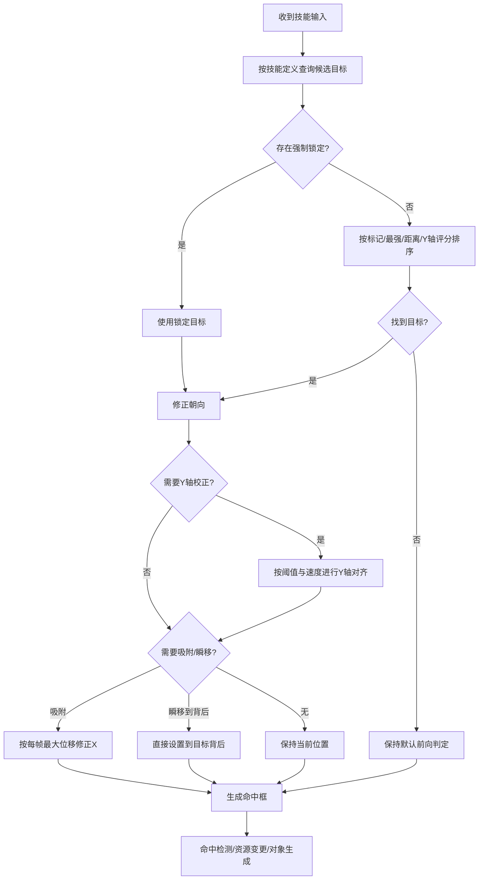
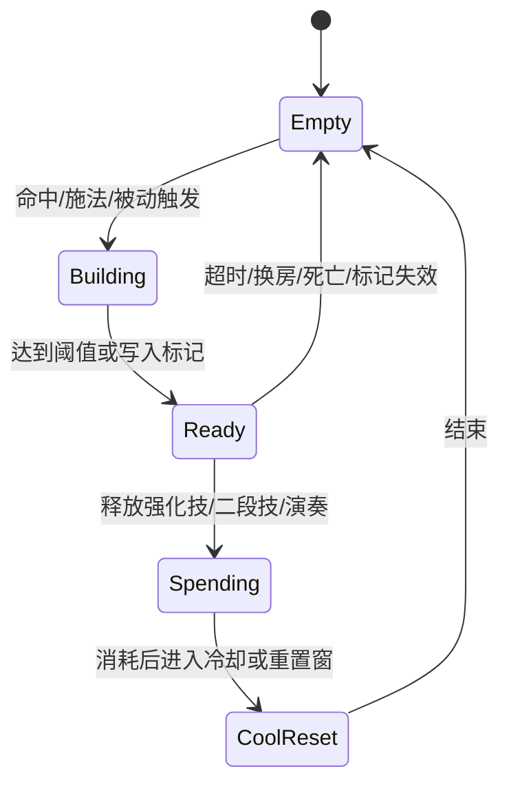
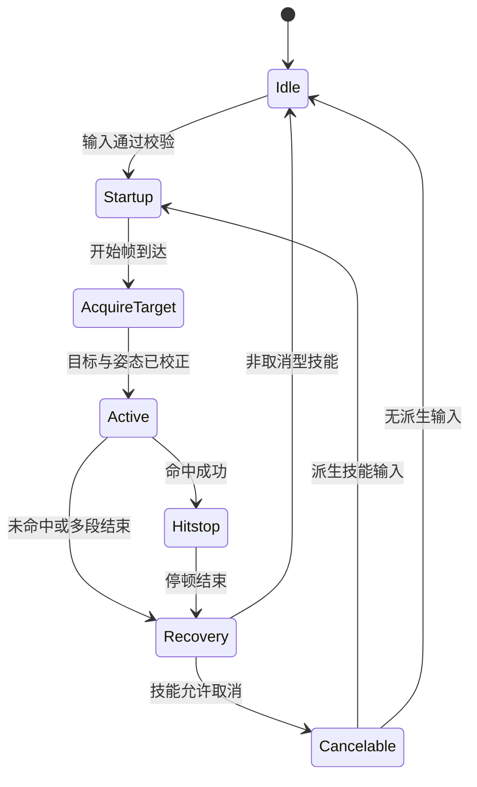
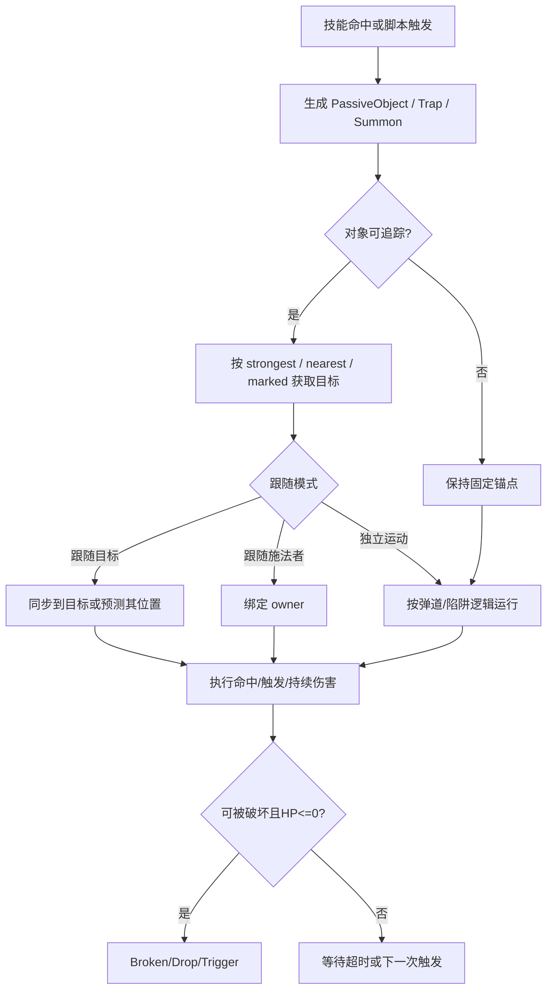

# DNF战斗系统复刻开发报告

## 执行摘要

这份报告给出的不是“泄露源码转写”，而是一个**基于官方公告 / Open API 字段 / 官方与权威社区技能页 / 公开可见 PVF 工具与脚本字段**重建出来的、可直接指导开发团队落地的 DNF 风格战斗系统实现方案。高置信结论有四点。

第一，DNF 的公开资料已经足以证明它的战斗核心不是“纯动画驱动碰撞”，而是**可调的 2.5D 战斗参数系统**：官方长期直接调整 **Y 轴攻击范围、Y 轴受击判定、Z 轴上段范围、追踪范围、最强目标后方移动、中心吸附/聚怪、是否可取消、施放时间与冷却**；Open API 也把 `consumeMp`、`coolTime`、`castingTime`、`chain`、`chain.resetTime` 作为正式字段暴露出来。换言之，开发上应把“技能行为”拆成**搜索、校正、位移、判定、资源、对象生成、取消、恢复**七个阶段，而不是把它写死在动画里。citeturn3search3turn8search0turn8search1turn18search0turn18search1turn18search3

第二，自动寻敌 / 吸附 / 朝向修正 / Y 轴校正并不是一个可有可无的“手感层”，而是 DNF 复刻成败的决定层。官方补丁与技能文本反复出现“Y轴攻击范围增加”“范围内最强目标后方移动”“追踪范围 500px / 800px”“使敌人被拉向中心”这一类表述，说明 **target acquire → target score → facing correction → Y snap → X absorb / teleport → hitbox resolve** 应该被实现成一条标准流水线。citeturn8search0turn18search0turn18search1turn18search6turn18search7turn18search10

第三，职业系统不能只做 MP。公开资料已经能看到至少五类职业机制：**通用 MP / 无色小晶块消耗、命中叠表资源、取消窗口资源、标记-背刺位移型机制、连锁/组合槽机制**。例如官方社区资料明确写到缪斯的“神兽/神兽计量（신수 게이지）”会在技能命中时增长，影舞者会对“最强目标”留下标记并移动到其背后，漫游/黑暗武士/Blitz 等职业则大量依赖取消、组合槽或形态切换。citeturn6search10turn18search9turn9search4turn18search5turn3search3

第四，若目标真是“1:1 复刻”，法律风险最高的不是算法，而是**直接复制商业数据、资源、文案、数值表、台服泄露端与私服代码**。公开仓库和论坛确实存在面向 entity["country","Taiwan","island east asia"] 版本 PVF 的 unpack/pack 工具，以及直接传播 serverfiles/client 的帖子；这些材料只能作为**技术现象与字段结构的风险提示**，不应被直接纳入产品仓库。更安全的路线是：**只保留 clean-room 提炼出的“字段定义、算法模式、量纲与验证方法”，所有数值重新测量与重建**。citeturn14view0turn12view0turn4search1turn13search4turn7search2

## 研究边界与证据等级

官方资料主要来自 entity["company","Neople","game developer"] / entity["company","Nexon","game publisher"] 的官网、更新公告与开发者文档；它们能确认**系统存在、字段名、技能描述、公开数值与补丁方向**。社区高可信资料主要来自 DFO World Wiki、韩服官方社区攻略帖与英文站点技能页；它们能补足**技能冷却、施放时间、消耗、部分职业机制**。中文技术博客与 GitHub 仓库则主要用于确认 **PVF 常见字段、单位与被业界广泛使用的解析方式**。citeturn7search2turn3search1turn3search3turn3search6turn16search2turn16search3turn11search0turn14view0turn12view0

下面这张表给出本报告对来源的使用方式。

| 来源类型 | 能确认什么 | 不能直接证明什么 | 采用策略 |
|---|---|---|---|
| 官方更新 / 官网 / API Docs | 字段名、技能描述、公开冷却、施放时间、Y 轴/追踪/取消/中心拉扯等机制存在 | 完整私有 hitbox 表、完整 startup/active/recovery 帧表 | 作为一手证据 |
| DFO World Wiki / 官方社区攻略 | 技能公开页数值、职业玩法、资源触发条件、武器差异 | 全职业精确内部算法 | 作为二手高可信补强 |
| 中文 PVF 技术博客 / GitHub 工具 | 字段量纲、脚本块格式、`[attack success]`、`[passive object]` 等工程模式 | 法律可用性、字段是否等于现行正式服最终语义 | 只提取字段与技术模式 |
| 泄露端 / 私服论坛 | 泄露事实、台服/私服生态存在 | 任何可直接商用的合法实现依据 | 只做合规风险提示 |

上表所涉事实分别来自官方站、Open API、社区技能页、PVF 技术文与公开工具仓库。citeturn7search2turn3search3turn16search2turn16search3turn11search0turn14view0turn4search1turn13search4

为了满足“中文主体、同时整合英文与韩文资料”的要求，下面列出几个最关键的跨语言锚点。

| 原文 | 翻译要点 | 对实现的意义 |
|---|---|---|
| 韩文：”**Y축 공격 범위가 증가합니다**”（Y轴攻击范围增加） | Y 轴攻击范围是可单独调参的 | 需要独立 `yRangePx`，不能只靠圆形半径 |
| 韩文：”**범위 내 가장 강한 적의 후방으로 이동**”（移动到范围内最强敌人的背后） | 可直接位移到范围内最强敌人的背后 | 需要 `TargetPolicy=Strongest` 与 `SnapPolicy=BehindTarget` |
| 英文 API 字段：`consumeMp`, `coolTime`, `castingTime`, `chain.resetTime` | 资源、冷却、施放时间、技能链重置时间是正式字段 | 设计数据表时必须有这些列 |
| 中文 PVF 示例：`[cool time]=10000 -> 10秒`、`[attack success]`、`[passive object]` | 冷却可按毫秒存储，命中后可触发被动对象 | 建议统一使用 ms / frame 双量纲并把 passive object 独立建模 |

以上锚点分别来自官方补丁、官方 API 文档与中文 PVF 技术文。citeturn8search0turn18search0turn3search3turn10search1turn11search0

## 公共战斗时空模型与数据层

DNF 官方英文站把游戏定义为“arcade-type belt-scrolling action game mixed with RPG elements”，这意味着它不是纯平面格斗，而是**横向 X 轴推进 + 纵深 Y 轴错位 + 部分上浮/落地 Z 轴判定**的 2.5D 清版动作模型。官方补丁又明确出现了“Y轴受击判定缩小”“Y轴攻击范围增减”“Z轴上段攻击范围增加”，因此工程上应把 X / Y / Z 三条轴拆开管理，而不是把角色当成单个 capsule 做一把梭。citeturn7search2turn8search8turn8search0turn18search1

建议的通用数据结构如下。这里的 `startup_fr / active_fr / recovery_fr` 是**实现所需内部字段**；公开资料能稳定验证的是 `cool_ms / cast_ms / consume_mp / cube_cost / chain_reset_ms`，而完整帧表通常需要录像逐帧回归。citeturn3search3turn16search2turn16search3turn16search10

```cpp
struct Vec2i { int x_px; int y_px; };
struct HurtBox { int halfW_px; int halfH_px; int zMin_px; int zMax_px; };
struct HitBoxDef {
    int xFront_px;
    int xBack_px;
    int yHalf_px;
    int zMin_px;
    int zMax_px;
    int startup_fr;
    int active_fr;
    int recovery_fr;
    int hitstopSelf_fr;
    int hitstopTarget_fr;
};

enum class TargetPolicy { None, Nearest, Strongest, Marked, ForcedLock };
enum class SnapPolicy   { None, FaceOnly, SnapY, AbsorbX, PullTargetToCenter, TeleportBehind };

struct SkillDef {
    int skillId;
    int cool_ms;
    int cast_ms;
    int chainReset_ms;
    int consumeMp;
    int consumeCube;
    TargetPolicy targetPolicy;
    SnapPolicy snapPolicy;
    int trackingRange_px;
    int searchFront_px;
    int searchBack_px;
    int ySearch_px;
    int ySnapThreshold_px;
    int ySnapSpeed_px_per_fr;
    int xAbsorbMax_px_per_fr;
    bool basicCancelable;
    bool ignoreSuperArmorMove;
};

struct CombatActor {
    int id;
    Vec2i pos;
    int z_px;
    int facing; // -1 left, +1 right
    HurtBox hurt;
    int hp;
    int mp;
    uint64_t stateFlags;
    int targetId; // soft lock / forced lock
};
```

如果未指定引擎，建议统一使用 **像素 px、毫秒 ms、逻辑帧 fr** 三种量纲：渲染层可变帧率，战斗层固定逻辑帧；冷却和施放时间以 ms 存储，对外换算成 UI 秒数；判定盒、追踪范围、Y 轴窗口一律用 px，使技能表能直接表达 `500px`、`800px` 这种官方公开量。官方资料已经公开过 `500px`、`800px` 的追踪范围实例，因此这套量纲是与现成公开文本兼容的。citeturn18search6turn18search7

对引擎的实现建议如下：在 entity["company","Unity","engine vendor"] 中，战斗层放在 `FixedUpdate` 或自建 fixed tick（推荐 60Hz），渲染与骨骼动画只接收战斗层发出的“事件”和“校正后的姿态”；在 entity["company","Epic Games","unreal engine"] 中，建议用 Ability/Gameplay Task 或自建组件把 `AcquireTarget / CorrectPose / SpawnHitbox / ApplyResource / SpawnObject` 拆成能力阶段，绝不要把所有逻辑藏进 Animation Blueprint 的 notify 里。这个部分是实现建议，不是对原作内部代码的断言。

## 自动寻敌、吸附、朝向修正与 Y 轴校正

### 功能描述

官方补丁和技能文案已经证明以下行为真实存在：**技能会选择“范围内最强敌人”作为目标，会把角色移动到目标后方，会把敌人拉向技能中心，会对 Y 轴范围单独增减，会在特定技能上启用追踪功能，并会因为追踪或 Y 轴位移而产生 bug 修复**。因此 1:1 复刻时，这一层应该被理解为“技能判定前的姿态校正系统”，而不是“命中后补救”。citeturn18search0turn18search1turn18search3turn18search6turn18search7turn18search10

### 核心算法

下面给出一个能覆盖大多数 DNF 风格技能的通用算法。它不是泄露代码，而是基于公开现象的 clean-room 复原。

```pseudo
function ResolveSkillTargetAndCorrection(caster, skill, actors):
    candidates = QueryActors(
        team = enemyOf(caster),
        rect = OrientedRect(
            origin = caster.pos,
            facing = caster.facing,
            front = skill.searchFront_px,
            back  = skill.searchBack_px,
            yHalf = skill.ySearch_px
        )
    )

    candidates = Filter(candidates, a =>
        a.isAlive &&
        !a.isUntargetable &&
        OverlapZ(caster, a, skill)
    )

    if skill.targetPolicy == ForcedLock and caster.targetId valid:
        target = actor(caster.targetId)
    else:
        target = MaxScore(candidates, a =>
            scoreMarked(a, caster) +
            scoreStrongest(a) +
            scoreNearestY(a, caster) +
            scoreFacing(a, caster) +
            scoreDistance(a, caster)
        )

    if target == null:
        return DefaultForwardPose(caster)

    if abs(target.x - caster.x) > FACE_DEADZONE:
        caster.facing = sign(target.x - caster.x)

    if skill.snapPolicy includes SnapY:
        dy = target.y - caster.y
        if abs(dy) <= skill.ySnapThreshold_px:
            caster.y += clamp(dy, -skill.ySnapSpeed_px_per_fr, skill.ySnapSpeed_px_per_fr)

    if skill.snapPolicy includes AbsorbX:
        dx = target.x - caster.x
        caster.x += clamp(dx, -skill.xAbsorbMax_px_per_fr, skill.xAbsorbMax_px_per_fr)

    if skill.snapPolicy == PullTargetToCenter:
        if !target.superArmor || !skill.ignoreSuperArmorMove:
            PullTargetTowardSkillCenter(target)

    if skill.snapPolicy == TeleportBehind:
        caster.x = target.x - caster.facing * target.hurt.halfW_px
        caster.y = target.y

    return CorrectedPose(caster, target)
```

上面的 `scoreStrongest(a)` 建议按 **Boss > Elite > Normal > Summon > Breakable** 排序，再用当前 HP 或威胁权重打破平局；这是对”가장 강한 적（最强敌人）”这一官方文本最稳妥的工程解释。`SnapY` 和 `AbsorbX` 必须拆开，因为官方资料已经反复说明 Y 轴范围、Y 轴位移、追踪功能和中心拉扯是独立可修正的。citeturn18search0turn18search6turn18search7turn8search0turn18search1turn18search3

### 流程图



### 边界条件与异常处理

当目标处于霸体、不可抓取、Boss 锚定、场景不可位移状态时，**允许命中但禁止强制位移**；这一点与官方“部分技能可聚怪，但霸体敌人不能被移动”“不可抓取敌人也可聚怪但语义不同”的补丁方向一致。citeturn8search0turn7search12

追踪技能必须防御三类异常：一是**无目标时错误瞬移**；二是**目标死亡或换阶段后继续追踪旧 ID**；三是**客户端已预测目标，但服务器已重定向到别的敌人**。官方近年的修复公告里反复出现“追踪功能异常”“位置异常移动”“前方乱射速度异常”之类问题，这说明实现上必须把 `targetId` 和 `correctionDelta` 作为严肃的同步数据，而不是本地临时变量。citeturn18search3turn18search5turn18search8

### 性能与网络同步

建议服务器权威拥有：**目标筛选、最终 targetId、最终 facing、最终校正位置、真正生效的 hitbox 参数**。客户端只预测输入、朝向和局部吸附，用于即时手感。对四人副本而言，每帧都全图扫描会很浪费；应使用**房间分桶 / 九宫格 / 行列索引**先做粗筛，再根据技能前向矩形和 `trackingRange_px` 做细筛。因为官方公开文本中出现过 `500px`、`800px` 的追踪范围，所以查询半径应直接读技能表，而不是写死全局常量。citeturn18search6turn18search7

### 测试用例与指标

| 用例 | 期望 |
|---|---|
| 前方 3 个目标，Y 错位分别为 8 / 24 / 60 px | 仅前两个进入 `SnapY` / `Acquire` 候选，第三个不被吸附 |
| 同一矩形中 Boss 与小怪并存 | `Strongest` 模式稳定选择 Boss |
| 目标进入霸体 | 依然允许命中，但 `PullTargetToCenter` 不生效 |
| 目标在释放中死亡 | 技能不再瞬移到空位置，退回默认前向版本 |
| 80ms RTT + 2% 丢包 | 目标校正后视觉误差不超过 1/6 身位，最终命中以服务器为准 |

可验证指标建议：**错误选敌率 < 0.5%**、**Y 轴校正误差 ≤ 8px**、**目标重定向引起的服务器回滚距离 ≤ 24px**、**追踪技能在 1000 次压力回放中不出现“空瞬移/穿背”**。这些 KPI 是工程建议值。

## 角色职业资源与职业机制

### 功能描述

官方 Open API 已正式提供 `consumeMp`、技能链与重置时间等字段；官方与官方社区资料又能看到“命中增长的缪斯资源”“影舞者标记并移到背后”“Rogue 的 Hit End 追加打击”“Blitz 的 Activation 形态强化”“Dark Knight 的 combo slot/扩展槽异常修复”。因此系统设计必须允许一个职业同时拥有：**全局资源、职业资源、形态 Buff、标记、取消窗口、组合链**。citeturn3search3turn6search10turn18search9turn17search21turn18search5turn9search4

### 资源模型

```cpp
enum class ResourceKind {
    MP, Cube, Gauge, Stack, Mark, ComboSlot, FormBuff, Rhythm
};

struct ResourceDef {
    ResourceKind kind;
    int maxValue;
    int initValue;
    int decayPerSec;
    bool resetOnRoomChange;
    bool resetOnDeath;
    bool uiVisible;
};

struct ResourceRule {
    EventType event;
    int skillIdFilter;
    int delta;
    Condition expr;
};

struct ClassMechanicDef {
    vector<ResourceDef> resources;
    vector<ResourceRule> gainRules;
    vector<ResourceRule> spendRules;
    vector<ResourceRule> transformRules; // e.g. hit -> mark, mark -> teleport
};
```

### 职业资源与机制对照表

| 机制原型 | 公开证据 | 建议数据字段 | 推荐实现 |
|---|---|---|---|
| 通用 MP 消耗 | API 文档公开 `consumeMp` | `mpCost` | 技能请求时预扣，服务器校验 |
| 无色小晶块消耗 | 多个技能页明确写明 consumes 1 / 5 / 15 Clear Cube Fragments | `cubeCost` | 与 MP 平行校验 |
| 命中叠表资源 | 缪斯：”神兽/神兽计量（신수 게이지）…技能命中时增长” | `gaugeCur/max`, `gainOnHit` | OnHit 事件加表，阈值触发演奏/强化 |
| 追加输入 / 取消型资源 | Rogue 以 Hit End 为职业核心；大量职业支持 Basic Attack Cancelable | `cancelWindowFr`, `followupSkillId` | 动画事件打开取消窗，命中或输入满足时转派生 |
| 标记‑背刺位移 | 影舞者：对最强敌人留下标记，再次施放移到背后 | `markTargetId`, `markExpireMs`, `snapPolicy` | 标记存 targetId，二段技能消费标记并 `TeleportBehind` |
| 形态强化 / 组合槽 | Blitz Activation、Dark Knight combo/扩展槽 | `formState`, `comboSlot[]`, `chainResetMs` | 技能树外再建“形态层”和“槽位层” |

上表的信息整合自官方 API、官方社区攻略和 DFO World 技能页。citeturn3search3turn16search3turn16search10turn6search10turn6search2turn18search9turn17search21turn18search5

### 通用资源算法

```pseudo
function CanCast(actor, skill):
    return actor.mp >= skill.consumeMp
       && actor.cube >= skill.consumeCube
       && CheckClassSpecificPreconditions(actor, skill)
       && CooldownReady(actor, skill)

function OnSkillCast(actor, skill):
    actor.mp   -= skill.consumeMp
    actor.cube -= skill.consumeCube
    ApplyRules(actor, event = OnCast, skill)

function OnSkillHit(actor, skill, target):
    ApplyRules(actor, event = OnHit, skill, target)
    OpenCancelWindowIfConfigured(actor, skill)

function OnTick(actor, dt):
    ForEachResource(actor, r => r.cur = max(0, r.cur - r.decayPerSec * dt))
    ResetExpiredMarksAndForms(actor)
```

当职业机制与自动寻敌耦合时，推荐把“资源变化发生在什么时候”固定下来：**OnCast 扣通用资源 → Startup 中确定目标 → Active 命中后加职业资源 / 写标记 → Hitstop 期间决定是否开取消窗**。这样才能避免联机下出现“本地已加资源、服务器未命中”的分歧。

### 状态机



### 边界条件、性能与测试

职业资源最容易出问题的地方不是“数值”，而是**时序**。官方社区已经明确提到某些取消/追加打击会因为高攻速、帧掉落或网络卡顿异常触发，这说明取消窗和命中窗必须以**逻辑帧**而不是渲染帧管理。citeturn6search5turn9search4

测试建议至少覆盖：**超高速攻速下的取消窗、断线重连后的资源回放、目标死亡时的标记消费、形态 Buff 结束前后的一帧边界、多人同屏时资源 UI 与服务器状态一致性**。验证指标建议是：**职业资源反序列化后一致率 100%**、**取消窗在固定 tick 回放下结果一致率 100%**、**所有可重播日志在 100 次 deterministic replay 中无分叉**。

## 武器类型、攻击距离与技能时序

### 功能描述

DNF 的武器差异是“数值 + 动作 + 射程 + 资源成本”的组合，不只是面板攻击力。公开资料表明：光剑、短剑、巨剑/大剑、拳套、手炮、法杖、魔杖、自动手枪、长矛/棍棒等武器在**攻击速度、施放速度、命中率、基础射程、近战/远程适性**上差异很大；Open API 与社区资料还明确区分了 `weapon class` 与 `weapon type`。citeturn2search2turn4search7turn17search1turn17search11turn17search16turn17search22turn17search26

### 武器类型比较表

下表里的“建议基础 ReachPx”是**工程起步值**，不是官方公开绝对值；公开可证的是“相对速度/相对射程/附加修正”。

| 武器类 | 公开描述 | 建议基础 ReachPx | 速度/附加修正 |
|---|---|---:|---|
| 光剑 | Slayer 武器里攻速快；示例页有 `Attack Speed +2% / Casting +3% / Hit Rate -1%` | 150 | `attackSpeedMul=1.08` |
| 短剑 | Slayer 武器里魔攻高、攻速中上 | 138 | `attackSpeedMul=1.02` |
| 巨剑 / Zanbato | “最慢，但有射程优势” | 172 | `attackSpeedMul=0.90` |
| 拳套 / Knuckle | `Very Fast`，物理技能 MP -5% | 118 | `attackSpeedMul=1.12`, `physMpMul=0.95` |
| 自动手枪 / Auto Gun | 高魔攻、快；多用于机械系 | 160 | `attackSpeedMul=1.06` |
| 手炮 / Hand Cannon | 物攻最高，但速度和射程都差 | 145 | `attackSpeedMul=0.82` |
| 魔杖 / Rod | 物理与近战范围弱，但攻速很快 | 96 | `attackSpeedMul=1.10` |
| 法杖 / Staff | 攻速慢、近战范围差 | 92 | `attackSpeedMul=0.88` |
| Pole | “effectiveness at close range” | 126 | `attackSpeedMul=1.00` |
| Spear（斗萝职业特例） | Battle Mage 的 Spear 可给部分技能 `attack range +20%` | 基础值×1.20 | `rangeScalar=1.20` |

这些“相对差异”来自 DFO World 武器页与职业武器精通页。citeturn17search1turn17search11turn17search14turn17search16turn17search17turn17search22turn17search26turn17search9turn17search2

建议的命中框计算公式如下：

```pseudo
effectiveReachPx =
    weapon.baseReachPx
  * skill.rangeScalar
  * mastery.rangeScalar
  * option.rangeScalar
  * vp.rangeScalar

effectiveCastMs =
    skill.baseCastMs / actor.castSpeedMul

effectiveRecoveryFr =
    Round(skill.baseRecoveryFr / actor.attackSpeedMul)
```

如果技能明确写了“攻击范围与武器类型无关”，就把 `weapon.baseReachPx` 从该技能的公式中剔除，直接使用技能固有范围。英文技能页已经给出 Soul Bender 的 `Ghost Slash` 是这一类的实例。citeturn16search0

### 技能冷却与施放时间样表

| 技能 | Casting Time | Cooldown | 额外资源/说明 |
|---|---:|---:|---|
| Moonlight Slash | Instant | 4 sec | Soul Bender 可 basic attack cancel |
| Ghost Step | Instant | 6 sec | 命令施放可减 MP/CD |
| Ghost Slash: Overdrive | Instant | 20 sec | consumes 1 cube |
| Ghost Slash: Abyss | Instant | 30 sec | consumes 1 cube, immobilize 2 sec |
| Ghost: Quad-slash | Instant | 8 sec | 命令施放可减 MP/CD |
| Ghost 7: Furious Blache | 0.5 sec | 140 sec | consumes 5 cube |
| Descent of the Nine: Ghost Gate | Instant | 290 sec | consumes 15 cube |
| Activation | Instant | 5 sec | Attack Speed +10%, Move Speed +10% |

这些数值来自 DFO World 公开技能页与官方 API 语义。citeturn16search2turn16search3turn16search4turn16search5turn16search8turn16search10turn16search11turn17search21turn3search3

### 技能生命周期状态机



### 边界条件与测试

需要特别处理三类技能。第一类是“**与武器射程无关**”的独立技能；第二类是“**受武器或精通影响的技能**”；第三类是“**受形态系统或 VP 改造后改变了 casting/attack time 的技能**”。官方英文 VP 指南明确写到“some options are balanced to account for casting and attack time”，说明你的技能表必须允许在同一 `skillId` 下切换**不同生命周期参数集**，而不能只挂一个固定 cooldown 和固定动画长度。citeturn13search5

## 物件、机关与可破坏物战斗交互

### 功能描述

公开 PVF 技术文已经展示了命中后脚本块可以触发 `[passive object]`；官方更新又能看到“某些召唤/伙伴会追踪范围内最强敌人”“RX-78 Landrunner 这类对象在决斗场有独立 HP 问题”“部分追踪对象的行为会异常”。这说明 DNF 风格战斗里，**技能生成对象、对象拥有自己的 AI / HP / 生命周期 / 跟随模式 / 阵营 / 追踪策略** 是必须独立建模的。citeturn11search0turn18search3turn18search10

### 数据结构

```cpp
enum class CombatObjectType { PassiveObject, Projectile, Trap, Summon, Breakable, Mechanism };

struct CombatObjectDef {
    int objectId;
    CombatObjectType type;
    int ownerId;
    int teamId;
    int hp;
    int lifeMs;
    int trackingRange_px;
    TargetPolicy targetPolicy;
    int followMode; // 0 follow target, 1 follow caster
    bool damageable;
    bool grabImmune;
    bool canBeDestroyed;
    int triggerMask;
};
```

中文 PVF 示例已经明确给出：`[passive object] 48074 0 0 0 65 0` 这类块可以指定技能/对象、坐标、等级以及“跟随目标 / 跟随释放者”的模式，因此 `CombatObjectDef` 至少要有 `followMode`、`lifeMs`、`ownerId` 和 `targetPolicy`。citeturn11search0

### 通用算法

```pseudo
function SpawnPassiveObject(caster, skill, hitResult):
    obj = NewObject(skill.passiveObjectId)
    obj.ownerId = caster.id
    obj.teamId  = caster.team
    obj.pos     = ResolveSpawnPos(skill, caster, hitResult)
    obj.followMode = skill.followMode
    obj.targetPolicy = skill.objectTargetPolicy
    obj.lifeMs  = skill.objectLifeMs
    obj.hp      = skill.objectHp
    Register(obj)

function UpdateObject(obj, dt):
    if obj.targetPolicy != None:
        obj.targetId = AcquireByPolicy(obj, obj.trackingRange_px)

    if obj.followMode == FollowTarget and obj.targetId valid:
        obj.pos = TrackTarget(obj, actor(obj.targetId))

    if obj.followMode == FollowCaster:
        obj.pos = TrackCaster(obj, actor(obj.ownerId))

    if obj.damageable and obj.hp <= 0:
        EnterBrokenState(obj)

    if obj.lifeMs expired:
        Despawn(obj)
```

### 流程图



### 对象、机关、破坏物的交互约束

实现上建议把战斗对象分四类。

| 类型 | 是否受伤害 | 是否可追踪目标 | 是否吃吸附/Y 校正 | 备注 |
|---|---|---|---|---|
| Passive Object / Projectile | 视定义 | 常见 | 通常否 | 由技能生成，最像“技能的延伸体” |
| Summon / Partner | 常见 | 常见 | 可选 | 需要 owner/target 同步 |
| Breakable | 是 | 否 | 否 | 只吃伤害，不参与最强敌人优先级 |
| Mechanism | 视脚本 | 可能 | 通常否 | 开关、炮台、阶段机关 |

官方更新里已经出现“Palke 追踪一定范围内最强敌人”“Landrunner 的 HP 在决斗场异常”“某些追踪对象异常”的实例，所以对象层不能偷懒地塞进普通 hitbox。citeturn18search3turn18search10

## 网络同步、性能、测试与合规

### 网络与性能建议

官方更新长期修正“追踪异常、取消异常、异常位移、Y 轴移动异常、前方乱射速度异常”，说明 DNF 风格战斗**对时序与同步非常敏感**。推荐使用：**服务器权威 + 客户端输入预测 + 命中/寻敌短窗校正** 的混合模型。最小同步集合应包括：`inputSeq`、`skillId`、`localFacing`、`finalTargetId`、`correctionDelta(x,y)`、`resourceDelta`、`spawnedObjectSeed`、`stateFlags`。citeturn18search3turn18search5turn8search4

性能预算建议如下：
在 60Hz 逻辑帧下，把“目标查询”限制为 **技能触发时一次粗筛 + Active 开始时一次精筛**；多段技不要每段全图扫描，而应缓存 `lockedTargetId` 并只在丢失目标时重查。对象层采用**按房间分桶**与**仅在激活半径内更新**。在四人副本中，经验上可以把预算控制在：**每 tick 战斗查询 ≤ 0.5ms / 玩家、对象更新 ≤ 1.0ms / 房间、快照广播 10~20Hz**。这是工程建议值。

### 回归测试矩阵

| 子系统 | 关键用例 | 可验证指标 |
|---|---|---|
| 自动寻敌 / 吸附 / Y 校正 | Boss+杂兵混合、霸体目标、空目标、背刺瞬移 | 选敌误差 <0.5%，Y 校正误差 ≤8px |
| 职业资源 | 掉帧、高攻速、取消窗、重连回放 | 资源一致率 100% |
| 武器与距离 | 不同武器同技能、精通加成、VP 改形态 | 射程回归误差 ≤8px；施放误差 ≤1 fr |
| 物件/机关 | 追踪对象、召唤物 HP、可破坏物 OnBreak | 1000 次回放无悬空对象 / 无孤儿 targetId |
| 网络同步 | 40/80/120ms RTT，2% 丢包 | 无永久 rubber-band；服务器回滚 ≤24px |

### 法律风险与规避建议

如果你的目标是“完全 1:1”，最大的风险来自 **著作权、合同/EULA、商标、商业秘密与反规避**，而不是算法本身。官方站点明确存在 Terms / EULA；同时，公开网络上也确实能找到“Taiwan PVF unpack/pack 工具”和直接发布 private server files / client 的帖子。把这些材料直接拉进项目仓库，会显著提高法律风险。citeturn7search2turn14view0turn4search1turn13search4

建议的规避路线是：

| 风险点 | 风险等级 | 建议 |
|---|---|---|
| 直接使用官方美术、音频、UI、剧情文本 | 高 | 完全禁用 |
| 直接复制泄露端/私服端代码与表 | 高 | 完全禁用 |
| 直接搬运 PVF 原始技能表、对象 ID、字符串 | 高 | 只做内部对照，不入库、不出包 |
| 参考官方公告、Open API 字段名、补丁语义 | 低 | 推荐 |
| 参考公开社区技能页与录像逐帧回归 | 中 | 推荐，但用自有表重建 |
| 复刻“手感等价、规则结构相似”但资产与数值重建 | 相对可控 | 最优路径 |

最可行的商业化方案不是“复制数据”，而是：**复刻战斗结构与响应时序，重建技能表与资源表，自研美术音频和世界观，并对所有高风险字段做 clean-room 文档化。**

### Open questions / limitations

这份报告已经能直接指导战斗系统工程落地，但仍有三类公开资料缺口需要你在项目里补齐。

一是**完整的逐技能 startup / active / recovery / hitstop / hurtstun 帧表**。公开资料稳定可拿到的是 cooldown、castingTime、资源消耗、追踪范围、部分持续时间，而不是全量帧表；这部分必须通过**60fps 甚至更高帧率录像逐帧测量**补完。citeturn3search3turn16search2turn16search3turn16search10

二是**全职业资源总表**。公开资料足以建立机制分类和实现框架，但如果你要做到“所有职业 1:1”，仍需做一轮 `OpenAPI + 技能页 + 录像验证` 的全职业采集。citeturn3search3turn6search10turn18search9turn17search21

三是**武器绝对射程 px 标定**。公开来源更多给“相对远近/快慢/加成”，而不是统一的绝对像素表。因此最稳妥的工程流程是：先用本报告的 `ReachPx` 起步值搭系统，再用样本技能和录像回归把每类武器收敛到目标手感。
