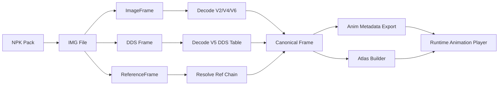
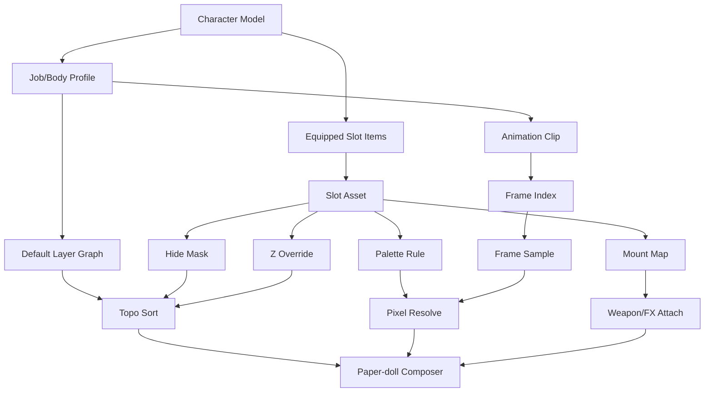

# DNF 美术系统 1:1 复刻实现研究报告

## 执行摘要

可被高可信度证实的核心事实有四点。其一，DNF 的角色外观资源不是“单张成品图”，而是 **NPK 容器 → IMG 文件 → 帧记录** 的分层结构；普通图像帧记录保存类型、压缩方式、宽高、数据长度、`x/y` 绘制偏移与 `frameWidth/frameHeight`，引用帧则单独保存引用关系。其二，2016 年后的装扮主力格式转向 **IMGV4 / IMGV6 调色板索引图**，而技能特效大量转向 **IMGV5 的 DDS 块图**。其三，官方韩文指南确认渲染语义上至少存在 **11 个 Avatar 槽位**，即 머리（头发）/모자（帽子）/얼굴（脸部）/목가슴（颈胸）/상의（上衣）/피부（皮肤）/허리（腰部）/하의（下装）/신발（鞋子）/무기（武器外观）/오라（光环）；但英文全球指南把可购买的 Look Avatar 叙述为 **9 Pieces**，说明“商城包装件数”和“底层渲染槽位”并不完全等价。其四，官方 Web Avatar / Showroom 团队明确采用了 **抽取元数据后在服务端合成** 的路径，而不是预烘焙所有组合；截至 2018 年，官方对接的规模已经达到约 **6.9 万件 Avatar、每件 3 层基础文件、动作约 150 帧**，其服务端吞吐经优化后从 **50 组/秒** 提升到 **881 组/秒**。citeturn33view0turn15view0turn16view0turn16view1turn42view0turn46view0turn47view0turn24view0

对开发团队而言，这意味着最接近原作的实现方式**不是**“把每套外观预合成成完整大图”，而是：保留原始资源的 **frame-level 偏移语义**、以 **slot-based paper doll compositor** 做运行时组合、以 **palette-aware 染色** 覆盖装扮换色、再用 **per-item hide mask + z-order override** 处理帽子/头发/披风/武器等局部例外。官方公告中已经能看到大量“某职业某帽子隐藏头发/脸部”“某披风与脸部或武器的图层顺序异常而后续修正”的案例，这直接说明仅靠一张全局固定层级表不足以 1:1 复刻。citeturn29search16turn30search2turn30search4turn30search5turn30search6turn30search7turn30search9turn31search9

因此，本报告给出的落地方案是：**源资源层尽量复刻 NPK/IMG 的数据语义，运行时层改写为现代引擎可维护的 Canonical JSON + Atlas/DDS + Rule Graph**。这样既能最大化保留 DNF 的原始播放逻辑、偏移、换色与复用方式，又能避免把带法律风险的原始客户端包结构直接带进 shipping build。相关法律边界也很明确：官方 EULA 明确保留全部知识产权，并限制复制、修改、派生、数据拦截、未授权客户端改造等行为；Nexon 的统一条款还明确点名禁止逆向、反编译和反汇编。因此，本报告只讨论 **合法合规的“理解与重建”路径**，不提供获取泄露资源或绕过保护的操作指引。citeturn44view0turn43search3turn43search5

## 落地步骤与验收标准

就可核验性而言，应优先采用开发商 entity["company","Neople","game studio, south korea"] /发行体系 entity["company","Nexon","game publisher, japan"] 的官方指南、Showroom/Image API、开发者访谈，再用带可运行代码的社区逆向仓库验证容器与帧字段，最后才把论坛帖与任何“旧服/泄露样本”结论当作旁证。官方 Showroom 的工程分享证明：DNF 美术系统真正难点不在“画图”，而在 **海量分件 + 元数据组合 + 规则例外 + 吞吐优化**。citeturn24view0turn24view1turn45view0turn28view3turn42view0

| 步骤 | 交付物 | 验收标准 | 证据依据 |
|---|---|---|---|
| 建立统一术语层 | `slot/job/bodyType/dye/zRule` 统一字典 | 同时覆盖韩文 11 槽位、英文 9-piece 商城语义、2018 Showroom 的 10 槽位网页配置 | 韩文官方槽位与英文差异、Showroom 槽位说明 citeturn46view0turn47view0turn32view0 |
| 实作只读导入器 | `NpkReader`、`ImgReaderV2/V4/V5/V6`、`FrameResolver` | 正确解析 NPK 头、IMG 帧表、引用帧、V4/V6 调色板、V5 DDS 表；不能对引用环死循环 | NPK/IMG 结构、引用帧与 V4/V5/V6 解析 citeturn11view0turn33view0turn15view0turn16view0turn16view1turn16view2turn42view0turn40view6turn40view7 |
| 建立 Canonical 资源层 | `atlas.png/.dds + anim.json + slot_rules.json` | 源资源与引擎资源解耦；保留 `type/compressed/x/y/frameWidth/frameHeight/ref` 语义 | 帧字段与类型常量 citeturn39view0turn40view0turn40view1turn40view2turn42view0 |
| 实作动作播放器 | `AnimationClip + per-frame duration + mirror policy` | 引用帧复用正确；不把 `x/y` 误当世界坐标；镜像后挂点与碰撞盒同步翻转 | IMG 帧字段只含图像与偏移，不含碰撞盒 citeturn33view0turn42view0 |
| 实作纸娃娃组合器 | `slot order DAG + hideMask + dyeRule + zOverride` | 能复现官方已知“帽子隐藏头发/脸”“上衣隐藏下装”“披风与武器/脸部排序修正”等 case | 官方指南与商城公告、更新修正 citeturn46view0turn47view1turn29search16turn30search4turn30search5turn30search6turn30search9turn31search9 |
| 实作装备与特效层 | `weapon socket + fxBack/fxFront + blend mode` | 武器动作与手部帧同步；V5 DDS 裁切区域正确；特效不破坏主体排序 | 武器/skin 字段、V5 DDS 帧与效果制作分工 citeturn28view3turn40view6turn45view0turn13view0 |
| 打包与热更 | `manifest.json + content hash + diff pack` | shipping build 不直接依赖原始 NPK；组合缓存命中后零解压、零重排 | 官方 Image API/Showroom、NPK 校验与索引结构 citeturn24view0turn24view1turn11view0turn16view3 |

**建议的程序美术清单**

- [ ] 为每个职业/性别/体型建立 **标准槽位名、默认层级、例外遮挡规则表**。
- [ ] 为每个动作建立 **统一基准锚点**，并在导出时把源 `x/y` 转成引擎可用的 `drawOffset/pivot`。
- [ ] 对可染色部件优先使用 **调色板重映射**，不要先做 RGB Hue Shift。
- [ ] 为帽子、披风、特殊上衣、整套头套建立 **局部遮罩或硬隐藏规则**。
- [ ] 为武器和披风建立 **前后通道**，不要假设“武器永远在最前”。

**建议的客户端工程清单**

- [ ] 导入器必须支持 **V2/V4/V5/V6**，并保留引用帧。
- [ ] 运行时必须支持 **slot DAG + zOverride + hideMask**，不能只靠固定数组排序。
- [ ] 首次合成与缓存命中路径分离；缓存 key 至少包含 `job/bodyType/slotItems/dye/palette/direction/frame`。
- [ ] 预览系统要提供与官方 Showroom 类似的 **随机搭配、角色导入、染色预览、透明背景导出** 能力，以便程序美术自验。官方网页与 App 版 Showroom 已证明确有这些需求。citeturn32view0turn32view1

## 来源分级与可信度

本次研究可直接用于实现的证据，大致可按以下优先级排序：**官方客户端派生的公开接口/官网指南/Showroom 工程分享 > 官方开发者访谈 > 带可运行代码的社区逆向仓库 > 论坛/商城公告/补丁修复记录 > 任何无法复核来源链条的泄露样本结论**。之所以把商城公告和补丁修复也列入证据，是因为 DNF 的纸娃娃问题大量以“某帽子隐藏某槽位”“某披风与某武器排序异常”的形式公开暴露出来，它们对复原 runtime 规则反而非常有价值。citeturn24view0turn45view0turn46view0turn30search5turn31search9turn42view0

| 语言 | 代表来源 | 能直接拿到的关键参数 | 与其他语言资料的差异 | 可信度 |
|---|---|---|---|---|
| 中文 | `npk-api` 系列文章与代码仓库、历史英文论坛摘要 citeturn11view0turn33view0turn15view0turn16view0turn16view1turn13view0turn39view0turn42view0turn40view6 | NPK 头、IMG 帧字段、V4/V5/V6 差异、引用帧、DDS 表、调色板上限 | 参数最细，最接近程序实现；但多属社区逆向，需与官方资料交叉验证 | A- |
| 韩文 | 官网基础指南、商城公告、更新修复、官方采访 citeturn46view0turn46view1turn32view0turn32view2turn29search16turn30search4turn30search5turn30search6turn30search9turn31search9turn45view0 | 11 槽位、染色规则、套装/克隆语义、职业/单件遮挡例外、团队分工 | 规则最权威，但几乎不给底层二进制字段；更适合做“行为验收” | A |
| 英文 | 官方 Global Guide、Open API/Developer Glossary、Image API 公告 citeturn47view0turn47view1turn28view3turn24view1 | `slotId/slotName/slotNo` 术语、`cloneAvatarName`、`skin` 字段、Image API 尺寸、9-piece Look Avatar 语义 | 更适合作为现代接口命名参考；与韩文的 11 槽位存在“包装 vs 渲染”口径差异 | A |

本次公开检索**没有找到**能直接证明 DNF PC 客户端美术 runtime 细节的官方论文或专利，因此“论文/专利”这一层级在排序中保留，但不作为本报告的核心证据。任何关于旧服、台服、泄露客户端的说法，如果**不能同时被官方行为资料和可运行解析代码印证**，都不应进入生产实现的“强真值集”。

## 角色基础帧图系统

DNF 的源资源层，最值得直接复刻的是“**容器与帧语义**”，而不是它历史上那套面向游戏加载器的原样包格式。NPK 是外层包：文件头固定字符串为 `NeoplePack_Bill`，后含 IMG 数量；每个 IMG 索引占 **264 字节**，记录偏移、大小和经异或混淆的名字；索引之后有 **32 字节 SHA-256 校验**；真正的 IMG 数据则顺序拼接在后。这个结构解释了两件事：一是 DNF 的资源天然是“以 IMG 为单元”进行组织和替换；二是原始包更偏向客户端完整性校验，不适合作为现代引擎的最终 shipping 结构。citeturn11view0turn16view3

IMG 层真正决定了基础帧图系统的实现方式。社区可运行解析代码与格式文档一致指出：普通图片帧记录包含 **`type`、`compressed`、`width`、`height`、`length`、`x`、`y`、`frameWidth`、`frameHeight`**；引用帧只保存 **`reference`**；V5 特效帧额外带 **`ddsIndex` 与 `left/up/right/down` 裁切字段**。从实现角度看，`x/y` 不应被理解为世界锚点，而更接近“此图在逻辑帧域中的绘制起点”；`frameWidth/frameHeight` 则是该逻辑帧的外包围画布。也正因为如此，公开来源里看不到碰撞盒、命中盒字段——它们更可能跟随动作/技能逻辑表，而不是跟随 IMG 存储。citeturn33view0turn39view0turn40view0turn40view2turn42view0

### 原始格式到运行时格式的映射表

| 原始层级 | 已证实字段/行为 | 运行时应如何映射 |
|---|---|---|
| NPK | 包头、IMG 索引、SHA-256 校验 | 只在导入链中保留；shipping 用 manifest + content hash 替代 |
| IMG 头 | `Neople Img File\0`、version、frameCount | 导出为 `source.version` 与 `source.frameCount` |
| 普通帧 | `type/compressed/width/height/length/x/y/frameWidth/frameHeight` | 导出为 `rect + drawOffset + logicalFrameSize + sourceType` |
| 引用帧 | 指向另一帧，代码侧只允许后继帧引用前面帧 | 导出为 `ref`；运行时必须解引用且防环 |
| V4/V6 | 调色板索引图，V6 可有多组调色板 | 导出为 `paletteSetId/paletteFamily`；染色用 palette remap |
| V5 | DDS 表 + 裁切矩形 | 导出为 `ddsSheetId + cropRect + blendPass` |

这张表的依据分别来自官方 Image/Avatar 系统资料与社区解析代码。V4 用调色板索引压缩时装；V6 在相同索引图上挂多套调色板；V5 则把大块 DDS 图再裁出实际播放区域。对现代引擎来说，最稳妥的做法是把它们统一导出为 **Canonical Frame**：`spriteRect`、`drawOffset`、`logicalFrame`、`pivot`、`paletteRef`、`ddsCrop`、`refFrame`。citeturn15view0turn16view1turn16view0turn13view0turn40view5turn40view6turn40view7

公开来源没有给出统一的“每动作固定 N FPS”表，因此更可信的重建方式不是把所有动作硬编码成 8fps、12fps 或 15fps 之类，而是采用 **渲染刷新率与资源时间轴解耦** 的方案：逻辑播放建议按 **60Hz 时间基**采样，每个动作帧单独存 `durationMs` 或 `durationTicks`；Sprite 本身默认**不做形变插值**，只对角色位移、相机与 UI 层做平滑。这种方案既符合 DNF 的离散逐帧点阵表现，也能解释为什么官方 Showroom 可以在服务端围绕“帧图 + 元数据”来拼出动画，而不是围绕骨骼插值来做。citeturn24view0turn33view0turn42view0

方向镜像也不应做成“一刀切”的全局开关。官方多次修复单件帽子、披风、头套与其他槽位之间的遮挡和排序问题，说明大量外观资产存在足以破坏左右完全对称的例外。建议实现三态镜像策略：`dedicated`（左右各自出图）、`runtime_mirror`（运行时镜像）、`banned`（禁止镜像，必须专图）。基础身体动作可以优先走 `runtime_mirror`，但帽子、脸饰、披风、武器、整套头盔应允许 `dedicated` 覆写。citeturn30search2turn30search4turn30search5turn30search6turn30search9turn31search9

下面的流程图，把“原始容器语义”转换成“现代引擎可维护资源”的链路表达出来。其核心目的，是复刻**语义**，而不是复刻历史包格式本身。相关字段与版本差异来自 NPK/IMG 解析资料与代码。citeturn11view0turn33view0turn15view0turn16view0turn16view1turn42view0turn40view6



下面这份 JSON **不是官方原始文件**，而是建议你们在引擎侧落地的 Canonical 动画元数据。字段名来自官方槽位术语与 IMG 帧字段，额外补入了碰撞盒、挂点和时序，目的是把原始“画图偏移”转换成工程上可维护的“动作帧语义”。其依据是：IMG 帧确有 `x/y/frameWidth/frameHeight/ref`，但不直接给碰撞盒；因此碰撞盒必须成为你们自己的动作层数据。citeturn28view3turn33view0turn42view0

```json
{
  "jobId": "slayer_m",
  "bodyType": "default",
  "anim": "stand",
  "direction": "right",
  "source": {
    "pack": "sprite_character_swordman.npk",
    "img": "character/swordman/stand.img",
    "imgVersion": 4
  },
  "playback": {
    "logicTickHz": 60,
    "loop": true,
    "defaultFrameMs": 83,
    "interpolation": "none",
    "mirrorMode": "runtime_mirror"
  },
  "atlas": {
    "sheet": "slayer_m_stand_r.atlas.png",
    "padding": 2,
    "extrude": 1
  },
  "frames": [
    {
      "index": 0,
      "rect": [0, 0, 74, 96],
      "drawOffset": [11, 20],
      "logicalFrame": [96, 128],
      "pivot": [48, 116],
      "durationMs": 83,
      "hurtboxes": [[20, 38, 26, 46]],
      "hitboxes": [],
      "mounts": {
        "hand_r": [58, 54],
        "weapon": [60, 50],
        "fx_front": [52, 40]
      }
    },
    {
      "index": 1,
      "ref": 0,
      "durationMs": 83
    }
  ]
}
```

一段足够接近 DNF 语义的播放器伪代码，应至少具备 **引用帧解析、逐帧时长、镜像后挂点/盒体翻转、碰撞盒与渲染解耦** 这四个能力。公开代码已经证明 IMG 存在引用帧且只允许向前引用；你们的运行时同样应该显式防环。citeturn16view2turn42view0turn42view1

```text
function resolveFrame(meta, idx):
    f = meta.frames[idx]
    visited = set()
    while f.ref != null:
        if f.ref in visited:
            throw "ref-cycle"
        visited.add(f.ref)
        f = meta.frames[f.ref]
    return f

function sampleAnim(meta, state, dtMs):
    state.accMs += dtMs
    f = resolveFrame(meta, state.frameIndex)
    dur = f.durationMs ?? meta.playback.defaultFrameMs
    while state.accMs >= dur:
        state.accMs -= dur
        state.frameIndex = nextFrame(meta, state.frameIndex)
        f = resolveFrame(meta, state.frameIndex)
        dur = f.durationMs ?? meta.playback.defaultFrameMs
    return f

function mirrorRectX(rect, frameWidth):
    return [frameWidth - rect.x - rect.w, rect.y, rect.w, rect.h]
```

在打包层，建议把“原样 NPK/IMG”限定在**导入阶段**，把真正运行时资源按 `(job, bodyType, animState, direction, slotGroup, paletteFamily)` 重组为现代 Sprite Atlas。原因很直接：官方 Showroom 的工程优化恰恰是 **只抽元数据、末端一次性合成、避免无谓中间产物**；社区解析又证明 V4/V6 适合保留调色板语义，V5 适合保留 DDS 块图语义。因此，最佳实践应是：**基础躯体和装扮分件走 Atlas；V4/V6 染色件尽量保留 palette remap；V5 特效保留 DDS/块压缩友好格式**。citeturn24view0turn15view0turn16view0turn16view1turn13view0

## 角色纸娃娃分层系统

官方韩文指南、英文全球指南和 Open API/Developer Glossary 共同说明：DNF 的纸娃娃系统至少包含 **头发、帽子、脸部、颈胸、上衣、皮肤、腰部、下装、鞋子、武器、光环** 这些基础渲染槽位；同时又存在 **Look / Clone / Rare / Rare Clone** 这类“外观与数值解耦”的装备层语义。韩文指南说总共 11 部位可穿戴；英文指南则把可购买的 Look Avatar 描述为 9 Pieces，并明确 **Clone Avatar 可穿在 Look Avatar 上层、Rare Clone 只复制外观但保留 Rare 数值**。这对实现有一个非常重要的启示：**“槽位系统”和“商城商品/套装件数”必须分层建模**。citeturn46view0turn47view0turn28view3

### 建议采用的统一槽位命名

| Canonical Slot | 韩文官方名 | 英文官方名 | 中文建议名 | 说明 |
|---|---|---|---|---|
| `HAIR` | 머리（头发） | Head / Hair | 头发 | 与帽子常发生互斥或被遮挡 |
| `HAT` | 모자（帽子） | Hat | 帽子 | 大量官方例外都发生在此槽 |
| `FACE` | 얼굴（脸部） | Face | 脸部 | 面饰、面罩、眼镜等 |
| `TORSO` | 목가슴（颈胸） | Torso | 颈胸 | 项链、领巾、披领、围巾等 |
| `TOP` | 상의（上衣） | Top | 上衣 | Rare 顶部带白金徽章槽 |
| `SKIN` | 피부（皮肤） | Skin | 皮肤 | 常与特殊规则、不可染色规则相关 |
| `WAIST` | 허리（腰部） | Waist | 腰部 | 腰饰、尾巴、挂饰 |
| `BOTTOM` | 하의（下装） | Bottom | 下装 | 裙、裤、长摆等 |
| `SHOES` | 신발（鞋子） | Shoes | 鞋子 | 与蓝色徽章组同类 |
| `WEAPON` | 무기（武器外观） | Weapon | 武器外观 | 独立于基础身体动画 |
| `AURA` | 오라（光环） | Aura | 光环 | 更接近后/前处理特效层 |

这张表来自韩文官方指南、英文官方 Emblem/Avatar Guide，以及 Developer Glossary 中的 `slotId/slotName/slotNo` 术语。值得注意的是：2018 年网页版 Showroom 一开始只开放了头发、帽子、脸部、颈胸、上衣、腰部、下装、鞋子、皮肤、武器这 10 类；而较新指南再把 Aura 纳入完整 Avatar 槽位语义。这说明你们的系统最好允许 **时间差版本兼容**。citeturn46view0turn46view1turn47view1turn28view3turn32view0

固定层级表在 DNF 里只能作为**默认值**，不能作为最终真实值。官方公告已公开暴露出大量例外：某些女枪手/女法师/盗贼的 **头发 Avatar 会隐藏帽子**；某些帽子会 **隐藏头发与脸部**；有些上衣会 **隐藏下装**；还有披风类部件与脸部/颈胸、武器之间出现过 **图层顺序不自然** 并在后续补丁中被修正。能从这些公告里读出的工程结论只有一个：**你们需要“默认层级 + 资产级覆盖规则 + 局部遮罩”三层系统，而不是一张死板的 z-order 数组。**citeturn29search16turn30search2turn30search4turn30search5turn30search6turn30search7turn30search9turn31search9

我建议把纸娃娃组合器拆成三类规则：

其一是 **硬隐藏规则**。例如 `HAT hides HAIR/FACE`、`TOP hides BOTTOM`、`HAIR hides HAT`。这类规则最适合用位掩码表达，导入时由程序美术录成 `hideMaskBits`。其二是 **局部遮罩规则**。例如披风只遮住脸部一部分，或者头套只切掉头发上半区，这类情况应使用每件装备自带的 `alphaMask` 或 `stencilCutout`。其三是 **局部排序覆写**。当问题不是“完全隐藏”，而是“与武器或脸部的前后关系不对”时，应允许资产提交一组 `before/after` 约束，把最终渲染顺序交给一个小型 DAG 拓扑排序器求解。官方关于“披风与武器图片顺序怪异”的补丁修正，正是这类规则存在的直接证据。citeturn30search5turn31search9

### 推荐默认层级与例外策略

| 层级类别 | 默认顺序建议 | 允许的例外 |
|---|---|---|
| 背后通道 | `AURA_BACK -> WEAPON_BACK` | 大翅膀、披风、长围巾可插入这里 |
| 主体通道 | `SKIN/BODY -> BOTTOM -> SHOES -> TOP -> WAIST` | 连体装可隐藏 `BOTTOM` 或 `WAIST` |
| 面部通道 | `TORSO -> FACE -> HAIR -> HAT` | 头套可让 `HAT` 覆写 `FACE/HAIR`，特殊发型可反向隐藏 `HAT` |
| 前景通道 | `WEAPON_FRONT -> AURA_FRONT -> FX_FRONT` | 特定披风/枪械/法杖可插入前景或回退到主体后 |

这张表是**实现建议**，不是官方逐字顺序表。它之所以合理，是因为它把官方已知例外纳入了一个可扩展的框架：默认顺序负责绝大多数常规套装；资产级覆写负责奇装、联动装、整套头套、披风和超大武器。

染色系统则应尽量贴近原作的 **palette remap** 思路，而不是统一做 HSV/HSL 变换。原因有三层。第一，官方早在 2012 年就上线了 Avatar Dye，并明示部分类别不能染色；2018 年官方 Showroom 也支持和游戏一致的染色预览。第二，社区逆向明确指出 2016 年后装扮大量转向 V4 调色板索引格式，V6 甚至允许**同一索引图挂多套调色板**。第三，英文与韩文官方资料都把 Clone/Rare Clone 视作“复制外观而不复制 stats/反之”的系统，这进一步说明“外观表现层”本来就是一个独立可重算的组合结果。三者叠加后，最接近 DNF 的染色做法就是：**对 V4/V6 源件优先做 palette remap，对非 paletted 件再退回区域遮罩染色。**citeturn32view2turn32view0turn15view0turn16view1turn46view0turn47view0

兼容多职业/性别/体型时，不要只按“职业名”分目录。Developer Glossary 已经公开了 `jobId / jobGrowId` 这样的稳定术语，而官方采访也说明 PC DNF 的美术分工已经细化到角色、怪物、背景、角色特效、Avatar 等。配合商城公告里大量“某职业某单件”的例外，可以得出一个更稳妥的目录键：**`jobId + bodyType + slot + itemVariant + colorVariant + direction + animState`**。`jobGrowId` 更适合作为外观切换或觉醒姿态的**可选覆层键**，而不是基础目录键。citeturn28view3turn45view0turn30search4turn30search5turn30search9

下面这个实体图把纸娃娃系统的“外观件、规则件、动作件”关系表达出来。其目的，是让程序美术和客户端工程师说的是同一种语言：**动作驱动帧，槽位驱动层，规则驱动例外。**



下面这份分件元数据示例，给的是**建议的工程格式**。它把官方能证实的槽位术语、社区能证实的帧偏移语义，与实现 1:1 纸娃娃所必需的 `hideMask/zOverride/paletteSetId` 组合到了一起。citeturn28view3turn46view0turn30search5turn31search9

```json
{
  "itemId": "avatar_hat_power_ranger_ultra_helmet",
  "slot": "HAT",
  "jobId": "fighter_m",
  "bodyType": "default",
  "lookType": "look",
  "animSource": "fighter_m_hat_ultra_helmet.atlas.png",
  "frameBinding": "share_body_clip",
  "hideSlots": ["HAIR", "FACE"],
  "zOverrides": [
    {"after": "TORSO", "before": "WEAPON_FRONT"}
  ],
  "palette": {
    "mode": "none",
    "paletteSetId": null
  },
  "masks": {
    "alphaCutout": "mask/fighter_m_ultra_helmet_face.mask.png"
  }
}
```

## 装备外观资源系统

装备外观系统应把 **身体动作**、**装备分件**、**特效分件** 完全拆开。英文 Developer Glossary 明确存在 `skin`（武器皮肤）和 Avatar 相关字段；官方指南则确认武器和光环属于独立 Avatar 槽位；社区格式资料又证明每张帧图自带 `x/y/frameWidth/frameHeight`，这意味着武器最自然的同步方式不是“实时逆向骨骼求解”，而是 **与躯干动作共用 frame index，再按每帧挂点偏移对齐到手部或背部**。换句话说，DNF 风格的武器同步更像“逐帧 socket”，而不是 3D 骨骼蒙皮。citeturn28view3turn46view0turn40view0turn42view0

官方采访里，艺术团队已经把 **Avatar**、**角色点阵**、**角色特效** 作为不同分工；而社区逆向则指出 2016 年后大部分技能特效切入了 IMGV5 / DDS 管线，并在 V5 中通过 `ddsIndex + cropRect` 从大图裁出实际播放块。这几乎就是在告诉你们：**武器和服装分件应该走普通 sprite/frame 管线，技能和大面积光效应走独立 FX 图层与 DDS/块压缩友好管线。**citeturn45view0turn16view0turn13view0turn40view6

### 推荐的资源目录结构

| 路径 | 内容 | 说明 |
|---|---|---|
| `art/source/npk_import/` | 只读导入缓存 | 仅供格式校验与追溯，不进 shipping |
| `art/canonical/jobs/<jobId>/<bodyType>/anim/` | 身体基础帧 | Canonical 动作帧、挂点与逻辑帧域 |
| `art/canonical/avatar/<slot>/<jobId>/` | 装扮分件 | 头发、帽子、脸饰、颈胸、腰饰等 |
| `art/canonical/weapon/<jobId>/<weaponType>/` | 武器外观 | 逐帧挂点表、前后通道、皮肤变体 |
| `art/canonical/fx/<class>/<skillOrAura>/` | 特效分件 | `fxBack/fxFront`、blend pass、DDS 裁切 |
| `art/rules/` | 遮挡/排序/染色规则 | `hideMask`、`zOverride`、`paletteFamily` |
| `build/atlas/` | 导出的大图集 | 运行时真正加载的 atlas / dds |
| `build/meta/` | JSON 元数据 | 动画、挂点、碰撞盒、组合规则 |
| `build/manifest/` | 版本与热更清单 | 内容哈希、依赖、差分包 |

这套目录不是“猜测原客户端目录”，而是把原始 NPK/IMG 语义整理成现代引擎可维护资源的建议结构。其设计依据来自原始包结构、官方 Showroom 的元数据合成思路，以及官方对 Avatar 独立槽位的定义。citeturn11view0turn24view0turn46view0

武器、衣服、饰品的同步建议如下。**武器**：与身体动作共享 `animState/frameIndex`，每帧读取 `hand_r/hand_l/weaponRoot` 挂点，允许单独配置前后通道。**衣服/整套装**：优先作为 slot overrides，与默认层级合成；若为“连体装/整套头盔”，则同时附带 `hideMask` 和 `topo overrides`。**饰品/颈胸/腰饰**：最容易受遮挡与穿插影响，应优先支持局部遮罩。**特效层**：至少实现 `alpha` 与 `additive` 两种混合；如需更接近某些大面积光晕，可以扩展 `screen` 或单独的 pre-multiplied pass，但要把它们作为 FX 通道，而不是普通衣装通道。前半部分有直接证据，后半部分属于基于证据的工程展开。citeturn46view0turn45view0turn16view0turn13view0

下面这段伪代码，给的是一个接近 DNF 工作方式的运行时拼接流程：先按角色 body/profile 确定动作帧，再按 slot item 拉取外观件，随后根据 `hideMask + topo sort + palette + mounts` 合成最终结果。官方 Showroom 的经验表明，**把大部分中间处理推迟到“最后一次合成”**，通常比在中间层反复生成临时图更高效。citeturn24view0

```text
function composeAppearance(actor):
    key = buildAppearanceKey(
        actor.jobId, actor.bodyType, actor.direction,
        actor.frameIndex, actor.equippedItems, actor.paletteState)

    if cache.has(key):
        return cache.get(key)

    bodyFrame = sampleBody(actor.baseAnim, actor.frameIndex)
    graph = buildLayerGraph(actor.jobId, actor.equippedItems)
    hidden = accumulateHideMasks(actor.equippedItems)

    canvas = acquireCanvas(bodyFrame.logicalFrame)
    drawBody(canvas, bodyFrame)

    for node in topoSort(graph):
        if node.slot in hidden:
            continue
        pieceFrame = samplePiece(node.asset, actor.frameIndex)
        if node.paletteMode == "palette":
            pieceFrame = applyPalette(pieceFrame, actor.paletteState, node.paletteFamily)
        drawPiece(canvas, pieceFrame, node.drawPass, node.mountMap)

    cache.put(key, canvas)
    return canvas
```

热更与版本管理方面，不建议复刻原始 NPK 的完整性校验机制到新项目里，但建议复刻它的**“以 IMG/小包为增量单元”**思想，再结合官方 Image API / Showroom 的“元数据 + 服务端合成”思路，落地成 **manifest 驱动的内容版本系统**。也就是说：由 `contentVersion + packHash + dependencyPacks` 管理热更，运行时按角色职业、体型、槽位和视角加载最小必要包；高频组合则预合成入缓存。官方历史数据已经证明，如果把所有 Avatar 组合都预生成，会立刻爆炸到上千万级组合。citeturn24view0turn24view1turn11view0

下面是一个建议的 manifest 结构示例。它不是官方格式，而是对官方 Image API、Showroom 服务思路和原始 NPK/IMG 粒度的现代化重写。

```json
{
  "contentVersion": "2026.04.30.001",
  "packs": [
    {
      "name": "body-slayer-m-base",
      "hash": "sha256:...",
      "deps": [],
      "tags": ["job:slayer_m", "type:body", "body:default"]
    },
    {
      "name": "avatar-hair-season12-a",
      "hash": "sha256:...",
      "deps": ["body-slayer-m-base"],
      "tags": ["slot:HAIR", "palette:family_03", "season:12"]
    },
    {
      "name": "fx-slayer-aura-gold",
      "hash": "sha256:...",
      "deps": [],
      "tags": ["slot:AURA", "blend:additive"]
    }
  ]
}
```

**性能与内存优化建议**

- 保留 **引用帧**，不要在导入后立即全部展开；社区样本中引用深度观测值不高，但它本质是一个有效的图像去重机制。citeturn16view2turn42view1
- 对 V4/V6 维持 **索引图 + 调色板** 的中间表示，只有在最终 atlas 或缓存命中需要时再展开，这样能最大化染色效率。citeturn15view0turn16view1
- 对 V5 特效尽量以 **DDS/块压缩友好资源** 保持在 GPU 友好格式，避免运行时反复转码。citeturn13view0turn16view0
- 采用 **appearanceKey 缓存**，缓存键至少包括职业、体型、方向、帧号、所有槽位 itemId、染色状态。官方 Showroom 的吞吐优化，核心就是减少中间步骤、把合成收束到最后一次。citeturn24view0
- 用“**热门组合预合成、长尾组合运行时缓存**”替代“全部预烘焙”。因为官方已经公开表明 6.9 万 Avatar × 3 层 × 150 帧的组合规模会把简单预生成方案直接推到 3000 万张量级。citeturn24view0

## 法律风险与实施边界

法律和版权边界在这类项目里不是附属问题，而是第一优先级。官方 EULA 明确写明：软件仅以 **object code** 形式授权，权利人保留对软件及其派生物的全部知识产权；用户不得复制、修改、制作派生作品、拦截协议、使用数据挖掘工具、利用第三方程序改动客户端或破坏服务。统一 Nexon 条款还额外明确点名禁止 **reverse engineering / deriving source code / decompiling / disassembling**。这意味着：**对原客户端资源做直接提取、复用、分发，风险远高于“依据公开行为与字段语义做 clean-room 重建”。**citeturn44view0turn43search3turn43search5

因此，若你们的商业目标是真正可以上线的产品，建议严格采用 **clean-room** 路线：一组人员只阅读法律审核通过的官方资料与公开逆向描述，输出“字段语义、组合规则、验收 case”的规格书；另一组人员在**不接触提取原图**的前提下，重新绘制与重新实现；所有资源都保留来源证明与审批记录；任何“旧服/泄露样本”即便在内部被讨论，也只能作为**二次校验猜想**，不能进入产线素材，更不能随包分发。官方权利条款已经足够说明，直接把原始资源包、解包后的 PNG、或逆向得到的专有脚本带进新项目，都会显著放大版权与违约风险。citeturn44view0

从道德与团队治理角度，本报告也建议把“1:1 复刻”拆成两层目标。**第一层复刻**是“渲染与数据机制的 1:1”，也就是帧记录、偏移、分槽、遮挡、染色、特效、缓存与热更策略；这层是本报告重点。**第二层复刻**是“具体美术资产的 1:1”，这层风险最高，也最容易触碰版权与商标边界。真正稳妥的做法，是复刻第一层机制，第二层则在法务审查下尽量做风格等价、资源重绘和术语替换，而不是直接使用原作抽取件。

综合来看，若你的目标是“**给程序美术和客户端工程师一份今天就能开工的规格**”，最重要的不是继续追逐更多泄露样本，而是先把以下四件事建设完成：**Canonical Frame Schema、Slot Rule Graph、Palette-aware Dye Pipeline、Appearance Cache + Hot Update Manifest**。现有公开资料已经足够把这四项做成一个非常接近 DNF 原始行为的系统；缺的主要不是字段，而是你们是否愿意把“例外规则系统化”而不是继续用硬编码补丁去堆。
