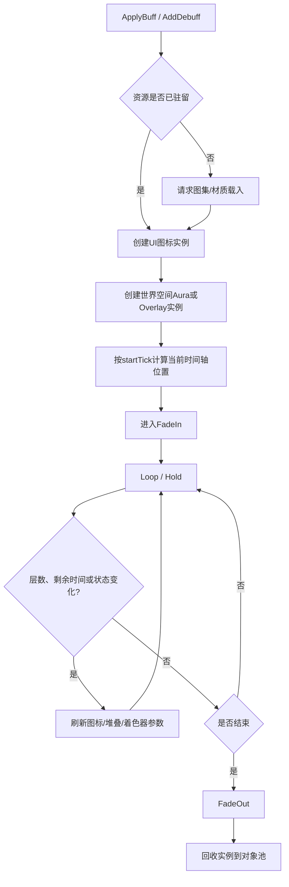
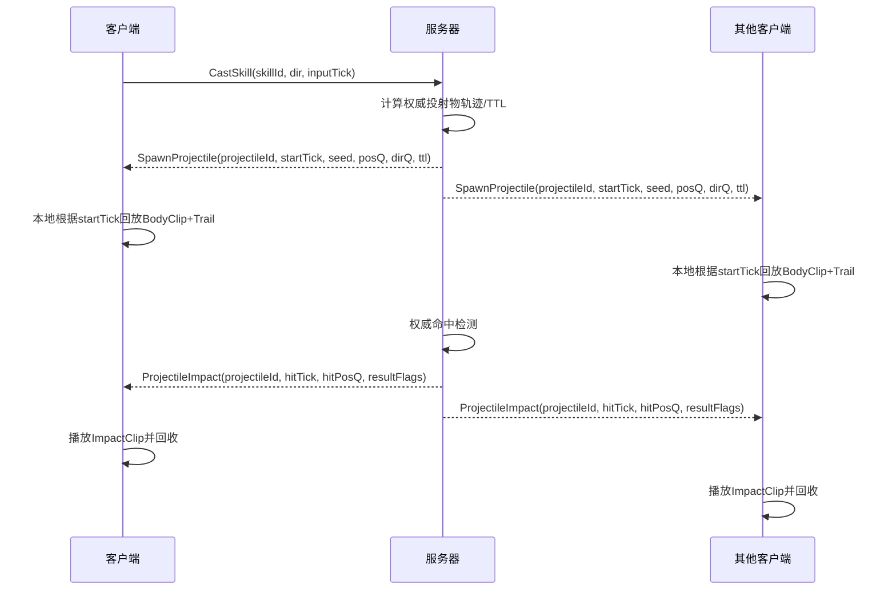

# DNF/DFO美术系统复刻技术研究与开发实施指南

## 执行摘要

面向“1:1复刻 DNF/DFO 美术系统”的最关键结论，不是“做几套 sprite sheet”，而是**复刻一套以容器格式、逐帧坐标、逐帧延时、分层排序、盒体绑定和轻量网络事件为核心的数据驱动美术运行时**。公开可交叉验证的资料显示，原始客户端以 NPK 为容器，内部包含多版本 IMG；其中 IMGV2 主要覆盖 UI、图标、部分通用贴图，IMGV5 大量用于人物/怪物技能特效，并以 DDS+ZLIB 的方式组织图像；动画侧则通过 `.ani` 文本脚本保存 `[IMAGE]`、`[IMAGE POS]`、`[DELAY]`、`[GRAPHIC EFFECT]`、`[ATTACK BOX]`、`[DAMAGE BOX]`、`[RGBA]`、`[IMAGE ROTATE]` 等逐帧信息；地图脚本又把 `[tile]`、`[background animation]`、`[animation]`、`[passive object]` 等视觉层和交互层明确分开。要做出“看起来就是 DNF”的效果，**必须保留这三类原始约束：逐帧 pivot/canvas、可变帧时长、分桶式排序/遮挡**。citeturn20view0turn21view0turn22view0turn22view1turn27view0turn29view0turn30view0turn33search1turn44search0

工程上，建议把原始格式思想“翻译”成现代跨引擎实现：源资源以 PSD/PSB/PNG 序列为主，构建阶段输出 atlas + JSON/ScriptableObject/DataAsset；运行时统一使用 `FrameRect + Pivot + CanvasSize + DurationMs + BlendMode + BoxSet + SortBucket` 的元数据，而不是只依赖均匀网格切图。网络层不要同步“当前播放到第几帧”，只同步**效果 ID、随机种子、起始 Tick、挂点、生命周期状态**；客户端本地根据起始时间回放时间轴。这样既能逼近原始视觉节奏，也能把网络带宽压到可控范围。citeturn29view0turn31view1turn33search1turn37search2turn39search0turn39search1

公开证据主要来自 entity["company","Neople","South Korea game developer"] / entity["company","Nexon","South Korea publisher"] 官方政策与引擎文档、entity["company","GitHub","code hosting platform"] 上的开源解析器源码、中文逆向长文与 mod 社区对照帖。结论上可以分成三层：**高可信**是官方文档和可运行解析器；**中高可信**是与源码互相印证的逆向文章；**中可信**是文件名映射、补丁制作社区经验；**未采用**的是无法证明授权链的泄露资源下载。citeturn51search0turn52view0turn6view0turn6view1turn20view0turn22view0turn22view1turn27view0turn30view0turn53search2turn53search7turn53search8

## 证据基础与法律边界

下表是本报告使用证据的可信度分层。这里的“可信度”不是对资料是否“有趣”的评价，而是对它能否直接指导开发实现、且经多源交叉验证后是否仍然成立的判断。

| 来源类型 | 代表资料 | 能确认的内容 | 可信度 |
|---|---|---|---|
| 官方政策/官方引擎文档 | DFO ToS/EULA、Unity 手册、Unreal 文档 | 法律边界、材质/图集/网络官方能力边界 | 高 |
| 开源解析器源码/包文档 | ExtractorSharp、DFOToolBox、godof | NPK/IMG 头、编码、DDS/ZLIB、文件名解码 | 高 |
| 长文逆向分析 | CSDN/Cnblogs 的 IMGV2/IMGV5/ANI/地图脚本分析 | 逐帧坐标、DELAY、RGBA、盒体、地图层次 | 中高 |
| Mod/论坛社区对照表 | Arad 论坛、贴吧文件名对照 | NPK 文件归类、常见资源定位 | 中 |
| 泄露客户端/私服包 | 未纳入本报告 | 公开交付风险高、授权链不清 | 不采用 |

上表对应的关键证据是：NPK 容器魔数为 `NeoplePack_Bill`；文件项含 offset、size 和 256 字节文件名区；开源解析器给出的实现还显示，文件名需要用固定 256 字节掩码异或后再按 EUC-KR 解码。另一个高价值结论是，IMGV2/IMGV5 并不是“单张规则大图”那种轻量格式，而是自带画布和坐标语义的资源承载方式，这决定了复刻系统必须做“裁剪矩形 + 逻辑画布 + pivot”的元数据层，而不是只拿 png 去播。citeturn20view0turn21view0turn22view0turn22view1turn29view0

法律上必须非常谨慎。官方 ToS 明确把图形、美术、角色、软件内容都定义为受知识产权保护的内容；EULA 进一步明示不得“decompile, disassemble or otherwise reverse engineer the Software”，也不得修改、创建 derivative works 或在未授权情况下利用软件内容。因此，本报告**不提供任何未授权台服泄露资源链接，不建议分发原始提取资产，也不把泄露包作为公开交付依据**。更稳妥的合法路径是：只在团队**自行合法获取**的本地客户端副本上进行内部只读研究；输出的是**重制版资源规范、重绘资源、可替换的开源样例资源和自研运行时**；如需做法务最小化，建议由法务确认适用法域下的互操作性/研究例外后再做内部 extraction。citeturn51search0turn52view0

如果你们要自建导入管线，推荐的底层顺序是：先做 **NPK/IMG 只读检视器**，再做 **ANI 时间轴导入器**，最后做 **引擎适配层**。因为原始结构里最容易丢失、但最影响“像不像”的，恰恰是 `key_x/key_y/max_width/max_height` 与 `[IMAGE POS]/[DELAY]` 这一层，而不是贴图像素本身。citeturn29view0turn31view1turn33search1turn33search3

## Buff/Debuff状态美术系统

### 功能概述

公开的文件名对照能相当明确地把原客户端中的状态类视觉拆成几组：`sprite_character_common.NPK` 负责通用技能图标，`sprite_character_common_customui.NPK` 负责左下角 Buff 剩余时间/次数显示，`sprite_character_common_aura.NPK` 负责时装光环，`sprite_character_common_personalcast.NPK` 负责 Buff 施放目标选择，另有 `sprite_character_common_dolleffect.NPK`、`sprite_character_common_teleport_after.npk` 这类通用效果包。结合 IMGV2/IMGV5 的版本分布，可以合理判断：**状态图标/界面偏 IMGV2，世界空间循环 aura/特效偏 IMGV5 或等价高压缩贴图路径**。citeturn53search2turn53search7turn53search8turn27view0turn30view0

更关键的是坐标和时间轴模型。逆向资料表明，`.ani` 以 `[IMAGE POS]` 记录每帧基点位置、`[DELAY]` 用毫秒记录停留时间、`[GRAPHIC EFFECT]` 可出现 `LINEARDODGE` 这类线性减淡/叠加效果，同时还允许 `[RGBA]` 和盒体定义；另一篇坐标研究则指出，角色贴图以 `.ani` 坐标为中心，而 NPK 中读取出的 png 坐标是“左上角绘制坐标”，并能在 IMGV2 数据中读到类似 `key_x/key_y/max_width/max_height` 的信息。这意味着 Buff/Debuff 复刻一定要用**逻辑画布坐标系**，不能只把每帧 sprite 的中心点硬设成中心。citeturn33search1turn33search5turn33search3turn31view1turn28view4turn29view0

### 所需资源清单

下表是建议的“重制版”资源清单。它不是原客户端文件名的逐字镜像，而是为了让团队能在 Unity 与 Unreal 中稳定落地，同时仍然保留 DNF 原始系统语义。

| 建议文件名 | 用途 | 源格式 | 运行时格式 | 建议分辨率 | 时间参数 |
|---|---|---|---|---|---|
| `buff_icon_atlas.psd` | 状态图标总源文件 | PSD/PSB | PNG + atlas JSON | 128×128/图标母版，导出 32×32 与 48×48 | 静态或 6–8 帧闪烁 |
| `buff_icon_anim.json` | 图标闪烁/倒计时 | JSON | JSON/ScriptableObject/DataAsset | 不适用 | 每帧 `durationMs` |
| `aura_haste_loop.psd` | 脚底/身周 aura 循环 | PSD/PNG 序列 | PNG atlas / flipbook | 512×512 母版 | 32–60 帧，80–100ms/帧 |
| `debuff_poison_overlay.psd` | 中毒/灼烧/冻结覆盖层 | PSD/PNG 序列 | PNG atlas | 256×256 或 512×512 | 12–24 帧，50–80ms/帧 |
| `status_marker_head.psd` | 头顶标记/锁定/沉默图标 | PSD/PNG | PNG atlas | 128×128 或 256×256 | 8–12 帧 |
| `buff_shader_params.json` | 发光/扰动/脉冲参数 | JSON | JSON | 不适用 | 常量或曲线 |

这套建议的依据，是原系统对“图标/UI”“世界空间 aura”“覆盖层/标记”本来就分包、分层、分时间轴管理，而不是交给一个统一粒子系统黑盒处理。citeturn53search2turn53search7turn53search8turn33search1

### 数据模型与参数表

建议把状态视觉定义成一个统一的 `BuffEffectDef`，字段至少包括以下内容：

| 字段 | 类型 | 说明 | 建议值/策略 |
|---|---|---|---|
| `effectId` | `uint16` | 网络与运行时统一 ID | 预留 0–2047 |
| `iconRef` | `AtlasFrameRef` | UI 图标 | 必填 |
| `worldClipRef` | `ClipRef` | 世界空间循环特效 | 可空 |
| `overlayClipRef` | `ClipRef` | 覆盖层特效 | 可空 |
| `pivotPolicy` | `enum` | `Feet / Root / Pelvis / Head / Weapon` | Aura 默认 `Feet` |
| `sortBucket` | `enum` | `BelowFeet / BehindBody / FrontBody / AboveHead / UI` | 必填 |
| `blendMode` | `enum` | `Alpha / Additive / AlphaComposite` | 魔法 aura 默认 `Additive` |
| `durationPolicy` | `enum` | `Timed / Toggle / WhileState / OneShotThenLoop` | 必填 |
| `fadeInMs` / `fadeOutMs` | `uint16` | 进入/退出过渡 | 80–200 / 120–250 |
| `stackPolicy` | `enum` | `Refresh / Independent / Aggregate / MaxLevelOnly` | 必填 |
| `shaderParams` | struct | 发光、扰动、脉冲、色相偏移 | 可选 |
| `netPolicy` | `enum` | `LocalOnly / ReplicatedStartStop / SeededLoop` | 必填 |
| `memoryTier` | `enum` | `Hot / Warm / Streamed` | 长驻 Buff 为 `Hot` |

这个模型本质上是在把原始的 `ANI + IMG key_x/key_y/max_width/max_height + graphic effect` 翻译成现代引擎可消费的数据结构。尤其是 `durationMs`、`pivotPolicy` 和 `sortBucket` 三个字段，决定了“像不像 DNF”。citeturn29view0turn31view1turn33search1turn33search3

### 实现步骤

1. **做逐帧元数据导入器**。导入器必须支持 `rect`、`pivot`、`canvasSize`、`durationMs`、`blendMode`、`rgba`、`rotation`、`aliasFrame`。如果你们只是把 png 切成均匀网格，复刻结果会立刻偏离原作。citeturn29view0turn33search1turn33search3
2. **做 UI 图标系统**。图标层与世界空间效果层分开，图标支持倒计时遮罩、层叠数字、冷却变灰、闪烁边框。它在数据上属于 `customui`，不要和世界 aura 共材质。citeturn53search2turn53search7
3. **做世界空间 Aura 系统**。至少支持脚底环、背后环、身前火焰、头顶标识四个 sort bucket，并允许同一 Buff 同时激活多个 clip。
4. **做 Debuff Overlay 系统**。冻结、石化、灼烧、中毒这类效果应允许“主角色 clip + 覆盖 clip + icon clip”同步生效，但生命周期可不同。
5. **实现混合模式和材质参数**。`LINEARDODGE` 建议映射到 Additive 或 AlphaComposite；烟雾、雾气和软边边框类效果保留 Alpha。citeturn33search1turn40search0turn40search3
6. **实现网络事件驱动**。Persistent Buff 只同步 `Start/Refresh/Stop`，携带 `effectId + targetNetId + attachPoint + startTick + seed + stack`；客户端据此本地回放。不要逐帧复制 sprite index。citeturn37search2turn39search0turn39search1
7. **做对象池与热区常驻**。常驻职业 Buff 和高频 Debuff 放入热点池；稀有觉醒特效走 streamed atlas。
8. **做原作对帧 QA**。录制原作与复刻版的 60fps 视频，逐帧比对进入帧、循环帧、结束帧和 pivot 偏差，容许误差建议不超过 4–6 像素。

### 动画生命周期流程图



这个生命周期图对应原系统“图标/UI、世界效果、时间轴延时、过渡退出”四条线并行，而不是单一粒子发射器。其底层依据是 `.ani` 的逐帧延时与分层 effect 语义。citeturn33search1turn53search2turn53search8

### 示例着色器伪代码

```hlsl
struct BuffVfxParams
{
    float4 tint;          // rgb + alpha
    float emissiveMul;    // 发光强度
    float pulseRate;      // 脉冲频率
    float pulseMin;       // 最低亮度
    float distortion;     // UV扰动强度
    int   blendMode;      // 0 Alpha, 1 Additive, 2 AlphaComposite
};

float4 BuffFxPS(float2 uv, Texture2D mainTex, SamplerState samp, BuffVfxParams p, float timeSec)
{
    float pulse = lerp(p.pulseMin, 1.0, 0.5 + 0.5 * sin(timeSec * p.pulseRate));
    float2 duv = uv + (mainTex.Sample(samp, uv).rg - 0.5) * p.distortion * 0.01;
    float4 c = mainTex.Sample(samp, duv) * p.tint;
    c.rgb *= pulse;

    float glow = saturate(max(c.r, max(c.g, c.b))) * p.emissiveMul;

    if (p.blendMode == 0)      // Alpha
        return float4(c.rgb + glow * 0.1, c.a);

    if (p.blendMode == 1)      // Additive
        return float4(c.rgb + glow, 0.0);

    // AlphaComposite / Premultiplied
    return float4((c.rgb + glow) * c.a, c.a);
}
```

在 Unity 里，Alpha 通常落到 `Blend SrcAlpha OneMinusSrcAlpha`，Additive 落到 `Blend One One`；在 Unreal 里，对应 `BLEND_Translucent`、`BLEND_Additive`、`AlphaComposite`。官方材质文档明确列出了这些模式的帧缓冲混合行为。citeturn40search0turn40search2turn40search3turn40search8

### 注意事项、优化建议与工时

最容易做坏的点有三个。第一，**用 Tight Mesh 裁掉 glow 边缘**，会导致脚底环和光晕边缘被削掉；第二，**用统一 FPS 替代逐帧 delay**，会导致原作那种“顿一下再爆”的节奏消失；第三，**把网络同步做成每帧状态复制**，多人场景会被纯 VFX 带宽拖垮。更稳妥的做法是：图标 atlas 可选择 UI 无压缩或高质量压缩；world aura atlas 优先 BC7/同级高质量压缩；小尺寸、对边缘要求极高的 icon 保持未压缩更安全；persistent Buff 只发 start/stop 与 stack 变化。Unity 的 BC7 文档给出 8 bpp 和 DX11 PC 支持范围；Unreal 文档也把 BC7 定义为高质量压缩，并强调其与 BC3 同尺寸等级。citeturn37search4turn37search5turn37search9turn50search0

建议工时方面，若底层 atlas/clip/importer 已存在，Buff/Debuff 子系统从零到“可对帧可上线”通常需要 **14–18 人日**；若底层还不存在，需先补 **8–12 人日** 的导入与运行时框架。优先级上它属于 **P0**，因为它会直接影响职业体验、队伍读屏效率与状态辨识度。这个时间不含重绘资源，仅含系统、编辑器和调试工具。

## 投射物美术资源系统

### 功能概述

原始 `.ani` 语法中已经包含 `[ATTACK BOX]`、`[DAMAGE BOX]`、`[IMAGE ROTATE]`、`[RGBA]` 等字段，这恰好对应投射物系统的四个核心维度：**视觉帧、碰撞帧、朝向帧、颜色/亮度帧**。与此同时，IMGV5 的逆向分析指出，普通索引项除常规参数外，还会记录**引用 DDS 序号和两个坐标点**，用于从“大 DDS 图像”里裁出真正的小帧；也就是说，原始系统对“从大图集中切出不同 projectile body 帧”的支持是明确存在的。citeturn33search1turn30view0

因此，复刻投射物时最合理的实现不是“单个飞行 Prefab + 一段粒子”，而是**三层结构**：`BodyClip` 负责主体翻页，`CollisionTimeline` 负责服务端权威盒体相位，`Trail/ImpactClip` 负责尾迹和命中。网络层不复制每个 frame，只同步产生、命中、销毁三个事件，以及必要的起始时间和方向。Unreal 官方复制优化文档非常明确地建议优先关闭不必要 replication、降低 `NetUpdateFrequency`、用 dormancy/relevancy/quantization；Unity NGO 也提供了可靠/不可靠 RPC、目标过滤和可见性控制，这正适合把投射物视觉同步做成“事件 + 客户端局部推进”。citeturn37search2turn39search0turn39search1

### 所需资源清单

| 建议文件名 | 用途 | 源格式 | 运行时格式 | 建议分辨率 | 时间参数 |
|---|---|---|---|---|---|
| `proj_fireball_body.psd` | 主体动画 | PSD/PNG 序列 | atlas + clip | 256×256 或 512×512 | 8–16 帧 |
| `proj_fireball_trail.psd` | 尾迹帧或 ribbon sprite | PSD/PNG | atlas / 单 sprite | 64×64 / 128×128 | 6–12 帧 |
| `proj_fireball_impact.psd` | 命中特效 | PSD/PNG 序列 | atlas + clip | 256×256 / 512×512 | 12–24 帧 |
| `proj_fireball_lightmask.png` | 发光 mask | PNG | PNG | 与主体一致 | 静态 |
| `proj_fireball.timeline.json` | 帧、盒体、速度相位 | JSON | JSON/DataAsset | 不适用 | 每帧 `durationMs` |
| `proj_fireball.lod.json` | 远近等级策略 | JSON | JSON | 不适用 | 阈值驱动 |

### 数据模型与参数表

| 字段 | 类型 | 说明 | 建议值/策略 |
|---|---|---|---|
| `projectileId` | `uint16` | 投射物类型 ID | 必填 |
| `bodyClip` | `ClipRef` | 飞行主体 | 必填 |
| `spawnClip` / `impactClip` | `ClipRef` | 出生/命中 | 可空 |
| `trailType` | `enum` | `None / SpriteTrail / Ribbon / ParticleBurst` | 火球默认 `Ribbon + Burst` |
| `speedPxPerSec` | `float` | 视觉速度标尺 | 600–1400（按技能调） |
| `rotationMode` | `enum` | `FlipX / EightDir / FreeRotate` | 对称火球可 `FreeRotate` |
| `collisionMode` | `enum` | `SweptCircle / OBB / PerFrameBoxes` | 常规弹体优先 `SweptCircle` |
| `collisionTimeline` | `BoxSet[]` | 每帧攻击/受击盒 | 高保真技能必填 |
| `lightMode` | `enum` | `None / Emissive / AdditivePass` | 魔法弹体默认 `Emissive` |
| `ttlMs` | `uint16` | 存活时间 | 必填 |
| `netPolicy` | `enum` | `ServerAuthEvent / ClientPredVisual / LocalOnly` | 默认 `ServerAuthEvent` |
| `lodPolicy` | struct | 距离/FPS/粒子降级 | 必填 |

### 实现步骤

1. **实现 variable-duration 的 clip 播放器**。不要用固定 FPS 线性映射所有投射物；应支持“命中前 80ms 的蓄亮”和“飞行后段拉长尾迹”这种非等间隔时间轴。
2. **把视觉和权威碰撞分离**。服务端用 swept circle / capsule / OBB 处理命中，客户端拿 `collisionTimeline` 只做本地 debug 叠加和 hit flash 显示。
3. **做“速度到帧节奏”的映射层**。推荐公式是：`visualFrameRate = clamp(speedPxPerSec / pxPerFrameTarget, minFps, maxFps)`，其中 `pxPerFrameTarget` 取 18–24 像素；但真正播放仍以 `durationMs` 为主，速度只调总时间轴倍率。
4. **实现旋转/朝向策略**。近似球体或能量弹可自由旋转；带明显透视的箭、枪弹、能量刃，优先采用左右翻转或 8 向切片，否则会失去 DNF 那种“手绘方向感”。
5. **实现尾迹联动**。尾迹不能只跟 transform，要跟**上一帧 pivot、当前帧方向和发光强度**联动；否则命中前的加速感会不对。
6. **实现命中分叉**。`ImpactClip` 允许按 `surfaceType / hitResult / critFlag` 切换；光弹打墙、打怪、暴击都应该能走不同命中特效。
7. **做 LOD**。远距离时关闭 ribbon，只保留主体与一层 emissive；超远距离只保留主体。
8. **做调试可视化**。编辑器里必须能同时显示当前 body frame、pivot、swept volume、trail spawn points 和命中盒。

### 网络同步时序图



这个时序的要点是：**同步事件而不同步画面帧**。事件包里建议只放 `projectileId + startTick + seed + posQ + dirQ + ttl + resultFlags`。按 2 字节 ID、4 字节 Tick、2 字节 seed、量化坐标/方向约 8–10 字节粗算，一个 Spawn 事件可以控制在 20–28 字节核心载荷量级，远低于逐帧同步。Unreal 的复制优化和 Unity NGO 的 RPC 目标/可靠性机制都支持这种模式。citeturn37search2turn39search0turn39search1

### 光照/发光实现伪代码

```hlsl
struct ProjectileFxParams
{
    float4 tint;
    float emissive;
    float softEdge;
    float motionBlurMul;
    float2 dir;
};

float4 ProjectilePS(float2 uv, Texture2D bodyTex, Texture2D glowTex, SamplerState samp, ProjectileFxParams p)
{
    float4 baseCol = bodyTex.Sample(samp, uv) * p.tint;
    float glow = glowTex.Sample(samp, uv).r * p.emissive;

    // 沿飞行方向拉一点假运动模糊
    float2 uv2 = uv - normalize(p.dir) * p.motionBlurMul * 0.01;
    float4 smear = bodyTex.Sample(samp, uv2) * 0.35;

    float alpha = saturate(baseCol.a + smear.a * p.softEdge);
    float3 rgb = baseCol.rgb + smear.rgb + glow.xxx;

    return float4(rgb, alpha);
}
```

如果要更像 DNF，建议把 projectile 主体和 glow 分成两层：主体走 Translucent/Alpha，外发光走 Additive，这样边缘不会太脏，高潮时还能像 `LINEARDODGE` 一样冲亮。官方材质文档明确给出了 Additive、Translucent 与 AlphaComposite 的差异。citeturn40search0turn40search2

### 网络同步策略对比

| 策略 | 传输内容 | 带宽 | 视觉一致性 | 适用场景 | 结论 |
|---|---|---:|---|---|---|
| 逐帧同步 | 当前帧、位置、角度、盒体 | 最高 | 高 | 不建议 | 否 |
| 状态+起始 Tick | `id/startTick/seed/dir/ttl` | 低 | 高 | 大多数技能弹体 | **推荐默认** |
| 仅命中结果同步 | 命中时刻和结果 | 极低 | 中 | 纯装饰或客户端预测很强 | 可选 |
| 本地完全预测 | 无或极少同步 | 最低 | 低到中 | 自己可见的非权威特效 | 仅限弱相关 VFX |

这张表是工程建议，但它与官方网络文档的方向一致：减少复制对象、降低更新频率、利用相关性与量化，而不是拿 replication 去承载纯视觉播放。citeturn37search2turn39search0

### 注意事项、优化建议与工时

投射物系统里最容易被忽略的是**碰撞盒与帧的关系**。如果你们只做“飞行轨迹正确”，但不做“哪个时间段 bodyClip 看起来最亮、盒体在哪个时间段扩大”，最后手感会很怪。另一点是 atlas 组织：主体、尾迹、命中建议拆成三个 atlas，原因不是美术管理方便，而是**可以分别做驻留、压缩和 LOD**。主体常驻、尾迹半常驻、命中特效可流式载入。

若底层 clip/runtime 已完成，投射物子系统的系统工时一般为 **16–22 人日**；如果包含编辑器、调试盒体、曲线化速度映射和网络打点统计，则建议按 **20–26 人日** 规划。优先级属于 **P0**。

## 地图背景资源系统

### 功能概述

地图/场景侧的公开脚本片段非常有价值，因为它几乎直接暴露了层次结构：`[tile]` 区块保存平铺底图，贴出的样例里注明“tile 的 width 都是 224”；`[background animation]` 使用 `Animation/far0.ani [distantback] [below]` 和 `Animation/mid1.ani [middleback] [below]` 这样的层标签；`[animation]` 则像“树、烧焦树”这类场景装饰，附带坐标；`[passive object]`、`[monster]` 则进入交互或逻辑层。也就是说，原始地图美术并不是一张大底图，而是**平铺层、远景动画层、场景装饰层、交互物层**的分离系统。citeturn44search0

这对复刻的启示很直接：不要把 beat ’em up 地图当成单纯的 parallax background；你真正需要的是**三套图层系统并列**。第一套是“纯背景层”，只参与视差和色调；第二套是“装饰动画层”，参与视差和排序，但不进碰撞；第三套是“交互/碰撞层”，只给逻辑和遮挡使用。原脚本里的 `[below]`、`[distantback]`、`[middleback]` 就是在做这件事。citeturn44search0

### 所需资源清单

| 建议文件名 | 用途 | 源格式 | 运行时格式 | 建议分辨率 | 备注 |
|---|---|---|---|---|---|
| `stage01_far_sky.psb` | 天空/极远景 | PSB/PSD | PNG / BC7 atlas | 4096×1024 或更宽 | 可循环 |
| `stage01_distantback_ruins.psb` | 远景废墟 | PSB/PSD | PNG atlas | 4096×2048 | 可循环 |
| `stage01_middleback_lights.psb` | 中景建筑/光窗 | PSB/PSD | 颜色层 + light layer | 4096×2048 | 建议色光分离 |
| `stage01_floor_tiles.psd` | 地面 tile strip | PSD | tileset atlas | 按 224 或其倍数组织 | 对齐原脚本习惯 |
| `stage01_deco_tree.ani.json` | 前景/中景装饰动画 | JSON | JSON | 不适用 | 带坐标放置 |
| `stage01_collision_mask.png` | 逻辑碰撞图/导航辅助 | PNG | PNG/Data | 与底图同尺度 | 不进渲染 |
| `stage01_palette_lut.png` | 场景整体色调 | PNG | LUT | 32×32 或 64×64 | 后期统一控制 |

### 数据模型与参数表

| 字段 | 类型 | 说明 | 建议值/策略 |
|---|---|---|---|
| `layerId` | `string` | 层标识 | 必填 |
| `bucket` | `enum` | `Sky / DistantBack / MiddleBack / Gameplay / Foreground / Overlay` | 必填 |
| `parallaxX` / `parallaxY` | `float` | 视差系数 | 0.10–1.15 |
| `wrapMode` | `enum` | `Clamp / Repeat / MirrorRepeat` | 地平线层默认 `Repeat` |
| `tileWidth` | `int` | 平铺单元逻辑宽 | 对齐原作优先 224 |
| `colorTex` | `TextureRef` | 颜色层 | 必填 |
| `lightTex` | `TextureRef` | 发光/光斑层 | 可空 |
| `animClip` | `ClipRef` | 背景动画/装饰动画 | 可空 |
| `placementMode` | `enum` | `AutoTile / ManualAnchors / Scripted` | 必填 |
| `occlusionMode` | `enum` | `None / BelowGameplay / AboveGameplay / YSorted` | 必填 |
| `collidable` | `bool` | 是否参与碰撞 | 默认 false |
| `streamGroup` | `enum` | `Hot / StageLocal / Streamed` | 必填 |

### 视差、切片与无缝循环公式

推荐把视差公式显式写进运行时，而不是在美术里烘死：

```text
screenX = localX - cameraX * parallaxX
screenY = localY - cameraY * parallaxY
wrappedX = mod(screenX, layerWidth)
```

其中 `parallaxX` 可以按层桶直接给固定值，也可以按深度归一化求出：

```text
parallaxX = lerp(0.10, 1.15, depthNorm^0.85)
```

对 DNF 风格侧视清版场景，我建议直接用桶值，避免过度“摄像机感”：

| 层桶 | 建议 `parallaxX` |
|---|---:|
| Sky | 0.10–0.15 |
| DistantBack | 0.20–0.35 |
| MiddleBack | 0.40–0.65 |
| Gameplay 基准面 | 1.00 |
| Foreground 遮挡层 | 1.05–1.15 |

这里的数值是工程建议；它与原脚本中的 `distantback / middleback / below` 分桶思想一致，但比原脚本更适合现代引擎稳定复现。原脚本还提示 tile 宽度 224，因此如果你们追求高相似度，推荐让地面与近景装饰的逻辑切片边界保持 224 的整数倍。citeturn44search0

### 实现步骤

1. **做地图层定义格式**。把 tile、background animation、scene decoration、passive object 四类对象分文件或分 section 管理。
2. **做 tile strip 生成器**。地面层不要手摆整图；应支持按 224 宽逻辑单元快速拼接与替换。
3. **做 parallax 解算器**。优先支持水平视差；垂直方向只给极少量系数，避免清版流程里视觉漂移太重。
4. **做背景动画播放器**。远景云层、窗灯、旗帜、远处火焰都应该能放在 background animation 层里独立播放。
5. **做装饰动画层**。中景树、吊灯、路灯、火盆等 object 走 `animation` 放置，不进碰撞。
6. **做碰撞层分离**。`collision_mask`、路径区、可站立面、遮挡体分离管理，不和 colorTex 绑定。
7. **做光照与色调分离**。建议每层支持 `colorTex + lightTex` 两张图，light pass 只做 emissive/additive，整体色调用 LUT 或全局 post-process 控制。
8. **做无缝循环与 Streaming**。远景层可无限循环；长图场景按 chunk 流式进出，但 chunk 边界必须和 wrap seam 对齐。

### 方案比较

| 方案 | 优点 | 缺点 | 适合 DNF 复刻吗 |
|---|---|---|---|
| 单张整图背景 | 实现最简单 | 难做装饰动画、遮挡与循环 | 不适合 |
| 多层静态 parallax | 成本低、可控 | 远景“活性”不足 | 可作为最低版本 |
| 多层静态 + 背景动画层 | 最接近原作地图组织 | 工具链稍复杂 | **推荐默认** |
| 骨骼/节点驱动整场景 | 复杂动态表现强 | 过度工程化，偏离原作 | 不推荐 |

### 注意事项、优化建议与工时

地图背景最常见的错误，是把近景遮挡、地面 tile、远景建筑和装饰动画全部烘进一张图。这会同时破坏三件事情：第一，角色与场景的 Y 轴遮挡；第二，循环与切图；第三，色调与发光分离。更忠实的做法是把“地面”和“视觉背景”拆开，让角色 sort key 只跟 gameplay plane 和 foreground occluder 交互。

建议 sort key 公式采用分桶 + feetY 的办法，例如：

```text
sortKey = bucketBase + floor(feetY * 100) + localPriority
```

这样既能还原 beat ’em up 的纵深假象，也能让脚底环、前景栏杆、悬挂装饰等特效有稳定遮挡顺序。

系统工时方面，地图背景子系统通常需要 **14–18 人日**；如果加上关卡编辑器预览、tile strip 生成器、light pass 与自动 seam 检测，建议按 **18–24 人日** 规划。优先级属于 **P1**，因为它对单场景观感极重要，但可以在 Buff 和 Projectile 之后完成第一版。

## 跨引擎实现要点

### Unity 实现要点

Unity 侧最重要的基础设施是 Sprite Atlas。官方手册说明，Sprite Atlas 用于把多个 texture 合并成单一 atlas，以减少 draw calls；从 2022.2 起，Sprite Atlas V2 在编辑器中默认启用。导入 sprites 时，官方 `Sprite (2D and UI) Import Settings` 要求先把 Texture Type 设为 Sprite，Sprite Mode 设为 Single 或 Multiple；而 Tilemap 的官方导入建议也强调 Tile/Sheet 场景必须走 Sprite 类型。对 DNF 风格复刻，我建议：图标与小特效使用 `Sprite Mode = Multiple`、**自定义 Pivot**、UI 图标关闭 mipmap；大背景远景开启 mipmap。PC 主目标上，质量优先资源用 `CompressedHQ/BC7`，因为 Unity 文档明确 BC7 为 8 bpp、适用于 DX11 级 PC，质量通常高于 DXT5。citeturn36search5turn36search9turn37search1turn37search4turn37search5turn37search6turn50search6

网络层建议直接围绕 NGO 设计，而不是自建“逐帧视觉同步”。Unity NGO 文档说明 `Rpc` 支持目标过滤、可靠与不可靠递送；`NetworkVariable<T>` 支持状态同步；`NetworkShow/Hide` 则可用于针对特定 client 控制对象可见性。换句话说，Buff、Projectile、Map Decoration 三类对象都可以走同一范式：**NetworkVariable 只同步状态；Rpc 只同步视觉事件；长驻对象用可见性裁剪，不要所有特效都对所有人可见**。材质方面，透明和叠加可直接落在 ShaderLab `Blend SrcAlpha OneMinusSrcAlpha` 与 `Blend One One`。citeturn39search0turn39search1turn39search2turn39search4turn40search3turn40search8

推荐的 Unity 资源导入默认值如下：

| 资源类别 | Texture Type | Sprite Mode | Mesh | Mipmap | Compression |
|---|---|---|---|---|---|
| Buff 图标 | Sprite (2D and UI) | Multiple | Tight 或 Full Rect | Off | None / BC7 |
| Aura/Projectile | Sprite (2D and UI) | Multiple | **Full Rect** | Off | BC7 |
| 地图远景 | Sprite 或 Default | Multiple/Single | Full Rect | On | BC7 |
| 地图前景遮挡 | Sprite | Multiple | Full Rect | Off | BC7 / RGBA32 |

这里把 VFX 用 `Full Rect`，不是因为 Unity 官方要求，而是因为 Tight Mesh 很容易把外发光和软边裁掉；这是工程建议。

### Unreal 实现要点

Unreal 侧，Paper2D Flipbook 文档直接给出了 DNF 风格系统最需要的模型：Flipbook 由一组 keyframe 组成，每个 keyframe 都有 sprite 和持续帧数，Flipbook 还有统一 `FramesPerSecond`。Paper2D 还支持从 sprite sheet 提取 sprites、从 JSON/TexturePacker 导入并自动生成 flipbook；韩文文档 `페이퍼 2D 임포트 옵션（Paper 2D导入选项）` 还特别说明了 Texture Packer 生成 `.paper2dsprites` 后可自动导入纹理、提取 sprite 并生成 flipbook。这和“导出 atlas + 元数据”的 DNF 复刻管线高度契合。citeturn36search0turn36search10turn50search2turn50search4

材质与导入侧，官方文档给出 Paper2D 默认有 Opaque/Masked/Translucent 的 Lit/Unlit Sprite Materials；Project Settings 中，Paper2D Import 可以设置 `Default Pixels Per Unreal Unit`、默认 texture group、默认 sprite texture compression，以及是否覆盖导入压缩。文档还明确指出：modern 2D 常把默认 texture group 设为 UI，压缩可选 Default、BC7、UserInterface2D 等；而材质混合模式文档则清楚给出 `BLEND_Translucent`、`BLEND_Additive`、`AlphaComposite` 的公式。对 projectile 尾迹，Niagara 官方教程就是现成答案：Ribbon Renderer 适合做拖尾，你只需要给它喂对的位置和材质。citeturn36search1turn36search4turn40search0turn40search2turn50search0turn50search3turn50search8

网络侧，Unreal 官方《Performance and Bandwidth Tips》非常适合直接拿来做 DNF 风格视觉同步设计：优化优先级依次是关掉不必要复制、降低 `NetUpdateFrequency`、使用 Dormancy、Relevancy、控制 `NetClientTicksPerSecond`，并优先利用 `FVector_NetQuantize` 之类的量化。把这一套直接映射到本报告的 Buff/Projectile 系统，就是：**不要复制纯视觉 actor；必要时只复制权威状态；投射物和 aura 只在观察者范围内显示；长驻不变对象应休眠。**citeturn37search2

推荐的 Unreal 资源导入默认值如下：

| 资源类别 | Import 路径 | 材质 | Compression | Texture Group | 备注 |
|---|---|---|---|---|---|
| Buff 图标 | JSON/Extract Sprites | Unlit Translucent / UI | UserInterface2D 或 BC7 | UI | 图标优先清晰度 |
| Aura/Projectile | JSON/Extract Sprites + Flipbook | Custom Translucent / Additive | BC7 | UI 或默认 2D | 主体与 glow 可分层 |
| Tail | Niagara Ribbon | DefaultRibbonMaterial 或自定义 | 取材质 | 不适用 | 只存一张条纹纹理 |
| 地图背景 | Sprite/TileSet | Unlit Opaque/Translucent | BC7 | UI/2D | 远景分层导入 |

### 不同实现方案比较

| 方案 | 视觉保真度 | 逐帧盒体/坐标保真 | 工具链复杂度 | CPU/GPU 成本 | 结论 |
|---|---:|---:|---:|---:|---|
| 规则 sprite sheet + 固定 FPS | 中 | 低 | 低 | 低 | 不足以 1:1 |
| atlas + 逐帧 pivot/duration/boxes | **高** | **高** | 中 | 低到中 | **推荐默认** |
| skeletal animation 实时驱动 | 中 | 中 | 高 | 中 | 可用于内部 authoring，不建议直接 runtime |
| 粒子系统主导、flipbook 辅助 | 中高 | 中 | 中高 | 中到高 | 只适合 projectile/trail，不能统一替代 |

这个表的结论并不是“骨骼动画不好”，而是**DNF 原始客观证据更接近“atlas + metadata + timeline”**，所以若目标是 1:1，而非“同风格二创”，默认解应是逐帧 atlas 运行时。citeturn29view0turn30view0turn33search1turn36search0turn50search2

### 压缩格式比较

| 格式 | Alpha | 质量 | 运行时内存 | 推荐用途 |
|---|---|---|---|---|
| PNG | 支持 | 高 | 不适合作运行时 GPU 纹理格式 | **源资源/构建输入** |
| DDS | 支持多种 DXTC | 高到中 | 适合 Direct3D 路径 | 原始 IMGV5 同类思路、归档研究 |
| BC7 | 支持 | 高 | 与 BC3 同尺寸等级、质量更高 | **PC 主目标默认高质量方案** |
| BC3 / DXT5 | 支持 | 中 | 成熟、兼容性高 | PC 兼容回退 |
| UI 无压缩 RGBA8 | 支持 | 最高 | 最大 | 小图标、锐利 UI |

官方资料能确认两条关键事实：IMGV5 本身就建立在 DDS + ZLIB 的思路之上；Unity 文档明确 BC7 为 8 bpp 高质量 PC 压缩；Unreal 文档列出 DXT1/5、BC7、UserInterface2D 等压缩路径，且 BC7 与 BC3 处于同尺寸等级。工程上可以直接得出：**图标少而关键时用无压缩，VFX 和背景远景优先 BC7，广兼容 fallback 用 BC3/DXT5**。citeturn30view0turn37search4turn37search5turn37search8turn37search9turn50search0

## 实施优先级与交付清单

### 优先级与工时估算

| 模块 | 优先级 | 核心交付 | 估算人日 |
|---|---|---|---:|
| NPK/IMG/ANI 检视器与导入框架 | P0 | 只读解析、atlas metadata、timeline 数据结构 | 8–12 |
| Buff/Debuff 状态美术系统 | P0 | 图标、aura、overlay、生命周期、网络事件 | 14–18 |
| 投射物美术资源系统 | P0 | body/trail/impact、盒体同步、网络时序 | 16–22 |
| 跨引擎适配层 | P1 | Unity/Unreal 导入与材质模板 | 10–14 |
| 地图背景资源系统 | P1 | tile、parallax、装饰动画、碰撞分层 | 14–18 |
| 可视化调试与对帧 QA | P1 | 盒体、pivot、排序、视频对比工具 | 8–12 |

若团队配置为 **2 客户端程序 + 1 网络程序 + 1 技术美术 + 1 工具开发** 的小队，整套系统从零到“可进入 production”的合理总量大约是 **70–96 人日**；若已有成熟 atlas/runtime 框架，可下降到 **50–68 人日**。这是经验估算，不含大规模原创美术重绘。

### 可直接下载的合法工具与示例资源

以下条目均为**合法公开页面**；点击引文即可进入资源页。它们分成两类：一类是“只读研究工具/解析器”，用于内部研究自有客户端；另一类是“可直接替代上手的开源示例资源”，用于在不碰原始版权资产的前提下先搭系统。

| 资源 | 类型 | 用途 | 许可/风险 |
|---|---|---|---|
| ExtractorSharp | 工具 | 读取/写入 IMG、NPK，支持多版本 IMG | MIT；可做只读研究，勿分发原始提取资源 citeturn6view0 |
| DFOToolBox / npk2gif | 工具 | 读取 NPK、导出动画 GIF 便于对帧 | Apache-2.0；适合内部验证 citeturn6view1 |
| godof `npk` / `img` 包 | 工具/源码 | 可直接参考 NPK/IMG 头、文件名解码、IMG 打开逻辑 | Apache-2.0；适合自研导入器 citeturn20view0turn21view0turn22view0turn22view1turn26search0 |
| Fireball Spritesheet | 开源资源 | 投射物 body 起步素材 | CC0；PNG，可直接导入 citeturn48search0 |
| Small Fireball | 开源资源 | 多帧火球动画测试 | CC0；89 帧，适合验证 timeline 与 LOD citeturn48search2 |
| Auras | 开源资源 | Buff aura 循环特效测试 | CC0；512×512、60 frames，可直接测循环与 additive citeturn49search9 |
| Explosion effects and more | 开源资源 | aura / 爆炸 / 特效库 | CC0/CC-BY 混合；用前检查具体文件归属 citeturn49search0 |
| RPG status icons 16x16 and 8x8 | 开源资源 | Buff/Debuff 图标与 PSD 流程样例 | CC-BY 3.0 / GPL 3.0；含 PSD，适合 UI 管线测试 citeturn49search3 |
| Seamless Parallax Cave Background | 开源资源 | 地图背景分层与 PSD 样例 | CC0；ZIP 含 PSD，4 层，2000×2000 citeturn48search5 |
| Background Seaview Parallax | 开源资源 | 多层横向无缝背景样例 | CC0；5 层，3840×2160 citeturn48search12 |
| Space Parallax Background | 开源资源 | 远景循环/Alpha 分层样例 | CC0；3 张分层图，可直接验证循环和 blending citeturn48search11 |

### 最终落地建议

如果团队要把这份研究直接转成开发计划，我建议按这个顺序推进：先做 **底层导入与逐帧元数据运行时**，再做 **Buff/Debuff**，随后做 **Projectile**，最后才做 **Map Background**。原因很简单：前三者共享同一个“逐帧 sprite + pivot + delay + sort bucket + shader param”的底层；地图只是把这一系统扩展到了场景对象与平铺层。真正决定复刻成败的，不是你们选 Unity 还是 Unreal，而是有没有忠实保留原始系统的那组“逐帧语义”。citeturn29view0turn30view0turn33search1turn44search0

就“1:1复刻”这个目标本身而言，最终推荐方案可以用一句话概括：**保留 DNF 的数据模型，现代化它的打包与运行时，不复制它的法律风险。** 官方政策已经给出边界，开源解析器与逆向文章已经给出足够多的结构证据；剩下的工作，是把这些结构翻译成你们自己的合法、可维护、可量产的美术系统。citeturn51search0turn52view0turn6view0turn6view1turn20view0turn27view0turn30view0
