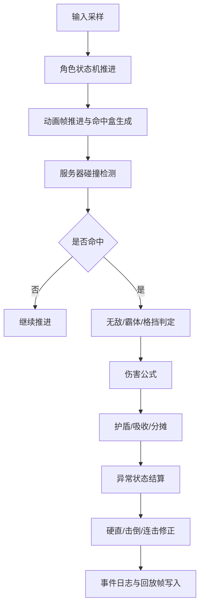
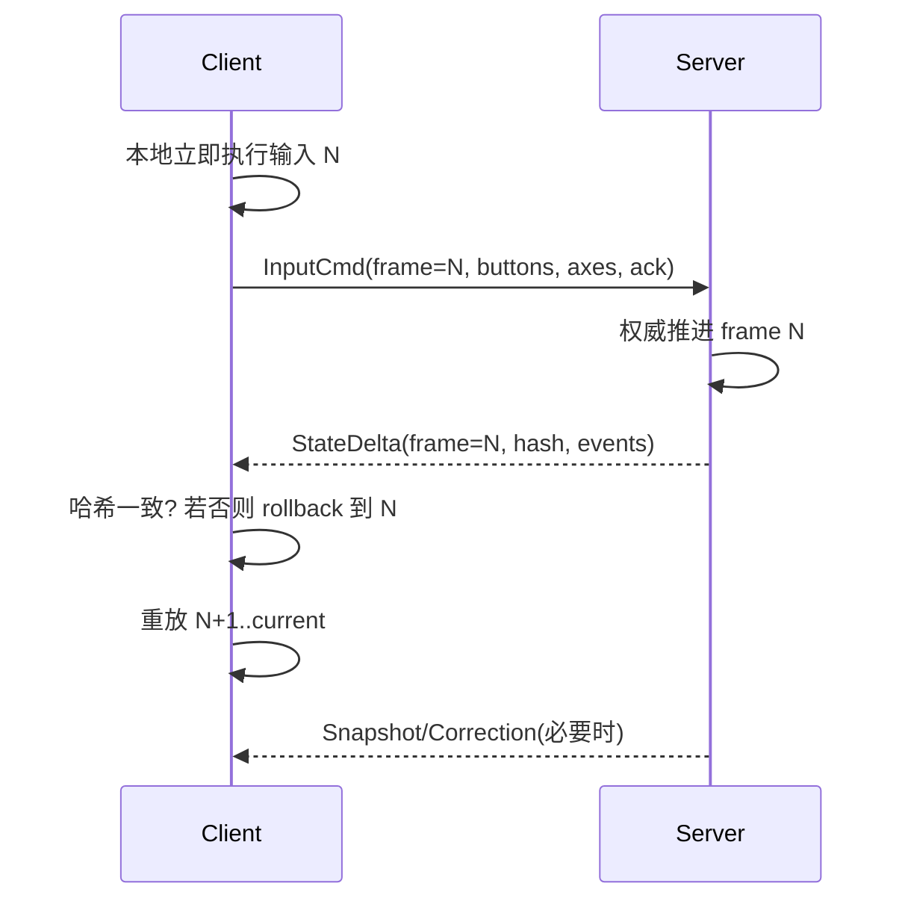

# 实现类 DNF/DFO 一对一战斗系统的技术规格与可执行开发规范

## 执行摘要

这份文档把“类 DNF/DFO 的 1:1 战斗系统”拆成两层来定义。第一层是**高置信、可从官方与原始资料直接确认的规则**：韩服/国际服官方公开说明了 PvP 与 PvE 在技能、冷却、装备归一化、HUD、回放、帧率上限、技能引导与独立配置上的分离；官方战斗/状态异常指南给出了中毒、灼伤、感电、出血与多种控制异常的持续时间、触发间隔、堆叠与互斥关系；官方开发者 API 明确暴露了 `coolTime`、`castingTime`、`chain.resetTime`、`skillId` 等字段，说明技能时序本身就是可数据化的；官方安全规则明确点名了调试器、反汇编器、封包修改、内存修改、宏、进程隐藏、虚拟机与远程控制等不允许行为。citeturn27view0turn29view0turn29view1turn6view0turn7view0turn18search0

第二层是**由于官方未完整公开而必须工程化补足的规范**：现网精确伤害公式、现行封包结构、全部技能帧数据、全部异常成功率公式与完整 PvP 连击修正规则，并没有被官方完整公开。因此，建议采用“**服务器权威 + 客户端预测 + 有限回滚**”的现代格斗网络模型，把 PvE 与 PvP 的差异彻底收敛到数据表；把伤害、护盾、伤害吸收、伤害分摊、异常、净化、免疫、霸体、无敌、硬直、击倒、强制起身、连击修正这几类规则做成独立模块，再通过统一的 `ResolveHit()` 热路径装配。该建议与 GGPO 的确定性回滚要求、现代服务器权威回滚论文模型、以及 entity["company","Riot Games","game developer"] 的 entity["video_game","2XKO","2025 fighting game"] 官方网络架构说明高度一致。citeturn24view1turn24view0turn24view5turn39view0

本文把**“可证实的 DNF/DFO 规则”**与**“建议性工程实现”**明确分开写：凡是带“建议”“规范版”“推荐值”的内容，都是为开发团队落地而给出的实现规范，而不是声称它就是现网零误差私有实现。这样既能直接指导研发，又不会把社区逆向结果误写成官方事实。citeturn23view0turn22view0turn22view1turn22view2turn35view0turn33view0

## 资料基础与可信度

本课题最可靠的资料源，按优先级应当分为五层。第一层是韩服/国际服/国服**官方站与开发者门户**，对应 entity["company","Neople","game developer"]、entity["company","Nexon","game publisher"] 与 entity["company","Tencent","game publisher"]；第二层是**官方社区内的高质量玩家/测试文**，能说明 PvP 修正条、命中僵直、低 RP 教学 HUD 与“公平决斗场”一类细节；第三层是**公开可审计的客户端数据工具与文件索引**，主要来自 entity["company","GitHub","code host"] 与 entity["organization","SteamDB","steam database"]；第四层是英语/韩语的**长期理论社区和论坛**，如 entity["company","Reddit","social platform"] 的 r/DFO、entity["organization","Ruliweb","gaming forum"]；第五层才是低可信的泄露/私服/改包论坛，如 entity["organization","RageZone","mmo forum"]。citeturn27view0turn29view0turn29view1turn22view0turn22view1turn23view0turn35view0turn33view0turn15search2

| 资料层级 | 代表来源 | 可直接采用的内容 | 可信度 |
|---|---|---|---|
| 官方规则与指南 | 韩服/国际服官方战斗、状态异常、PvP 赛季说明、开放 API 文档 | 状态时长、互斥关系、技能字段、PvP 专用说明、技能引导、回放入口、帧率/界面限定 | 高 citeturn27view0turn29view0turn29view1turn6view0turn7view0 |
| 官方补丁日志 | 韩服/国服补丁/平衡说明 | PvP/PvE 分离参数、技能前后摇、Y 轴判定、强制硬直、冷却、无敌/霸体窗口、护盾吸收率变更 | 高 citeturn3search5turn19search3turn19search9turn31search2turn31search3turn31search11 |
| 官方社区高质量攻略/测试 | 官方社区 PvP 术语与连段修正文 | 站立/空中/倒地修正、重力修正、强制起身、低段位教学修正条、固定属性公平场 | 中高 citeturn40view0turn42view0 |
| 公开逆向/文件工具 | 公共仓库、客户端文件清单 | `pvf`/`NPK` 包装事实、数据表与图像分离、公开提取工具存在性 | 中 citeturn23view0turn22view0turn22view1turn22view2 |
| 泄露/私服/论坛 | 私服教程、泄露帖子 | 只能作为“存在同类工作”的弱线索，不能作为精确数值依据 | 低 citeturn10search3turn15search2 |

这意味着研发上应当采用一个严格原则：**官方规则与官方社区只决定“规则边界”；公开逆向只决定“数据组织方式”；低可信泄露资料只做风险线索，不进主实现。** 这样既能吸收有效信息，也能避免把私服实现偏差带入正式系统。citeturn27view0turn23view0turn15search2

## 战斗循环与数值规范

官方资料已经足够说明：这个系统不是“技能播放后统一结算”，而是**逐帧时序 + 逐次命中 + 独立异常 + 独立连击修正**。官方 API 把技能暴露为 `coolTime`、`castingTime`、`levelInfo`、`chain.resetTime` 等字段；官方 PvP 更新又反复单独调整“前延迟、Y 轴攻击范围、攻击硬直、技能冷却、超级护甲持续时间、抓取可否成立”等细项。换句话说，最适合的战斗内核不是大招式黑盒，而是**以帧段/事件段为最小颗粒的数据驱动执行器**。citeturn6view0turn7view0turn3search5turn19search3turn19search9

官方与官方社区共同证明，PvP 至少存在四类连段修正：**站立修正、空中修正、倒地修正、长连击附加命中回收/回避修正**。官方 PvP 赛季说明提到“中力修正 HUD（低 RP 显示）”；官方社区进一步解释了蓝条越界会触发更强重力修正、黄条越界会触发强制起身，且长连击会导致回避率修正与 `hit recovery` 修正上升。官方补丁也反复直接调“Hit Recovery 增减值”“强制硬直”“无视 Hit Recovery 的硬直时长”。因此，工程上不应只做一个 `combo_scale`，而应拆成四个表：`gravity_gauge`、`down_gauge`、`evasion_correction`、`hit_recovery_bonus`。citeturn27view0turn40view0turn19search3turn19search7turn19search9



上图对应的建议热路径如下。它不是复刻专有代码，而是把官方确认过的模块边界工程化。其输入输出必须全部可回放、可哈希、可重演。相关边界来自官方状态异常指南、PvP 赛季说明、GGPO 的确定性要求与现代服务器权威回滚模型。citeturn29view0turn29view1turn27view0turn24view0turn24view5

```pseudo
function ResolveHit(attacker, defender, hitDef, mode, frame):
    if defender.hasInvuln(frame):
        return MISS_INVULN

    if defender.hasSuperArmor(frame):
        staggerAllowed = false
    else:
        staggerAllowed = true

    if !CheckHitboxOverlap(hitDef, attacker, defender):
        return MISS_RANGE

    dmg = CalcDamage(attacker, defender, hitDef, mode)
    dmg = ApplyAbsorbAndBarrier(defender, dmg, frame)
    dmg = ApplyDamageShare(defender, dmg, frame)

    ApplyHP(defender, dmg.hpLoss)
    ApplyMP(defender, dmg.mpLoss)

    for statusReq in hitDef.statusRequests:
        TryApplyStatus(attacker, defender, statusReq, mode, frame)

    if staggerAllowed:
        ApplyStaggerOrKD(attacker, defender, hitDef, mode, frame)

    UpdateComboCorrection(attacker, defender, hitDef, mode, frame)
    LogCombatEvent(attacker, defender, hitDef, dmg, frame)
```

### 伤害公式的规范版

现行零售版本的完整装备乘区与版本乘区并没有被官方完整公开；但韩语、英语社区长期稳定的逆向结论在“基础战斗核”上是一致的：**主属性按 `1 + Stat / 250` 进入主伤害核；防御采用 `Def / (Def + 200 * 攻击者等级)` 形式折算；暴击是 1.5 倍基础暴伤；反击/Counter 常按 1.25 倍；元素伤害长期以有效属强线性进入乘区，早期常见 `/220` 或 `/222` 近似。** 这些更适合拿来定义“类 DNF 战斗核”，而不是直接拿来复刻 2026 零售端所有装备层乘区。citeturn33view0turn35view0turn35view1

建议的**可执行规范版基础公式**如下：

\[
\text{BaseAttack}=
(\text{SkillPct}\cdot \text{WeaponAtk}+\text{SkillFixed}\cdot \text{IndepAtk})
\cdot (1+\frac{\text{MainStat}}{250})
\]

\[
\text{ElementMult}=1+\frac{\text{ElemAtk}-\text{ElemRes}}{220}
\]

\[
\text{DefenseMult}=1-\frac{\text{Def}}{\text{Def}+200\cdot \text{AttackerLevel}}
\]

\[
\text{CritMult}=
\begin{cases}
1.5\cdot(1+\text{CritBonus}) & \text{crit} \\
1 & \text{non-crit}
\end{cases}
\]

\[
\text{FinalDamage}=
\text{BaseAttack}
\cdot \text{ElementMult}
\cdot \text{DefenseMult}
\cdot \text{CounterMult}
\cdot \text{CritMult}
\cdot \text{ModeMult}
\cdot \text{SkillRuleMult}
\]

其中 `CounterMult` 默认建议为 1.25；`ModeMult` 由 PvE/PvP 数据表提供；`SkillRuleMult` 用于职业/技能特殊乘区。若你要模拟现代零售 DNF 的 110/115 装备体系，请把“伤害增加、技攻、最终伤害、对象增伤、属性白字、附加伤害”全部上移到**装备系统层**，不要污染战斗热路径。citeturn33view0turn35view0turn35view1

### 异常状态、净化、免疫与互斥

这一部分是目前能拿到最多官方精确数据的模块。韩服官方指南确认：**中毒** 5 秒、每 0.5 秒结算；**灼伤** 5 秒、每 0.5 秒结算，并对 150px 内怪物造成原值 10% 伤害；灼伤被冰冻解除时，剩余灼伤伤害提高 10% 后一次性结算；**感电** 10 秒、每 0.5 秒结算，并按指定打击次数/攻击力分摊，打完后进入“残留状态”；**出血** 3 秒、每 0.5 秒结算。堆叠规则也被官方写明：中毒每层让“下一次中毒”提高 2%，最多 10%；感电每层提高 0.5%，最多 5%；出血每层提高 1%，最多 10%。citeturn29view0turn29view1

官方同页还确认：**伤害型异常抗性影响该异常造成的伤害增减；控制型异常抗性影响该异常的成功率增减。** 同时，较早的韩服异常改版公告曾删除过“伤害型异常等级/内性决定成功率与伤害修正”的旧机制，这说明官方历史上确实更换过算法口径。对于一个类 DNF 新项目，最稳妥的做法是采用**当前官方指南表达的二分法**：伤害型异常用“命中即挂 + 伤害受异常抗性修正”，控制型异常用“命中后再做概率判定 + 控制抗性修正”。citeturn29view0turn29view1turn28search0

官方还给出了多个关键互斥关系：**眩晕状态下不会再吃冰冻/石化/睡眠；冰冻下不会再吃眩晕/石化/睡眠；石化下不会再吃眩晕/冰冻/睡眠；睡眠下不会再吃眩晕/冰冻/石化。** 此外，角色被异常后可由恢复道具或技能解除；而国服官方文本又明确存在“无视异常状态抗性”“无法通过技能、消耗品解除”的例外标签，说明“净化可否生效”必须是状态实例级布尔位，不可写死。citeturn29view1turn38search0turn38search1

因此推荐以下**规范版成功率算法**：

```pseudo
function TryApplyStatus(attacker, defender, req, mode, frame):
    if defender.isStatusImmune(req.type, frame):
        return FAIL_IMMUNE

    if req.ignoreResistance:
        chance = 1.0
    else if req.category == DAMAGE_DOT:
        chance = req.baseConnectChance   // 默认建议=1.0，抗性影响伤害，不影响挂上
    else:
        chance = clamp(
            req.baseChance
          + attacker.statusAcc[req.type]
          + req.resistPenFlat
          - defender.ccResist[req.type],
          0.05, 0.95
        )

    if Rand(frame, attacker.id, defender.id, req.type) > chance:
        return FAIL_ROLL

    inst = BuildStatusInstance(req)
    if req.category == DAMAGE_DOT:
        inst.totalDamage *= (1 - defender.dotResist[req.type])
    AddStatus(defender, inst)
```

这个线性公式不是“现网专有公式”，但它与官方当前抗性分工完全一致，且便于数值策划调试。若要做更平滑的终局平衡，可把线性部分替换为 logistic。citeturn29view0turn29view1

### 护盾、伤害吸收、伤害分摊

公开资料证明 DNF 系生态里至少同时存在三种防御机制：**护盾池**、**伤害吸收率**、**伤害分摊/减伤**。韩服官方职业平衡说明中，魔法护盾类技能的吸收率被直接写为“10 级时 25% → 15%，且每级固定 +1%”；国服官方职业页与补丁文字中又明确存在“守护徽章以一定比率分担队员所受伤害”“分担伤害上限”“后续把分担比率改为队友伤害减少量”的机制演化。citeturn31search2turn31search9turn31search13turn31search3turn31search11

工程上必须把三种机制分开建模，推荐顺序如下：

1. **无敌/格挡**：直接截断。
2. **伤害吸收率**：把一部分最终伤害转为“被吸收”，可落到 MP、专属资源或吸收事件。
3. **护盾池**：以数值池吃掉剩余伤害。
4. **伤害分摊**：把目标最后剩余伤害的一部分转成“二次链路伤害”施加到分摊者身上。
5. **生命扣减**：只在以上链路后对目标生命生效。

推荐实现如下：

```pseudo
function ApplyAbsorbAndBarrier(defender, dmg, frame):
    absorb = 0
    for eff in defender.absorbEffects:
        absorb += dmg.hpLoss * eff.ratio
    absorb = min(absorb, dmg.hpLoss)

    dmg.absorbed = absorb
    dmg.hpLoss -= absorb

    for shield in defender.shields.byPriority():
        taken = min(shield.value, dmg.hpLoss)
        shield.value -= taken
        dmg.hpLoss -= taken
        if dmg.hpLoss == 0: break

    return dmg

function ApplyDamageShare(defender, dmg, frame):
    if defender.linkShares.empty():
        return dmg

    shareOut = 0
    for link in defender.linkShares:
        amount = min(dmg.hpLoss * link.ratio, link.remainingCap(frame))
        shareOut += amount
        EmitLinkedDamage(link.receiver, amount, flags=NO_CRIT|NO_ONHIT|NO_REFLECT)

    dmg.hpLoss -= shareOut
    return dmg
```

这里把“分摊”做成**二次链路伤害事件**，而不是让保护者代替目标重新吃一次原伤害流程，主要是为了避免暴击、吸血、反伤、异常附带、命中回调被重复触发。国服补丁里“从分摊伤害比率改成队友伤害减少量”的历史，也说明这个模块一旦与主伤害流程耦合过深，平衡与维护成本会很高。citeturn31search3turn31search11

## 网络同步与权威服务器

对于 1:1 类 DNF/DFO，这里不建议使用传统延迟锁步，也不建议做“客户端命中即真”的轻权威模型；最合理的是**服务器权威、客户端输入预测、有限回滚、逐帧状态哈希**。GGPO 官方把回滚网络定义为“基于输入预测与推测执行的零感输入延迟体验”，但同时要求游戏模拟是完全确定性的；形式化论文给出的客户端-服务器模型进一步说明：客户端每 tick 发输入，服务器用权威 tick 演算，若客户端本地状态与服务器状态偏离，就回滚到最后确认帧并重放；现代格斗官方网络文又额外证明了把“时间权威”和“状态权威”放在服务器上，能更好处理滞后不对称、IP 暴露、DDoS 与 lag switch。citeturn24view1turn24view0turn24view5turn39view0

从架构选择上，建议如下：

| 方案 | 体感 | 公平性 | 抗作弊 | 开发复杂度 | 结论 |
|---|---|---|---|---|---|
| 纯延迟锁步 | 输入迟钝 | 中 | 中 | 低 | 不适合类 DNF/DFO 的连段、取消、抢招手感。citeturn24view1turn24view5 |
| 普通 client/server 无回滚 | 稳定但延迟明显 | 高 | 高 | 中 | 可做 PvE，不适合高强度 1:1 精确对战。citeturn17search1turn17search3 |
| 服务器权威回滚 | 最接近离线手感 | 高 | 高 | 高 | 推荐。现代格斗项目已证明显著优于前两者。citeturn24view1turn24view5turn39view0 |

建议的网络时序如下。它参考了输入流 `usercmd`、服务器时钟权威、客户端重放与服务器校正的公开模型。citeturn17search2turn17search0turn24view5turn39view0



**推荐运行参数**如下：战斗模拟 60Hz；渲染独立于模拟，可 120Hz–300Hz；固定输入延迟 2–3 帧；最大自动回滚窗口 8 帧；每帧记录权威哈希，每 5 帧记录轻量快照；1:1 完整确定性快照目标 32–64KB。这里的 60Hz 与 2–3 帧固定延迟是工程建议，不是 DFO 零售端已公开常数；之所以这样定，是因为公开回滚文献与现代格斗工程实践证明这组参数在手感与回滚长度之间最容易落地，而现代官方案例里服务器侧观战快照已经压到约 50KB。citeturn24view5turn39view0

### 网络包与字段建议

官方没有公开 DFO 的私有战斗封包，因此下面给出的是**兼容服务器权威回滚的建议协议**。建议传输层使用 UDP 或 QUIC datagram；输入流走“无连接可靠化/乱序可丢”；校正与房间配置走可靠信道。`usercmd` 思路与现代格斗的 GVS/权威快照模型都支持这种切分。citeturn17search2turn39view0

| 包名 | 方向 | 核心字段 | 说明 |
|---|---|---|---|
| `MatchInit` | S→C | `match_id, seed, mode_profile_id, map_id, sim_hz, input_delay, rollback_max, checksum_salt` | 开局一次性下发。 |
| `InputCmd` | C→S | `seq, client_frame, local_ts, buttons_mask, axis_x, axis_y, facing, aim8, ack_server_frame, ack_bits, local_state_hash` | 只传输入，不传“我命中了谁”。 |
| `StateDelta` | S→C | `server_frame, auth_hash, entity_deltas[], combat_events[]` | 主下行包。 |
| `SnapshotFix` | S→C | `rollback_to, snapshot_id, compressed_state, replay_until` | 大偏差时发。 |
| `Heartbeat` | 双向 | `rtt, jitter, loss, clock_offset` | 网络质量。 |
| `IntegrityReport` | C→S | `build_id, module_hash, anti_debug_flags, input_device_flags` | 反作弊辅助。 |
| `ReplayChunk` | S→存储 | `frame_range, inputs, auth_hashes, key_snapshots` | 回放/仲裁。 |

推荐的 `InputCmd` 样例：

```json
{
  "op": "InputCmd",
  "seq": 18231,
  "client_frame": 5512,
  "local_ts_ms": 91852,
  "buttons_mask": 4137,
  "axis_x": -1,
  "axis_y": 0,
  "facing": -1,
  "aim8": 4,
  "ack_server_frame": 5507,
  "ack_bits": "11101101",
  "local_state_hash": "0x8f22da18"
}
```

需要特别强调：**客户端不得上报命中结果、暴击结果、异常挂上结果、位移结论。** 客户端只上报输入与自检哈希；服务器重建技能时序、碰撞、伤害、异常与状态变化。否则宏、内存修改和封包重放会直接把战斗核打穿。citeturn18search0turn39view0turn24view5

## 反作弊与规则隔离

官方规则已经把“禁止项”说得非常明确：不允许使用会影响游戏的程序/设备，尤其是**调试器、反汇编器、封包修改程序、内存修改程序、宏程序、进程隐藏、绕过安全方案、虚拟机、远程访问程序**。这说明设计战斗系统时，反作弊不应只靠客户端扫描，而必须把**服务器权威校验**当作核心设计目标。citeturn18search0

建议的权威校验点如下：

| 校验点 | 权威端检查 | 失败处理 |
|---|---|---|
| 输入频率 | 同一玩家每 tick 仅允许一个 `InputCmd` 生效，超频/回填记分 | 丢弃并记异常分 |
| 技能释放 | 冷却、蓝耗、状态、朝向、可取消窗口、地面/空中条件、抓取合法性 | 拒绝施法并回滚校正 |
| 位移合法性 | 每帧速度、冲刺链、跳跃阶段、Z 轴、强制位移是否来自技能事件 | 校正位置并加权封禁分 |
| 命中合法性 | 命中盒存在、与目标重叠、目标可被击中、帧上允许多段命中次数 | 删除非法命中事件 |
| 暴击与状态 | 随机源来自服务器；客户端不得宣称“已暴击/已挂异常” | 服务器重算 |
| 净化与免疫 | 状态实例上是否 `cleanseable`、是否 `ignore_resistance`、是否仍在免疫窗内 | 服务器重算 |
| 连击修正 | 重力、倒地、回避、Hit Recovery 修正只由服务器推进 | 服务器重算 |
| 回滚完整性 | 客户端每帧哈希与服务器/GVS 哈希对比 | 发现偏差即强校正/封禁 |
| 网络滥用 | 输入迟到率、间歇性断流模式、lag switch 特征 | 复制上次输入并记责 |
| 自动化/宏 | 周期性输入图谱、超人类 1 帧抖动频率、设备标记异常 | 风控/人工复核 |

这个清单与现代格斗“服务器运行一份额外对局副本、比较 checksum 来识别篡改”的思路一致；GGPO 的 `synctest` 又进一步说明，确定性错误可以用回滚执行前后状态 diff 来定位。因此，落地时必须自带三个工具：**逐帧哈希、权威回放器、回滚一致性测试器**。citeturn39view0turn24view0

### PvE/PvP 规则分离的实现方式

官方资料足以证明 PvE/PvP 不能写成一个表：PvP 有独立技能指引、独立冷却提示保存、独立装备归一化、独立回放、独立超甲/无敌/判定修正，且“公平决斗场”还会把头像/称号/宠物/附魔等外部物品效果摘掉，改成职业固定属性。citeturn27view0turn42view0

因此，推荐的数据结构不是 `skill(id, damage, cooldown)`，而是：

- `skill_core_def`：技能身份、不随模式变的输入定义、动画资源键。
- `skill_exec_profile`：`mode_profile_id + skill_id` 组合键，存启动/有效/收招/伤害/硬直/霸体/无敌/击倒/冷却等。
- `mode_rule_profile`：统一存 PvE/PvP 的 HP、MP、暴击、属性、回避、命中、修正条、强起、时间限制规则。
- `equipment_normalize_profile`：只给公平 PvP 用。

**不要在战斗热路径里写 `if (isPvp)` 的散乱分支。** 正确做法是进入房间时绑定一个 `mode_profile_id`，后续所有结算都查 profile。这样既符合官方“同技能在不同模式有不同引导与参数”的事实，也能把平衡迁移成本降到最低。citeturn27view0turn42view0turn6view0turn7view0

## 数据表与示例

官方文档已经证明技能与状态异常至少有如下字段边界；下面给出建议的关系型/配置型结构，以及一条可直接供程序员落库的示例。字段存在性依据来自官方 API 与官方指南，示例值本身是建议值，不对应任何公开职业的现网精确私有数据。citeturn6view0turn7view0turn29view0turn29view1

| 表名 | 关键字段 | 用途 |
|---|---|---|
| `skill_core_def` | `skill_id, skill_name, input_cmd, anim_key, cost_type` | 核心技能定义 |
| `skill_exec_profile` | `mode_profile_id, skill_id, startup_f, active_f, recovery_f, cool_ms, cast_ms, chain_reset_ms, mana_cost, superarmor_mask, invuln_mask` | 模式化技能执行参数 |
| `skill_hitbox_frame` | `mode_profile_id, skill_id, frame_no, box_type, x, y, w, h, hit_group, max_hits_per_target` | 多段命中盒 |
| `status_effect_def` | `status_id, category, duration_ms, tick_ms, stack_mode, max_stack, cleanseable, ignore_resistance_flag, mutex_group` | 异常定义 |
| `mode_rule_profile` | `mode_profile_id, hp_scale, mp_scale, crit_mult, counter_mult, gravity_threshold, down_threshold, quick_stand_ms` | 模式规则 |
| `damage_rule_profile` | `mode_profile_id, def_formula_k, elem_formula_k, pvp_global_scale, hitstop_f` | 伤害核参数 |
| `barrier_share_profile` | `effect_id, absorb_ratio, barrier_type, share_ratio, share_cap, linked_damage_flags` | 护盾/吸收/分摊 |
| `combat_event_log` | `match_id, frame, event_type, src_id, dst_id, payload_hash` | 回放与调试 |

示例技能配置建议如下：

```json
{
  "skill_id": 100101,
  "skill_name": "UpperSlash_Test",
  "core": {
    "input_cmd": "→ + X",
    "anim_key": "sword_upper_01"
  },
  "profiles": [
    {
      "mode_profile_id": "PVE",
      "startup_f": 7,
      "active_f": 3,
      "recovery_f": 15,
      "cool_ms": 5000,
      "cast_ms": 116,
      "chain_reset_ms": 1800,
      "mana_cost": 15,
      "hitstop_f": 3
    },
    {
      "mode_profile_id": "PVP_FAIR",
      "startup_f": 8,
      "active_f": 2,
      "recovery_f": 17,
      "cool_ms": 6000,
      "cast_ms": 133,
      "chain_reset_ms": 1800,
      "mana_cost": 12,
      "hitstop_f": 2
    }
  ]
}
```

异常表推荐把官方已公开的 DOT 规则直接编码进去：

| 异常 | 建议默认 `duration_ms` | `tick_ms` | `max_stack` | 公开规则依据 |
|---|---:|---:|---:|---|
| 中毒 `POISON` | 5000 | 500 | 5 | 5 秒、0.5 秒一跳、每层 +2% 下一次中毒，最高 10%。citeturn29view0 |
| 灼伤 `BURN` | 5000 | 500 | 1 | 5 秒、0.5 秒一跳、150px 溅射 10%、被冰冻解除时剩余伤害 ×1.1 立即结算。citeturn29view0 |
| 感电 `SHOCK` | 10000 | 500 | 10 | 10 秒、按打击次数分配、打完后进入残留、每层 +0.5%，最高 5%。citeturn29view0 |
| 出血 `BLEED` | 3000 | 500 | 10 | 3 秒、0.5 秒一跳、每层 +1%，最高 10%。citeturn29view0 |
| 眩晕 `STUN` | 3000 | 0 | 1 | 3 秒，可连打缩短，且与部分控制互斥。citeturn29view1 |
| 冰冻 `FREEZE` | 5000 | 0 | 1 | 5 秒，控制互斥。citeturn29view1 |
| 石化 `PETRIFY` | 10000 | 0 | 1 | 10 秒，可连打缩短，控制互斥。citeturn29view1 |
| 睡眠 `SLEEP` | 10000 | 0 | 1 | 10 秒，控制互斥。citeturn29view1 |

## 测试调试、术语与局限

如果要把这套系统做成“能上线而不是能演示”，测试应分成**确定性、规则正确性、网络压力、反作弊、数值回归**五组。GGPO 官方 `synctest` 已经给了很好的范式：每帧强制回滚一次，对比初次执行与回滚执行的状态是否一致；若不一致，直接 diff 日志。现代服务器权威格斗案例又证明，对局服务端应长期保存权威哈希与关键快照，以做仲裁、观战与作弊定位。citeturn24view0turn39view0

| 测试项 | 条件 | 断言 |
|---|---|---|
| 确定性回放 | 同 seed、同输入流、跑 10 万帧 | 客户端/服务器/离线回放哈希完全一致 |
| 回滚一致性 | 每帧随机回滚 1–8 帧 | 重放后状态一致，无额外事件 |
| 命中热路径 | 多段、多目标、霸体、无敌、抓取不可抓 | 只产生合法事件，不重复伤害 |
| 连击修正 | 长连、空连、倒地追击、强起 | 修正条、强起、Hit Recovery 加成符合 profile |
| 异常系统 | 灼伤→冰冻、感电多段分摊、互斥控制、净化后免疫窗 | 官方规则与项目规范一致 |
| 护盾/吸收/分摊 | 吸收率 + 护盾池 + 链接伤害同时存在 | 次序稳定，不触发重复暴击/吸血/反伤 |
| 网络波动 | 0–180ms RTT、10% 抖动、5% 丢包 | 体感可控；回滚窗口不爆；可责任定位 |
| 宏与 lag switch | 周期性 1 帧输入、间歇断流 | 服务端复制上次输入并记责，不影响对手 |
| 回归比较 | 新老版本 profile 对同回放输入比较 | 只在预期技能上出现结果差异 |

建议至少做四个调试工具：**逐帧事件浏览器、状态哈希面板、命中盒/受击盒可视化、回放差分器**。官方 PvP 更新已经强调回放下载与回放区；Steam 客户端文件清单里也能看到大量 `rep` 文件类型，说明“把战斗过程固化成可下载/可读回放对象”本身就是成熟方向。citeturn27view0turn23view0

最后给出中英韩关键术语对照；韩文优先采用韩服官方用语或公开开发者 API 字段名。citeturn29view1turn7view0turn24view1turn39view0

| 中文 | English | 韩语 |
|---|---|---|
| 硬直 | hitstun | 硬直 |
| 命中恢复 | hit recovery | 命中恢复 |
| 霸体 | super armor | 霸体/超级护甲 |
| 无敌 | invulnerability | 无敌状态 |
| 强制硬直 | forced stagger | 强制硬直 |
| 站立修正 | standing correction | 站立修正 |
| 空中修正 | aerial correction | 空中修正 |
| 倒地修正 | down correction | 倒地修正 |
| 重力修正 | gravity correction | 重力修正 |
| 强制起身 | forced wake-up | 强制起身 |
| 反击 | counter | 反击/破招 |
| 冷却时间 | cooldown time | 冷却时间 |
| 施放时间 | casting time | castingTime / 施放时间 |
| 技能链重置时间 | chain reset time | chain.resetTime |
| 中毒 | poison | 中毒 |
| 灼伤 | burn | 灼伤 |
| 感电 | shock / electrocute | 感电 |
| 出血 | bleed | 出血 |
| 眩晕 | stun | 眩晕 |
| 冰冻 | freeze | 冰冻 |
| 石化 | petrify | 石化 |
| 睡眠 | sleep | 睡眠 |
| 净化 | cleanse / purify | 净化 |
| 免疫 | immunity | 免疫 |
| 护盾 | barrier / shield | 护盾 |
| 伤害吸收 | damage absorb | 伤害吸收 |
| 伤害分摊 | damage share | 伤害分摊 |
| 服务器权威 | server authority | 服务器权威 |
| 回滚 | rollback | 回滚 |
| 输入命令 | user command / input command | usercmd / 输入 |

**未决问题与局限**需要明确保留三项。第一，零售版本完整伤害乘区与现行全部装备系统，并没有被官方完整公开，因此本文只把“基础战斗核”写成规范，而没有声称还原全部线上装备经济。第二，私有战斗封包 opcode、压缩细节、对战频道具体网关拓扑未公开，因此协议部分是**推荐设计**而非现网镜像。第三，泄露/私服资料存在法律与正确性双风险，本文只做来源分层和可信度评价，没有复用任何泄露代码。对开发团队来说，这三项并不妨碍先做出一个高度接近 DNF/DFO 体验、而且在工程上更可维护的 1:1 战斗系统。citeturn6view0turn23view0turn15search2turn18search0
