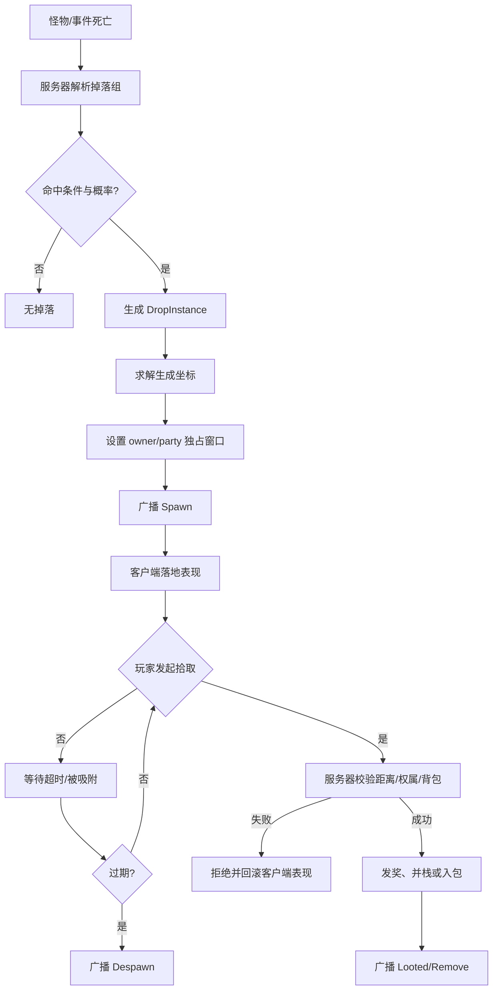
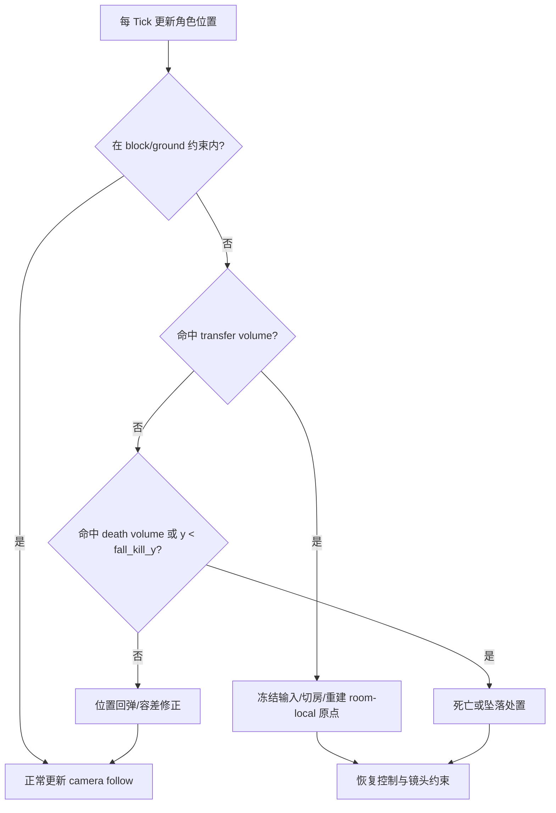
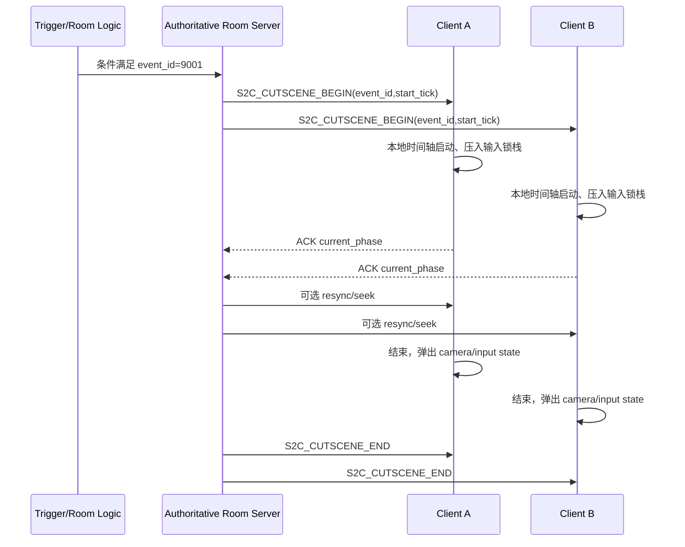

# DNF/DFO战斗子系统 clean-room 复刻技术报告

## 执行摘要

本报告的目标不是“按黑盒抓包把原作私有实现逐字节照抄”，而是把当前公开、可验证、可交叉佐证的资料，整理成一套能够**直接指导开发团队按里程碑逐项落地**的 clean-room 技术方案。结论很明确：公开证据最强的部分是 **PVF/NPK/IMG 资源格式、客户端局部坐标与动画数据表达、支援兵规则、以及一套已经在《地下城与勇士》内容里落地过的 AI 设计思想**；公开证据最弱的部分是 **官方实时战斗协议 opcode、房间边界具体字段、镜头锁定常量、以及客户端内存中的权威 runtime 对象布局**。因此，任何“1:1 复刻”都应拆成两层：第一层是**证据驱动的行为保真**，第二层是**不依赖泄露代码/素材的 clean-room 实现**。citeturn11view4turn13view1turn20view0turn26view0turn32view0turn34view0

公开一手材料主要来自 entity["company","Neople","game developer"] / entity["company","Nexon","game publisher"] 的官网更新、开发者 API 与 NDC 讲稿。它们足以证明：DNF 系列客户端长期采用自定义二进制资源容器，PVF 文件树会记录路径、长度、CRC32 与相对偏移；NPK 文件头是 `"NeoplePack_Bill\0"`，其中的 IMG 子文件头是 `"Neople Img File\0"`；客户端内部动画系统明确存在“本地坐标系”，并使用帧级图片位置、缩放、旋转数据；支援兵系统允许同账号角色在地下城内被召唤、施放一次预选技能、带公共冷却，并且其召唤物仅在当前房间内活动；公开 API 侧则只暴露 HTTPS + JSON 形式的静态角色/物品/技能数据，不暴露战斗时序协议。citeturn20view0turn21view0turn26view0turn26view2turn28view0turn31search2turn31search17turn34view0

关于你特别要求的“台服泄露客户端逆向数据”，本轮公开可索引、且能合法引用的证据，主要集中在**面向 Dungeon Fighter Taiwan 的公开工具与格式笔记**，例如 PvfPlayer 明确写明自己用于 “Dungeon Fighter Taiwan” 的 PVF 解包/打包，中文格式笔记也给出了台湾系 PVF 在 `stringtable.bin`、`n_string.lst`、脚本 chunk 上的读取规则。但**无法公开验证来源和完整性的泄露字段表、地址表、或内存符号 dump**，本报告一律不作为事实依据使用，也不会据此提供带有侵权或未授权逆向色彩的操作性步骤。citeturn11view3turn30view0

面向工程实施，最优路线不是直接克隆官方容器与私有协议，而是：**资源层**做“双栈兼容”（PVF/NPK 只读导入器 + 自建 JSON/FlatBuffers 运行时格式），**逻辑层**用“房间内权威服仿真 + 客户端局部预测 + 可回放战报”架构，**AI 层**统一到“状态机/脚本事件 + 技能危险域 + 录制式按键流”的组合模型，**演出层**统一到“服务器触发、客户端时间轴执行、输入锁栈化恢复”的事件系统。这样做既能最大化行为保真，也能把侵权与合规风险压到最低。citeturn13view0turn13view1turn20view0turn21view0turn30view0turn32view0

## 证据基础与可置信边界

下表给出本报告的证据等级、语言与使用方式。为保证可执行性，正文里我会把内容明确分成三类：**已证实的公开事实**、**高可信推断**、**建议的 clean-room 替代实现**。citeturn11view4turn22view0turn31search2turn34view0

| 来源 | 语言 | 可信度 | 本报告用途 |
|---|---|---:|---|
| Nexon 韩服更新页：支援兵系统 | 韩文 | A | 支援兵召唤、一次性技能、公共冷却、房间内活动范围、属性修正规则。citeturn34view0 |
| 腾讯国服老版本更新页：支援兵系统 | 中文 | A | 中文侧验证支援兵属于冒险团子系统、同账号同大区角色可注册。citeturn33search3 |
| DFO/Neople 官方英文更新页与活动页 | 英文 | A | 自动拾取半径示例、Mercenary/奖励系统存在性。citeturn31search1turn31search4turn31search9 |
| Neople Developers API Docs / FAQ / Guide | 韩文 | A | 官方静态物品 JSON 字段、仅提供 HTTPS/JSON、适合做静态 metadata 源。citeturn31search2turn31search11turn31search17 |
| NDC 官方页面与 Slideshare 讲稿 | 韩文 | A- | 客户端本地坐标系、旧动画帧格式、dumpable/内存复制结构、公开 AI 设计思路。citeturn11view4turn13view1turn13view2turn14view1turn14view2turn32view0 |
| `godof` PVF 解析代码 | 英文/代码 | B+ | PVF 头结构、文件树字段、`stringtable.bin` / `n_string.lst` 预载、typed unit 解析流程。citeturn20view0turn21view0turn21view2 |
| `DFOToolBox` NPK 解析代码 | 英文/代码 | B+ | NPK/IMG 头、IMG 帧元数据、压缩/像素格式转换、link frame 规则。citeturn26view0turn26view1turn26view2turn28view0turn28view1 |
| `PvfPlayer` | 英文 | B | 可验证“台湾版 PVF 工具链存在”，但不能等同于官方字段文档。citeturn11view3 |
| `similing4/pvf` 格式笔记 | 中文 | C+ | 台湾系/社区逆向格式说明：解密常量、chunk 结构、脚本类型枚举。需与解析器代码交叉验证。citeturn30view0 |

从格式层面看，公开证据已经足够建立一个稳定的导入器。PVF 解析代码显示：头部至少包含 `uuidLen`、`uuid`、`version`、`dirTreeLen`、`dirTreeCrc32`、`fileCount`、`ContentStartIdx`；文件树节点至少包含 `Fn`、`Path`、`Length`、`Crc32`、`RelativeOffset`；读取流程会先装载 `stringtable.bin` 和 `n_string.lst`，再把普通文件解释为由 2 字节前导与重复的“1 字节类型 + 4 字节值”单元流组成的 typed units。中文格式笔记则补足了区块解密常量 `0x81A79011`、脚本类型枚举和 `#PVF_File` 前导文本等细节。citeturn20view0turn21view0turn21view2turn30view0

从图像资源层面看，公开证据同样相当强。`DFOToolBox` 的 NPK 读取器明确写出了 NPK 文件头 `"NeoplePack_Bill\0"`，随后是文件数、每个文件的绝对偏移、大小、以及经固定 key 异或后的 256 字节路径名；IMG 子文件以 `"Neople Img File\0"` 开头，接着是三个 32 位字段和帧数，帧元数据则包含 `mode / compressedField / width / height / compressedLength / keyX / keyY / maxWidth / maxHeight`。对于像素数据，代码直接给出了 1555、4444 与 8888 三种格式转 RGBA 的展开逻辑，并在压缩帧上使用 inflate。citeturn26view0turn26view1turn26view2turn26view3turn28view0turn28view1

从坐标与动画层面看，公开 NDC 讲稿已经能证明“旧式逐帧图片系统”和“本地坐标系变换系统”并存。讲稿展示了旧格式中的 `[IMAGE]`、`[IMAGE POS]`、`[IMAGE RATE]`、`[IMAGE ROTATE]`、`[DELAY]` 标签，也明确写出 “던전앤파이터 로컬 좌표계기준 (DNF本地坐标系基准)” 的骨骼/皮肤计算表达式。这意味着房间几何、碰撞、镜头与演出系统若要高保真，就应该围绕**房间局部坐标**而不是世界绝对坐标来建模。citeturn13view2turn14view1turn14view2turn14view3

从 AI 层面看，最有价值的公开材料不是“怪物 AI 完整源码”，而是 2017 年 NDC 的 DNF PVP AI 复盘。其可验证信息包括：用 Lua/脚本工具让策划直接配置逻辑；用“按键流录制/回放”实现连招；用每个技能的“危险区域”驱动接近/回避；再叠加一个独立的 check state 处理起手与连段衔接；难度不是做多套逻辑，而是维持一套逻辑、只调精度/熟练度数据。这个模式非常适合迁移到“地下城 NPC / APC / 佣兵 / 支援单位”统一框架。citeturn11view7turn32view0

公开证据的**主要空白**有三项。第一，未找到可信、可引用的官方战斗协议字段表与 opcode 表。第二，未找到公开可索引的房间边界/镜头锁定原厂字段表。第三，未找到可合法使用的泄露客户端内存布局表。因此，凡是涉及协议号、内存偏移、反作弊绕过、抓包加解密、或泄露二进制地址，本报告都不会伪装成“已证实事实”；相关位置统一提供 **clean-room 协议与模型**，并明确标注为建议实现。citeturn31search17turn13view1turn20view0

下面两段十六进制片段，是本报告后续所有资源层实现的最小可验证锚点：

```text
NPK 文件头
4E 65 6F 70 6C 65 50 61 63 6B 5F 42 69 6C 6C 00
 N  e  o  p  l  e  P  a  c  k  _  B  i  l  l \0

IMG 文件头
4E 65 6F 70 6C 65 20 49 6D 67 20 46 69 6C 65 00
 N  e  o  p  l  e     I  m  g     F  i  l  e \0
```

这两个签名直接来自公开 NPK/IMG 解析代码。citeturn26view0turn26view2

```text
PVF 解密常量
0x81A79011  -> little-endian bytes: 11 90 A7 81
```

该常量来自公开中文格式笔记，用于按 4 字节块与 CRC32 混合后做位旋转/XOR 还原 chunk。citeturn30view0

## 掉落、拾取与战斗内奖励物件系统

公开资料足以支撑一个重要判断：**静态物品元数据**和**战斗中的掉落实例**一定要分层。官方开放 API 暴露的只是 `itemId`、`itemName`、`itemRarity`、`itemAvailableLevel`、`obtainInfo`、`count` 等静态或交易向字段；PVF 公开解析器加载的也主要是 stringtable、n_string 与 typed units。反过来说，掉落物的 UID、所有权窗口、生成坐标、生命周期等**房间期状态**，在公开资料里并不存在现成字段表，必须由服务端 runtime 自己管理。citeturn31search11turn31search17turn21view0turn30view0

### 功能概述

建议把“战斗奖励”拆成三类对象，而不是把所有获取行为都混成同一种实体。第一类是**物理掉落物**，存在于房间内，可见、可碰、可拾；第二类是**交互式奖励物件**，例如宝箱、救援 APC、机关奖励、临时 buff 触发物；第三类是**非物理结算奖励**，例如翻牌、通关汇总、剧本内直接发放奖励。这样划分的原因在于：官方 API 和官方活动文案已经证明物品能够有静态 `count`、`obtainInfo`，并且战斗内也确实存在带“自动拾取 100 px”效果的规则；而支援兵/APC 类型对象又明显不是普通掉落物。citeturn31search11turn31search9turn34view0

| 对象类别 | 是否占房间格/碰撞 | 是否需要 owner 权属 | 是否需要掉落表 | 是否需要同步位置 | 推荐处理方式 |
|---|---:|---:|---:|---:|---|
| 物理掉落物 | 是 | 是 | 是 | 是 | 服务器权威生成，客户端表现层插值 |
| 交互式奖励物件 | 是 | 通常否 | 可选 | 是 | 事件驱动生成，脚本/时间轴控制 |
| 非物理结算奖励 | 否 | 否 | 是 | 否 | 直接结算，不创建房间实体 |

上表中的第一、第三列来自对官方 API 物品字段、战斗内自动拾取文案与支援兵系统规则的交叉建模；第二类对象的“事件驱动”属性来自 DNF 公开的支援兵/APC 与特殊地下城键位设计。citeturn31search11turn31search9turn33search2turn34view0

### 数据结构

推荐的数据模型如下。注意：这不是“官方内存结构已知”，而是**基于公开静态字段 + 房间期需要补足的 clean-room 结构**。

```c
struct ItemStaticMeta {
    uint32 item_id;
    uint16 rarity;
    uint16 grade;
    uint16 available_level;
    uint8  stack_limit;
    uint8  bind_type;
    uint8  item_type;
    uint8  subtype;
    string name_key;
    string obtain_info;   // dungeon/shop/quest...
};

struct DropTableEntry {
    uint32 source_id;         // monster/object/event
    uint32 item_id;
    uint32 weight;
    uint16 min_count;
    uint16 max_count;
    uint8  ownership_policy;  // killer, party, free, quest
    uint8  spawn_policy;      // corpse_center, radial_scatter, anchor_point
    uint8  merge_policy;      // merge_if_same, no_merge
    uint8  reward_channel;    // physical, interactive, settlement
    uint32 condition_mask;    // difficulty/event/quest flags
};

struct DropInstance {
    uint64 drop_uid;
    uint32 room_id;
    uint32 item_id;
    uint16 stack_count;
    uint8  state;             // falling, idle, pick_pending, looted, despawn
    uint8  bind_flags;
    int32  pos_x;
    int32  pos_y;
    int32  pos_z;
    uint32 owner_actor_id;
    uint32 owner_party_id;
    uint32 born_tick;
    uint32 exclusive_until_tick;
    uint32 expire_tick;
    uint32 seed_fragment;
};
```

字段拆分依据，是官方静态物品字段与战斗期 entity 状态分离这一原则；静态部分可接官方 API / PVF 导入，动态部分由房间模拟服维护。citeturn31search11turn31search17turn21view0turn30view0

如果你希望兼容 PVF 风格的导入器，建议把静态物品、掉落组、掉落条件在离线编译阶段整理成运行时表，而不是战斗时直接解析 PVF。理由很现实：公开 NDC 演讲表明 DNF 客户端曾面临 54 万个数据文件和千万级图片文件带来的加载压力，开发团队还为此尝试过 dumpable 直接内存映射式读取与预读列表优化。运行时继续解析文本/typed units，只会把战斗延迟推高。citeturn11view5turn13view1

### 关键算法

掉落系统的“像不像 DNF”，不在于某个神秘概率公式，而在于四个阶段是否分离干净：**掉落组决策、物品实例化、位置求解、拾取归属与销毁**。公开资料中能证实的只有“物品有静态来源元数据”“引擎存在自动拾取半径型参数”“运行时消息结构适合内存复制/队列化”；具体概率和时序，需要你以 clean-room 方式重建。citeturn31search11turn31search9turn13view0

下图给出推荐的物理掉落生命周期。



这个分层既能支持手动拾取，也能支持“自动拾取半径”型规则。官方英文活动页已经出现过 “Auto item pickup within 100 px” 的文案，因此建议把自动拾取完全做成**可配置磁吸半径**，并挂在 buff / item effect / dungeon rule 上，而不是写死成“特定道具特例”。citeturn31search9

建议的掉落/拾取伪代码如下：

```pseudo
function onDefeat(source, killer, room, seed):
    groups = resolveDropGroups(source, room.difficulty, room.questFlags, room.eventFlags)
    for group in groups:
        if !roll(group.probability, seed):
            continue

        entry = weightedPick(group.entries, seed)
        meta  = itemMeta[entry.item_id]
        qty   = rollRange(entry.min_count, entry.max_count, seed)

        if entry.reward_channel == settlement:
            grantSettlementReward(killer.party, meta, qty)
            continue

        pos = solveDropSpawnPosition(
            source.deathPos,
            room.groundSegments,
            room.blockVolumes,
            entry.spawn_policy,
            seed
        )

        owner = resolveOwnership(entry.ownership_policy, killer)

        drop = DropInstance(
            uid = allocUid(),
            room_id = room.id,
            item_id = entry.item_id,
            stack_count = qty,
            pos = pos,
            owner_actor_id = owner.actorId,
            owner_party_id = owner.partyId,
            exclusive_until_tick = now + owner.exclusive_ms,
            expire_tick = now + computeTTL(meta, room),
            state = idle
        )

        room.spawn(drop)
        broadcast(dropSpawn(drop))

function requestPickup(actor, dropUid):
    drop = room.findDrop(dropUid)
    require(drop != null)
    require(distance(actor.pos, drop.pos) <= pickupRadius(actor, drop))
    require(inOwnershipWindow(actor, drop) || drop.exclusiveExpired())
    require(inventoryCanAccept(actor, drop.item_id, drop.stack_count))

    grantItem(actor, drop.item_id, drop.stack_count)
    drop.state = looted
    room.remove(drop)
    broadcast(dropRemove(dropUid, actor.id))
```

这份伪代码的关键是：**随机只发生在服务器；位置只由服务器决定；权属只在服务器校验；客户端永远只做先行表现，不做发奖判定**。其理由来自公开资料中对静态元数据、房间实体、消息队列优化与支援单位房间内局部活动的共同约束。citeturn13view0turn21view0turn31search11turn34view0

生成位置建议采用“三段式算法”：先尝试以死亡点为中心的首选锚点；若穿模或落在障碍体内，则沿地面法线投影到最近可站立段；再失败则做半径递增的环形采样。DNF 的旧动画/坐标系统已经表明 2D 角色和贴图需要在本地坐标里做多次平移/旋转修正，所以掉落位置也应在房间本地坐标中求解，最终再交给客户端表现层。citeturn13view2turn14view1turn14view2

### 网络消息

公开资料没有提供官方 opcode 或战斗包头，因此下面给出的消息是**clean-room 建议协议**，用于保证房间一套仿真逻辑可以支撑掉落、拾取、回放与重连。不要把它误读成“官方包结构已恢复”。另一方面，NDC 的 dumpable 分享明确说明“复杂游戏内部结构可直接读取、消息队列可做单纯内存复制”，这说明用定长头 + 小对象消息的战斗总线很适合这个题材。citeturn13view0turn13view1

```c
struct CombatMsgHeader {
    uint16 opcode;
    uint16 length;
    uint32 room_id;
    uint32 tick;
    uint32 actor_seq;
};
```

| 消息 | 方向 | 关键字段 | 说明 |
|---|---|---|---|
| `S2C_DROP_SPAWN` | S→C | `drop_uid,item_id,count,pos_x,pos_y,pos_z,owner_actor_id,exclusive_until_tick,expire_tick` | 创建房间内可见掉落 |
| `C2S_PICKUP_REQ` | C→S | `drop_uid,actor_id,client_pos_x,client_pos_y` | 只表示意图，不表示成功 |
| `S2C_PICKUP_RES` | S→C | `drop_uid,result_code,looter_actor_id,new_stack_count` | 校验成功/失败与并栈结果 |
| `S2C_DROP_REMOVE` | S→C | `drop_uid,reason(looted/expired/merged)` | 广播删除 |
| `S2C_SETTLEMENT_REWARD` | S→C | `channel,reward_id,count` | 非物理奖励，不创建实体 |

建议协议的字段选型，受三件事驱动：一是掉落本身属于房间态，需要 `room_id + tick`；二是拾取必须容忍客户端先行表现，所以要有显式失败返回；三是重连/回放需要能从日志中重建对象生命周期。citeturn13view0turn31search11

### 资源文件路径与格式示例

**公开可证的格式锚点**有四个：`stringtable.bin`、`n_string.lst`、PVF typed unit 文件，以及 NPK/IMG 里的图片帧。公开中文笔记说明了 `stringtable.bin` 与 `n_string.lst` 的结构，公开 Go 解析器则证实了会先读这两个文件再解析普通脚本，普通脚本的单元类型至少包含 Int / Float / Section / Command / String / StringLinkIndex / StringLink。citeturn21view0turn30view0

```text
公开可证路径/资源示例
- stringtable.bin
- n_string.lst
- Monster/Tau/Body.img
- Script\Character
```

上面这些路径来自公开工具和 NDC 讲稿中的示例。citeturn13view2turn30view0

如果你的目标是工程可维护而不是古法致敬，我建议运行时把掉落改编译成下面这种资源，而不是战斗中直接啃 PVF：

```json
{
  "drop_table_id": "monster_10032_normal",
  "entries": [
    { "item_id": 20311, "weight": 5000, "min": 1, "max": 3, "owner": "party", "spawn": "corpse_center" },
    { "item_id": 9413,  "weight": 25,   "min": 1, "max": 1, "owner": "killer", "spawn": "radial_scatter" }
  ],
  "ttl_ms": 15000,
  "auto_pickup_tags": ["currency", "quest"]
}
```

这个 JSON 不是官方格式，而是推荐的运行时格式；它的好处是测试友好、热更友好，也能给策划做审计。其字段来源则仍然可以对接官方 API/PVF 的 `itemId / rarity / obtainInfo` 等静态信息。citeturn31search11turn31search17turn21view0

### 常见异常与处理方案

| 异常 | 根因 | 处理策略 |
|---|---|---|
| 客户端先吸附成功，但服务器拒绝拾取 | 本地距离预测过宽、 owner 窗口未过、背包已满 | 客户端收到 `S2C_PICKUP_RES=fail` 后回弹掉落并播放轻量失败提示 |
| 多人同时抢同一掉落 | 延迟竞争 | 服务器 CAS 锁定 `drop_uid`，只允许一个 `pick_pending` |
| 掉落生成到阻挡体/墙内 | 直接按死亡点生成 | 采用“锚点→投影→环采样”三段式求解 |
| 同类物品堆叠导致视觉闪烁 | 并栈时重复创建/删除表现对象 | 以服务器 `drop_uid` 为准，支持原地更新 `stack_count` |
| 重连后看到幽灵掉落 | 客户端缓存未清空 | 房间快照同步时以“完整 drop 列表重建”覆盖本地缓存 |

这些异常并非公开 DNF 文档直接列出，而是由上面证据里可验证的“服务器权威 + 房间局部对象 + 静态/动态物品分层”逻辑推导出的必然工程问题。citeturn31search11turn13view0turn34view0

### 实现步骤与验收标准

建议按下面的顺序落地：

1. **静态物品编译器**：把 PVF/API 导入成统一 `ItemStaticMeta` 表。
2. **掉落编译器**：把掉落组编译成只读 runtime 索引。
3. **房间掉落实体系统**：完成生成、并栈、TTL、Owner Window。
4. **拾取系统**：完成手动拾取、自动拾取、失败回滚。
5. **回放与断线恢复**：战斗日志能够重建全部 `drop_uid` 生命周期。

对应的里程碑验收标准建议如下：

| 里程碑 | 验收标准 |
|---|---|
| M1 | 同一 seed + 同一战斗回放，掉落项、数量、owner 一致 |
| M2 | 1 万次压力测试中，掉落生成点无一例出现在阻挡体内部 |
| M3 | 双人同时抢同一掉落时，无重复发奖、无幽灵残留 |
| M4 | 开启“100 px 自动拾取”型 buff 后，客户端与服务器拾取成功率一致 |
| M5 | 掉线重连后，房间内 remaining 掉落与服务器快照完全一致 |

第 M4 项之所以明确提 “100 px”，是因为官方英文活动文案已经出现这一半径表达，建议你把它当成可调参数来验证磁吸系统。citeturn31search9

## 房间边界、摄像机锁定与出界处理系统

这一部分的公开资料**没有**给出官方“房间边界表”的字段定义，但公开 NDC 讲稿已经足够证明 DNF 客户端有非常明确的**本地坐标表达能力**：旧动画资源里每一帧都能指定 `[IMAGE POS] / [IMAGE RATE] / [IMAGE ROTATE] / [DELAY]`；将 Spine 接进 DNF 时，讲师专门讨论了 “SPINE 坐标系” 与 “던전앤파이터 로컬 좌표계 (DNF本地坐标系)” 的换算以及骨骼/皮肤的旋转、平移、NonUniformScale 处理。换句话说，房间边界、碰撞与镜头锁定最稳妥的复刻方法，不是把角色挂到一整张世界地图上，而是每个房间单独维护局部坐标原点与边界盒。citeturn13view2turn14view1turn14view2turn14view3

### 功能概述

建议把房间几何拆成五种基本体：**可行走段**、**阻挡盒**、**传送体积**、**死亡体积**、**镜头约束盒**。其中角色移动和落点求解只关心可行走段 + 阻挡盒；镜头只关心镜头约束盒；出界处理则只关心死亡体积与传送体积。这样可以避免“一个矩形字段既用于碰撞又用于镜头”的耦合地狱。这个拆法，直接受 NDC 里“本地坐标 + 图像中心/骨骼变换”模式启发。citeturn14view1turn14view2turn14view3

### 数据结构

```c
struct Segment2D {
    int32 x1, y1;
    int32 x2, y2;
    uint8 ground_type;    // normal, slope, platform, jumpthrough
};

struct RectVolume {
    int32 min_x, min_y;
    int32 max_x, max_y;
    uint8 kind;           // block, transfer, death, trigger
    uint32 arg0;
    uint32 arg1;
};

struct RoomCameraBounds {
    int32 cam_min_x, cam_min_y;
    int32 cam_max_x, cam_max_y;
    int32 follow_deadzone_left;
    int32 follow_deadzone_right;
    int32 follow_deadzone_top;
    int32 follow_deadzone_bottom;
    uint8 lock_policy;    // free, wave_lock, boss_lock, cutscene_lock
};

struct RoomRuntime {
    uint32 room_id;
    int32 origin_x, origin_y;
    vector<Segment2D> walk_segments;
    vector<RectVolume> volumes;
    RoomCameraBounds camera;
    int32 respawn_x, respawn_y;
    int32 fall_kill_y;
};
```

这套字段的核心思想是：**角色、怪物、掉落、镜头全部以 room-local 坐标运行**，换房间再重置局部原点。公开讲稿中的“DNF 本地坐标系”是这套建模最强的公开根据。citeturn14view1turn14view2turn14view3

### 关键算法

角色边界求解建议采用“宽相位矩形 + 窄相位支持段”两层。原因是 DNF 一类横版动作游戏的判定重点不是完整刚体物理，而是**角色脚底支持关系 + 水平推进修正 + 少量斜坡/落台**。公开 NDC 资料里旧帧动画采用的是显式图片偏移，而不是完整骨骼碰撞解算，这更适合“游戏式碰撞”而不是“引擎式 rigidbody”。citeturn13view2turn14view2

建议的相机算法分三种模式：

- **自由跟随**：镜头以主要玩家为 anchor，在 deadzone 内不动，超出后缓动追随。
- **关门锁房**：当房间进入战斗锁定态时，镜头 clamp 到该房间 `cam_min/max`。
- **演出强制镜头**：由时间轴系统暂时接管相机 target 与 clamp。

这里的“关门锁房”虽然没有公开字段表，但它是从“房间局部坐标 + 支援兵仅在当前房间活动 + 实际玩法结构”推导出的高可信实现方式。citeturn14view1turn14view2turn34view0

下面给出出界处理的推荐流程。



建议的位移与镜头伪代码如下：

```pseudo
function simulateActor(actor, dt):
    desired = actor.pos + actor.velocity * dt
    desired = resolveHorizontalBlock(actor.hurtbox, desired, room.blockVolumes)
    support = findBestSupportSegment(actor.footPoint, desired, room.walkSegments)

    if support.exists:
        desired.y = projectToSupport(desired.x, support)
        actor.grounded = true
    else:
        actor.grounded = false

    if insideTransferVolume(desired):
        beginRoomTransfer(actor)
        return

    if insideDeathVolume(desired) or desired.y < room.fall_kill_y:
        beginOutOfBoundsDeath(actor)
        return

    if !insideSoftBounds(desired):
        desired = softClamp(desired, room)
        actor.velocity = damp(actor.velocity)

    actor.pos = desired
    camera.update(actor.pos, room.camera, room.state)
```

### 网络与同步

公开资料没有官方镜头包，因此建议把镜头同步降到**事件级**，而不是逐帧发 camera transform。也就是说，正常战斗中的镜头由客户端本地算；只有在“锁房、过图、强制演出、Boss 入场、房间恢复”这类离散事件上，由服务器广播状态切换。这样既省带宽，也更接近 DNF 这种“房间制横版动作”的需求。对移动来说，仍然建议服务器权威，客户端做短期预测。citeturn13view0turn14view1turn34view0

| 消息 | 方向 | 字段 | 说明 |
|---|---|---|---|
| `S2C_ROOM_LOCK_STATE` | S→C | `room_id,lock_state,door_mask` | 进入清怪锁房 / Boss 锁房 |
| `S2C_ROOM_TRANSFER_BEGIN` | S→C | `from_room,to_room,spawn_x,spawn_y,camera_preset` | 切房前冻结 |
| `S2C_ROOM_TRANSFER_END` | S→C | `to_room,spawn_x,spawn_y,camera_state` | 切房后重建局部原点 |
| `S2C_OUT_OF_BOUNDS_RESOLVE` | S→C | `actor_id,resolve_type,server_x,server_y` | 回弹 / 传送 / 死亡 |
| `C2S_MOVE_INPUT` | C→S | `input_mask,pos_hint_x,pos_hint_y` | 普通移动输入 |

### 资源文件路径与格式示例

在本轮公开资料中，**没有找到可验证的官方房间边界文件路径**。因此最稳妥的做法是：保留一套面向策划的高层房间配置，自建编译器输出运行时二进制。建议路径如下：

```json
{
  "room_id": 1010203,
  "origin": [0, 0],
  "walk_segments": [
    { "x1": -640, "y1": 0, "x2": 640, "y2": 0, "type": "normal" }
  ],
  "volumes": [
    { "kind": "block", "min": [-720, -64], "max": [-640, 256] },
    { "kind": "transfer", "min": [620, -32], "max": [700, 220], "to_room": 1010204 },
    { "kind": "death", "min": [-9999, 780], "max": [9999, 9999] }
  ],
  "camera": {
    "min": [-500, -120],
    "max": [500, 120],
    "deadzone": [120, 60]
  }
}
```

如果你后续拿到合法授权的原始地图数据，这层可以再写转换器；但在此之前，不建议把战斗逻辑绑死在私有容器上。公开资料能证明的是“本地坐标与图片关键帧表达存在”，不能证明某个具体 map 文件路径。citeturn13view2turn14view1turn14view3

### 常见异常与处理方案

| 异常 | 表现 | 处理 |
|---|---|---|
| 门边来回抖动 | 客户端和服务器对 transfer volume 判定边界不同 | volume 使用半开区间，并在服务器回传最终 spawn |
| 镜头穿出房间 | 本地 follow 先算、后 clamp | 先求 target，再 clamp 到 room camera bounds |
| 角色被击飞出软边界 | 击退后栈修正过度 | 软边界与死亡边界分离；先弹回，重复超限再击杀/传送 |
| 多人房主视角不一致 | 各自以自己角色为锚点 | 约定主跟随角色：单人=自己，组队=本机角色；Boss 演出强制统一 |
| 坠落死亡后镜头未恢复 | cutscene/camera state 栈未出栈 | 所有出界流程走统一 `finally restore camera/input` |

### 实现步骤与验收标准

1. **房间局部坐标层**：角色、怪物、掉落、镜头全部切到 room-local。
2. **碰撞与支持段系统**：只做游戏物理，不上刚体引擎。
3. **房间切换与锁房**：完成 transfer/door/camera 联动。
4. **出界流程**：回弹、传送、坠落死亡三支路齐全。
5. **战斗回放**：任意房间切换与出界都可在日志回放中重建。

| 里程碑 | 验收标准 |
|---|---|
| M1 | 所有角色/怪物/掉落在同一房间使用同一局部坐标系 |
| M2 | 镜头在任意战斗与切房流程中不越界 |
| M3 | 连续 1 万次击飞/浮空/传送测试，无“门边抖动”与“穿墙” |
| M4 | 坠落死亡、回弹、切房三条流程均能正确恢复输入与镜头状态 |

## NPC、佣兵与支援单位系统

这一部分是本轮公开资料里**最适合直接转成工程方案**的系统。原因有二。其一，2017 年 NDC 的 DNF PVP AI 复盘已经清楚给出了一套“策划可用、成本可控、可快速扩内容”的 AI 思路：Lua/脚本配置、按键流录制/回放、技能危险域、move state + check state、难度由精度数据调节，而不是重写一套 AI。其二，韩服官方支援兵系统说明又给出了召唤规则：同账号角色可登记，选定一个技能，地下城里按 `Tab` 召唤，施放一次后消失，有公共冷却，技能与道具消耗由召唤者承担，部分属性与冷却被修正，召唤物只在当前房间活动。把两者合起来，已经能形成 DNF 风味很强的统一框架。citeturn32view0turn34view0turn33search3

### 功能概述

建议统一建模三类单位：

- **APC/剧情 NPC**：短生命周期、偏脚本化、强调事件钩子。
- **支援兵**：一次性召唤、一次性技能、房间内短驻留。
- **佣兵/跟随单位**：可持续存在、具备基础寻路和技能调度。

不要为三类对象写三套系统。最佳做法是：统一 `ActorRuntime + Blackboard + SkillEnvelope + ControlMode`，再通过 `control_mode` 切换行为层。NDC AI 方案里的“录制式按键流”特别适合拿来做支援兵与 APC 的 **开场技能 / 定番连段 / 处决脚本**；而“危险域 + move/check state”适合拿来补足持续作战单位的走位与起手。citeturn32view0turn34view0

### 数据结构

```c
enum ControlMode : uint8 {
    ScriptedTimeline,
    SupportOneShot,
    CombatCompanion,
    BossAI,
    PassiveNPC
};

struct SkillEnvelope {
    uint32 skill_id;
    uint16 cast_time_ms;
    uint16 backswing_ms;
    uint16 cooldown_ms;
    uint16 mp_cost;
    uint16 item_cost_id;
    uint16 item_cost_count;
    Rect danger_area;         // 用于 AI 估计
    Rect active_hit_area;     // 用于判定
    uint8  ai_tag_mask;       // launch, hold, escape, finisher...
};

struct AIAccuracyProfile {
    uint16 execution_accuracy;
    uint16 spacing_accuracy;
    uint16 reaction_delay_ms;
    uint16 combo_commit_ms;
    uint8  aggressiveness;
    uint8  escape_bias;
};

struct SupportUnitSpec {
    uint32 actor_template_id;
    uint32 selected_skill_id;
    uint32 summon_cooldown_ms;
    uint8  stat_scale_policy;
    uint8  consume_from_summoner;   // 1=true
    uint8  room_local_only;         // 1=true
    uint8  party_shared_cd;         // 1=true
};

struct AIStateBlackboard {
    uint32 target_actor_id;
    int32 desired_range_min;
    int32 desired_range_max;
    Rect  merged_enemy_danger;
    uint32 last_hit_tick;
    uint32 last_escape_tick;
    uint32 combo_script_id;
    uint8  move_state;
    uint8  check_state;
};
```

其中 `danger_area`、`AIAccuracyProfile` 与 `move_state/check_state` 的设计，直接来自公开 NDC 复盘里“危险区域”“move state”“check state”“难度由精度数据实现”的要点；`SupportUnitSpec` 则直接映射官方支援兵规则。citeturn32view0turn34view0

### 关键算法

最值得直接照搬的是**录制式按键流 + 状态机守门**。NDC 复盘说明，他们为了应对 51 个职业、153 组 AI 的内容爆炸，把连招抽象成“键流录制文件”，并让 AI 只在满足前置条件的时候回放；同时再用危险域来做接近/回避。这个思路放到地下城里尤其有效，因为 DNF 风格 NPC 的“像不像”，主要不在宏图决策，而在**起手顺序、节奏、取消点、先空格后技能还是先技能后平 A** 这些动作纹理上。citeturn32view0

建议的单位更新伪代码如下：

```pseudo
function updateUnitAI(unit, room, dt):
    if unit.control_mode == PassiveNPC:
        return

    if unit.control_mode == SupportOneShot:
        if !unit.hasFired:
            castSelectedSkillOnce(unit)
            unit.hasFired = true
            scheduleDespawn(unit, after = skillTotalTime(unit))
        return

    bb = unit.blackboard
    bb.target = selectTarget(unit, room)
    bb.merged_enemy_danger = mergeDangerAreas(bb.target.availableSkills)

    if shouldEscape(unit, bb):
        enterMoveState(unit, ESCAPE)
        executeSpacing(unit, awayFrom = bb.merged_enemy_danger)
        return

    if canStartRecordedCombo(unit, bb):
        replayKeystream(unit.combo_script_id, unit.accuracyProfile)
        return

    if canDoCheckStateStarter(unit, bb):
        useStarterSkill(unit)      // 比如短前摇、易命中起手
        return

    enterMoveState(unit, APPROACH)
    executeSpacing(unit, targetRange = [bb.desired_range_min, bb.desired_range_max])
```

支援兵的召唤则应独立于一般 AI tick：

```pseudo
function summonSupport(summoner, supportSpec):
    require(sharedCooldownOk(summoner.party, supportSpec))
    require(resourceCostOk(summoner, supportSpec.selected_skill_id))
    consumeSkillAndItemsFromSummoner(summoner, supportSpec.selected_skill_id)

    unit = spawnSupportActor(
        template = supportSpec.actor_template_id,
        pos = resolveSupportSpawnPosNearSummoner(),
        control_mode = SupportOneShot
    )

    applyScaledStats(unit, summoner.level, capReinforce = +12)
    markRoomLocalOnly(unit)
    setSharedCooldown(summoner.party, supportSpec.summon_cooldown_ms)
```

这里的 `consumeSkillAndItemsFromSummoner`、`party shared cooldown`、`capReinforce = +12`、`room local only` 都是官方韩服说明里直接可证的规则。citeturn34view0

### 路径与寻路

公开 DNF 资料没有给出“正式 A* 导航网格格式”，所以不建议在横版房间里过度设计 3D navmesh。对 DNF 风格最经济的实现，是：

- 房间级：用 **walk segments + 连接点图** 表示大路径。
- 近身级：用 **slot reservation** 管理围攻站位。
- 垂直级：跳台、落台、传送点都当成显式边。

这比 NavMesh 更适合“横版 + 平面技能带 + 房间切换”的题材。并且与官方 NDC 中“危险域驱动走位”的思路高度兼容。citeturn32view0turn14view1

### 网络与同步

建议 NPC/佣兵/支援单位全部走**服务器权威决策**。客户端可对随从移动做轻量插值，但不要让客户端预测技能释放，因为这会在“起手成功 / 危险域回避 / 连招承诺”上快速失真。对支援兵，更应严格按事件同步：因为官方规则决定它通常只放一次预选技能后消失，天然适合消息化而不适合持续预测。citeturn34view0turn32view0

| 消息 | 方向 | 字段 | 说明 |
|---|---|---|---|
| `C2S_SUPPORT_CALL_REQ` | C→S | `support_slot_id` | 请求召唤支援兵 |
| `S2C_SUPPORT_CALL_RES` | S→C | `result,shared_cd_until,spawn_actor_id` | 召唤结果 |
| `S2C_NPC_SPAWN` | S→C | `actor_id,template_id,pos,control_mode` | 生成 APC/NPC/佣兵 |
| `S2C_AI_SKILL_CAST` | S→C | `actor_id,skill_id,target_id,cast_tick` | 技能开始 |
| `S2C_AI_DESPAWN` | S→C | `actor_id,reason` | 消失/死亡/阶段切换 |

### 资源文件路径与格式示例

如果要保留 DNF 风格，建议把“静态角色模板”和“行为脚本/键流”分开。公开资料能证明存在 `Script\Character`、`Monster/.../*.img` 以及录制式连招思想；因此推荐资源结构如下：

```json
{
  "template_id": 4002101,
  "display_name": "support_blade_master",
  "base_stats": { "hp": 12000, "mp": 3000, "atk": 1800 },
  "skills": [1201, 1210, 1225],
  "ai": {
    "control_mode": "SupportOneShot",
    "selected_skill_id": 1225,
    "combo_script_id": 0,
    "danger_profile": "melee_front_arc"
  }
}
```

```json
{
  "combo_script_id": 71003,
  "recorded_inputs": [
    { "t": 0,   "keys": ["RIGHT"] },
    { "t": 80,  "keys": ["X"] },
    { "t": 160, "keys": ["X"] },
    { "t": 260, "keys": ["SKILL_3"] }
  ]
}
```

这种“模板 + 键流”拆分，正是根据 NDC 复盘中“录制并保存按键流，用脚本回放”的做法整理出来的 clean-room 资源模型。citeturn32view0

### 常见异常与处理方案

| 异常 | 表现 | 处理 |
|---|---|---|
| 支援兵被召唤后跨房仍存在 | 房间切换时未统一清理 room-local entity | 在 `room transfer begin` 时强制回收所有 `room_local_only` 支援实体 |
| 支援兵施法失败但资源已扣 | 资源扣除与召唤生成分两事务 | 资源扣除与 `spawn actor` 包成一个原子事务 |
| AI 反应太“机械” | 固定起手、固定帧精度 | 用 `AIAccuracyProfile` 引入命中误差与 reaction delay |
| APC 卡位 | 多单位争抢同一攻击槽 | 使用 slot reservation + 超时换位 |
| 支援兵伤害与本体严重失衡 | 直接复制角色装备 | 按官方规则做等级/属性修正，并限制强化/增幅上限到 +12 |

最后一条并不是凭空建议，而是直接来自官方支援兵说明。citeturn34view0

### 实现步骤与验收标准

1. **统一 ActorRuntime**：NPC/APC/佣兵/支援兵共用一套运行时基类。
2. **技能危险域系统**：每个技能带可供 AI 使用的危险域描述。
3. **键流录制/回放器**：策划可录、可重放、可加随机误差。
4. **支援兵系统**：完成官方规则的冷却、消耗、房间限制、属性修正。
5. **持续作战 companion AI**：接入 move/check state 与目标选择。

| 里程碑 | 验收标准 |
|---|---|
| M1 | 录制同一键流 100 次回放，动作轨迹误差在可控阈值内 |
| M2 | 支援兵满足“单次施法、公共冷却、房间内召唤物限制、消耗从召唤者扣除” |
| M3 | 三档难度仅通过 `AIAccuracyProfile` 调参即可拉开胜率曲线 |
| M4 | 20 个以上单位同房间作战，无明显卡位死锁 |
| M5 | 回放日志可重建任意 AI 技能起手与消失原因 |

## 剧情演出、强制镜头与控制剥夺系统

这部分是公开证据最弱、但工程上最不能偷懒的系统。公开资料并没有给出“DNF 官方演出协议”的字段表；不过，NDC 的客户端动画接入讲稿已经明确显示，DNF 客户端具备足够的时间轴素材表达能力：图片帧位置、缩放、旋转、骨骼变换、皮肤偏移、以及本地坐标系下的动画插值都已存在。再结合官方控制器说明里出现的 “Dungeon Special Key” 这类地下城特种输入通道，可以合理推断：**强制镜头与控制剥夺应当作为战斗事件系统的一部分，而不是 UI 层补丁**。下面给出的模型属于高可信 clean-room 设计，不宣称为官方字段已恢复。citeturn13view2turn14view1turn14view2turn14view3turn33search2

### 功能概述

建议把剧情演出系统拆成四层：

- **触发层**：区域、血量、击杀、交互、房间状态、时间条件。
- **时间轴层**：摄像机轨、角色轨、特效轨、字幕轨、音频轨、输入锁轨。
- **同步层**：服务器发“开始/跳转/结束”，客户端本地推进时间轴。
- **恢复层**：无论正常结束、跳过、断线、死亡，都统一走 `restoreInputAndCamera()`。

这样设计的原因很简单：战斗内演出与普通 UI 动画最大的区别，是它们会**抢占控制权**，而控制权一旦抢占，就必须有严格的栈式恢复。citeturn14view1turn14view3

### 数据结构

```c
struct TriggerCondition {
    uint8  type;          // enter_volume, hp_below, kill_count, interact, timer
    uint32 arg0;
    uint32 arg1;
    uint32 arg2;
};

struct CameraKeyframe {
    uint32 time_ms;
    int32  target_x;
    int32  target_y;
    float  zoom;
    float  shake_amp;
    uint8  clamp_policy;  // room, custom, none
    uint8  easing;
};

struct ControlLockTrack {
    uint32 start_ms;
    uint32 end_ms;
    uint32 lock_mask;     // move, attack, skill, item, menu, dodge
};

struct CutsceneEvent {
    uint32 event_id;
    uint32 room_id;
    vector<TriggerCondition> triggers;
    vector<CameraKeyframe> camera_track;
    vector<ControlLockTrack> lock_track;
    uint32 timeline_length_ms;
    uint8  network_policy;   // everyone, instigator_only, party
    uint8  skip_policy;      // no_skip, host_skip, all_vote_skip
};
```

### 关键算法

演出触发一定要由服务器裁决，原因不是“怕作弊”这么简单，而是要避免多人房里一个客户端进入剧情、另一个客户端还在清怪的状态分叉。一旦触发，客户端只负责本地跑时间轴、插值镜头与锁输入；服务器只要保留当前 `event_id + start_tick + time_origin` 即可。citeturn13view0turn14view1

```pseudo
function evaluateRoomTriggers(room):
    for event in room.cutsceneEvents:
        if event.hasFired:
            continue
        if allConditionsMet(event.triggers, room):
            event.hasFired = true
            room.controlState.push(event.event_id)
            broadcast(beginCutscene(event.event_id, serverTickNow()))
            applyAuthoritativeFlags(room, event)

function clientOnBeginCutscene(eventId, serverTick):
    timeline = loadTimeline(eventId)
    localStart = syncClock(serverTick)
    inputLockStack.push(timeline.lock_track)
    cameraStack.push(timeline.camera_track)
    timeline.play(from = 0, start = localStart)

function finalizeCutscene(eventId, reason):
    timeline.stop(eventId)
    inputLockStack.remove(eventId)
    cameraStack.remove(eventId)
    restoreCharacterControl()
```

建议特别引入**输入锁栈**，而不是单一 `bool inputDisabled`。原因是 DNF 风格的战斗里，强制镜头、开门锁房、Boss 入场、教程指引、支援兵特殊动作、乃至某些特殊按键提示，都是可能重叠的。用栈才能保证“后进先出、异常可恢复”。citeturn33search2turn14view1

下图给出推荐的多人房演出同步时序。



### 网络与同步

依旧强调：下面的包是推荐协议，不是公开恢复的官方 opcode 表。

| 消息 | 方向 | 字段 | 说明 |
|---|---|---|---|
| `S2C_CUTSCENE_BEGIN` | S→C | `event_id,start_tick,start_phase` | 开始演出 |
| `C2S_CUTSCENE_ACK` | C→S | `event_id,current_phase,local_clock` | 客户端确认进入 |
| `S2C_CUTSCENE_SEEK` | S→C | `event_id,time_ms,phase` | 延迟客户端重同步 |
| `C2S_CUTSCENE_SKIP_REQ` | C→S | `event_id,vote` | 跳过投票或请求 |
| `S2C_CUTSCENE_END` | S→C | `event_id,reason` | 恢复控制 |
| `S2C_INPUT_MASK_PATCH` | S→C | `mask,begin_tick,end_tick` | 非完整演出、但需要短暂剥夺输入 |

### 资源文件路径与格式示例

如果你已经准备做统一战斗时间轴，推荐把镜头、输入锁与事件触发放在同一个文件，而不是拆成零散脚本：

```json
{
  "event_id": 9001,
  "room_id": 1010209,
  "triggers": [
    { "type": "enter_volume", "arg0": 12 },
    { "type": "kill_count", "arg0": 6 }
  ],
  "camera_track": [
    { "time_ms": 0,    "target_x": 120, "target_y": 0,   "zoom": 1.00, "shake_amp": 0.0, "clamp_policy": "room" },
    { "time_ms": 600,  "target_x": 340, "target_y": -30, "zoom": 1.15, "shake_amp": 0.2, "clamp_policy": "custom" },
    { "time_ms": 1400, "target_x": 480, "target_y": 0,   "zoom": 1.00, "shake_amp": 0.0, "clamp_policy": "room" }
  ],
  "locks": [
    { "start_ms": 0, "end_ms": 1600, "mask": ["move", "attack", "skill", "item"] }
  ],
  "skip_policy": "all_vote_skip"
}
```

这个时间轴文件应该与房间配置、Boss 阶段脚本、触发器编译器一起进入离线构建流程。其设计基础来自公开动画讲稿展示出的关键帧能力，而不是任意猜测。citeturn13view2turn14view1turn14view3

### 常见异常与处理方案

| 异常 | 表现 | 处理 |
|---|---|---|
| 客户端丢包导致剧情慢半拍 | A 已锁输入，B 仍可操作 | 服务器保留 `start_tick`，客户端 ACK 超时则强制 `seek` |
| 玩家在演出中死亡 | 输入锁提前释放或永不恢复 | 全部走统一 `finalizeCutscene(reason)` |
| 投票跳过后镜头没清回去 | 只停时间轴，没清状态栈 | `cameraStack` 与 `inputLockStack` 必须绑定 event_id 拆栈 |
| 剧情和锁房同时发生 | 状态互相覆盖 | 所有控制剥夺统一进 `ControlStateStack` |
| 断线重连进入房间时正处于演出中 | 重连玩家看到常态战斗 | 房间快照里带 `active_cutscene_id + timeline_time_ms` |

### 实现步骤与验收标准

1. **统一 TriggerGraph**：房间内所有剧情触发都从同一图里评估。
2. **时间轴播放器**：完成 camera / lock / effect 三种轨道。
3. **服务器事件裁决**：开始、seek、结束三类同步闭环。
4. **恢复保障**：死亡、跳过、断线、切房都能正常出栈。
5. **录屏回放验证**：多人房客户端录屏对齐误差可测。

| 里程碑 | 验收标准 |
|---|---|
| M1 | 单机房内 100 次重复触发，镜头轨迹与输入锁轨迹一致 |
| M2 | 双人房中，进入演出后双方操作权限一致 |
| M3 | 任意时刻跳过演出，控制在 1 帧内恢复 |
| M4 | 断线重连到演出中段，客户端可从 `seek` 状态继续 |
| M5 | 所有异常分支都不会留下“永久锁输入”或“永久锁镜头” |

## 实施路线、对照方案与法律风险

### 官方实现与可替代实现对照

把 DNF/DFO 做得“像”，未必等于把所有私有格式与协议都照搬一遍。实际上，公开资料中连 DNF 自己都曾尝试过 dumpable 样式的内存直读优化，但因为收益/安全代码等现实问题而回滚。这恰恰说明：**表现保真**和**内部实现保真**不是一回事。citeturn13view1

| 子系统 | 更接近公开官方证据的方案 | 更适合现代团队的替代方案 | 建议 |
|---|---|---|---|
| 资源容器 | PVF/NPK/IMG 导入器，保留 typed unit 与图片帧元数据。citeturn20view0turn21view0turn26view0turn28view0 | 离线转 JSON/FlatBuffers/二进制表 + atlas。 | **双栈**：导入兼容，运行时自有格式。 |
| 运行时消息 | 小对象、房间内事件流、可回放。NDC 提到 dumpable 可用于消息队列与 memcpy 复制。citeturn13view0turn13view1 | Protobuf/FlatBuffers/自定义定长头。 | **事件流不少于字段流**。 |
| AI | 录制式按键流 + 危险域 + move/check state。citeturn32view0 | 行为树 + Utility AI + 少量脚本。 | **保留按键流层**，外层可用 BT/Utility。 |
| 支援单位 | 一次性技能、房间内活动、共享冷却。citeturn34view0 | 持续型 companion。 | 若追求 DNF 味道，**先做官方式 one-shot support**。 |
| 房间与镜头 | room-local 坐标、房间锁定、局部镜头 clamp。citeturn14view1turn14view3 | 多段 spline camera / 通用 Cinemachine。 | **镜头以房间规则优先**，不要先上自由电影镜头。 |
| 演出系统 | 服务器触发、客户端时间轴执行。 | 全客户端本地 cutscene。 | **多人房必须服务器裁决**。 |

### 项目级实施建议

如果你的团队真的要把这份报告变成开发排期，我建议按下面的项目顺序推进，而不是按美术资源或 UI 先后推进：

1. **资源导入与编译器**：PVF/NPK 只读导入、统一静态表导出。
2. **房间模拟服**：角色、怪物、掉落、房间边界、输入回放。
3. **掉落与拾取**：先闭环“生成→拾取→背包→回放”。
4. **NPC/APC/支援兵**：先做 one-shot support，再做持续作战单位。
5. **镜头与演出**：最后接强制镜头与输入锁栈。
6. **战斗日志与 determinism**：所有系统都要能回放。

真正的里程碑应该围绕“**可回放且 deterministic 的房间战斗**”来设，而不是围绕“某个技能先放出来”。公开 NDC 优化分享也能反向印证这一点：他们讨论的核心不是某个资源文件多漂亮，而是复杂 live 项目如何在海量数据、消息与资源里保持可维护性。citeturn11view4turn13view1

### 风险与法律合规提示

最需要划线的，是**泄露客户端、未授权抓包/中间人、提取官方美术与音频、以及直接复用官方私有协议/反作弊规避逻辑**。这些内容哪怕技术上可做，也极可能同时踩到著作权、商业秘密、服务条款与反规避红线。尤其当资料来源涉及“泄露客户端”时，即便网上有二次传播版本，也不意味着它可以作为合规研发输入。citeturn11view3turn31search17

建议把合规策略写进项目章程：

| 风险点 | 风险说明 | 合规建议 |
|---|---|---|
| 泄露客户端/字段表 | 可能涉及商业秘密与来源不明的侵权材料 | 不纳入仓库；只接受可验证的公开材料 |
| 官方素材抽取 | NPK/IMG/PVF 内可能含受版权保护的图像、文字、音频 | 仅做内部研究，不分发；生产环境使用自研素材 |
| 未授权协议兼容 | 可能触及服务条款、加密规避、反作弊问题 | 不做线上兼容服务；协议层采用 clean-room 自定义 |
| 名称/世界观复用 | 商标与美术设定风险 | 如非取得授权，项目应做品牌、文案、角色与场景去标识化 |
| 社区逆向笔记直接照抄 | 来源与正确性都不稳定 | 只能当线索，必须让另一组工程师独立实现并复核 |

### 英文与韩文关键引用摘录

以下引文都控制为短摘录，后面的引用可直接打开原文页。

**英文摘录**

> “NeoplePack_Bill\0” citeturn26view0

> “Neople Img File\0” citeturn26view2

> “Auto item pickup within 100 px” citeturn31search9

> “A simple tool for unpacking and packing pvf script file of Dungeon Fighter Taiwan.” citeturn11view3

**韩文摘录**

> “던전에서 `tab`키를 눌러 소환할 수 있으며 (在副本中按`tab`键可召唤)” citeturn34view0

> “사전에 선택한 스킬을 1회 시전하고 사라집니다. (施放一次预先选择的技能后消失。)” citeturn34view0

> “위험영역 (危险区域)” citeturn32view0

> “기록 파일로 저장 (保存为记录文件)” / “키 스트림 (按键流)” citeturn32view0

**中文摘录**

> “无论什么文件，都先来一个《#PVF_File\n》” citeturn30view0

> “同一个账号下同一个大区内LV50以上的且完成转职与觉醒的角色可以选择成为支援兵” citeturn33search3

### 最终判断

如果你的目标真的是“能直接指导开发团队逐项实现”，那么最重要的不是继续追逐不可验证的泄露字段，而是把公开证据已经足够清晰的部分先落地：**PVF/NPK 导入器、房间局部坐标、掉落实例生命周期、录制式 AI、支援兵 one-shot 技能模型、以及服务器触发的时间轴演出**。这些部分已经能构成一套非常接近 DNF/DFO 手感与节奏的战斗底座。相反，协议 opcode、私有 runtime 内存布局、以及未授权逆向资料，既缺少可靠公开证据，也会显著增加法律与工程风险，不应成为项目启动前提。citeturn20view0turn26view0turn32view0turn34view0turn31search17
