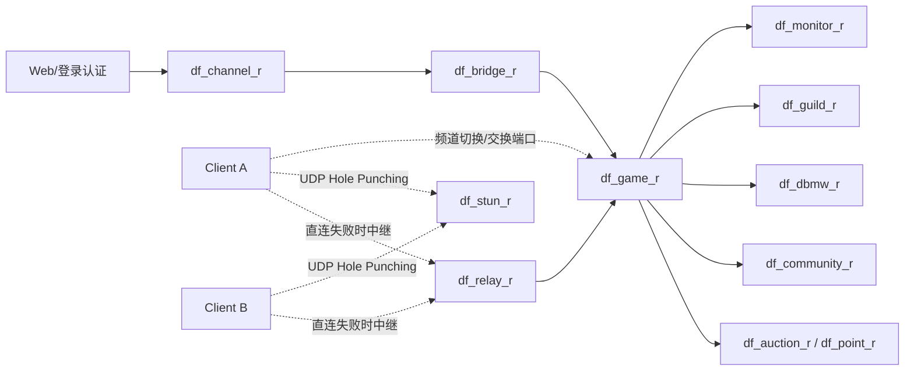
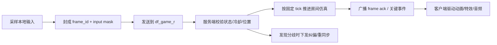
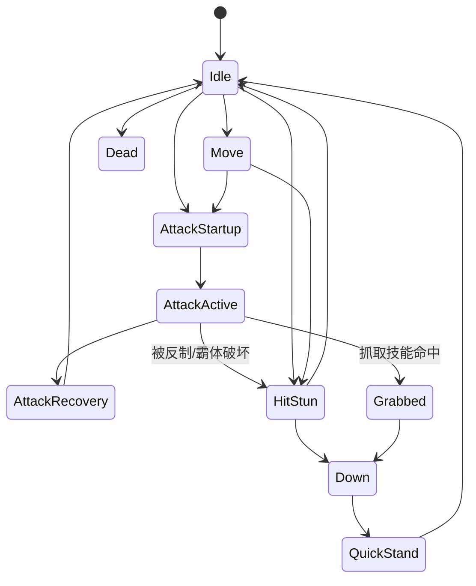

# DNF战斗系统复刻实施研究报告
> **Status: [HISTORICAL] — 已被 v2 覆盖，仅保留服务拓扑/配置模型/包头骨架历史参考**

> ⚠️ **HISTORICAL** — 已被 `combat-replication-implementation-v2.md` 覆盖。仅保留服务拓扑、配置模型、包头骨架、音频优先级的历史参考。实现引用请使用 v2。

## 执行摘要

这份报告的核心结论是：基于公开可访问的官方文档、官方更新说明、台服运维手册镜像、公开逆向/PVF 工具文档、学术/工程资料与高质量社区验证帖，已经可以把 DNF 的战斗系统还原到“足以直接分工开发”的程度，尤其是**运行时进程拓扑、频道/房间网络结构、包头布局、内容数据容器、技能脚本到动作/判定文件的引用链、现代版本伤害桶模型、反作弊接入点与配置治理流程**这些部分，证据已经相当扎实。真正仍然缺少直接公开原始证据的，主要是**线上实际 opcode 表、完整 payload 编码细节、原版混音器的实时优先级常量表、地图遮挡/透明度运行时的精确常量**。这几项我在文中均按“已证实 / 高可信重构 / 建议性实现”三档分开处理，避免把推断伪装成事实。 citeturn34search0turn15search0turn16search2turn21search1turn24search0

从公开证据看，原版并不是单体“战斗服务器”，而是由 `df_game_r`、`df_monitor_r`、`df_channel_r`、`df_bridge_r`、`df_relay_r`、`df_stun_r`、`df_dbmw_r`、`df_guild_r`、`df_community_r` 等多个进程共同组成；其中 `df_game_r` 负责地下城与房间内游戏处理，`df_channel_r`/`df_bridge_r` 负责频道与桥接，`df_relay_r`/`df_stun_r` 明确对应 P2P 穿透与中继，`df_monitor_r` 负责重复登录、好友/聊天、活动下发及外挂信息收集。与此同时，战斗内容主要在 `Script.pvf` 中表达，技能 `.skl`、动作 `.act`、伤害判定 `.atk`、字符串表 `stringtable.bin`、映射表 `n_string.lst` 与多语种 `.str` 文件形成了一条完整的“内容编排链”；表现资源则分散在 `ImagePacks2` 和 `SoundPacks` 一类包中。 citeturn15search0turn16search2turn17search1turn21search1turn21search2turn28search5

对开发团队而言，最务实的路线不是去“猜一个像 DNF 的系统”，而是按本文给出的方式拆成五条并行工作流：**网络与房间仿真、战斗核心与状态机、技能/判定/伤害内容层、资源与表现层、配置治理与安全层**。如果按这个拆法推进，你们可以先做一个“离线可回放战斗沙盒”，再接“30Hz 权威模拟 + 输入同步”，最后接资源热更、反作弊和内容验证流水线。官方开发者文档把角色、技能、装备、Buff 增强拆成独立 API，这也侧面证明原版数据模型是**基础技能树 / 装备增益 / Buff 适配 / 表现资源**分层而不是一张巨型表。 citeturn36search0turn37search1turn36search1

## 研究方法与来源优先级

本次检索覆盖了中文、英文、韩文三组关键词。高价值证据主要集中在三类：一是由 entity["company","Neople","korean game developer"] / entity["company","Nexon","japan game publisher"] 对外公开的开发者 API、更新说明与职业/系统改动公告；二是台服运维手册的公开镜像与多处转载片段；三是长期逆向与 PVF 工具文档。韩文检索本身是做过的，但从公开网页可直接抓到的技术细节密度，明显不如中文运维镜像与英文开发者站；韩文结果更多用于术语交叉校对，而不是作为最高优先级事实来源。 citeturn36search0turn36search1turn34search0turn10search0turn42search7

下表是本报告实际采用的证据优先级。它也应该成为你们之后继续补证时的取证顺序。

| 优先级 | 来源类别 | 典型用途 | 在本报告中的地位 |
|---|---|---|---|
| S | 官方开发者文档、官方更新说明 | `jobId/skillId/itemId` 主键体系、技能/装备 API 分层、版本变更、系统上限 | 最高，直接决定数据模型命名 |
| A | 台服运维手册镜像与配置片段 | 进程拓扑、端口、频道/Relay/STUN、包头字段、TP 接入、运维约束 | 极高，直接决定服务架构 |
| B | 公共逆向/PVF 工具文档 | `PVF` 结构、`stringtable.bin`、`.str`、`.atk/.act/.skl` 引用链 | 高，直接决定内容管线 |
| B | 工程权威资料与学术论文 | 锁步、输入同步、碰撞检测、音频语音池 | 高，用于补足未公开实现细节 |
| C | 高质量社区验证帖 | 伤害公式、字段对照、版本差异经验 | 中，用于校正和补洞 |
| D | 泛资讯/门户/百科 | 名称校对、背景辅助 | 低，只作边缘补充 |

这个分级并不是形式主义。比如职业 API 把**技能树**与**Buff 装备/Avatar/Creature**拆成不同接口，这是官方事实；而“某技能的 `.skl` 里引用某个 `.act` 和 `.atk`”则来自 PVF 工具与社区拆包文档；至于“当网络抖动时应采用多帧冗余输入而不是 TCP 重传等待”，则来自锁步网络的工程权威资料。三者的可信等级不同，实现时必须分层使用。 citeturn36search0turn21search1turn21search2turn31search1

如果你们需要“在线截图链接”而不是二手总结，最值得优先点击的是手册镜像中包含图片的章节：**第九章网络架构图、第十章配置图、第十一章进程管理截图、TP 版本核验截图**；这些检索页本身就保留了图片锚点和图名。 citeturn41search0turn41search1turn33search0

## 从公开证据还原出的原版架构

### 服务拓扑与战斗相关进程

公开运维手册给出的证据非常直接：`df_game_r` 负责“地下城等级和地下城内游戏进行处理”；`df_channel_r` 把分流信息发往客户端；`df_relay_r` 在 Client 间无法直连时作为中继；`df_stun_r` 负责 UDP hole punching；`df_monitor_r` 负责重复登录、聊天、公会成员、活动下发、外挂玩家信息与掉落率收集；`df_community_r` 与决斗场相关；同时还有 `df_bridge_r`、`df_dbmw_r`、`df_guild_r`、`df_auction_r`、`df_point_r` 等围绕业务与数据持久化的服务。手册还给出了“每物理机 10 个 `df_game_r`、15 个 `df_relay_r`、1 个 `df_channel_r`、3 个 `df_stun_r`”这类部署密度证据。 citeturn15search0turn15search1turn16search2turn34search0



这个图把手册里可证实的进程关系和“战斗房间应如何组织网络责任”的高可信重构放在一起：**`df_game_r` 是权威战斗裁决点，Relay/STUN 只负责连接和中继，不负责最终命中/伤害裁判**。这一点对 1:1 复刻非常关键，因为一旦把伤害权威交给客户端，你们后面的防作弊和非法状态检测就会全部崩塌。 citeturn15search0turn16search2turn34search0turn33search0

### 配置模型与关键字段

从 `cain01.cfg`、`relay_200.cfg`、`channel.cfg` 这些公开片段，可以直接抽出第一版服务端配置模型。下面这张表建议你们原样照着落库或落 YAML/JSON Schema。

| 结构 | 关键字段 | 类型 | 示例值 | 说明 |
|---|---|---:|---|---|
| `GameServerCfg` | `gc_no` | int | `1010` | 游戏服务器分流编号 |
|  | `channel_no` | int | `10` | 频道号 |
|  | `channel_name` | string | `ch.10` | 游戏内显示名 |
|  | `ip` | string | `203.69.93.2` | Game TCP/UDP 绑定 IP |
|  | `tcp_port` | int | `10012` | Game TCP 端口 |
|  | `udp_port` | int | `11012` | Game UDP 端口 |
|  | `exchange_server_port` | int | `20012` | 切线/交换端口 |
|  | `relay_ip`/`relay_tcp_port`/`relay_udp_port` | string/int | `203.69.93.81/7200/7200` | Relay 连接信息 |
|  | `stun_ip[]` / `stun_port[]` | list | `203.69.93.71~73 / 2311~2313` | STUN 集合，至少两个端口 |
|  | `master_db_*` | string/int | `172.1.2.141:3306` | 主 DB 连接 |
|  | `fatigue_time` | int | `06` | 疲劳重置时间 |
|  | `max_user_num` | int | `600` | 单频道示例人数上限 |
|  | `script_dir` | string | `./Script/` | 脚本根目录 |
|  | `scriptpacks` | bool | `yes` | 启用脚本包 |
| `RelayCfg` | `max_client` | int | `1000` | Relay 最大客户端数 |
|  | `this_tcp_port`/`this_udp_port` | int | `7200/7200` | Relay 监听端口 |
|  | `relay_index` | int | `200` | Relay 逻辑编号 |
| `ChannelCfg` | `max_client` | int | `1000` | Channel 最大客户端数 |
|  | `bridge_ip`/`bridge_port` | string/int | `172.1.2.51/7000` | Channel 到 Bridge 的连接信息 |
|  | `id` | int | `1` | 频道服务 ID |

表中字段和示例值取自公开 `cain01.cfg`、`relay_200.cfg`、`channel.cfg` 片段，以及对应的手册译注。值得注意的是，`fatigue_time`、`max_user_num` 这类运营常量和 `relay_index`、`channel_no` 这类协议/路由常量是两种不同层级，千万不要混在一张“万能配置表”里。 citeturn34search0turn16search2turn17search2turn39search1

### 包头布局与协议骨架

现有公开证据里，最有价值的不是 opcode 本身，而是**包头布局**。`cain01.cfg` 明确给出：`header_classification = 0 1`、`header_sLength = 1 4`、`header_msg_no = 5 1`、`header_checksum = 7 4`、`header_sequence = 11 2`、`header_mangled_length = 13`，旁边还注释了一个被注释掉的 `header_garvage = 6 1`。这意味着至少可以高可信地还原出一个 **13 字节头**：`分类 1B + 长度 4B + 消息号 1B + 保留/garbage 1B + 校验 4B + 序号 2B`。同一份配置还出现了 `/usr/lib/libnxencryption.so`、`publickey.pem`、`lls_keys`、`header_mangled_length` 等字段，因此可以合理判断原版在登录或业务数据层至少存在一层混淆/加密或签名校验。算法本体没有公开，但“需要有加密/签名层”这一事实是可以确认的。 citeturn34search0turn39search1

下面给出一个**高可信结构、低可信 opcode** 的包头示意。注意：`msg_no=0x31` 只是示例，不是已证实原包号。

```text
Offset  Size  Field
0x00    1     classification
0x01    4     total_length
0x05    1     msg_no
0x06    1     reserved_or_garbage
0x07    4     checksum
0x0B    2     sequence
==> header_size = 13 bytes
```

```text
01 1F 00 00 00 31 00 D5 8C 1A 44 10 00
```

解释：

- `classification = 0x01`
- `length = 0x0000001F = 31`
- `msg_no = 0x31`
- `reserved = 0x00`
- `checksum = 0x441A8CD5`（端序需以抓包验证）
- `sequence = 0x0010`

如果你们要先实现一个可工作的复刻版，我建议把协议分成两层：**外层复刻原版 13B 头布局**，内层 payload 先用可读性高的结构化编码（JSON/FlatBuffers/Protobuf 任一）搭建，再在抓包/回放校验阶段替换成更贴近原版的二进制体。这样能显著降低前期开发成本。这个建议与锁步网络“尽量只传输入而不是全状态”的思路是一致的。 citeturn34search0turn31search1

一个建议性的房间输入消息体可以先这么定义：

```json
{
  "frame": 9124,
  "seq": 16,
  "roomId": 300187,
  "actorId": 10001,
  "kind": "skill_cast",
  "skillId": 260,
  "dir": 1,
  "targetX": 1840,
  "targetY": 128,
  "heldMs": 0,
  "localStateHash": "9b3f1a6c"
}
```

### 帧同步、锁步与带宽预算

公开手册在监控/管理配置里给出过 `Define_Tick_Count_Value 30`，并反复出现固定的 UDP/TCP 端口映射；再结合 `Relay` 和 `STUN` 的存在，更合理的复刻方向是：**房间级 30Hz 权威模拟 + 输入驱动同步 + 频道/大厅层不同步**。这是一个“更像原版”的方案，也和确定性锁步的经典实践一致：锁步发输入，状态在各端或服务器按同一规则推进；网络差时用冗余输入或短缓冲，而不是依赖 TCP 丢包后重传等待。GGPO 文档则说明了另一条思路——回滚——但从 DNF 已公开的服务拓扑看，更像是**服务器权威 + 客户端表现层预测**，而不是纯 P2P 回滚。 citeturn34search0turn16search2turn31search1turn31search0turn30search6



在预算上，假设权威模拟 30Hz、1 个输入包含 13B 头 + 8B~16B payload、再加上 UDP/IP 28B 开销，那么**单客户端上行命令流量**大约是 `(13 + 12 + 28) * 30 ≈ 1.59 KB/s`；如果服务端每帧向该客户端下发 2 个关键事件与 ACK，单客户端下行按 `~2.5–4.5 KB/s` 估算比较稳妥。按 4 人小队活跃战斗的峰值算，**每个房间的纯战斗命令预算可以先按 20–40 KB/s 预留**。这与运维手册“每 10 万在线需 300 Mbps 内网带宽”的平均值并不矛盾，因为 300 Mbps/100000 约等于 3 kbps/人，是全服平均；而我这里给的是“正在激烈战斗的活跃房间峰值”预算。 citeturn34search0turn31search1

这一层最常见的漏洞与防护手段如下：**长度欺骗、序列回放、伪造频道切换、跨状态 opcode 注入、TCP/UDP 双栈不同步、ACK 风暴**。防护建议是：严格检查 `classification/length/sequence/checksum`、在服务器状态机上做 `msg_no` 白名单、对切线与 Relay/STUN 建立一次性 token、对战斗帧设置窗口期与去重表，并在每 N 帧附带一个 `state_hash` 做轻量一致性比对。测试用例则至少包括：长度缩短/超长、序号倒退、错校验、跨状态发包、重复 10 次同帧输入、STUN 失败走 Relay 回退、切线后原连接继续发旧包。 citeturn34search0turn16search2turn31search1

## 战斗运行时核心模型

### 实体状态机

从官方更新说明和技能改版文案可以确认，DNF 的技能行为并不是“按键即生效”的扁平系统，而是存在明显的**阶段性状态**：前摇、命中有效期、后摇、可取消关系、抓取/Hold、倒地、受身、超级护甲、品牌/标记等。比如公开更新里直接写到某些技能“可在命中后相互取消”、某些技能“瞬间 Hold 敌人”、还有 PvP 改动里明确写了“z-axis attack range decreased”“super armor break effect”。这些都说明复刻时必须用**状态机 + 帧事件轨**，而不是简单的时间轴回调。 citeturn37search5turn37search3turn37search6

建议的权威实体状态机如下表。这里的字段命名是为了工程实现而统一，不是声称原版源码就叫这些名字。

| 状态 | 功能说明 | 核心字段 | 示例值 |
|---|---|---|---|
| `Idle` | 可接收移动/普攻/技能输入 | `moveLock=false` | — |
| `Move` | 地面行走/跑动 | `vx, vy, dir` | `160,0,1` |
| `AttackStartup` | 技能前摇，通常不可命中 | `startupFrames` | `6` |
| `AttackActive` | 进入有效帧，生成 hitbox / passiveobject | `activeFrames` | `4` |
| `AttackRecovery` | 后摇，可被部分技能/闪避/受击打断 | `recoveryFrames` | `10` |
| `HitStun` | 受击硬直 | `stunFrames` | `12` |
| `Down` | 倒地 | `downFrames` | `24` |
| `QuickStand` | 受身/快速起身 | `invulFrames` | `8` |
| `Grabbed` | 被抓取/Hold | `grabOwnerId` | `10023` |
| `Airborne` | 浮空/击飞 | `airTime` | `18` |
| `Dead` | 死亡/待清场 | `despawnDelay` | `120` |



这个状态图对应的权威更新规则应该是：**输入先改“意图”，再由状态机决定能否转移；伤害、击退、抓取、倒地都不是直接改数值，而是先写入 `PendingHit`，在状态推进阶段统一结算**。这样做才能正确处理超级护甲、霸体破坏、受身、倒地保护与多段命中去重。 citeturn37search3turn37search5turn37search6

一个简洁的伪代码骨架如下：

```text
updateRoom(frame):
  collectInputs()
  for actor in actors:
    stateMachineStep(actor, frame)

  buildActiveAttackSet()
  resolveHitDetection()
  applyDamageAndReactions()
  spawnPassiveObjectsAndAppendages()
  publishAuthoritativeEvents()
```

### 技能、判定、碰撞与被动对象

公开的 PVF 资料把 DNF 技能内容层的引用关系揭示得非常清楚：技能脚本会通过 `[basic action]` 指向一个 `Action/*.act` 文件，通过 `[attack info]` 指向一个 `AttackInfo/*.atk` 文件；而某些效果、召唤物、地面火焰、宠物技等，则通过 `[CREATE PASSIVEOBJECT]` 或 `[passive object]` 生成“被动对象”，再由该对象自己的 `basic action` 与 `attack info` 驱动表现和伤害。宠物技能示例里甚至直接给出了 `absolute damage`、`damage`、`attack type`、`elemental property`、`damage reaction`、`hit wav`、`duration`、`piercing power`、`piercing tolerance` 等标签。 citeturn24search0turn23search6turn24search1

据此，内容数据结构至少应该拆成下面四层：

| 结构 | 功能说明 | 关键字段 | 示例值 |
|---|---|---|---|
| `SkillDef` | 角色技能入口定义 | `skillId`, `startup`, `cancelMask`, `actionRef`, `attackRef`, `cooldownMs` | `260, 6, 0x14, "Action/blitz.act", "AttackInfo/blitz.atk", 12000` |
| `AttackInfo` | 单次或多段伤害判定 | `damage`, `absoluteDamage`, `attackType`, `element`, `damageReaction`, `hitWav`, `durationMs`, `piercingPower`, `piercingTolerance` | `100000, 300000, "magic", "fire", "down", "OVERFREEZE_EXTENSION_HIT", 1000, 1000, 1` |
| `PassiveObjectDef` | 地火、召唤物、抓取盒、投射物 | `index`, `lifeMs`, `followTarget`, `pos`, `actionRef`, `attackRef` | `200466, 1500, true, [0,-1,0], "...fireGround.act", "...fireGround.atk"` |
| `AppendageDef` | Buff/Debuff/条件状态封装 | `type`, `target`, `durationMs`, `conditionExpr`, `statusDelta[]` | `"change status", "enemy", 2000, "attack_success && light", [...]` |

表中的标签名来自公开的 `.atk`、被动对象与 `appendage` 资料；而 `cancelMask`、`conditionExpr` 这类字段是为了实现方便做的统一化封装。原版的脚本语法看起来更接近标签式 DSL，而不是 JSON。 citeturn24search0turn24search1turn29search1

在碰撞算法上，公开资料虽然没有给出“原始源码”，但给了两个很重要的信号：第一，PvP 改动会直接调整技能的 **z-axis attack range**，说明原版攻击判定至少不是纯 2D 单平面，而是带有明显“纵深带宽”的；第二，`.atk` 里有 `piercing power` / `piercing tolerance`、`damage reaction` 等标签，说明命中后果也是内容层可配置，而不是写死在技能逻辑里。结合 2D 游戏常用的 AABB/窄相位做法，一个高可信的复制方案是：**宽相位按房间 + x/y 栅格或 sweep-and-prune，窄相位用 AABB + lane/z-band 判断；抓取、拖拽、圆形爆炸则额外支持 circle/segment hitbox；每个 attack event 持有一次性命中位图防止多次命中。** citeturn37search3turn24search0turn30search10turn30search11

可直接落地的伪代码如下：

```text
resolveHitDetection():
  for atk in activeAttacks:
    candidates = broadPhaseQuery(atk.sweptAABB, atk.roomId)
    for target in candidates:
      if target.team == atk.team: continue
      if target.state in IMMUNE_SET: continue
      if hitRegistry.contains(atk.eventId, target.id): continue
      if !laneOverlap(atk.zBand, target.hurtZBand): continue
      if !shapeOverlap(atk.shape, target.hurtShape): continue

      dmg = calcDamage(atk, attacker, target)
      reaction = resolveReaction(atk.damageReaction, target)
      enqueuePendingHit(target, dmg, reaction, atk.eventId)
      hitRegistry.add(atk.eventId, target.id)
```

这套实现的性能预算并不高。假设一个高压房间里有 32 个可受击实体、同时存在 24 个活动 hitbox，宽相位把每个攻击的候选目标压到 6~8 个，那么窄相位检查量大约是 `24 * 8 = 192` 次/帧；即便按 30Hz 权威模拟，也不过每秒 5760 次窄相位。真正更费 CPU 的反而是**路径修正、状态机转移、Buff 传播与 FX 生成**，不是 AABB 本身。 citeturn30search10turn30search11

这一层的典型漏洞包括：**同一事件重复命中、前摇未结束强行命中、跨 lane/z 伪命中、霸体/抓取状态绕过、被动对象刷屏、穿透力被客户端篡改**。防护建议是：每个伤害事件挂 `eventId`、由服务器根据 `startup/active/recovery` 生成可命中窗口、所有 `piercing` 与 `reaction` 只读自权威内容表、目标状态过滤放在服务端执行。测试上至少做：同帧 A/B 双角色互击、抓取对霸体、地面火焰多段命中去重、同目标穿透次数上限、跨 y/z 边界擦边命中回归。 citeturn24search0turn37search3

### 伤害公式与数值桶

关于伤害，本次能拿到的最系统公开证据来自高质量社区公式帖。现代版本的归纳表达是：
**最终伤害 = (技能数据 + 特效数据×10) × 总三攻 × (1 + 总力智×0.4%) × (1.05 + 总属强×0.45%) × [1 + 总攻强×(1 + 总攻强增幅)] × 各技能攻击力乘区连乘**。同时，多篇公式帖反复强调：**除了少数专门规则外，装备间大多数“技能攻击力”是乘算而不是简单相加**。官方更新说明则给出两个重要上限：**冷却减少/恢复最高 70%，技能范围加成最高 70%**。这说明一个可长期维护的复刻版必须把数值实现成**分桶乘算系统**，而不是把所有词条拍平。 citeturn7search0turn7search2turn37search2

对工程实现，最推荐的不是把某一时代的公式硬编码，而是先定义“数值桶接口”，再在版本层挂不同公式：

| 数值桶 | 含义 | 典型来源 |
|---|---|---|
| `SkillDataBucket` | 技能基础数据、技能等级、VP/护石/符文、职业被动修正 | 技能表、技能变体系统 |
| `AttackBasisBucket` | 物理/魔法/独立攻击等基础攻击 | 角色面板、装备 |
| `MainStatBucket` | 力量/智力等主属性修正 | 面板、Buff |
| `ElementBucket` | 火/冰/光/暗与全属强/抗性 | 面板、附魔、状态 |
| `AttackEnhanceBucket` | 攻强与攻强增幅 | 装备/系统词条 |
| `SkillAtkBuckets[]` | 多个乘区的技能攻击力 | 装备、被动、系统 |
| `SpecialProcBucket` | 额外伤害、绝对伤害、特效伤害 | `.atk`、装备脚本 |
| `ControlBucket` | 控制增伤、破招、背击、暴击等条件乘区 | 状态机与命中上下文 |

这样做的好处是：你们可以同时支持 `legacy60`、`origin95`、`modern115` 三套公式，而**命中链路、状态机、碰撞、资源层都不用重写**。官方 API 将技能树、Buff 装备、Avatar、Creature 分开暴露，也和这种“增益来源分桶”的实现非常一致。 citeturn36search0turn7search0turn37search1

一个建议性的接口可以写成：

```text
DamageResult calcDamage(ctx):
  skillData   = evalSkillData(ctx.skill, ctx.skillLevel, ctx.variant)
  basis       = evalAttackBasis(ctx.actorStats, ctx.attackType)
  mainStat    = evalMainStat(ctx.actorStats)
  element     = evalElement(ctx.actorStats, ctx.targetStats)
  atkEnhance  = evalAttackEnhance(ctx.actorStats)
  skillAtkMul = product(evalSkillAtkBuckets(ctx))
  special     = evalSpecialProc(ctx)
  control     = evalConditionalBuckets(ctx)

  raw = skillData * basis * mainStat * element * atkEnhance * skillAtkMul * control + special
  return clampAndRound(raw, ctx.versionRules)
```

校验方法建议做三层：**单桶单元测试、整式黄金样本测试、对战回放验算**。单桶测试负责验证 70% CDR/Range 上限这类规则；黄金样本测试用 20~50 组角色面板 + 技能等级快照比对预期输出；对战回放验算则核对“相同输入 + 相同快照 + 相同版本规则 => 相同伤害日志”。漏洞方面，重点防 `浮点漂移`、`条件乘区重复生效`、`客户端面板注入`、`特效伤害被当作技能数据再次乘算`。最稳妥的手段是：**服务端统一使用定点数或严格限定浮点路径，并把每次伤害的桶分解写入日志。** citeturn31search5turn7search0turn37search2

## 资源、动画、特效与音频

### PVF、NPK 与战斗内容引用链

公开资料已经足够支撑一个完整的战斗资源管线。`Script.pvf` 中至少包括：脚本文件主体、`stringtable.bin`、`n_string.lst`、多语种 `.str`、旧版本 `70ANI` 格式的 `.ani` 文件；而逆向说明明确给出常见块类型：`0x02 Int32`、`0x04 Float`、`0x05 Label`、`0x07 File Link`、`0x09/0x0A` 作为字符串查找对。另一份工具文档则说明：脚本中的 6/7/8/10 类型实际上是对 `stringtable.bin` 的引用；`n_string.lst` 控制某个索引映射到哪一个 `.str` 文件；`70ANI` 是旧版动画编码。 citeturn21search2turn21search1turn21search3turn25search4

与此同时，社区对照表已经证明技能脚本路径是稳定可枚举的。比如基础技能里就能直接看到 `backstep.skl`、`quickstanding.skl`、`conversion.skl` 等；宠物技能示例又给出了从 `passiveobject/.../attackinfo/*.atk` 到 `Action/*.act` 的链路。这意味着你们完全可以做一个“先解出统一 AST，再转运行时表”的构建器。 citeturn23search4turn24search0turn23search6

建议的数据模型如下：

| 结构 | 功能说明 | 关键字段 | 示例值 |
|---|---|---|---|
| `PvfFileEntry` | PVF 内文件索引 | `path`, `offset`, `size`, `crc`, `locale` | `skill/common/backstep.skl` |
| `StringTableEntry` | 全局字符串池 | `index`, `value` | `587 -> "Straight3.ptl"` |
| `NStringMap` | 局部 `.str` 映射 | `groupIndex`, `strFile`, `key`, `text` | `1, skillname_kor.str, name_1, 名称` |
| `SkillAssetRefs` | 技能到表现资源的引用 | `sklPath`, `actPath`, `atkPath`, `ptlRefs[]`, `wavRefs[]` | `backstep.skl -> ...` |
| `NpkManifestEntry` | Image/Sound 包清单 | `packageName`, `category`, `hotRoom`, `preloadPriority` | `sprite_character_launcher_effect.npk` |

功能上，最关键的是把“逻辑”和“表现”彻底拆开：**`.skl/.atk/appendage/passiveobject` 归逻辑内容层，`.act/.ani/.ptl/.wav` 归表现层**。逻辑层驱动表现，但绝不反过来。复刻时最容易犯的错，是让动画帧事件直接改 HP 或生成伤害，那样网络同步会很痛苦。 citeturn24search0turn21search1turn23search6

### 动画、特效驱动参数与房间加载

从已公开脚本看，动作与特效的核心驱动参数至少包括：**动作文件路径、攻击信息路径、持续时间、是否跟随目标、对象生成位置、命中音效、穿透强度、伤害反应**。宠物技示例已经给出 `[BEHAVIOR] -> [CREATE PASSIVEOBJECT] -> [INDEX]/[POS]/[FOLLOWING TARGET]`，并给出后续的 `[basic action]` 与 `[attack info]` 双引用；这基本可以等价还原为“在某帧生成一个被动对象，附带行为、判定和表现资源”。 citeturn24search0turn23search6

复刻实现时，建议统一成下面这套驱动参数：

| 参数 | 含义 | 示例 |
|---|---|---|
| `spawnFrame` | 生成对象或开 hitbox 的帧号 | `6` |
| `lifeFrames` | 生存帧数 | `30` |
| `followMode` | 是否跟随施法者/目标 | `Target` |
| `spawnOffset` | 相对生成偏移 | `[0,-1,0]` |
| `actRef` | 动作文件 | `Action/overskill_third_attack_fireGround.act` |
| `atkRef` | 判定文件 | `AttackInfo/overskill_third_attack_fireGround.atk` |
| `ptlRef[]` | 粒子特效路径 | `Straight3.ptl` |
| `hitWav` | 命中音效 ID/路径 | `OVERFREEZE_EXTENSION_HIT` |
| `piercingPower` | 穿透强度 | `1000` |
| `piercingTolerance` | 可命中容差/次数 | `1` |

推荐的房间加载策略是：**预读“本房间敌人 + 队伍职业 + 常驻 Buff + 邻接房间首批怪物”的逻辑表和表现资源清单**，但把大贴图/长音频延迟到首次真正触发时按包内索引拉取。由于 `ImagePacks2` 和 `SoundPacks` 明确按“角色、技能、界面、活动、系统”分包，所以构建一个包级 manifest 并做优先级预热，是最接近原版资源布局的方案。 citeturn28search5turn28search3turn28search4

关于**层级 / 遮挡 / 透明度**，公开资料能确认包的分类，但没有直接暴露“运行时排序公式”。因此这一部分我给的是**高可信重构**：
**排序键 = `(roomLayer, groundY, yBias, objectClassPriority, alphaMode, createSeq)`**。
其中：

- `roomLayer`：背景、地面、前景遮挡层；
- `groundY`：横版卷轴常见的“越靠下越在前”；
- `objectClassPriority`：角色 > 可受击怪 > 被动对象 > 装饰；
- `alphaMode`：`Opaque / Cutout / Additive / AutoFadeBehindForeground`；
- `AutoFadeBehindForeground`：角色走到前景遮挡体后自动降透明度，例如 `1.0 -> 0.35`。

这不是声称“原版一定如此”，而是说：如果你们不做这一套，视觉体验会立刻偏离 DNF。最好的验证法不是辩论，而是做**逐房间逐技能的录像 A/B 对比**。公开 NPK 对照表与资源分包能保证你们知道“哪些资源属于同一表现域”，录像比对则决定排序规则要不要再微调。 citeturn28search3turn28search4turn28search5

### 音频优先级规则

公开 DNF 资料对 `SoundPacks` 的“资源归类”揭示得不少，但对**运行时混音器**的“抢占规则”揭示得很少，所以这里必须实话实说：**没有拿到足够公开证据证明原版混音器的精确优先级常量表**。不过要实现“听感像 DNF”，并不需要先知道源代码常量。可操作的办法是：保留 DNF 的**子系统分包思想**，再采用现代游戏音频广泛使用的**动态 Voice Pool + 优先级 + 组并发限制**。主流引擎和音频中间件都支持“低优先级先虚拟化/被偷声”，并支持按组限定同时实例数。 citeturn28search5turn44search1turn44search13

一个适合 DNF 风格动作游戏的初始表如下。这里的 `priority` 约定沿用常见 0 最高、255 最低的写法。

| 组 | 功能说明 | 并发上限 | 优先级 | 抢占策略 |
|---|---|---:|---:|---|
| `ui_critical` | 倒计时、失败、确认、频道切换警告 | 4 | 8 | 不被普通音效抢占 |
| `boss_telegraph` | Boss 抬手、危险提示、抓取预警 | 8 | 24 | 仅被 UI/语音抢占 |
| `voice_dialogue` | NPC/Boss 台词 | 4 | 40 | `first-in protect` |
| `local_hit_confirm` | 本地命中、重击、破招确认 | 12 | 64 | `last-in` |
| `skill_loop` | 持续技能循环音 | 8 | 96 | 同组限流 |
| `ambient_room` | 场景环境、房间底噪 | 6 | 160 | 最先被虚拟化 |
| `foley_minor` | 脚步、轻微落地、布料 | 8 | 192 | 最低优先级 |

如果做 PC 复刻，我会建议首版混音器预留 **64 voices**，低配模式降到 **32 voices**；Boss 房、多人连段、召唤物密集房间，最容易爆的不是 UI 和语音，而是 `local_hit_confirm + skill_loop + foley_minor`。所以你们的偷声策略一定要让“最新的高价值打击声”保留，而不是机械地按最早播放时间保留。测试用例需要覆盖：**20 个小怪同房、4 人同时开觉醒、Boss 语音 + 地图环境 + 多段 DoT + UI 倒计时**。通过标准不是“绝不丢声”，而是“重要反馈永远先于装饰音”。 citeturn44search1turn44search2turn44search13

## 数据版本治理、配置校验与反作弊

### 战斗数据版本管理

从官方更新说明和工具文档看，DNF 的战斗数据不是静态不变的：官方会持续变更技能结构、删除 Rune/Talisman 相关系统、变更装备 tooltip 结构、增加 API 字段；而 PVF 工具文档又专门提醒，比较两个包时因为 `stringtable.bin` 排序差异，差异文件数可能显著多于真实逻辑差异。这两件事合起来，直接说明一个事实：**如果没有显式版本治理，战斗内容迟早失控。** citeturn37search1turn36search1turn21search4

建议使用一个明确的 `CombatContentManifest`：

| 字段 | 类型 | 示例值 | 用途 |
|---|---|---|---|
| `buildId` | string | `2026.04.30.01` | 构建号 |
| `schemaVersion` | semver | `3.2.0` | 表结构版本 |
| `formulaVersion` | enum | `modern115` | 伤害公式版本 |
| `pvfHash` | sha256 | `...` | 逻辑内容包指纹 |
| `stringTableHash` | sha256 | `...` | 字符串表指纹 |
| `npkManifestHash` | sha256 | `...` | 表现资源清单指纹 |
| `packetSchemaVersion` | int | `13` | 协议版本 |
| `compatMinClient` | string | `1.8.0` | 最低兼容客户端 |
| `compatMaxClient` | string | `1.8.x` | 最高兼容客户端 |
| `replayHashSeed` | uint32 | `0x4E23A1C7` | 回放校验种子 |
| `sign` | bytes | `ed25519(...)` | 包签名 |

这张表不是为了“好看”，而是为了支持三件实际工作：**战斗回放可复现、热更可回滚、线上问题可定位**。尤其是 `formulaVersion`，千万不要偷懒省掉。否则将来你们一改版本，老回放、旧日志、伤害复盘工具会全部作废。 citeturn37search1turn36search1turn21search4

### 配置表校验流程

台服运维手册公开了一个非常有代表性的操作方式：频道配置变更需要先拿官方提供的频道列表 Excel，再运行 `chc` 工具批量生成 `cainXX.cfg`，同时写入 `lls_key` 等字段。这说明至少在运维侧，原版就存在一种**“上游表格 -> 生成 cfg”** 的流程；不应该手工顶着生产配置乱改。另一方面，PVF 工具文档也明确了字符串、编码、`n_string.lst`、`stringtable.bin` 与脚本引用的关系，因此内容侧同样适合做生成式校验。 citeturn41search1turn17search4turn21search1turn21search3

我建议你们的 CI/CD 校验流程固定成下面这条流水线：


可执行的校验项建议至少包括：

| 校验项 | 说明 | 失败后动作 |
|---|---|---|
| 标签 schema 校验 | `.skl/.atk/appendage` 必填标签、类型匹配 | 构建失败 |
| 字符串引用校验 | `stringtable.bin`、`n_string.lst`、`.str` 三者一致 | 构建失败 |
| 资源引用校验 | `act/atk/ptl/wav` 路径存在且大小合法 | 构建失败 |
| 语义差异比对 | 忽略 `stringtable` 排序噪音，只看逻辑差异 | 标红人工复核 |
| 黄金回放 | 20~100 条战斗回放逐帧 hash 一致 | 构建失败 |
| 性能门禁 | 房间首包耗时、命中处理耗时、内存峰值 | 阻断发布 |

这里尤其要强调“**语义差异比对**”。如果只做二进制 diff，你会被 `stringtable.bin` 的排序变化拖死；必须做一层“解包后 AST 归一化”再比对。公开工具文档已经明确点出了这个坑。 citeturn21search4turn21search1

### 反作弊与非法状态检测

这一部分是公开证据最强的一块之一。手册明确写出：游戏服需要加载安全程序，额外占用 **0.5 个 CPU 核 / 500MB 内存 / 4GB 磁盘**；同时给出 `libantisvrimport.so`、`secagent`、`zergsvr`、`gunnersvr`、`tss_svr.sh`、`clean_g3_mmap.sh`、共享内存 `/dev/shm`、日志与版本号核验方法，甚至详细写到“先停服、停 secagent、clean、更新 so 和二进制、核对版本号、再起游戏服”的操作顺序。手册也提到 `df_monitor_r` 会收集外挂玩家与物品掉落率等信息。换句话说：原版不是靠单点“检测外挂进程名”，而是**客户端保护 + 服务器状态审计 + 运维流程管控**三层一体。 citeturn33search0turn34search0

在你们自己的复刻实现里，我建议把“非法状态检测”写成一张服务器规则表，而不是散落在各处的 if 语句：

| 规则 ID | 检测对象 | 规则说明 | 服务端动作 |
|---|---|---|---|
| `NET_SEQ_MONO` | 包序列 | `sequence` 只能在窗口内前进，不可大幅回退/重放 | 丢包并计分 |
| `MOVE_SPEED_BOUND` | 位移 | `|Δpos| <= maxMove(state,dt)+margin` | 纠偏，累计可封 |
| `COOLDOWN_BOUND` | 技能冷却 | 任何类 CDR 不得突破版本上限或变负 | 强制改正并告警 |
| `CAST_WINDOW_VALID` | 施法 | 命中事件只能出现在 `startup..active` 窗口 | 丢弃命中 |
| `HIT_REGISTRY_ONCE` | 多段命中 | 非多段技能不得在间隔不足时重复命中同目标 | 丢弃多余事件 |
| `STATE_TRANSITION_VALID` | 状态机 | `Grabbed/Down/QuickStand` 等必须合法转移 | 纠偏并标记 |
| `CONTENT_HASH_MATCH` | 客户端内容 | manifest/hash 不在白名单 | 拒绝进房 |
| `ANTI_AGENT_HEALTH` | 安全代理 | `secagent/zergsvr/gunnersvr` 或同类代理失联 | 强制下线/只读模式 |

这里的 `COOLDOWN_BOUND` 还应该和官方“70% CDR/Range 上限”的版本规则关联。不要把规则写死在 anti-cheat 里，而应引用 `formulaVersion + rulesetVersion`。这样你们未来改版本，只要换表，不要改逻辑。 citeturn37search2turn33search0turn34search0

如果考虑到中国区常见安全接入模式，也可以参考 entity["company","Tencent","china tech company"] 对外公开的 PC/移动游戏反作弊能力模型：代码加固、反调试、反注入、反变速、多开限制、实时数据分析等都属于成熟能力项。但对 DNF 类横版 ACT 来说，**真正最有效的仍然是服务器非法状态检测**，因为变速、技能取消注入、无敌、坐标瞬移这些作弊最终都会体现在“状态机/时间轴/位移界”被破坏。只要服务器裁决足够硬，客户端保护哪怕偶尔漏过，也很难形成可持续利用。 citeturn32search6turn33search0

测试建议分为四层：**白盒单元测试、灰盒回放测试、黑盒协议模糊测试、对抗测试**。对抗测试至少包括：速度修改、技能前摇跳过、重复包回放、坐标写入、内容 hash 篡改、代理进程失联、共享内存清空、房间爆量被动对象。验收标准必须写成量化指标，例如“变速检测召回 > 99%，误封 < 0.1%”“非法命中事件零通过”“内容 hash 不一致的客户端零进房”。 citeturn33search0turn34search0

## 可直接分配给开发团队的实施清单

如果目标是“能指导团队逐项实现”，我建议不要按“程序、美术、策划”分，而要按可交付件分。下面这个拆法最适合直接开 Jira 或禅道。

| 工作流 | 首要交付件 | 依赖 | 通过标准 |
|---|---|---|---|
| 网络与房间 | `13B 头协议栈 + 30Hz 房间 Tick + 状态哈希` | 服务拓扑、配置模型 | 单房间回放 100% 可复现 |
| 战斗核心 | `Entity/StateMachine/HitResolver` | 网络 Tick | 20 条黄金战斗脚本逐帧一致 |
| 技能内容层 | `SKL/ATK/APD/PassiveObject 编译器` | PVF AST | 95% 以上技能可从内容驱动 |
| 表现层 | `ACT/PTL/WAV 调度器 + Layer/Alpha` | 技能事件总线 | A/B 录像对齐到可接受阈值 |
| 数值层 | `FormulaVersion + Bucket Evaluator` | 角色面板、Buff 来源 | 样例公式误差可控且可解释 |
| 配置治理 | `Manifest + Schema + Diff + Replay CI` | 内容编译器 | 每次变更有语义 diff 与回放结果 |
| 安全层 | `IllegalStateGuard + HashAttestation + AgentIntegration` | 网络与房间 | 协议 fuzz 与对抗测试通过 |

真正的先后顺序建议是：

首先，做**离线战斗沙盒**。不联网，只搞定状态机、hitbox、伤害桶、回放、资源驱动。
其次，做**权威房间服务器**，把离线战斗沙盒放进 30Hz Tick。
再次，做**内容编译器**，让技能从表和脚本长出来。
然后，补**表现层和音频并发**。
最后，再接**配置治理和反作弊**。

原因很简单：如果你们一开始就做大而全服务端，最后发现状态机和 hitbox 都不对，会返工到怀疑人生；而如果先有离线战斗沙盒，后面所有联网、治理和风控都能建立在“可回放的真相”之上。这个顺序也最符合锁步系统和内容驱动系统的工程规律。 citeturn31search1turn24search0turn36search0

最后，把“可用公开来源与优先级”列成一个真正可执行的资料清单，方便继续补证：

| 优先级 | 资料 | 你们该怎么用 |
|---|---|---|
| S | 官方 Developers API Docs、官方 Notice、官方系统/职业更新说明 citeturn36search0turn36search1turn37search1turn37search2turn37search3turn37search6 | 定主键、定版本、定能力边界、定官方上限 |
| A | 台服操作手册镜像与打印页目录/检索页 citeturn34search0turn41search0turn41search1turn41search2 | 定进程、端口、cfg 模型、TP 接入、运维流程 |
| B | PVF 工具文档、Southperry 拆包说明、攻击信息与 appendage 讨论帖 citeturn21search1turn21search2turn21search3turn24search0turn24search1turn29search1 | 定内容 DSL、字符串表、技能到动作/判定/被动对象链路 |
| B | ImagePacks2 / SoundPacks 对照表 citeturn28search3turn28search4turn28search5 | 定资源分包、预热粒度、表现域边界 |
| B | 锁步/回滚/碰撞/音频并发工程资料 citeturn31search1turn31search0turn30search10turn30search11turn44search1turn44search13 | 补完未公开实现细节；用于“重构方案”而非声称原版源码 |
| C | 公式验证帖与版本经验帖 citeturn7search0turn7search2 | 用于数值回归与版本差异注释，不作为第一性原始证据 |

如果只看一句话版结论：**你们现在已经可以开始做，并且最该先做的是“可回放、可 hash、内容驱动”的离线权威战斗沙盒；凡是公开证据已经确认的地方严格按证据落地，凡是证据不足的地方则按本文标注的“高可信重构”去实现，并立刻配套录像对比与回放校验。** citeturn34search0turn21search1turn31search1
