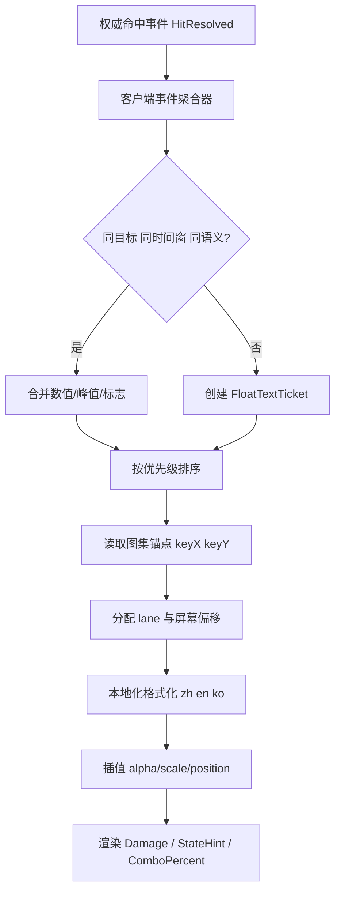
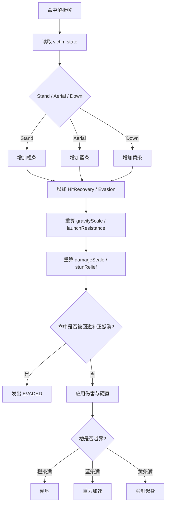
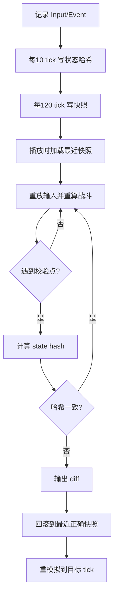

# DNF DFO战斗系统复刻实施研究报告
> **Status: [SUPPORTING] — Replay/network/debug 细节：战斗日志、回放验证、连招保护**

## 执行摘要

如果目标是“行为表现尽量贴近原作、同时能够直接指导现代开发实现”，最稳妥的路线不是把公开泄露或来源不明的台服代码当作可复用底座，而是采用**clean-room 行为复刻**：以韩服/中服官方机制说明去锁定“玩家能观察到的真行为”，再用公开可索引的 PVF/NPK 解析器去恢复**数据组织、资源格式、锚点/帧信息**，最后用现代固定步长、事件日志、预测/回滚与差异校验体系去重建网络和调试工具链。官方韩服 PvP Season 3 资料确认了**回放系统**、**Stand/Aerial/Down 状态提示**、**补正触发 UI**与**连招后伤害百分比**；官方韩服改版页确认了**站立、Hit Recovery、空中、倒地、回避率**五类补正；官方中服资料又补充了**伤害字体透明度**、**隐藏普通伤害但保留最高伤害**、**内建录像设置**与**录像保存路径**等实现细节。citeturn36view0turn33view0turn29search1turn29search2turn29search4turn29search6

从客户端格式角度看，公开解析器已经足够说明原始数据的组织模式：PVF 负责脚本/目录树，NPK/ImagePacks2 负责大量精灵与 UI 图形；PVF 头包含 GUID、版本、目录树长度与校验，公开工具还给出了台服/国服/韩服/日服编码常量，以及基于 `0x81A79011` 和 CRC 的解密过程；NPK 内 `.img` 以 `Neople Img File` 开头，帧元数据记录了**压缩标记、宽高、压缩长度、keyX/keyY、maxWidth/maxHeight**，这些字段恰好就是伤害数字、状态提示、命中特效做**锚点、基线、帧内偏移**时最需要的元数据。citeturn15view0turn14view2turn14view0turn14view1turn9view1turn9view2

需要特别指出的是，韩服社区关于”끌잡 / pull-grab (拉抓)”、”지연타격 / delayed hit (延迟打击)”、”中力重置 / gravity reset (重力重置)”的资料明确表明，旧版决斗场存在**P2P 回线时序副作用**，而且某些技巧在练习模式里不会出现。也就是说，如果你真的想做“现代可维护、可验证、可竞技”的复刻，应该**复刻补正与可见反馈**，但**不要复制这些网络时序 bug**；应当由服务端在命中解析帧上验证目标状态，拒绝“目标已经起身但客户端还认为倒地”的陈旧命中。citeturn23view0turn21view0turn32search1turn30search0

下面给出的方案因此遵循一个明确边界：**行为层尽量逼近原作，资源/脚本层采用合法 clean-room 解析，网络层与回放层采用现代工程化实现**。所有表格默认值都按“可直接导入开发”的目标编写；其中凡属官方未公开的绝对数值，我都明确标成**推荐默认值**，并把它们设计成可以通过录像比对和拟合回归继续收敛的参数化方案。citeturn33view0turn36view0turn35search2turn35search8

## 证据边界与资料基线

高信任证据来自韩服官网与中服公告，也就是 entity["organization","Neople","south korean studio"] / entity["company","Nexon","game publisher"] 的韩站更新页，以及 entity["company","Tencent","game publisher"] 的中服系统说明与活动规则。它们能确认哪些机制**官方确实存在**：回放、补正 UI、Stand/Aerial/Down 状态提示、补正类型、录像规则、字体/渲染变更风险、Replay 区版本重置等。中信任证据是公开的格式解析器与资源工具，它们能说明**原始文件结构**。低信任证据是公开索引到的台服相关仓库、网关和服务端项目；这些仓库可以帮助你识别生态里常见的数据边界与部署拆分，但因为来源和授权链条并不透明，不应作为直接实现依赖。citeturn33view0turn36view0turn27search2turn35search2turn9view1turn9view2turn25search0turn25search12turn25search14turn26search0

公开的台服/多区域 PVF 解析代码已经给出了足够明确的文件头与编码线索：`sizeGUID = 0x24`、`GUID[0x24]`、`fileVersion`、`dirTreeLength`、`dirTreeChecksum`、`numFilesInDirTree`，并列出了 `TW=950`、`CN=936`、`KR=949`、`JP=932` 等编码常量；台服实现里还把 PVF 脚本的编码设置为 `BIG5HKSCS`，这对你同时检索与导入中文、英文、韩文、台服资源尤其关键。目录树解密逻辑则是对 32 位字执行 `word ^ PASSWORD_PVF ^ crc32` 后再右旋 6 位。citeturn15view0turn14view2

NPK / `.img` 方面，公开工具确认 `.img` 以 `Neople Img File` 头开始，紧接着是若干固定字段：一个与“非 link 帧数量”和“link 帧数量”有关的长度字段、固定为 0 的字段、疑似版本号且观察上恒为 2 的字段，以及总帧数。每个非 link 帧有 `compressedField`、`width`、`height`、`compressedLength`、`keyX`、`keyY`、`maxWidth`、`maxHeight`；其中 `compressedField != 5` 表示压缩，`keyX/keyY` 和 `maxWidth/maxHeight` 足以作为**帧锚点、字形基线、命中火花归位点**的基础。citeturn14view0turn14view1turn13view3

### 原始客户端格式实现表

下表是**可直接导入开发**的客户端解析基线。字段名沿用公开解析器的常见命名；“默认值”列中的常量来自公开工具观察值，其他字段则写明约束而不是伪造固定值。citeturn15view0turn14view2turn14view0turn14view1

| 参数名 | 类型 | 默认值 | 单位 | 说明 |
|---|---|---:|---|---|
| pvf.sizeGUID | int32 | 0x24 | bytes | PVF GUID 长度常量 |
| pvf.guid | byte[36] | 变长内容 | bytes | PVF 文件 GUID |
| pvf.fileVersion | int32 | 区服相关 | - | PVF 文件版本 |
| pvf.dirTreeLength | int32 | >0 | bytes | 目录树字节长度 |
| pvf.dirTreeChecksum | int32 | crc32 | - | 目录树校验 |
| pvf.numFilesInDirTree | int32 | >0 | count | 目录树文件数 |
| pvf.decryptPassword | uint32 | 0x81A79011 | - | PVF 公开解析器使用的常量 |
| pvf.entry.fileNumber | uint32 | 递增 | - | 文件编号 |
| pvf.entry.filePathLength | int32 | >0 | bytes | 文件路径字节长度 |
| pvf.entry.filePath | bytes | 多编码 | - | 路径串，需按区服编码解码 |
| pvf.entry.fileLength | int32 | >=0 | bytes | 文件长度 |
| pvf.entry.fileCrc32 | uint32 | crc32 | - | 文件 CRC |
| pvf.entry.relativeOffset | int32 | >=0 | bytes | 相对数据偏移 |
| npk.img.header | ascii[15] | `Neople Img File` | - | `.img` 文件头 |
| npk.img.field2 | uint32 | 0 | - | 公开工具观察上恒为 0 |
| npk.img.field3 | uint32 | 2 | - | 公开工具观察上恒为 2 |
| npk.img.numFrames | uint32 | >=1 | count | `.img` 帧数 |
| npk.frame.mode | uint32 | 枚举 | - | Link / 1555 / 4444 / 8888 等 |
| npk.frame.compressedField | uint32 | 5 或 6 | - | 5=未压缩，6=压缩（公开工具观察） |
| npk.frame.width | uint32 | >=1 | px | 帧宽 |
| npk.frame.height | uint32 | >=1 | px | 帧高 |
| npk.frame.compressedLength | uint32 | >=0 | bytes | 压缩长度 |
| npk.frame.keyX | uint32 | >=0 | px | 帧锚点 X |
| npk.frame.keyY | uint32 | >=0 | px | 帧锚点 Y |
| npk.frame.maxWidth | uint32 | >=width | px | 帧所属最大包围宽 |
| npk.frame.maxHeight | uint32 | >=height | px | 帧所属最大包围高 |

### 逆向与公开台服生态的使用边界

公开索引里确实存在自称“台服客户端源码”“台服服务端”“台服网关”“PVF 管理”的仓库，以及围绕这些仓库的管理面板、登录器和网关项目；这些资料足以告诉你生态里常用的拆分方式一般是**登录器/网关/后台/PVF 管理/游戏服务**分层，而不是一个单体进程。但它们的授权边界并不清晰，所以推荐把它们当作**字段命名、部署边界、数据模型轮廓**的旁证，而不是实现依赖或可直接分发的产物。citeturn25search0turn25search1turn25search12turn25search14turn26search0turn26search1turn26search4

## 战斗 UI 与数值表现层

韩服官方在 PvP Season 3 明确加过两类战斗提示：一类是**HP 条下方显示对手当前被击状态**，分为 `Stand`、`Aerial`、`Down`；另一类是**告知补正效果开始生效的时点**，并在连招结束后显示对对手总 HP 的伤害百分比。中服官方资料同时表明客户端已经支持“角色伤害字体透明度”“队友伤害字体透明度”，并且在某些配置下支持“只显示最高伤害”。这意味着原作的数值表现并不是“把每一击都无脑打印成字符串”，而是已经存在一套**开关、透明度、聚合与状态提示并行**的展示逻辑。citeturn36view0turn29search1turn29search2

从字体与屏幕坐标的角度，韩服 UI 团队官方文章非常关键：它明确说明当前 DNF 的 UI 不是“拿 FHD 或 4K 素材往下缩”，而是更接近**先按较小内部分辨率构造，再向显示分辨率放大**；同时他们把 `연단된 칼날 / 砺成之刃 (淬炼之刃)` 的 `Medium` 作为正文主权重，而 `Light/Bold` 做了额外可读性修正。这样的设计约束，直接决定了复刻时你不应该把伤害数字当作普通矢量文本随意 rasterize，而应保留**低分辨率参考画布 + Sprite 数字图集 + 本地放大**的思路。citeturn34view0turn27search1turn27search7

原型阶段如果你不准备先提取客户端数字图集，最安全的方案是：**正文 UI 字体**可用韩服官方公开字体做合法占位；**伤害数字**仍采用 Sprite atlas，因为社区对 hit/font mod 的经验已经说明，伤害字形是可通过特定 NPK 替换生效的，而 ImagePacks2 正是主要贴图目录。公开教程明示了 DFO 安装目录中的 `ImagePacks2` 为主要图像源，社区 hit-font 讨论则把伤害字体替换定位到 `Sprite_Common_etc(1).NPK`。citeturn16search1turn16search5turn16search0turn16search4

### 战斗 UI 推荐参数表

下表是**行为级贴近原作、工程上可直接落地**的推荐默认值。涉及原作已公开的项目，我会按官方行为对齐；涉及官方未公开的绝对数值，我用“推荐默认值”给出可调基线。

| 参数名 | 类型 | 默认值 | 单位 | 说明 |
|---|---|---:|---|---|
| ui.referenceWidth | int32 | 1024 | px | 内部 UI 参考宽度，采用“小画布放大”思路 |
| ui.referenceHeight | int32 | 768 | px | 内部 UI 参考高度 |
| ui.simTickHz | uint16 | 60 | Hz | 战斗仿真固定步长 |
| ui.renderTickHz | uint16 | 60 | Hz | 表现层刷新频率 |
| ui.interpDelayMs | uint16 | 50 | ms | 远端表现插值延迟 |
| ui.floatText.predictLocal | bool | true | - | 本地攻击先行显示预测数字 |
| ui.floatText.speculativeTTL | uint16 | 80 | ms | 预测数字等待权威确认的寿命 |
| ui.floatText.mergeWindowMs | uint16 | 33 | ms | 同目标/同技能段数字聚合窗 |
| ui.floatText.maxTicketsPerTargetPerFrame | uint8 | 2 | count | 每目标每帧最多新建票据数 |
| ui.floatText.maxLanesPerTarget | uint8 | 3 | count | 目标头顶并行车道数 |
| ui.floatText.lifeMs | uint16 | 650 | ms | 单条数字生存时长 |
| ui.floatText.riseDistance1080p | float32 | 28 | px | 1080p 下上飘总距离 |
| ui.floatText.sideSpread1080p | float32 | 18 | px | 横向避让距离 |
| ui.floatText.alpha.playerDefault | uint8 | 50 | % | 推荐 QA 默认值，便于和官方录像一致比对 |
| ui.floatText.alpha.partyDefault | uint8 | 35 | % | 推荐 QA 默认值 |
| ui.floatText.showPeakWhenPlayerAlphaZero | bool | true | - | 与中服“只显示最高伤害”行为对齐 |
| ui.floatText.localeFormat | enum | adaptive | - | zh-CN / en-US / ko-KR 自适应格式 |
| ui.stateHint.enabled | bool | true | - | 开启 Stand/Aerial/Down 提示 |
| ui.stateHint.barHeight | float32 | 6 | px@ref | 状态条高度 |
| ui.stateHint.triggerFlashMs | uint16 | 120 | ms | 补正触发闪烁时长 |
| ui.layer.stateHint | int16 | 220 | z-order | 状态提示层 |
| ui.layer.floatText | int16 | 260 | z-order | 数值层 |
| ui.layer.statusText | int16 | 280 | z-order | miss/immune/stun 等文本层 |

中服竞速活动要求录制时使用 `16:9`、不低于 `1280x720`、高画质，并给出 `Scroll Lock` 录制、`文档\地下城与勇士\video` 保存路径；这些规则非常适合直接拿来当你的**视觉回归基线**。也就是说，你的 QA 不要用任意 OBS 配置去和零售客户端比，而应该先用游戏内录制的分辨率与 UI/透明度建议对齐。citeturn29search4turn29search6turn29search8

### 伤害数字与状态提示数据模型

| 参数名 | 类型 | 默认值 | 单位 | 说明 |
|---|---|---:|---|---|
| floatText.ticketId | uint32 | 0 | - | 唯一票据 ID |
| floatText.simTick | uint32 | 0 | tick | 生成仿真帧 |
| floatText.subTick1024 | uint16 | 0 | 1/1024 tick | 子帧时间 |
| floatText.targetId | uint16 | 0 | - | 目标实体 ID |
| floatText.attackerId | uint16 | 0 | - | 攻击者实体 ID |
| floatText.semantic | enum | normal | - | normal / crit / dot / heal / miss / immune / state |
| floatText.value | int64 | 0 | hp | 原始数值 |
| floatText.peakValue | int64 | 0 | hp | 聚合后峰值 |
| floatText.priority | uint8 | 0 | - | 优先级，数值越大越先占位 |
| floatText.anchorWorldX | int32 | 0 | fp16 | 世界锚点 X |
| floatText.anchorWorldY | int32 | 0 | fp16 | 世界锚点 Y |
| floatText.anchorBiasX | int16 | 0 | px@ref | 屏幕偏移 X |
| floatText.anchorBiasY | int16 | -18 | px@ref | 屏幕偏移 Y |
| floatText.lane | uint8 | 0 | - | 所在车道号 |
| floatText.speculative | bool | false | - | 是否预测生成 |
| floatText.styleId | uint8 | 0 | - | 样式资源 ID |
| floatText.localeId | uint8 | 0 | - | 0=zh,1=en,2=ko |
| floatText.flags | uint16 | 0 | bitset | 是否暴击/终结/多段聚合等 |
| stateHint.state | enum | stand | - | stand / aerial / down |
| stateHint.correctionTriggered | bool | false | - | 本帧是否触发补正提示 |
| stateHint.comboHpPercent | float32 | 0 | % | 连招结束后显示的伤害百分比 |

### 本地化数值格式建议

原作在不同地区存在中、英、韩资料与客户端生态，因此数值格式不能写死。推荐做成**纯本地格式化**，网络只传数值和语义：

- `zh-CN`：`12,345`；大数可选 `12.3万 / 1.7亿`
- `en-US`：`12,345`; 大数 `12.3K / 1.7M / 2.1B`
- `ko-KR`：`12,345`; 大数 `1.2만 / 3.4억 (1.2万 / 3.4亿)`

这样做的直接收益是：**网络不传字符串**，所有多语言仅在客户端本地完成，既节省带宽也避免重放文件跨语言失效。这个策略和 entity["organization","Valve","game developer"] 关于 delta compression / usercmd 的思路是一致的：传输“变化的结构化状态”，而不是传输渲染结果。citeturn30search1turn30search21turn30search3

### 伤害数字生成与渲染伪代码

```pseudo
function OnHitResolved(ev: HitResolvedEvent):
    if not UI.floatText.enabled:
        return

    ticketKey = (
        ev.targetId,
        QuantizeToFrame(ev.simTick, UI.floatText.mergeWindowMs),
        ev.semantic,
        ev.skillGroupId
    )

    priority = CalcPriority(ev.semantic, ev.isCritical, ev.isKillingBlow)

    if UI.floatText.playerAlpha == 0 and UI.floatText.showPeakWhenPlayerAlphaZero and ev.isLocalPlayerSource:
        UpsertPeakOnly(ticketKey, ev.value, priority)
        return

    ticket = Queue.Find(ticketKey)
    if ticket exists and CanMerge(ticket, ev):
        ticket.value += MergeMode(ev.semantic) == SUM ? ev.value : 0
        ticket.peakValue = max(ticket.peakValue, abs(ev.value))
        ticket.priority = max(ticket.priority, priority)
        ticket.flags |= ev.flags
    else:
        ticket = New FloatTextTicket()
        ticket.simTick = ev.simTick
        ticket.subTick1024 = ev.subTick1024
        ticket.targetId = ev.targetId
        ticket.attackerId = ev.attackerId
        ticket.semantic = ev.semantic
        ticket.value = ev.value
        ticket.peakValue = abs(ev.value)
        ticket.priority = priority
        ticket.speculative = ev.predicted
        ticket.styleId = StyleTable.Resolve(ev.semantic, ev.flags)
        ticket.localeId = LocalPlayer.localeId

        anchor = ProjectTargetAnchor(ev.targetSnapshot, ev.hitPoint)
        atlasPivot = AtlasMeta.GetPivot(ticket.styleId)   // keyX/keyY -> local pivot
        ticket.anchorWorldX = anchor.x
        ticket.anchorWorldY = anchor.y
        ticket.anchorBiasX = -atlasPivot.x
        ticket.anchorBiasY = -atlasPivot.y

        Queue.Push(ticket)

function RenderFloatTexts(nowRenderTick):
    groups = Queue.GroupByTargetAndSortByPriority()
    for each group in groups:
        AssignLanes(group, maxLanes=3)
        for each ticket in group:
            t = saturate((nowRenderTick - ticket.spawnTick) / UI.floatText.lifeMs)
            screen = Project(ticket.anchorWorld) + LaneOffset(ticket.lane)
            screen.y -= EaseOutQuad(t) * ScaleByResolution(UI.floatText.riseDistance1080p)
            alpha = 1 - SmoothStep(0.65, 1.0, t)
            text = LocalizeNumber(ticket.value, ticket.localeId, ticket.semantic)
            Draw(ticket.styleId, text, screen, alpha)
```

上面算法的关键点有三个。第一，**以语义事件而不是字符串**驱动表现。第二，**以 `.img` 的 `keyX/keyY` 作为数字或状态字形的基线锚点**，这样最容易对齐原始图集。第三，**先聚合、后占位、再渲染**，而不是一有 hit 就直接打印。NPK 帧格式中的 `keyX/keyY/maxWidth/maxHeight` 正是实现这一点的最好证据。citeturn14view1turn16search5turn16search1

### 伤害数字和状态提示流程图



### 帧同步与插值策略

如果你想保留原作“按下就有反馈”的手感，建议采用双轨制：

- **本地攻击者**：命中数字允许“预测生成”，在 `80ms` 内等待权威确认。如果服务端判定 miss / immune，则在 2 帧内淡出预测数字，不做硬裁切。
- **远端攻击者与观战**：统一按 `simTick - interpDelay` 渲染，不做预测，只做插值。
- **状态提示条**：严格跟随权威状态，不预测。因为 Stand/Aerial/Down 与补正触发是教学 UI，不该闪烁错位。

这与 entity["company","Unity Technologies","game engine company"] 的 fixed-step prediction / resimulation 文档和 Gabriel Gambetta 的 server reconciliation 思路高度一致：本地输入即时可见，但权威状态必须可回滚、可重放、可校正。citeturn31search1turn31search4turn31search10turn31search20

## 连招保护与补正系统

官方韩服改版页把补正系统描述得很清楚：**站立补正**是在站立状态下连续吃到一定程度攻击就会倒地，**Hit Recovery 补正**是连续被打越久 Hit Recovery 越高，**空中连击补正**是空中被打到一定程度后会越来越快落地，**倒地连招补正**是在倒地状态被打到一定程度后会快速起身，**回避率补正**是连续被打越久回避率越高。官方没有公开这些系统的绝对阈值，但机制层行为已经足够明确。citeturn33view0turn32search1

韩服 PvP 社区资料进一步补足了“玩家可观察到”的细节：橙条越界后目标会直接倒地；蓝条越界后明显进入“重力补正”，会更难被重新挑起且更快落地；黄条越界会触发强制起身，而且这个黄条在倒地后被再次抓起时不会自动消失；同时还有独立于三色条之外的**回避率补正**和 **Hit Recovery 补正**。这些观察非常适合转译成一个**归一化、可拟合**的工程模型。citeturn21view0turn20search3turn20search1

### 补正状态数据模型

| 参数名 | 类型 | 默认值 | 单位 | 说明 |
|---|---|---:|---|---|
| corr.barMax | uint16 | 10000 | gauge | 统一归一化满值 |
| corr.standGauge | uint16 | 0 | gauge | 站立补正槽 |
| corr.airGauge | uint16 | 0 | gauge | 空中补正槽 |
| corr.downGauge | uint16 | 0 | gauge | 倒地补正槽 |
| corr.hitRecoveryGauge | uint16 | 0 | gauge | Hit Recovery 递增槽 |
| corr.evasionGauge | uint16 | 0 | gauge | 回避率递增槽 |
| corr.comboElapsedFrames | uint16 | 0 | frame | 当前连段持续帧 |
| corr.comboHitCount | uint16 | 0 | hit | 当前连段 hit 数 |
| corr.lastState | enum | stand | - | 上次受击形态 |
| corr.forcedWakeQueued | bool | false | - | 是否排队强制起身 |
| corr.gravityScale | float32 | 1.0 | x | 当前重力倍数 |
| corr.launchResistance | float32 | 1.0 | x | 当前挑飞抗性 |
| corr.damageScale | float32 | 1.0 | x | 当前伤害补正倍率 |
| corr.stunReliefFrames | uint8 | 0 | frame | 由 Hit Recovery 产生的减硬直量 |
| corr.evasionChance | float32 | 0.0 | prob | 当前回避机率 |
| corr.recoveryRuleVersion | uint16 | 1 | - | 规则版本号 |

### 推荐默认参数表

下表不声称是“官方唯一真值”，而是**用来复刻官方行为**的 clean-room 默认值。它的优势是足够明确、容易调参、且方便用录像回归继续拟合。

| 参数名 | 类型 | 默认值 | 单位 | 说明 |
|---|---|---:|---|---|
| combo.standHitAdd | uint16 | 420 | gauge/hit | 站立命中基础增量 |
| combo.standHeavyBonus | uint16 | 180 | gauge | 重攻击额外站立增量 |
| combo.airHitAdd | uint16 | 380 | gauge/hit | 空中命中基础增量 |
| combo.airLaunchBonus | uint16 | 90 | gauge | 带挑飞属性命中额外增量 |
| combo.downHitAdd | uint16 | 650 | gauge/hit | 倒地追击基础增量 |
| combo.hitRecoveryAddPerFrame | uint16 | 18 | gauge/frame | 连段越长，Hit Recovery 越高 |
| combo.evasionAddPerFrame | uint16 | 12 | gauge/frame | 连段越长，回避率越高 |
| combo.evasionAddPerExtraMultihit | uint16 | 40 | gauge/hit | 高频多段命中额外增加 |
| combo.gravityScaleMax | float32 | 2.4 | x | 蓝条满值时最大重力倍率 |
| combo.launchResistanceMax | float32 | 1.8 | x | 蓝条满值时最大挑飞抗性 |
| combo.damageScaleMin | float32 | 0.15 | x | 最低伤害倍率 |
| combo.maxStunReliefFrames | uint8 | 10 | frame | Hit Recovery 最大减硬直量 |
| combo.evasionChanceCap | float32 | 0.35 | prob | 回避率补正上限 |
| combo.comboResetDelay | uint16 | 24 | frame | 连段结束后延迟开始衰减 |
| combo.gaugeDecayPerFrame | uint16 | 900 | gauge/frame | 连段结束后槽衰减速度 |
| combo.forcedWakeInvulFrames | uint8 | 8 | frame | 强制起身保护帧 |
| combo.inputBufferFrames | uint8 | 4 | frame | 输入缓冲 |
| combo.cancelGraceFrames | uint8 | 2 | frame | 取消宽限窗 |
| combo.maxRollbackValidationFrames | uint8 | 6 | frame | 命中回滚重算的最大历史窗 |

### 技能攻击帧数据模型

用户要做“能直接指导实现”的系统，单靠全局补正配置还不够。技能表至少要有下面这一层：

| 参数名 | 类型 | 默认值 | 单位 | 说明 |
|---|---|---:|---|---|
| attack.skillId | uint16 | 0 | - | 技能 ID |
| attack.phaseId | uint8 | 0 | - | 技能相位 |
| attack.startupFrames | uint8 | 0 | frame | 启动帧 |
| attack.activeFrames | uint8 | 0 | frame | 有效帧 |
| attack.recoveryFrames | uint8 | 0 | frame | 后摇帧 |
| attack.hitstopAtk | uint8 | 0 | frame | 攻击者 hitstop |
| attack.hitstopVictim | uint8 | 0 | frame | 受击者 hitstop |
| attack.hitstunGround | uint8 | 0 | frame | 地面硬直 |
| attack.hitstunAir | uint8 | 0 | frame | 空中受击硬直 |
| attack.launchVx | int16 | 0 | px/s | 横向击退 |
| attack.launchVy | int16 | 0 | px/s | 纵向挑飞 |
| attack.knockdownType | enum | none | - | none / soft / hard / forcedWake |
| attack.holdType | enum | none | - | none / grab / freeze / stun / pin |
| attack.superArmorLevel | uint8 | 0 | - | 霸体等级 |
| attack.correctionClass | enum | normal | - | 参与哪类补正加算 |
| attack.correctionAdd | uint16 | 0 | gauge | 该 hit 的额外补正值 |
| attack.damageBase | int32 | 0 | hp | 基础伤害 |
| attack.damageScaleClass | enum | normal | - | 常规 / 抓取 / OTG / 终结 |
| attack.cancelMaskOnHit | uint32 | 0 | bitset | 命中可取消目标 |
| attack.cancelMaskOnWhiff | uint32 | 0 | bitset | 挥空可取消目标 |
| attack.cancelMaskDuringArmor | uint32 | 0 | bitset | 霸体阶段可用取消 |

这些技能级字段应该由**脚本/PVF 层导入**。PVF 目录树、本地区服编码与脚本包/解包工具已经在公开仓库中能被观察到，因此技能表做成**脚本导入 + 运行时规则表**是最稳妥的，而不是把技能规则硬编码进 `switch(skillId)`。citeturn9view1turn10view0turn14view2turn15view0

### 补正与反无限连伪代码

```pseudo
function OnVictimHit(attacker, victim, hit, ctx):
    state = victim.GetVictimState()   // stand / aerial / down
    corr  = victim.correctionState

    corr.comboElapsedFrames += hit.deltaFramesSinceLastHit
    corr.comboHitCount += 1

    // 1) 选择主补正槽
    if state == STAND:
        corr.standGauge += combo.standHitAdd + hit.correctionAdd
        if hit.knockdownType == HARD or hit.damageScaleClass == GRAB_LIFT:
            corr.standGauge += combo.standHeavyBonus
    elif state == AERIAL:
        corr.airGauge += combo.airHitAdd + hit.correctionAdd
        if hit.launchVy > 0:
            corr.airGauge += combo.airLaunchBonus
    elif state == DOWN:
        corr.downGauge += combo.downHitAdd + hit.correctionAdd

    // 2) 独立的硬直恢复与回避率递增
    corr.hitRecoveryGauge += combo.hitRecoveryAddPerFrame * hit.deltaFramesSinceLastHit
    corr.evasionGauge += combo.evasionAddPerFrame * hit.deltaFramesSinceLastHit
    if hit.isMultiHit:
        corr.evasionGauge += combo.evasionAddPerExtraMultihit

    // 3) 由蓝条驱动重力/挑飞抗性
    airNorm = corr.airGauge / corr.barMax
    corr.gravityScale = lerp(1.0, combo.gravityScaleMax, saturate(airNorm))
    corr.launchResistance = lerp(1.0, combo.launchResistanceMax, saturate(airNorm))

    // 4) 由恢复槽驱动减硬直
    recNorm = corr.hitRecoveryGauge / corr.barMax
    corr.stunReliefFrames = round(recNorm * combo.maxStunReliefFrames)

    // 5) 伤害补正：三色条共同作用
    standNorm = corr.standGauge / corr.barMax
    downNorm  = corr.downGauge / corr.barMax
    corr.damageScale =
        clamp(
            1.0
            - 0.10 * standNorm
            - 0.25 * airNorm
            - 0.35 * downNorm,
            combo.damageScaleMin,
            1.0
        )

    // 6) 回避率补正：保留旧作“概率”味道，但用确定性 RNG
    evaNorm = corr.evasionGauge / corr.barMax
    corr.evasionChance = min(combo.evasionChanceCap, 0.05 + evaNorm * 0.30)
    if DeterministicRoll(ctx.matchSeed, ctx.simTick, attacker.id, victim.id) < corr.evasionChance:
        EmitCombatEvent(EVADED, attacker, victim)
        return

    // 7) 计算最终伤害与硬直
    finalDamage = round(hit.damageBase * corr.damageScale * hit.phaseScale)
    finalHitstun = max(1, hit.hitstunByState(state) - corr.stunReliefFrames)

    ApplyDamage(victim, finalDamage)
    ApplyHitstun(victim, finalHitstun)

    // 8) 阈值行为
    if state == STAND and corr.standGauge >= corr.barMax and hit.holdType != GRAB:
        QueueKnockdown(victim)

    if state == AERIAL and corr.airGauge >= corr.barMax:
        victim.EnableHeavyFall()   // 更快落地、更难重新挑起

    if state == DOWN and corr.downGauge >= corr.barMax:
        corr.forcedWakeQueued = true

    EmitCombatEvent(HIT_RESOLVED, attacker, victim, finalDamage, finalHitstun, corr)
```

### 连招保护流程图



### 取消规则、帧窗与反滥用实现要点

旧版 DNF PVP 社区资料明确表明，某些“高阶技术”本质上吃的是 P2P 回线时序差，例如 pull-grab 和 delayed hit，这些技巧在练习模式里不出现。对于现代复刻，我建议这样处理：

1. **保留能被玩家观察到的合法机制**：补正槽、受击状态、抓取/冻结/眩晕带来的状态迁移。
2. **拒绝复制网络陈旧状态命中**：服务端命中解析时，若目标 `recoverTick < currentTick - 1`，判为过期命中，不因客户端旧状态而成立。
3. **取消只能基于脚本定义的合法 phase window 触发**：输入缓冲 4 帧，取消宽限 2 帧；没有脚本授权的“后摇硬切”一律不允许。
4. **抓取例外单独做**：官方与社区都说明站立补正越界后普通挑飞会失败，但抓取类上挑可能仍成立，因此抓取类技能要走自己的合法校验通道，而不是共享普通 hit 的“已重不可挑起”分支。citeturn21view0turn23view0turn32search1

## 战斗日志、回放与调试

韩服官方回放系统的行为足够明确：系统会自动记录**最近 5 场**，玩家可把回放**永久保存到本机**，未保存的回放在游戏结束后会删除，而且该系统只在决斗场、赛丽亚房及决斗场区域可用。后续官方更新还显示：自由决斗场后来补进了 replay 功能；到了 2026 年，回放区又因为 UI/版本变化被**整体初始化**，旧回放在重置后不能再播放或下载。换句话说，原作官方自己都已经告诉我们：**回放并不是跨版本永远兼容的“纯视频”**，而是**和客户端数据版本、UI/技能表现路径耦合**的结构化记录。citeturn36view0turn35search4turn35search2turn35search8

这一点非常重要，因为 2025/2026 的官方更新里仍然在修“某职业某技能的 replay 影像异常”“放大 replay 画面内 tooltip 异常”等问题。这说明 replay 播放器实际上依赖技能/VFX/UI 资源的再解释，而不是一个彻底烘焙完的媒体文件。因此，**回放文件必须带 `buildHash / assetHash / rulesetHash`**，否则你的播放器会在技能表现解释上悄悄漂移。citeturn35search1turn35search11turn35search13turn35search14

### 推荐回放文件头

| 参数名 | 类型 | 默认值 | 单位 | 说明 |
|---|---|---:|---|---|
| replay.magic | char[4] | DFRP | - | 文件魔数 |
| replay.version | uint16 | 3 | - | 回放格式版本 |
| replay.buildHash | uint64 | 0 | - | 客户端构建哈希 |
| replay.assetHash | uint64 | 0 | - | 资源包版本哈希 |
| replay.rulesetHash | uint64 | 0 | - | 技能/补正规则哈希 |
| replay.regionId | uint8 | 0 | - | 区服/规则域 |
| replay.localeId | uint8 | 0 | - | 0=zh,1=en,2=ko |
| replay.simTickHz | uint16 | 60 | Hz | 仿真频率 |
| replay.matchSeed | uint64 | 0 | - | 确定性随机种子 |
| replay.startUnixNs | uint64 | 0 | ns | 录制起始时间戳 |
| replay.mapId | uint16 | 0 | - | 地图 ID |
| replay.playerCount | uint8 | 2 | count | 参战人数 |
| replay.checkpointInterval | uint16 | 10 | tick | 状态校验间隔 |
| replay.chunkCompression | enum | zstd | - | 磁盘压缩方式 |
| replay.flags | uint32 | 0 | bitset | 是否包含预测流/观战流 |

### 事件序列化格式

推荐把回放拆成**输入流**、**权威事件流**、**校验点**三块，而不要只有一种“大包录世界状态”。

| 参数名 | 类型 | 默认值 | 单位 | 说明 |
|---|---|---:|---|---|
| evt.tick | uint32 | 0 | tick | 主时间戳 |
| evt.subTick1024 | uint16 | 0 | 1/1024 tick | 子帧时间 |
| evt.type | enum | none | - | Input / Hit / State / SpawnUI / RNG / Marker |
| evt.actorId | uint16 | 0 | - | 主体实体 |
| evt.targetId | uint16 | 0 | - | 目标实体 |
| evt.skillId | uint16 | 0 | - | 技能 ID |
| evt.phaseId | uint8 | 0 | - | 技能相位 |
| evt.amount | int32 | 0 | hp | 伤害/治疗等数值 |
| evt.flags | uint16 | 0 | bitset | crit / kill / predicted / rollback 等 |
| evt.stateBefore | uint8 | 0 | - | 命中前状态 |
| evt.stateAfter | uint8 | 0 | - | 命中后状态 |
| evt.payloadLen | uint16 | 0 | bytes | 扩展载荷长度 |
| evt.payload | bytes | 空 | bytes | 扩展字段 |
| hash.tick | uint32 | 0 | tick | 校验点帧 |
| hash.stateXXH64 | uint64 | 0 | - | 状态哈希值 |

推荐的磁盘组织是：

- `Chunk 0`：Header + 玩家/地图/规则元信息
- `Chunk 1..N`：事件块，按 2 秒或 64 KiB 切块
- `Checkpoint`：每 10 tick 一个 `stateXXH64`，每 120 tick 一个完整快照
- `Index`：tick -> chunk 偏移表，支持快进、拖动、断点调试

### 回放同步、差异检测与回滚伪代码

```pseudo
function RecordFrame(state, inputs, events):
    write(InputChunk, inputs)
    write(EventChunk, events)

    if state.tick % replay.checkpointInterval == 0:
        hash = XXH64(SerializeDeterministicState(state))
        write(HashChunk, state.tick, hash)

    if state.tick % 120 == 0:
        write(SnapshotChunk, state.tick, SerializeCompactState(state))

function PlaybackToTick(targetTick):
    state = LoadNearestSnapshot(targetTick)
    while state.tick < targetTick:
        inputs = ReadInputs(state.tick)
        SimulateOneTick(state, inputs)

        authoritativeEvents = ReadEvents(state.tick)
        VerifyAuthoritativeEvents(state, authoritativeEvents)

        expectedHash = ReadHashIfAny(state.tick)
        if expectedHash exists:
            actualHash = XXH64(SerializeDeterministicState(state))
            if actualHash != expectedHash:
                diff = DiffState(lastGoodState, state)
                LogDesync(state.tick, diff)
                state = ReloadLastGoodSnapshot(state.tick)
                ResimulateForward(state, targetTick)
                break

function VerifyAuthoritativeEvents(state, events):
    for ev in events:
        if ev.type == HIT_RESOLVED:
            assert state.actor[ev.actorId].skillId == ev.skillId
            assert state.actor[ev.targetId].hpAfterDamage == ev.observedHP
```

### 回放验证流程图



### 调试接口建议

为了让设计、美术、战斗策划和网络程序都能共享同一套证据，建议调试接口至少暴露以下能力：

| 接口名 | 输入 | 输出 | 说明 |
|---|---|---|---|
| Debug.DumpCombatEvents | tickFrom, tickTo | JSON / Proto | 导出指定区间战斗事件 |
| Debug.HashState | tick | uint64 | 返回确定性状态哈希 |
| Debug.DiffState | tickA, tickB | FieldDiff[] | 输出字段级差异 |
| Debug.ReplaySeek | tick | bool | 快速跳转回放 |
| Debug.ReplayCompare | replayA, replayB | CompareReport | 比较两个回放是否行为一致 |
| Debug.TraceFloatText | targetId | Ticket[] | 查看数字聚合与占位过程 |
| Debug.TraceCorrection | actorId | GaugeSeries | 可视化五类补正/受击恢复 |
| Debug.ExportFrameProbe | tick | PNG + JSON | 导出当前帧画面与状态探针 |

如果你使用 entity["company","Epic Games","unreal engine maker"]，可以直接利用官方 Replay System 做回放外壳；如果使用 ECS 路线，entity["company","Unity Technologies","game engine company"] 的 prediction / resimulation 模型更适合把“旧快照 -> 重新模拟到目标 tick”的过程内建到 runtime 里。citeturn31search3turn31search1turn31search4turn31search10

## 网络与客户端交互

历史上的 DNF PvP 社区广泛把决斗场描述成受 `PING` 明显影响的 P2P 体系，且 pull-grab、delayed hit、某些中力重置技巧都被解释为“双方状态推进不同步”的副产物。对于“原汁原味手感”来说，这确实解释了为什么某些旧录像里的抓取、延迟命中会那么怪；但对于今天的可维护实现来说，它也恰恰说明**不应再把延迟 bug 视为正确机制**。citeturn23view0turn22search11

现代实现建议把协议拆成三条逻辑通道：

- **输入通道**：高频、小包、可丢弃旧包，只保留最近输入。
- **状态/事件通道**：中频，发送 delta snapshot 与权威 combat event。
- **控制/回放通道**：可靠，发送开局参数、版本号、回放索引、断线恢复信息。

这一思路和 entity["organization","Valve","game developer"] 对 usercmd / delta compression 的做法是一致的，也和 Gambetta 的 authoritative server + prediction + reconciliation 路线一致。citeturn30search1turn30search3turn31search20

### 无特定引擎约束下的实现选项

| 方案 | 适合目标 | 优点 | 缺点 | 结论 |
|---|---|---|---|---|
| P2P + delay-based | 只做怀旧决斗场 | 旧时代味道最接近 | NAT、作弊、时序 bug、观战与回放脆弱 | 不推荐 |
| 服务器权威 + 客户端预测 | PvE / 一般 PvP | 手感稳定、易审计、易录制回放 | 需要预测与纠错工具链 | 推荐默认 |
| 服务器权威 + 短窗回滚 | 排位 PvP / 高对抗 | 低输入延迟、强一致性 | 工程复杂度最高 | 推荐用于竞技模式 |
| 全快照复制 | 小型原型 | 开发快 | 带宽暴涨、回放体积大 | 仅原型 |

行业资料与论文都支持“固定步长 + 预测 + 重模拟”的路线。Unity 的官方文档明确说明 prediction group 会在固定 timestep 运行，并从“收到的最老 tick”一直重跑到目标 tick；OPODIS 2025 论文则把 rollback 消息流、攻击面与实时性约束都形式化了。citeturn31search1turn31search4turn31search10turn30search0turn30search10

### 推荐网络包结构示例

下面给的是**clean-room 线协议示例**，不是原作真实 wire format；它的目标是以更小的包体复现同样的战斗体验。

```c
// little-endian
struct C2S_InputFrame {
    u8   msgType;        // 0x11
    u16  seq;
    u32  simTick;
    u16  actorId;
    u16  buttons;        // bitset: atk,jump,dash,skill1...
    i8   moveX_q7;       // -127..127
    i8   moveY_q7;       // -127..127
    i16  facing_q9;      // normalized facing/aim
    u16  skillId;        // 0 if none
    u8   cancelFlags;
    u8   crc8;
};

struct S2C_CombatDeltaHeader {
    u8   msgType;        // 0x31
    u16  seq;
    u32  simTick;
    u16  ackInputSeq;
    u8   numActorDelta;
    u8   numEvents;
};

struct ActorDelta {
    u16  actorId;
    i16  posX_q4;        // quantized 1/16 unit
    i16  posY_q4;
    i16  velX_q6;        // quantized 1/64 unit
    i16  velY_q6;
    u8   stateFlags;     // stand/air/down/superArmor/hold
    u8   hpPct_q8;
};

struct CombatEvent {
    u8   type;           // hit / heal / miss / state / ui
    u16  actorId;
    u16  targetId;
    u16  skillId;
    i32  amount_varint;  // zigzag/varint
    u16  flags;
};
```

### 带宽与压缩建议

伤害数字系统最忌讳的一点，是**把“字形结果”当网络数据**。正确做法是只传：

- `amount`
- `semantic`
- `skillId`
- `targetId`
- `crit/kill/dot/heal` 标志
- `simTick`

然后所有大小写、单位、千分位、`万/K/만(万)`、颜色、字重和动画都在本地决定。这样做才能让中、英、韩客户端共享一个回放文件和一个线上协议。

#### 工程估算带宽表

下表采用“60Hz 输入 + 20Hz delta snapshot + 事件 bundle”的估算法，假设 delta compression、varint、聚合后的 float-text 语义事件：

| 场景 | 输入上行 | 状态下行 | 事件下行 | 总计单玩家 | 说明 |
|---|---:|---:|---:|---:|---|
| 1v1 排位 | 1.2~1.8 KB/s | 1.6~3.2 KB/s | 0.4~1.0 KB/s | 3.2~6.0 KB/s | 常规对打 |
| 1v1 高连段压测 | 1.2~1.8 KB/s | 2.0~3.6 KB/s | 0.8~1.8 KB/s | 4.0~7.2 KB/s | 高频多段 |
| 4P PvE 小队 | 1.2~2.0 KB/s | 4.0~8.0 KB/s | 1.0~3.0 KB/s | 6.2~13.0 KB/s | 视怪物密度而定 |
| 观战客户端 | 0 | 2.5~5.5 KB/s | 0.8~1.8 KB/s | 3.3~7.3 KB/s | 无输入，仅接收 |

这些数值能成立，靠的是三条原则：第一，用 delta snapshot，不发整世界；第二，用语义事件，不发字形；第三，小包做 bitpack / varint，磁盘回放块再上 zstd。citeturn30search1turn30search3turn31search20

### 反滥用与安全边界

OPODIS 2025 的 rollback 论文提醒了一个很现实的问题：回滚网络本身会成为攻击面，尤其是延迟操纵会改变重模拟窗口。结合 DNF 社区里那些由 P2P 时序差引发的 pull-grab / delayed hit 经验，你的服务端至少要做三件事：

1. **max rollback horizon 限制**：推荐 6 帧，极限不超过 8 帧。
2. **命中时点复核**：目标状态按服务端 `simTick` 判，不按客户端旧快照判。
3. **规则/资源哈希锁**：`rulesetHash` 和 `assetHash` 与回放/比赛局绑定，更新后立即失效旧版。citeturn30search0turn30search2turn23view0turn35search2

## 测试与验证

官方中服活动规则已经给了一个非常好的回归起点：`16:9`、至少 `1280x720`、高画质、`Scroll Lock` 内建录像、录像路径在 `文档\地下城与勇士\video`。你完全可以把这套规则直接变成“和零售客户端逐帧比对”的标准录制规范，而不是让每个测试员自由录制。citeturn29search4turn29search6turn29search8

同时，2024 年中服还专门发过“功能窗口字体渲染优化说明”，原因是字体渲染改动导致文字发虚、越框，甚至多窗口同时打开时闪退。换言之，**字体/图层/纹理图集更新本身就会引发稳定性问题**，它不只是美术改动，必须纳入战斗 UI 的自动化回归。citeturn27search2turn27search8

### 可复现测试用例表

| 用例名 | 场景 | 步骤 | 通过标准 |
|---|---|---|---|
| UI.PeakOnlyWhenAlphaZero | 隐藏普通伤害，仅显示峰值 | 角色伤害透明度设 0%，开启峰值显示，打 20 段多段技 | 普通数字隐藏，仅保留峰值票据 |
| UI.StateHintParity | 状态提示一致性 | 站立连 -> 浮空连 -> 倒地追击 | HP 条下方依次显示 Stand/Aerial/Down，时序与权威状态一致 |
| UI.SpritePivotParity | 图集锚点对齐 | 提取数字 atlas，用 keyX/keyY 作 pivot，比对零售录像 | 数字基线与原作误差 ≤ 2 px |
| Combo.StandKnockdown | 站立补正 | 连续站立平砍直到橙条满 | 非抓取 hit 导致目标倒地 |
| Combo.AirHeavyFall | 空中补正 | 固定 launcher 连段 12~20 hit | 蓝条接近满值后落地显著加快、再次挑起难度提高 |
| Combo.DownForceWake | 倒地补正 | 倒地 OTG -> 抓起 -> 再 OTG | 黄条不清空，到阈值后强制起身 |
| Abuse.StaleHitReject | 反旧状态命中 | 注入 150ms 延迟，客户端在目标已起身后仍上报倒地命中 | 服务端拒绝命中，日志标记 `STALE_TARGET_STATE` |
| Replay.HashParity | 回放确定性 | 录 10 场对局，逐 tick 重放 | 所有 checkpoint hash 全一致 |
| Replay.VersionFence | 版本隔离 | 用旧 `assetHash` 回放新版本 | 播放器拒绝载入并提示版本不兼容 |
| Net.JitterLoss | 抖动/丢包 | 80ms / 160ms 抖动 + 2% 丢包 | 本地输入仍即时，远端不出现持久错位 |
| Font.MultiWindowRegression | 字体渲染回归 | 同时开多个功能窗口 + 触发战斗 UI | 无模糊、无越框、无崩溃 |
| Recorder.GoldenCapture | 视觉黄金样本 | 按官方录制设置导出黄金录像 | 后续版本均可逐帧比较 |

### 推荐验证步骤

第一步，做**资源级验证**。用公开解析器解出 PVF/NPK，确认数字图集、状态提示资源、keyX/keyY、编码解码是否正确；至少要做到台服 Big5、国服 GBK/936、韩服 CP949 的路径和脚本都能稳定导入。citeturn15view0turn14view2turn16search1

第二步，做**行为级验证**。按官方录屏规范录制零售客户端与复刻版本，逐帧对比：起手帧、命中特效首帧、数字出现帧、数字消失帧、Stand/Aerial/Down 状态条切换帧、Orange/Blue/Yellow 条触发帧。citeturn36view0turn29search4turn29search6

第三步，做**哈希级验证**。回放系统每 10 tick 算一次 `stateXXH64`，把 mismatch 当成一等公民 bug，而不是只看“画面差不多”。只要状态哈希稳定，你的补正、日志、回放、网络预测这四块才真的是一个系统，而不是四套各自漂移的子系统。这个做法也和官方回放重置、replay bug 修复公告所反映出的“回放依赖规则/资源版本”逻辑相吻合。citeturn35search2turn35search11turn35search14

## 优先参考来源

下面是按“最值得先读”排序的来源清单。为了让你直接组织资料库，我按**官方文档、原始客户端文件、学术/工业文档、社区逆向与公开台服生态**四类来排。

- **第一优先：韩服官方 PvP 改版页**。
  先读“结斗场新系统”和“结斗场系统改版”两页。它们直接给出 replay、Stand/Aerial/Down 状态提示、补正触发提示、连招伤害百分比，以及五类补正的官方定义，是整份复刻工作的机制基线。citeturn36view0turn33view0

- **第二优先：中服官方系统/活动说明**。
  重点看伤害字体透明度、只显示最高伤害、内建录像设置、建议分辨率、透明度建议和录像保存路径；这些对 UI、QA 和回归自动化都非常实用。citeturn29search1turn29search2turn29search4turn29search6turn29search8

- **第三优先：韩服官方字体与 UI 团队文章**。
  这里能拿到“小分辨率放大”的 UI 思路、主字重为何选 Medium、为何要避免一刀切缩放、以及官方公开字体的字形覆盖范围。它不是伤害数字专文，但对“战斗 UI 看起来像 DNF”的价值很高。citeturn34view0turn27search1turn27search7turn27search22

- **第四优先：公开原始客户端格式解析器**。
  `PvfPlayer`、`DNF-Porting`、`DFOToolBox`、`DNFExtractor` 这几类项目提供了 PVF/NPK 的结构事实：头部、编码、解密、帧元数据、图像帧压缩与锚点。做可维护实现必须先把这一层吃透。citeturn9view1turn10view0turn15view0turn14view2turn9view2turn14view0turn14view1turn9view3turn16search1

- **第五优先：韩服社区 PvP 机制拆解**。
  社区文章虽然不具备官方权威，但对“蓝条开始变重”“黄条抓起后不清空”“Hit Recovery/回避率如何破坏无限连”这类玩家可观察现象的总结很完整，适合拿来标定你的默认参数。citeturn21view0turn20search3turn20search1

- **第六优先：旧版 P2P 时序副作用分析**。
  关于 pull-grab / delayed hit / gravity reset 的韩文社区文，是你判断“哪些该复刻、哪些该修掉”的关键材料。它们说明了为什么现代服务端权威实现必须拒绝陈旧状态命中。citeturn23view0

- **第七优先：网络与回放工业文档**。
  这里最实用的是 entity["organization","Valve","game developer"] 的 Source Multiplayer Networking / Usercmd、Gambetta 的 client prediction & reconciliation、entity["company","Epic Games","unreal engine maker"] 的 Replay System、以及关于 rollback 的 OPODIS 2025 论文。它们不是 DNF 专文，但正好覆盖你的“网络包、预测、回放、差异检测、回滚策略”所需基础。citeturn30search1turn30search3turn31search20turn31search3turn30search0turn30search10

- **第八优先：公开台服相关仓库与网关项目**。
  这类资料只能列为“低信任、低合规保证”的参照物。它们可以帮助你识别生态里常见的登录器、网关、后台、PVF 管理、服务分层实践，但不建议直接继承其代码或资源。citeturn25search0turn25search12turn25search14turn26search0turn26search1turn26search4

综上，如果你要把这份资料真正转成开发计划，最优先落地顺序应是：**先做 PVF/NPK 解析与资源锚点恢复，再做技能帧表和补正状态机，再做事件日志与 deterministic replay，最后才是线上协议与回滚网络**。这样你会先拿到“单机就能对齐零售客户端录像”的战斗真值，再把这份真值安全地搬到联网环境中。官方 replay、补正 UI、版本重置与字体渲染问题共同说明：DNF 这套系统的核心难点不在于“会不会打印伤害数字”，而在于**战斗状态、表现层、数据版本、网络时序和回放验证必须使用同一套世界观**。citeturn36view0turn33view0turn35search2turn27search2turn14view1turn31search20
