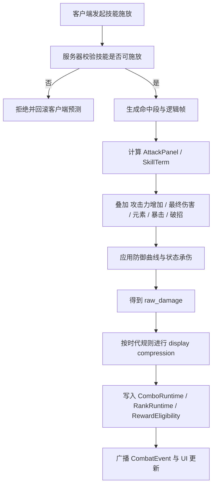
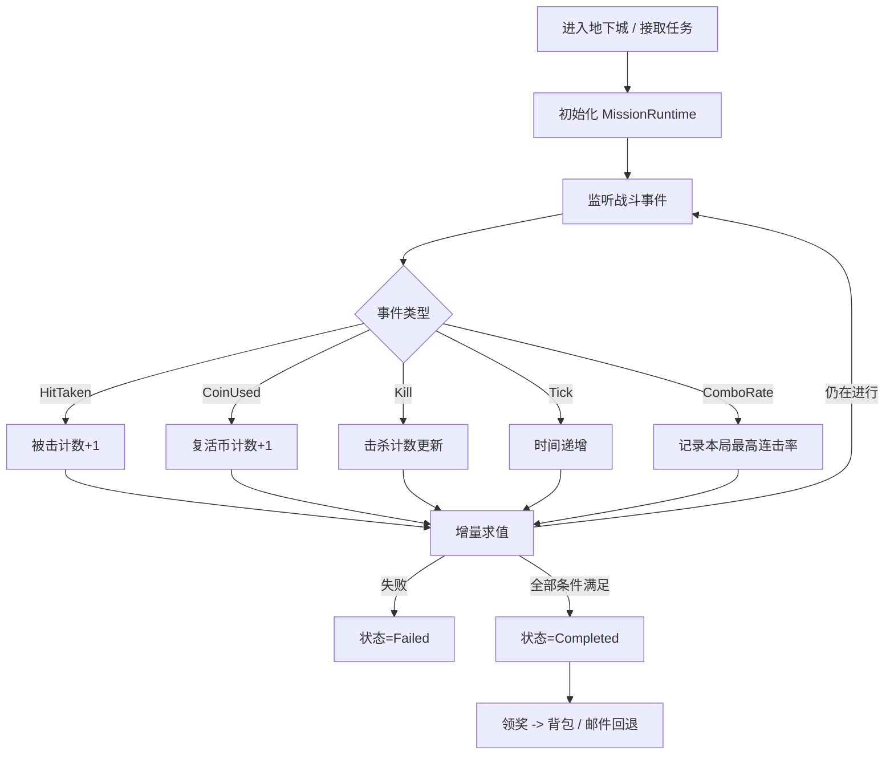
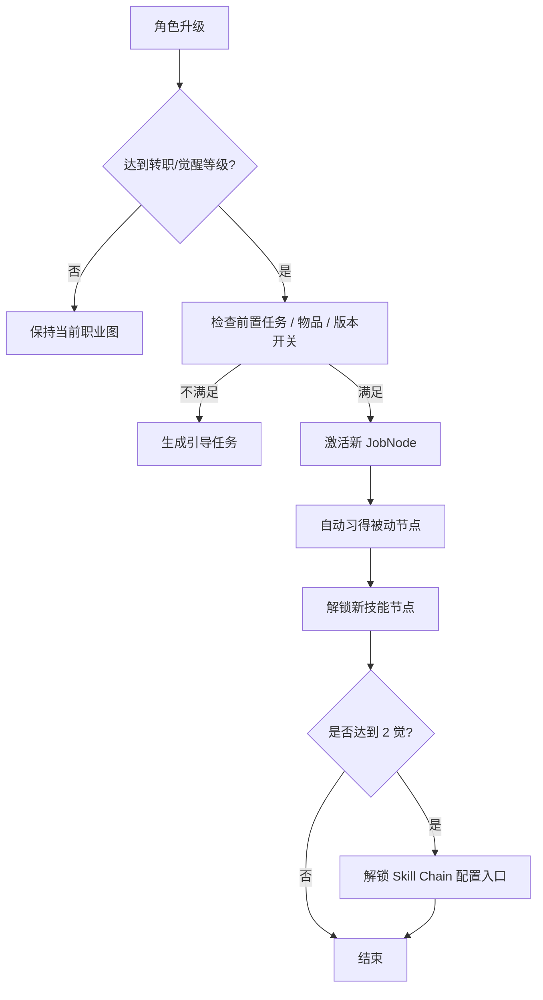

# DNF战斗系统复刻技术研究报告
> **Status: [EXTENSION] — 评分奖励系统**

## 执行摘要

如果目标是“可直接指导开发团队逐项实现”的 1:1 复刻，那么第一件事不是写公式，而是**锁定版本边界**。公开资料显示，DNF 的“旧刷图内核”和“现代成长/任务/技能链外层”并不属于同一时代：旧版评分、连击率、大量条件任务与负重逻辑主要来自早期至 Origin 时代；转职/觉醒流程在 2018 年 Origin 后被重排；三觉在 2020 年后加入；2021 年又做过一次全局伤害压缩；2025 年韩服官方指南还增加了技能链与现代战斗系统说明。把这些混成一个系统去做，最终一定会出现“UI 像现在、评分像过去、技能树像中期、数值像后期”的伪 DNF。公开一手资料主要来自 entity["organization","Neople","game developer, seoul, kr"] / entity["company","Nexon","game publisher, tokyo, jp"] 韩服与 DFO 全球站、以及 entity["company","腾讯游戏","shenzhen, guangdong, cn"] 国服站点。citeturn11view0turn11view1turn26search1turn38view0turn46view0

基于本次中、英、韩三语检索，最稳妥的工程策略是把复刻拆成两层。第一层是**稳定旧内核**：伤害结算、连击/评分、条件挑战、背包重量、旧式转职与觉醒；第二层是**现代外挂层**：三觉、DFO Mission、技能链、现代副本的贡献度与奖励资格门槛、现代异常状态与无力化系统。这样既能做出“刷图手感像 DNF”的核心体验，又能逐步接入 100/110/115 时代系统，而不会把不同时代的判定混到一起。citeturn16search1turn20view1turn20view0turn20view2turn19view2turn19view3turn19view5turn46view0turn38view0

本报告中的结论按可信度分三层使用。第一层是**直接公开**：例如面板攻击的官方旧公式、2021 伤害压缩、转职/觉醒等级门槛、技能链解锁条件、任务系统的重置与奖励发放规则、库存重量统一与消耗品快捷栏分组规则。第二层是**官方站社区与长期验证资料**：例如攻击力增加/最终伤害/冷却减免的现代乘算关系、旧版评分内部项、技能帧数据的 60fps 实测。第三层是**逆向与脚本资料**：PVF/NPK 读取器、Script.pvf 的数据定位、协议与封包逆向线索；这部分适合作为字段命名和数据组织参考，不适合作为掉率、评分、仇恨数值的唯一依据。citeturn25search0turn24view1turn26search7turn27view6turn13view0turn29search1turn36view0turn44search4turn44search2

这份报告最终给出的不是“把现有资料原样照抄”的文档，而是一个**可落地的兼容重建模型**：能确认的地方直接实装，不能确认的地方显式标注“未公开/需实测”，并附带反向推断方法、数据结构、伪代码和服务端同步策略。这样开发团队可以先构建 deterministic 的战斗核，再逐块收敛到目标版本。citeturn44search2turn45search2turn43search10

## 证据分级与版本边界

本次检索纳入了三类关键源。一类是**官方指南/更新/开放 API**，可直接支撑等级门槛、任务重置、技能链、现代异常状态、奖励资格等系统结论；一类是**官方站社区帖、17173/DFO World Wiki 等长期整理**，可支撑旧版评分、连击率、老公式与帧数据；最后一类是**PVF/NPK 工具、GitHub 读取器、逆向论坛**，可证明 `Script.pvf`、`NPK`、技能/物品数据与协议是可被公开工具读取和重建的，但这些资料的时效性和完整性必须单独审计。值得注意的是，Neople 官方开放 API 已公开 `jobs`、`skills`、`character skill/style` 等资源；第三方 DFO World Wiki 进一步指出，这些 API 文档中的技能/物品信息实质来自当前 KDnF `Script.pvf` 的 live 数据。citeturn28view1turn27view6turn29search1turn36view0turn44search4

从版本角度看，至少要区分五个拐点。其一，旧时代客户端长期沿用“评分—连击率—被击数—限时挑战”的刷图逻辑；其二，2018 年 Origin 将转职与 1/2 觉醒流程改为 15/50/75 级的统一节点；其三，2020 年开启真·觉醒/三觉，等级门槛提升到 100 级；其四，2021 年进行了 1/1000 级别的伤害压缩；其五，2024—2026 年的官方指南明确出现现代 DFO Mission、技能链、无力化/点化/异常状态等高级系统。复刻时最忌讳的就是把这些时代特征混为一个“平均版本”。citeturn11view1turn11view0turn12search0turn26search1turn38view0turn46view0turn19view2

建议项目组把版本锁定写进配置，而不是写死在代码里。最低限度需要四个全局版本开关：`enable_legacy_ranking`、`enable_neo_awakening`、`enable_damage_compression_2021`、`enable_modern_skill_chain`。这样做的好处是，伤害、任务、背包、转职四个模块都可以在统一的 `GameRuleset` 下读取时代参数，而不必在各处写 `if season >= x` 的硬编码分支。这个设计不是官方实现细节，而是基于公开时代差异得出的兼容层建议。citeturn11view1turn26search1turn46view0turn38view0

## 战斗结算、评分与奖励权重模块

**概要与目标**

这一模块的复刻难点不在“如何把血扣掉”，而在于**把 DNF 的数值结算、连击行为、评分展示、奖励资格和现代贡献度门槛拆成独立可配置层**。公开资料能实锤的部分，主要是面板攻击旧公式、现代攻击力增加与最终伤害的乘算、伤害压缩、旧版评分展示项、连击率的语义、现代副本的贡献/击杀门槛与奖励扣减规则。现代防御减伤曲线、穿透、精确掉率和完整评分权重则仍属于“未公开/需实测”。citeturn25search0turn24view1turn26search1turn16search1turn18search0turn19view3turn19view5

下表给出建议的**兼容实现数据结构**。这不是官方协议原文，而是把公开证据转成工程可落地的 schema。字段命名优先贴近官方 API 与社区通行名，便于后续做 PVF / API / 客户端配置对照。

| 结构 | 字段名 | 类型 | 示例值 | 说明 |
|---|---|---:|---:|---|
| `DamageContext` | `actor_id` | `uint64` | `1000123` | 施法者 |
|  | `target_id` | `uint64` | `2000456` | 受击者 |
|  | `skill_id` | `string` | `"sk_neo_blade_045"` | 技能标识 |
|  | `skill_level` | `int16` | `38` | 学习等级 |
|  | `hit_index` | `int16` | `3` | 第几段命中 |
|  | `damage_kind` | `enum` | `PhysicalPercent` | 百分比/固伤/异常/真伤 |
|  | `base_attack` | `int64` | `3120` | 基础双攻/独立攻击基数 |
|  | `main_stat` | `int32` | `4870` | 力/智 |
|  | `attack_increase_pct` | `double` | `46574.5` | 现代“攻击力增加”总和 |
|  | `final_damage_sources` | `double[]` | `[350, 12, 5]` | 现代“最终伤害”来源数组 |
|  | `element_attack` | `int32` | `320` | 属强 |
|  | `target_element_res` | `int32` | `150` | 目标属抗 |
|  | `is_critical` | `bool` | `true` | 暴击 |
|  | `is_counter` | `bool` | `false` | 破招/Counter |
|  | `status_vuln_stack` | `int8` | `2` | 如现代破裂/裂伤层数 |
| `ComboRuntime` | `combo_hits` | `int32` | `46` | 当前连击数 |
|  | `combo_damage` | `int64` | `1587342` | 当前连续命中累计伤害 |
|  | `last_hit_tick` | `int64` | `219330` | 上次命中逻辑帧 |
|  | `multi_target_hits` | `int16` | `4` | 同帧多目标追加数 |
| `RankRuntime` | `clear_ms` | `int32` | `274000` | 通关时间 |
|  | `hit_taken` | `int16` | `3` | 被击次数 |
|  | `coin_used` | `int16` | `0` | 复活币使用次数 |
|  | `tech_events` | `map<string,int32>` | `{"overkill":2,"counter":6,"back_attack":8}` | 技术项累计 |
|  | `combo_rate_max` | `double` | `87.4` | 本局最高连击率 |
| `RewardEligibility` | `boss_kills` | `int16` | `3` | 个人击杀记录 |
|  | `contribution` | `int16` | `4` | 个人贡献点 |
|  | `within_time_limit` | `bool` | `true` | 是否限时内完成 |
|  | `weekly_entry_left` | `int16` | `1` | 周进入次数 |
|  | `weekly_reward_left` | `int16` | `1` | 周奖励次数 |
| `RewardRow` | `table_id` | `string` | `"nabel_normal_main"` | 掉落表 |
|  | `item_group_id` | `string` | `"epic_115_custom"` | 物品组 |
|  | `weight` | `double?` | `null` | 未公开则置空 |
|  | `min_count` | `int16` | `1` | 最小数量 |
|  | `max_count` | `int16` | `1` | 最大数量 |
|  | `bind_type` | `enum` | `AccountBound` | 绑定方式 |
|  | `pity_flag` | `bool` | `false` | 是否参与保底 |

表中 `attack_increase_pct`、`final_damage_sources`、`combo_rate_max`、`boss_kills`/`contribution` 等字段，都能在官方或长期社区资料中找到对应概念；`weight` 列则刻意允许为空，因为官方对绝大多数战斗掉落并不公示精确概率。现金类概率道具存在官方概率表，但副本主掉落大多只公示“可获得物列表”和资格门槛，不公示权重。citeturn24view1turn16search1turn19view3turn19view5turn43search1turn43search3turn43search7turn43search10

**关键算法与数学公式**

可以确认的第一层，是**旧式面板攻击**。国服 2017 年官方说明明确给出改版前的关系：`面板攻击 = 攻击力 × (主属性 + 250) × 0.004 + 无视攻击`；同文还说明改版后取消了无视攻击并强化了攻击力本体，因此今天做“旧时代复刻”时必须保留 `ignore_attack` 字段，而做 Origin 后或现代版时可以移除该分支。citeturn25search0turn25search2

可确认的第二层，是**现代增伤的乘算关系**。2025 年韩服官方站社区长文把当前核心增伤拆成三件事。第一，攻击力增加 A% 的伤害倍率是 `M_atk = 1 + A / 100`；第二，最终伤害来源之间是乘算，即 `M_final = ∏(1 + B_i / 100)`；第三，冷却减免的叠加方式不是加法，而是 `c = 100 - 100 × ∏(1 - C_i / 100)`，由此得到同时间窗内的理论伤害增幅 `M_cdps = 100 / (100 - c)`。这些式子非常适合直接做成服务器 deterministic 计算路径，因为它们不依赖 UI，而依赖的是可序列化的属性集合。citeturn24view1

可确认的第三层，是**显示伤害压缩**。国服 2021 年官方公告说明，当时把以“万亿”为单位的伤害压缩到“亿”为单位，数值压缩到 `1/1000`，并在公式中设置 `1/1000` 的补正常数，最终输出也按该比例展示；随后修炼场伤害记录也统一压缩到原记录的 `1/1000`。工程上最稳妥的做法，是把 `raw_damage_internal` 与 `display_damage` 分离：内部战斗逻辑保持 64 位定点或整数，界面层再做时代相关的压缩显示。citeturn26search1turn26search7

在此基础上，建议把 2017 之后的战斗命中写成下面这个**可配置总式**：

`RawHit = SkillTerm × AttackPanel × M_atk × M_final × M_element × M_crit × M_counter × M_status_vuln × DefenseCurve(target, penetration)`

其中 `AttackPanel` 可由旧版或新版面板公式生成；`M_atk`、`M_final`、`M_cdps` 采用上面的已证实公式；`M_element`、`M_crit`、`M_counter`、`DefenseCurve` 则需要按目标版本收敛。旧时代英文社区总结式里给出过 `[(skill% * base attack) + fixed damage] * (1 + stat/250) * (1 + elemental damage/220) + (skill% * piercing attack)` 这样的层级模型，可作为“百分比/固伤/属强/穿透”分层的参考，但它不应被视为现代全版本统一真值。citeturn18search8turn25search9

现代官方韩服战斗指南还公开了**异常状态伤害的时间模型**，这部分反而比传统减伤曲线更可直接落地：中毒 5 秒，每 0.5 秒结算一次；灼伤 5 秒，每 0.5 秒结算一次，并对 150px 范围内目标扩散原伤害 10%；感电 10 秒，每 0.5 秒分摊结算，并按指定打击数与攻击力系数分配；出血 3 秒，每 0.5 秒结算一次；另外新异常”破裂/파열 (Rupture)”可叠 3 层，对怪物分别提高其最终承伤 5%/7%/8%。这意味着现代 DNF 的状态伤害不是“一个 debuff 再每秒简单 tick”，而是**定长分片、固定 tick 步长、部分状态带 AoE 或分摊规则**。citeturn38view0

**连击/连段、仇恨与评分**

旧版国服官方对刷图评价的公开文案非常关键：共有 F 到 SSS 九档，排名等级取决于“操作”“技巧”“被击数”“通关时间”；老版官方“连击杀伤率”页面又明确说明，连击数不仅包括连续攻击，还包括**同一次攻击命中多个敌人的多重攻击数**，而且影响连击杀伤率的不是“纯连击数”，而是**连击期间对敌人造成的伤害**。这两条合起来，已经能导出一个很强的结论：DNF 旧版刷图评分不是单纯看 `combo_hits`，而是看“连续命中窗口中的伤害产出 + 技术事件 + 低被击 + 时间”。citeturn16search1turn18search0turn18search3

与此相呼应，韩服旧资料和社区整理暴露出大量条件阈值：比如 Murkwood 需要“5 分 50 秒内通关”“连击率 75% 以上”“被击不超过 10 次”“不使用复活币”；龙人塔与人偶馆等后续地图又把阈值提升为“连击率 85%”“被击不超过 14/16 次”“6 分 30 秒内通关”。这表明评价系统至少向外暴露了四条向量：`combo_rate`、`hit_taken`、`clear_time`、`coin_used`。如果开发目标是复刻旧版条件挑战，那么这四项一定要做成可独立监听的 runtime state，而不是只在通关时回放录像再计算。citeturn20view1turn20view0turn20view2

因此，**连段判定**建议采用双层结构。第一层是命中链：若当前命中与上一次命中的间隔 `Δt <= combo_gap_ms`，则延续当前 combo；单帧对多个目标命中时，`combo_hits += hit_target_count`。第二层是连击率：维护 `combo_damage`，按“连续命中窗口内累计伤害 / 参考 HP 基数”计算。`combo_gap_ms` 与“参考 HP 基数”的精确取值并未被官方公开，因此应标记为“需实测”；但它们可以用上述 75%/85% 的任务阈值去反推，校准目标是让低伤普攻拉长连段能提高连击率，而单次超高爆发秒房并不天然拿到 SSS。citeturn18search0turn20view1turn20view0turn20view2

评分内部的**技术项**，可从社区长期测试中提取出旧版显性行为：`Over Kill`、`Counter`、`Back Attack` 往往被视为加分事件，而“尽量不被击”也是隐藏分来源之一；DFO World Wiki 的 Rank 摘要还提到 Style points 共 70 分，其中 Hit Combo 占 30 分。由于公开可访问片段没有给出完整 70 分拆分表，因此最安全的工程策略不是硬写死“这就是原版真值”，而是把评分核设计成：`grade = f(combo_rate_max, hit_taken, clear_ms, coin_used, tech_events)`，并用配置决定每个时代的分段。citeturn16search2turn21search0turn22search0

**仇恨/仇恨值**方面，公开资料能确认的是“有目标选择机制，但不像传统 MMO 那样高度体系化”。官方补丁曾直接写到“修复贵族机要副本部分地图中怪物仇恨机制触发异常的问题”；韩服社区资料还提到个别技能可以“提高 aggro 顺位”；另一方面，中文长期社区又明确指出 DNF 的仇恨更接近“怪物目标选择系统”，而不是持久化威胁表。基于这些证据，推荐复刻时做成**混合锁定模型**：怪物机制点名优先级最高，其次是嘲讽/锁定类技能，再其次是最近攻击者与最近距离者的加权选择，并对当前目标增加一个小的滞回项，避免目标在多人环境下疯狂抖动。citeturn40search5turn42search11turn42search3turn42search1

**奖励分配与概率表**

官方公开最充分的，其实不是掉率，而是**资格门槛与次数扣减逻辑**。例如现代 Raid 页面明确写了：进入次数在开局扣减，失败或放弃会返还进入次数；奖励次数在成功获得奖励时扣减；某些副本要求**个人**至少击杀 3 个 Boss 或达到最低贡献值，且贡献/击杀是按个人记录；Luke Hard 还公开了角色级/账号级特殊奖励任务。现代实现应把“进入资格”“奖励资格”“额外任务奖励”严格拆开，否则很容易重现不了 DNF 式的“能进但不一定有奖”的体验。citeturn19view3turn19view4turn19view5turn43search12

真正的“精确权重表”在公开副本资料里反而大量缺失。韩服概率页会给出商城随机道具的明确概率，例如某绑定魔盒里高阶时装 85%、稀有时装 5%/5%、克隆稀有 2.5%、主题稀有 2.5%；但副本奖励页通常只列“可获得物”和数量范围，不列具体 `weight`。甚至韩服社区做 Ozma 金牌/竞拍概率统计时，也明确把工作描述为“Neople 未正式公开而由玩家统计填补的空白”。所以，掉率表在副本系统中应设计成支持 `weight = null`、`source = measured`、`confidence = B/C` 的空缺态，而不是强行写死伪精确数字。citeturn43search1turn43search3turn43search7turn43search10

下面给出**奖励兼容表的工程写法**。这里的 `weight` 是为了系统可运行而保留的字段；在公开资料未给出的情况下，先用 `null` 或实验估计值托管，等样本回归后再固化。

| table_id | item_group_id | weight | 资格条件 | 备注 |
|---|---|---:|---|---|
| `asrahan_weekly` | `mist_raid_main` | `null` | `boss_kills >= 3 && within_time_limit` | 个人记录，周奖励次数成功时扣减 |
| `nabel_weekly_solo` | `nabel_main_solo` | `null` | `contribution >= 2 && within_time_limit` | Solo 门槛较低 |
| `nabel_weekly_party` | `nabel_main_party` | `null` | `contribution >= 3 && within_time_limit` | 组队按个人贡献 |
| `luke_hard_special_char` | `special_reward_char` | `1.0` | `clear_count >= x` | 角色任务，非随机 |
| `luke_hard_special_account` | `special_reward_account` | `1.0` | `account_clear_without_death >= x` | 账号共享 |
| `cash_bind_cube_demo` | `rare_avatar_pool` | `0.15` | `consume_item` | 这里仅作“官方概率字段存在”的模板示例 |

副本主掉落如果没有精确公开权重，建议采用**可回填的贝叶斯估计表**：`p_i = (count_i + α) / (N + αK)`。这样即使第一版只有粗略社区样本，也能在线迭代而不破坏数据结构。商城类概率与副本类概率在存储结构上可以统一，但 `disclosure_policy` 必须分开。citeturn43search1turn43search10

**伪代码**

```python
from dataclasses import dataclass, field
from math import prod
from typing import Dict, List, Optional


@dataclass
class DamageContext:
    base_attack: float
    main_stat: float
    skill_term: float
    attack_increase_pct: float
    final_damage_sources: List[float]
    crit_mul: float
    counter_mul: float
    element_mul: float
    status_vuln_mul: float
    defense_mul: float
    display_compression: float = 1000.0


def resolve_hit(ctx: DamageContext) -> Dict[str, int]:
    # 2017+ 面板近似：AttackPanel = BaseAttack * (1 + MainStat / 250)
    attack_panel = ctx.base_attack * (1.0 + ctx.main_stat / 250.0)

    m_atk = 1.0 + ctx.attack_increase_pct / 100.0
    m_final = prod(1.0 + v / 100.0 for v in ctx.final_damage_sources) if ctx.final_damage_sources else 1.0

    raw = (
        ctx.skill_term
        * attack_panel
        * m_atk
        * m_final
        * ctx.crit_mul
        * ctx.counter_mul
        * ctx.element_mul
        * ctx.status_vuln_mul
        * ctx.defense_mul
    )

    raw_int = max(1, int(raw))
    display = max(1, int(raw_int / ctx.display_compression))
    return {"raw_damage": raw_int, "display_damage": display}


@dataclass
class RewardEligibility:
    boss_kills: int = 0
    contribution: int = 0
    within_time_limit: bool = True
    weekly_entry_left: int = 1
    weekly_reward_left: int = 1


def can_receive_reward(content_type: str, e: RewardEligibility) -> bool:
    if e.weekly_reward_left <= 0:
        return False

    if content_type == "asrahan":
        return e.boss_kills >= 3 and e.within_time_limit

    if content_type == "nabel_solo":
        return e.contribution >= 2 and e.within_time_limit

    if content_type == "nabel_party":
        return e.contribution >= 3 and e.within_time_limit

    return e.within_time_limit
```

**流程图**



**来源类型与可信度**

这一模块直接用到的资料可以这样分级使用。`S` 级：国服旧公式、伤害压缩、韩服现代异常状态、Asrahan/Nabel/Luke 的奖励资格规则。`A` 级：旧版评分展示项、旧官方“连击杀伤率”语义。`B` 级：官方站社区对现代乘算关系的解释、长期社区对旧评分加分事件的总结。`C` 级：仇恨与掉率的统计帖、逆向资料。开发时应把 `S/A` 级作为默认实现，把 `B/C` 级做成可调参数。citeturn25search0turn26search1turn38view0turn19view3turn19view5turn16search1turn18search0turn24view1turn43search10turn42search1

## 战斗任务、成就与条件挑战模块

**概要与目标**

DNF 的任务/成就/条件挑战系统，本质上是一个**事件驱动的条件编排器**。旧时代大量任务直接把评分侧向量外露成独立挑战，如“多少时间内通关”“被击次数不超过多少”“连击率达到多少”“不得使用复活币”“指定难度通关”“组队通关”；现代 DFO Mission 则引入了日常/周常、Rest Bonus、按角色或账号作用域结算、基于名望和成就动态调整难度与奖励等机制。citeturn20view1turn20view0turn20view2turn19view2turn19view1turn15search0

旧版条件任务给了我们非常有价值的“外露判定 DSL”。Murkwood 的任务包含“5 分 50 秒内通关”“连击率 75% 以上”“被击不超过 10 次”“不使用复活币”；龙人塔与人偶馆又给出 85% 连击率、14/16 次被击上限、6 分 30 秒通关门槛。这些条件几乎一一对应到一个通用数据结构：时间上限、计数器上限、布尔失败项、难度门槛、队伍规模门槛、目标击杀计数。citeturn20view1turn20view0turn20view2

现代 DFO Mission 进一步说明了服务端状态机应该怎么写。DFO 全球官方页明确：系统要求 100 级以上；日常按角色发放、周常按账号发放；日常每日重置，周常每周二重置；日常可免费更换一次任务，其后每次 1000 Gold；未完成的日常可累计 Rest Bonus，最多 12 点；有 4 点或以上 Rest 时可消耗 4 点使该次任务奖励翻倍；每日完成任务会积累点数，生成额外 Completion Reward；难度和奖励会随 Adventurer Fame 或达成情况上升；奖励直接发到背包，背包满则发到邮箱。韩服 2026 指南则补充了“日常按角色、每日最多 20 个角色、06 时重置、奖励直接进背包/邮箱”的运营实现细节。citeturn19view2turn19view1

**详细数据结构**

| 结构 | 字段名 | 类型 | 示例值 | 说明 |
|---|---|---:|---:|---|
| `ChallengeDef` | `challenge_id` | `string` | `"murkwood_combo_75"` | 唯一 ID |
|  | `scope` | `enum` | `Character` | 角色/账号/队伍/赛季 |
|  | `reset_mode` | `enum` | `Daily` | 不重置/每日/每周/入场即重置 |
|  | `accept_level_min` | `int16` | `100` | 接取等级门槛 |
|  | `min_difficulty` | `enum?` | `Expert` | 难度门槛，空则无 |
|  | `party_size_min` | `int8?` | `2` | 组队门槛 |
|  | `time_limit_ms` | `int32?` | `350000` | 350 秒 |
|  | `max_hits_taken` | `int16?` | `10` | 被击上限 |
|  | `min_combo_rate` | `double?` | `75.0` | 连击率下限 |
|  | `max_coin_used` | `int16?` | `0` | 复活币上限 |
|  | `objective_kills` | `map<string,int32>` | `{"tau_army":4}` | 定点杀怪 |
|  | `reward_rows` | `string[]` | `["exp_box_small"]` | 奖励池引用 |
| `MissionRuntime` | `state` | `enum` | `Running` | Inactive/Running/Failed/Completed/Claimed |
|  | `start_tick` | `int64` | `1250021` | 开始帧 |
|  | `elapsed_ms` | `int32` | `120334` | 已历时 |
|  | `counters` | `map<string,int64>` | `{"kills.tau_army":3}` | 计数器 |
|  | `flags` | `map<string,bool>` | `{"used_coin":False}` | 标志位 |
|  | `rest_bonus` | `int16` | `8` | Rest 积分 |
|  | `reroll_count_today` | `int8` | `1` | 今日更换次数 |
| `ConditionNode` | `op` | `enum` | `AND` | AND/OR/NOT/GT/LE/EQ/HAS |
|  | `lhs` | `string` | `"stats.hit_taken"` | 左值路径 |
|  | `rhs` | `variant` | `10` | 右值 |
|  | `window_ms` | `int32?` | `null` | 滑窗条件 |
|  | `children` | `ConditionNode[]` | `[]` | 复合条件 |
| `RewardMailFallback` | `mail_on_full_inventory` | `bool` | `true` | 背包满转邮件 |
|  | `expire_at` | `datetime` | `2026-05-07T06:00:00+09:00` | 领取期限 |

这些字段直接映射到旧条件挑战与现代 DFO Mission 的公开行为：每日/每周重置、角色/账号作用域、免费 reroll 一次、Rest Bonus、奖励邮箱回退。citeturn19view2turn19view1turn20view1turn20view0turn20view2

**关键算法与数学公式**

建议使用**事件驱动 + 增量更新**，而不是通关后全量扫描。这是因为 DNF 的许多挑战是“立即失败型”，例如用了复活币就失去“无币通关”资格；被击数超上限也应实时 fail，而不是到结算页再发现不达标。核心流程很简单：战斗事件 `HitTaken`、`MonsterKilled`、`CoinUsed`、`DungeonClear`、`DifficultyEntered`、`PartyChanged` 持续写入 `MissionRuntime`，由 `ConditionNode` 增量求值。时间复杂度若按事件更新，可做到每事件 `O(k)`，`k` 为该事件关心的 challenge 数量；若用标签索引，实际可接近 `O(1)`。这部分是工程建议，但它完全是由公开任务形态反推出的。citeturn20view1turn20view0turn20view2

Rest Bonus 最适合实现为一个极小的状态机。若某天未完成 `n` 个日常，则 `rest_bonus += n`，上限 12；完成一个允许翻倍的任务时，若 `rest_bonus >= 4` 且玩家选择消耗，则 `rest_bonus -= 4`，奖励乘以 2，并追加更多 completion points。由于 DFO 全球说明“the more your Rest bonuses, the more your points”，需要把 completion point 的增益写成依赖 `rest_bonus_before_spend` 的函数，而不是写死常数。公开页面没有给出精确点数公式，因此推荐写成：`point_gain = base_point * rest_point_multiplier[rest_bonus_bucket]`，用表驱动。citeturn19view2

重置时间必须**服务区可配置**。DFO 全球站采用 UTC 文案，韩服 2026 指南则给出现地时间 `06시 (06时/上午6点)`。因此服务端应把 reset 逻辑做成 `cron + region-config`，而不是在任务定义中混入绝对时间。建议结构是：`ResetPolicy {region, timezone, daily_reset_hhmm, weekly_reset_weekday, weekly_reset_hhmm}`。citeturn19view2turn19view1

**伪代码**

```python
from dataclasses import dataclass, field
from typing import Dict, Optional


@dataclass
class ChallengeDef:
    challenge_id: str
    time_limit_ms: Optional[int] = None
    max_hits_taken: Optional[int] = None
    min_combo_rate: Optional[float] = None
    max_coin_used: Optional[int] = None
    min_difficulty: Optional[str] = None
    party_size_min: Optional[int] = None
    objective_kills: Dict[str, int] = field(default_factory=dict)


@dataclass
class MissionRuntime:
    elapsed_ms: int = 0
    hit_taken: int = 0
    combo_rate_max: float = 0.0
    coin_used: int = 0
    difficulty: str = "Normal"
    party_size: int = 1
    kills: Dict[str, int] = field(default_factory=dict)
    state: str = "Running"   # Running / Failed / Completed


def update_runtime(rt: MissionRuntime, event: Dict) -> None:
    t = event["type"]
    if t == "Tick":
        rt.elapsed_ms += event["delta_ms"]
    elif t == "HitTaken":
        rt.hit_taken += 1
    elif t == "CoinUsed":
        rt.coin_used += 1
    elif t == "ComboRate":
        rt.combo_rate_max = max(rt.combo_rate_max, event["value"])
    elif t == "Kill":
        monster = event["monster_key"]
        rt.kills[monster] = rt.kills.get(monster, 0) + 1


def evaluate(ch: ChallengeDef, rt: MissionRuntime) -> str:
    if ch.time_limit_ms is not None and rt.elapsed_ms > ch.time_limit_ms:
        return "Failed"
    if ch.max_hits_taken is not None and rt.hit_taken > ch.max_hits_taken:
        return "Failed"
    if ch.max_coin_used is not None and rt.coin_used > ch.max_coin_used:
        return "Failed"
    if ch.min_difficulty is not None and rt.difficulty < ch.min_difficulty:
        return "Failed"
    if ch.party_size_min is not None and rt.party_size < ch.party_size_min:
        return "Failed"

    for k, need in ch.objective_kills.items():
        if rt.kills.get(k, 0) < need:
            return "Running"

    if ch.min_combo_rate is not None and rt.combo_rate_max < ch.min_combo_rate:
        return "Running"

    return "Completed"
```

**流程图**



**来源类型与可信度**

这一模块最强的证据来自官方和旧任务文本，因此可信度总体较高。旧版条件挑战的具体阈值来自韩服旧任务资料；现代日常/周常、Rest Bonus、奖励直投背包/邮箱、按角色/账号作用域与名望缩放来自 DFO 全球与韩服官方指南。这里真正“未公开”的并不是任务逻辑，而是 completion points 的精确换算系数；这部分应保留为可配置表。citeturn20view1turn20view0turn20view2turn19view2turn19view1

## 重量、负重、背包与战斗准备模块

**概要与目标**

公开资料显示，PC 端 DNF 的“重量系统”主要是**背包承载、可拾取性、物品分组消费和 UI 引导**，而不是经典西式 RPG 那种“负重越高移动越慢、攻速越慢、技能越难放”。本次检索能确认四件事情：其一，2018 年便利性改版后，所有角色的背包重量上限被统一到“原最大重量上限”；其二，护甲部位与材质具有明确 kg 数值，且重甲/板甲曾显著更重；其三，库存达到 90% 重量上限时会出现相关引导；其四，可在地下城使用的部分消耗品会按“同效果 + 共享冷却”进行快捷栏分组，并按照“最早到期优先；同到期时，不可交易 → 账号绑定 → 可交易”的顺序消耗。citeturn13view0turn13view1turn13view2turn13view3

更重要的是，公开官方资料**没有显示出超重会直接惩罚移动、普攻、技能冷却或消耗效率**。能确认的，是重量上限、装备自身重量、拾取与整理相关 UI。若目标是 1:1 复刻 PC DNF，那么默认实现应把“战斗惩罚系数”设为 0，仅保留“无法继续拾取 / 需要整理 / 提醒用户”的行为；如果项目是“借鉴 DNF 而非严格复刻”，才应该额外设计负重惩罚开关。这个结论是基于官方公开范围的逆向界定，而不是凭空推测。citeturn13view0turn13view1turn13view2

**详细数据结构**

| 结构 | 字段名 | 类型 | 示例值 | 说明 |
|---|---|---:|---:|---|
| `ItemDef` | `item_id` | `string` | `"itm_potion_hp_small"` | 物品 ID |
|  | `stack_max` | `int32` | `100` | 叠堆上限 |
|  | `weight_kg` | `double` | `0.02` | 单件重量 |
|  | `cool_group_id` | `string?` | `"hp_potion_basic"` | 共享冷却组 |
|  | `effect_group_id` | `string?` | `"recover_hp_small"` | 同效果分组 |
|  | `expire_at` | `datetime?` | `2026-05-01T06:00:00+09:00` | 删除期限 |
|  | `bind_type` | `enum` | `AccountBound` | 不可交易/账号绑定/可交易 |
|  | `can_quickslot` | `bool` | `true` | 可否放快捷栏 |
| `InventoryState` | `weight_limit_kg` | `double` | `120.0` | 总上限 |
|  | `weight_used_kg` | `double` | `108.3` | 已使用 |
|  | `slot_capacity` | `int32` | `160` | 格子数 |
|  | `slots_used` | `int32` | `154` | 已占格子 |
|  | `show_heavy_guide` | `bool` | `true` | `weight_used / weight_limit >= 0.9` |
| `QuickslotGroup` | `group_key` | `string` | `"recover_hp_small#hp_potion_basic"` | 效果+CD 组 |
|  | `item_refs` | `list<ItemRef>` | `[...]` | 同组候选 |
|  | `shared_cd_ms` | `int32` | `5000` | 共享冷却 |
|  | `selection_policy` | `enum` | `ExpiryThenBind` | 官方公开逻辑 |
| `BattlePrepPreset` | `preset_id` | `string` | `"raid_default"` | 预设名 |
|  | `equip_map` | `map<string,string>` | `{"weapon":"itm_..."} ` | 装备映射 |
|  | `consumable_groups` | `list<string>` | `["hp_potion_basic","cube_red"]` | 快捷栏候选组 |
|  | `weight_budget_kg` | `double` | `110.0` | 预设重量预算 |

上表里，`QuickslotGroup.selection_policy = ExpiryThenBind` 是完全可以直接照着官方实现的；`BattlePrepPreset` 则是为开发落地补上的推荐层，因为官方资料虽然明确了快捷栏分组与背包重量行为，但没有公开“预设装备/预设消耗品”的标准结构。citeturn13view0turn13view2

**关键算法与示例数据**

总重量公式应保持最简单的线性结构：

`total_weight_kg = Σ(item_count_i × item_weight_kg_i) + Σ(equipped_weight_kg_j)`

可公开确认的装备重量示例，来自 2018 便利性改版的护甲合并表。以“上衣/下装/肩部/腰带”为例，旧时代布/皮/轻/重/板分别对应：上衣 `1.4 / 1.9 / 3.1 / 3.6 / 5.0 kg`，下装 `1.1 / 1.5 / 2.5 / 2.9 / 4.1 kg`，肩部 `0.8 / 1.1 / 1.9 / 2.3 / 3.2 kg`，腰带 `0.55 / 0.8 / 1.2 / 1.4 / 2.0 kg`；合并后统一按旧布甲重量处理，而角色背包重量上限则统一到原最大值。这个机制非常适合还原旧客户端“材质决定穿戴重量，但系统后期做过统一”的历史演化。citeturn13view2turn13view0

快捷栏分组的关键不在 UI，而在**消耗顺序**。官方韩服说明已给出精确规则：同效果且共享冷却的可地下城使用消耗品，可在快捷栏上分组；实际消耗时优先消耗删除期限最早的物品；若删除期限相同，则按“不可交易 → 账号绑定 → 可交易”的顺序消费。换句话说，服务器只要维护一个按 `(expire_at, bind_priority, slot_index)` 排序的最小堆，就能 deterministic 地重现官方行为。时间复杂度为 `push/pop O(log n)`。citeturn13view0

可以直接落地的权重阈值只有一个：**90% 提示阈值**。当 `weight_used_kg / weight_limit_kg >= 0.9` 时，打开背包会显示相关引导。这说明重量系统至少需要一个轻量的阈值观察器；但因为没有官方资料证明存在“95% 降移速、100% 降攻速”之类的战斗惩罚，所以这些行为不应自动添加。citeturn13view1turn13view3

**伪代码**

```python
from dataclasses import dataclass
from datetime import datetime
from typing import List


BIND_PRIORITY = {
    "Untradable": 0,
    "AccountBound": 1,
    "Tradable": 2,
}


@dataclass(order=True)
class QuickslotCandidate:
    expire_at: datetime
    bind_priority: int
    slot_index: int
    item_id: str
    stack_count: int


def choose_consumable(candidates: List[QuickslotCandidate]) -> QuickslotCandidate:
    # 官方规则：最早到期优先；到期相同时，不可交易 -> 账号绑定 -> 可交易
    return sorted(candidates)[0]


def calc_weight(items) -> float:
    total = 0.0
    for row in items:
        total += row["count"] * row["weight_kg"]
    return total


def should_show_heavy_guide(weight_used: float, weight_limit: float) -> bool:
    if weight_limit <= 0:
        return False
    return (weight_used / weight_limit) >= 0.90
```

**来源类型与可信度**

这一模块的可信度非常高，因为核心行为都来自官方更新页。重量上限统一、装备重量表、90% 背包提示、快捷栏消耗品分组与消耗顺序，全部都在韩服/DFO 全球便利性改版中可见。反过来，“超重影响移动/攻击/CD”没有公开官方支持，因此若要严格做 1:1，默认值应归零。citeturn13view0turn13view1turn13view2turn13view3

## 职业转职、觉醒与三觉技能解锁模块

**概要与目标**

这一模块的目标不是简单地“到等级就弹窗”，而是要把 DNF 的职业成长写成**数据驱动的职业图 + 任务门槛 + 自动习得/属性附加 + 技能树外层增强**。公开资料非常清楚地显示：Origin 以后，转职与 1/2 觉醒有统一等级门槛；Neo/三觉在 100 级后开启；技能链在 2 觉时解锁；开放 API 允许你按职业、转职、技能、角色技能风格去读 live 数据，而且 2026 年 API 还专门给 `skill/style` 加了 `chain` 字段。citeturn11view1turn11view0turn12search0turn46view0turn27view6turn28view1

基础门槛方面，2018 年 Origin 更新页说明：转职任务改为 15 级、通过 NPC Linus；1 觉在 50 级 North Myre 场景完成；2 觉在 75 级通过 Shonan 的 Siran，并新增专属地下城；同页还给出了当时 2 觉所需历史材料 `60 Seals of Empress Skardi + 150 Seals of Emperor Helm`。而当前 DFO 全球指南则延续了 1 觉 50、2 觉 75、Neo 100 的等级门槛描述。这说明**等级门槛是稳定内核，材料/任务串则是版本参数**。citeturn11view1turn11view0

三觉方面，国服 2020 官方活动页明确写着“真·觉醒任务分为上篇和下篇”，并说明只有开放职业才能完成下篇；韩服/全球职业页则直接展示了 95 被动、95 主动、100 主动这样的技能层次。以男气功和元素师为例，95 被动会附带“增强基础攻击和进阶技能攻击力，并修改一部分技能行为”，95 主动与 100 主动分别独立存在。这意味着三觉系统不能只做成“加一个 100 级大招”，而必须把**技能修饰器**与**新技能节点**同时加入成长图。citeturn12search0turn11view3turn11view5

**详细数据结构**

| 结构 | 字段名 | 类型 | 示例值 | 说明 |
|---|---|---:|---:|---|
| `JobNode` | `job_id` | `string` | `"fighter_m"` | 基础职业 |
|  | `job_grow_id` | `string` | `"nen_master_m"` | 转职/觉醒分支 |
|  | `stage` | `enum` | `Advancement` | 转职/1A/2A/3A |
|  | `required_level` | `int16` | `15` | 开启等级 |
|  | `required_quest_id` | `string?` | `"adv_linustalk_01"` | 前置任务 |
|  | `required_npc` | `string?` | `"Linus"` | NPC 门槛 |
|  | `required_items` | `list<ItemCost>` | `[]` | 历史材料要求 |
|  | `auto_learn_skills` | `list<string>` | `["latent_power"]` | 自动习得 |
|  | `unlock_skills` | `list<string>` | `["sk_95_passive","sk_100_active"]` | 解锁技能 |
| `SkillNode` | `skill_id` | `string` | `"sk_elem_assimilate"` | 技能 ID |
|  | `learn_req_level` | `int16` | `95` | 学习等级 |
|  | `sp_cost` | `int16` | `0` | SP 消耗 |
|  | `max_level` | `int16` | `1` | 上限 |
|  | `auto_learn` | `bool` | `true` | 是否自动习得 |
|  | `modifies_skills` | `list<string>` | `["sk_flame_pillar","sk_void"]` | 会改写的技能 |
| `AwakeningQuest` | `quest_id` | `string` | `"neo_awake_upper"` | 觉醒任务 |
|  | `quest_part` | `enum` | `Upper` | 上篇/下篇 |
|  | `dungeon_id` | `string?` | `"northmyre_awake"` | 专属地下城 |
|  | `stat_bonus_key` | `string?` | `"latent_power_1a"` | 附加属性键 |
| `SkillChainConfig` | `unlocked_at_stage` | `enum` | `Awakening2` | 2 觉解锁 |
|  | `max_chain_slots` | `int8` | `4` | 最多 4 个技能 |
|  | `priority_swap_delay_sec` | `double` | `0.0` | 0~5 秒 |
|  | `forbid_awakening_skills` | `bool` | `true` | 觉醒技不可入链 |
|  | `forbid_pvp` | `bool` | `true` | 决斗场禁用 |

这个结构和官方公开信息一一对应：`required_level` 来自 Origin/DFO 指南；`auto_learn_skills` 对应 `Latent Power` 一类自动习得被动；`SkillChainConfig` 则来自 2025 韩服技能链指南与 2026 API 的 `chain` 字段。citeturn11view1turn11view0turn46view0turn27view6

**关键算法与数学公式**

转职/觉醒最适合写成**有向无环图**。根节点是基础职业，第二层是转职，第三层是 1 觉，第四层是 2 觉，第五层是真·觉醒。节点激活条件统一为：

`Unlock(stage) = (level >= required_level) ∧ all(required_quests_completed) ∧ all(required_items_paid) ∧ region_version_enabled`

这样做的好处是，15/50/75/100 级门槛只是图的参数，国服 2020 真·觉醒“上篇/下篇”也只是把 3A 拆成两个子节点，不会污染技能系统。citeturn11view1turn11view0turn12search0

属性成长不要写死在“达成觉醒就直接加某几个数值”里，而应通过**自动习得被动节点**实现。Origin 更新页明确给出了 `Latent Power` 的语义：角色转职时自动习得，1 觉和 2 觉时附带额外属性加成。因此建议统一走 `SkillNode(auto_learn=True)` 路线，让属性成长和技能成长共用一套状态机，而不是另起一个“角色基础属性特判表”。citeturn11view1

技能等级/成长本身，公开一手资料更适合作为**数据表**而不是公式。原因很简单：Neople API 已经公开 `jobs`、`skills/:jobId`、`skills/:jobId/:skillId` 与角色 `skill/style`，而且第三方整理指出这本质上就是 live `Script.pvf` 的映射。换句话说，真正接近 1:1 的做法不是手写“职业通用成长公式”，而是**把成长写成数据驱动的曲线表**：`BaseValue[level]`、`SPCost[level]`、`PassiveModifier[level]`、`ModifiesSkills[]`。职业级的差异巨大，公式化反而会偏离原作。citeturn28view1turn29search1

技能链是一个非常好的例子。韩服官方指南写得极其详细：2 觉解锁；外传角色不可用；决斗场不可用；可指定最多 4 个技能；装备/项目强化不属于角色技能风格 API 输出；链中显示“当前可施放的下一个技能”；若全部冷却则显示“最先冷却好的技能”；高优先级技能冷却结束后会在设定的 0~5 秒内抢回显示；0 秒时会即时替换，并可连续使用栈技能或无冷却技能；只能在城镇和修炼房配置。实现上，这就是一个**优先队列 + 冷却观察器 + 规则过滤器**。citeturn46view0turn27view6turn27view0

下面给一个**公开技能节点的实例表**，用于说明 3A 不是“单节点”，而是“被动修饰 + 新主动技能”的组合。

| 职业示例 | Lv.95 被动 | 被动效果摘要 | Lv.95 主动 | Lv.100 主动 |
|---|---|---|---|---|
| 男气功 | `State of Nature` | 强化基础与进阶技能攻击，进图时 Spiral Energy 充满，战斗中自动恢复，并改写部分技能行为 | `Tiger Blast` | `Celestial Annihilation` |
| 元素师 | `Assimilate` | 强化基础与进阶技能攻击，并改写 Flame Pillar / Void 等技能行为 | `Thunder Rage` | `Cosmic Calamity` |

这类节点要求技能树数据结构支持 `modifies_skills[]`、`on_enter_dungeon_effects[]`、`combat_state_recovery[]` 等关联字段，否则你只能“加技能”，无法“改技能”。citeturn11view3turn11view5

**伪代码**

```python
from dataclasses import dataclass, field
from typing import List


@dataclass
class JobNode:
    node_id: str
    stage: str           # Advancement / Awakening1 / Awakening2 / NeoAwakening
    required_level: int
    required_quests: List[str] = field(default_factory=list)
    required_items: List[str] = field(default_factory=list)
    auto_learn_skills: List[str] = field(default_factory=list)
    unlock_skills: List[str] = field(default_factory=list)


def can_unlock(node: JobNode, level: int, completed_quests: set, owned_items: set) -> bool:
    if level < node.required_level:
        return False
    if not all(q in completed_quests for q in node.required_quests):
        return False
    if not all(i in owned_items for i in node.required_items):
        return False
    return True


def apply_unlock(node: JobNode, learned_skills: set) -> None:
    for s in node.auto_learn_skills:
        learned_skills.add(s)
    for s in node.unlock_skills:
        learned_skills.add(s)


@dataclass
class SkillChainConfig:
    skills: List[str]
    swap_delay_sec: float = 0.0
    max_slots: int = 4

    def next_display_skill(self, cooldowns: dict) -> str:
        for s in self.skills:
            if cooldowns.get(s, 0) <= 0:
                return s
        return min(self.skills, key=lambda s: cooldowns.get(s, 10**9))
```

**流程图**



**来源类型与可信度**

这一模块的可信度总体最高，因为核心信息都来自官方指南、Origin 更新与开放 API。真正的未知点不在“什么时候解锁”，而在“每个技能每一级到底长多少、哪些职业某年被改成自动习得”。这一层不应该硬写公式，而应从 API / PVF 数据表驱动。citeturn11view1turn11view0turn12search0turn46view0turn28view1turn27view6turn29search1

## 集成接口与补测计划

**客户端/服务器接口与同步策略**

下表给出的是**推荐兼容协议**，不是官方 DNF opcode 报文原文。公开资料能证明 DNF 存在客户端与服务器间的状态包、且运营方会针对“封包篡改导致更强伤害或物品信息被改写”做检测；但公开精确 opcode/位布局并未形成可直接信任的一手规范。因此，复刻项目更应该采用“服务器权威、客户端预测”的现代 MMOACT 同步策略，而不是试图完全照搬历史客户端脆弱路径。citeturn44search2turn44search3

| 模块 | 接口名 | 方向 | 频率 | 关键字段 | 同步策略 |
|---|---|---|---|---|---|
| 战斗结算 | `EnterDungeon` | C2S | 进入时一次 | `character_id, dungeon_id, difficulty, seed_hint` | 服务器创建战斗实例 |
| 战斗结算 | `SkillCastRequest` | C2S | 每次施放 | `seq, tick, skill_id, dir, x, y, target_hint` | 客户端预测，服务器裁决 |
| 战斗结算 | `CombatEventDelta` | S2C | 15–30Hz | `server_tick, actor_id, target_id, hit_index, raw_damage, flags` | 仅广播结果，不信任客户端伤害 |
| 战斗结算 | `DungeonResult` | S2C | 通关时一次 | `clear_ms, hit_taken, combo_rate_max, rank_grade` | 服务端汇总 |
| 任务成就 | `MissionStateSnapshot` | S2C | 1–2Hz 或事件驱动 | `mission_id, counters, flags, state, rest_bonus` | UI 可渐进更新 |
| 任务成就 | `MissionClaim` | C2S | 领奖时一次 | `mission_id` | 服务端验证并投递背包/邮件 |
| 背包负重 | `InventoryOpen` | C2S/S2C | 按需 | `weight_used, weight_limit, slots_used` | 读多写少 |
| 背包负重 | `QuickslotConsume` | C2S | 每次使用 | `group_key, preferred_item_id?` | 服务端按官方顺序最终决定 |
| 转职觉醒 | `GrowthGraphQuery` | C2S/S2C | 登录/升级/任务完成后 | `job_id, stage_nodes[]` | 客户端只显示图，不独立裁决 |
| 转职觉醒 | `UnlockStageRequest` | C2S | 触发时一次 | `node_id, quest_context` | 服务端检查等级/任务/道具 |
| 转职觉醒 | `SkillStyleQuery` | S2S/OpenAPI或工具侧 | 按需 | `jobId, jobGrowId, skillId` | 用于后台校验/数据导入 |
| 转职觉醒 | `SkillChainConfigSave` | C2S | 配置变更时 | `skills[], swap_delay_sec` | 仅城镇/修炼房可写 |

开放 API 侧，如果你要做校验工具、GM 数据核对、离线导表或自动回归，优先接入以下官方端点：`/df/jobs`、`/df/skills/:jobId`、`/df/skills/:jobId/:skillId`、`/df/servers/:serverId/characters/:characterId/skill/style`。官方文档说明 `skill/style` 不含通过道具和装备带来的技能强化；2026 年又为其新增了 `chain` 字段。这非常适合做“玩家实际学了什么技能、官方技能表是什么样、链路配置是什么”的三方校对。citeturn28view1turn27view0turn27view6turn29search2

**未公开项与反向推断方法**

本次检索后，仍应明确列入“未公开/需实测”的核心项有五类。第一，现代防御减伤曲线与穿透/破防的精确函数；第二，旧版完整评分权重与 F–SSS 的内部切段；第三，绝大部分副本主掉落的精确概率表；第四，怪物目标切换的精确时序与滞回；第五，精确的官方封包字段和 opcode。公开资料足以证明这些机制存在，但不足以直接给出严谨数值。citeturn16search1turn18search0turn43search10turn42search1turn44search2

推荐的收敛顺序如下。**先做数值核，再做表现核。**先把 `DamageContext -> RawHit -> CombatEventDelta` 的 deterministic 路径打通，再逐项拟合未公开参数。评分与连击率建议通过旧条件任务做监督标签反推：目标是让 Murkwood/龙人塔/人偶馆这类地图，在公开阈值附近出现与原版一致的“刷高连击拿挑战”行为。掉率则建议使用大样本日志和 Wilson 区间估计回填；社区已有 3000 样本金牌统计，这证明方法论可行，但生产环境应自己做版本内样本。citeturn20view1turn20view0turn20view2turn43search10

**帧数据与动作时序**建议采用“60fps 实测基线 + 技能脚本表 + 服务端逻辑帧”三件套。17173 的旧技术贴已经给出过标准做法：用 FRAPS 以 60fps 录制，再逐帧分析技能从起始动作到对手出现被击画面的帧数；同文还列出了一批巨剑剑魂技能起手帧值，说明 DNF 社区长期用 60fps 作为可靠观测单位。对复刻工程来说，最佳做法不是执着于“客户端能跑多少 FPS”，而是把逻辑帧稳定在固定步长，再把动画表现映射到 60fps 标尺上。citeturn45search2turn45search6turn45search8

**客户端数据源**方面，建议采用“官方 API 为主，PVF/NPK 为辅”的采集流水线。Neople 官方 API 已公开技能与职业数据；第三方资料指出它们与 live `Script.pvf` 对应；公开社区和 GitHub 上也已有可读取 `PVF/NPK` 的工具与库，如 DnF Extractor 教程、PVFTools、PvfPlayer 等。这说明你完全可以把内容表制作成：`official_api_snapshot`、`pvf_extract_snapshot`、`hand_verified_runtime_snapshot` 三层，然后用 diff 工具找冲突，而不是押注单一来源。citeturn29search1turn35search0turn35search4turn36view0turn44search4turn34search0

最后，给出一个**最小可交付实现顺序**。第一阶段：旧版刷图核，完成伤害结算、被击/时间/连击率监听、挑战任务 DSL、背包重量与快捷栏分组。第二阶段：Origin 成长核，接入 15/50/75 级成长图。第三阶段：Neo 外挂层，加入 100 级三觉、现代异常状态、伤害压缩。第四阶段：现代内容层，接入 DFO Mission、贡献度与奖励资格门槛、技能链。按这个顺序推进，项目在每个阶段都能形成一个“像某个时代 DNF”而不是“什么都像一点、但整体不像”的可玩的系统。citeturn11view1turn26search1turn19view2turn46view0turn38view0
