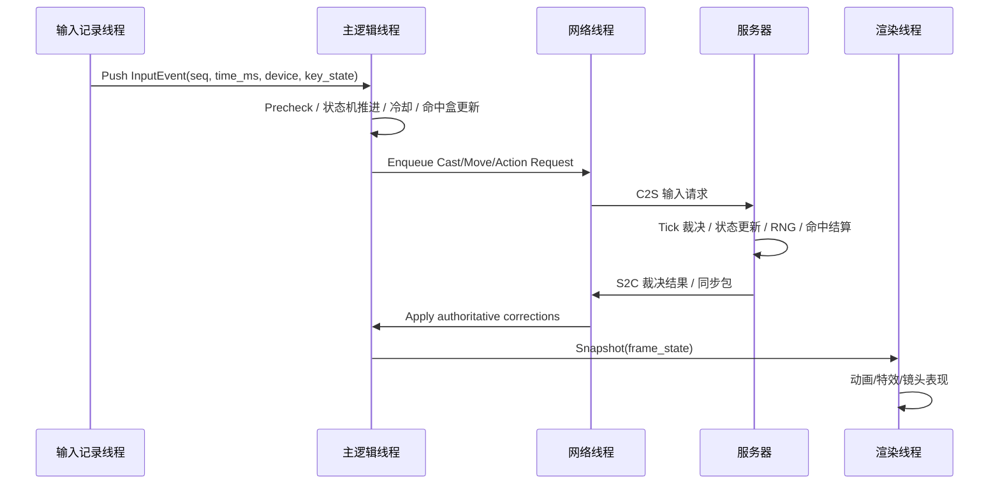
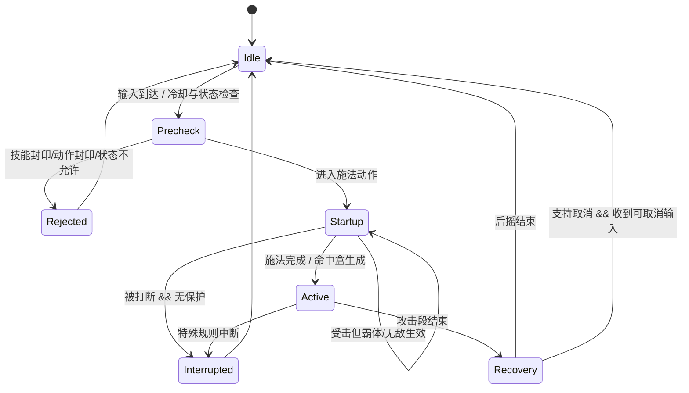

# DNF/DFO 战斗系统实现细节深度研究

## 执行摘要

这份文档给出的不是“泛泛而谈的系统设计建议”，而是一份尽量贴近现有公开证据、适合开发团队直接落地的**复刻级战斗系统说明**。当前公开资料能够**高可信确认**的部分，主要包括：现代客户端的线程分工（渲染 / 加载 / 按键记录 / 网络同步）、技能命令收益标准化、部分能力值上限、技能施法阶段与霸体/无敌/施法减伤的分离、自动施放 Buff 的可取消规则、技能封印与动作封印的区别，以及 PVF 技能文件中一批关键字段（如 `[casting time]`、`[cool time]`、`[executable states]`、`[command]`、`[pvp]`）。这些都足以反推出一个**以整数毫秒为作者域、以固定 Tick 为执行域、以服务器为裁决源**的战斗框架。citeturn26view0turn35view0turn43view1turn30view0turn32view0

同样需要直说的是：**没有公开且可靠的证据**能把当前 PC 版本 DNF 的全部战斗逻辑 100% 还原到“逐字节原包 / 原始 RNG 算法 / 原始服务器内部相位顺序”的程度。尤其是以下三项，仍然只能做“最佳证据重建”：其一，服务器 Tick 内部的精确 phase order；其二，战斗随机数的具体 PRNG 实现；其三，当前 PC 端命中 / 回避 / Miss 的全部底层系数与上下限。因此，本文对这三类内容会**显式标注可信度**，并把无法确认的部分设计成**可配置参数**，方便你们用逐帧录屏、战斗分析日志和局部抓包去继续拟合。citeturn26view0turn43view0turn43view2turn44search8turn42search0

从工程结论上看，若目标是“玩法与手感 1:1，且可以长期维护”，最稳妥的实施路线不是试图把所有东西做成渲染帧驱动，而是做成三层：**资产层用毫秒与状态表描述技能、逻辑层用固定 Tick 执行、网络层只同步输入与裁决结果，不把客户端视为可信来源**。这一点与官方后来公开承认的“按键记录线程只负责记录输入，主线程负责逻辑处理；网络线程用于处理组队同步包”完全一致。citeturn26view0

## 证据基础与可信度标准

官方高可信来源主要来自 entity["company","Neople","game developer"] / entity["company","Nexon","game publisher"] 的韩服与全球服更新说明，以及 entity["company","腾讯游戏","game publisher"] 国服同步页面；次级来源包括 entity["organization","17173","game media site"] 对官方发言的转载，以及 entity["organization","COLG","dnf community"] 等社区实测与讨论。用于解析台服历史客户端与 PVF 的公开代码仓库、论坛转储与脚本片段，只能作为**中低可信的结构证据**，不能直接等同于现网官方实现。citeturn43view1turn35view0turn43view2turn30view0turn32view0turn8view1

本文中的可信度按以下标准使用：

| 等级 | 含义 | 典型证据 |
|---|---|---|
| 高 | 官方补丁、官方系统说明、官方 EULA、官方开发口径，且能直接支持结论 | DFO Global / 韩服更新说明、韩服官方能力值说明、国服官方发言转载 |
| 中 | 多个社区/逆向来源可相互印证，或官方资料能支持总体方向但细节需推定 | PVF 字段结构、命令输入规则、指令锁/技能封印 UI 行为 |
| 低 | 仅见于泄露客户端片段、私服/论坛 dump、老版本经验贴，或只能做技术性推断 | 原包字段名、原始 opcode、精确 PRNG、服务器内部 phase order |

一条很重要的证据链是：公开解析器把 PVF 脚本区分为 `Animation` / `TextScript` / `Document` 等类型，而且对文本脚本显式处理了 `BIG5HKSCS` 编码问题；这说明**台服公开逆向语料最有价值的地方在“资产格式与文本编码”**，不是在“现网规则即事实”。因此，台服泄露客户端适合作为**字段形态与历史 schema** 的参考，而不适合作为“当前 PC 服逻辑权威”。citeturn7view0turn8view1turn8view2turn8view3

## 统一运行模型与数据底座

### 运行线程与主循环边界

官方 2022 年的系统改进公告已经把现代客户端的四类关键线程说明得非常清楚：渲染线程负责把主线程计算结果显示到屏幕；加载线程负责按需把文件载入内存；**按键记录线程**只接收并记录键盘输入，然后由主线程读取后执行逻辑；**网络线程**把组队战斗中的同步包从主线程中拆出去单独处理。这个结构直接说明，DNF/DFO 至少在现代版本里不是“输入、渲染、网络完全混在一个主循环里”的老式单线程模型，而是**Input Capture → Main Logic → Net Sync / Render Output** 的管线。可信度：高。citeturn26view0

对复刻工程来说，这意味着最接近原作的方法是：

1. **输入记录层**：只做时间戳、按键状态、组合键状态、输入源（键盘/手柄/自动施放）记录。
2. **主逻辑层**：唯一能改变角色战斗状态机、冷却、硬直、霸体、状态效果、出招结果的层。
3. **网络层**：只发“输入请求”和“服务器裁决结果”，不要让客户端提交最终战斗结果。
4. **渲染层**：只消费经裁决的逻辑状态；动画帧推进可以有本地插值，但不能反向决定命中、打断、冷却。

上面的拆分还能解释两个官方修复点：其一，旧客户端在主线程过载时会“随机漏掉按键输入”；其二，某些技能曾经出现“帧率设置不同导致 Hit 数不同”的问题。两者都指向同一个结论：**战斗逻辑必须与渲染帧解耦**，并且至少要做到“输入采样独立于逻辑计算、Hit 结算独立于渲染帧数”。可信度：高。citeturn26view0turn33view0

基于这些公开信息，推荐的主循环如下。这里是**重建建议**，不是官方源码转录；可信度：中。



### 技能资产模型与 PVF 字段

公开论坛转储的 PVF 片段已经能稳定看到一组核心字段：`[executable states]`、`[type]`、`[skill class]`、`[consume MP]`、`[cool time]`、`[casting time]`、`[command]`、`[command key explain]`、`[static data]`、`[level info]`，并且不少技能还有单独的 `[pvp]` 段落。示例里甚至能看到 `化魔` 的原始条目：`[cool time] 10000 10000`、`[casting time] 500 500`、`[command] ↓ → + C`；另一条 `sword75.skl` 还出现了 `[executable states] 0 8 14`、`[skill command advantage] 50 50`、`[dungeon]` 分支。可信度：中。citeturn30view0turn32view0

这一点非常关键，因为它说明技能并非“写死在代码里的一段行为”，而更像是：

- **代码里有通用状态机与结算器**；
- **PVF/技能脚本里有技能参数、状态门禁、命令、PVP 覆写与级别曲线**；
- 代码根据技能类型、静态数据与动作脚本解释这些字段。

因此，复刻时最稳妥的方案是做“**强类型资产 + 少量原样保留的 raw 字段**”。尤其是像 `[cool time] 10000 10000` 这种**成对整数**，公开资料并不能百分之百证明它在所有字段里都已经被语义化；很多 dump 中两项数值相同，所以工程上应该先保留成 `RawPairI32`，等你们用多版本资产做差分时再把它们映射成 `base / override` 或 `dungeon / pvp`。可信度：中。citeturn30view0turn32view0

### 建议的数据结构

下面这组结构体是本文后续所有模块的公共底座。它们是**根据官方线程说明、PVF 字段、控制器/热键系统和状态机需求重建**的统一模型；可信度：中。citeturn26view0turn14view0turn30view0turn32view0

```cpp
using SkillId = uint32_t;
using ActorId = uint32_t;
using Tick    = uint32_t;
using Ms      = uint32_t;

struct RawPairI32 {
    int32_t a;
    int32_t b;
};

enum class ContextMode : uint8_t { PvE, PvP };
enum class InputSource : uint8_t { Quickslot, Command, AutoCast, Scripted };
enum class StatusKind : uint16_t {
    HitStun, Knockup, Hold, SuperArmor, Invincible, CastDR,
    SkillSeal, ActionSeal, CommandLock, PassiveSeal,
    CooldownLock, Silence, ForcedMoveLock
};

struct SkillSpec {
    SkillId id;
    std::string name;
    std::vector<uint16_t> executableStateIds; // raw state ids from PVF
    RawPairI32 cooldownRaw;                   // e.g. 10000,10000
    RawPairI32 castingTimeRaw;                // e.g. 500,500
    std::vector<uint8_t> commandTokens;       // direction + terminal key
    bool hasPvpOverride;
    ContextMode defaultContext;
    // normalized authoring fields inferred by import step:
    Ms baseCooldownMsPve;
    Ms baseCooldownMsPvp;
    Ms startupMsPve;
    Ms startupMsPvp;
    uint16_t cooldownGroupId;
    uint16_t sharedCooldownGroupId;
    uint32_t flags; // summon/buff/manualOnly/awakening/etc.
};

struct CastProfile {
    bool superArmorOnStartup;
    bool invincibleOnStartup;
    uint8_t castDamageReductionPct; // 0, 10, 30...
    bool moveCancelable;
    bool attackCancelable;
    bool skillCancelable;
    bool autoCastCancelable;
    bool affectedByCastSpeed;
};

struct CooldownEntry {
    uint16_t groupId;
    Tick startTick;
    Tick endTick;
    bool shared;
    SkillId sourceSkillId;
};

struct StatusEffect {
    StatusKind kind;
    Tick startTick;
    Tick endTick;
    int32_t stackCount;
    int32_t magnitudeBp;   // basis points
    uint32_t sourceSkillId;
    uint32_t sourceActorId;
    uint32_t overrideRule; // refresh / replace / stack / ignore
};

struct SkillSlotBinding {
    uint8_t slotIndex;     // 0..13 for modern skill slots
    SkillId skillId;
    bool visible;
    bool commandSealed;
    bool quickslotLocked;
    uint16_t keyCode;
    uint16_t modifierMask;
    uint32_t commandHash;
    uint32_t configVersion;
};

struct InputEvent {
    uint32_t seq;
    Ms clientInputMs;
    InputSource source;
    uint16_t keyCode;
    uint16_t modifierMask;
    int16_t dirX;
    int16_t dirY;
};
```

## 技能施放、读条、打断、霸体与施法保护

### 已确认的行为边界

官方补丁已经把“施法阶段”拆成了至少三个不同层次：**施法动作（casting motion）**、**施放中 / 攻击中（during cast / during attack）**、**施法完成后的动作（after casting complete motion / post-cast motion）**。韩服与全球服的职业补丁里反复出现类似描述：
韩文原文示例：`캐스팅 모션이 슈퍼아머 상태로 변경됩니다. (施法动作变更为霸体状态。)`；
英文原文示例：`Buff motions ... can be canceled by moving`。
这说明 DNF 的所谓“读条/施法保护”不是一个单一布尔值，而是**附着在时间段上的多层保护标志**。可信度：高。citeturn33view0turn34view0turn35view0

从公开补丁可直接确认的保护层至少有三种：

1. **霸体 / Super Armor**：被击中时维持动作，不等于不受伤。
2. **无敌 / Invincibility**：补丁中经常与霸体互换或删除，说明它是更高等级的保护层。
3. **施法减伤 / Damage Reduction during casting**：例如官方曾把某技能“施法时减伤”从 30% 改为 10%，这明确说明施法保护不止一种实现，而是技能级别的参数。

同时，PvP 补丁又多次出现“施放时无敌改为霸体”“施法动作的霸体删除”“施法完成后动作的霸体删除”这类措辞，说明**保护窗口必须绑定到技能时轴的具体区段，而不是绑定到整个技能生命周期**。可信度：高。citeturn34view0turn44search1

### 可复刻的状态机

基于官方说明与 PVF 字段，可以把技能施放的最小可复刻状态机定义成下面这样。这里的状态名称是工程化命名，不是官方命名；但它和官方公告中反复出现的“施法动作 / 施法中 / 攻击后动作 / 可取消”概念是一一对应的。可信度：中。citeturn33view0turn34view0turn35view0turn30view0



### 重建公式与时序量化

**重建公式（可信度：中）**：公开资料能确认 `casting time` 是以整数毫秒 authoring 的字段，且施法速度是一个独立能力值，官方还修过“技能施放速度意外受移动速度影响”的 bug。因此最稳妥的复刻方式，是把作者域定义为毫秒，再量化到逻辑 Tick。citeturn30view0turn33view0turn43view1

推荐公式如下：

\[
startupMs_{eff} = \left\lceil \frac{startupMs_{base} \times 100}{100 + castSpeedPct_{eff}} \right\rceil
\]

\[
recoveryMs_{eff} =
\begin{cases}
recoveryMs_{base}, & \text{若技能说明为即时施放或不受施放速度影响}\\
\left\lceil \frac{recoveryMs_{base} \times 100}{100 + castSpeedPct_{eff}} \right\rceil, & \text{若技能显式受施放速度影响}
\end{cases}
\]

\[
startupTicks = \left\lceil \frac{startupMs_{eff}}{TICK\_MS} \right\rceil
\]

其中：

- `startupMs_base` 取自 PVF 归一化的 `[casting time]`。
- `castSpeedPct_eff` 先做能力值计算，再应用状态上限；现代公开上限为 300%。
- `TICK_MS` 建议做成可配置；若要减少抖动，逻辑可用 16ms，渲染可插值。

示例数值：

- 若某技能 `startupMs_base = 500ms`，角色施放速度为 `+50%`，则
  \[
  startupMs_{eff} = \lceil 500 \times 100 / 150 \rceil = 334ms
  \]
  若 `TICK_MS = 16`，则 `startupTicks = 21`。
- 若施放速度达到上限 `300%`，则同技能理论下限约为 `125ms`。这个极端例子仅用于验证计算链，实际还要考虑技能本身是否受施放速度影响。citeturn43view1turn30view0

### 服务器侧裁决伪代码

下面的伪代码把“读条、打断、霸体、施法保护、动画绑定”串成一个可执行过程。它是面向复刻工程的**重建逻辑**；可信度：中。citeturn33view0turn34view0turn35view0turn30view0

```cpp
CastResult TryStartSkill(Actor& a, const SkillSpec& s, InputSource src, Tick now) {
    if (!IsExecutableStateAllowed(a.stateId, s.executableStateIds)) return Reject(NotExecutableState);
    if (a.HasStatus(StatusKind::ActionSeal)) return Reject(ActionSealed);
    if (a.HasStatus(StatusKind::SkillSeal))  return Reject(SkillSealed);
    if (IsOnCooldown(a, s, now))             return Reject(OnCooldown);
    if (!HasMpAndResource(a, s))             return Reject(NoResource);

    ContextMode ctx = a.IsPvpRoom() ? ContextMode::PvP : ContextMode::PvE;
    Ms startupBase = (ctx == ContextMode::PvP) ? s.startupMsPvp : s.startupMsPve;
    Ms startupEff  = QuantizeMs(ApplyCastSpeed(startupBase, a.castSpeedPct, s));
    Tick castEnd   = now + MsToTicks(startupEff);

    CastProfile cp = ResolveCastProfile(a, s, ctx, src);

    a.runtime.castId++;
    a.runtime.currentSkillId = s.id;
    a.runtime.phase = SkillPhase::Startup;
    a.runtime.phaseEndTick = castEnd;
    a.runtime.castProfile = cp;

    if (cp.superArmorOnStartup) a.AddTimedStatus(StatusKind::SuperArmor, now, castEnd);
    if (cp.invincibleOnStartup) a.AddTimedStatus(StatusKind::Invincible, now, castEnd);
    if (cp.castDamageReductionPct > 0) {
        a.AddTimedStatus(StatusKind::CastDR, now, castEnd, cp.castDamageReductionPct);
    }

    ConsumeMpAndResource(a, s, src);
    BroadcastCastStart(a, s, now, castEnd, src);
    return Accept(a.runtime.castId);
}

void OnIncomingHit(Actor& a, const HitEvent& h, Tick now) {
    if (a.HasStatus(StatusKind::Invincible)) return;
    ApplyDamageReducedByCastDRIfAny(a, h, now);

    bool breakable = h.flags.superArmorBreak;
    bool protectedBySA = a.HasStatus(StatusKind::SuperArmor);

    if (a.runtime.phase == SkillPhase::Startup || a.runtime.phase == SkillPhase::Recovery) {
        if (!protectedBySA || breakable) {
            InterruptCurrentSkill(a, h.reason, now);
        }
    }
}
```

### 动画与技能帧绑定

DNF/DFO 不能只按毫秒去驱动技能，还必须把**动作资源帧**和**逻辑相位**绑定起来。理由有两个：第一，公开解析器明确区分了 `Animation` 与 `TextScript` 资源；第二，官方补丁常常修“攻击判定持续时间”“前摇”“后摇”“命中盒判定”而不是简单改一条总时长。可信度：高。citeturn7view0turn8view2turn33view0turn34view0

建议做法是把每个技能拆成至少四类时间点：

- `startup_begin_tick`：施法动作开始。
- `fire_tick[]`：生成 Hitbox / Projectile / GrabProbe 的时间点。
- `cancel_open_tick`：进入允许移动/攻击/技能取消的窗口。
- `recover_end_tick`：技能彻底回到 Idle。

如果你们只按总时长推进，而不按 `fire_tick[]` 生成判定，就会重现历史上那类“帧率不同 Hit 数不同”的 bug。官方修过此类问题，所以复刻时必须让**命中判定只依赖逻辑 Tick，不依赖渲染帧**。可信度：高。citeturn33view0

### 重建网络包示例

公开资料没有给出现网原始 opcode 和字段名，因此下面的包是**可复刻字段模型**，不是抓包字节流原文。字段设计依据来自：输入记录线程、网络同步线程、技能资产字段与施法/取消规则。可信度：中。citeturn26view0turn30view0turn35view0

```json
{
  "msg": "C2S_SKILL_CAST_REQ",
  "seq": 184522,
  "client_input_ms": 6234512,
  "actor_id": 90011342,
  "skill_id": 2115,
  "slot_index": 3,
  "input_source": "Quickslot",
  "dir_x": 1,
  "dir_y": 0,
  "command_hash": 2414058028,
  "pred_startup_ms": 334,
  "context": "PvE"
}
```

```json
{
  "msg": "S2C_SKILL_CAST_ACK",
  "server_tick": 881233,
  "actor_id": 90011342,
  "skill_id": 2115,
  "cast_id": 7741,
  "result": "Accepted",
  "startup_end_tick": 881254,
  "applied_flags": {
    "super_armor": true,
    "invincible": false,
    "cast_dr_pct": 10
  },
  "cooldown_group_id": 2115,
  "cooldown_end_tick": 883754
}
```

### 常见异常与处理

| 异常 | 典型成因 | 修正建议 |
|---|---|---|
| 同一技能在 30fps 与 120fps 下 Hit 数不同 | 用渲染帧推进判定，而不是逻辑 Tick | 只用逻辑 Tick 生成判定盒与多段 Hit |
| 施放速度被移动速度污染 | 能力值链混用 | `Attack/Cast/Move` 三速独立求值，再进入技能解释器 |
| 自动 Buff 可被走动取消，手动 Buff 却不可 | 未区分自动施放与手动施放 profile | `src=AutoCast` 时启用 `autoCastCancelable` |
| 霸体技能仍被轻击打断 | 霸体只做受击减伤，未做动作保护 | 霸体应阻止中断，但不必阻止受伤 |
| “无敌改霸体”后的技能仍完全免伤 | 保护层未拆开 | `Invincible` 与 `SuperArmor` 必须是两个独立状态 |

上表的前三项都能从官方补丁历史里找到直接或间接证据；最后两项是从补丁措辞中反推出的实现边界。citeturn33view0turn34view0turn35view0

### 测试用例与验证方法

建议至少做这 6 个自动化用例：

| ID | 场景 | 预期 |
|---|---|---|
| CAST-01 | `startup=500ms`，施放速度 +50% | 实际 startup 量化后为 334ms 左右 |
| CAST-02 | 自动施放 Buff 后立刻移动 | Buff 动画被取消，但 Buff 效果保留 |
| CAST-03 | 手动施放同 Buff 后立刻移动 | 不允许按自动施放规则直接取消 |
| CAST-04 | 施法动作有霸体，受到普通击打 | 动作不中断，但正常吃伤害 |
| CAST-05 | 同技能在 30fps 与 120fps 下回放 | Hit 数与伤害日志一致 |
| CAST-06 | PvP 覆写技能与 PvE 数据对比 | 使用 `[pvp]` 覆写数据，而非 PvE 默认值 |

## 技能槽位、快捷键、技能锁定与技能封印

### 技能槽与快捷键的数据模型

DFO Global 的官方控制器支持说明已经公开了现代 UI 的一组稳定槽位名称：`Skill Slot Hotkey 1~7`、`Extended Skill Slot Hotkey 1~7`，并且控制器与键盘切换时，这些映射会**实时反映到技能槽 UI**。同一说明里还列出了 `Item Slot Hotkey 1~6`、`Creature Skill Controls`、`Equipment Option Controls` 等特殊输入位。可信度：高。citeturn14view0turn17search10

这意味着现代版本至少可以按下列方式建模：

- **主技能槽**：7 个。
- **扩展技能槽**：7 个。
- **道具槽**：6 个。
- **特殊功能槽**：宠物技能、装备属性指令、事件技能、地城特殊键。
- **控制器组合键**：最多 2 个 modifier，再与普通键组合。

官方还明确写了：控制器/键盘切换时，“配置的键值会显示在道具和技能槽上，并且切换时实时应用”。所以热键系统不应只是一张“本地设置表”，而应该是**UI 层、输入层、战斗层共享的 binding manifest**。可信度：高。citeturn14view0

### 技能命令、手搓与输入规则

关于手搓 / Command Input，官方 2022 年把收益标准化为：

- Lv. 15–30：MP -2%，CD -1%
- Lv. 35–70：MP -4%，CD -2%
- Lv. 75–100：MP -5%，CD -5%
- 觉醒主动技能：MP -5%，CD -5%
- 无 MP、无 CD、无基础命令、Buff/Summon 等特殊情形则删除相应收益。

这是目前最可靠的“命令输入逻辑”官方参数之一。可信度：高。citeturn43view1

结构上，社区资料对命令编辑规则有比较稳定的一致描述：命令通常由**最多 4 个方向键 + 1 个终结键**构成，终结键可以来自技能键、技能 2 键、普通攻击键和跳跃键；设置界面会即时预览；重复冲突会有警告；部分技能不可改键。虽然这不是官方系统文档，但多年来韩中英社区叙述一致，且与公开 PVF 片段中的 `[command]` / `[command key explain]` 完全相符。可信度：中。citeturn17search12turn17search13turn30view0turn32view0

因此，推荐的命令绑定数据结构为：

```cpp
struct CommandBinding {
    SkillId skillId;
    std::array<uint8_t, 5> tokens; // up/down/left/right + terminal
    uint8_t tokenCount;            // <= 5
    bool sealed;                   // command-locked
    bool editable;
    uint32_t hash;                 // for fast match
};
```

一个很实用的数值例子是：若某个 Lv. 75 技能基础 CD 为 40 秒、MP 消耗 500，按官方 2022 规则，手搓触发时应该得到 `CD=38s`、`MP=475`。这条规则应在**服务器**侧生效，而不是让客户端只做本地展示。可信度：高。citeturn43view1

### 技能锁、命令锁、技能封印、动作封印

这一块最容易在复刻时做错，因为中文社区经常把不同机制都叫“锁技能”。公开证据实际上至少支持四种相互独立的东西。citeturn18search7turn18search11turn20view0turn19search3

| 机制 | 用户可见表现 | 建议服务器位 | 持续规则 | 可信度 |
|---|---|---|---|---|
| **Quickslot Lock** | 技能槽位锁定，不响应拖拽/误触 | `binding.quickslotLocked` | 持久化到配置版本 | 中 |
| **Command Lock / Command Seal** | 技能不能通过手搓调出，但仍可放在槽位上释放 | `binding.commandSealed` | 持久化到配置版本 | 中 |
| **Skill Seal / Silence** | 技能不能使用，通常仍可移动或做部分动作 | `status.SkillSeal` | 战斗中短时状态，倒计时结束或净化解除 | 中高 |
| **Action Seal** | 动作被封，不只是技能，常见于怪物机制 | `status.ActionSeal` | 战斗中短时状态，由剧情/怪物控制 | 高 |

这里最强的官方证据来自 Luke 相关更新：官方明确写过 “`Constructor Luke (Dark) Seals skills instead of actions.`”，同时另一个版本还提到 “`Skill-sealing duration and count decreased.`”。这说明**Skill Seal** 与 **Action Seal** 在服务器里绝不是一个 flag，而是至少两个不同的 disable mask。可信度：高。citeturn20view0

另一方面，社区关于“命令封印”的说明也相当具体：右键技能或在 `K` 技能窗里点“锁定”，会让技能不能通过 command 调出；但如果技能仍被放在技能栏上，它并不是“完全不可用”。这个行为不能映射到战斗中的 Skill Seal，而应该映射到**输入解释器层**的 `binding.commandSealed`。可信度：中。citeturn18search11

另外，全球服官方还写过“APC 会继承原角色的被动技能封印状态（Passive Skill Seal statuses）”。这说明“技能封印”甚至还包含**被动技能 on/off** 这一类**非战斗瞬时状态**。因此实现时至少要拆成：

- `InputLock`：UI/配置层；
- `CommandLock`：命令解释器层；
- `SkillSeal`：战斗主动技不可用；
- `ActionSeal`：动作与基础攻击等更大范围禁用；
- `PassiveSeal`：被动技开关/继承；
- `CooldownLock`：冷却禁止递减或禁止清零。

可信度：高到中不等。citeturn18search7turn20view0turn18search11

### 叠加、覆盖与网络同步规则

**重建规则（可信度：中）**：
对于战斗中的封印类状态，建议统一使用如下覆盖策略：

1. 同 kind、同 source：`refresh(endTick)`。
2. 同 kind、不同 source、相同优先级：取剩余时间较长者，`magnitude=max`。
3. `ActionSeal` 优先级高于 `SkillSeal`。
4. `CommandLock`/`QuickslotLock` 属于配置状态，不受战斗净化影响。
5. `PassiveSeal` 不应自动因为房间切换而失效，除非官方逻辑明确会 reset。

之所以把 `ActionSeal > SkillSeal` 作为建议默认，是因为官方已经明确把两者当成可互换/可替代的不同机制；在玩家体验上，动作封印显然是更强的禁用。citeturn20view0

### UI 与输入事件处理伪代码

```cpp
void OnKeyEvent(const InputEvent& e) {
    UpdatePressedState(e);

    if (TrySpecialHotkey(e)) return;   // creature / equipment option / map / etc.
    if (TryQuickslotSkill(e)) return;  // direct skill call
    if (TryItemSlot(e)) return;        // consumables
    TryCommandSequence(e);             // manual input parser
}

bool TryCommandSequence(const InputEvent& e) {
    commandBuffer.Push(e);
    auto pattern = commandBuffer.GetRecentPattern();
    SkillId skill = commandTrie.Match(pattern);

    if (!skill) return false;
    auto& bind = skillBindings[skill];
    if (bind.commandSealed) return false;
    if (actor.HasStatus(StatusKind::SkillSeal)) return false;

    return RequestCast(skill, InputSource::Command);
}
```

### 配置与战斗的网络包示例

```json
{
  "msg": "C2S_HOTKEY_CONFIG_SAVE",
  "config_version": 42,
  "skill_slots": [
    { "slot_index": 0, "skill_id": 2115, "visible": true, "quickslot_locked": false, "key_code": 81 },
    { "slot_index": 1, "skill_id": 3142, "visible": true, "quickslot_locked": true,  "key_code": 87 }
  ],
  "command_bindings": [
    { "skill_id": 2115, "tokens": ["DOWN", "RIGHT", "JUMP"], "command_sealed": false, "hash": 2414058028 }
  ]
}
```

```json
{
  "msg": "S2C_STATUS_APPLY",
  "server_tick": 882914,
  "actor_id": 90011342,
  "status_kind": "SkillSeal",
  "source_actor_id": 50021,
  "duration_ms": 4000,
  "stack_rule": "replace_if_longer",
  "can_be_cleansed": true
}
```

### 测试用例与验证方法

| ID | 场景 | 预期 |
|---|---|---|
| SLOT-01 | 控制器与键盘切换 | 技能槽上显示的绑定键实时刷新 |
| SLOT-02 | 右键命令封印技能 | 手搓无效，但快捷栏释放仍有效 |
| SLOT-03 | APC 复制角色被动封印状态 | 被动 on/off 结果继承 |
| SLOT-04 | 施加 SkillSeal | 技能按钮点亮但请求被服务器拒绝，移动不一定受限 |
| SLOT-05 | 施加 ActionSeal | 技能与动作请求均被拒绝 |
| SLOT-06 | Lv75 技能手搓释放 | 正确吃到 5% MP 与 5% CD 收益 |

## 同 Tick 裁决、随机种子与命中系统

### 同 Tick 优先级与冲突裁决

官方没有公开服务器内部“每个 Tick 的 phase order”，但已经公开了两个足够关键的事实：**输入先由专门线程记录，再由主线程做逻辑**；**组队同步包由独立网络线程处理**。从 MMO 动作游戏的可验证体感出发，最合理的复刻方案是把同 Tick 裁决做成**稳定排序的事件队列**，而不是“谁先跑到这行代码就算谁先执行”。可信度：中。citeturn26view0

推荐默认排序如下。请注意，这是**重建结论**，不是官方明确披露；可信度：中偏低，但工程上最实用。citeturn26view0turn35view0

\[
SortKey = (serverTick,\ phasePriority,\ receiveOrder,\ actorId,\ localSeq)
\]

其中建议的 `phasePriority` 为：

| phasePriority | 相位 | 目的 |
|---|---|---|
| 0 | 权威纠正 / 房间脚本 / 过场锁定 | 先应用不能被玩家覆盖的外部状态 |
| 1 | 状态开始 / 状态结束 | 确保进出封印、霸体、无敌窗口是稳定的 |
| 2 | 上一 Tick 遗留 Hitbox 结算 | 防止“最后一毫秒输入”无条件抢过已存在攻击 |
| 3 | 输入消费 / 技能启动 | 处理本 Tick 新动作 |
| 4 | 本 Tick 新生成 Hitbox | 新动作造成的伤害在本 Tick 后段生效 |
| 5 | 冷却、资源、死亡与广播 | 收尾并复制结果 |

这样做的好处是：**持续性攻击 / 已存在判定** 优先于 **本 Tick 新输入**，能更贴近 DNF 玩家常说的“被同帧压掉起手”的体验；同时因为排序稳定，录像回放与服务器复演也更容易一致。citeturn26view0

### 回滚与补偿策略

公开资料只证明了“网络同步包被拆到独立线程”，并没有任何官方证据显示 DNF/DFO 使用了类似 GGPO 的全状态回滚。因此，最符合公开证据的实现不是 full rollback，而是：

- **本地仅预测自己可见的起手**；
- 服务器返回 `cast_id / startup_end_tick / authoritative flags`；
- 客户端若预测差不超过 1 Tick，做动画时间轴纠正；
- 若被服务器拒绝，则直接清掉起手并播失败反馈。

这个方案能很好解释 DNF 一贯的“自己操作很跟手，但最终以服务器为准”的体感，而且不会引入竞技格斗那种大范围回滚闪烁。可信度：中。citeturn26view0

### 同 Tick 冲突伪代码

```cpp
void ServerTick(Tick now) {
    ApplyAuthoritativeSceneEvents(now);   // cutscene, script lock, phase changes
    ExpireAndApplyStatuses(now);          // seal / super armor / invincible windows
    ResolvePersistentHitboxes(now);       // hitboxes spawned in previous ticks
    DrainInputQueueSorted(now);           // consume client requests
    StartAcceptedSkills(now);             // startup begins here
    ResolveNewHitboxes(now);              // hitboxes created this tick
    AdvanceCooldownsAndResources(now);
    BroadcastDelta(now);
}
```

边界条件建议：

- **同 Tick 获得 `SkillSeal` 且本 Tick 刚按技能**：若 `SkillSeal` 在 phase 1 生效，则技能启动应被拒绝。
- **同 Tick 获得霸体并被打**：若霸体在 phase 1 生效、攻击在 phase 2 结算，则应正常吃伤害但不被中断。
- **同 Tick 死亡与起手**：死亡优先。
- **房间脚本过场**：脚本锁定优先于玩家输入。

这些边界条件最好都做成自动化回放用例，而不要写死在散落的 if/else 里。可信度：中。citeturn26view0turn20view0

### 随机数、伪随机与战斗种子系统

关于随机种子，**唯一公开且官方明确承认的证据**来自 2025 年韩服关于概率型内容的说明：官方明确说“壶类概率内容按**各物品各自的随机种子**运行”，并且为了让概率期望更均匀，**不会频繁更换随机种子**，而是在一个基准 seed 之下推进后续概率。这是非常强的证据，表明官方至少在一类系统里采用了**长寿命 seed stream**，而不是每次行为都重新取临时随机。可信度：高。citeturn43view0

但必须区分：这条官方说明谈的是**物品概率**，不是战斗 RNG。因此，把它直接等同于“战斗一定使用同一个 PRNG/同一个 seed”会越界。更稳妥的做法是把它当作**设计风格证据**，然后给战斗系统建立如下重建模型。可信度：中。citeturn43view0

推荐的战斗 seed 设计：

\[
encounterSeed = H(serverSecret,\ roomId,\ dungeonEnterCounter,\ actorSetHash)
\]

\[
actorSeed = Split(encounterSeed,\ actorId)
\]

\[
eventSeed = Split(actorSeed,\ castId,\ eventIndex)
\]

这里的 `Split` 可以用任意可复现分流函数；如果目标是“功能上复刻”，可以用 PCG32 / xoroshiro128+；如果目标是“二进制兼容”，则目前**没有公开证据**能确认官方 PRNG 算法。可信度：低。citeturn43view0

### 反作弊与可复现战斗建议

由于客户端输入线程与网络线程是公开存在的，而 DFO 官方 EULA 又明确禁止反编译、反汇编和逆向确定软件中的“source code, algorithms, methods or techniques”，所以从反作弊角度出发，不应该让客户端提交任何真正决定战斗结果的随机数。可信度：高。citeturn26view0turn46search0

建议实现为：

- 服务器持有 `encounterSeed` 的真实值；
- 客户端只收到 `seedHash` 或 `rngEpoch`，用于录像校验，不用于权威掷骰；
- 服务器把关键随机结果记入 replay log：`rollIndex / purpose / result / castId`；
- 若需要表现一致的非权威粒子/闪电分叉，可给客户端单独发 `visualSeed`；
- 所有命中、暴击、掉落、异常命中都由服务器滚点。

一个可复刻的初始化包示例如下。字段是本文给出的工程化模型，不是原始封包。可信度：中。citeturn43view0turn26view0

```json
{
  "msg": "S2C_COMBAT_INIT",
  "room_id": 771204,
  "server_tick0": 880000,
  "encounter_seed_hash": "8f0a2d5c1d7b...",
  "rng_epoch": 12,
  "replay_id": 5566778899
}
```

### 命中率、回避率与 Miss

在命中/回避这一块，当前**高可信公开证据**能确认三件事。第一，韩服官方能力值说明把“命中率”定义为“物理/魔法攻击失败概率按该数值下降”，把“回避率”定义为“物理/魔法攻击被回避的概率按该数值上升”。第二，2022 年 DFO Global 的官方系统更改把**回避率上限**明确设为 75%。第三，国服官方平衡说明已经明确说他们会上传并分析“技能命中率、技能空置率”等实战遥测。可信度：高。citeturn44search8turn43view1turn43view2

单靠这三条，还不能直接推出完整公式；但它们足以支持一个非常稳的重建框架：**命中是“降低失败率”的量，回避是“提高被避开概率”的量，因此两者应当在 miss 层做对冲，而不是在伤害层后算。** 老版本社区测试与经验贴也长期采用“敌方命中 / 我方回避做减法”的理解，虽然这些资料年代较久、可信度较低，但和官方能力值语义是一致的。可信度：中。citeturn44search8turn42search0

因此，推荐的**重建公式（可信度：中）**是：

\[
missBp = clamp(baseMissBp + targetEvasionBp - attackerHitBp + miscAdjBp,\ minMissBp,\ maxMissBp)
\]

\[
hitBp = 10000 - missBp
\]

其中：

- `attackerHitBp`：角色总命中率，单位万分比。
- `targetEvasionBp`：目标总回避率，单位万分比；显示值上限 7500。
- `baseMissBp`：副本或目标的基础 miss 惩罚；**公开资料未确认是否全局恒定**。
- `miscAdjBp`：技能特性、怪物机制、背击/特殊攻击类型等附加调整。
- `minMissBp / maxMissBp`：**建议配置化**，不要写死。

把 `baseMissBp` 与上下限做成配置，是因为官方公开资料并没有给出一个“统一最低命中率 / 最高命中率”的现行 PC 公式；但国服已经在用实战命中率遥测做平衡，这恰恰说明它们很可能受到副本环境、动作模型和技能命中形态共同影响。citeturn43view2turn44search8

### 暴击、格挡、穿透与判定顺序

公开官方资料里，没有发现一个可验证的“全职业全怪共享 block 公式”。在 DNF 的公开补丁与能力值说明中，更常见的是：命中 / 回避、霸体 / 霸体破坏、无敌、减伤、Hold、异常抗性、穿透类技能表现。因此，对复刻最安全的做法是：**不要凭空引入独立的全局 Block 层**，除非你们用具体职业/怪物脚本抓到了证据。这个结论属于工程建议，可信度：中。citeturn44search8turn34view0

推荐的判定顺序如下：

1. **可选中 / 无敌 / 剧情锁定检查**。
2. **Hitbox overlap**。
3. **强制命中 / 强制不受回避影响 / 特殊机制豁免**。
4. **命中 vs 回避 / Miss 掷骰**。
5. **若命中，则进入暴击 / 伤害 / 防御 / 减伤**。
6. **再判定霸体、硬直、浮空、Hold、霸体破坏**。
7. **最后处理穿透、残留判定、追击段**。

这一顺序的优点是不会把 Miss 与暴击、霸体混到一起，也符合“命中率是失败概率修正量”的官方说法。citeturn44search8turn34view0

### 数值示例与边界条件

- **回避率上限**：角色当前回避率 68%，技能临时提供 +20%，结算时应夹到 75%，不是 88%。可信度：高。citeturn43view1
- **命令收益**：Lv. 75 技能基础 CD 40s，手搓后为 38s。可信度：高。citeturn43view1
- **不可用回避的攻击**：社区长期观测到部分怪物攻击或机制不受回避率影响，因此 `attack.flags.nonEvadable` 应存在于怪物/技能数据层。可信度：低到中。citeturn40search7
- **战斗分析**：国服既然能上传“技能命中率、技能空置率”，那么你们的复刻战斗日志最好也拆成 `cast_count / hit_count / whiff_count / idle_count / canceled_count` 五大指标。可信度：高。citeturn43view2

## 版本差异、验证矩阵与合规边界

### 分版本差异表

下表只列**与本文六个核心模块直接相关**的差异；没有证据的地方明确写“未证实”，不做猜测。citeturn43view1turn39search11turn14view0turn26view0turn43view2turn8view1turn30view0

| 模块 | 韩服 | 国服 | 台服 | 国际服 |
|---|---|---|---|---|
| 技能资产 schema | 原始设计源头；公开补丁与能力值说明最完整。citeturn33view0turn34view0turn44search8 | 玩法层大体跟韩服同源，但国服会做独立平衡；公开有更多中文同步页。citeturn43view2turn39search11 | 公开可得的逆向语料最丰富，尤其是历史 PVF 与论坛 dump；但多为旧版本、泄露或二开环境。文本编码往往要处理 BIG5/HKSCS。citeturn8view1turn30view0turn32view0 | 系统文档最规范，尤其是热键、控制器、系统改动说明。citeturn14view0turn26view0turn43view1 |
| 施法/霸体/无敌 | 韩服职业/PvP 补丁能看到最细的窗口改动。citeturn33view0turn34view0 | 机制同源，但数值与职业平衡可能独立。citeturn43view2 | 旧客户端 dump 可看 schema，不能直接当现网权威。citeturn30view0turn32view0 | 全球服可验证自动 Buff 取消、系统公告与部分职业改动。citeturn35view0 |
| 技能槽 / 热键 | 键盘体系长期稳定；控制器 rollout 公开证据较少。 | 中文玩家资料多，但官方系统文档粒度不如全球服。 | 公开逆向里更多是 skill/command schema，少现代控制器证据。 | 2023 年官方控制器支持，公开了主槽/扩展槽/组合键。citeturn14view0 |
| 技能封印 / 动作封印 | Luke 相关官方描述最清晰。citeturn20view0 | 机制同源；国服内容译名不同。 | 论坛与私服语料常见“沉默/封印”实现，但需要谨慎。 | 也能直接引用 Luke/Solo Luke 文档。citeturn20view0 |
| 命中 / 回避 / 遥测 | 官方能力值说明清楚，但公式未公开。citeturn44search8 | 明确存在“技能命中率、技能空置率”遥测上传与平衡分析。citeturn43view2 | 旧版本经验贴多，现代权威少。 | 公开给出能力值上限、命令标准化。citeturn43view1 |
| 随机种子 | 韩服官方公告明确壶类内容按物品 seed stream 运行。citeturn43view0 | 未见 combat RNG 官方说明。 | 未见现网官方说明，主要靠逆向与论坛。 | 未见 combat RNG 官方说明。 |

### 最小验证闭环

如果你们要把本文从“规格文档”推进到“拟合验证”，我建议把验证工作分成四类素材同时采集：

| 类别 | 采集方式 | 作用 |
|---|---|---|
| 逐帧视频 | 60/120fps 录屏，最好锁定训练场 | 拟合 startup、active、recovery 边界 |
| 输入日志 | 键盘钩子或 OS 级时间戳 | 验证输入缓冲、命令解释、同 Tick 冲突 |
| 战斗分析日志 | 尤其是命中率 / 空置率 / 取消率 | 拟合命中系统与技能空转 |
| 网络事件日志 | 只记录请求/ACK 时间与裁决结果 | 拟合同步延迟与服务器优先级 |

这套闭环之所以有效，是因为国服官方已经确认他们会分析“技能命中率、技能空置率”等日志指标；而全球服官方结构又确认了输入与网络是独立线程。也就是说，**你们完全可以照着官方自己使用的观测方法去做反向拟合**。citeturn43view2turn26view0

### 流程图与截图建议

为提高研发与 QA 沟通效率，建议你们至少保留以下四类截图/视图：

1. **技能状态机视图**：标出 Startup / Active / Recovery，每段的霸体/无敌/减伤位。
2. **冷却组视图**：显示 `skillId -> cooldownGroupId -> sharedCooldownGroupId`。
3. **DisableMask 视图**：并列显示 `CommandLock / SkillSeal / ActionSeal / PassiveSeal`。
4. **命中日志视图**：把 `cast / hit / whiff / canceled / empty` 拆开显示。

其中第 4 类尤其重要，因为国服官方已经明确把“技能命中率”和“技能空置率”当作职业平衡依据之一。citeturn43view2

### 法律风险与合规建议

官方 EULA 明确把“反编译、反汇编、逆向以确定源码、算法、方法或技术”列为禁止事项。这意味着，**直接使用现网客户端逆向成果做商业化复刻**，在合同/EULA 层面就存在现实风险。可信度：高。citeturn46search0

更实际的合规建议是：

- **只沉淀行为规格，不沉淀原始泄露资产**：不要把台服泄露客户端、解包后的 PVF、原图、原音频、私服源码直接放进公司代码仓。
- **把“原始证据”与“工程归纳”物理隔离**：证据仓只保留引用与哈希；正式仓只保留你们自己写的结构体、公式、状态机与测试。
- **对 packet / asset / tool 分三层审查**：字段模型可以保留；原始 opcode、字节流、未授权资源不要进入产线。
- **让法务确认适用法域**：尤其要评估 EULA、著作权、商业秘密、反规避与安全研究例外的边界。

如果你们的目标是“开发内部原型以研究动作 MMO 战斗”，本文的重建结构已经足够；如果目标是“面对外部商业发行的近似复刻”，那就不应继续依赖泄露客户端或未授权二开资源，而应以本文归纳出的**抽象机制**为上限。citeturn46search0

### 最终结论

就公开证据而言，DNF/DFO 战斗系统最稳固、最值得直接复刻的核心并不是某个单一公式，而是四个范式：

1. **技能是数据驱动的**：PVF/脚本描述技能时长、命令、状态门禁、PVP 覆写。citeturn30view0turn32view0
2. **战斗是服务器裁决的**：客户端负责输入记录、渲染和同步，不负责最终真值。citeturn26view0
3. **施法保护是分层、分窗口的**：霸体、无敌、施法减伤、可取消窗口分别存在。citeturn33view0turn34view0turn35view0turn44search1
4. **统计与平衡依赖实战遥测**：命中率、空置率、输出质量都被拿来做平衡依据。citeturn43view2

如果开发团队按本文给出的数据结构、相位排序、状态掩码、冷却组、输入绑定与日志体系实现，做出的将不是“像 DNF 的横版动作系统”，而是一个已经具备**继续向 1:1 拟合推进**能力的战斗底座。剩下真正需要录屏/抓包/拟合的，只会是少数仍未公开的系数与 phase order，而不是整个系统范式本身。citeturn26view0turn43view1turn43view0turn44search8
