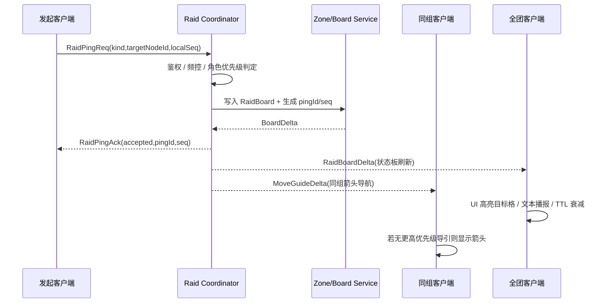
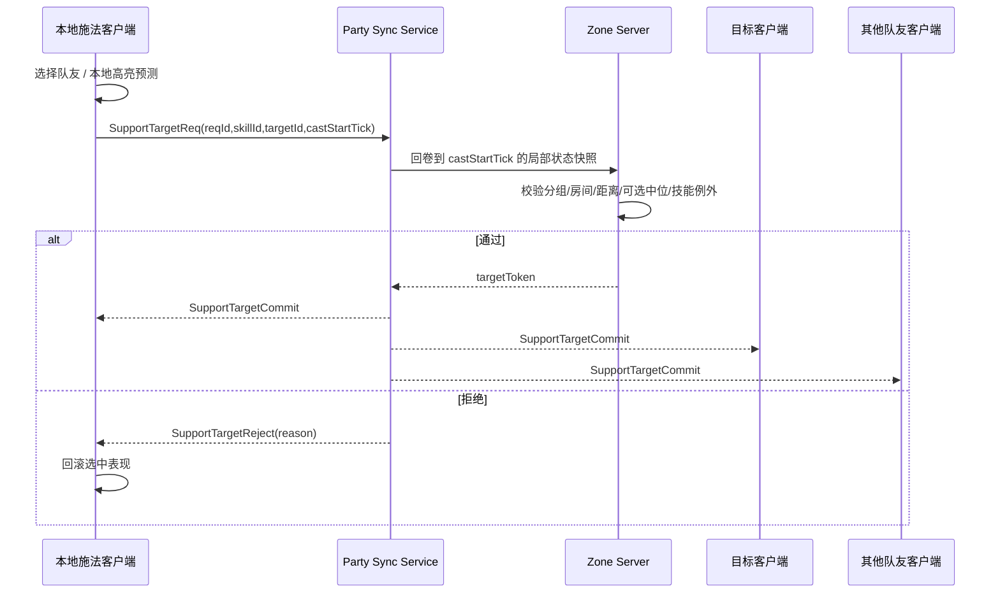
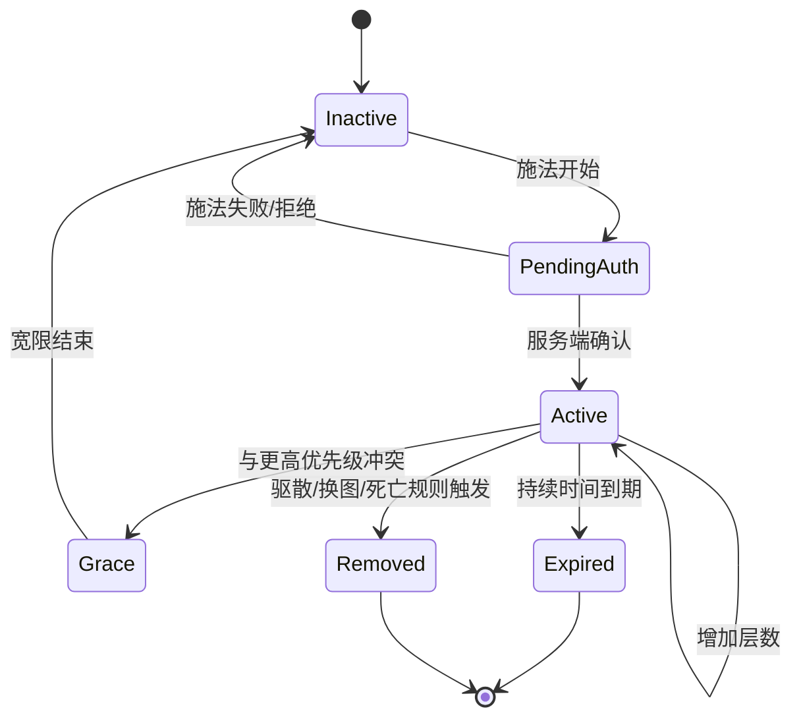
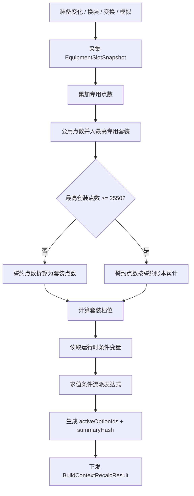
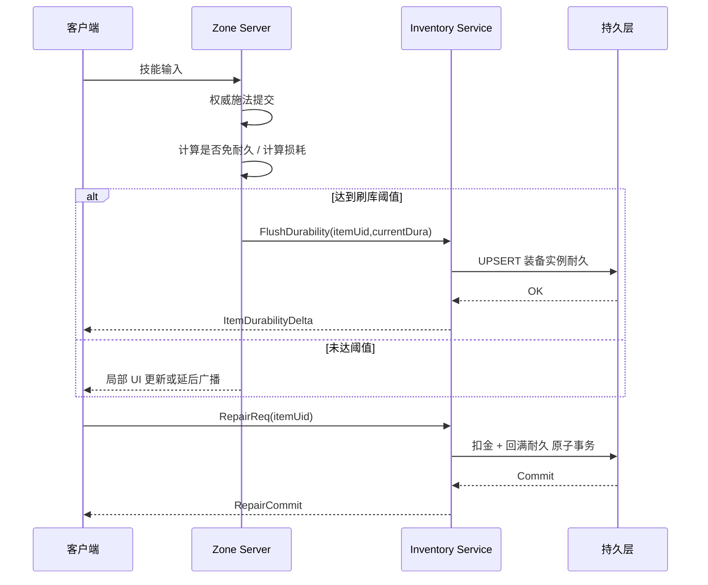
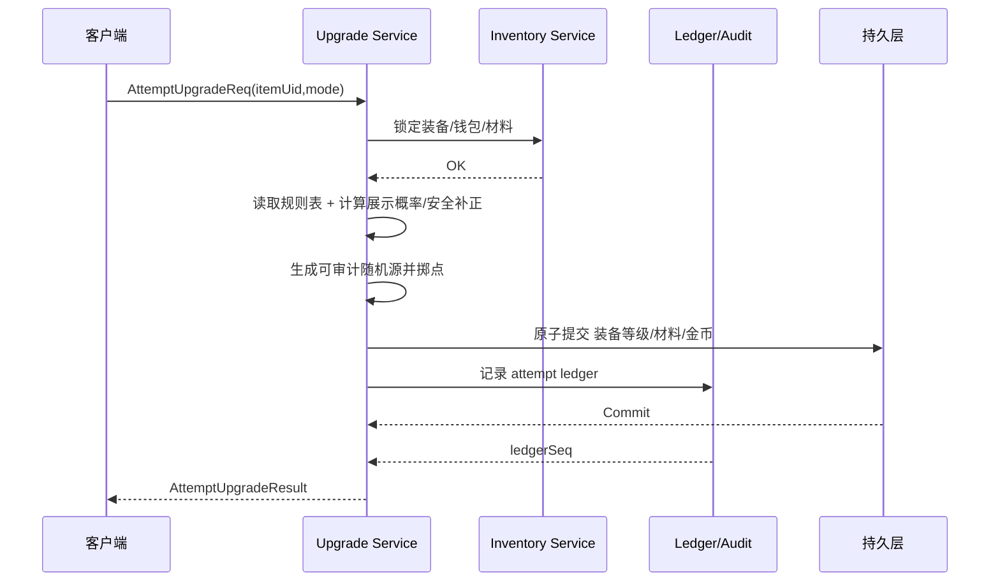

# DNF战斗系统复刻技术研究报告
> **Status: [EXTENSION] — Raid/party/buff/equipment 外围系统**

## 执行摘要

本报告的目标不是给出“猜测式玩法总结”，而是给出一份能够直接指导研发立项、服务拆分、协议设计、数据建模与联调验证的 clean-room 技术蓝图。结论先行：

1. **玩法行为层**：Raid 指挥 / Ping / 状态板、队伍支援、奶系 Buff、装备套装 / 套装点数 / 装备变换、耐久 / 修理、强化 / 增幅 / 锻造 / 附魔 / 继承，这些在公开资料里都有相当多可核实的一手行为证据，足以把“外在表现”做得很接近。citeturn35view3turn34view6turn34view3turn33view0turn32view4turn20view9turn26view0turn26view1turn34view0turn34view1

2. **字段级内部实现层**：真正的 opcode、二进制协议布局、服务端 tick、包分帧/合帧策略、随机种子播撒规则、Buff 冲突表、装备条件表达式执行顺序，公开资料覆盖远远不够。能做的是：把**官方可证实行为**和**网络/后端通用工程方法**拼成一套高置信、可实现、可压测、可回归的 clean-room 方案，而不能诚实地声称“已得到原始私有实现”。这一点在 Raid、成员同步、耐久损耗公式上尤其明显。citeturn34view5turn35view0turn34view8turn20view10

3. **网络同步建议**：如果目标是“体感像 DNF，而不是源码像 DNF”，推荐采用 **server-authoritative + client-side prediction + selective rollback + snapshot interpolation**。原因是：deterministic lockstep 更适合 2–4 人且要求高度确定性；更高玩家数和更复杂的非确定性演出更适合 snapshot/interpolation；对快节奏对战，rollback 在较高延迟下通常比纯 delay 更稳。citeturn39view1turn40view0turn13search6

4. **资料边界**：本报告**不使用、也不摘录**泄露客户端、私服源码、未授权抓包样本、反作弊规避方法或密钥常量；下文所有协议示例、接口、伪代码、状态机、时序图，均为可落地的 clean-room 设计。凡无法从公开资料中交叉确认的字段，一律标注 **“未找到/未公开”**。

| 模块 | 官方行为证据强度 | 字段/协议公开度 | 可直接进入研发的成熟度 |
|---|---:|---:|---:|
| Raid 指挥 / Ping / 状态板 | 高 | 低 | 高 |
| 队伍成员状态同步 / 支援目标 | 中 | 低 | 中高 |
| 奶系 / Buffer / Party Buff | 高 | 低 | 高 |
| 装备套装 / 流派 / 条件流派 | 高 | 中 | 高 |
| 耐久 / 修理 / 战斗损耗 | 中低 | 低 | 中 |
| 强化 / 增幅 / 锻造 / 附魔 / 继承 | 高 | 中高 | 高 |

## 研究边界、方法与术语

本报告的公开证据主要来自韩服 / 国际服 / 国服官网，以及 entity["company","Neople","game developer"] / entity["company","Nexon","game publisher"] 发布的指南、补丁说明、开发者说明；辅助证据来自社区整理与归档，其中概率公开部分大量依赖 DFOArchive 对 2021 韩国服概率披露的镜像整理；网络同步方法论则用 entity["company","Valve","game developer"] 的 client/server 滞后补偿文档、Glenn Fiedler 的 snapshot interpolation 文章以及 rollback 研究论文作约束。citeturn34view5turn35view3turn34view3turn33view0turn32view4turn26view0turn26view1turn30view0turn39view1turn40view0turn13search6

本报告采用以下工程前提，后文所有接口、时序、带宽估算都以此为默认前提：
**平台**为 PC；**服务端**为可扩展分布式架构；**战斗**采用分区房间式 Zone Server；**Raid** 由独立 Raid Coordinator 管控跨房间状态；**角色/背包/打造** 属于 Inventory & Progression Service；**消息总线** 用于 Redis-like Pub/Sub 或 Kafka-like event stream；**战斗帧率** 客户端 60 FPS，服务端逻辑 tick 建议 30 或 60 Hz；**网络** 为 server-authoritative，近身动作做本地预测，远端状态靠快照与插值恢复。后两项是工程建议，不是公开确认的 DNF 原实现。citeturn39view1turn40view0turn13search6

下面给出贯穿全文的三语术语对照。这里优先列出与后续六个模块直接相关、且在中文/英文/韩文资料里频繁出现的词：

| 中文 | English | 한국어 |
|---|---|---|
| 战场状态板 | Status Board | 상황판 |
| 团队指挥 / 攻坚队长 | Raid Commander | 공대장 |
| 团队 Ping | Party Ping | 공대 핑 |
| 智能 Ping | Smart Ping | 스마트핑 |
| 乱入 / 支援突入 | Intrusion | 난입 |
| 延迟监控 | Latency Monitoring | 핑 모니터링 |
| 增益强化 | Buff Enhancement | 버프 강화 |
| 偏爱 | Favoritism | 편애 |
| 强化 | Reinforcement | 강화 |
| 增幅 | Amplification | 증폭 |
| 锻造 / 再炼 | Refinement / Refine | 재련 |
| 附魔 | Enchanting | 마법부여 |
| 继承 | Inherit | 계승 |
| 装备变换 | Equipment Conversion | 장비 변환 |
| 套装点数 | Set Points | 세트 포인트 |
| 誓约点数 | Oath Points | 서약 포인트 |
| 耐久 | Durability | 내구도 |
| 修理 | Repair | 수리 |

为便于研发使用，后文每个模块都明确区分两类信息：
**官方可证实行为**：能直接从官站/补丁说明/指南确认。
**clean-room 实现建议**：为达到同等体感与调试可控性而给出的字段、逻辑、协议和算法；这些不是宣称“原样复刻”，而是为开发团队提供可实施的精确方案。

## Raid 指挥 / Ping / 战场状态板系统

**概要与目标**

公开资料可以清楚地拼出 Raid 指挥系统的演进路径：
韩服/国际服在 Prey-Isys 时期明确加入了**攻坚队长专用 Ping** 与 **Boss HP 告警阈值**；Sirocco 阶段把 **Status Board/상황판** 固化为 Raid 指挥 UI，允许指挥者选中地块发出 Party Ping，且只有队长能通过状态板执行进入/撤退；2020 年国际服又把指挥点位高亮与路线引导做进了状态板；2023 年国际服开发者说明确认，Bakal 时代已有 `//monitor` 监测队员 ping，但因为必须进本后才能看，官方又开始做**进本前延迟检查**；到 2025/2026 的 Inae Dusk War，Ping 进一步扩展为**全员可用的 Smart Ping**，每格最多 6 个、总共 3 种、3 秒 CD，且同组箭头引导存在“攻坚队长优先”规则。citeturn35view3turn34view6turn36view0turn34view5turn34view3turn34view4

这说明原系统至少有四个独立子层：
一是 **Raid 全局图状态层**；
二是 **事件型指挥消息层**；
三是 **同组导航显示层**；
四是 **延迟/连通性观察层**。
真正未公开的是：底层包格式、刷新频率、优先级队列与衰减逻辑。因此复刻时不应把它做成“聊天消息变色版”，而应做成**专门的 RaidControl 通道**，优先级高于普通队聊、低于战斗纠错与角色输入。citeturn35view0turn34view6turn34view5

**精确数据字段与示例**

建议把状态板拆成两个核心聚合：`RaidBoardSlot` 和 `RaidPingEvent`。

| 结构 | 字段 | 类型 | 说明 | 来源状态 |
|---|---|---:|---|---|
| RaidBoardSlot | raid_id | UUID | 攻坚战实例 ID | clean-room |
| RaidBoardSlot | phase_id | u16 | 阶段 | clean-room |
| RaidBoardSlot | node_id | u16 | 地块 / 房间 / Boss 位 ID | clean-room |
| RaidBoardSlot | node_type | enum | dungeon / boss / transit / base | clean-room |
| RaidBoardSlot | occupancy_mask | bitset | 哪个队/组正在占用 | clean-room |
| RaidBoardSlot | combat_state | enum | idle / combat / clear / fail / recovery | Sirocco 进入/撤退/恢复公开；内部枚举推断 |
| RaidBoardSlot | recovery_until_ms | u64 | 撤退后恢复结束时间 | Sirocco 15 秒公开；字段推断 |
| RaidBoardSlot | hp_alert_threshold_pct | u8 | Boss HP 警报线 | Prey-Isys 公开有 HP 告警系统；字段推断 |
| RaidBoardSlot | latest_ping_id | u32 | 最近一个有效 Ping | clean-room |
| RaidBoardSlot | danger_level | enum | none / danger / move / intrusion | Inae Smart Ping 公开；字段推断 |
| RaidBoardSlot | updated_at_ms | u64 | 最近更新时间 | clean-room |

| 结构 | 字段 | 类型 | 说明 | 来源状态 |
|---|---|---:|---|---|
| RaidPingEvent | ping_id | u32 | 单调递增 event id | clean-room |
| RaidPingEvent | sender_char_id | u64 | 发起角色 | clean-room |
| RaidPingEvent | sender_role | enum | commander / party_leader / member | 官方行为可证实 |
| RaidPingEvent | scope | enum | raid / group / party | Smart Ping 同组箭头可证实；scope 结构推断 |
| RaidPingEvent | kind | enum | danger / move / intrusion / boss_hp | 官方行为可证实 |
| RaidPingEvent | target_node_id | u16 | 目标格/房间 | 官方 UI 行为可证实 |
| RaidPingEvent | group_color | enum | red / yellow / green / none | Prey-Isys 公开号令按队色发送 |
| RaidPingEvent | ttl_ms | u16 | 显示存活时间 | 未公开，建议 3000–8000 |
| RaidPingEvent | priority | u8 | 指挥优先级 | “攻坚队长优先”公开；数值未公开 |
| RaidPingEvent | seq | u32 | 广播序列号 | clean-room |

**示例数据**

```json
{
  "raid_id": "8d3d4df5-1f6a-4d89-9ea7-38ef134d1d9b",
  "phase_id": 1,
  "node_id": 17,
  "node_type": "boss",
  "occupancy_mask": "0b00000110",
  "combat_state": "combat",
  "recovery_until_ms": 0,
  "hp_alert_threshold_pct": 30,
  "latest_ping_id": 91273,
  "danger_level": "intrusion",
  "updated_at_ms": 1777610045123
}
```

**网络协议 / 消息示例**

由于公开资料没有给出实际 opcode、二进制布局与压缩方式，下述消息**只给 JSON/IDL 级 clean-room 示例**；实际 DNF 私有包格式标为 **未找到/未公开**。

```ts
interface RaidPingReq {
  raidId: string;
  senderCharId: string;
  senderRole: "commander" | "party_leader" | "member";
  kind: "danger" | "move" | "intrusion";
  targetNodeId: number;
  clientTimeMs: number;
  localSeq: number;
}

interface RaidPingAck {
  raidId: string;
  pingId: number;
  accepted: boolean;
  rejectReason?: "RATE_LIMIT" | "UNAUTHORIZED" | "STALE_NODE";
  authoritativeSeq: number;
}

interface RaidBoardDelta {
  raidId: string;
  seq: number;
  changedSlots: RaidBoardSlot[];
  pingEvents: RaidPingEvent[];
}
```

```json
{
  "type": "RaidBoardDelta",
  "raidId": "8d3d4df5-1f6a-4d89-9ea7-38ef134d1d9b",
  "seq": 10482,
  "changedSlots": [
    {
      "nodeId": 17,
      "combatState": "combat",
      "latestPingId": 91273,
      "dangerLevel": "intrusion"
    }
  ],
  "pingEvents": [
    {
      "pingId": 91273,
      "senderCharId": "2718843001",
      "senderRole": "commander",
      "scope": "raid",
      "kind": "move",
      "targetNodeId": 17,
      "groupColor": "red",
      "ttlMs": 5000,
      "priority": 250
    }
  ]
}
```

**关键算法伪代码**

```pseudo
function handleRaidPing(req):
    now = serverTimeMs()

    if not isInRaid(req.senderCharId, req.raidId):
        return reject("UNAUTHORIZED")

    if isRateLimited(req.senderCharId, req.kind, now):
        return reject("RATE_LIMIT")

    senderRole = resolveRaidRole(req.senderCharId)
    if req.kind == "boss_hp" and senderRole != COMMANDER:
        return reject("UNAUTHORIZED")

    node = raidBoard.getNode(req.targetNodeId)
    if node == null:
        return reject("STALE_NODE")

    priority = calcPriority(senderRole, req.kind)
    ttlMs = selectTTL(req.kind, senderRole)   // smart ping 建议 3000, commander 5000~8000

    ping = RaidPingEvent(
        pingId = raidBoard.nextPingId(),
        senderCharId = req.senderCharId,
        senderRole = senderRole,
        scope = resolveScope(req.kind, senderRole),
        kind = req.kind,
        targetNodeId = req.targetNodeId,
        groupColor = resolveGroupColor(req.senderCharId),
        ttlMs = ttlMs,
        priority = priority,
        seq = raidBoard.nextSeq()
    )

    raidBoard.attachPing(node.nodeId, ping)
    raidBoard.bumpNodeDanger(node.nodeId, ping.kind)

    publishToRaidShard( RaidBoardDelta.from(node, ping) )

    return ack(ping.pingId, ping.seq)


function renderPingGuidance(client, ping):
    if ping.kind != "move":
        return

    if ping.senderRole == COMMANDER:
        showArrowGuide(ping.targetNodeId, priority = HIGH)
    else if sameGroup(client.charId, ping.senderCharId):
        if noCommanderGuideActive():
            showArrowGuide(ping.targetNodeId, priority = NORMAL)
```

**时序图**



**服务端与客户端职责划分**

服务端必须持有**唯一真相**：谁有权发什么 Ping、哪个节点当前处于什么状态、撤退后的恢复判定、Boss HP 何时跨过告警阈值。客户端只负责本地呈现、淡入淡出、音效、路径箭头动画以及“同组显示 vs 全团显示”的 UI 展开。尤其要避免让客户端自己决定“这个 Ping 是否覆盖队长 Ping”；官方规则已经明确攻坚队长引导优先，因此优先级归并应由服务端或权威的 Raid Coordinator 一次性生成。citeturn34view3turn35view0turn36view0

**性能、带宽与延迟估算**

在 8 人 Raid 里，建议状态板采用 **2–4 Hz delta snapshot**，Ping/HP 告警为事件广播。以每次 `RaidBoardDelta` 120–220B、PingEvent 48–96B 粗算，平时每客户端下行大约 **2–8 KB/s**；大战略切换瞬间（多个槽位同时变化）峰值也通常低于 **20 KB/s**。
延迟目标建议如下：
- 指挥 Ping：P95 可视确认 < 150ms
- 状态板刷新：P95 < 250ms
- 同组箭头导引：P95 < 120ms
- 进本前延迟检查 UI：1 Hz 足够
这些数值不是官方公开值，而是按官方交互模式与一般实时内容 UX 下限倒推的工程指标。citeturn34view5turn34view3turn34view4

**已知变种 / 历史差异与参考来源**

已知变种非常清楚：
Prey-Isys 是**队长专用** Ping + Boss HP 告警；Sirocco 把状态板中的进入/撤退与 Party Ping 绑定到 Raid Board；2020 国际服补上了“所选 Ping 点高亮”和 Slenikon 近点位时的导引标记；Bakal 时期官方又补做延迟监控可视化；Inae 则把 Ping 放权给全员，并加入“乱入需求”这一新的战术语义。若要复刻“现在玩家以为的 DNF 指挥系统”，实现上应该以 **Inae 的全员 Smart Ping + 队长优先 + Status Board 全局图** 为上层规范，同时保留“旧 Raid 用队长专用 Ping”的兼容开关。citeturn35view3turn34view6turn36view0turn34view5turn34view3turn20view6

## 队伍成员状态同步与支援技能目标系统

**概要与目标**

公开资料没有直接披露 DNF 的“成员同步协议”，但暴露了足够多的行为边界：
其一，存在显式的**队友选择窗口**，国服 2023 职业平衡说明明确写出：组队时施放技能出现队友选择窗口，按跳跃键可取消。其二，某些支援技能有明确的**目标范围门槛**，例如 Divine Flash 的队友目标指定范围从 900px 提到 1200px；Sign of Protection 则从“受伤会解除”改为“不因队友承伤而解除”。其三，系统在 UI 上会把若干关键 Party Member Buff 直接显示在施法者状态图标上。其四，到 Inae Dusk War，“乱入/支援突入”已经从单纯路径切换演化为可以跨当前战斗做局部支援的系统。citeturn19search1turn33view2turn32view1turn20view6turn33view0

这意味着成员同步最少要分成三层：
**战斗实体状态层**（位置、HP、死亡、可目标化）；
**队伍展示层**（Buff Presence、状态图标、支援请求）；
**支援目标授权层**（同队/同组/同房间、距离、可见性、技能特例）。
实际 DNF 是否使用全面 rollback 未公开，所以此处不应声称“原作就是回滚”；但如果目标是把支援技、救援、指定施法做出低延迟又低错判，建议采用**局部回滚**：只对“目标选择瞬间”的位置、分组、目标可用位做重建，而不是对整场房间做 GGPO 式全量回滚。这样的做法更贴合 DNF 的分房间、2D 房间式战斗结构。citeturn33view2turn20view6turn39view1turn40view0

**精确数据字段与示例**

| 结构 | 字段 | 类型 | 说明 | 来源状态 |
|---|---|---:|---|---|
| PartyMemberStateDelta | char_id | u64 | 角色 ID | clean-room |
| PartyMemberStateDelta | room_id | u16 | 当前房间 / 地图格 | clean-room |
| PartyMemberStateDelta | x_px / y_px | i16 | 位置 | clean-room |
| PartyMemberStateDelta | dir | i8 | 朝向 | clean-room |
| PartyMemberStateDelta | hp_cur / hp_max | u32 | 当前/最大 HP | 清晰外显 |
| PartyMemberStateDelta | shield_cur | u32 | 护盾 | clean-room |
| PartyMemberStateDelta | alive / downed | bool | 存活 / 倒地 | clean-room |
| PartyMemberStateDelta | invuln_bits | bitmask | 无敌 / 超级护甲 / 保护态 | clean-room |
| PartyMemberStateDelta | buff_presence_crc | u16 | 队伍头像层状态摘要 | `status icon` 行为公开；字段推断 |
| PartyMemberStateDelta | targetable_mask | bitmask | 是否可被支援技锁定 | clean-room |
| PartyMemberStateDelta | group_id / party_id | u8 | 小队/大组 | Raid 规则公开；字段推断 |
| PartyMemberStateDelta | ping_bucket | u8 | 延迟档位 | Latency monitoring 行为公开；字段推断 |
| PartyMemberStateDelta | seq / tick | u32 | 权威序号 | clean-room |

| 结构 | 字段 | 类型 | 说明 | 来源状态 |
|---|---|---:|---|---|
| SupportTargetReq | req_id | u32 | 请求 ID | clean-room |
| SupportTargetReq | caster_id | u64 | 施法者 | clean-room |
| SupportTargetReq | skill_id | u16 | 技能 | clean-room |
| SupportTargetReq | preferred_target_id | u64 | 客户端选中的目标 | 队友选择窗口公开 |
| SupportTargetReq | cast_start_tick | u32 | 施法起点权威帧 | clean-room |
| SupportTargetReq | same_group_only | bool | 限同组 | Inae Buff 规则公开；字段推断 |
| SupportTargetReq | same_room_only | bool | 限同房间 | clean-room |
| SupportTargetReq | range_px | u16 | 生效距离 | Divine Flash 范围公开 |
| SupportTargetReq | los_required | bool | 是否需要 LOS | 未公开 |
| SupportTargetReq | target_token | u64 | 服务端发放的目标授权票据 | clean-room |

**示例数据**

```json
{
  "charId": "2718843001",
  "roomId": 17,
  "xPx": 842,
  "yPx": 316,
  "hpCur": 923451,
  "hpMax": 1200000,
  "shieldCur": 120000,
  "alive": true,
  "downed": false,
  "buffPresenceCrc": 41721,
  "targetableMask": 77,
  "groupId": 1,
  "partyId": 0,
  "pingBucket": 2,
  "seq": 448102,
  "tick": 831228
}
```

**网络协议 / 消息示例**

```ts
interface PartyStateDelta {
  raidId?: string;
  partyId: number;
  tick: number;
  members: PartyMemberStateDelta[];
}

interface SupportTargetReq {
  reqId: number;
  casterId: string;
  skillId: number;
  preferredTargetId: string;
  castStartTick: number;
  clientSeq: number;
}

interface SupportTargetCommit {
  reqId: number;
  casterId: string;
  targetId: string;
  targetToken: string;
  authoritativeCastTick: number;
  expireTick: number;
}
```

```json
{
  "type": "SupportTargetCommit",
  "reqId": 9912,
  "casterId": "2718843001",
  "targetId": "2718843004",
  "targetToken": "f6e9db07-31ee-4afd-9478-42074f9d8a6f",
  "authoritativeCastTick": 831240,
  "expireTick": 831270
}
```

**关键算法伪代码**

```pseudo
function authorizeSupportTarget(req):
    caster = getActor(req.casterId)
    skill  = getSkillDef(req.skillId)

    if caster == null or skill == null:
        return reject("INVALID")

    // 局部回滚：回到施法开始帧重建目标选择瞬间
    snapshot = rewindPartyState(req.castStartTick, windowFrames = 8)

    target = snapshot.findActor(req.preferredTargetId)
    if target == null:
        return reject("NO_TARGET")

    if skill.sameGroupOnly and caster.groupId != target.groupId:
        return reject("WRONG_GROUP")

    if skill.sameRoomOnly and caster.roomId != target.roomId:
        return reject("WRONG_ROOM")

    if not target.isTargetableFor(skill):
        return reject("UNTARGETABLE")

    if distancePx(caster.pos, target.pos) > skill.rangePx:
        return reject("OUT_OF_RANGE")

    if skill.requiresLOS and not hasLineOfSight(caster, target):
        return reject("BLOCKED")

    token = mintTargetToken(req, caster, target)
    multicastParty(
        SupportTargetCommit(
            reqId = req.reqId,
            casterId = caster.id,
            targetId = target.id,
            targetToken = token,
            authoritativeCastTick = currentTick(),
            expireTick = currentTick() + skill.targetLockFrames
        )
    )

    return accept(token)


function clientPredictSupportLock(req):
    showLocalLockFx(req.preferredTargetId)
    markPending(req.reqId)

on SupportTargetCommit(msg):
    clearPending(msg.reqId)
    bindSkillToTarget(msg.targetToken, msg.targetId)

on SupportReject(msg):
    rollbackLocalTargetFx(msg.reqId)
```

**时序图**



**服务端与客户端职责划分**

客户端可以做三件事：
一是队友头像与地面实体的本地高亮；
二是对“本技能大概率会锁到该目标”的乐观预测；
三是当授权失败时做轻量回滚。
服务端必须独占四件事：
一是目标合法性；
二是目标锁定票据生成；
三是跨房间/跨组例外技能的权限模型；
四是最终技能是否真正生效。
凡是影响“能不能给到 Buff / 盾 / 复活 / 伤害分摊”的判定，都必须服务端裁决。公开资料已经说明一些技能曾经因为目标范围过小或伤害导致 Buff 消失而被改版，因此这些都不能交给客户端自己算。citeturn33view2turn32view1

**性能、带宽与延迟估算**

推荐把**成员状态同步**和**队伍头像状态同步**分离。
- 近身战斗状态：15–20 Hz delta
- 队伍头像/状态图标摘要：4–10 Hz delta
- 支援目标授权：事件型 RPC
按 4 人队伍、每人 40–80B 状态增量估算，下行大约 **8–20 KB/s/客户端**；支援技授权消息通常几十字节到百余字节，几乎可忽略。
局部回滚缓存开销很低：按 4 人、每帧 128B、回退 8 帧计算，单队只要约 **4 KB** 热内存。
延迟预算建议：
- 目标窗选中反馈：本地立即
- 服务端授权确认：P95 < 120ms
- 授权失败回滚可见抖动：< 1 次关键施法 / 分钟
这些都是工程目标，不是已公开原数值。citeturn39view1turn40view0

**已知变种 / 历史差异与参考来源**

已知历史差异有三条最关键：
第一，目标窗交互明显持续存在，且国服明确给了“跳跃键取消队友选择窗口”的 UX；
第二，支援类技能并不是静态不变的，例如 Divine Flash 的可选中范围从 900px 提到 1200px，Sign of Protection 也改成不会因队友承伤而解除；
第三，Inae 把“支援”从技能层扩展成内容层的“乱入”。
因此，研发实现时不应把“技能目标选择”和“Raid 支援突入”分成完全无关的系统；两者应该至少共享：目标合法性、组/房间授权与队伍状态摘要。citeturn19search1turn33view2turn20view6turn33view0

## 奶系 / Buffer / Party Buff 系统

**概要与目标**

公开资料对 Buff 系统的“外层行为”披露其实相当充分。
官方已经长期提供 **Buff Enhancement/增益强化** 系统，允许把称号、稀有时装上/下装、白金徽章、宠物与特定装备用到 Buff 强化窗里；2025 年韩服进一步明确：普通深渊之鳞不再需要、Buffer 转职不使用“浓厚深渊之鳞”路径；同一时期还加入了**入场自动施放 Buff 强化技能**，但明确排除了 Buffer，因为官方认为“给队友上 Buff 是 Buffer 的核心玩法”；同时又规定这一自动触发不消耗武器耐久与 MP，且在复活/Phase 变更时会再次自动施放。citeturn34view9turn20view7turn34view8

Buffer 战斗侧的规则则在两份来源里能拼得很完整：
社区高质量实战指南指出，Buffer 主体增益“축”通常是 **300 秒持续**；官方 2026 的“Buff Score”又明确说明，Buff 分数按 DNF 现行加算/乘算 Buff 公式计算，并把 Enchantress 的“偏爱/편애”按 4 人队平均值折算；而 Inae Dusk War 的开发者说明则进一步明确：**伤害型 Buff 只作用于自己的组**，但治疗、护盾、复活等可以作用于同一地下城中的所有人；若输出职业与本组 Buffer 分离导致伤害 Buff 结束，系统会给一个“临时系统 Buff”兜底。citeturn37view5turn32view2turn33view0

**精确数据字段与示例**

| 结构 | 字段 | 类型 | 说明 | 来源状态 |
|---|---|---:|---|---|
| BuffDef | buff_id | u32 | Buff 定义 ID | clean-room |
| BuffDef | source_kind | enum | skill / item / set / system / area | 官方多来源行为可证实 |
| BuffDef | category | enum | main_dmg / awakening / speed / shield / heal / revive / fallback | 行为可证实；分类推断 |
| BuffDef | conflict_key | string | 覆盖/冲突分组键 | clean-room |
| BuffDef | scope | enum | self / party / group / dungeon | Inae 规则公开 |
| BuffDef | duration_ms | u32 | 持续时间 | 主 Buff 300s 为社区二手；不少技能细节官方可证实 |
| BuffDef | tick_period_ms | u16 | 周期效果 Tick | 未公开 |
| BuffDef | stack_rule | enum | refresh / overlap / highest_only / add_stack | 未公开 |
| BuffDef | persist_on_death | bool | 死亡是否保留 | clean-room |
| BuffDef | snapshot_policy | enum | snapshot / dynamic_eval | clean-room |
| BuffDef | formula_id | u16 | 加算/乘算公式引用 | Buff Score 公式行为公开；内部 ID 推断 |

| 结构 | 字段 | 类型 | 说明 | 来源状态 |
|---|---|---:|---|---|
| BuffInstance | inst_id | u64 | 实例 ID | clean-room |
| BuffInstance | buff_id | u32 | Buff 定义 | clean-room |
| BuffInstance | source_actor_id | u64 | 施加者 | clean-room |
| BuffInstance | target_scope_id | u64 | 目标角色/队/组 | clean-room |
| BuffInstance | applied_tick | u32 | 生效帧 | clean-room |
| BuffInstance | expire_tick | u32 | 结束帧 | clean-room |
| BuffInstance | stacks | u8 | 层数 | clean-room |
| BuffInstance | snapshot_mag | i64 | 快照值 | clean-room |
| BuffInstance | ui_icon_id | u16 | 图标 | Party Buff icon 行为公开 |
| BuffInstance | aux_flags | bitmask | 偏爱、觉醒、系统兜底等 | Enchantress 偏爱 / Fallback Buff 行为公开 |

**示例数据**

```json
{
  "buffId": 12031,
  "sourceKind": "skill",
  "category": "main_dmg",
  "conflictKey": "buffer.main.partydmg",
  "scope": "group",
  "durationMs": 300000,
  "tickPeriodMs": 0,
  "stackRule": "highest_only",
  "persistOnDeath": false,
  "snapshotPolicy": "snapshot",
  "formulaId": 17
}
```

**网络协议 / 消息示例**

```ts
interface BuffApply {
  instId: string;
  buffId: number;
  sourceActorId: string;
  targetScope: "actor" | "party" | "group";
  targetId: string;
  appliedTick: number;
  expireTick: number;
  stacks: number;
  snapshotMag?: string;
}

interface BuffRefresh {
  instId: string;
  newExpireTick: number;
  newStacks?: number;
}

interface BuffRemove {
  instId: string;
  reason: "EXPIRE" | "OVERRIDE" | "DISPEL" | "ZONE_END";
}
```

```json
{
  "type": "BuffApply",
  "instId": "77f7d3a1-df47-443c-8480-9af3d6e17d7b",
  "buffId": 12031,
  "sourceActorId": "2718843010",
  "targetScope": "group",
  "targetId": "raid-group-1",
  "appliedTick": 830100,
  "expireTick": 848100,
  "stacks": 1,
  "snapshotMag": "168350"
}
```

**关键算法伪代码**

```pseudo
function applyBuff(buffDef, source, targets):
    for target in targets:
        domain = (target.id, buffDef.conflictKey)

        existing = activeBuffs.find(domain)

        if existing == null:
            inst = createInstance(buffDef, source, target)
            activeBuffs.add(inst)
            emit(BuffApply(inst))
            continue

        switch buffDef.stackRule:
            case REFRESH:
                existing.expireTick = nowTick() + buffDef.durationTicks
                emit(BuffRefresh(existing))
            case HIGHEST_ONLY:
                if calcPriority(buffDef, source) > calcPriority(existing.def, existing.source):
                    old = existing
                    remove(old, reason="OVERRIDE")
                    inst = createInstance(buffDef, source, target)
                    activeBuffs.add(inst)
                    emit(BuffApply(inst))
                else:
                    existing.expireTick = max(existing.expireTick, nowTick() + graceRefreshTicks(buffDef))
                    emit(BuffRefresh(existing))
            case ADD_STACK:
                existing.stacks = min(existing.stacks + 1, buffDef.maxStacks)
                existing.expireTick = nowTick() + buffDef.durationTicks
                emit(BuffRefresh(existing))
            case OVERLAP:
                inst = createInstance(buffDef, source, target)
                activeBuffs.add(inst)
                emit(BuffApply(inst))

    recomputeAggregates()


function recomputeAggregates():
    grouped = groupByTarget(activeBuffs)

    for target in grouped:
        additive = 0
        multiplicative = 1.0
        shieldPool = 0
        hotList = []
        fallback = null

        for inst in grouped[target]:
            effect = evalFormula(inst)
            mergeToAccumulators(effect)

        target.finalBuffState = pack(additive, multiplicative, shieldPool, hotList, fallback)
        emit(TargetBuffSummaryDelta(target.finalBuffState))
```

**时序图**



**服务端与客户端职责划分**

服务端必须负责：
- Buff 定义表、冲突表与加算/乘算求值；
- 施法授权后谁得到 Buff，按 actor / party / group / dungeon 哪个作用域发放；
- 过期、刷新、覆盖、驱散；
- 头像摘要、血条图标、队伍头像图标所需的**压缩态**。

客户端负责：
- 播放 Buff 施法演出；
- 渲染图标和剩余时间；
- 做“快照已到 / 快照未到”的平滑显示；
- 对服务器下发的 `TargetBuffSummaryDelta` 做本地伤害面板与辅助提示更新。

公开资料已经表明“Party Member Buff effect”会显示在施法者状态图标上，因此建议单独做一个**UI 摘要层**，不要让客户端每次都从完整 Buff 栈实时推导头像摘要。citeturn32view1turn32view2turn33view0

**性能、带宽与延迟估算**

Buff 不应该按帧广播。
推荐策略是：
- Add / Remove / Override / Refresh：事件型
- HOT/DOT/周期护盾：250ms 或 500ms 桶聚合
- 队伍头像摘要：4–8 Hz
- 完整 Buff 栈：只发有变化的增量
在 4 人队伍下，即使主 Buff、觉醒 Buff、护盾、回血和若干装备增益同时存在，正常下行也通常只有 **1–4 KB/s/客户端**。最怕的不是带宽，而是**Buff 求值错误导致的伤害面板、辅助面板和实际判定偏离**，所以建议把公式层做成可审计版本化解释器。公开官方已经说明 Buff Score 采用实际游戏里的加算/乘算公式，这意味着你们的实现也必须版本化，而不能把数值逻辑散落在各技能脚本里。citeturn32view2

**已知变种 / 历史差异与参考来源**

可观测差异至少有四类：
第一，Buff Enhancement 自 2017 以后一直在存在，但 2025 明确改了装备登记规则；
第二，2025 的入场自动 Buff 只给 DPS，不给 Buffer，且特判 Male Crusader with Holy Ghost Mace；
第三，2026 的 Buff Score 把 Enchantress 偏爱按 4 人队平均折算；
第四，Inae 为了 1–5 人房间混合战斗，重新定义了“伤害 Buff 仅同组，治疗/护盾/复活同地下城全员”。
因此，复刻时强烈建议把 Buff 系统拆成：**功能 Buff**、**显示 Buff**、**组作用域 Buff**、**内容专属兜底 Buff** 四个表，而不是单一 `buff_type` 枚举。citeturn18search0turn34view9turn20view7turn32view2turn33view0

## 装备套装 / 流派构筑 / 条件流派系统

**概要与目标**

这部分是目前公开资料最适合做“字段级复刻”的模块之一。
韩服 2025 年明确引入了 **Set Point/세트 포인트** 体系：总共 12 套，装备分为专用点数与公用点数，公用点数会并入当前专用点数最高的那一套；当同套点数累积到阈值，套装效果激活并强化。随后 2026 年又引入 **Oath/서약**：在装备套装点数到 2550 之前，额外获得的 Oath Point 会先折算成通用 Set Point；到 2550 之后才累计到 Oath Point，并在一定阈值启用 Oath Buff 和额外套装选项。国际服 Equipment Simulator 还明确说明：模拟换装时，会沿用原装备上的 Reinforcement / Amplification / Refinement / Enchantment / Fusion Stone。与此同时，Armory 的 Equipment Conversion 又明确说：115 装备变换时这些打造值会保留，同部位同稀有度保留 tuning，不同稀有度返还 tuning 消耗灵魂。citeturn32view4turn32view3turn32view5turn37view1

这意味着“流派系统”在实现上至少不是简单的“穿几件套触发”；它是一个由以下因素共同构成的上下文求值器：
- 当前装备槽快照
- 套装点数账本
- 誓约点数账本
- 条件表达式上下文（HP、状态、属强、移动速度、防御、异常、冷却档位等）
- 打造继承后的有效属性
- 显示层（当前生效什么、下一档差多少、模拟器怎么呈现）
换句话说，研发上应该把它实现成**增量重算的 Build Context Engine**，而不是把每件装备的 if-else 写进客户端 tooltip 和服务端脚本各一份。citeturn32view4turn32view3turn32view5

**精确数据字段与示例**

| 结构 | 字段 | 类型 | 说明 | 来源状态 |
|---|---|---:|---|---|
| EquipmentSlotSnapshot | slot | enum | 装备部位 | clean-room |
| EquipmentSlotSnapshot | item_uid | u64 | 实例 ID | clean-room |
| EquipmentSlotSnapshot | proto_id | u32 | 物品模板 | clean-room |
| EquipmentSlotSnapshot | rarity | enum | Rare/Unique/Legendary/Epic/Primeval | 官方可证实 |
| EquipmentSlotSnapshot | set_id | u16 | 套装 ID | 官方可证实 |
| EquipmentSlotSnapshot | set_point_dedicated | u16 | 专用点数 | 官方可证实 |
| EquipmentSlotSnapshot | set_point_common | u16 | 通用点数 | 官方可证实 |
| EquipmentSlotSnapshot | oath_id | u16 | 誓约 ID | 官方可证实 |
| EquipmentSlotSnapshot | oath_point | u16 | 誓约点数 | 官方可证实 |
| EquipmentSlotSnapshot | reinforce/amplify/refine | u8 | 打造值 | 模拟器/变换公开 |
| EquipmentSlotSnapshot | enchant_ids | array<u32> | 附魔 | 模拟器/变换公开 |
| EquipmentSlotSnapshot | fusion_id | u32 | 融合石 | 模拟器/变换公开 |
| EquipmentSlotSnapshot | tradable | bool | 是否可交易 | 变换/继承规则相关 |

| 结构 | 字段 | 类型 | 说明 | 来源状态 |
|---|---|---:|---|---|
| BuildContext | highest_dedicated_set_id | u16 | 当前专用点数最高套装 | 公用点数并入规则推断 |
| BuildContext | set_point_map | map<u16,u16> | 每套总点数 | 官方可证实 |
| BuildContext | oath_point_map | map<u16,u16> | 每誓约总点数 | 官方可证实 |
| BuildContext | active_set_stage | map<u16,u8> | 当前生效档位 | 官方可证实 |
| BuildContext | active_oath_stage | map<u16,u8> | 当前誓约档位 | 官方可证实 |
| BuildContext | condition_vars | kv | HP%、属强和、异常数、防御和等 | 条件流派需要；未公开 |
| BuildContext | active_option_ids | array<u32> | 最终生效选项 | clean-room |
| BuildContext | summary_hash | u64 | 客户端快速校验摘要 | clean-room |

**示例数据**

```json
{
  "highestDedicatedSetId": 4,
  "setPointMap": {
    "4": 2280,
    "7": 240,
    "12": 160
  },
  "oathPointMap": {
    "4": 825
  },
  "activeSetStage": {
    "4": 3
  },
  "activeOathStage": {
    "4": 1
  },
  "conditionVars": {
    "hpRate": 0.84,
    "abnormalCountOnTarget": 2,
    "allElementSum": 910,
    "moveSpeedPct": 66
  },
  "activeOptionIds": [204011, 204109, 701224],
  "summaryHash": "128910661223"
}
```

**网络协议 / 消息示例**

```ts
interface EquipContextChanged {
  charId: string;
  revision: number;
  changedSlots: EquipmentSlotSnapshot[];
}

interface BuildContextRecalcResult {
  charId: string;
  revision: number;
  setPointMap: Record<number, number>;
  oathPointMap: Record<number, number>;
  activeOptionIds: number[];
  summaryHash: string;
}
```

```json
{
  "type": "BuildContextRecalcResult",
  "charId": "2718843001",
  "revision": 512,
  "setPointMap": { "4": 2280, "7": 240 },
  "oathPointMap": { "4": 825 },
  "activeOptionIds": [204011, 204109, 701224],
  "summaryHash": "128910661223"
}
```

**关键算法伪代码**

```pseudo
function rebuildBuildContext(equipmentSlots, runtimeVars):
    ctx = BuildContext()

    // 统计专用/公用点数
    for slot in equipmentSlots:
        if slot.set_id != 0:
            ctx.setPointMap[slot.set_id] += slot.set_point_dedicated
            ctx.commonPointPool += slot.set_point_common

        if slot.oath_id != 0:
            ctx.oathPointMap[slot.oath_id] += slot.oath_point

    ctx.highestDedicatedSetId = argmax(ctx.setPointMap)

    if ctx.highestDedicatedSetId != null:
        ctx.setPointMap[ctx.highestDedicatedSetId] += ctx.commonPointPool

    // 2026 誓约规则
    if ctx.setPointMap[ctx.highestDedicatedSetId] < 2550:
        ctx.setPointMap[ctx.highestDedicatedSetId] += sum(ctx.oathPointMap[*])
        clear(ctx.oathPointMap)
    else:
        mergeSharedOathPoint(ctx)

    ctx.conditionVars = runtimeVars

    // 计算套装档位
    for setId, points in ctx.setPointMap:
        ctx.activeSetStage[setId] = evalSetStage(points)

    for oathId, points in ctx.oathPointMap:
        ctx.activeOathStage[oathId] = evalOathStage(points)

    // 条件流派
    for option in allOptionDefsReferencedByEquips(equipmentSlots):
        if evalOptionCondition(option.expr, ctx.conditionVars):
            ctx.activeOptionIds.append(option.id)

    ctx.summaryHash = hash(ctx.activeSetStage, ctx.activeOathStage, ctx.activeOptionIds)
    return ctx
```

**时序图**



**服务端与客户端职责划分**

服务端负责：
- Set/Oath 点数累加；
- 公用点数归并；
- 条件表达式求值；
- 生成最终生效选项。

客户端负责：
- Tooltip/F8 展示；
- “当前档位 / 下一档位差多少” 的 UI；
- 装备模拟器里基于服务端回传上下文做对比展示。

国际服模拟器与变换系统已经给出强烈信号：打造值、附魔、融合石并不是装备模板本身的一部分，而是**装备实例上下文的一部分**；因此 `BuildContext` 应当吃的是“装备实例快照”，不是简单的模板列表。citeturn32view5turn37view1

**性能、带宽与延迟估算**

这个模块不是高频同步模块。典型触发点只有：登录、进图、换装、继承、装备变换、套装模拟、条件变量跨阈值变化。
建议：
- 装备/打造变化：事件触发重算
- 运行时条件流派：仅在跨阈值时重算，而不是每帧
- `summaryHash`：用于客户端发现自身展示状态与服务端权威状态的偏差
在正常战斗里，这个模块的带宽几乎可以忽略，瓶颈在于**可维护性**，不是吞吐量。一个编译后的条件表达式解释器，在 11 个装备槽 + 若干融合/誓约项目的规模下，单次重算做到 **< 1ms** 完全现实。

**已知变种 / 历史差异与参考来源**

历史差异可概括为三代：
- 旧时代以件数/套数为主；
- 115 时代以 **Set Point** 为主，并允许 Armory/Equipment Simulator 带着打造值做模拟和变换；
- 2026 又在 2550 点之后叠加 **Oath Point** 与 Oath 专属选项。
因此，如果你是要做“当前版本风格相似”的 DNF-like 系统，不应复刻旧式 `2 件/3 件/5 件套 if equipCount`，而应直接上 `SetPointLedger + ConditionExpr + ContextRebuilder`。citeturn32view4turn32view3turn32view5turn37view1

## 装备耐久 / 修理 / 战斗中耐久损耗系统

**概要与目标**

耐久与修理的公开资料明显少于装备打造，但仍能确认几条关键事实：
第一，官方指南明确说，地下城入口的简易整备器可以修理耐久下降的装备；
第二，2025 115 级装备体系里，官方把 **115 级以上武器耐久统一为 48**，同时把修理费用做了武器间平准化；
第三，开发者说明又提到，为避免引导“异常玩法”，**装备分解前须先修理**；
第四，2025 自动 Buff 更新明确说：自动触发的 Buff 强化技能**不再消耗武器耐久和 MP**。citeturn20view9turn20view10turn8search8turn34view8

这些公开事实足够说明三点。
一，耐久是**装备实例的持久化属性**，不是客户端局部 UI 值。
二，耐久损耗至少和“技能使用/武器相关行为”有关，否则自动 Buff 免耐久这一条没有意义。
三，真实的损耗公式、每次损耗几点、是按技能起手还是按命中、是否按武器类型区分，在公开资料中**未找到/未公开**。
因此，复刻时最稳妥的做法不是硬猜“原作一击掉几点”，而是建立一个可调参、可审计、可灰度的 `DurabilityEventPolicy`。citeturn34view8turn20view10

**精确数据字段与示例**

| 结构 | 字段 | 类型 | 说明 | 来源状态 |
|---|---|---:|---|---|
| ItemDurabilityRecord | item_uid | u64 | 装备实例 ID | clean-room |
| ItemDurabilityRecord | current_dura | u16 | 当前耐久 | 官方行为可证实 |
| ItemDurabilityRecord | max_dura | u16 | 最大耐久 | 115 武器 48 公开 |
| ItemDurabilityRecord | warning_pct | u8 | 警戒阈值 | clean-room |
| ItemDurabilityRecord | broken | bool | 是否破损 | clean-room |
| ItemDurabilityRecord | pending_delta | i16 | 尚未刷库的累计变化 | clean-room |
| ItemDurabilityRecord | repair_cost_per_point | u32 | 每点修理价 | 平准化行为公开；字段推断 |
| ItemDurabilityRecord | exempt_flags | bitmask | 自动 Buff / 训练模式等不损耗 | 自动 Buff 免耐久公开 |
| ItemDurabilityRecord | last_flush_tick | u32 | 最近持久化帧 | clean-room |

| 结构 | 字段 | 类型 | 说明 | 来源状态 |
|---|---|---:|---|---|
| DurabilityEventLedger | event_id | u64 | 事件 ID | clean-room |
| DurabilityEventLedger | item_uid | u64 | 装备 | clean-room |
| DurabilityEventLedger | skill_id | u16 | 技能 | clean-room |
| DurabilityEventLedger | trigger_kind | enum | cast_start / cast_commit / repair | 未公开 |
| DurabilityEventLedger | delta | i16 | 增减值 | 未公开 |
| DurabilityEventLedger | zone_id | u32 | 地图实例 | clean-room |
| DurabilityEventLedger | server_tick | u32 | 权威帧 | clean-room |

**示例数据**

```json
{
  "itemUid": "wpn-991122-ff11",
  "currentDura": 41,
  "maxDura": 48,
  "warningPct": 20,
  "broken": false,
  "pendingDelta": -2,
  "repairCostPerPoint": 3029,
  "exemptFlags": 1,
  "lastFlushTick": 831000
}
```

**网络协议 / 消息示例**

```ts
interface ItemDurabilityDelta {
  itemUid: string;
  authoritativeTick: number;
  currentDura: number;
  maxDura: number;
  delta: number;
  reason: "COMBAT_USE" | "BROKEN" | "REPAIR" | "EXEMPT";
}

interface RepairCommit {
  txnId: string;
  itemUid: string;
  beforeDura: number;
  afterDura: number;
  goldSpent: number;
}
```

```json
{
  "type": "RepairCommit",
  "txnId": "repair-20260501-88812",
  "itemUid": "wpn-991122-ff11",
  "beforeDura": 7,
  "afterDura": 48,
  "goldSpent": 124189
}
```

**关键算法伪代码**

```pseudo
function onAuthoritativeSkillCommit(actor, skill):
    weapon = actor.equippedWeapon
    if weapon == null:
        return

    if skill.hasFlag(NO_DURABILITY_COST):
        return

    if actor.contextFlags.contains(AUTO_BUFF_CAST_EXEMPT):
        return

    // 未公开原公式，采用可调参数策略
    delta = durabilityPolicy.compute(
        weaponType = weapon.type,
        skillTier = skill.tier,
        isChannel = skill.isChannel,
        isNonCombatBuff = skill.isNonCombatBuff
    )

    weapon.currentDura = max(0, weapon.currentDura - delta)
    weapon.pendingDelta -= delta

    if weapon.currentDura == 0:
        markBroken(weapon)
        emit(ItemDurabilityDelta(reason="BROKEN"))
    else if shouldFlush(weapon):
        persistDurability(weapon)
        emit(ItemDurabilityDelta(reason="COMBAT_USE"))


function repairItem(actor, itemUid):
    item = loadItem(itemUid)
    if item.currentDura >= item.maxDura:
        return reject("FULL_DURABILITY")

    cost = (item.maxDura - item.currentDura) * item.repairCostPerPoint
    beginTxn()

    consumeGold(actor, cost)
    item.currentDura = item.maxDura
    item.pendingDelta = 0
    saveItem(item)
    appendRepairLedger(itemUid, cost)

    commitTxn()
    emit(RepairCommit(itemUid, cost))
```

**时序图**



**服务端与客户端职责划分**

耐久必须是服务端权威并持久化。客户端只做显示、警告、整备面板和“已破损”提示。原因很简单：一旦允许客户端主导耐久，就会直接影响金币漏损、修理成本、分解前置条件和战斗力。官方已经把“分解前必须修理”和“自动 Buff 不损耗耐久”这种经济规则写进系统说明，所以这里本质上是个**经济系统一致性问题**，不是纯 UI 问题。citeturn20view10turn34view8

**性能、带宽与延迟估算**

耐久是一个非常适合做**稀疏刷库**的字段。
建议：
- 房间内只在 `pendingDelta` 达阈值、跨警戒线、破损、换图、离线时刷库
- 客户端 UI 允许显示“本地预计耐久”，但必须用服务端值矫正
- 一般每件武器 2–5 秒一次持久化就足够
下行带宽几乎可忽略：几十字节级别。真正要注意的是**修理事务与背包事务的一致性**，尤其在断线、切线、跨频道和队伍结算同时发生时。

**已知变种 / 历史差异与参考来源**

目前能确认的历史差异只有：
- 115 以上武器耐久统一为 48；
- 每点修理费做平准化；
- 分解前先修理；
- 自动 Buff 施放不扣耐久/MP。
至于“战斗中耐久是否按命中次数、技能类型、武器类型、空挥/实击区分”，公开资料**未找到/未公开**。所以如果复刻项目需要上线可调平衡，应该把耐久损耗公式表做成后台热更新配置，而不是写死在战斗脚本里。citeturn20view9turn20view10turn8search8turn34view8

## 强化 / 增幅 / 锻造 / 附魔 / 继承系统

**概要与目标**

这一模块是公开资料最完整、最适合做“精确定义+交易日志+可复现 RNG”的部分。
官方指南已经明确：强化提升不同部位的不同属性；武器到 +12 前、非武器到 +10 前不会破坏；增幅需要先净化异界气息并获得次元属性；+10 及以上增幅带来额外最终伤害；继承可转移 Reinforcement / Amplification / Refinement / Enchant；115 装备和 110/115 换代时存在不同的继承 / 变换 / 词条等级转移规则；2021 韩国服又在客户端里开始**直接显示当前强化/增幅/再炼成功率**。这意味着复刻时完全没必要把打造系统写成黑盒；它应该是**有交易影响、有日志、有可审计概率输入、有实例级属性迁移规则**的一套事务系统。citeturn31view0turn31view1turn34view0turn24search2turn23view4turn37view1

### 强化 / 增幅 / 锻造核心概率与后果

下表优先引用**当前可访问的韩服官方页面**；再炼概率由于官方静态表难以直接访问，采用 2021 韩国服概率公开的社区归档，并明确标注为二手镜像。

| 系统 | 区间 | 成功率 | 失败后果 |
|---|---|---:|---|
| 强化 | +4→+5 | 80% | 无破坏 |
| 强化 | +5→+6 | 70% | 无破坏 |
| 强化 | +6→+7 | 60% | 无破坏 |
| 强化 | +7→+8 | 50% | 无破坏 |
| 强化 | +8→+9 | 40% | 无破坏 |
| 强化 | +9→+10 | 30% | 无破坏 |
| 强化 | +10→+11 | 25% | 失败降 3 级 |
| 强化 | +11→+12 | 15% | 失败降 3 级 |
| 强化 | +12→+13 | 14% | 失败破坏 |
| 强化 | +13→+14 | 13% | 失败破坏 |
| 强化 | +14→+15 | 12% | 失败破坏 |

| 安全强化 | 区间 | 初始成功率 | 失败补正 |
|---|---|---:|---:|
| 安全强化 | +4→+5 | 80% | +5%p |
| 安全强化 | +5→+6 | 70% | +5%p |
| 安全强化 | +6→+7 | 60% | +5%p |
| 安全强化 | +7→+8 | 50% | +5%p |
| 安全强化 | +8→+9 | 40% | +5%p |
| 安全强化 | +9→+10 | 30% | +5%p |
| 安全强化 | +10→+11 | 10% | +2%p |
| 安全强化 | +11→+12 | 6% | +2%p |

| 系统 | 区间 | 成功率 | 失败后果 |
|---|---|---:|---|
| 增幅 | +0→+1 ~ +3→+4 | 100% | 无 |
| 增幅 | +4→+5 | 80% | 失败降 1 级 |
| 增幅 | +5→+6 | 70% | 失败降 1 级 |
| 增幅 | +6→+7 | 60% | 失败降 1 级 |
| 增幅 | +7→+8 | 70% | 失败降 3 级 |
| 增幅 | +8→+9 | 60% | 失败降 3 级 |
| 增幅 | +9→+10 | 50% | 失败降 3 级 |
| 增幅 | +10→+11 | 40% | 失败破坏 |
| 增幅 | +11→+12 | 30% | 失败破坏 |
| 增幅 | +12→+13 及以上 | 20% | 失败破坏 |

| 安全增幅 | 区间 | 初始成功率 | 失败补正 |
|---|---|---:|---:|
| 安全增幅 | +4→+5 | 70% | +10%p |
| 安全增幅 | +5→+6 | 60% | +10%p |
| 安全增幅 | +6→+7 | 50% | +10%p |
| 安全增幅 | +7→+8 | 50% | +5%p |
| 安全增幅 | +8→+9 | 40% | +5%p |
| 安全增幅 | +9→+10 | 30% | +5%p |

| 增幅额外加成 | 数值 |
|---|---:|
| +10 | 最终伤害 +0.2% |
| +11 | 最终伤害 +0.4% |
| +12 | 最终伤害 +0.7% |
| +13 | 最终伤害 +1.0% |
| +14 | 最终伤害 +1.2% |
| +15 | 最终伤害 +1.4% |
| +16 以后 | 每级再 +0.2% |

| 锻造 / 再炼 | 区间 | 成功率 |
|---|---|---:|
| +0→+1 | 100% |
| +1→+2 | 50% |
| +2→+3 | 50% |
| +3→+4 | 30% |
| +4→+5 | 30% |
| +5→+6 | 15% |
| +6→+7 | 15% |
| +7→+8 | 7.5% |

来源说明：强化/安全强化、增幅/安全增幅与增幅额外加成来自韩服官方页面；再炼概率来自 2021 韩国服“客户端内显示成功率”后的社区归档镜像；韩服 2021 更新同时确认强/增/炼的当前成功率会在游戏内直接显示。citeturn26view0turn26view1turn26view2turn31view1turn30view0turn24search2

### 附魔 / 继承 / 变换 / 交易约束

官方可直接确认的迁移/交易规则有这些：
- 继承可转移 **强化 / 增幅 / 锻造 / 附魔**；
- 国际服指南写明继承消耗 25,000 Gold 或 5 Malefic Residues，作为材料的装备会失去这些信息；
- 2023 国服“属性等级转移优化”把 **附魔、强化/增幅/锻造、防具材质** 做成“两件装备之间互换”，融合信息也可能互换或保留在目标装备上；
- 未净化异界气息的装备只能当材料，只能转移属性等级，不能转移其他信息；
- 115 与 110/115 的继承对**可交易装备**有限制，官方说明“不可对 tradable equipment 执行继承”；
- 附魔卡与宝珠**交易 1 次后转为账号绑定**。citeturn34view0turn23view4turn23view5turn23view6turn24search18turn34view1

国际服 Armory / Equipment Conversion 还明确补足了一条现代实现细节：装备变换时，**Reinforcement / Amplification / Refinement / Fusion Stone / equipment grade / enchantment 等打造值会保留**；如果 tuning 后转到相同部位但不同稀有度，已投入的灵魂会返还。这个设计说明“构筑切换”在当前版本已明显偏向**实例属性迁移**，而不是“重新打造一套新装备”。citeturn37view1turn32view6

### 精确数据字段与示例

| 结构 | 字段 | 类型 | 说明 | 来源状态 |
|---|---|---:|---|---|
| UpgradeAttempt | attempt_id | u64 | 尝试 ID | clean-room |
| UpgradeAttempt | char_id | u64 | 操作者 | clean-room |
| UpgradeAttempt | item_uid | u64 | 装备实例 | clean-room |
| UpgradeAttempt | mode | enum | reinforce / safe_reinforce / amp / safe_amp / refine | 官方行为可证实 |
| UpgradeAttempt | current_level | u8 | 当前等级 | 官方行为可证实 |
| UpgradeAttempt | target_level | u8 | 目标等级 | clean-room |
| UpgradeAttempt | costs | struct | 金币/材料 | 官方行为可证实 |
| UpgradeAttempt | displayed_rate_bp | u32 | 展示成功率基点 | 2021 以后 UI 显示概率 |
| UpgradeAttempt | pity_counter | u16 | 安全模式累积补正次数 | 官方行为可证实；字段推断 |
| UpgradeAttempt | seed_commit | bytes32 | 随机源提交值 | 未公开，建议实现 |
| UpgradeAttempt | outcome | enum | success / drop / destroy | 官方行为可证实 |
| UpgradeAttempt | txn_seq | u64 | 事务序列 | clean-room |

| 结构 | 字段 | 类型 | 说明 | 来源状态 |
|---|---|---:|---|---|
| InheritRule | allow_tradable | bool | 是否允许可交易装备 | 官方规则可证实 |
| InheritRule | transfer_enchant | bool | 继承附魔 | 官方规则可证实 |
| InheritRule | transfer_refine | bool | 继承锻造 | 官方规则可证实 |
| InheritRule | swap_material_type | bool | 是否交换材质/防具材质 | 国服 2023 规则可证实 |
| InheritRule | fusion_behavior | enum | swap / keep_target / none | 国服 2023 规则可证实 |
| InheritRule | reset_material_after | bool | 材料装备是否清零 | 官方规则可证实 |

**示例数据**

```json
{
  "attemptId": "enh-20260501-00091822",
  "charId": "2718843001",
  "itemUid": "wpn-991122-ff11",
  "mode": "safe_reinforce",
  "currentLevel": 10,
  "targetLevel": 11,
  "costs": {
    "gold": 1485598,
    "materials": [{"itemId": 51001, "count": 491}]
  },
  "displayedRateBp": 1000,
  "pityCounter": 3,
  "seedCommit": "8a6e7d0a7a0f0c61...",
  "txnSeq": 88732119
}
```

**网络协议 / 消息示例**

```ts
interface AttemptUpgradeReq {
  attemptId: string;
  itemUid: string;
  mode: "reinforce" | "safe_reinforce" | "amp" | "safe_amp" | "refine";
  clientSnapshotVersion: number;
}

interface AttemptUpgradeResult {
  attemptId: string;
  itemUid: string;
  beforeLevel: number;
  afterLevel: number;
  outcome: "SUCCESS" | "DROP" | "DESTROY";
  pityCounterAfter: number;
  materialsSpent: { itemId: number; count: number }[];
  goldSpent: number;
  ledgerSeq: string;
}
```

```json
{
  "type": "AttemptUpgradeResult",
  "attemptId": "enh-20260501-00091822",
  "itemUid": "wpn-991122-ff11",
  "beforeLevel": 10,
  "afterLevel": 10,
  "outcome": "DROP",
  "pityCounterAfter": 4,
  "materialsSpent": [{"itemId": 51001, "count": 491}],
  "goldSpent": 1485598,
  "ledgerSeq": "ledger-9091822"
}
```

**关键算法伪代码**

```pseudo
function attemptUpgrade(req):
    item = lockItem(req.itemUid)
    player = lockWalletAndInventory(req.playerId)

    cfg = getUpgradeRule(req.mode, item.currentLevel)
    assertEligible(item, req.mode)

    consumeGold(player, cfg.gold)
    consumeMaterials(player, cfg.materials)

    // 建议的可审计 RNG，不是公开原实现
    seed = HMAC(
        shardSecret,
        concat(req.attemptId, item.uid, req.mode, item.currentLevel, player.accountId, dailySeedVersion)
    )
    roll = uniform01(seed)

    effectiveRate = cfg.baseRate + calcPityBonus(req.mode, item.pityCounter)

    if roll < effectiveRate:
        item.currentLevel += 1
        item.pityCounter = 0
        outcome = SUCCESS
    else:
        outcome = cfg.failOutcome
        if outcome == DROP:
            item.currentLevel = applyDropPenalty(req.mode, item.currentLevel)
            item.pityCounter += 1
        else if outcome == DESTROY:
            destroyItemAndProduceTrace(item, cfg)
        else:
            item.pityCounter += 1

    appendLedger(req, seedCommit = hash(seed), outcome, effectiveRate)
    save(item, player)
    unlockAll()

    return result(outcome)
```

**时序图**



**服务端与客户端职责划分**

这一块客户端只应该负责：
- 展示当前概率；
- 展示失败后果预览；
- 播放结果演出；
- 在继承/变换界面上预览将要被转移/交换的字段。

服务端必须负责：
- 资格校验；
- 概率与安全模式补正；
- 随机数生成；
- 钱包、材料、装备实例和审计日志的一致提交；
- 绑定/交易状态变化。

原因在于：强化、增幅、再炼并不只是“数值成长”，它是**经济系统 + 审计系统 + 交易系统**。尤其 2021 以后官方开始在客户端直接展示当前成功率，这恰恰意味着服务端更需要一套对“展示概率”和“实际概率”一致性的治理能力。citeturn24search2turn26view2

**性能、带宽与延迟估算**

打造事务非常轻带宽，但很重一致性。
一笔尝试通常只需要 1 次请求、1 次返回，几十到几百字节；
真正的成本在：
- 装备实例锁
- 钱包/材料锁
- 审计写入
- 失败破坏后的补偿产物
建议指标：
- 单次打造事务 P95 < 50ms
- 双写（主库 + 审计）要么同事务、要么用 outbox pattern
- 不能允许“装备升了但金币没扣”或“金币扣了结果没回包”的无法重放状态
带宽几乎无需担心；幂等与重放恢复才是重点。

**已知变种 / 历史差异与参考来源**

这部分的历史变化很多，但对实现最重要的是六条：

第一，**安全强化**与**安全增幅**是独立概率表，而且补正逻辑与普通模式分离；韩服官方还明确写了：安全强化不吃普通强化概率加成道具/称号/时装效果，普通强化补正和安全强化补正互不影响，成功后当前档位补正清零。citeturn26view2turn29search1

第二，增幅并不等于强化的别名。它有自己的前置步骤：需要净化异界气息，装备会获得“次元力/次元智力/次元体力/次元精神”等属性；+10 以后还多一条最终伤害加成。citeturn31view1

第三，再炼公开度低于强化/增幅。能确认的是 2021 韩国服之后客户端会显示当前再炼成功率，而公开可访问的静态表多来自社区镜像。若你们项目必须做“概率法务可审计”，再炼表也应与强/增一样进入统一的 `ProbabilityRegistry`。citeturn24search2turn30view0

第四，继承/词条转移/装备变换在不同年代规则不同。
- 国际服 Inherit 是“把 Reinforcement / Amplification / Refinement / Enchant 转移过去”，材料装备这些值消失；
- 国服 2023 的“属性等级转移优化”则是强调“两件装备互换”附魔、强/增/炼、防具材质乃至融合信息；
- 115 时代的 Armory Conversion 又进一步把“变换后保留打造值”做成了主路径。
复刻时不要只做一种“继承”；至少要拆成：`InheritTransfer`、`LevelTransferSwap`、`ArmoryConversionRetain` 三类规则。citeturn34view0turn23view4turn23view6turn37view1

第五，交易/绑定影响必须单独建模。附魔卡与宝珠交易 1 次后改为账号绑定；继承不能对 tradable equipment 做；装备变换也受 Armory 注册条件限制。这些都不该塞进装备脚本，而应是全局交易状态机的一部分。citeturn34view1turn24search18turn37view1

第六，2026 国服把固定伤害职业的武器成长做了关键调整：115 武器的独立攻击力上调，强化/增幅也开始增加独立攻击力与名望，且**强化/增幅增加的独立攻击力与锻造比较后取更高值**。这意味着如果你要复刻“现代 DNF 的固定伤害职业打造体验”，就不能再沿用“固定伤害只能看锻造，强化完全无效”的老实现。citeturn23view2turn23view3

综合来看，这一模块最适合工程化落地的做法是：
- 一张统一的 `UpgradeRuleTable` 管所有模式的概率、成本、失败后果与补正；
- 一张 `TransferRuleTable` 管继承/互换/变换；
- 一个独立的 `RngAuditLedger` 管概率可重放与法务审计；
- 一个 `TradeStateMachine` 管交易、绑定、继承资格和材料去向。
做到了这四层，玩法、经济、法务与运维都会稳定很多。
