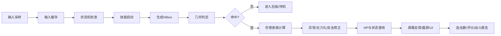
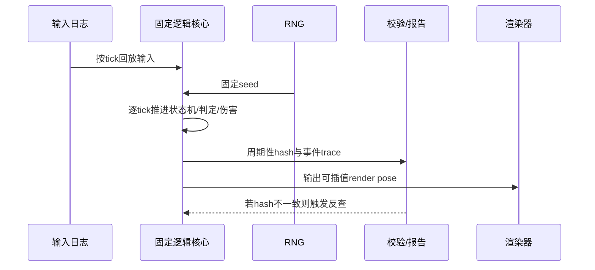
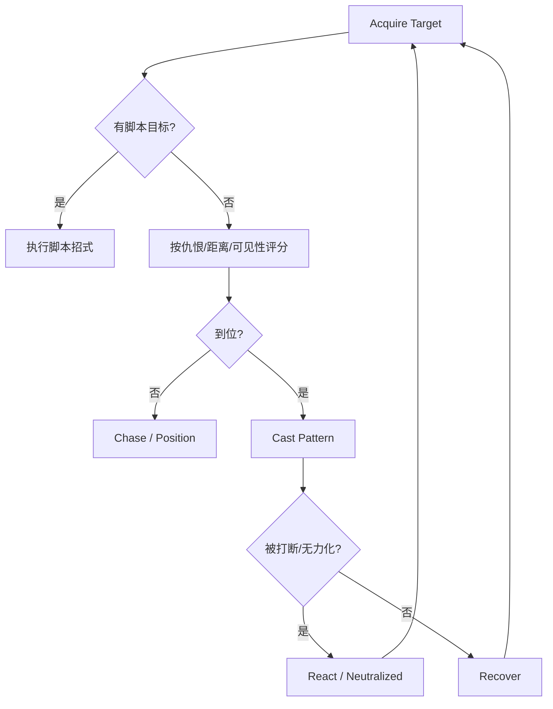

# DNF战斗系统可复刻实现技术报告

## 执行摘要

这份报告的结论先说在前面：如果目标是让开发团队做出“玩法手感、战斗判定、异常状态、取消窗口、AI与反馈都高度贴近 DNF/DFO”的实现，公开资料**足以还原系统骨架、状态体系、若干关键数值与大量行为规则**；但要做到**全职业、全技能、逐技能逐帧 1:1**，公开官方资料并**不**提供完整的 hitbox/hurtbox、完整帧表、或完整闭式伤害总公式。要想真正接近 1:1，工程上必须采用“四层证据法”：A 层用官方 API / 指南 / 补丁公告定义**规则真相**，B 层用官方社区逐帧/玩法分析补齐**表现层与手感层**，C 层用公开的 PVF/NPK 工具建立**自动抽取管线**，D 层才是在明确法律与伦理风险下，把台服 PVF/逆向信息当作**旁证**而不是主证。citeturn12view0turn10view1turn10view2turn10view3turn11view8turn11view9turn11view10

公开资料里，最有开发价值的“精确值”主要出现在三类地方：其一是官方状态异常指南，明确给出了中毒、灼伤、感电、出血、束缚/眩晕/减速/冰冻/石化/睡眠/暗黑/混乱/诅咒、以及 Rupture/파열(破裂) 的持续时长、触发间隔、叠层与特殊规则；其二是补丁/平衡公告，会给出某些技能与 Buff 的精确 px 半径、X/Y 轴范围、追踪与多目标行为；其三是训练场、控制器、技能演化、Buff UI、战斗报告等系统公告，会暴露输入消费、空中/倒地/反击/霸体/抓取免疫等系统开关与 UI/事件流。换句话说，**规则层最接近官方真相，表现层与技能逐帧数据最接近“公告 + 社区 + 抽取”的交集**。citeturn10view1turn10view2turn10view3turn10view4turn10view6turn10view8turn10view9turn10view10turn23search1turn23search2turn22search5

另一个非常关键的结论是：DNF 的公开文本已经足够证明其战斗判定作者化使用的是**像素化距离与分轴范围**，例如 150 px、300 px、450 px、500 px、700→900 px、750→900 px、以及明确写出的 X-axis / Y-axis 范围与速度；因此，复刻时应把地面战斗空间建模为 **X（左右）+ Y（纵深/同屏“前后排”）+ Z（离地高度）** 的 2.5D 三轴空间，其中公开文本中的 px 值直接落在 XY 平面，空中规则再由 Z 轴叠加。官方公开文本没有直接给出“Z 轴”术语，但训练场里存在 Aerial/Down/Grab-immune/Counterattack/Super Armor 这些独立测试开关，足以支持“地面平面判定 + 空中附加高度层”的工程拆分。citeturn22search5turn23search2turn10view2turn10view3turn10view8turn15view0

最后，关于“帧表”必须特别谨慎。官方公告会讨论“攻击速度按固定比率作用于某个动作”“技能可 pre-input”“某些技能可在落地前/落地后取消”等逻辑；但大量社区“XX 帧”数据更像是**录屏/动图帧**，而不是游戏逻辑 tick。比如一篇官方社区贴给出“35 帧≈1.41 秒”“19 帧≈0.75 秒”，折算约在 25–31 FPS 之间，这不符合将其直接当作逻辑帧的用法。开发上应把这类数据视为**表现帧观察值**，只能用于验证“相对快慢、前后摇占比、取消点先后”，不能直接当作 60Hz 逻辑帧表。要做可回放、可联网、可判定一致的系统，仍应以内核固定逻辑帧为准。citeturn20view1turn20view2turn20view3turn20view0turn10view10turn9search0

## 证据基础与可采信边界

本报告把官方来源限定为 entity["company","Neople","korean game studio"] / entity["company","Nexon","game publisher"] 的公开 API、指南与更新公告；开源工具主要来自 entity["company","GitHub","software hosting platform"] 上的 PVF/NPK 解析项目。这样做的原因很简单：官方 API 能证明“官方愿意公开哪些结构化对象”，官方指南/公告能证明“当前 live 版本明确承认哪些规则”；而开源 PVF/NPK 工具只适合作为数据抽取与验证工具，不应反过来凌驾于官方规则定义。citeturn12view2turn10view1turn10view2turn10view3turn11view8turn11view9turn11view10

官方开发者文档明确有“职业信息 /df/jobs”“职业别技能列表 /df/skills/:jobId”“职业别技能详情 /df/skills/:jobId/:skillId”“多技能详情 /df/multi/skills/:jobId”等接口，这意味着职业/技能 ID、技能元数据、以及与技能相关的一部分可读说明，适合进你们的**技能字典与版本同步器**；但在可浏览到的 API 文档摘要里，**没有出现**完整判定框数组、完整 hurtbox 作者数据、逐帧 frame data、或完整伤害流水字段说明。因此，API 可用来做**索引、对照、版本归档**，不能单独扛起 1:1 复刻。citeturn12view0turn12view1turn12view2

下表给出本报告实际采用的证据层级与工程用途。

| 证据层级 | 来源类型 | 能直接采信的内容 | 不能直接采信的内容 | 工程用途 |
|---|---|---|---|---|
| A | 官方 API / 官方指南 / 官方补丁公告 | 状态规则、持续时长、公开 px 数值、系统开关、UI/输入支持、训练场能力、部分技能范围与行为 | 全技能 frame table、全技能判定框、完整闭式伤害公式 | 规则真相、系统边界、版本基线 |
| B | 官方站内社区攻略/逐帧分析 | 技能相对时长、取消点体验、多目标/追踪表现、武器/职业手感差异 | 绝对逻辑帧、所有玩家口径一致性、版本稳定性 | 表现回归、手感校验 |
| C | 开源 PVF/NPK 解析工具 | 资源容器结构、自动化导出思路、素材/脚本抽取能力 | 其输出一定等于 live 行为、法律授权充分性 | 建抽取管线、内部对照 |
| D | 台服 PVF/泄露客户端/逆向资料 | 在明确授权与风险隔离下可作旁证 | 公开发布、直接作为需求真源、绕过保护或再分发 | 最后手段，不可作为主证 |

这也是本报告反复使用“**已公开** / **未公开** / **工程默认** / **高风险旁证**”标记的原因。citeturn12view0turn10view1turn10view2turn10view3turn11view8turn11view10

## 战斗数据模型与判定几何

### 公开可验证的几何与范围样本

官方公开文本已经证明，DNF 的很多范围规则不是“抽象近战/远程”，而是明确的 px 数值与分轴判定。下面这些值都能直接进入你们的**回归测试库**，作为引擎单位、范围比较与 2.5D 判定的锚点。citeturn22search5turn23search2turn10view2turn21search2turn22search14turn22search8

| 项目 | 公开值 | 意义 | 来源 | 可信度 |
|---|---:|---|---|---|
| Miracle Shine 初始 Y 轴范围 | 100 px → 150 px | 技能范围在公告里以 px 与 Y-axis 公开，说明分轴范围是作者数据 | citeturn22search5 | A |
| Fountain of Life Aura Range | 700 px → 900 px | Buff / Aura 也是 px 范围，不只是攻击判定才有范围 | citeturn23search2 | A |
| Healing Wind Barrier Range | 750 px → 900 px | Barrier 作用范围可作为辅助技能作用域基线 | citeturn23search2 | A |
| 灼伤溅射范围 | 150 px | 灼伤目标会对周围 150px 怪物造成原始伤害 10% 的扩散伤害 | citeturn10view2 | A |
| 远离敌人阈值 | 150 px | 装备/条件判定依赖与敌人的 px 距离阈值，可复用于“远程成立区” | citeturn21search2 | A |
| 状态传播半径 | 450 px | 多个装备/效果以“450 px 内敌人”作为异常施加半径 | citeturn22search14turn25search5 | A |
| 计数型范围 | 500 px | 装备与条件经常以“500 px 内目标数”统计，适合作为广义感知半径参考 | citeturn21search2 | A |
| X/Y 轴速度区分 | X +50%，Y +20% | 说明移动系统公开文本里区分 X/Y 速度，不应只做单轴速度 | citeturn22search8 | A |

基于这些公开值，推荐的世界坐标模型如下：**X=左右推进轴，Y=场景纵深轴，Z=离地高度轴**。公开文本明确写出 X-axis、Y-axis、Aerial、Down 等概念，但没有直接给出第三维命名；因此，Z 轴是本文用于复刻的**工程命名**，不是官方术语。这个拆分的好处是：地面 hitbox/hurtbox 统一落在 XY；跳跃、浮空、下砸、抓取、空中受击则在 XY 相交之后再判定 Z 区间是否重叠。citeturn10view3turn10view8turn22search5turn23search2

### 建议的技能判定数据结构

由于官方没有公开全量技能判定框，最现实的 1:1 工程策略不是手写，而是先把技能数据模型定义成“**能容纳官方已知值 + 客户端抽取值 + 录屏校准值**”的统一格式。下面这个结构就是可以直接交给战斗、TA、工具链同时使用的最小完备版本。

| 字段 | 类型 | 说明 | 是否建议做权威字段 |
|---|---|---|---|
| `jobId` / `jobGrowId` / `skillId` | string | 对齐官方技能字典与版本同步 | 是 |
| `castType` | enum | instant / hold / channel / install / summon / grab / projectile | 是 |
| `logicTickRate` | int | 建议 60；与渲染帧解耦 | 是 |
| `startupTicks` / `activeTicks` / `recoveryTicks` | int | 逻辑帧，不是录屏帧 | 是 |
| `superArmorMask` | bitset | 哪些阶段带霸体 | 是 |
| `invulnMask` | bitset | 哪些阶段带无敌 | 是 |
| `cancelWindows[]` | array | 普通取消、命中取消、落地取消、受击取消、Backstep Upgrade 取消等 | 是 |
| `preInputWindows[]` | array | pre-input 可消费窗口 | 是 |
| `rootMotionCurve[]` | curve | 每 tick 根位移曲线 | 是 |
| `forcedMotion` | struct | 推、拉、吸、抓、瞬移、落地修正 | 是 |
| `hitboxes[]` | array | 每段命中的判定框列表 | 是 |
| `hurtboxOverrides[]` | array | 特定动作下受击框变化 | 是 |
| `targetingRule` | enum | nearest / cone / current target / retarget on death / split chain | 是 |
| `damagePackets[]` | array | 每段伤害包、属性、状态附加、是否共享 hit once | 是 |
| `cameraFeedback` | struct | 震屏、停顿、血条 shake 权重、音效 key | 否，但建议 |
| `replayTag` | hash | 回放还原与版本校验 | 是 |

建议的 hitbox/hurtbox 子结构如下。这里的单位建议统一为 `px`，并且所有值都以**角色根节点局部坐标**存储，面向方向由 `facingSign` 再行翻转。

| 字段 | 示例 | 说明 |
|---|---|---|
| `shape` | rect / capsule / circle / sector / line | DNF 装备与公告文本频繁使用“半径/范围/扇形/前方”语义，shape 不能只做矩形 |
| `originX, originY, originZ` | `120, 0, 20` | 相对角色根节点偏移 |
| `sizeA, sizeB, sizeC` | `w,h,d` 或 `r,length,angle` | 形状参数 |
| `tickStart, tickEnd` | `8, 10` | 生效逻辑帧区间 |
| `hitOncePolicy` | perTarget / perPacket / shared | 多段、多目标命中消费规则 |
| `groundMask` | ground / air / downed / grabImmuneExempt | 目标姿态白名单 |
| `alignmentMask` | front / back / all | 是否仅前方、背后或全向 |
| `priority` | 0~255 | 同 tick 多判定消费顺序 |
| `fxSocket` | `weapon_tip_a` | 特效挂点，便于反馈统一 |

### 2.5D 判定推荐算法

下面的几何算法不是“官方公式”，而是根据官方公开的 px、X/Y 轴与空中/倒地/抓取开关，给出的**可直接落地实现**。它的目标是：既能容纳 DNF 常见的横版扇形/前方长条/大范围 Aura，又能处理 Aerial 与 Down 区分。

```cpp
struct Vec3Px { int x; int y; int z; }; // x: 左右, y: 纵深, z: 离地高度
struct Capsule2D { int x1, y1, x2, y2, r; };
struct HeightRange { int zMin, zMax; };

bool OverlapGround(const Shape& a, const Transform& ta,
                   const Shape& b, const Transform& tb);

bool OverlapHeight(const HeightRange& a, const HeightRange& b) {
    return !(a.zMax < b.zMin || b.zMax < a.zMin);
}

bool CanHitTarget(const Hitbox& hb, const TargetState& t) {
    if (!(hb.groundMask & t.poseMask)) return false;
    if (t.isGrabImmune && hb.castType == CastType::Grab) return false;
    if (t.isInvulnerable && !hb.ignoreInvuln) return false;
    return true;
}

bool ResolveHit(const Hitbox& hb, const Transform& attacker,
                const Hurtbox& hurt, const Transform& target,
                const TargetState& t) {
    if (!CanHitTarget(hb, t)) return false;

    Shape worldHit = MirrorByFacing(hb.shape, attacker.facingSign, attacker.pos);
    Shape worldHurt = ApplyPoseOverride(hurt.shape, t.poseMask, target.pos);

    if (!OverlapGround(worldHit, attacker, worldHurt, target)) return false;
    if (!OverlapHeight(hb.heightRange, hurt.heightRange)) return false;

    return true;
}
```

这个模型特别适合实现训练场的 `Aerial / Down / Grab-immune / Counterattack / Super Armor` 五类切换，以及公开文本里大量出现的 px 阈值。它还允许你们在同一套几何系统上做技能、Aura、异常传播、装备对象伤害和 AI 感知半径。citeturn10view3turn10view8turn10view0turn13view2

## 角色动作、技能与伤害

### 主角动作状态机

官方已经公开了很多“状态能力位”：Counter、Invincibility、Super Armor、异常状态类型、Neutralize、Training Center 的 Aerial/Down/Grab-immune/Super Armor/Boss 设置，以及 Backstep Upgrade 可在“技能中”或“被击中/倒地时”发动。这些足以支持一个**显式状态机 + 可并行 Buff/姿态层**的实现；也就是说，动作状态机不要把“霸体/无敌/Buff/异常”硬编码进主状态，而应作为叠加层。citeturn10view1turn10view3turn10view5

下表是建议的角色主状态机构成。带“官方验证”的行为对应公开资料，带“工程默认”的行为是为了把规则闭环。

| 主状态 | 进入条件 | 退出条件 | 关键子标志 | 备注 |
|---|---|---|---|---|
| Idle | 无输入、技能结束 | Move / Jump / SkillStart | facing, idleLoop | 工程默认 |
| Move | 方向输入 | Idle / Jump / SkillStart / Dash | walk/run 分离 | 模拟摇杆可基于倾斜区分走/跑，官方已验证 citeturn10view8 |
| JumpStart | 跳跃输入 | Airborne | jumpCommit | 工程默认 |
| Airborne | `z > 0` | Landing / AirSkill / HitReact | aerialHitEnabled | 训练场可强制 Aerial；部分职业有明确空战能力 citeturn10view3turn16view0 |
| SkillStart | 技能命令/快捷键成立 | Active / Recovery / BackstepUpgrade | preInputConsume | 官方存在技能预输入、攻击速度调节动作时长 citeturn10view10 |
| Active | 命中段生效 | Recovery / Canceled | superArmor, invuln, rootMotion | 官方指南明确存在无敌/霸体；范围与行为视技能作者数据 citeturn10view1turn22search5turn23search2 |
| Recovery | 主动段结束 | Idle / Move / SkillStart | cancelWindow | 工程默认 |
| HitReact | 受击且未霸体/无敌 | Idle / Downed / Dead | hitstun, recoil | 官方训练场/社区可验证受击与倒地概念；逆硬直具体值未公开 citeturn10view3turn15view0 |
| Downed | 击倒 | StandUp / Dead / BackstepUpgrade | quickReboundAllowed | Backstep Upgrade 明确可在 attacked/downed 时发动 citeturn10view5 |
| Grabbed | 遭抓取成立 | Release / Dead | grabOwner | Grab-immune 为独立标志 citeturn10view3turn11view4 |
| Dead | HP≤0 且不可复活 | RevivePending / End | corpseState | 工程默认 |
| RevivePending | 令牌/技能复活等待 | Idle / Dead | reviveProtection | 若做职业特例复活，可挂载类 buff 处理；官方职业描述存在复活/复生类概念 citeturn16view0turn23search1 |

### Backstep Upgrade、取消窗口与输入缓存

Backstep Upgrade 是公开资料里最有价值的共通动作样本：它可在**除觉醒以外的技能中**发动，也可在**被击中或倒地时**发动，而且这两种使用场景的冷却不同，分别为 40 秒和 30 秒。这意味着取消窗口与输入消费不是纯“动画系统”问题，而是**状态位 + 指令缓存 + 技能白名单 + 共通 CD 管理**共同决定的。citeturn10view5

DNF 近年的平衡与技能演化公告还明确提到两类很关键的语义：一种是“技能可在某动作激活后再被 Flowing Stance skill 取消”，另一种是“某技能 cast 后可立即 pre-input 下一技能”。这说明取消点应拆分为至少三种：`onCast`、`onHit`、`afterActiveSpawn`；而输入缓存则必须记录“输入发生帧”和“消费优先级”。citeturn10view10

```cpp
struct BufferedInput {
    InputCommand cmd;
    int pressedTick;
    int expireTick;
    int priority;
};

void PushBufferedInput(InputCommand cmd, int nowTick) {
    buffer.push({
        .cmd = cmd,
        .pressedTick = nowTick,
        .expireTick = nowTick + GetBufferWindow(cmd), // 典型建议: 4~8 logic ticks
        .priority = GetPriority(cmd)
    });
}

bool TryConsumeBufferedInput(Character& c, int nowTick) {
    for (auto& bi : buffer.sortedByPriorityThenNewest()) {
        if (bi.expireTick < nowTick) continue;
        if (!IsCommandLegalInState(bi.cmd, c.state)) continue;
        if (!IsWithinCancelWindow(bi.cmd, c.currentSkill, nowTick)) continue;
        if (!MeetsResourceAndCooldown(bi.cmd, c)) continue;

        ExecuteCommand(c, bi.cmd, nowTick);
        bi.expireTick = nowTick; // consume
        return true;
    }
    return false;
}
```

推荐把取消窗口配置成下表所示的显式作者数据，而不要把“某技能能不能取消”写在动画蓝图里。这样才能统一支撑普通技能、职业特例、Backstep Upgrade、空中再输入、以及玩家手感调参。

| 窗口类型 | 触发时机 | 典型应用 |
|---|---|---|
| `CanPreInput` | 当前技能进入指定 tick 后 | 官方已验证的 pre-input 逻辑 |
| `CanCancelOnCast` | 起手动作出现某关键帧后 | 脱手化技能、特化技能 |
| `CanCancelOnHit` | 至少 1 个命中包成立后 | 连招、命中确认 |
| `CanCancelOnLand` | 空中技能落地后 | 空中连段、空中取消 |
| `CanCancelOnAttacked` | 受击后特定姿态 | Backstep Upgrade、Quick Rebound 类 |
| `CanCancelOnDowned` | 倒地时 | 官方已验证的 Backstep Upgrade 场景 |

### 帧表：应如何理解“公开帧数”

社区数据对实现有价值，但必须**降级使用**。下面这张表列的是官方社区上可见的逐帧/逐秒分析样本。它们很适合做“相对时长、快慢排序、取消收益”验证，但是**不能直接作为逻辑帧**写进引擎。

| 技能/变体 | 社区观测值 | 推论 | 来源 | 可信度 |
|---|---|---|---|---|
| 女散打 无影脚基线 | 20“帧” | 录屏/动图观测值，用于比较相对速度 | citeturn20view0 | B |
| 女散打 无影脚 VP1 | 13“帧” | 观测前摇缩短约 35% | citeturn20view0 | B |
| 女散打 无影脚 VP2 | 8“帧” | 观测前摇缩短约 60% | citeturn20view0 | B |
| 特工 暗月秘步 基线 | 33“帧” | 观测总时长 | citeturn20view1 | B |
| 特工 暗月秘步 月夜 | 22“帧” | 观测减少约 30% | citeturn20view1 | B |
| 特工 满月斩 基线 / Daymoon | 16 → 8“帧” | 观测减半 | citeturn20view1 | B |
| 特工 追魂月光 基线 / 死亡套索 | 35 → 26“帧” | 观测减少约 26% | citeturn20view1 | B |
| 特工 歼灭 基线 / VP 变体 | 23 → 19“帧”；命中完成 5“帧” | 命中完成与后摇可分离建模 | citeturn20view1turn20view2 | B |
| Flame Circle 两种变体 | 0.05s vs 0.16s | 取消手感可因表现时长 3 倍差异而明显变化 | citeturn20view3 | B |

**工程结论**：逻辑帧表必须来自你们自己的固定 tick 下录制/抽取；社区帧值可作为自动回归的“表现快慢参考线”。如果社区把 35 帧写成 1.41 秒，那么它更像是动图/捕捉帧率，而不是 60Hz 逻辑步长。citeturn20view1turn20view2

### 伤害计算：已公开部分与建议实现

公开资料里，**最完整、最可以直接抄实现的伤害规则**其实是异常状态与对象伤害，而不是角色主动技能总公式。官方指南明确给出：

- 中毒：5 秒，0.5 秒一次；每层下一个中毒伤害 +2%，最高 +10%。
- 灼伤：5 秒，0.5 秒一次；对目标周围 150 px 溅射原伤害 10%；被冰冻解除时，剩余灼伤伤害 +10% 一次性结算。
- 感电：10 秒，0.5 秒一次；按定义打击数与攻击力分摊，提前打完进入残留状态；每层下一个感电伤害 +0.5%，最高 +5%。
- 出血：3 秒，0.5 秒一次；每层下一个出血伤害 +1%，最高 +10%。
- Rupture/파열(破裂)：可叠 3 层；角色侧受伤害 +25/+50/+75%，怪物侧受伤害 +5/+7/+8%。citeturn10view2turn18view3

下面这张表可直接作为异常状态执行器的规范。

| 异常类型 | 持续时间 | tick 间隔 | 叠层规则 | 特殊规则 | 来源 |
|---|---:|---:|---|---|---|
| 中毒 Poison | 5s | 0.5s | 每新增一层使“下一次中毒伤害”+2%，最高 +10% | 受持续时间/伤害增减影响 | citeturn10view2 |
| 灼伤 Burn | 5s | 0.5s | 未公开叠层增幅公式 | 150px 溅射原始伤害 10%；若因冰冻解除，剩余灼伤 *1.1 一次结算 | citeturn10view2 |
| 感电 Shock | 10s | 0.5s | 每新增一层使“下一次感电伤害”+0.5%，最高 +5% | 按定义 hit count/atk 分摊；打完后转残留态 | citeturn10view2 |
| 出血 Bleed | 3s | 0.5s | 每新增一层使“下一层出血伤害”+1%，最高 +10% | 受持续时间/伤害增减影响 | citeturn10view2 |
| Rupture 角色侧 | 由技能/副本定义 | n/a | 1/2/3 层 | 受伤害 +25/+50/+75% | citeturn18view3 |
| Rupture 怪物侧 | 由技能/副本定义 | n/a | 1/2/3 层 | 受伤害 +5/+7/+8% | citeturn18view3 |

对“总伤害总公式”，官方公开资料确认了若干**伤害家族**与命名演进：`Damage Value → Atk. Increase`，`Damage Value% → Atk. Amp.`，`Skill Atk. → Overall Damage`；同时“对象伤害（Special Object Damage）”与角色技能**共用大部分伤害计算**，但 STR/INT、物/魔/独立攻击、元素、异常转伤、怪物防御、副本 Buff、职业 Buff/被动 对它们的作用范围不完全相同，例如 Special Object Damage 只取最高 STR/INT、只取最高 物/魔/独，不吃职业 Buff 强化技能/主动 Buff/被动技能多数效果，而怪物防御与副本 Buff 会生效。citeturn13view0turn13view2turn13view3turn13view4turn13view5

因此，建议把全球伤害求值器写成**“家族化分层”**，而不是把所有加成提前乘扁。下面这个顺序是工程推荐值，不是官方公布的闭式公式：

```cpp
DamageResult EvalDamage(const AttackPacket& pkt, const Attacker& a, const Defender& d) {
    // 1. 选攻击基底
    float atkBase = SelectAttackBase(pkt.attackType, a);   // 物/魔/独
    float statBase = SelectPrimaryStat(pkt.attackType, a); // 力/智

    // 2. 技能倍率与等级倍率
    float skillTerm = pkt.skillScalar * pkt.levelScalar;

    // 3. 攻击族加成（推荐分家族存储）
    float atkIncrease = 1.0f + a.mods.atkIncrease; // 旧 Damage Value
    float atkAmp      = 1.0f + a.mods.atkAmp;      // 旧 Damage Value%
    float overallDmg  = 1.0f + a.mods.overallDamage;
    float lvSkillDmg  = 1.0f + a.mods.levelSkillDamage[pkt.skillLevelBand];

    // 4. 元素与状态转换
    float elemental = EvalElementTerm(pkt.element, a, d);
    float abnormal  = EvalAbnormalConversionAndBonus(pkt, a, d);

    // 5. 条件判定
    float crit     = IsCritical(pkt, a, d) ? a.mods.critMultiplier : 1.0f;
    float counter  = IsCounterHit(pkt, d) ? a.mods.counterMultiplier : 1.0f;
    float backAtk  = IsBackAttack(pkt, a, d) ? a.mods.backAttackMultiplier : 1.0f;
    float rupture  = EvalRuptureIncomingMultiplier(d);

    // 6. 防御、减伤、霸体/无敌过滤
    if (d.state.invulnerable && !pkt.ignoreInvuln) return DamageResult::Zero();
    float defense = EvalDefenseTerm(pkt, a, d);

    float raw =
        atkBase * statBase * skillTerm *
        atkIncrease * atkAmp * overallDmg * lvSkillDmg *
        elemental * abnormal *
        crit * counter * backAtk * rupture *
        defense;

    return FinalizeDamage(raw, pkt, a, d);
}
```

这里有两点需要你们在项目里显式标红：第一，**官方未公开** 2026 live 版本的完整闭式技能总公式；第二，任何包含“暴击、背击、反击、对象伤害、装备对象伤害、异常转伤”的系统，必须分家族存储并版本化，否则后续大改命名时会把老数据打烂。citeturn13view0turn13view2turn13view3turn11view0turn4search0

### 背击、暴击、反击的建议落地

反击/Counter 是官方明确公开的：怪物攻击中或特定状态会进入可 Counter 状态；命中会造成更多伤害，而且训练场能直接把怪物设置成 Counterattack 状态。这个判定不该写成“朝向 + 时间窗”的单一条件，而应写成 **`defender.counterable == true`** 的显式目标状态位，由怪物技能脚本开启与关闭。citeturn10view1turn10view3

暴击方面，较新的官方公开文档更常公开“暴击率数值”而不是“基础暴击倍率”；韩国官方社区与官方社区攻略则多次把基础暴击理解为**1.5×**，并把“堆满 100% 暴击”视为通用构筑前提。因为这不是 A 级规则文档，所以工程上建议把 `baseCritMultiplier=1.5` 设为**可配置默认值**，并在内部验收时通过实机比对再锁死。citeturn25search3turn25search17turn24search5

背击方面，公开资料证明“Back attack”是一个真实存在的条件家族，装备会用“5 Back attacks”触发异常，也会有“on Back attacks / on Frontal attacks”的差异选项；但官方没有公开统一几何定义。因此建议默认采用：**目标面向的背半球 + 最小接触深度阈值**，不要只用“攻击者 x < 目标 x”。如果你们后续接入客户端抽取或实机黑箱验证，可以再把背击角度从 180° 收窄到 120° 或 90°。citeturn24search1turn22search1turn24search4

## 怪物 AI 与战斗规则

### 仇恨、感知与目标选择

官方职业介绍里明确写到某些召唤/装置可以“draw aggro”，例如 Dimension Walker 的 Nyarly 会吸引怪物仇恨；而官方社区攻略也会把 Camouflage/카모플라쥬(伪装) 用作“让部分命名/Boss 识别不到玩家”的手段。再加上 Bakal Raid 的状态板把怪物状态明确分成 Appearing、Reinforcing、Moving、In Presence，已经足以证明：DNF 并不是简单的“最近目标 AI”，而是**仇恨表 + 状态机 + 副本脚本状态**共同决定目标行为。citeturn16view0turn7search5turn11view7

因此，推荐的怪物 AI 黑板至少包含以下字段：

| 黑板字段 | 类型 | 说明 |
|---|---|---|
| `hateTable[targetId]` | float | 基础仇恨 |
| `visibilityMask[targetId]` | bitmask | 是否可见、是否伪装、是否无敌不可取目标 |
| `distanceXY[targetId]` | float | 地面平面距离 |
| `heightDelta[targetId]` | float | 高度差，用于对空/对地 |
| `recentDamage[targetId]` | float | 最近伤害贡献 |
| `scriptedTarget` | entityId? | 副本脚本预设目标 |
| `neutralizeState` | state | 是否处于可软控/可异常 |
| `patternPhase` | enum | 当前招式/阶段 |
| `groupRole` | enum | Boss / Named / Champion / Normal |

目标选择推荐为：

```cpp
Target PickTarget(Monster& m) {
    if (m.blackboard.scriptedTarget && IsValid(m.blackboard.scriptedTarget))
        return m.blackboard.scriptedTarget;

    float bestScore = -INF;
    Target best = null;

    for (auto t : VisibleTargets(m)) {
        float s = 0.0f;
        s += m.hateTable[t.id] * 1.0f;
        s += RecentDamageContribution(t) * 0.6f;
        s -= DistanceXY(m, t) * 0.02f;
        s -= HeightPenalty(m, t) * 0.05f;
        if (t.hasAggroDrawEffect) s += 30.0f;     // 例如 Nyarly
        if (t.isCamouflaged)      s -= 100.0f;    // 伪装显著降优先级
        if (t.isInvulnerable)     s -= 50.0f;

        if (s > bestScore) { bestScore = s; best = t; }
    }
    return best;
}
```

### AI 行为树 / 状态表

DNF 怪物的 AI 更适合“**脚本主导 + BT 补足**”，而不是纯 BT。原因是大量副本与 Boss 都有阶段脚本、地图占点、增援、移动、存在状态等显式剧情/副本驱动逻辑。citeturn11view7turn27search0

| 状态 | 进入条件 | 退出条件 | 行为 |
|---|---|---|---|
| Idle | 刚刷出 / 无目标 | 发现目标 | 原地待机、播入场 |
| Acquire | 有可见目标 | 锁定成功 / 丢失目标 | 建仇恨、选目标 |
| Chase | 目标超出技能最优区 | 进入施法区 / 失去目标 | 移动、转向、对位 |
| Position | 已在可攻击区但未满足招式约束 | 满足招式 or 被打断 | 调 X/Y、拉开/贴近 |
| Cast | 技能选中 | Active 完成 / 被打断 | 播招、生成判定、改 counterable |
| Recover | 招后摇 | 恢复结束 | 可转下招/重置 |
| React | 受击且允许硬直 | 硬直结束 / Downed | 播受击、重置局部仇恨 |
| Downed | 击倒 | 起身 / 死亡 | 起身保护、可被 Down 测试强制维持 |
| Neutralized | Neutralize gauge 破坏 | 恢复 / 死亡 | 开启异常/无力化/其他 debuff 脆弱期 |
| Berserk/PhaseShift | HP/时间/脚本阈值 | 阶段结束 | 切招表、改感知/霸体/多段规则 |

这个状态机上的“反击可成立”“抓取免疫”“空中可命中/保持倒地”等，都应视为**战斗规则位**，而不是主状态本身。训练场已经把这些规则位暴露成可切换选项，这正是最好的设计证据。citeturn10view3

### 受击硬直、逆硬直与多目标命中

逆硬直(逆硬直 / recoil)在官方系统指南里没有成体系公开，但官方社区对 Weapon Master 武器手感的讨论非常明确：光剑的逆硬直“几乎可以视为没有”，大剑则“极重”。这说明 attacker-side hitstop / recoil 在 DNF 体感里是真实存在的一层，而不是只做 target hitstun 就够了。citeturn15view0

因此，建议将“受击反馈”拆成三层：

1. `targetHitstunTicks`：目标硬直。
2. `attackerRecoilTicks`：攻击者逆硬直。
3. `globalHitPauseTicks`：全局命中停顿，用于镜头/特效同步。

推荐默认公式如下：

```cpp
int EvalTargetHitstun(const AttackPacket& p, const Defender& d) {
    if (d.state.superArmor) return 0;
    int base = p.hitstunBase;
    if (d.state.isBoss) base = int(base * 0.35f);
    if (d.state.isNamed) base = int(base * 0.60f);
    return Clamp(base + p.hitstunBonus - d.hitstunResist, 0, 30);
}

int EvalAttackerRecoil(const AttackPacket& p, const Attacker& a) {
    float weaponMod = a.weapon.recoilModifier; // 光剑/권투글러브(拳击手套)低, 大剑高
    return Clamp(int(std::round(p.recoilBase * weaponMod)), 0, 12);
}
```

多目标命中方面，官方公告给出了几条非常宝贵的模式样本：

- White Tiger：若范围内有多个敌人，雷击**只直接命中一个目标**，然后**分裂**。
- Omnislay: Shooting Star：若追踪目标死亡，会在范围内**改追踪其他敌人**。
- Fling：被抓敌人落地或撞墙时会产生**冲击波伤害其他敌人**，但“被抓敌人的身体碰撞本身”不再伤害其他敌人。citeturn11view1turn10view10turn11view4

这些例子足以支持一个统一的多目标命中策略表：

| 策略 | 规则 | 例子 |
|---|---|---|
| `PerTargetUnique` | 每个伤害包对每目标仅命中一次 | 常规近战扇形 |
| `DirectThenSplit` | 先锁主目标，再把余量/子弹分裂给其他目标 | White Tiger |
| `RetargetOnDeath` | 当前追踪目标死亡，重新选范围内目标 | Omnislay: Shooting Star |
| `ThrowImpactAoE` | 抓取投掷的“墙/地冲击”产生 AoE，但抓取体本身不再带碰撞伤害 | Fling |
| `InstallationOverlap` | 装置/持续区每 tick 检测独立命中冷却 | 安装类技能 |

### 空中战斗、抓取、Neutralize 与规则位

空中规则、抓取规则、倒地维持、Counter、Super Armor、Neutralize 其实已经能从官方训练场和系统公告里拼出闭环。训练场可直接把怪物设为 Aerial、Down、Grab-immune、Counterattack、Super Armor；Neutralize Gauge 破坏后怪物会对 Abnormal statuses、Neutralize、Immobility 与其他 debuffs 更脆弱。citeturn10view3turn10view4

同时，官方指南给出了**控制类异常的精确时长**：束缚 5 秒、眩晕 3 秒（可连打缩短）、减速 3 秒且全速度 -50%、冰冻 5 秒、石化 10 秒（可连打缩短）、睡眠 10 秒、暗黑 5 秒且命中 -50%、混乱 5 秒且角色方向反转/怪物短暂停止、诅咒会施加多个控制系异常之一。这些规则位与抓取/空中/倒地位共同构成了 DNF 控场系统。citeturn19search1turn10view1

| 规则位 | 公开行为 | 开发实现建议 | 来源 |
|---|---|---|---|
| Aerial | 可对空中目标进行空战命中 | 目标 `poseMask` 含 `AIRBORNE`，命中箱加 Z 轴交集 | citeturn10view3turn16view0 |
| Down | 维持目标倒地 | 目标处于 `DOWNED` 时允许特定技能额外效果 | citeturn10view3turn11view6 |
| Grab-immune | 抓取无效 | `castType=Grab` 时直接失败或转普通打击变体 | citeturn10view3turn11view4 |
| Counterattack | 站立怪物可被反击 | 防守方显式 `counterable` 状态位 | citeturn10view1turn10view3 |
| Super Armor | 受击不硬直 | `targetHitstun=0` 但照常受伤害/异常（按技能规则） | citeturn10view1turn10view3 |
| Neutralize Broken | 对异常/Immobility/其他 debuff 更脆弱 | 怪物规则位切换 + 状态抗性下降 | citeturn10view4 |

## 系统工具、固定帧、输入兼容与回放

### 固定逻辑帧与渲染帧分离

要做出 DNF 这种动作判定与输入容错都稳定的系统，建议采用**固定逻辑帧 + 可变渲染帧**。这是为了保证 hitbox、取消窗口、输入缓存、回放、乃至未来若要上同步/回滚网络，都能依赖同一套确定性 tick。固定 timestep 的经典做法是 accumulator loop：逻辑以固定 dt 运行，渲染按最近两个逻辑态插值。citeturn9search0

DNF 官方对控制器支持的公告也间接支持这种做法：控制器可重映射，支持固定键位输入某些副本机制，模拟摇杆可按倾斜程度区分走/跑。这些都要求输入采样和动作消费有一个**稳定的逻辑消费点**，而不是完全依赖渲染帧。citeturn10view6turn10view8

```cpp
constexpr double LOGIC_DT = 1.0 / 60.0;
double accumulator = 0.0;
GameState prevState, currState;

while (running) {
    double frameTime = Clamp(ReadRealDelta(), 0.0, 0.25);
    accumulator += frameTime;

    PollRawInputDevices(); // keyboard + controller

    while (accumulator >= LOGIC_DT) {
        prevState = currState;
        InputSnapshot in = SampleAndNormalizeInputs(); // 只在逻辑 tick 采样
        PushToInputBuffer(in, currState.logicTick);
        StepLogic(currState, LOGIC_DT);
        accumulator -= LOGIC_DT;
    }

    double alpha = accumulator / LOGIC_DT;
    Render(Interpolate(prevState.renderPose, currState.renderPose, alpha));
}
```

如果目标平台是 PC 且以 PvE 为主，`logic=60Hz, render=120Hz/144Hz` 通常是最实用的折中；如果日后考虑类格斗化 PvP 或回滚联网，优先保证**逻辑 determinism**，必要时把位移、动画根运动、物理推挤都从浮点改成定点或整数 px。citeturn9search0turn9search5

### 输入兼容与按键体系

官方已经公开：
- Hotkey 可按角色保存。
- 控制器支持 XBOX / PS 类型，支持重映射与震动。
- 某些副本中的“固定键模式”可由控制器映射输入。
- 技能有普通技能槽与扩展技能槽。citeturn10view7turn10view6turn10view8turn26search10

因此，建议输入系统做成三段式：

1. **Raw Layer**：键盘、手柄、宏键、触屏（若以后上移动）。
2. **Action Layer**：MoveX、MoveY、Jump、Attack、Skill1..N、DungeonSpecial、OptionControl。
3. **Command Layer**：方向 + 技能键组合，进入输入缓存。

下表是推荐的输入兼容数据结构。

| 层级 | 字段 | 说明 |
|---|---|---|
| Raw | keyCode / padButton / axisValue | 设备原始值 |
| Action | `MoveX`, `MoveY`, `Jump`, `BasicAtk`, `Skill[n]` | 抽象玩家意图 |
| Command | `Down+Skill3`, `Backstep`, `OptionControl` | 能进入战斗消费器的指令 |
| Profile | perCharacter / perDevice | 与官方“每角色热键保存”一致 |
| Compatibility | deadZone / analogWalkThreshold / SOCD policy | 保证手柄/键盘一致消费 |

### 回放系统、战斗报告与事件总线

公开资料能确定三件事：
第一，官方客户端里大量存在“技能 Replay / 预览视频 / Talisman Encyclopedia 回放放大播放”等能力，说明客户端已有“技能片段回放”的资产与 UI 机制；第二，训练场早就有 Damage Report、Reset、Stopwatch、Timer、可调 HP 百分比与 Buff 开关；第三，新副本里甚至有 Combat Reporting。也就是说，**官方已经把“回放/报告/训练”当作战斗系统的一部分，而不是外挂工具**。citeturn26search0turn26search12turn27search1turn27search0

但官方没有公开“完整战斗回放”的底层格式，所以如果你们要自己做，最稳妥的方案仍然是**输入日志回放**而不是“每帧状态快照流”。推荐记录以下内容：

| 字段 | 说明 |
|---|---|
| `buildHash` | 资源版本校验 |
| `combatSchemaHash` | 技能表/状态表/异常表版本 |
| `seed` | RNG 稳定种子 |
| `playerLoadout` | 技能、加点、装备、Buff 初始集 |
| `spawnScriptHash` | 房间脚本版本 |
| `inputEvents[]` | `logicTick, playerId, action, value` |
| `syncChecks[]` | 每 N tick 记录少量校验哈希 |
| `eventBusTrace[]` | 仅调试/开发模式启用 |

下面这条事件总线足以覆盖 DNF 风格战斗的关键信息流。它不是官方枚举，而是根据官方系统能力与战斗规则整理的**建议落地总线**。

| 事件名 | 触发时机 | 消费方 |
|---|---|---|
| `InputAccepted` | 输入缓存被消费 | 动作状态机、UI |
| `StateChanged` | 主状态变化 | 动作/AI/音效 |
| `SpawnHitbox` | 技能激活段开始 | 判定系统、特效 |
| `HitConfirmed` | 命中成立 | 伤害、连击、镜头 |
| `DamageApplied` | 伤害结算完成 | HP、评分、掉血表现 |
| `AbnormalApplied` | 异常加上/刷新/移除 | 图标、DoT、Neutralize |
| `NeutralizeChanged` | 无力化条增减/破坏 | Boss UI、软控权重 |
| `TargetRetargeted` | 追踪改锁新目标 | 导弹/投射物 |
| `CounterTriggered` | 反击命中 | 伤害修正、提示字 |
| `CameraShake` | 需要震屏 | 摄像机、怪物血条 shake |
| `ReplayMarker` | 命中、阶段切换、死亡等关键帧 | 回放/编辑器 |
| `CombatReportTick` | 周期性采样 | 训练报告、统计 |

### 关键流程图

下面三张图是可直接交给程序、TA 与 QA 对齐接口的流程图。它们描述的是**建议实现**，其行为边界由前文的官方规则支持。citeturn10view1turn10view3turn10view4turn10view8turn9search0







### 镜头反馈、血条 Shake、碰撞推挤、死亡复活闭环

官方已经直接把怪物 HP UI 的 shake 与伤害强度绑定，而且会改进 Invincibility / Hold 的显示；同时部分更新会修正“某技能异常改变镜头视角”，另一些职业改动会专门优化 screen-shake effect。由此可知，屏幕反馈至少应当拆成：**镜头控制**、**血条 shake**、**角色受击/命中抖动**、**文字/图标层** 四层，而不是只做一个 CameraShake。citeturn10view9turn11view6turn11view4

碰撞与推挤方面，公告直接出现过“Black Tortoise will no longer push enemies”这类改动，说明“推挤”在 DNF 里是一个可被单独改掉的技能属性，不应默认为所有带位移技能都会推人。建议把碰撞拆成 `block`, `push`, `pull`, `hold`, `throw`, `teleportSnap` 六类。citeturn6search5

死亡复活闭环若要做成 DNF 风格，则应按“**死亡 -> 死亡保护判定 -> 角色/队伍/道具复活源判定 -> 起身保护 -> Buff 重建 -> 事件广播**”设计。现代公开资料里能看到职业级的复活/保命逻辑以及 HP/Barrier、Buff 图标与副本中的 Combat Reporting，但没有统一公开的全局复活协议，因此这部分应作为**你们自己的统一化抽象**。citeturn10view7turn14view0turn23search1turn16view0

## 参考网站、法律风险与开放问题

### 实际使用/引用来源清单

下表列出本报告**实际使用或引用**的页面 URL。为便于团队后续复查，我把用途、证据层级、可信度与法律/伦理风险一并列出。用户要求 URL，因此这里直接给出原始地址。若页面迁移，可用同标题在站内搜索追溯。citeturn12view0turn10view1turn10view2turn10view3turn10view4turn10view5turn10view6turn10view7turn10view9turn10view10turn11view8turn11view9turn11view10

| URL | 用途 | 证据层级 | 可信度 | 法律/伦理风险 |
|---|---|---|---|---|
| `https://developers.neople.co.kr/contents/apiDocs/df` | 证明官方公开 jobs/skills API 范围 | A | 高 | 低；官方开放文档 |
| `https://df.nexon.com/guide?no=1179` | Counter / 无敌 / 霸体 / 异常总览 | A | 高 | 低；官方指南 |
| `https://df.nexon.com/guide?no=1180` | 中毒/灼伤/感电/出血细则 | A | 高 | 低；官方指南 |
| `https://www.dfoneople.com/news/updates/531/System-Updates/Miscellaneous-Changes` | 训练场 Aerial / Down / Grab-immune / Counterattack / Super Armor | A | 高 | 低；官方更新 |
| `https://www.dfoneople.com/news/updates/2979/Character/Character-System` | Neutralize Gauge、Backstep Upgrade | A | 高 | 低；官方更新 |
| `https://www.dfoneople.com/news/updates/3567/Controller-Support` | 控制器、固定键、模拟摇杆走/跑 | A | 高 | 低；官方更新 |
| `https://www.dfoneople.com/news/updates/3990/Equipment-Updates/Special-Object-Damage-Options` | 对象伤害与角色伤害共享/差异规则 | A | 高 | 低；官方更新 |
| `https://www.dfoneople.com/news/updates/3990/Equipment-Updates/Equipment-System-Improvements` | Damage Value / Atk Increase / Overall Damage 命名映射 | A | 高 | 低；官方更新 |
| `https://www.dfoneople.com/news/updates/4388/Content` | Rupture、Monster HP UI shake、Invincibility/Hold 表示 | A | 高 | 低；官方更新 |
| `https://www.dfoneople.com/news/updates/4242/Character-Changes/Exorcist-Renewal` | 多目标分裂、Hold、技能范围变化样本 | A | 高 | 低；官方更新 |
| `https://www.dfoneople.com/news/updates/1486/Character-Balance-Patch/Priest%28M%29` | 700→900 / 750→900 等范围样本 | A | 高 | 低；官方更新 |
| `https://www.dfoneople.com/news/updates/1486/Character-Balance-Patch/Priest%28F%29` | Miracle Shine Y 轴 100→150 样本 | A | 高 | 低；官方更新 |
| `https://www.dfoneople.com/news/updates/4796/Character-Changes/Skill-Evolution-Improvements` | pre-input、攻击速度固定比率作用于动作、重定向追踪 | A | 高 | 低；官方更新 |
| `https://www.dfoneople.com/news/updates/4649/Skill-Evolution` | Skill Evolution / Skill Enhancement 系统结构 | A | 高 | 低；官方更新 |
| `https://df.nexon.com/community/dnfboard/article/2938354` | 社区逐帧样本：女散打技能时长 | B | 中 | 低；官方社区但玩家内容 |
| `https://df.nexon.com/community/dnfboard/article/2937887?category=1` | 社区逐帧样本：特工技能时长/取消 | B | 中 | 低；官方社区但玩家内容 |
| `https://df.nexon.com/community/dnfboard/article/2734168?growType=1&job=0&titleType=1` | 逆硬直/武器手感差异 | B | 中 | 低；官方社区但玩家内容 |
| `https://github.com/flwmxd/DNF-Porting` | PVF/NPK 解包库存在性 | C | 中 | 中；开源但非官方 |
| `https://github.com/LHCGreg/DFOToolBox/releases` | NPK 查看/提取工具存在性 | C | 中 | 中；开源但非官方 |
| `https://github.com/Zageku/DNF_pvf_python` | 明确涉及“台服 PVF”与编辑功能，高风险旁证 | D | 低到中 | 高；涉及台服 PVF 与编辑能力，不应直接用作主证或再分发 |

### 法律与伦理风险提示

对官方站、官方 API、官方公告、官方社区帖子进行阅读、索引和比对，风险相对较低；但一旦进入 PVF/NPK 解包、台服 PVF、背包/角色编辑器、泄露客户端、抓包与逆向领域，风险会迅速升高。尤其是明确写着“台服 PVF”“背包编辑”“角色转职觉醒/升级降级/装备强制穿戴”之类功能的工具，哪怕它是公开仓库，也只能作为**高风险旁证**，绝不应纳入你们的主数据链，更不应把其内容重新分发到团队外部。官方页面普遍带有版权声明，这足以说明版权主体清晰存在。citeturn11view10turn10view2turn12view2

工程上，正确做法是把这类资料隔离到“法务审批后可读、不可外发、不可直接拷贝素材、不可作为唯一真源”的沙箱里；真正进入游戏运行时的数据，应来自你们的原创重建、官方规则抽象，以及经合法授权的内部验证素材。这个区分不只是合规问题，也关系到版本可维护性：泄露/逆向资料往往最容易“像真”，也最容易在版本迭代时误导团队。citeturn11view8turn11view9turn11view10

### 开放问题与实现时的默认值建议

目前仍然**未公开/未能高可信取得**的关键信息包括：全职业全技能的完整 hitbox/hurtbox、完整逻辑帧表、现代 live 版本全局伤害闭式公式、统一的背击几何定义、统一的抓取优先级矩阵、以及客户端真实动作资源到根位移曲线的官方表述。对此，我给出下列项目级默认值，便于先开工，再做实机校准。citeturn12view0turn10view1turn10view2turn20view1turn20view2

| 未指定变量 | 推荐默认值 | 影响分析 |
|---|---|---|
| 目标平台 | PC 优先 | 最接近原作输入与 UI 密度；主机需加强手柄命令层；移动要重做指令表达 |
| 网络需求 | 先 PvE 本地确定性，后加联网 | 先把回放/判定一致性做对，再考虑同步/回滚 |
| 逻辑帧率 | 60Hz | 与动作游戏常见实践、输入缓冲与训练场表现最兼容 |
| 渲染帧率 | 120Hz 上限、向下兼容 | 更顺滑，但不影响逻辑判定 |
| 基础暴击倍率 | 1.5×（可配置） | 社区常识值；实机黑箱验证后再固化 |
| 背击几何 | 目标背半球，附最小接触深度阈值 | 先满足系统闭环，再通过实机样本校准角度 |
| 输入缓存窗 | 4–8 logic ticks | 容错够用，又不至于破坏“利落感” |
| 录屏观测帧 | 一律不当逻辑帧 | 仅做表现回归，不做规则基准 |
| 判定单位 | px | 已有大量官方 px 样本可对齐 |
| 空中模型 | XY 平面 + Z 高度 | 与 Aerial/Down/Grab-immune 规则最兼容 |

如果你们真的要把项目推进到“逐技能 1:1”，下一步最正确的事不是继续搜更多散碎攻略，而是立刻搭三条内部流水线：
**技能字典同步器**（对齐 official API IDs）、**资源作者数据抽取器**（PVF/NPK/动画/脚本）、**实机黑箱录制回归器**（固定逻辑 tick 下自动录屏 + 事件日志 + 匹配器）。没有这三条线，团队会永远停留在“知道规则”，却无法把几千个技能真正落成“可维护数据”。citeturn12view0turn11view8turn11view9turn9search0
