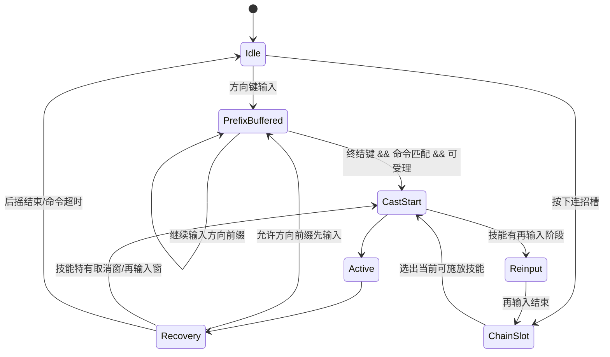
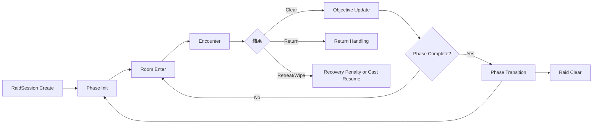

# DNF DFO 战斗系统复刻研究报告

## 执行摘要

这份报告的核心结论是：如果目标是做接近 1:1 的 PC 端复刻，不能把现有公开资料理解为“一个统一的攻速/施放速/移速倍率系统”，而应当实现为**60Hz 逻辑帧上的分段动画速度模型**、**按键前缀缓冲与终结键门控分离的指令系统**、以及**服务端权威的房间/阶段/跨房间对象状态机**。公开补丁与官方指南反复证明：同一职业内不同技能可以被重新标记为受攻速、受施放速度、受固定比例攻速，甚至“全部施放动作改为受攻击速度影响”；公开社区 60fps 测帧又证明这些速度收益最终一定落在离散帧断点上，而不是连续浮点时间上。citeturn29search1turn29search10turn29search7turn40search12turn14view0turn30view0

对于输入系统，公开韩服/国服资料已经足够重建一个稳定版本：方向前缀支持“先输入”，终结键必须等到当前动作进入可受理状态；旧版允许重复指令并且官方 UI 明示“即使相同也可以使用”，而 2026 年韩服与国服同时把重复指令的触发规则收敛为“只触发**基础冷却时间最长**的那个技能；若相同则触发**习得等级更高**的技能”，并新增最多 4 技能的技能连招槽。与此同时，韩服与国服又在 2026 年删除了“手搓减少 MP/冷却”的旧奖励；可检索到的英文官方资料在搜索语料范围内仍保留这类说明，说明国际服公开文档至少在该时间点上落后于韩/国服改动。citeturn16view2turn19search0turn19search1turn20view0turn21search0turn23view0turn42search5

对于副本与 Boss，官方 raid 指南已经明确给出一种非常“服务器权威”的实现风格：Boss 与跨房间对象可保留 HP/韧性，跨区域移动并再生；战场技能施放在“进入战斗/击杀/超时/撤退/团灭”时会分别暂停、取消或立即执行；返回、撤退、阶段切换会影响侵入次数、消耗品次数、时间上限、跨地图单位与强制转场逻辑。这类行为天然要求“房间、阶段、Boss 子状态、全局时间线、跨房间对象”由服务端维护，而客户端只做输入、演出和局部预测。citeturn35view0turn35view1turn35view2turn35view3

## 证据框架与版本边界

我把公开可检索证据分成四档。A 档是韩服、国服、国际服的官方更新公告与官方攻略页；B 档是官方 UI/tooltip 变更、跨服同类措辞互证；C 档是社区 60fps 测帧、玩法长文与 DFO World Wiki 这种二手整理；D 档是台服历史归档、公开 PVF/NPK 工具与历史客户端格式讨论。做 1:1 复刻时，**公式、优先级、阶段切换条件**应优先信 A/B；**帧断点、手感、缓冲体验**用 C 校准；**数据结构命名、历史字段、已停运版本布局**才用 D。citeturn20view0turn23view0turn39view1turn31search3turn11search5turn11search8

从版本边界看，今天最明确的公开分叉不在“三速底层公式”，而在**指令系统规则与文档时点**。韩服在 2026 年 3 月、国服在 2026 年 4 月同步上线“技能连招系统 + 重复指令新规则 + 删除手搓 MP/CD 奖励”；国际服可检索到的英文官方页面仍把“通过指令使用时降低 MP/冷却的技能”作为 tooltip 特殊标签之一，且仍保留 Command Cooldown UI 说明。台服则早已停运，当前只能用公开归档工具与史料做“历史数据布局”参考，不能拿来代表现行 live 服数值。citeturn20view0turn21search0turn42search5turn23view0turn16view1turn25search3turn26search5turn31search3

| 维度 | 韩服 | 国服 | 国际服 | 台服归档 | 结论 |
|---|---|---|---|---|---|
| 技能连招系统 | 2026 官方新增，单槽最多 4 技能。citeturn20view0 | 2026 官方同步新增，文案与韩服一致。citeturn42search5 | 在已检索英文官方语料中未找到等价官方页面。citeturn23view0turn24search2 | 无 live 服。citeturn25search3turn26search5 | 这是当前最清楚的地区分叉。 |
| 重复指令规则 | 改为“基础 CD 最长者优先；同 CD 取习得等级高者”。citeturn20view0 | 同韩服。citeturn42search5 | 旧版英文官方 UI 仍显示“相同指令也可以使用”。citeturn16view2 | 无法验证。citeturn25search3 | 旧系统与新系统必须做版本开关。 |
| 手搓 MP/CD 奖励 | 2026 删除。citeturn20view0turn21search5 | 2026 删除。citeturn21search0 | 已检索英文官方仍保留相关 tooltip/说明。citeturn23view0turn22search3 | 无 live 服。citeturn25search3turn26search5 | 复刻时必须按版本切换。 |
| 速度系统官方公开程度 | 大量补丁明确哪些动作受攻速/施放速影响。citeturn29search10turn40search12 | 中文官方能检索到技能/角色玩法改版与连招，但公式公开度较低。citeturn21search0turn42search22 | 英文官方也大量写到“Now affected by Attack Speed”。citeturn29search1turn29search10 | 只能用历史工具与史料。citeturn31search3turn11search5 | 核心底层大概率同源，公开差异主要在文档时点。 |

## 速度系统公式与帧模型

### 公开可确认的规则

公开官方材料已经足以确认三件事。第一，攻击速度、移动速度、施放速度是**以百分比方式叠加显示**的主速度属性，而命中后的硬直恢复至少在 PvP 语境下是可以被**平面数值**增减的独立属性；韩服 2018 年补丁甚至直接把某技能的“Hit Recovery decrease”从 -20 改到 -200。第二，官方已经承认攻击速度、移动速度、施放速度等存在“**适用数值限制**”，但同一补丁又说明角色面板可显示“**不考虑该限制的持有总和**”，说明内部必须区分“持有值”和“生效值”。第三，武器基础攻速在近年 UI 中已改成数值显示，官方举例“Very fast Attack Speed → Attack Speed +10%”，说明武器基础攻速本质上也是进入总攻速求和的一项数据。citeturn39view3turn20view0turn27search0turn29search12

官方补丁还明确证明了“技能不是统一吃某一种速度”，而是**按动作段、按技能标签**决定。比如有的技能被改成“受攻击速度影响”，有的技能被改成“施放动作的动画速度受施放速度影响”，还有的技能甚至把“施放速度改为受攻击速度影响”，或者“某一上挑动作按固定比率吃攻速”。这意味着最稳妥的复刻模型不是给技能一个单一的 `speedType`，而是给**动作段**一个 `speedDriver + coefficient`。citeturn29search1turn29search10turn29search7turn40search12

### 复刻层最小可用公式

下面这些公式中，“确认层”是公开资料直接支持的部分；“复刻层”是为了做 1:1 克隆而给出的最小可用工程模型。它们不是官方源码泄露，而是由官方措辞与社区帧测共同逼出的最小解释。citeturn29search1turn29search10turn40search12turn14view0turn30view0

| 系统 | 建议公式 | 说明 | 证据强度 |
|---|---|---|---|
| 速度面板总和 | `S_atk_total = weapon_base + Σequip + Σavatar + Σskill + Σbuff + Σdungeon`；`S_cast_total / S_move_total` 同理；`R_hit_total = Σequip + Σskill + Σbuff - Σdebuff` | 三速按百分比项求和；硬直恢复建议按平面项求和。 | A/B |
| 动画时长 | `F_out = ΣF_fixed + Σceil(F_atk_i / (1 + α_i·S_atk_eff/100)) + Σceil(F_cast_i / (1 + β_i·S_cast_eff/100)) + Σceil(F_move_i / (1 + γ_i·S_move_eff/100))` | 每个动作段独立决定吃哪种速度与吃多少比例。 | B/C |
| 生效值裁剪 | `S_x_eff = clamp(S_x_total, min_x, max_x)` | 官方确认存在“适用数值限制”，但公开文档未给出所有限制数值。 | A |
| 移动矢量 | `vx = vx0 · (1 + Sx/100)`，`vy = vy0 · (1 + Sy/100)` | 官方已出现 X/Y 轴分开的移速加成。 | A/B |
| 硬直恢复 | `F_recover = ceil(F_hitstun_base · H0 / (H0 + κ·R_hit_eff))` | 因为硬直恢复在公开补丁中表现为平面值，推荐不要直接套百分比公式，而是用“平面值换算倍率”的参数化常量 `H0, κ`。 | B/C |
| 帧转毫秒 | `T_ms = F_out × 1000 / 60` | 社区几乎都按 60fps 录像测帧。 | B/C |

如果你的项目要做多帧率渲染，最稳妥方案是不改逻辑，只把**战斗逻辑固定在 60Hz**，渲染可跑 120/144/240Hz。换句话说：应当以 `logicFrame@60Hz` 作为权威时间单位，其他帧率只是表现插值；如果你非要改成别的战斗帧率，也应先把 60Hz 下的真实 ms 算出来，再换算到目标帧率，不能直接在 144fps 下重新猜断点。公开玩家测帧、职业攻略与技能体感讨论全部是按 60fps 样本建立的。citeturn14view0turn30view0turn29search6

### 攻速、施放速、移速的可见断点和收益衰减

韩服公开社区的 60fps 测试给了非常有价值的“离散断点”样本：某个技能动作在施放速度 26/66/106/126/150 下分别测得 20/12/10/9/8 帧；同帖另一个动作在施放速度 20/66/106/120/154 下分别测得 37/31/28/25/24 帧。这个结果说明两点：一是 DNF/DFO 的速度收益一定最终投影到**整数帧断点**；二是很多动作不是“全段吃速”，而是存在**固定段 + 受速段**的混合，因此玩家体感会在某个速度后明显趋于平。citeturn14view0

这和官方补丁的措辞完全一致。官方经常写“前摇受攻击速度影响”“施放动作受施放速度影响”“某动作以固定比率受攻击速度影响”，而不是“该技能总时长 × 某倍率”。因此，如果开发团队偷懒，用 `totalAnimationTime / (1+speed%)` 去套整个技能，结论通常会在中高速度区间严重偏离，尤其会错过实际手感中的“档位感”。citeturn29search1turn29search10turn29search7turn40search12

### 硬直恢复与 PvP 组合保护

硬直恢复最公开、最明确的资料主要来自 PvP。DFO World Wiki 对 PvP 组合保护的归纳指出：连续命中会临时提高目标的 evasion 与 hit recovery，使你的后续攻击更容易“miss”或只有极短 hitstun；这些 bonus 大约在 3 秒不再被打时重置。韩服正式补丁又能直接把某技能的“敌方 Hit Recovery 减少值”从 -20 调到 -200，说明硬直恢复不是纯粹描述性概念，而是一个可被技能以**平面数值**修改的状态量。citeturn39view1turn39view3

因此，复刻时建议把“硬直恢复”拆成三个层面，而不是一个简单的 stun reduction 百分比。第一层是角色基础恢复参数；第二层是装备/技能/buff/debuff 的平面修正；第三层是 PvP 组合保护带来的临时乘区或额外平面项。这样你才能同时解释“某技能显著降低敌人 hit recovery”“被连续连段后更快起身”“hit recovery bonus 约 3 秒后清空”这三类公开现象。citeturn39view1turn39view3

### 示例计算与工程推导

下面给出一个**工程示例**，它不是现网某个技能的公布数据，而是把上面模型落地成一个可调参实现。假设某动作由 `8f 固定前摇 + 16f 受攻速前摇 + 6f 固定后摇` 组成，在总攻速 `+50%`、且前摇段完整受攻速影响时，输出帧数就是 `8 + ceil(16 / 1.5) + 6 = 25f`，也就是约 `416.7ms`。如果再把该动作错误地当成“全段吃速”，就会得到 `ceil(30 / 1.5)=20f`，比真实模型快了 5 帧，手感会明显飘。这个差值正是公开补丁和社区断点同时指向的“按段处理”的工程必要性。citeturn29search1turn29search10turn14view0

反向工程时，推荐先找**单一速度驱动、少位移、少 hitstop、无多次输入**的技能做样本，再做多速度点拟合。社区文章已经证明 60fps 录制可用于测出技能总帧数，也能测出某些连打/再输入对总时长的影响；同理，你完全可以在自己项目里做一个自动拟合器，用 5 到 7 个速度样本把 `F_fixed、F_var、α/β/γ、min_frames` 拟合出来。citeturn30view0turn14view0turn29search6

### 速度来源、优先级与网络因素

速度来源公开上非常清楚：武器基础攻速、装备、装备触发 Buff、技能、区域/副本 Buff、消耗品都会进面板或生效层。官方装备词条里经常把攻击/移动/施放三速分开发放，例如 Dash 1 秒后给攻速/移速 +5%、施放速度 +7.5%，或者把 X 轴移速和 Y 轴移速分开加。说明工程上不要只做一个“all speed”字段，而要预留 `atk/cast/move/xMove/yMove` 与技能特有覆盖项。citeturn39view2turn16view0

速度优先级建议按下面顺序实现：**动作段标签**决定吃哪种速度；然后取该速度的**生效值**；再做**帧量化与最小帧限制**；最后才叠加**输入、hitstop、网络**造成的时间偏移。网络延迟本身不会改写动画表，但会显著影响“按键到服务端确认”的总延迟以及多人环境下的 hit registration，社区长期把 lag 描述为“DPS 输出延后、多人不同步、甚至人物像瞬移一样脱离连段”。因此，录屏测帧要尽量在本地可控环境下做，网络测试要单独建用例。citeturn37search4turn37search2

## 输入系统与手搓奖励

### 指令、快捷栏与按键映射

国服早期新手引导明确写出：基础战斗键是方向键、Z/X/C，再配合技能快捷键 A/S/D/F/G/H；技能可以放进技能栏后按键释放，也可以按技能说明里的“指令”释放。韩服现行操作指南则把“技能槽快捷键”“扩展技能槽快捷键”和“技能键”区分开：前两者负责快捷栏施放，后者专用于直接输入技能指令触发。国服历史 UI 还明确写过在第五章后“总共可使用 12 个技能快捷按键”。citeturn42search11turn42search2turn15search6turn42search4

近年来装备主动技也走进了同一套输入系统。国际服与国服官方都写明：装备主动技能在注册命令后，可以放进普通技能快捷栏与扩展技能栏；允许使用的键包括方向键、Z/X/C、Space、装备技能操作键（Caps Lock）和 `&`；而且“角色技能与装备主动技**不能共享同一条指令**”。这说明底层输入系统至少要做两层名字空间：`characterCommandMap` 与 `equipmentCommandMap` 可以同源处理，但最终冲突检查要在统一注册表上做。citeturn16view0turn42search12

### 指令匹配逻辑的最小重建

公开资料已经足够支持下面这套“最小可用实现”。第一，**方向前缀可先输入**。韩服玩法文与技巧贴明确说“方向键可以先输入”，甚至可以在另一个技能的动作期间先把 `↑↑↓↓` 这类前缀打完，等前一个动作快结束时再补最后一键。第二，**终结键不与方向前缀享受同等缓冲**。同一类技巧文明确写到：真正关键的是 `Z` 或 `Space` 这种发动键要在“当前不再处于后摇不可受理状态”时按下。第三，**再输入/连打是技能级特性，不是全局特性**。官方与社区都存在“某技能可通过再按/连打缩短后段延迟”的例子。citeturn19search0turn19search1turn30view0

基于这些公开事实，推荐的底层算法不是“所有按键都进一个 FIFO 然后统一判定”，而是**方向前缀缓冲**与**发动键门控**分离：

```pseudo
onKeyDown(key, t):
    if key in DIR_KEYS:
        prefixBuffer.push(key, t)
        prefixBuffer.trimByTimeoutOrState()
        return

    if key in TRIGGER_KEYS:
        if !state.canAcceptCommandTrigger():
            return  // 终结键不做全局缓冲

        candidates = commandRegistry.matchSuffix(prefixBuffer, key)

        if version >= KR_CN_2026:
            chosen = resolveDuplicateByBaseCooldownThenLearnedLevel(candidates)
        else:
            chosen = resolveLegacyDuplicateRule(candidates)

        if chosen and chosen.isCastable(nowState):
            cast(chosen)
            prefixBuffer.clearOnSuccess()
```

这套伪代码与官方公开规则是对齐的：旧版“相同命令也可以使用”的 UI 允许重复注册；新规则再通过“基础 CD 最长优先、同 CD 取习得等级高者”收口。由于我没有在公开官方材料里找到“旧版重复指令到底按什么规则优先”的正式写法，旧版必须作为一个**待实测/版本化的黑箱**处理。citeturn16view2turn20view0turn42search5

### 技能连招、优先级与状态机

韩服与国服 2026 官方说明把技能连招系统讲得非常具体：一个连招槽里最多放 4 个技能；按下该槽时，依次使用“**当前可施放**”的技能；有“再次输入”功能的技能，会先把再输入流程走完才进入下一个；如果全部在冷却，就显示最先好的那个；如果当前显示的是低优先级技能，而高优先级技能在此时转好，会在可配置的 0 到 5 秒后切回高优先级技能；当这个延迟设为 0 秒时，堆叠技能和无冷却技能会被循环使用。citeturn20view0turn42search5

下面这个状态机基本能覆盖公开行为：



对应实现建议如下：

```pseudo
function pickSkillFromChain(slot, now):
    castable = [s for s in slot.skills if s.isCastable(now)]
    if castable not empty:
        return highestPriority(castable)

    soonest = min(slot.skills, by=remainingCooldown)
    return displayOnly(soonest)

function onCooldownReady(slot, skill):
    if skill.priority > slot.displayed.priority:
        switchAfter(slot.prioritySwapDelaySec)
```

这里最关键的不是“轮询 CD”，而是把**再输入状态**、**优先级切换延迟**、**0 秒延迟的 stack/no-CD 技能循环**都显式建模。否则你会得到一个能用、但完全不像 DNF/DFO 的“宏槽位”。citeturn20view0turn42search5

### 手搓奖励系统的版本化实现

官方可确认的旧系统是这样的：很多技能在 tooltip 上带有“通过指令使用时减少 MP/冷却”的特殊标签，这种指令收益长期存在，国际服 2020 年的官方更新甚至把 1 觉/2 觉的这项收益统一成了 5.0%。后续 UI 改版也把“通过指令使用时存在 MP/冷却减少效果的技能”作为专门的 skill tooltip 标记类型之一。citeturn22search3turn23view0turn42search22

但这个“手搓奖励”并不是所有技能都一样。韩服社区长期把它当成“技能自身携带的 per-skill 参数”：有的是 1%，有的是 2%，有的是 5%，还有的根本没有；2022 年命令流装备“高机动强化靴”则把“无色技能的指令使用效果 +400%”，玩家举例说本来是 MP -5%/CD -5% 的 75 技能，穿上后就会变成 -25%。这说明旧系统的正确数据模型不是一个全局常数，而是：

```pseudo
commandBonus = {
  mpCostRateDeltaPct,
  cooldownRateDeltaPct,
  appliesToAwakening,
  bonusCategory
}
finalBonus = baseCommandBonus * equipmentAmplifier
```

citeturn15search13turn18search7turn18search5turn18search6

到了 2026 年，韩服与国服官方一起把这套旧奖励删除了，同时用技能连招和重复指令新规则填补“高频手搓玩家”的操作价值。国际服在已检索英文官方语料中仍保留旧标签和 Command Cooldown UI 说明，因此你如果要做可切版本的数据驱动复刻，最少要有两个配置档：`legacy_command_bonus` 与 `season11_chain_command_rework`。citeturn20view0turn21search0turn23view0turn16view1

### 容错窗口、取消帧与能否给出“全局常数”

这里必须明确：我**没有在公开可核实资料里找到一个适用于所有技能的统一 ms 容错窗口**。公开资料能确认的是“方向前缀可以跨当前动作提前输入”“终结键需要等可受理状态”“某些技能存在再输入/连打/取消窗，而且这些窗经常被职业平衡补丁单独增删”。甚至官方 2025 年还专门补过“某技能可在另一技能后**立即先输入**”这样的特例。也就是说，真正像 DNF/DFO 的实现，一定是**每技能可配置取消窗与先输入窗**，而不是一个全局 150ms 缓冲就完事。citeturn19search0turn19search1turn20view0turn29search7turn24search7

唯一接近“可量化”的公开体验证据，是社区对某些技能的连打再输入测帧：在攻速 69.5% 的样本下，正确时机的连打可让该技能快约 0.06 到 0.08 秒，而且“时机比输入次数更重要”。这非常像一个**技能特有的窄窗口**，而不是全局 auto-repeat 加成。工程上应把它做成 `reinputWindowStartFrame / reinputWindowEndFrame / reinputEffect` 三件套。citeturn30view0

## 房间副本与 Boss 脚本

### 房间与副本生命周期

官方 raid 指南已经把生命周期写得很接近脚本系统说明。以雾神 raid 为例，副本创建时会设置总时间上限、阶段完成后追加时间、团共享复活币和每阶段刷新机制、每阶段的恢复型消耗品次数上限，以及团灭/撤退后施加给全队的“恢复中”惩罚；只要队里仍有人处于恢复中，全队都不能重新进入任何相关 dungeon。此类规则说明“副本实例”不是一张地图，而是**带全局资源、阶段、处罚和恢复状态的 raid session 对象**。citeturn35view3

以伊内黄昏战为例，官方又把“Boss 战中可立即返回起点，在其他区域继续作战；返回后 60 秒内不能再次侵入；若恢复道具次数少于 4，则补回到 4；Boss 的 HP 与 Neutralize 在返回或撤退后保留”写得非常清楚。说明“房间进入/离开/返回/撤退”在实现上不是简单切图，而是要维护一个**跨房间持久 BossState** 和一个**party 侵入资格控制器**。citeturn35view0

建议的实例生命周期如下：



这套状态机必须把 `raid_time_limit`、`phase_timer`、`life_token_count`、`consumable_counter`、`encroach_status`、`boss_hp_state`、`neutralize_state`、`battlefield_object_state` 都做成实例级持久数据，而不是房间临时变量。citeturn35view0turn35view1turn35view2turn35view3

### Boss 阶段切换、触发器与强制转场

Nabel raid 官方攻略是最好的脚本样本之一。它明确写到：打碎“无意志之壁”会唤醒 Nabel；Nabel、无知之恶 Nabel、Eldirh、Anima 等多个对象都“战斗后保留已减少的 HP”；部分对象会在战斗后移到其他区域并进入再生状态；某些对象在被击杀后会生成“使 Nabel 进入 groggy 的对象”；还有大量对象会在 Nabel phase change 时被强化或重生。官方在同一页里还写明：战场攻击怪在施法中若被玩家进入战斗则“暂停”，被击杀则“取消”，超时则“取消”；但 Nabel 相关对象在团灭或撤退时，会把之前暂停的施法“**立即执行**”。这已经不是普通怪物 AI，而是一个多对象协同的**事件驱动脚本图**。citeturn35view2turn35view1

可直接交给程序的脚本 DSL 可以写成这样：

```pseudo
boss_group NabelRaid {
  on BarrierOfNonvolition.hp == 0:
      awaken(ForgedGodNabel)
      setPhase("Awakened")

  every battlefield_spawn_interval:
      spawnOne(TraumatOfDestruction | TraumatOfWar | TraumatOfCruelty)

  on enterCombat(castingMonster):
      pauseCast(castingMonster)

  on kill(castingMonster):
      cancelCast(castingMonster)

  on timeout(castingMonster):
      cancelCast(castingMonster)

  on wipeOrRetreatAgainst(NabelEntities):
      executePausedCastImmediately()

  on kill(TraumatOfDeath):
      spawn(SourceOfFear)

  on phaseChange(Nabel):
      strengthen(TraumatOfDeath)
      respawn(UltimateTeana)
      respawn(TraumatOfDeath)
}
```

如果你需要更“偏房间制”的阶段案例，社区对黑色瘟疫迪瑞吉 raid 的流程图把阶段切换条件写得非常具体：Selgeifer 一阶段在 HP ≤ 60% 时会把当前队伍强制赶出并切到二阶段。这个例子不是官方指南，而是高质量社区整理，所以建议把它当作**低一档置信的具体样例**，用来设计“按血量阈值强制转场”的脚本节点，而不把它当作唯一权威数值源。citeturn34search0

### 演出、跨房间对象与房间制同步策略

官方对“战场攻击怪”的写法非常像一个跨房间全局事件总线：某些怪物按时间生成、追踪某一个队伍、读条完成后对整个战场发动 3×3/十字/直线范围攻击，攻击后又会“移动到其他区域并再生”；另一些怪物会在击杀后生成特定 groggy 物件；还有一些对象会在“其他区域移动后再生”。这要求你的脚本系统不仅能描述 `room_local_event`，还要能描述 `raid_global_event(area, targetParty, timer, castState, respawnState)`。citeturn35view2turn35view1

从官方行为反推，最合理的网络同步策略是：**房间进入、HP/韧性、跨房间对象、阶段、战场时间线、复活币/消耗品、强制赶出/返回**全部服务端权威；客户端最多只预测本地移动和输入反馈。因为只有这样，才能解释“撤退会触发先前暂停的施法立刻执行”“Boss 的 HP/韧性跨房间保留”“某个 solo-only Boss 出现时，地图上若有 2 人以上则随机放逐其他人”“同一个战场对象可在不同区域再生”的公开规则。citeturn35view0turn35view1turn35view2

我建议的最小网络事件集合如下：

```pseudo
RoomEnterAck(roomId, snapshotVersion, entityBatch)
BossStateDelta(entityId, hp, neutralize, phase, scriptedFlags)
RaidBoardDelta(timer, coins, consumables, encroach, areaObjectives)
BattlefieldCastState(entityId, areaId, castId, remainingMs, paused|active|canceled)
ForceTransition(reason, targetRoomId|startPoint|banish, lockoutMs)
ObjectiveResolved(objectiveId, result, followupSpawnList)
```

这不是从源码中抄来的数据包，而是从官方功能需求逆推出的“最小可复刻协议层”。社区 lag 讨论长期提到的现象——伤害延后结算、多人不同步、人物看起来像瞬移脱离连段——也说明网络测试必须和动作帧测试拆开做，否则很容易把 RTT/jitter 的问题误判成攻速或硬直恢复公式错了。citeturn37search4turn37search2turn35view0turn35view2

## 程序交付清单与验证

### 直接交付给程序员的参数表

如果目标真的是可复刻，而不是“玩法致敬”，建议直接建立下面这张数据表。它能同时容纳三速、手搓、连招、脚本和版本分叉。

| 字段 | 类型 | 说明 |
|---|---|---|
| `skill_id` | int/string | 技能主键 |
| `version_profile` | enum | `legacy_pre2026` / `kr_cn_2026plus` / `global_legacy` / `tw_archive` |
| `command_string` | string | 方向前缀 + 终结键 |
| `command_locked` | bool | 是否锁定指令 |
| `quickslot_slot` | int? | 快捷栏位置 |
| `chain_slot_id` | int? | 连招槽位 |
| `chain_priority` | int | 连招优先级 |
| `chain_swap_delay_sec` | float | 高优先级转好后切回延迟 |
| `segment_id` | int | 技能动作段编号 |
| `segment_type` | enum | `fixed / atk / cast / move / reinput / cancel` |
| `base_frames_60` | int | 60Hz 下基准帧 |
| `speed_coeff` | float | 吃速比例 |
| `min_frames` | int | 该段最小帧 |
| `reinput_window_start/end` | int | 再输入窗 |
| `cancel_targets[]` | array | 可取消到的目标技能或状态 |
| `command_bonus_mp_pct` | float | 旧版手搓 MP 变化 |
| `command_bonus_cd_pct` | float | 旧版手搓 CD 变化 |
| `hit_recovery_delta` | int | 平面硬直恢复修正 |
| `room_transition_policy` | enum | `cancel / pause / retain / resume_on_wipe` |
| `phase_script_hooks[]` | array | 阶段脚本绑定点 |

这个表并不是拍脑袋列出来的；它直接对应公开功能：有 per-skill command bonus、重复命令规则、最多 4 技能的连招槽、按段吃速、技能级再输入、以及跨房间的 pause/cancel/resume 脚本行为。citeturn20view0turn23view0turn35view2turn19search0turn30view0

### 测试用例与验证方法

建议把验证拆成四类，而不是一次性打“综合手感分”。第一类是**速度帧测试**：在 60fps 固定录制下，对一个技能在 0/20/50/100/150 的三速样本点计总帧，再用整数搜索拟合 `F_fixed + F_var + min_frames`。第二类是**输入缓冲测试**：在当前技能后摇结束前后，以 1 帧步长偏移去打最后终结键，测出可受理边界。第三类是**连招/重复指令测试**：验证新版的“长基础 CD 优先”和 0~5 秒高优切回延迟。第四类是**副本脚本测试**：验证返回/撤退后的 HP、韧性、读条暂停/取消/立即执行，以及阶段切换后的 respawn/strengthen。citeturn14view0turn30view0turn20view0turn35view0turn35view2

下面这张用例表可以直接给 QA：

| 用例 | 步骤 | 期望结果 |
|---|---|---|
| 攻速段拟合 | 固定技能，切换不同攻速样本录像计帧 | 得到稳定断点；中高攻速存在离散台阶而非连续缩短 |
| 施放速段拟合 | 用纯施法动作技能，切换施放速度录像计帧 | 复现“固定段 + 受速段”引起的收益趋平 |
| 手搓前缀缓冲 | 在其他技能动作期间先输入方向前缀，再于结束瞬间补终结键 | 成功触发；若提前按终结键则应失败或被视为普通按键 |
| 重复命令新规则 | 给两个技能设同一指令 | 新版只触发基础 CD 更长者；同 CD 触发习得等级更高者 |
| 连招槽 0 秒切回 | 注册 stack/no-CD 技能并设切换延迟 0 秒 | 按官方说明循环使用 |
| Mid-room 转场 | 读条中撤退/返回/切房 | 按脚本分别 pause/cancel/resume；Nabel 类对象在团灭/撤退时立即执行暂停施法 |
| 跨房间 HP 保留 | 打残 Boss 后返回/撤退/再入 | HP/Neutralize 保留，与官方 raid 规则一致 |

### 抓包、录像与安全边界内的逆向工具

在安全边界内，最建议的工具链不是“改客户端”，而是“**录像 + 输入时间戳 + 只读抓包 + 公开归档解析器**”。录像链建议用 OBS 或同类工具做 60fps/120fps 固定帧率录制，再用逐帧工具做计帧；输入链建议记录键盘 Raw Input 时间戳，把“前缀输入时间”和“终结键时间”对齐到视频；抓包链只用于测 RTT、抖动、重传和进入/撤退事件的时间关系，不去做协议篡改；公开归档解析器方面，公网上能检索到专门针对台服或 DFO 资源格式的工具与库，例如 PvfPlayer、DNF_pvf_python、DFOToolBox。citeturn31search3turn11search5turn11search8turn38search11turn38search13

其中台服相关公开工具的正确定位是：**历史数据布局参考**，不是“现行 live 服权威公式源”。因为台服 live 服务早已结束，今天能找到的公开台服 PVF/NPK 工具，其价值主要在字段、路径、资源组织方式，而不是拿来证明 2026 年韩/国/国际服的实时数值。这个边界要在团队内部写清楚，否则档案服和现网行为会被混在一起。citeturn25search3turn26search5turn31search3

## 英文与韩文要点

### 中文摘要

最值得直接落地的实现结论有三条。第一，三速系统要做成**60Hz 分段动画模型**，不能给整段技能套一个统一倍率；第二，输入系统要做成**方向前缀缓冲 + 终结键门控 + 版本化重复指令规则 + 技能级取消/再输入窗**；第三，房间制副本和 Boss 必须以**服务端权威实例状态机**实现，把 HP、韧性、阶段、跨房间对象、时间线和强制转场都放在 raid session 上。citeturn14view0turn20view0turn35view0turn35view2

### English key points

The safest 1:1 reconstruction model is a **60 Hz logic-tick combat engine** with **per-segment speed drivers** rather than a single global “animation speed multiplier.” Public patch notes repeatedly show that some motions are affected by Attack Speed, some by Casting Speed, some by a fixed Attack Speed ratio, and some classes even had “all casting motions” remapped to Attack Speed. Community frame captures then show discrete frame breakpoints, which means the engine behavior must be quantized after speed conversion. citeturn29search1turn29search10turn29search7turn40search12turn14view0

For input, the public evidence strongly supports a **split command model**: direction prefixes can be pre-input during another action, but the final trigger key must be accepted only when the current state becomes command-receptive. Pre-2026 systems allowed duplicate commands; KR and CN in 2026 changed the rule so that only the skill with the **longest base cooldown** fires, with learned level as the tiebreaker, and also added a 4-skill chain slot system. citeturn19search0turn19search1turn16view2turn20view0turn42search5

Raid and room logic should be implemented as a **server-authoritative instance state machine**. Official raid guides explicitly describe persistent boss HP/neutralize values across return or retreat, roaming battlefield objects, phase-change respawns, and cast states that pause, cancel, or instantly execute depending on combat, timeout, defeat, wipe, or retreat. citeturn35view0turn35view1turn35view2turn35view3

### 核心要点

最重要的实现要点是将战斗逻辑基于**60Hz逻辑帧**，而非整个技能，而是按**动作段单位**分离攻击速度/施放速度/移动速度的影响。官方补丁说明反复展示了以下案例：特定技能改为受攻击速度影响，施放动作改为受施放速度影响，甚至只适用攻击速度的**固定比例**。社区60fps测量进一步证实了帧级别的断点确实存在。 citeturn29search1turn29search10turn29search7turn40search12turn14view0

指令系统必须分离**方向键预输入**和**发动键受理时机**来实现。根据公开资料，方向键可以在其他技能动作中提前输入，但最后的发动键必须在当前状态允许时按下。此外，2026年韩/中服务器将重复指令规则整理为”基础冷却时间最长的技能优先，相同时习得等级更高的技能优先”，并新增了最多捆绑4个技能技能链系统。 citeturn19search0turn19search1turn20view0turn42search5

将Raid/房间结构视为**服务器权威型实例状态机**是最合理的。官方指南明确说明了Boss HP/破防数值的保持、战场对象跨区域移动与再生、阶段转换时的强化/再生，以及根据进入战斗/击杀/超时/撤退/团灭而采取的施法暂停、取消、立即执行。这些规则仅靠客户端独立状态难以一致地重现。 citeturn35view0turn35view1turn35view2turn35view3
