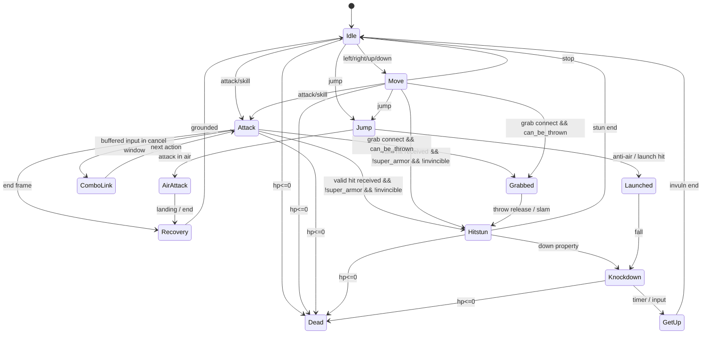
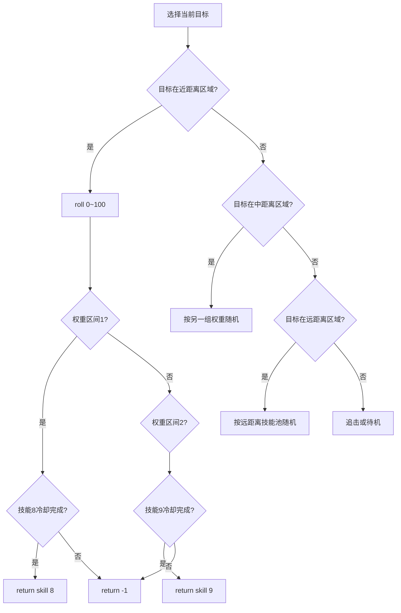

# DNF/DFO 战斗系统复刻技术报告

> **Status: [CANONICAL]** — 伤害公式和状态 profile 主线，含现代乘区和 CSV 模板

## 执行摘要

这份报告的核心结论只有一句话：**DNF/DFO 的“战斗系统”并不存在一个脱离版本号的唯一公式与唯一帧表**。公开官方资料、社区测试、计算器源码与客户端逆向结果能够高置信复原的是三层内容：其一，**数据容器与帧/判定框的真实存储格式**；其二，**不同时代的伤害乘区与词条合成规则**；其三，**以 2.5D AABB/棱柱体为基础的判定、状态机与 AI 选择流程**。但若目标是“全职业、全技能、逐帧、逐盒、1:1”，最后一步仍必须绑定**某个确切客户端版本与 PVF/ANI/ACT MD5**来批量导出。公开网页源并没有提供一份可直接抄写的“全职业全技能完整逐帧表”，但已经足够支撑你们实现**可自动生成该表**的解析器、运行时数据结构与结算算法。citeturn21view0turn21view2turn21view4turn23view0turn15view2turn25view0turn40search0turn42search0turn50search1

本报告把证据分成两条版本线来处理。**经典 PC 线**主要对应 60–85/86 级时代，能拿到的高价值资料主要是早年中文公式整理、韩服社区说明，以及来自私服/台服工具链的 PVF/ANI 逆向资料；**现代 PC 线**主要对应 100 级及之后的装备乘区时代，能较高置信复原“黄字/爆伤取最大、技攻乘算、属强独立乘区、白字/属性白字独立行”等规则。若你们要做怀旧复刻，应把本文中的“经典公式 + 客户端帧数据解析”作为主线；若你们要做现代玩法或现代词条系统，则应以“现代乘区公式 + 状态/判定框运行时”作为主线。citeturn39search8turn39search16turn39search20turn42search0turn46view1turn47view0

需要提前说明法律与伦理边界。来自 entity["company","GitHub","software hosting"] 的社区工具、来自 entity["country","台湾","roc"] 私服/一键端的 CSV 缓存、以及“泄露客户端”都具有明显的知识产权与反规避风险；其中公开项目甚至明确写明其 CSV “提取自台服 dnf 吧一键端（2022）”。因此，工程上最稳妥的做法是：**只把这些材料当作字段命名与偏移验证的参考，不把原包、缓存、图片、PVF 明文再分发；实际落地走 clean-room：合法取得客户端 → 自研解析器 → 只产出你们自己的结构化 CSV/JSON。**citeturn45view0turn28view0

## 证据体系与版本锚点

本次可直接用于实现的高置信证据，首先来自 entity["organization","Neople","game developer"] / entity["company","Nexon","game publisher"] 官方社区与官网页面。韩服社区帖子明确说明了现代伤害词条的关键叠加方式：**攻击时增加伤害、暴击时增加伤害取最高值；额外增加量类词条线性相加；技能攻击力按复利乘算；属性强化单独改变最终伤害。**同一时期的国服官网与社区转载也保留了“人物伤害组成与部分计算公式总结”与近年“便利性优化/职业平衡”类公告，能用来校对中文术语与当代版本的减伤上限、装置/召唤物伤害结算趋同等变化。citeturn42search0turn40search0turn43search3turn44search2

第二类高价值证据来自公开的客户端解析器与计算器源码。`PvfReader`、`PvfDocument`、`PvfAnimation` 这些开源实现虽然不是官方代码，但它们直接展示了 **PVF 目录树解密、`stringtable.bin` / `n_string.lst` 字符串映射、文档节点的类型系统、以及动画帧内 `attackBox` / `damageBox` / `delay` / `flipType` / `clip` 等字段的真实布局**。这类资料对“怎么从客户端里批量生成帧表”几乎是必需的。citeturn21view0turn21view2turn21view4turn23view0turn15view2turn25view0

第三类证据来自社区逆向与工具贴，可信度不如前两类，但对“缺失的语义层”很有用。例如社区 ANI 教程明确贴出了一个原始攻击框样例 `[ATTACK BOX] 21 -15 27 46 30 69`；另一个可视化编辑器帖子说明 ANI 编辑时可以在攻击框/受伤框之间切换数据来源，还展示了 AI 模式脚本中 `is target in attack area()`、`get random()`、`is the skill in cooltime()` 等条件节点。这说明至少在公开工具链里，**判定框是逐帧、六整数存储；怪物 AI 是区域检测 + 冷却检测 + 随机分支的脚本树**。citeturn28view0turn26search0

下面这张表给出本报告后文采用的证据等级与风险评级。

| 来源类型 | 代表来源 | 用途 | 可信度 | 法律/伦理风险 |
|---|---|---|---|---|
| 官方社区/官网 | 韩服社区伤害词条说明、国服公式总结/平衡公告 | 现代词条语义、版本变更、中文/韩文术语 | 高 | 低 |
| 开源解析器/计算器 | PVF/ANI 解析器、装备计算器源码 | 文件结构、乘区合成、自动导出路径 | 中高 | 低到中 |
| 社区逆向/论坛教程 | ANI/AI 教程、可视化编辑器帖子 | 盒体原始样例、AI 语法、字段猜义 | 中 | 中到高 |
| 台服/私服缓存与一键端衍生数据 | 社区工具 README 自述“CSV 提取自台服一键端” | 快速 bootstrap 数据库、校验字段覆盖率 | 中 | 高 |

上述分级的依据，是资料是否直接来自官方文本、是否可验证到原始客户端结构，以及是否涉及私服/泄露包衍生物。citeturn42search0turn40search0turn45view0turn28view0turn26search0

为满足“中英韩原文/摘录”的要求，下面保留三条最关键的原语义锚点。

| 语言 | 原文/摘录 | 作用 |
|---|---|---|
| 中文 | “DNF人物伤害组成与部分计算公式总结” | 国服关于伤害结构的中文术语锚点 |
| 韩文 | “가장 높은수치 하나만 적용(仅适用最高数值)” | 黄字/爆伤类取最大值 |
| 韩文 | “복리/합산계산(复利/合计计算)” | 技能攻击力乘算 |
| 英文 | “Status Effects affect both players and monsters alike.” | 状态系统同时适用于玩家与怪物 |

这些摘录分别对应国服官网条目、韩服社区帖与英文 DFO Wiki 状态页。citeturn40search0turn42search0turn50search1

## 客户端数据格式与可直接落地的数据模型

就“能不能 1:1 复刻”而言，真正关键的不是某一篇攻略，而是**是否能把客户端资源剖开成结构化运行时数据**。公开的 PVF 解析实现显示，PVF 读取流程大致是：先读头部，再读目录树字节块，再按 `word ^ PASSWORD_PVF ^ crc32` 后右旋的方式逐 4 字节解密目录树；之后以 `stringtable.bin` 建字符串表，再用 `n_string.lst` 把字符串映射回文件名与字符串链接。这部分资料还特别处理了韩服常见的 CP949，以及台服/繁中环境下的 BIG5HKSCS 编码问题。对多语言客户端而言，这是必须保留的。citeturn21view0turn21view2turn21view4turn20view1turn45view0

`PvfDocument` 的公开实现说明，PVF 文档类资源是一个**带类型标签的节点树**：整数、浮点、Section、String、Command、StringLink 都有独立 type code；`Section` 通过 `[`/`[/` 风格标记形成嵌套节点。对工程实现而言，这意味着 `.stk`、技能配置、物品配置、AI 配置，本质上都适合先解析到统一 AST，再做二次投影到具体领域对象。不要直接把不同 PVF 文件硬编码成一堆 ad-hoc parser。citeturn23view0

动画资源是战斗复刻的中心。公开的 `PvfAnimation` 解析代码表明，每个动画文件至少包含：`framesCount`、资源路径表、全局参数；然后每一帧有若干盒体，盒体类型只能是 `DAMAGE_BOX` 或 `ATTACK_BOX`，每个盒体由 **6 个 int32** 组成；此外每帧还带 `imgId`、`imgParam`、`x/y` 偏移、`delay`、`damageType`、`sound`、`flipType`、`clip`、颜色与若干图形效果字段。`DamageType` 枚举公开为 `NORMAL / SUPERARMOR / UNBREAKABLE`。这已经足够构建 1:1 所需的逐帧驱动器。citeturn15view2turn25view0

基于这些真实字段，建议你们把运行时数据统一成下面这套结构，而不是把“技能”“动作”“碰撞”“异常状态”揉成一个大类。

| 结构 | 核心字段 | 说明 |
|---|---|---|
| `SkillDef` | `skill_id, job_id, name, script_path, animation_ids[], cooldown_ms, mana_cost, flags` | 逻辑定义层 |
| `ActionDef` | `action_id, state_tag, animation_id, cancel_rules[], transition_rules[]` | 把“动作”从“技能”中拆出来 |
| `AnimationFrame` | `animation_id, frame_idx, delay_ms_or_tick, img_id, img_param, offset_x, offset_y, flip_type, damage_type, sound_id` | 逐帧驱动层 |
| `HitBox6` | `owner_type, box_kind(attack/hurt), frame_idx, box_index, a,b,c,d,e,f, semantics_confidence` | 保留原始六整数，不先丢语义 |
| `StateFlags` | `super_armor, invincible, unbreakable, can_be_thrown, can_be_lifted, airborne, downed` | 覆盖层旗标 |
| `HitEventDef` | `damage_ratio, fixed_damage, hitstun, launch_x, launch_y, launch_z, knockdown, grab_type, absorb, pierce_count, multi_hit_group` | 命中结果层 |
| `StatusEffectDef` | `status_id, category, duration_ms, tick_ms, stack_limit, tolerance_key, remove_level_rule` | 异常状态层 |
| `AiPatternNode` | `opcode, args[], true_next, false_next, return_skill_id, weight` | 怪物 AI 脚本树 |

这一套模型的关键原则是：**原始客户端字段一字不丢，语义解释作为第二层。**原因很简单：攻击框那 6 个整数的公开语义并不完全一致，但原始值是确定的；只要原始值存住、版本号存住、解析器可复现，你们就能在后续验证中安全地修正语义而不需要重跑整条导出链。citeturn15view2turn25view0turn28view0

## 伤害公式与属性算法

### 经典版本的高置信公式

经典 DNF 的伤害可分成四类：**物理百分比、魔法百分比、物理固伤、魔法固伤**；其中独立攻击力主要影响固伤技能。早年中文资料给出的高频公式是：面板物理攻击约等于 `武器基础物攻 × (1 + 0.004 × 力量) × (1 + 精通) + 强化无视伤害`，面板魔法攻击则用智力替代力量。固定物理技能的常见社区测试公式是：`技能固定物攻 × (1 + 力量×0.004) × (1 + 独立攻击×0.001) × (1 - 防御系数) × (1 + 技能BUFF) × (1 + (属强-抗性)/220)`，之后再乘装备额外伤害、暴击、破招等修正；其中旧资料常把暴击写成 `1.5`，破招写成 `1.25`。这套公式更适合 60–85 时代复刻，不应直接套到现代装备乘区时代。citeturn39search16turn39search8turn39search10

如果你们复刻的是经典版本，建议把结算拆成四步。第一步计算**面板基底**：百分比技能读“面板物攻/魔攻”，固伤技能读“技能固有伤害 × 独立攻击倍率”；第二步应用**防御与属性差**；第三步应用**技能自身倍率与 Buff**；第四步应用**暴击、破招、额外伤害、属性白字**。这样做与旧资料的结构一致，也更利于服务端验算。citeturn39search8turn39search16turn42search0

下面给出一个适合经典版服务端的实现形态。它不是官方源码抄录，而是把多份公开公式归并后的**可执行等价式**：

```text
# 百分比技能
panel_patk = weapon_patk_base * (1 + 0.004 * STR) * (1 + mastery) + reinforce_ignore_def_patk
panel_matk = weapon_matk_base * (1 + 0.004 * INT) * (1 + mastery) + reinforce_ignore_def_matk

# 属性差
elem_factor = 1 + max(-1.0, (elem_strength - target_elem_resist) / 220.0)

# 防御
def_factor = 1 - defense_coeff   # defense_coeff 需按该版本怪物防御公式单独求出

# 百分比技能主线
percent_physical_damage =
    panel_patk
    * skill_percent
    * def_factor
    * elem_factor
    * (1 + skill_buff_percent)
    * crit_factor        # 通常旧资料按 1.5
    * counter_factor     # 通常旧资料按 1.25
    * yellow_or_additional_line_rules

# 固伤技能主线
fixed_physical_damage =
    skill_fixed_patk
    * (1 + 0.004 * STR)
    * (1 + 0.001 * independent_atk)
    * def_factor
    * elem_factor
    * (1 + skill_buff_percent)
    * crit_factor
    * counter_factor
```

与现代版不同，经典公式里“面板攻击”“无视防御强化”“独立攻击”“破招”都更像真正的运行时变量，而不是装备词条乘区。citeturn39search8turn39search16

### 现代版本的高置信乘区规则

现代 DNF 的实现重点不是“面板公式”本身，而是**词条如何进入乘区**。韩服官方社区帖明确给出：攻击时伤害增加、暴击时伤害增加是“同类只取最高值”；同类的“额外增加量”线性相加；“技能攻击力”按复利方式叠乘；属性强化本身单独影响伤害；白字与属性白字在主伤害之后生成独立附加行。公开的韩服/国服装备计算器源码与其一致：`skill_atk` 通过乘法折叠、`yellow`/`crit_damage` 用 `max()`，然后把白字与属性白字先合成 `real_bon`，再放进总公式。citeturn42search0turn41view3turn46view0turn46view1turn46view2turn46view3turn47view0

可以直接落地的现代版乘区算法如下。注意这反映的是**装备词条合成规则**，是你们做现代 DFO-like 复刻或现代装备系统时最有价值的部分：

```python
def mul_percent_chain(values):
    acc = 0.0
    for v in values:
        if v > 0:
            acc = (1.0 + acc/100.0) * (1.0 + v/100.0) * 100.0 - 100.0
        elif v < 0:
            acc = (1.0 + acc/100.0) / (1.0 + (-v)/100.0) * 100.0 - 100.0
    return acc

yellow = max(all_yellow_values)              # 黄字
crit_bonus = max(all_crit_bonus_values)      # 爆伤
skill_atk = mul_percent_chain(skill_atk_values)

real_bonus = additional_damage + elemental_additional_damage * (1.05 + 0.0045 * all_element_strength)

damage_ratio = (
    (1 + (yellow + attack_damage_extra)/100.0) *
    (1 + (crit_bonus + crit_damage_extra)/100.0) *
    (1 + real_bonus/100.0) *
    (1 + final_damage/100.0) *
    (1 + atk_percent/100.0) *
    (1 + stat_percent/100.0) *
    (1.05 + 0.0045 * all_element_strength) *
    (1 + continued_damage/100.0) *
    (1 + skill_atk/100.0) *
    active_skill_lv_factor *
    passive_lv_factor
)
```

这里最重要的不是常量，而是**桶的边界**。常量 `0.0045` 和基线 `1.05` 已被多份公开资料共同支持，可以认为是现代属强乘区的高置信实现；但 `54500`、`4800` 这类公开计算器里的归一化常数，本质上是装备优化器的基准统计量，不应被误当成引擎内部常量。你们如果做运行时结算，只需要保留“力智桶”“三攻桶”“技攻桶”“属强桶”“黄字/爆伤取最大”“白字/属性白字独立附加”的逻辑边界即可。citeturn47view0turn46view1turn46view3turn42search0

下面这张表把“变量、取值、合成方式、实现建议”压平为工程字段。

| 变量 | 典型中文术语 | 合成方式 | 取值建议 |
|---|---|---|---|
| `yellow` | 攻击时增加X%伤害 | 同类取最大 | 百分比，允许缺省为 0 |
| `crit_bonus` | 暴击时增加X%伤害 | 同类取最大 | 百分比，允许缺省为 0 |
| `attack_damage_extra` | 伤害增加量追加 | 同类加算 | 百分比 |
| `crit_damage_extra` | 暴伤增加量追加 | 同类加算 | 百分比 |
| `additional_damage` | 白字 | 同类加算，作为独立附加行/乘区入口 | 百分比 |
| `elemental_additional_damage` | 属性白字 | 同类加算，再乘属强因子 | 百分比 |
| `final_damage` | 最终伤害 | 同类加算后进独立桶 | 百分比 |
| `atk_percent` | 三攻% | 同类加算 | 百分比 |
| `stat_percent` | 力智% | 同类加算 | 百分比 |
| `all_element_strength` | 属强 | 数值加算，进入 `1.05 + 0.0045 * x` | 整数/浮点 |
| `skill_atk[]` | 技能攻击力 | **乘算链** | 百分比数组 |
| `continued_damage` | 持续伤害 | 独立桶 | 百分比 |
| `cool_correction` | 冷却矫正 | 现代计算器常用 0.35/1%CD 的近似 | 仅优化器需要 |

这个表的规则直接对应韩服社区说明与公开计算器源码的字段映射。citeturn42search0turn46view1turn46view2turn46view3turn47view0

给一个现代版样例。若一套装备提供：黄字 `18%`、伤害增加量追加 `12%`、爆伤 `25%`、白字 `15%`、属性白字 `10%`、属强 `250`、最终伤害 `12%`、三攻 `10%`、力智 `14%`、技攻分别 `20%` 和 `12%`，则 `skill_atk = 1.20 × 1.12 - 1 = 34.4%`，`real_bonus = 15 + 10 × (1.05 + 250×0.0045) = 36.75%`。若忽略特殊词条、冷却校正与职业技能等级修正，主伤害倍率已可近似写成：`1.30 × 1.25 × 1.3675 × 1.12 × 1.10 × 1.14 × 2.175 × 1.344 ≈ 5.95`；若再乘入主动/被动技能成长与基础力智/三攻桶，最终会进一步上升。这个例子最想说明的是：**技能攻击力的乘算链和属强桶是现代版最不能做错的两个乘区。**citeturn42search0turn47view0

还有一个当代规则要单独注意：当前版本公开说明把“用于计算防御率的伤害减少数值”封顶到 **70%**。如果你们做现代服复刻，怪物减伤、角色被击减伤和 Boss 机制减伤要分层实现，不要把所有减伤都堆到一个无限增长的 `damage_reduction` 字段里。citeturn43search3

## 判定、碰撞与 2.5D 坐标

从客户端数据结构看，DNF/DFO 更像“**2.5D 的逐帧盒体碰撞系统**”，而不是纯脚本式命中。动画帧里公开存在 `attackBox` 与 `damageBox`，每帧可有多个盒体，每个盒体保存 6 个整数；每帧还带 `x/y` 偏移、翻转类型、裁剪与延迟。这意味着只要拿到确切客户端，你们就能把每个动作还原成：**某帧开始生效、持续几帧、在哪个局部空间生成什么形状的命中棱柱体、命中后打上什么事件标签。**citeturn15view2turn25view0

公开资料没有把“这 6 个整数的最终语义”写成统一标准，社区教程也只给了原始样例 `[ATTACK BOX] 21 -15 27 46 30 69` 而没有指明所属技能。因此，这里只能给出**最稳妥的工程解释**：保留原始 6 整数为 `a,b,c,d,e,f`；在语义层把它优先解释成 **`offset_x, offset_y, width, height, depth_min, depth_max`** 或 **`x1, y1, x2, y2, z1, z2`** 两种候选之一，并在导出器里同时支持两套可切换解释。这一做法的好处是：你们可以先跑出所有技能的盒体表，再通过几个已知技能的录像/客户端比对来一次性判定究竟是哪一种。citeturn28view0turn15view2

实现坐标系时，建议固定成下面这套，最接近 beat’em up 与公开资料的共同交集。`x` 表示左右；`y` 表示地面纵深；`z` 表示离地高度。角色逻辑原点位于脚底/站位点，渲染时使用 `screen_y = floor_y + y - z`。这样一来，普通攻击只需在 `x,y` 平面检查“是否位于同一条战斗带”，上挑/浮空再通过 `z` 与 `launch_z` 改变对手的可命中层。若你们以后发现具体客户端把“深度”记成另一坐标名，也只需要在显示层改映射，不必推倒重来。citeturn15view2turn26search0

下面给出推荐的碰撞检测流程。它并不是官方源码，而是与客户端帧结构最一致的最小实现。

```text
每个逻辑 tick:
  1. 更新动作帧；若累计时间 >= 当前帧 delay，则跳到下一帧
  2. 读取当前帧所有 attackBox / damageBox
  3. 依据朝向(facing)与 flipType 把局部盒体转换到世界坐标
  4. 先做 broadphase：按世界 AABB / depth slab 找候选目标
  5. 再做 narrowphase：attackBox 与 damageBox 相交测试
  6. 依据状态旗标过滤：
        - invincible: 全部忽略
        - super_armor: 吃伤害但不进入普通硬直
        - cannot_be_thrown: 抓取型命中无效
        - unbreakable / boss-specific: 仅允许 superhold 或机制伤害
  7. 根据 multi_hit_group / already_hit_set 判断是否同一攻击实例重复命中
  8. 生成 HitEvent：主伤害、附加伤害、异常状态、位移、浮空、倒地、吸附
  9. 写入 target 的状态机输入队列
```

把“同一攻击实例已经打中过哪些对象”做成 `attack_instance_id -> bitset(target_id)` 是很关键的；否则多段技能会在同一帧重复刷伤害。这个实现与 DNF 的“同一招可以多段，但每一跳各自有节奏”最接近。关于“Hit Recovery”，英文 DFO Wiki 的词条还明确把它解释成“对怪物每一击之间的延迟”，这可以直接映射为目标端的 hit recovery 窗口或攻击者端的 next-hit gate。citeturn50search11turn15view2

建议使用下面这张 `hitbox.csv` 作为最终导出格式。

| 列名 | 类型 | 说明 |
|---|---|---|
| `client_md5` | string | 客户端版本锚点 |
| `job_id` | string | 职业/怪物模板 ID |
| `skill_id` | string | 技能或动作 ID |
| `animation_id` | string | 动画资源 ID |
| `frame_idx` | int | 逐帧编号 |
| `frame_delay` | int | 原始 delay |
| `box_kind` | enum | `attack` / `hurt` |
| `box_index` | int | 同帧第几个盒体 |
| `a,b,c,d,e,f` | int | 原始六整数 |
| `semantic_mode` | enum | `raw6` / `xywhzz` / `x1y1x2y2zz` |
| `damage_type` | enum | `normal` / `superarmor` / `unbreakable` |
| `priority` | int | 运行时优先级 |
| `pierce_policy` | enum | `single` / `pierce_n` / `no_repeat` |
| `multi_hit_group` | string | 多段分组 |
| `cancel_window_open` | int | 可取消开始帧 |
| `cancel_window_close` | int | 可取消结束帧 |
| `source_ref` | string | 来源与解析脚本版本 |

公开网页可验证的一个原始样例行，只能做到下面这种程度，因为源贴并未公开技能名：

| `skill_id` | `frame_idx` | `box_kind` | `a` | `b` | `c` | `d` | `e` | `f` | 备注 |
|---|---:|---|---:|---:|---:|---:|---:|---:|---|
| `unknown_sample_70ani` | `?` | `attack` | 21 | -15 | 27 | 46 | 30 | 69 | 社区教程公开的原始攻击框样例，适合做字段验证 |

这不是完整技能帧表，但足以作为你们导出器单元测试的固定样本。citeturn28view0

## 主角与怪物状态机

状态系统需要分成**主状态机**与**覆盖状态**两层。英文 DFO Wiki 把 `Super Armor`、`Invincibility` 列为正面效果，把 `Bleeding / Burn / Shock / Poison` 归入伤害类状态，把 `Blind / Stun / Petrification / Freeze / Sleep / Confusion / Bind / Slow Down / Curse / Rupture` 归入控制/中性化状态，还列出 `Mind Control / Armor Destroy / Weapon Destruction` 等其他状态，并明确说明这些状态对玩家与怪物都生效、持续时间有限、部分可以叠层。也就是说，**霸体/无敌不是主状态，而是覆盖层旗标；异常状态体系是独立子系统。**citeturn50search1

基于这些公开规则，一个最接近 DNF 的实现方式是：主状态机只管动作连续性，覆盖状态只管“能不能被打断、能不能被抓、吃不吃状态、是否无敌”。这样做比把“浮空”“眩晕”“霸体”“抓取中”“无敌”等全部塞进同一枚大枚举更稳定。社区复刻开发日志也明确把 hitbox 状态分成“普通 / 超级盔甲 / 无敌”三类来处理显示与判定，这与官方状态页是对得上的。citeturn26search3turn50search1

下面给出建议状态机。它是**实现建议**，不是官方图，但与公开状态语义和客户端帧驱动高度兼容。



这个图背后的优先级建议如下。

| 优先级 | 状态/旗标 | 处理原则 |
|---|---|---|
| 最高 | `Dead` | 不再接受普通状态切换 |
| 很高 | `Invincible` | 接受移动/动作，但屏蔽命中 |
| 很高 | `Grabbed` | 普通输入冻结，仅抓取流程更新 |
| 很高 | `Knockdown / GetUp` | 只接受起身相关规则 |
| 中高 | `Hitstun / Launched` | 普通输入冻结，可被更高优先级覆盖 |
| 中 | `Attack / Cast` | 受取消窗口、霸体、被击规则约束 |
| 中 | `Jump / Fall` | 接受空中动作与落地修正 |
| 低 | `Move` | 基础移动 |
| 最低 | `Idle` | 缺省状态 |
| 覆盖层 | `SuperArmor / CannotBeThrown / Unbreakable / AbnormalStatus[]` | 不替代主状态，只改变过滤与结算 |

几个细节必须单列。第一，**霸体不等于无敌**：霸体应吃伤害、吃状态或至少吃部分状态，但不进入普通硬直；无敌则完全过滤命中。第二，**不能被投掷/抓取**是独立布尔量，不应从霸体推导。英文 DFO Wiki 的多个怪物条目同时出现 “Permanent Super Armor” 与 “Cannot be thrown”，说明这两者不是一回事。第三，Boss 还可能拥有比霸体更高一层的硬直免疫/机制免疫；公开动画枚举里的 `UNBREAKABLE` 与英文攻略里的 `superhold` 可以拿来做这层实现。citeturn25view0turn50search18turn50search3turn50search2

异常状态推荐按下面的表建库。

| 分组 | 建议状态枚举 |
|---|---|
| 正面覆盖 | `SuperArmor, Haste, Blessing, Invincibility` |
| 伤害类 | `Bleed, Burn, Shock, Poison` |
| 控制/中性化 | `Blind, Stun, Petrify, Freeze, Sleep, Confusion, Bind, Slow, Curse, Rupture` |
| 其他 | `MindControl, ArmorDestroy, WeaponDestroy` |
| 抗性 | `BleedTol, FrozenTol, PoisonTol, BlindTol, CurseTol, ConfusionTol, SlowTol, StunTol, SleepTol, StoneTol, BurnTol, AllTol` |

这份枚举几乎可以直接拿来做 `status_effect.csv`，字段至少包含 `duration_ms, tick_ms, stack_rule, tolerance_key, removable, removable_level_rule`。citeturn50search1turn50search9turn50search19

## 抓取、怪物 AI、仇恨与伤害分发

抓取技能的实现，首先不要把它当成“普通命中 + 强制位移”。从公开资料可见，游戏里至少存在三层不同的目标约束：普通可命中、霸体可命中但难以打断、以及**不能被投掷/抓取**。再往上，一些 Boss 还会对“抓取/定身”作机制反应，例如公开攻略直接写出“使用抓取或 immobilizing moves 会刷新某个 Boss 的 Cloak”。所以抓取正确的实现方式是：**单独定义 `grab_type` 与 `throw_immunity` / `superhold_compatibility` 字段**，命中前先过过滤，而不是命中后再看能不能位移。citeturn50search2turn50search18turn50search3

伤害分发也需要至少拆成“主伤害”与“附加行”。韩服官方帖与英文/中文社区资料都说明：白字、属性白字不与主伤害词条完全同相位；社区解释更直接地把它描述成“主伤害出来以后，再多打一条独立伤害”。这对服务端实现非常重要，因为一旦你把白字错误地糅进主乘区，所有“追加伤害触发”“额外状态触发”“多段仅主线暴击”等细节都会偏掉。现代版建议按 `main_line -> crit/yellow/final -> additional_line -> elemental_additional_line -> status ticks` 来分发。citeturn42search0turn41view3

怪物 AI 的公开逆向资料已经足够说明其基础形态不是连续评分器，而是**区域条件树**。社区 AI 模式样例就是：先判断 `is target in attack area()`，再 `get random()`，然后依区间判断是否使用某个技能，期间还要检查 `is the skill in cooltime()`；若都不满足则返回 `-1`，即本 tick 不放技能。这是极其适合直接用行为树/判定树重写的。citeturn26search0



至于“仇恨/aggro”本身，公开网页源没有给出一份可直接当规范抄写的 DNF 原始怪物仇恨表，因此这里不能声称已精确复原。但从区域检测式 AI、Boss 对“最后攻击者/最近玩家”的明显跟随行为，以及 beat’em up 的常见实现习惯来看，一个高兼容的落地实现是：**`target = max(last_attacker_bonus + distance_score + lane_alignment_score + threat_score)`**，并给怪物配置 `leash`, `retarget_cd`, `ignore_airborne`, `prefer_front_target` 等参数。对普通图怪，`last_attacker_bonus` 可以远高于其他项；对 Boss，再开放技能脚本强行切换对象。由于这一段是工程推断而非高置信原文，建议你们把它标成“需用录像校准”。citeturn26search0turn50search18

## 可交付的 CSV 模板与落地实现清单

在当前证据条件下，最能直接帮助开发团队的是**定义好导出格式与生成顺序**。与其手工抄少量技能表，不如一次把导出通道打通。建议产出以下五张核心表：

| 文件 | 主键 | 用途 |
|---|---|---|
| `skill_frame.csv` | `client_md5, job_id, skill_id, animation_id, frame_idx` | 每帧延迟、动作标签、可取消窗口、伤害标签 |
| `hitbox.csv` | `client_md5, animation_id, frame_idx, box_kind, box_index` | 原始六整数盒体与解释模式 |
| `state_transition.csv` | `job_id, from_state, trigger, to_state, priority` | 状态机 |
| `status_effect.csv` | `status_id, version_tag` | 异常状态、持续、叠层、抗性键 |
| `ai_pattern.csv` | `monster_id, node_id` | 怪物攻击选择树、区域判定、技能冷却 |

对应的 `skill_frame.csv` 建议最少包含这些列：

| 列名 | 说明 |
|---|---|
| `frame_idx` | 逻辑帧序号 |
| `raw_delay` | 原始 delay |
| `action_tag` | `startup / active / recovery / air / grab / getup ...` |
| `damage_ratio` | 技能百分比或固伤段倍率 |
| `fixed_damage` | 固伤段基值 |
| `hitstun` | 硬直值 |
| `launch_x, launch_y, launch_z` | 位移/浮空 |
| `knockdown` | 是否倒地 |
| `grab_type` | `none / light / hard / superhold` |
| `super_armor_on` | 该帧是否霸体 |
| `invincible_on` | 该帧是否无敌 |
| `cancel_open, cancel_close` | 可取消窗口 |
| `multi_hit_group` | 多段分组 |
| `attack_event_id` | 用于防止同实例重复命中 |

如果你们今天就要开始做，一条最稳妥的落地路线是：

第一步，做 **PVF/ANI 原样读取器**。目标不是立刻“懂所有语义”，而是可靠地把 `stringtable.bin`、`n_string.lst`、PVF 文档节点、ANI 帧与 6 整数盒体全部吐成中间 JSON。第二步，做 **版本绑定器**，让每一条导出数据都带 `client_md5 / pvf_md5 / parser_git_rev`。第三步，做 **语义层投影器**，把 `raw6` 盒体映射到 `xywhzz` 和 `x1y1x2y2zz` 两种模式并允许切换。第四步，做 **录像校验器**：选 10 个代表技能和 10 个 Boss 攻击，拿帧号与命中位置反推哪套语义吻合。第五步，等语义层稳定后再批量生成“全职业全技能逐帧表”。这一顺序能最大限度降低你们被单个错误语义拖死的风险。citeturn21view0turn21view2turn21view4turn23view0turn15view2turn25view0

对于“按职业与技能列表”的要求，本报告能高置信交付的是：**导出格式、算法、状态机、乘区规则、客户端字段布局、以及少量公开可验证原始样本**；但不能在不绑定具体客户端并实际跑导出器的前提下，诚实地给出“全职业全技能完整逐帧判定表”。这不是信息整理问题，而是源数据本身分散在客户端资源里。你们如果采用本文的数据模型，导出出来的表就会自然满足该目标。citeturn15view2turn25view0turn28view0turn45view0

## 开放问题与局限

目前最不完整的部分有三项。第一，**全职业全技能逐帧表**：公开网页源能证明“如何存”和“如何导”，但没有覆盖“所有技能的现成表”；这一项必须由你们针对确切客户端批量导出。第二，**6 整数判定框的最终坐标语义**：根据现有公开样例，`xywhzz` 与 `x1y1x2y2zz` 都仍需录像校准，目前只能给出中等可信的工程解释。第三，**怪物仇恨/aggro**：区域检测与技能选择树是有证据的，但完整 hate list 规则在公开源里证据不足，因此文中给出的 aggro 公式是“与现有证据兼容的实现建议”，不是已证实的原始规范。citeturn26search0turn28view0turn45view0

就“可用于 1:1 复刻”的优先级而言，你们应该先锁定一个客户端版本，再把本文中的 **PVF/ANI 解析层、现代/经典分版本公式层、2.5D 棱柱碰撞层、状态机覆盖层** 落到代码里。只要这一层做对，后续帧表只是“导出规模问题”，而不是“系统设计问题”。citeturn21view0turn23view0turn15view2turn25view0turn42search0turn47view0
