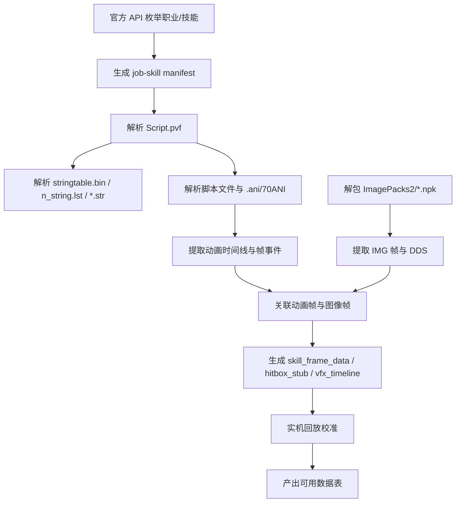
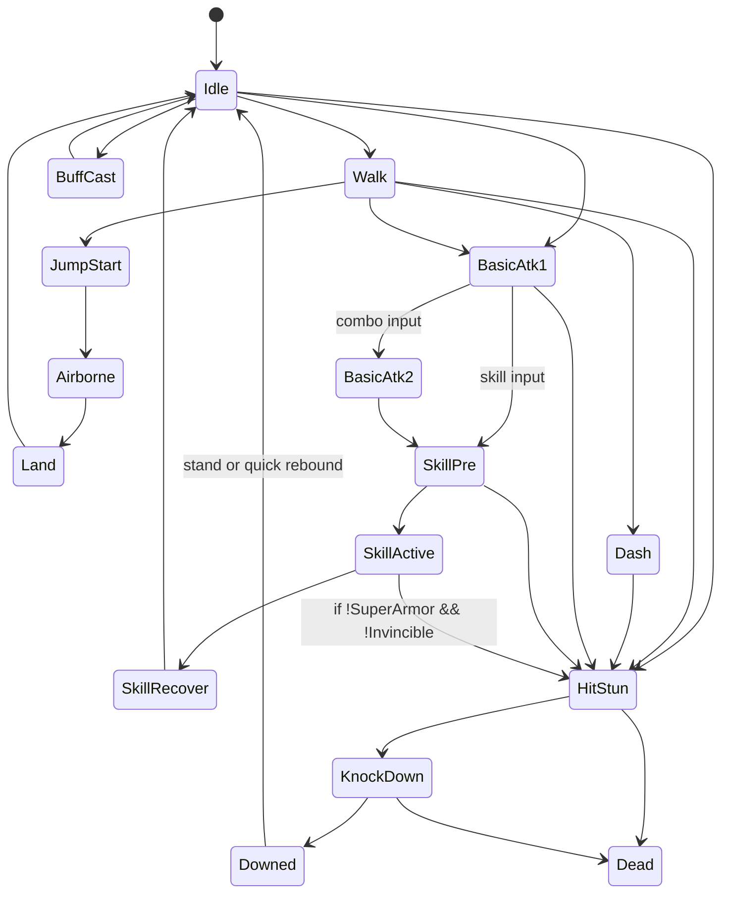
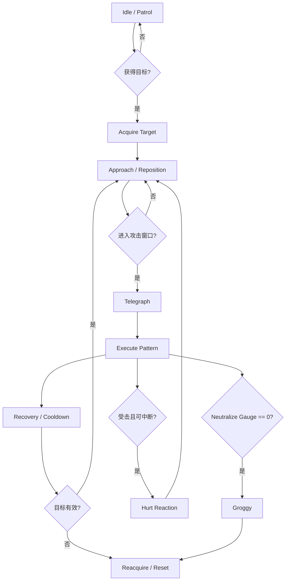
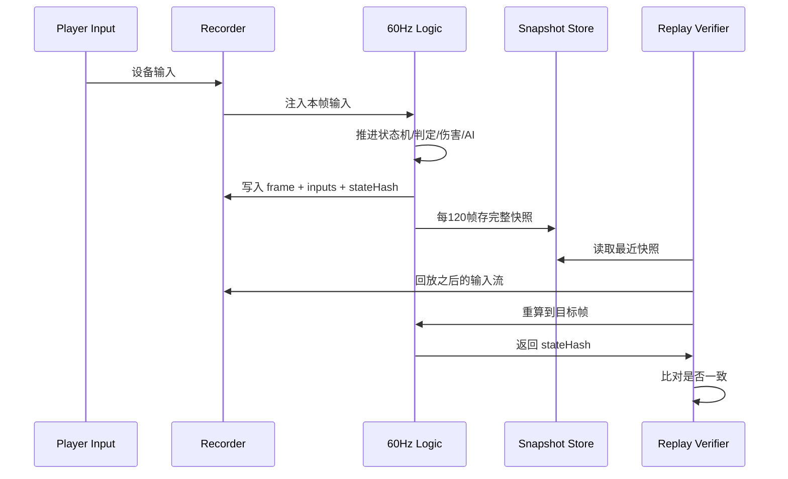
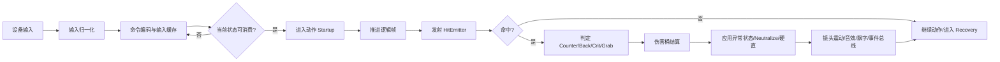

# DNF/DFO 战斗系统复刻技术报告

> **Status: [CANONICAL]** — PVF/ANI/NPK 抽取工具链主线，按目标/数据表/测试用例组织

## 执行摘要

这份报告的结论很明确：如果目标是给开发团队提供**可落地的 1:1 复刻资料**，公开资料能直接给到的，主要是**战斗系统骨架**、**现代伤害层的数学规则**、**状态异常与无力化/反击等系统规则**、**资源包与脚本文件的解析入口**；而**“全职业全部技能”的逐技能命中框、受击框、逐帧启动/持续/后摇表**，公开官方资料并没有完整发布，必须通过**合法取得的正式客户端**中的 `Script.pvf` 与 `ImagePacks2/*.npk` 自动化抽取，再用实机录制或脚本回放做拟合校准。官方 API 可以枚举职业、技能与部分技能链数据，但不能直接提供 hitbox/hurtbox/frame data。citeturn10view0turn8search7turn45view0turn13view3turn25view1

从工程实现角度，最稳妥的复刻模型不是“一套大公式 + 一堆硬编码”，而是六层拆分：**三轴空间层（X/Y/Z）**、**动作状态层**、**帧事件层**、**判定层**、**伤害层**、**反馈层**。公开资料已经足够支持以下高置信度事实：DNF/DFO 的战场不是纯 2D，而是带有 **X 轴、Y 轴、Z 轴** 的三轴判定；现代版本官方明示存在**反击（Counter）**、**无力化/点火/虚弱（Groggy）**、**无敌**、**超级护甲**、**伤害型异常**与**无力化型异常**；官方韩服指南与英文站说明了**百分比伤害 / 固定伤害**、**攻击力增加**、**最终伤害**、**冷却缩减**、**元素强化**等层的含义与计算方式；官方平衡说明又反向证明了数据层里长期存在 **Y 轴/Z 轴攻击范围、前后摇、击飞力、吹飞力、硬直度、自动索敌范围、可否命中倒地目标、聚怪/牵引、最大命中数** 这类字段。citeturn27search0turn44view2turn44view1turn31view0turn32view3turn40view0turn29view0turn43search6

本报告采用三档可信度标注：**A** 为官方指南/API/可直接验证的格式定义；**B** 为多源社区逆向且互相印证；**C** 为基于补丁说明、公开行为与客户端结构推导出的实现建议。对程序员而言，可直接使用的是：数据结构、状态机、命中流程、伤害流程、资源提取脚本入口、屏幕反馈规则；对策划而言，可直接使用的是：字段词典、判定参数表、异常参数表、受击反应表、评分/表现层模板。citeturn10view0turn13view3turn17view0turn18view0turn40view0turn44view2

## 证据层级与资源提取

### 目标

建立一条**能覆盖全部职业、技能、怪物、地图**的法定数据链路：先用官方公开接口做清单枚举，再对本地客户端资源做自动抽取，最后用实机回放校正帧与判定差异。官方韩服开发者中心提供职业与技能接口，且在 2026 年 3 月为角色技能样式接口新增了 `chain` 字段；客户端脚本与资源的公开可检索资料则表明，技能、怪物、地图、字符串、动画与图像包分别分布在 `Script.pvf` 与 `ImagePacks2/*.npk` 体系中。citeturn10view0turn8search7turn45view0turn17view0turn18view0

### 所需数据

| 数据资产 | 作用 | 公开证据 | 可信度 |
|---|---|---|---|
| `Script.pvf` | 技能、怪物、地图、装备、文本脚本主容器 | 社区公开 PVF 工具文档说明 PVF 为带目录的封包，包含文本文件与脚本文件，且可提取“副本地图、武器装备、技能”等内容；公开 PVF Reader 文档给出了 `ReadCommonFile` / `ReadFileContent` / `ReadLstFile` 等 API。 citeturn45view0turn13view3 | A/B |
| `stringtable.bin` | 脚本字符串表，Type 6/7/8/10 的引用目标 | 工具文档明确说明 `stringtable.bin` 保存脚本中的字符串引用，损坏会影响全部脚本。 citeturn45view0 | B |
| `n_string.lst` 与各类 `.chn.str` / `.kor.str` | 字符串索引与本地化文本 | 工具文档说明 `n_string.lst` 维护字符串文件索引，每个目录通常都有 `.lst` 与 `.str`。 citeturn45view0 | B |
| `.ani` / 70ANI | 动画脚本与帧事件载体 | 工具文档说明 `.ani` 是特殊脚本文件；旧版为 70ANI，新版为普通脚本格式。 citeturn45view0 | B |
| `ImagePacks2/*.npk` | 角色、怪物、特效、UI 图像包 | NPK 逆向文档说明 NPK 为多媒体包，包含 IMG 索引与 SHA256 校验，IMG 再承载图像帧。 citeturn17view0turn18view1 | B |
| IMG V2/V4/V5/V6 | UI/地图/时装/技能特效图像帧 | IMG 文档说明：V2 常用于 UI、图标、地图；V4/V6 常用于时装；V5 技能特效大量使用 DDS。 citeturn18view0turn19view0turn19view1turn20view0 | B |
| Open API `/df/jobs` `/df/skills/:jobId` `/df/skills/:jobId/:skillId` | 全职业/全技能枚举、技能公共元数据 | 开发者中心文档给出这些接口，2026 年更新日志又给出技能链字段。 citeturn10view0turn8search7 | A |

### 精确公式与伪代码

公开文档已经足够支持下面这条**自动抽取流水线**。其中“PVF 解析”和“NPK/IMG 解包”有第三方开源实现可参考；`npk-api` 使用 Apache 2.0 许可，`OjoDnfExtractor` 使用 GPL-3.0，团队若直接复用源码，许可证选择会影响是否适合闭源内网工具链。citeturn25view0turn25view2



```python
def build_manifest(api_client):
    jobs = api_client.get("/df/jobs")
    manifest = []
    for job in jobs:
        skills = api_client.get(f"/df/skills/{job['jobId']}", params={"jobGrowId": job["jobGrowId"]})
        for s in skills:
            detail = api_client.get(f"/df/skills/{job['jobId']}/{s['skillId']}")
            manifest.append({
                "jobId": job["jobId"],
                "jobGrowId": job["jobGrowId"],
                "skillId": s["skillId"],
                "publicName": detail.get("name"),
                "chainMeta": None,   # 角色 style 接口补齐
            })
    return manifest


def extract_client_data(pvf, npk_root):
    pvf.read()
    strings = load_stringtable_and_str_files(pvf)
    scripts = extract_all_script_files(pvf, strings)
    anis = extract_all_ani_files(pvf, strings)
    images = extract_all_npk_img_frames(npk_root)
    return correlate(scripts, anis, images)
```

### 数据表

下面这张表给的是**建议直接交付程序员的基础原始表**，而不是最终运行时表。这样做的好处是：后续版本更替时只需要重跑抽取器，不需要人工重新录入。该拆分方式来自公开格式定义与官方 API 能力边界的结合。citeturn10view0turn13view3turn17view0turn45view0

| 表名 | 主键 | 关键字段 | 来源 | 用途 |
|---|---|---|---|---|
| `job_manifest.csv` | `jobId, jobGrowId` | 名称、觉醒链 | Open API citeturn10view0turn8search7 | 全职业覆盖 |
| `skill_manifest.csv` | `jobId, skillId` | 名称、级别、公开说明、链信息 | Open API citeturn10view0turn8search7 | 全技能覆盖 |
| `pvf_file_index.csv` | `path` | type、crc、size | PVF reader / tool docs citeturn13view3turn45view0 | 定位脚本 |
| `script_ast.jsonl` | `path` | labels、ints、floats、refs | 脚本文件格式文档 citeturn45view0turn13view3 | 技能/怪物/地图解析 |
| `ani_timeline.jsonl` | `path, clipId` | frameCount、events、links | `.ani/70ANI` 文档 citeturn45view0 | 帧数据抽取 |
| `img_frame_index.jsonl` | `imgPath, frameId` | width、height、x、y、frameW、frameH、compression | IMG 版本文档 citeturn18view0turn19view0turn19view1 | 图像框/锚点 |
| `sprite_ref_map.jsonl` | `clipId, frameId` | npk/img/frame ref | NPK/IMG 逆向文档 citeturn17view0turn18view1 | 动画-图像关联 |
| `live_calibration.csv` | `skillId, speedState` | 实测启动帧、有效帧、后摇帧 | 实机录制拟合 | 1:1 修正 |

### 实现注意事项

首先，**不要只靠 Open API**。它可以覆盖职业与技能枚举，但不能替代客户端提取；公开文档本身已经表明它只提供职业、技能、装备、角色样式等 REST 信息。其次，**不要只靠 NPK 图片包**。NPK/IMG 给的是图像帧与锚点，不足以还原技能逻辑，逻辑层仍需 PVF 脚本。第三，旧版 `.ani` 存在 **70ANI** 特殊编码，而新版又可能退回普通脚本格式，所以解析器不能把 `.ani` 当成一种固定格式硬写死。citeturn10view0turn45view0turn18view0

### 测试用例

| 用例 | 输入 | 预期 |
|---|---|---|
| PVF 完整性 | 载入 `Script.pvf`，读取 `stringtable.bin` 与若干 `.lst` | 脚本 AST 可稳定重建，字符串引用不丢失 |
| ANI 兼容性 | 同时输入旧版 70ANI 与新版普通 `.ani` | 两者都能生成统一 `ani_timeline` |
| NPK 图像索引 | 载入 V2、V4、V5、V6 各一例 | 均可还原帧大小、偏移、压缩类型、索引帧引用 |
| API 枚举完整性 | `/df/jobs` + `/df/skills/:jobId` 全量轮询 | 全职业技能清单与本地 PVF 路径映射一致，缺失项进入人工校验池 |

## 判定坐标与地图交互

### 目标

建立与 DNF/DFO 行为一致的**三轴判定模型**、**体积碰撞模型**与**地图触发模型**。公开英文社区机械说明明确写到，战场始终有 **X 轴、Y 轴、Z 轴**：X 是左右距离，Y 是前后走位深度，Z 是跳跃高度；韩服官方平衡说明进一步证明技能参数并不是一块二维矩形，而是长期存在**Y 轴范围、Z 轴范围、搜索范围、倒地命中开关**等独立字段。citeturn27search0turn29view0

### 所需数据

| 数据类别 | 字段 | 说明 | 可信度 |
|---|---|---|---|
| 角色/怪物体积 | `bodyRadiusX`, `bodyRadiusY`, `feetZ`, `headZ` | 用于推挤、站位、阻挡、受击基准 | B/C |
| 被攻击体积 | `hurtbox[]` | 站立/空中/倒地/抓取中分别配置 | B/C |
| 攻击体积 | `hitbox[]` | 随帧变化；支持 X/Y/Z、形状、是否可命中倒地 | B/C |
| 地图房间 | `roomBounds`, `blockingPoly[]`, `portalTrigger[]`, `hazardTrigger[]` | 房间边界、静态阻挡、门、机关、陷阱 | B/C |
| 索敌体积 | `searchVolume`, `searchRule` | 最近/最强/固定方向 | B/C |

### 精确公式与伪代码

1:1 复刻时，不建议把 hitbox 和 hurtbox 都建成屏幕矩形。更稳妥的是**屏幕投影仍是 2D，战斗判定是 3-axis**：
- **X**：左右线性距离。
- **Y**：纵深走位距离。
- **Z**：脚底到头顶的高度区间。
这样才能自然表达“斩击从你面前扫过，但因为你在另一条 Y 线没被命中”和“你跳起来避开低位扫地技”这两种典型 DNF 行为。citeturn27search0turn29view0

```python
@dataclass
class Volume3:
    x0: float
    x1: float
    y_center: float
    y_radius: float
    z0: float
    z1: float

def intersects_hit_hurt(hit: Volume3, hurt: Volume3) -> bool:
    if hit.x1 < hurt.x0 or hurt.x1 < hit.x0:
        return False
    if abs(hit.y_center - hurt.y_center) > (hit.y_radius + hurt.y_radius):
        return False
    if hit.z1 < hurt.z0 or hurt.z1 < hit.z0:
        return False
    return True
```

地图交互建议按“**房间局部坐标 + 触发体积**”做，而不是直接把美术贴图当地图。公开 PVF 工具文档已表明“副本地图”可以从 PVF 提取，说明地图逻辑与资源层是可分离的；NPK/IMG 文档也表明图像层与逻辑层分属不同容器。citeturn45view0turn17view0turn18view0

```python
def resolve_room_interaction(entity, room):
    # 静态边界
    entity.pos.x = clamp(entity.pos.x, room.min_x, room.max_x)
    entity.pos.y = clamp(entity.pos.y, room.min_y, room.max_y)

    # 阻挡体
    for block in room.blocking_polys:
        if block.overlap(entity.bodyXY()):
            entity.pos = push_out(entity.pos, block)

    # 门 / 传送
    for trigger in room.portal_triggers:
        if trigger.enabled and trigger.overlap(entity.bodyXY()):
            return RoomTransfer(trigger.to_room, trigger.spawn_point)

    # 地形机关
    for hazard in room.hazard_triggers:
        if hazard.overlap(entity.bodyXY()):
            hazard.apply(entity)
```

### 数据表

下面这张表建议直接作为策划填写模板与程序运行时定义的交集层。其字段名刻意与官方补丁里出现过的概念保持同语义，例如“Y 轴攻击范围”“Z 轴攻击范围”“可命中倒地”“搜索范围”“聚怪/拉扯”等。citeturn29view0turn41search0

| 字段 | 类型 | 含义 | 备注 |
|---|---|---|---|
| `hitboxShape` | enum | box / line / circle / sector / projectile | 统一到运行时 |
| `rangeX` | float | X 方向有效长度 | 公开补丁长期出现“攻击范围/射程/冲刺距离” |
| `rangeY` | float | Y 方向容差 | 官方补丁多次显式提到 Y 轴攻击范围 citeturn29view0 |
| `rangeZ` | float | Z 方向容差 | 官方补丁显式提到 Z 轴攻击范围 citeturn29view0 |
| `canHitDowned` | bool | 是否可打倒地 | 官方补丁多次出现“不能命中倒地敌人” citeturn29view0 |
| `searchRange` | float | 自动索敌距离 | 需要支持“1200px 内最强敌人”这类规则 citeturn41search0 |
| `searchRule` | enum | nearest / strongest / first / locked | 设计成可配置 |
| `pullStrength` | float | 拉扯强度 | 官方补丁出现“끌어들이는 힘(拉扯力)/范围” citeturn29view0 |
| `pushStrength` | float | 击退强度 | 与 blow-away 对应 |
| `launchStrength` | float | 击飞强度 | 与 띄우는 힘(击飞力) 对应 |
| `stiffness` | float | 造成硬直时长因子 | 对应官方“경직도(硬直度)” citeturn31view0 |

### 实现注意事项

最容易出错的地方有三个。第一，**body collision 不等于 hurtbox**。角色脚下推挤体积通常应比真正可受击面积更稳定，否则会出现“擦边后把对方推开导致明明剑已经贴脸但判定不到”的问题。第二，**倒地 hurtbox 必须单独配置**。官方补丁里多次出现“某技能改为不能命中倒地敌人”，说明倒地目标不是简单地沿用站立 hurtbox，只是 Z 变低而已。第三，**搜索体积与伤害体积要分开**。比如“先在 1200px 内选最强敌人，再在目标点生成多段黑风”这种规则，本质是“索敌体积 + 生成体积 + 命中体积”三段，而不是一个 hitbox 走到底。citeturn29view0turn41search0

### 测试用例

| 测试名 | 条件 | 预期 |
|---|---|---|
| Y 轴擦肩未命中 | 两目标 X 重叠，Y 超出技能 `rangeY` | 不命中 |
| 跳跃越过低位斩击 | 被击者 `hurt.z0` 高于技能 `hit.z1` | 不命中 |
| 倒地命中约束 | 目标为 `Downed`，技能 `canHitDowned=false` | 不命中 |
| 最强敌人索敌 | 范围内有 3 个目标，战力不同 | 生成点选择最强目标 |
| 房间边界夹持 | 冲刺技能越过 `room.max_x` | 角色停在边界，不穿墙 |

## 状态机与帧数据

### 目标

建立主角与怪物共用的**基础动作状态机**，再叠加 DNF/DFO 特有的**无敌、超级护甲、反击窗口、技能链、Buff 施放、受击、倒地、快速起身**等覆盖层；同时定义一套可以从客户端抽取并落到表格中的**启动/持续/后摇**模型。公开官方指南说明了攻击速度、施放速度、移动速度的基本作用，官方战斗系统指南说明了无敌、超级护甲、反击与无力化，英文社区资料则补充了超级护甲的几种细分类型，以及 Quick Rebound 会给短暂无敌。citeturn31view0turn44view2turn44view1

### 所需数据

| 数据类别 | 字段 | 用途 |
|---|---|---|
| 基础状态 | `Idle, Walk, Dash, JumpStart, Airborne, Land` | 移动与跳跃 |
| 攻击状态 | `BasicAtk[n], SkillPre, SkillActive, SkillRecover, BuffCast` | 攻击与 Buff |
| 受击状态 | `HitStun, Launch, KnockDown, Downed, Grabbed, Dead` | 受击反应 |
| 覆盖标志 | `Invincible, SuperArmor, CounterWindow, ChainBuffered, WeaponSwapLock` | 与主状态并存 |
| 帧事件 | `activeHitboxOn, projectileSpawn, moveCurve, cancelOpen, sfx, vfx` | 逐帧行为 |
| 速度组 | `attackSpeedGroup, castSpeedGroup, moveSpeedGroup, fixedTimeGroup` | 速度缩放 |

### 精确公式与伪代码

状态机建议分成“**主状态**”与“**覆盖标志**”两层，而不要把“霸体攻击中”“无敌攻击中”“霸体跳跃中”“无敌跳跃中”都展开成独立状态，否则状态数会爆炸。官方指南已经明示：无敌与超级护甲是“使用特定技能/ Buff 时叠加上的战斗状态”，非常适合做 bit-flag。citeturn44view2turn44view1



公开资料无法直接给出“每个技能的官方 frame data 表”，但已经能支持一个**可自动抽取的帧模型**：
- `.ani` / 70ANI 负责动画片段与帧顺序。
- IMG 帧提供图像宽高、绘制偏移、帧域宽高。
- 技能脚本负责逻辑参数与触发事件。
- 官方 API 负责公共技能清单与技能链。
这意味着程序上应先抽“**时间线**”，再从时间线上定义 `startup / active / recovery`。citeturn45view0turn18view0turn19view0turn10view0turn8search7

```python
@dataclass
class FrameSpan:
    start: int
    end: int
    kind: str  # startup / active / recovery / lock / cancel
    speed_group: str
    flags: set[str]

def derive_frame_data(timeline):
    first_active = find_first_frame(timeline, lambda e: e.type in {"hitbox_on", "projectile_spawn", "grab_start"})
    last_active  = find_last_frame(timeline,  lambda e: e.type in {"hitbox_on", "projectile_spawn", "grab_active"})
    first_cancel = find_first_frame(timeline, lambda e: e.type == "cancel_open")
    first_actionable = find_first_frame(timeline, lambda e: e.type == "actionable")

    return {
        "startup": (0, first_active - 1),
        "active": (first_active, last_active),
        "recovery": (last_active + 1, first_actionable - 1),
        "cancelOpen": first_cancel,
    }
```

### 数据表

| 运行时字段 | 说明 | 公开依据 | 可信度 |
|---|---|---|---|
| `startupFrames` | 输入后到首个有效 hit event 前 | 帧时间线推导 | C |
| `activeFrames` | hitbox 或 projectile 生效期 | 帧时间线推导 | C |
| `recoveryFrames` | 最后一次命中机会后到可行动 | 帧时间线推导 | C |
| `preDelay/postDelay` | 技能前摇/后摇 | 官方补丁大量显式写出“攻击前延迟 / 攻击后延迟” citeturn29view0 | B |
| `cancelWindow` | 连招/技能链窗口 | API 新增 chain 元数据；具体帧仍需提取/拟合 citeturn8search7turn10view0 | B/C |
| `superArmorWindow` | 霸体覆盖帧区间 | 官方补丁多次出现“删除/新增 슈퍼아머(超级护甲)” citeturn29view0turn44view2 | B |
| `invulWindow` | 无敌覆盖帧区间 | 官方指南与英文资料均说明无敌作为战斗状态存在 citeturn44view2turn44view1 | A/B |
| `hitConfirmRoute` | 命中后可转出的派生链 | 公共资料不足，需客户端/录像拟合 | C |

### 实现注意事项

速度缩放是复刻里第二容易翻车的点。官方只明确写到“攻击速度越高攻击越快、施放速度越高施法越快、移动速度越高移动越快”，但**没有公开“每一段帧如何缩放”**。现实中许多技能并不是把整个 clip 均匀缩放：有的只缩 `startup+recovery`，有的中间定格不缩，有的 cinematic 锁帧完全不吃速度。因此程序上不要写死 `actualFrames = baseFrames / (1 + speed%)`，而应给每个技能片段打 `speedGroup`，再由实机拟合反推。citeturn31view0turn45view0

推荐的做法是：
- `walk/dash/basicAttack` 默认走 `attackSpeedGroup`；
- `cast/buff/channel` 默认走 `castSpeedGroup`；
- `movement arc` 走 `moveSpeedGroup`；
- 过场、抓取演出、觉醒定格走 `fixedTimeGroup`；
- 所有“命中后才展开的分支”必须把 **miss / hit / counter-hit / super-armor-hit** 分开存。
这点对“未命中/命中/连招/破招/霸体/Buff/受击”分流尤其关键。citeturn44view2turn29view0

### 测试用例

| 测试名 | 条件 | 预期 |
|---|---|---|
| 基础三段普攻 | 无速度 Buff，按标准节奏连按 X | `BasicAtk1 -> BasicAtk2 -> BasicAtk3` |
| 命中确认派生 | 技能 A 未命中和命中各一次 | 命中时开放派生窗口，未命中则进入完整 recovery |
| 霸体受击 | `SkillActive + SuperArmor` 中被击中 | 承伤但不进入 `HitStun` |
| 无敌受击 | `Invincible` 期间受击 | 不承伤且不进入 `HitStun` |
| 快速起身 | 倒地后触发 Quick Rebound | 从 `Downed` 转回可控并进入短无敌 |

## 伤害属性与多目标命中

### 目标

给出可直接进入程序实现的**伤害结算流水线**，把历史版本与现代版本分层处理，同时定义**多目标、同目标多段、倒地命中、索敌命中**的执行顺序。公开官方资料已经确认：
- 百分比伤害吃物攻/魔攻，固定伤害吃独立攻击。
- 力量/智力会提高对应伤害。
- 元素强化会提高对应元素攻击伤害。
- 现代版本的**攻击力增加**是同层相加，**最终伤害**是乘层，**冷却缩减**按乘法合成。
此外，官方社区文章明确给出了 `r=(1+A/100)`、`Π(1+B_i/100)`、`c=100-100*Π(1-C_i/100)` 等现代层的计算法。citeturn32view3turn31view0turn32view0turn40view0

### 所需数据

| 数据类别 | 字段 | 说明 |
|---|---|---|
| 技能通道 | `damageChannels[]` | 每段可为物理百分比、魔法百分比、固定、异常附加等 |
| 攻击属性 | `elementType`, `elementOverride` | 火/水/光/暗/中性 |
| 现代装备层 | `attackIncreasePct[]`, `finalDamagePct[]`, `attackAmpPct[]` | 现代版本主层 |
| 冷却层 | `cooldownReducePct[]`, `cooldownRecoverySpeedPct[]` | 吞吐层 |
| 情景层 | `isCounter`, `isNeutralized`, `pvpScale`, `monsterTypeScale` | 战斗情景 |
| 多目标层 | `maxTargets`, `sameTargetCooldown`, `sortRule`, `searchRange` | 多目标命中 |

### 精确公式与伪代码

#### 经典核心层

官方中文社区文章给出了经典层与属性/攻击力之间最核心的线性关系：**伤害基本与 `(stat + 250) * attack` 成比例**；官方英文指南又明确区分了百分比伤害与固定伤害分别绑定物攻/魔攻与独立攻击。对 1:1 复刻来说，最好不要把“技能伤害”存成一个单值，而要存成**通道列表**。citeturn32view0turn32view3turn31view0

```python
def compute_legacy_base(attacker, skill):
    # 高置信度骨架：按通道计算，再乘 stat 层
    total = 0.0
    for ch in skill.damageChannels:
        if ch.kind == "PHYS_PERCENT":
            total += ch.coeff * attacker.physAtk
        elif ch.kind == "MAG_PERCENT":
            total += ch.coeff * attacker.magAtk
        elif ch.kind == "FIXED":
            total += ch.coeff * attacker.indepAtk
        elif ch.kind == "STATUS_APPLY":
            total += 0  # 不直接出直伤
    stat = attacker.strength if skill.attackClass == "PHYS" else attacker.intelligence
    return total * (stat + 250.0) / 250.0
```

这里必须明确一个边界：**公开资料没有给出覆盖全部时代、全部混合技能 tooltip 的“唯一官方整式”**。因此上面的通道化是面向复刻最安全的建模方式：它保留了百分比、固定、异常、追加线等层的独立性，后续可以继续通过实机结果反算系数，而不需要推翻整体架构。经典英文公式、韩服社区解释与官方 stat 文本能互相支持“通道化 + `(stat+250)` 乘层”这个骨架。citeturn37view0turn32view0turn31view0

#### 元素层

官方指南只写“各元素强化值越高，对应元素攻击伤害越高”；而韩服社区在 2019—2022 年多篇计算文中给出了可实用的结论：如果按**显示面板值**算，相对收益可用 `(新属性强化 + 233) / (旧属性强化 + 233)`；其原因是公开社区多次提到**隐藏 +11 基线**，因此等价的解析式可写成 `1 + (显示属性强化 + 11 - 目标属性抗性) / 222`。citeturn31view0turn34view0turn36search12turn36search1

```python
def compute_element_mul(attacker_display_ele, target_ele_resist):
    effective_ele = attacker_display_ele + 11 - target_ele_resist
    return 1.0 + effective_ele / 222.0
```

这一层需要特别提醒两件事。第一，团队经常在 220、222、233 三个数字上争论，其实公开社区资料已经说明：**233 是“显示属性强化值”口径下的相对收益常数，222 是“去掉隐藏 +11 并并入抗性后的有效属性强化”口径**。第二，低端与高端装备期对元素层的边际收益差异很大，策划不应把“每 +15 属强 = 固定 +x% 伤害”写死在设计 Excel 里。citeturn34view0turn36search12

#### 现代装备层

现代版本最可直接落地的三条公式如下：
- 攻击力增加总层：`attackIncreaseMul = 1 + ΣA_i / 100`
- 最终伤害总层：`finalDamageMul = Π(1 + B_i / 100)`
- 最终冷却缩减率：`c = 100 - 100 * Π(1 - C_i / 100)`
- 若再叠加冷却恢复速度 `D`，吞吐倍率：`r = (100 + D) / (100 - c)`。
这些公式都来自韩服社区对当前 115 版本装备词条的系统性拆解，并已用游戏内装备模拟器结果做过对照验证。citeturn40view0turn39view0

```python
def compute_modern_gear_mul(ctx):
    attack_increase_mul = 1.0 + sum(ctx.attackIncreasePct) / 100.0
    final_damage_mul = 1.0
    for fd in ctx.finalDamagePct:
        final_damage_mul *= (1.0 + fd / 100.0)
    return attack_increase_mul * final_damage_mul

def compute_dps_throughput_mul(ctx):
    c = 100.0
    remain = 1.0
    for cd in ctx.cooldownReducePct:
        remain *= (1.0 - cd / 100.0)
    c = 100.0 - 100.0 * remain
    D = sum(ctx.cooldownRecoverySpeedPct)
    return (100.0 + D) / (100.0 - c)
```

关于**攻击力增幅/攻击力 증폭(增幅)**，公开官方资料能确认它是现代词条体系中的独立概念，且常见于称号、宠物、神器等部位，但**我没有找到官方公开的闭式总公式**。因此，复刻时最稳妥的办法不是臆造结论，而是把它做成单独乘层 `attackAmpMul`，上线前用游戏内装备模拟器或录像数据回归拟合。这个点必须标注为 **C 级推导项**。citeturn40view0turn30search4turn38search6

#### 完整伤害流水线

```python
def compute_final_hit(attacker, target, skill, ctx):
    base = compute_legacy_base(attacker, skill)
    element_mul = compute_element_mul(attacker.get_display_ele(skill.elementType),
                                      target.get_ele_resist(skill.elementType))
    gear_mul = compute_modern_gear_mul(ctx)

    counter_mul = ctx.counterMul if ctx.isCounter else 1.0
    neutralize_mul = ctx.neutralizeMul if ctx.isNeutralized else 1.0

    crit_mul = 1.0
    if ctx.isCritical:
        crit_mul = 1.5 * (1.0 + ctx.skillCritBonus) * (1.0 + ctx.equipCritBonus)

    # defenseMul 与 attackAmpMul 留作可拟合层
    final = base * element_mul * gear_mul * ctx.attackAmpMul * ctx.defenseMul \
            * counter_mul * neutralize_mul * crit_mul * ctx.pvpMul

    return floor(final)
```

### 数据表

| 子系统 | 建议实现 | 证据 | 可信度 |
|---|---|---|---|
| 百分比/固定伤害通道 | 按 `PAtk/MAtk/IAtk` 分通道 | 官方英文指南明确区分两类伤害 citeturn32view3 | A |
| 经典 stat 层 | `(stat+250)/250` | 韩服社区公式说明 citeturn32view0 | B |
| 元素层 | `1 + (display+11-resist)/222` | 韩服社区多源公式与隐藏 +11 说明 citeturn34view0turn36search12turn36search1 | B |
| 攻击力增加 | `1 + ΣA/100` | 2025 词条计算文 citeturn40view0 | B |
| 最终伤害 | `Π(1+B_i/100)` | 2025 词条计算文 citeturn40view0 | B |
| 冷却缩减 | `100-100*Π(1-C_i/100)` | 2025 词条计算文 citeturn40view0 | B |
| 冷却恢复速度吞吐 | `(100+D)/(100-c)` | 2025 词条计算文 citeturn39view0 | B |
| 攻击力增幅 | 独立乘层，待模拟器拟合 | 公开资料不够封闭 | C |
| 防御层 | 独立函数，待假人/录像标定 | 官方只公开“防御会减伤”定义 citeturn31view0 | C |

### 多目标命中处理

官方平衡与装备说明已经反向暴露了多目标系统需要支持的字段：**Y/Z 轴范围、目标搜索范围、最大命中数、是否自动发射、是否聚怪、是否可打倒地、爆炸大小**。因此可直接把下列排序与去重逻辑落入工程。citeturn29view0turn41search0turn43search6

```python
def apply_attack_instance(attk, scene):
    candidates = scene.query(attk.searchVolume)

    # 过滤
    candidates = [
        t for t in candidates
        if t.isHostileTo(attk.owner)
        and not t.isInvincible()
        and attk.canAffectState(t.state)
        and intersects_hit_hurt(attk.hitVolume, t.currentHurtVolume())
    ]

    # 排序
    if attk.sortRule == "STRONGEST":
        candidates.sort(key=lambda t: (-t.priorityPower, t.spawnId))
    elif attk.sortRule == "NEAREST":
        candidates.sort(key=lambda t: (distance_xy(attk.origin, t.pos), t.spawnId))
    else:
        candidates.sort(key=lambda t: t.spawnId)

    results = []
    for t in candidates:
        if attk.sameTargetCooldownAlive(t.id):
            continue
        if attk.hitCountPerTarget.get(t.id, 0) >= attk.maxHitPerTarget:
            continue

        results.append(register_hit(attk, t))
        attk.hitCountPerTarget[t.id] = attk.hitCountPerTarget.get(t.id, 0) + 1
        attk.sameTargetCooldownRestart(t.id)

        if attk.maxTargets and len(results) >= attk.maxTargets:
            break

    return results
```

### 实现注意事项

多目标复刻最关键的是**“攻击实例”**这个中间层。不要把技能本体直接拿去对目标列表遍历；应当把每一次挥刀、每一次爆炸、每一次投射物爆点都实例化成 `AttackInstanceID`，然后在实例上保存 `sameTargetCooldown`、`maxHitPerTarget`、`alreadyHitSet`。这样才能自然兼容“多段技能”“旋风持续体”“爆炸后再二次爆炸”“命中后附加异常线”这几类 DNF/DFO 高频攻击形态。citeturn29view0turn43search6

### 测试用例

| 测试名 | 条件 | 预期 |
|---|---|---|
| 同目标多段限制 | 持续体每 100ms 扫描一次，同目标 CD=300ms | 同一目标 300ms 内只吃一次 |
| 最强目标优先 | `sortRule=STRONGEST`，范围内 3 目标 | 始终先命中最强目标 |
| 最大命中数 | `maxTargets=5`，范围内 8 目标 | 只命中 5 个 |
| 倒地过滤 | `canHitDowned=false`，站立+倒地混杂 | 只命中站立目标 |
| 爆炸尺寸变化 | 调大 `explosionSize` | 命中目标数显著上升 |

## 怪物逻辑与受击反应

### 目标

复刻怪物战斗逻辑时，应把“**仇恨/索敌**”“**行为树/状态机**”“**受击反应**”“**无力化与反击状态**”分开。公开官方战斗系统指南已经说明：对怪物造成伤害会削减其无力化槽，无力化归零后进入一定时间的虚弱/破防状态并承受更高伤害；怪物在攻击中或特定状态下会进入 Counter 状态；玩家受击会使点火值下降；而英文社区资料与平衡说明又提供了 Super Armor 细分、硬直度、受击恢复、击飞力、吹飞力、聚怪/拉扯等行为线索。citeturn44view2turn44view1turn31view0turn29view0

### 所需数据

| 数据类别 | 关键字段 | 说明 |
|---|---|---|
| 怪物基础 | `hpMax`, `neutralizeGaugeMax`, `bodyVolume`, `visionRange`, `leashRange` | 生存与索敌 |
| 模式控制 | `patternGraph`, `telegraphMs`, `cooldown`, `forcedTargetRule` | Boss/精英模式 |
| 受击配置 | `hitRecovery`, `stiffnessResist`, `superArmorType`, `superArmorGauge` | 受击反应 |
| 异常弱点 | `weakStatusMask[]` | 与官方“弱点异常命中时额外削减无力化槽”对应 |
| 反击配置 | `counterWindows[]` | 反击判定窗口 |
| 仇恨表 | `threatByTarget` | 目标选择 |

### 精确公式与伪代码

无力化/点火部分可以直接照官方战斗指南建模：
- 对怪物造成伤害，`neutralizeGauge` 按伤害量递减。
- 玩家越高的 `igniteGauge`，打掉的 `neutralizeGauge` 越多。
- 玩家吃到怪物攻击时，`igniteGauge` 下降并暂时停止上升。
- 怪物处于 Counter 状态时，受到更高伤害。citeturn44view2

```python
def apply_neutralize(attacker, target, dealt_damage, status_applied):
    # 官方可确认：按伤害量削减；点火越高削减越多；弱点异常额外削减
    base = dealt_damage * target.neutralizeDamageRatio
    ignite_bonus = 1.0 + attacker.igniteGauge * target.igniteToNeutralizeCoef
    extra = target.weakStatusBonus if status_applied in target.weakStatusMask else 1.0
    delta = base * ignite_bonus * extra

    target.neutralizeGauge = max(0, target.neutralizeGauge - delta)
    if target.neutralizeGauge == 0:
        target.enter_groggy()
```

受击反应建议按“**是否可被中断**”先分流，再决定轻硬直、击飞、击退、倒地或抓取。官方 stat 指南给出 `경직도(硬直度)`（造成硬直能力）和 `히트리커버리(受击恢复)`（被打后恢复能力）；英文社区资料又明确写到 Super Armor 至少存在**全霸体、可破霸体、半霸体**三种。citeturn31view0turn44view1

```python
def select_hit_reaction(target, hit):
    if target.flags.invincible:
        return "NONE"
    if target.flags.superArmor and not hit.ignoreSuperArmor:
        if target.superArmorType == "BREAKABLE":
            target.superArmorGauge -= hit.superArmorBreak
            if target.superArmorGauge > 0:
                return "DAMAGE_ONLY"
        elif target.superArmorType in {"FULL", "HALF"} and hit.isMeleeOrAllowedByHalfSA():
            return "DAMAGE_ONLY"

    if hit.grab and target.grabbable:
        return "GRABBED"
    if hit.knockdown:
        return "KNOCKDOWN"
    if hit.launchStrength >= target.launchThreshold:
        return "LAUNCH"
    if hit.pushStrength >= target.pushThreshold:
        return "PUSHBACK"

    # 轻/重硬直
    stiff = hit.stiffness * hit.attacker.stiffnessRatio / max(1e-6, target.hitRecoveryRatio)
    return "HEAVY_STUN" if stiff >= target.heavyStunThreshold else "LIGHT_STUN"
```

### 数据表

官方与社区资料已经足够支持下面这张**异常与受击参数表**。其中持续时长是官方韩服指南直接给出的。citeturn44view2turn44view1

| 效果 | 官方公开行为 | 建议字段 |
|---|---|---|
| 中毒 | 5 秒、每 0.5 秒结算一次 | `duration=5s, tick=0.5s` |
| 灼伤 | 5 秒、每 0.5 秒结算；150px 内溅射原伤害 10% | `splashRadius=150, splashRatio=0.1` |
| 感电 | 10 秒、按指定 hit 数与攻击力分配 | `duration=10s, distributedHits=n` |
| 出血 | 3 秒、每 0.5 秒结算一次 | `duration=3s, tick=0.5s` |
| 束缚 | 5 秒不可移动 | `duration=5s` |
| 眩晕 | 3 秒，不可行动；连打可缩短 | `duration=3s, mashReduce=true` |
| 减速 | 3 秒，所有速度 -50% | `duration=3s, speedMul=0.5` |
| 冰冻 | 5 秒，不可移动；不可被击倒/抓投 | `duration=5s` |
| 石化 | 10 秒，不可移动；玩家受伤减免初始 10%，每秒衰减 1% | `duration=10s` |
| 睡眠 | 算倒地，期间可回血 | `countsAsDowned=true` |
| Super Armor | 全霸体/可破霸体/半霸体 | `saType, saGauge` |

### 行为树示意

公开资料无法给出“官方怪物仇恨权重表”，但足够证明**仇恨概念确实存在**：例如英文社区条目明确写到隐身后怪物会失去对该对象的 aggro，官方装备描述又出现“在 1200px 范围内寻找最强敌人”的目标搜索规则。基于这些可证事实，1:1 复刻最好把 AI 做成“仇恨表 + 模式状态机”的混合体，而不是单纯巡逻后最近敌人开打。citeturn41search10turn41search0



### 实现注意事项

仇恨系统是本报告里**公开资料最不足**的一块，所以必须诚实标为 **C 级**。建议工程上至少保留以下字段：`damageWeight`、`distanceWeight`、`visibilityWeight`、`tauntWeight`、`forcedPatternTargetRule`、`leashResetTime`。实际权重用录像校正。对普通怪物可简化为“最近/打我最多者优先”，对 Boss 再叠加模式脚本强制目标。citeturn41search10turn41search0

### 测试用例

| 测试名 | 条件 | 预期 |
|---|---|---|
| 无力化归零 | 连续爆发伤害把槽打空 | 怪物进入 Groggy，并承受额外伤害 |
| 弱点异常削槽 | 目标弱点为束缚，成功施加束缚 | 无力化槽额外下降 |
| 可破霸体 | 攻击命中带 `superArmorBreak` 的怪物 | 先掉 SA 槽，再进入正常受击 |
| 隐身丢仇恨 | 当前目标进入隐身 | 怪物重找目标或回到空闲 |
| 目标越界重置 | 目标带怪脱离 leash 范围 | 怪物返回重置点，清空仇恨表 |

## 连击评分与屏幕反馈

### 目标

把“手感系统”从数值层里分离出来，单独定义 **连击数、战斗评分/排名、屏幕震动、HP 条震动、效果遮挡修正、累计伤害显示、无敌可视化**。公开资料显示：
- 旧资料中的 **Rank System** 是“队伍在地城中的整体表现指标”，高 Rank 会给更多经验。
- 2025 年官方又提到：某些内容若在 50 秒内通关，会应用“单独的 rank adjustment”。
- 官方更新明确提供了**Strong / Gentle / Off** 三档屏幕震动，滑块 0% 即关闭、1% 以上开启，并允许单独调节**HP 条震动强度**与**技能特效遮挡修正**。
公开旧公式还指出，旧时代的 additional damage 小数字也会给 combo counter 计数。citeturn43search7turn43search4turn23search6turn23search1turn22search4turn23search3turn37view0

### 所需数据

| 子系统 | 字段 |
|---|---|
| 连击 | `comboCount`, `comboResetMs`, `countAdditionalLine`, `countStatusTick` |
| 历史评分 | `timeScore`, `damageTakenPenalty`, `deathPenalty`, `comboBonus`, `styleBonus` |
| 屏幕震动 | `mode=INTENSE/GENTLE/OFF`, `userSlider`, `sourceAmp`, `sourceDuration` |
| HP 条震动 | `hpShakeCurve`, `damageToShakeRef` |
| 覆盖修正 | `effectCorrection`, `silhouetteAlpha`, `showAccumDamage`, `accumOpacity` |
| 可视化状态 | `showInvincibleHpFx`, `showSuperArmorOutline` |

### 精确公式与伪代码

连击数的**最低可证实现**是：在每个“成功登记的命中事件”之后递增，并在一段时间内未命中则重置。旧 DFO 社区资料还明确指出，附加伤害的小伤害线也会给 combo counter 计数。由于没有公开的现代官方 combo 精确公式，最稳妥的方案是把“是否把 additional line 计入 combo”做成开关，以录像回归校准。citeturn37view0

```python
def on_registered_hit(hit):
    combo.count += 1
    combo.timer = combo.resetMs

    if hit.spawnedAdditionalLine and cfg.comboCountAdditionalLine:
        combo.count += hit.additionalLineCount
```

评分/排名部分，公开资料只能证明确实存在“表现评分”和“特定快速通关修正”，但没有当代官方闭式。为了给复刻工程留足调参空间，建议把**时间、受伤、死亡、连击、风格事件**拆成独立分项。citeturn43search7turn43search4

```python
def compute_battle_rank(clear_time_s, damage_taken, deaths, max_combo, style_events):
    score = 0
    score += score_by_clear_time(clear_time_s)
    score -= damage_taken * cfg.damageTakenPenalty
    score -= deaths * cfg.deathPenalty
    score += max_combo * cfg.comboWeight
    score += sum(cfg.styleWeights[e] for e in style_events)

    if clear_time_s < 50:
        score += cfg.fastClearAdjustment

    return map_score_to_rank(score, cfg.rankThresholds)
```

屏幕反馈部分则有公开官方规则可直接落地：
- 屏幕震动有 `강한 흔들림(强烈震动) / 부드러운 흔들림(柔和震动) / 끄기(关闭)`，并有强度滑块。
- 滑块 `0%` 为关闭，`1%` 以上为开启，数值影响震动强度。
- HP 条震动强度会随对怪物造成的伤害强弱而变化。
- 技能特效遮挡修正开启后，怪物会以 silhouette 方式穿出特效层。
- 无敌状态会在 HP 条上给额外可视化效果。citeturn23search6turn23search1turn22search4turn23search3

```python
def apply_screen_feedback(event, user):
    if user.screenShakeMode == "OFF" or user.screenShakeSlider <= 0:
        return

    mode_mul = 1.0 if user.screenShakeMode == "INTENSE" else 0.6
    amp = event.baseShakeAmp * mode_mul * (user.screenShakeSlider / 100.0)
    camera.shake(amplitude=amp, duration=event.baseShakeDuration)

def apply_hpbar_feedback(last_damage, ref_hp):
    ratio = last_damage / max(ref_hp, 1.0)
    return clamp(curve_log(ratio), 0.0, 1.0)
```

### 数据表

| 反馈项 | 官方公开信息 | 复刻建议 |
|---|---|---|
| Screen Shake | 强/柔/关三档；0% 关闭；1%+ 开启 | `mode + slider` 双层控制 |
| HP 条震动 | 随伤害强弱变化 | 用 `damage/refHp` 驱动曲线 |
| 技能遮挡修正 | 特效盖住怪时显示 silhouette | 用屏幕空间 overlap 检测 |
| 累计伤害显示 | 有单独透明度设置 | 事件窗口按 skill cycle 聚合 |
| 无敌可视化 | HP 条增加无敌特效 | 与 `Invincible` flag 绑定 |
| Combo 计数 | 命中后递增；旧资料显示 additional line 也计入 | 计数规则可配置以便回归 |

### 实现注意事项

这里最值得程序团队和策划团队统一认知的一点是：**屏幕反馈绝不是纯 UI**。在 DNF/DFO 里，Counter、无敌、Groggy、异常命中、累计伤害、怪物被遮挡时的 silhouette，都是“可读性系统”的一部分。韩服官方甚至专门做过“战斗可视性改进”，单独调整屏幕震动、HP 条震动、技能遮挡修正与累计伤害显示。复刻时如果只抄伤害与判定、不抄反馈层，最终手感会明显偏离。citeturn23search6turn22search4turn23search3

### 测试用例

| 测试名 | 条件 | 预期 |
|---|---|---|
| 屏幕震动滑块关闭 | `slider=0` | 完全无震动 |
| 柔和震动 | `mode=GENTLE, slider=100` | 振幅显著低于 `INTENSE` |
| HP 条强弱分级 | 对同一怪分别造成小伤害与大伤害 | 大伤害震动更强 |
| 特效遮挡修正 | 大范围技能覆盖怪物模型 | 怪物 silhouette 可见 |
| 累计伤害聚合 | 同一技能多段连续命中 | UI 显示聚合累计值 |

## 合规边界与交付清单

### 目标

说明哪些内容可以安全用于内部研发，哪些内容存在显著法律与合规风险，并给出**可直接交付程序员/策划**的最终产出物清单。公开站点页面与开发者中心页面都写明版权归属，客户端资源本身属于版权所有内容；同时，公开解析工具使用的许可证也不相同，闭源团队若直接复制 GPL 代码到正式项目中，会有许可证传播风险。以下内容是工程合规提示，不构成法律意见。citeturn31view0turn10view0turn25view0turn25view2

### 所需数据

| 风险项 | 风险说明 | 建议 |
|---|---|---|
| 官方客户端资源 | 受版权与服务条款约束 | 仅在法定授权与内部分析范围内使用；不分发原始资源 |
| 泄露客户端/私人服资料 | 可能涉及版权、合同、商业秘密与规避措施风险 | 不纳入正式研发链路 |
| 逆向工具源码许可证 | Apache 2.0 与 GPL-3.0 约束不同 | 内部工具优先选宽松许可证实现或自研 |
| 公开 API | 相对低风险，但需遵守开发者平台政策 | 仅取元数据，不抓取受限账号数据 |

从公开信息看，`npk-api` 使用 Apache 2.0，比 GPL 工具更适合作为公司内部参考；`OjoDnfExtractor` 明确为 GPL-3.0，如果团队直接嵌入其代码，需要评估是否会触发对应义务。另一方面，官方开发者中心与官网页面持续标注版权归属，因此**“拿客户端资源做内部测量”和“再分发官方资源/私服资源/泄露资源”**不是同一个风险级别。citeturn25view0turn25view2turn8search5turn31view0

### 数据表

下面这张清单是我建议真正交给开发团队的最终交付目录。它把“公开资料可直接落地的部分”和“仍需自动抽取/拟合的部分”严格分开。前者今天就能开工；后者的关键在于把抽取与验证流水线先建起来。citeturn10view0turn13view3turn45view0turn17view0

| 交付物 | 内容 | 当前可得性 |
|---|---|---|
| `combat_schema.md` | 本报告里的数据结构、状态机、层级公式 | 可直接交付 |
| `job_manifest.csv` | 全职业/转职/觉醒清单 | 可直接通过 API 产出 |
| `skill_manifest.csv` | 全技能 ID、公开名、说明、链元数据 | 可直接通过 API 产出 |
| `client_extract_spec.md` | PVF/NPK/ANI/IMG 的解析规则与路径约定 | 可直接交付 |
| `hit_reaction_table.csv` | 异常、硬直、倒地、霸体、无敌参数模板 | 可直接交付 |
| `screen_feedback_table.csv` | 震动、HP 条、silhouette、累计伤害规则 | 可直接交付 |
| `skill_frame_data/*.json` | 逐技能 startup/active/recovery/cancel/窗口 | 需自动抽取 + 实机拟合 |
| `skill_hitboxes/*.json` | 逐技能每帧 hitbox/hurtbox | 需自动抽取 + 实机拟合 |
| `monster_ai/*.json` | 怪物模式、索敌、仇恨、受击配置 | 需抽取 + 录像校正 |
| `map_collision/*.json` | 房间边界、阻挡、门、机关触发体积 | 需抽取 + 手工复核 |

### 实现注意事项

如果团队只能做一件最值回票价的事，那就是**先做“抽取器 + 回放校准器”，不要先手填表”**。因为 DNF/DFO 的职业、技能、怪物量级太大，手工表一定会在版本演进中崩掉；而 API + PVF + NPK 的链路一旦通了，你得到的就不是一次性表格，而是一条可重复执行的生产线。公开资料已经足够证明这条路是存在的。citeturn10view0turn13view3turn17view0turn45view0

### 测试用例

| 测试名 | 条件 | 预期 |
|---|---|---|
| 合规边界检查 | 构建系统中引用 Apache/GPL 两类工具 | 许可证告警准确触发 |
| 资源不出库 | CI 扫描产物目录 | 不包含原始官方 NPK/PVF/DDS |
| 自动更新 | 客户端小版本升级后重跑抽取 | 新旧版本差异自动出报告 |
| 回归对比 | 同一技能新旧版本 frame/hitbox 对比 | 差异落到可审阅 diff 表 |


---

## Appended: Reconstruction Blueprint — 战斗主数据模型 (from dnf-combat-system-reconstruction-engineering-report.md)

> 以下内容来自 [SUPPORTING] dnf-combat-system-reconstruction-engineering-report.md，按 CHAPTER-AUDIT 合并规则迁移到此 canonical 文件。保留：战斗主数据表、坐标单位、判定盒规范、公开时序样例。

## 可直接落地的数据模型

官方文档说明 DNF 现有职业/技能是可查询的，而且当前国际服已经是 “16 classes / 60+ advancements” 级别的体量；同时，游戏仍然是典型的横版卷轴动作 RPG。这个规模决定了一个结论：**不能用手写 if/else 去复刻战斗，必须是数据驱动**。建议把战斗数据拆成五张主表：`SkillDefinition`、`ActionTimeline`、`HitEmitter`、`StateRule`、`AIProfile`。职业/技能 API 负责给你索引；PVF/NPK 抽取负责给你动作与资源；官方规则页负责给你系统标签与交互约束。citeturn8search1turn19search1turn16view0turn10view0turn10view1

### 战斗主数据表

| 表名 | 主键 | 关键字段 | 用途 |
|---|---|---|---|
| `SkillDefinition` | `skill_id` | `job_id`, `branch_id`, `attack_type`, `cooldown_ms`, `resource_cost`, `element_policy`, `cancel_tags`, `can_cast_air`, `can_cast_downed`, `grab_mode`, `counter_bonus_tag`, `rear_attack_tag` | 技能总表 |
| `ActionTimeline` | `action_id` | `logic_fps`, `startup_frames`, `active_windows[]`, `recovery_frames`, `input_buffer_open`, `cancel_open`, `root_motion_curve`, `speed_scale_type` | 动作/帧序总表 |
| `HitEmitter` | `emitter_id` | `shape`, `offset_x`, `offset_y`, `offset_z`, `size_x`, `size_y`, `size_z`, `radius`, `max_targets`, `hit_interval_f`, `once_per_target`, `force_move`, `status_payload` | 每段打点/判定盒 |
| `StateRule` | `state_id` | `super_armor`, `invincible`, `downed`, `airborne`, `can_turn`, `can_buffer`, `can_guard_cancel`, `can_backstep_upgrade`, `hurtbox_profile` | 状态机规则 |
| `AIProfile` | `ai_id` | `aggro_weights`, `pattern_tree`, `counter_windows`, `grab_immune`, `super_armor_rules`, `neutralize_profile`, `status_tolerance` | 怪物战斗 AI |

这套设计不是凭空拍脑袋。官方 API 明确区分职业、转职与技能；官方训练模式把 `Aerial / Down / Counterattack / Super Armor / Grab-immune / Boss / Named` 暴露为系统级测试开关；官方指南又把 `Invincible`、`Super Armor`、`Counter`、`Abnormal Status` 单独拿出来讲。这些都在告诉你：**“技能”只是数据引用点，真正的引擎实体是动作段、标签位、判定发射器与状态图**。citeturn16view0turn30view1turn36search8turn43view1

### 2.5D 坐标与单位

官方更新反复使用 `px` 表示范围与判定，包括 150px、500px、750px、800px、900px 这类整数值，而且多次强调 **Y-axis attack range**、**tracking range**、**around target 150 px**。这足以说明 DNF 战斗判定不是纯圆形 2D，更不是完整 3D physics，而是**地面平面上的 X/Y 判定 + 单独的空中 Z 层**。citeturn18search7turn18search11turn18search4turn36search1turn31view0turn31view2

| 维度 | 建议定义 | 依据 | 实现建议 |
|---|---|---|---|
| `X` | 面向方向前后轴 | 横版卷轴动作 | 用整数 px 或定点数 |
| `Y` | 纵深轴 | 官方多次写 `Y-axis range` | 与 X 独立判定，不与 Z 混合 |
| `Z` | 跳跃高度层 | 官方有 `Aerial`, 空中施放、空中连斩 | 只影响空中/地面重叠与落地 |
| 朝向 | `facing = +1 / -1` | Rear Attack/Back Attack、背后追踪 | Hitbox 本地坐标乘朝向镜像 |
| 单位 | `1 logic unit = 1 px` | 官方范围值直接以 px 给出 | 逻辑层全部整数化，渲染层插值 |

### 判定盒与受击盒规范

公开网页没有给出“全技能完整坐标盒表”，但足够指导**应当怎样存**。由于官方范围值明显存在矩形纵深维度、圆形半径与追踪距离三种表达，所以 `HitEmitter.shape` 至少要支持 `rect_xy_z`、`circle_xy`、`swept_segment`、`attach_holder` 四类。

| 字段 | 类型 | 说明 | 备注 |
|---|---|---|---|
| `shape` | enum | `RECT / CIRCLE / SWEEP / GRAB_ATTACH` | 技能使用不同判定拓扑 |
| `offset_x/y/z` | int | 相对角色锚点偏移 | 建议锚点在盆骨/脚底中心 |
| `size_x/y/z` | int | 盒尺寸 | 矩形判定专用 |
| `radius` | int | 半径 | 圆形/爆炸/溅射 |
| `active_from/to_f` | int | 逻辑帧窗口 | 与动画分离 |
| `max_targets` | int | 最大命中数 | 多目标处理 |
| `once_per_target` | bool | 单个激活窗是否只打一次 | 防止同窗多次命中 |
| `hit_interval_f` | int | 连续多段命中的最短间隔 | 多段/持续技 |
| `z_policy` | enum | `GROUND_ONLY / AIR_ONLY / BOTH` | 空地分层 |
| `rear_lock` | bool | 是否要求背击/背后附着 | 暗杀/背袭类 |
| `grab_mode` | enum | `NONE / SOFT / HARD / ALT_ON_IMMUNE` | 抓取与抓取免疫分支 |

### 公开可核对的判定尺寸样例

下表不是“全技能完整盒表”，而是**网页公开能直接核对的范围值样例**。这些值非常有用，因为它们能把工程上的单位系统和 2.5D 判定标尺定下来。citeturn31view0turn31view1turn18search7turn18search11turn18search4turn36search1

| 公开对象 | 类型 | 公开数值 | 工程含义 |
|---|---|---:|---|
| 燃烧扩散 | 圆形溅射半径 | 150px | 目标中心圆形 AoE |
| 女圣职者 Miracle Shine 初始 Y 轴范围 | 纵深范围 | 100px → 150px | 技能可单独配置 Y 轴盒深 |
| 男圣职者 Apocalypse 攻击范围 | 半径/范围值 | 840px → 900px（Lv10） | 大范围技能可直接使用 px 半径参数 |
| 部分协同/装备范围 | 团队 aura 半径 | 500px / 750px | 角色周围圆形检测 |
| 追踪/后方瞬移范围 | 目标搜索半径 | 800px | 追踪技目标搜索圈 |

### 公开可核对的时序样例

韩服官方站内玩家会直接按帧讨论技能施放时间；这类资料不等于官方数表，但因为发布在官方站内、且常带逐帧 GIF，对工程实现仍然很有价值。下面这张表只放**公开可核对样例**，目的是告诉你“帧表必须入库”，而不是宣称网页上已能拿到全职业全量帧表。citeturn8search2turn8search11turn18search5turn26search0turn38search1

| 技能/规则 | 公开事实 | 工程解释 | 可信度 |
|---|---|---|---|
| 韩服社区对 `一周连环击 / 闪极连环奥义` 的逐帧分析 | 施放时间 25 帧 | `cast_total_f = 25` 可直接入表 | B |
| 同贴对 `横步移心一击` | 施放时间 17 帧 | 属于“同技能分支动作长度变化” | B |
| Exorcist 全技能施放动作 | 改为受 Attack Speed 影响 | `speed_scale_type = ATK_SPEED` | A |
| 某些技能进化说明 | 可在上挑攻击激活后取消 | `cancel_open_f` 不是固定在收招末尾，而是可落在 active 期后半段 | A |
| 某些技能进化说明 | 可空中施放、可倒地/受击时施放 | `can_cast_air / can_cast_downed = true` | A |

结论很直接：**帧表、取消窗、速度缩放类型都必须是技能级字段，不是职业级默认值**。同一职业内也会存在“受攻击速度影响”“受施放速度影响”“固定速度”“可空中施放”“仅地面施放”“受击时可施放”“后摇可被连携技切断”等不同规则。citeturn18search5turn36search3turn26search0turn38search1

## 结论

---

## Appended: Reconstruction Blueprint — 工程落地：固定逻辑帧/回放/震屏/事件总线 (from dnf-combat-system-reconstruction-engineering-report.md)

> 以下内容来自 [SUPPORTING] dnf-combat-system-reconstruction-engineering-report.md，按 CHAPTER-AUDIT 合并规则迁移。保留：回放流程图、连击评分、震屏反馈、事件总线触发点。

## 工程落地：固定逻辑帧、回放、评分、震屏、碰撞与事件总线

在“平台、网络需求、性能目标未指定”的前提下，最稳妥、也最接近 DNF 这类战斗的工程路线，是**60Hz 固定逻辑帧 + 变速渲染帧 + 确定性输入记录**。通用游戏工程资料与学术资料都一致指出：固定时间步更容易获得确定性仿真；而格斗/动作游戏常用的输入延迟/输入缓冲则可用环形缓冲存储输入与玩家状态。citeturn25search30turn25search33turn24search10

### 固定逻辑帧与渲染帧分离伪代码

```cpp
const double LOGIC_DT = 1.0 / 60.0;
double acc = 0.0;
double last = NowSeconds();

while (!quit) {
    double now = NowSeconds();
    acc += now - last;
    last = now;

    PollDeviceInputs();              // 设备层
    PushInputToRingBuffer();         // 输入层

    while (acc >= LOGIC_DT) {
        SampleCommandsForCurrentLogicFrame();
        UpdateBattleLogic60Hz();     // 只用固定 dt
        SaveReplayFrameIfNeeded();
        acc -= LOGIC_DT;
    }

    double alpha = acc / LOGIC_DT;   // 仅渲染插值
    Render(alpha);
}
```

### 回放系统建议

公开官方网页没有给出“战斗回放系统”的技术细节，因此这里给出的是**最适合 DNF 类动作战斗的工程方案**：输入记录 + 周期快照 + 状态哈希。它和固定逻辑帧天然兼容，也最容易用于 QA 复盘、Bug 复现与平衡验证。通用资料同样表明，固定 timestep 与输入缓冲是可重现仿真的前提。citeturn25search30turn25search33turn24search10

建议记录以下字段：

| 字段 | 说明 |
|---|---|
| `build_id` | 客户端/规则版本号 |
| `ruleset_crc` | 技能表、怪物表、状态表 CRC |
| `map_seed` | 地图/RNG 种子 |
| `logic_frame` | 逻辑帧号 |
| `input_frame[]` | 各玩家/召唤物主控输入 |
| `snapshot_every_n` | 每 N 帧快照一个完整状态 |
| `state_hash` | 每帧或每 10 帧状态哈希 |
| `event_log` | 可选，仅用于调试，不用于真正重播 |

```cpp
struct ReplayHeader {
    uint32_t buildId;
    uint32_t rulesetCrc;
    uint64_t mapSeed;
    uint32_t logicFps;   // 60
};

struct ReplayFrame {
    uint32_t frame;
    vector<InputSample> inputs;
    uint64_t stateHash;
};

if (frame % 120 == 0) SaveFullSnapshot(worldState);

void ReplayStep() {
    auto rf = replay.frames[curFrame];
    InjectInputs(rf.inputs);
    UpdateBattleLogic60Hz();
    assert(HashWorldState() == rf.stateHash || debugMode);
}
```

### 回放流程图



### 连击数与评分

官方更新里已经存在“连击练习模式”，而塔类内容还会显式追踪 `Back Attack`、`Counter Attack`、`Hit Count`、`Skill Use` 等破解条件。这足以说明 DNF 引擎至少天然支持“按命中、按标签、按上下文”累计统计，因此你也应该把连击与评分写成**标签聚合器**。citeturn38search6turn32search9

建议如下：

```cpp
if (hitConfirmed) {
    if (frame - combo.lastHitFrame <= combo.graceFrames) combo.count++;
    else combo.count = 1;

    combo.lastHitFrame = frame;
    combo.usedCounter |= outcome.isCounter;
    combo.usedRear    |= outcome.isRear;
}
```

评分建议可拆成：

- `combo_score`
- `counter_score`
- `rear_attack_score`
- `air_combo_score`
- `no_damage_bonus`
- `clear_time_bonus`
- `style_bonus`（取消、追击、抓取免疫正确分支等）

### 震屏与屏幕反馈

现代官方内容提到 Monster HP UI 的 shake 会按伤害强度细调；另一处角色改版又专门修正“某技能对队友产生过多屏幕震动”。这意味着原作至少在“伤害强度分级”和“多人体验抑制”两端都有显式处理。工程上不要简单让每个命中都震。正确做法是按 **hit tier** 做分档，并给“本地自震”“队友弱震”“远端只飘字”三档。citeturn43view1turn37search11

| 命中等级 | 触发条件 | 本地镜头 | 远端镜头 | 屏幕反馈 |
|---|---|---|---|---|
| Light | 普通轻 hit | 无或 1 帧 hit-stop | 无 | 小飘字 |
| Medium | 技能主段 / Counter | 2–4 帧 hit-stop + 轻震 | 极弱或无 | 颜色强化 |
| Heavy | 觉醒/破防/抓取终结 | 4–8 帧 hit-stop + 中震 | 弱震 | 大字/裂屏/低频 |
| Finisher | 处决、最终段 | 定制镜头脚本 | 仅特效共享 | 强反馈 |

### 碰撞、推挤、地图/地形交互

虽然公开网页没有给出完整碰撞半径表，但 2.5D 的实现原则已经能从官方范围值、纵深 Y 轴说明与职业描述中确定下来：**移动/推挤/寻位都发生在 X/Y 平面；Z 只参与空中重叠与落地**。因此建议：

- 角色地面碰撞体：`capsule/circle on XY`
- 目标排序：先 X 再 Y
- Push Resolution：**软推挤优先，硬穿透修正兜底**
- 技能位移：先应用动作位移，再做墙体/怪群修正
- 适配地形：房间是离散图，房内是 2.5D lane mesh

```cpp
Vec2 ResolvePush(Actor& self, vector<Actor*>& nearby) {
    Vec2 push{0,0};
    for (auto* other : nearby) {
        Vec2 d = self.xy - other->xy;
        double dist = Length(d);
        double minDist = self.pushRadius + other->pushRadius;
        if (dist < minDist && dist > 0.001) {
            push += Normalize(d) * (minDist - dist);
        }
    }
    return Clamp(push, self.maxPushPerFrame);
}
```

### 战斗事件总线

一个可维护的 DNF 式战斗系统，最后都要落在事件总线上。建议事件至少覆盖下面这些：

| 事件名 | 发送方 | 订阅方 |
|---|---|---|
| `InputBuffered` | 输入层 | 状态机、回放 |
| `ActionStarted` | 状态机 | 动画、音效、网络、回放 |
| `HitEmitterSpawned` | 动作系统 | 判定系统 |
| `HitConfirmed` | 判定系统 | 伤害、连击、镜头、音效 |
| `DamageResolved` | 伤害系统 | 飘字、HP UI、评分 |
| `StatusApplied` | 状态系统 | Buff/Debuff UI、AI |
| `CounterTriggered` | 判定系统 | 评分、VFX |
| `NeutralizeChanged` | 伤害/状态 | 怪物 UI、AI |
| `DeathEntered` | 生存系统 | 掉落、房门、任务 |
| `ReviveEntered` | 生存系统 | UI、无敌层 |
| `ReplayKeyframeSaved` | 回放系统 | 调试器、文件存储 |


---

## Appended: Reconstruction Blueprint — 输入与取消规则 (from dnf-combat-system-reconstruction-engineering-report.md)

> 以下内容来自 [SUPPORTING] dnf-combat-system-reconstruction-engineering-report.md，按 CHAPTER-AUDIT 合并规则迁移。保留：玩家状态机表、输入缓存伪代码、取消窗口建议表、输入到伤害流程图。

## 角色动作、输入与取消规则

官方训练模式和系统指南公开的标签，已经足够重建玩家状态机的骨架。训练模式明确有 `Aerial`、`Down`、`Counterattack`、`Super Armor`、`Grab-immune`；指南又单独定义了 `Counter`、`Invincible`、`Super Armor`；2022 系统更新再加入 `Backstep Upgrade`，允许角色在**技能中**或**受击/倒地时**使用强化后撤；2025 指导文档又说明某些 Guard 系统可以取消几乎任何动作，并由 Jump 反取消。这套证据串起来，说明 DNF 的动作系统不是“当前动画播完再说”，而是**显式状态机 + 多层覆盖标签 + 条件取消窗**。citeturn30view1turn31view2turn36search8turn37search1turn43view2

### 玩家状态机建议表

| 状态 | 进入条件 | 退出条件 | 关键标签 | 关键事件 |
|---|---|---|---|---|
| `Idle` | 无输入/无锁动作 | 移动、攻击、跳跃、施法 | 可缓冲 | `OnNeutral` |
| `Walk` | 方向输入弱位移 | 无输入/冲刺/攻击 | 可转向 | `OnMoveStart` |
| `Dash` | 方向输入阈值或双击 | 松键/攻击/跳跃 | 可切到 Dash Attack | `OnDashStart` |
| `JumpStart` | Jump 输入 | 到达离地帧 | 地面→空中 | `OnJump` |
| `Airborne` | 跳起后 | 落地/空中技/被击 | `airborne=true` | `OnAirborne` |
| `BasicAttack[n]` | 普攻链输入 | 连段结束/取消/受击 | 可设置 combo branch | `OnBasicHit` |
| `DashAttack` | 冲刺中攻击 | 动作结束/取消 | 地面高速前冲分支 | `OnDashHit` |
| `JumpAttack` | 空中攻击 | 落地/空连下段 | `airborne=true` | `OnAirHit` |
| `SkillStartup` | 技能启动成功 | 进 Active/被取消/被打断 | 资源已预留 | `OnSkillStart` |
| `SkillActive` | 到达有效窗 | 进 Recovery/分段循环 | 可发射 HitEmitter | `OnHitEmit` |
| `SkillRecovery` | Active 结束 | 中立/取消/后撤步强化 | 决定后摇 | `OnSkillRecover` |
| `HitStun` | 可被硬直的状态下受击 | 硬直结束/倒地/霸体覆盖 | 不可输入或缩限输入 | `OnStagger` |
| `Downed` | 吹飞/击倒/坠地 | 起身/后撤步强化/特殊受身 | `downed=true` | `OnDown` |
| `Guard` | 特殊键进入防御态 | 成功格挡、跳跃取消、用尽层数 | 可阻挡/反击 | `OnGuard` |
| `Dead` | HP≤0 | 复活/退出副本 | 清除可清除状态 | `OnDeath` |
| `Revive` | 使用币/脚本复活 | 无敌结束 | `invincible=true` | `OnRevive` |

### 输入兼容与设备归一化

当前国际服已经有官方控制器支持：某些需要固定键位的怪物机制可映射到控制器输入，模拟摇杆的倾斜程度会区分走路/跑步，且如果通过 entity["company","Valve","pc platform company"] 平台启动，官方建议使用它的官方控制器布局；韩服开发者笔记还明确提到“每角色独立技能热键设置”。这说明原作不是简单的“键位轮询”，而是**设备输入 → 统一逻辑命令 → 每角色映射层**三段式。citeturn43view0turn23view0

建议实现以下输入栈：

1. **设备层**：键盘、手柄、可选街机摇杆。
2. **归一化层**：把设备输入归一成 `MoveAxisX/Y`、`Jump`、`Basic`、`Skill[0..n]`、`Special`、`Guard`、`Backstep`。
3. **命令层**：把方向+按钮流转成命令编码，如 `↓↘→+Skill2`。
4. **角色映射层**：每个角色持有自己的 `SkillSlotMap`。
5. **消费层**：由当前状态机与取消窗决定是否取走该输入。

### 输入缓存与取消消费伪代码

官方公开的几个关键边界非常重要：自动施放的 Buff 动作可被移动/攻击/技能取消；某些技能允许预输入；某些技能允许在受击/倒地中施放；`Backstep Upgrade` 明确允许在技能中或受击/倒地时使用，且两种用法冷却不同；Raid Guard 又能取消大多数动作并可被 Jump 取消。可见 DNF 的输入缓存不是“统一 3 帧”，而是**状态依赖、技能依赖、动作段依赖**。citeturn26search3turn26search0turn31view2turn37search1turn38search1turn43view2

```cpp
struct InputSample {
    int logicFrame;
    int axisX;          // -1000..1000
    int axisY;          // -1000..1000
    bool jump;
    bool basic;
    bool skill[12];
    bool special;
    bool guard;
    bool backstep;
};

struct BufferedCommand {
    int bornFrame;
    CommandType cmd;
    int priority;
};

bool CanConsumeCommand(const Actor& a, const SkillDefinition& s) {
    const StateRule& st = a.stateRule();

    if (!CooldownReady(a, s) || !ResourceReady(a, s)) return false;
    if (a.isDead) return false;

    if (a.isAirborne && !s.can_cast_air) return false;
    if (a.isDowned   && !s.can_cast_downed) return false;

    if (a.state == SkillRecovery && !WindowOpen(a.cancel_open_f_begin, a.cancel_open_f_end))
        return false;

    if (a.state == HitStun && !s.castable_when_hit) return false;

    return MatchCommand(a.inputBuffer, s.command_pattern, s.buffer_window_f);
}

void TryConsumeBufferedInput(Actor& a) {
    // 优先级顺序必须数据化，而不是硬编码：
    // Guard / BackstepUpgrade > ForcedEscape > SkillCancel > SkillStart > BasicChain > Move
    for (auto candidate : a.priorityListCurrentState()) {
        if (candidate.kind == Guard && a.can_guard_now) {
            EnterGuard(a);
            Consume(candidate);
            return;
        }
        if (candidate.kind == BackstepUpgrade && a.can_backstep_upgrade_now) {
            EnterBackstepUpgrade(a);
            Consume(candidate);
            return;
        }
        if (candidate.kind == SkillStart && CanConsumeCommand(a, candidate.skill)) {
            ReserveCost(a, candidate.skill);
            SwitchState(a, SkillStartup, candidate.skill.action_id);
            Consume(candidate);
            return;
        }
        if (candidate.kind == BasicChain && CanChainBasic(a, candidate)) {
            SwitchBasicChain(a, candidate.chainIndex);
            Consume(candidate);
            return;
        }
    }
}
```

### 取消窗口建议表

| 场景 | 官方/社区可证事实 | 实现规则 |
|---|---|---|
| 自动 Buff 动作 | 自动施放 Buff 的动作可以被移动、攻击、使用技能取消 | `auto_buff.cancel_tags = MOVE|BASIC|SKILL` |
| 某些技能进化 | 可在有效打点激活后而非收招末尾才开放取消 | `cancel_open_f_begin` 可落在 active 期 |
| 某些技能 | 支持预输入 | `preinput_window_f > 0` |
| 受击/倒地特殊技 | 可在受击或倒地时施放 | `castable_when_hit`, `can_cast_downed` |
| Backstep Upgrade | 技能中或受击/倒地时可用，且冷却不同 | 状态机对来源场景区分 CD |
| Guard 系统 | 可取消绝大多数角色动作，Jump 可取消 Guard 本身 | `Guard` 作为高优先级全局取消层 |

### 动画根位移与强制位移

原作里大量职业/技能说明都指向一个事实：**动作位移不能只靠动画表现，必须逻辑化**。例如某些职业的基础/冲刺/跳跃攻击会被职业被动整体改写；某些技能具备“追踪到最强敌人后方”“后撤步射击并拉开距离”“地面与空中都能执行快速突进”的特性；官方修复还提到“空中连续斩过程中错误地允许使用 Backstep Upgrade”。这说明位移至少分三层：**动画根位移、脚本强制位移、外力位移**。citeturn37search0turn37search8turn38search1turn38search13turn39view0

建议采用下面的总位移公式：

```cpp
Vec3 deltaPos =
      SampleRootMotion(action, frameInAction)     // 动画根位移
    + SampleForcedMove(skill, frameInAction)      // 技能脚本位移：冲刺、闪到背后、抓取拉拽
    + ExternalImpulse(actor);                     // 外力：击退、吸附、推挤

if (actor.stateRule().invincible) {
    // 无敌并不等于不位移，通常只是不吃伤害/不吃受击
}

deltaPos = ResolveCollisionAndPush(actor, deltaPos, map, monsters);
actor.pos += deltaPos;
```

### 输入到伤害的关键流程




对“1:1 复刻”这个目标，现阶段最可靠的结论不是“公开网上已经有完整答案”，而是：**公开资料已经足够把 DNF/DFO 的战斗系统做成一个结构正确、层次清晰、可持续追版本的工程模型**；但真正的全量精确数据，尤其是全职业技能逐帧判定与怪物 AI 细节，必须通过**官方 API 枚举 + 合法客户端资源抽取 + 实机录像校准**三件事共同完成。换句话说，程序架构、字段设计、结算流程、状态机、异常与反馈层，今天就能落地；而“每一个技能的毫米级范围与每一段速度曲线”，应当交给你们的自动抽取流水线，而不是交给策划手填。citeturn10view0turn45view0turn40view0turn44view2turn29view0
