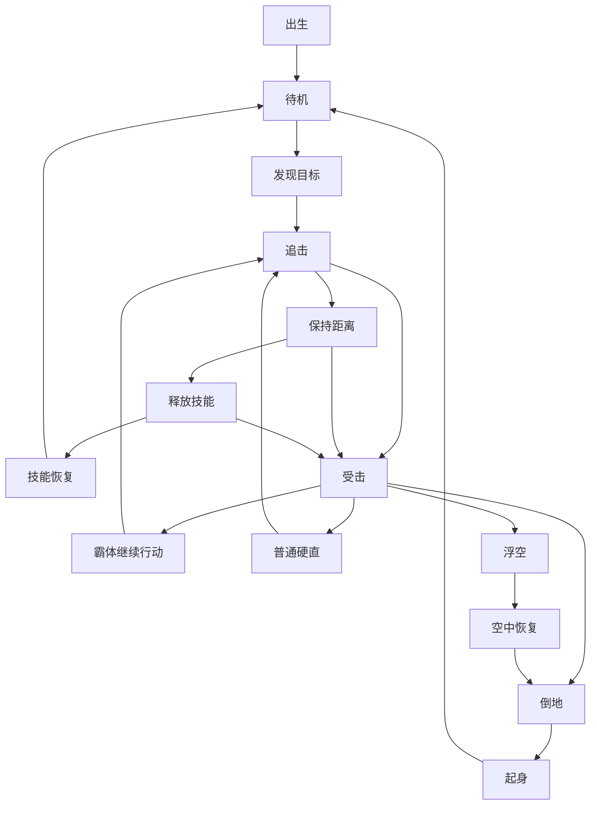
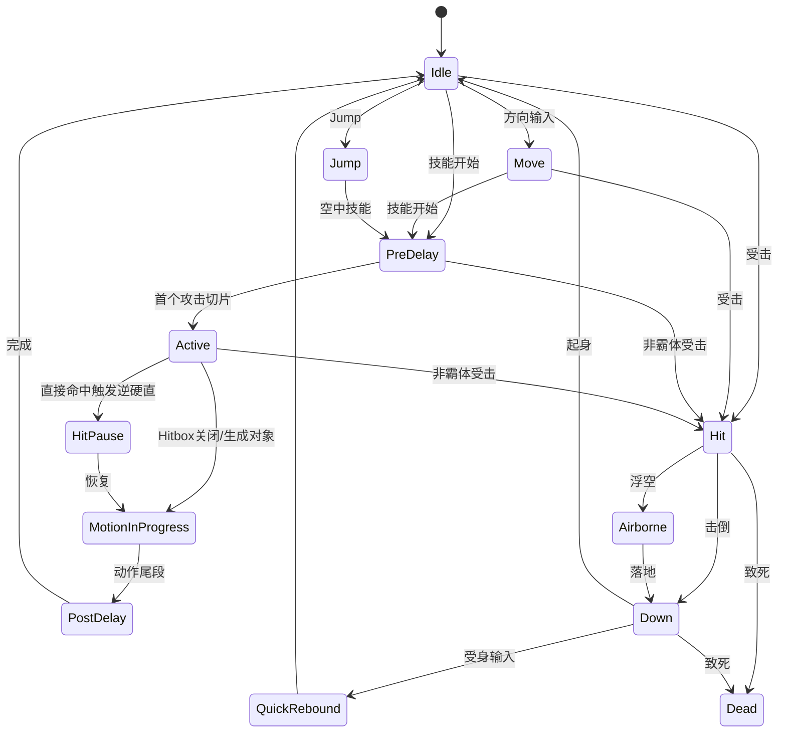
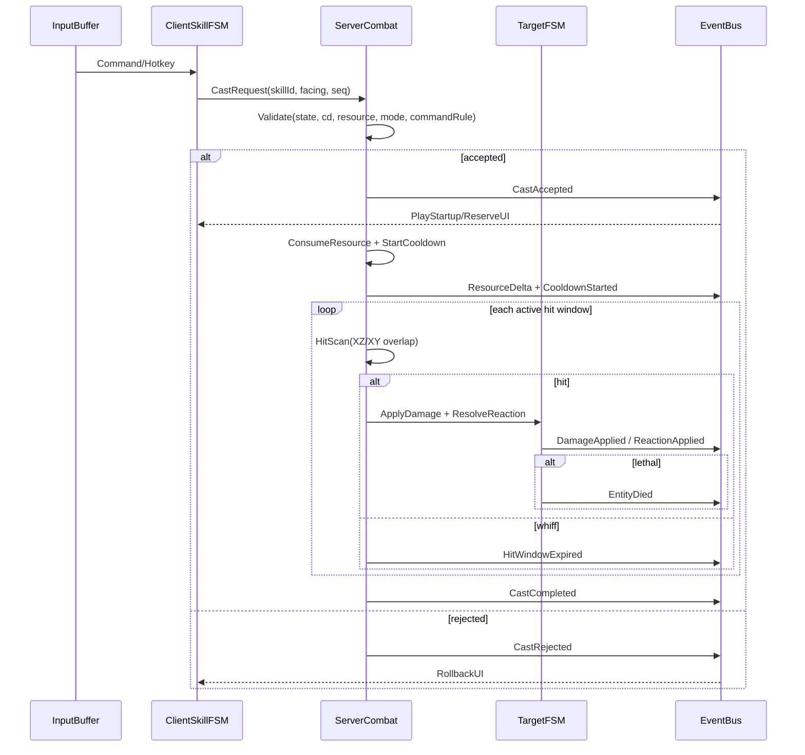
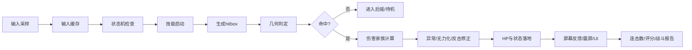
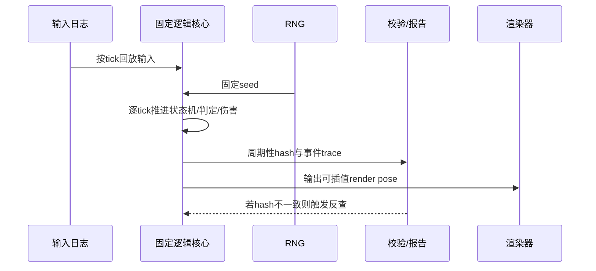
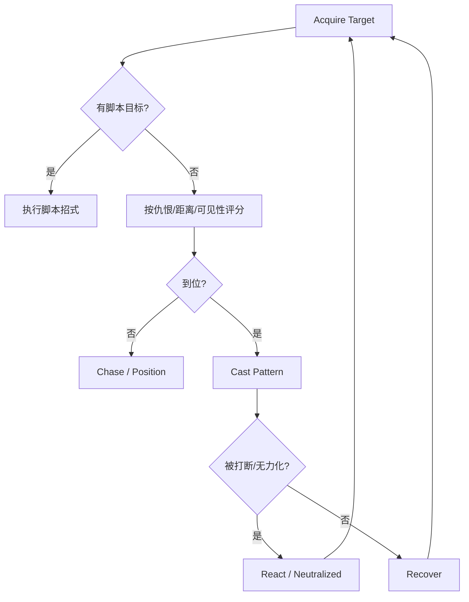

# DNF/DFO 战斗系统实现细节研究报告

> **Status: [CANONICAL]** — 帧/AI 综合主线：技能判定框、怪物受击逻辑、主角动作系统

## 执行摘要

这份报告的核心结论只有一句话：**如果目标是“可直接用于 1:1 复刻”，首先必须把目标版本锁死到某个具体构建号/赛季，再把 `Script.pvf`、`ImagePacks2/NPK`、技能脚本、ANI 帧数据、对象脚本、怪物 AI 脚本统一进同一份版本化数据仓**。公开资料足以重建**数据模式、判定框字段、部分技能坐标样例、元素算法、状态层级、怪物 AI 参数族、取消窗口/后摇语义、逆硬直触发条件**；但**不能**直接给出“当前 live 全职业全技能完整逐帧真值表”。公开可追溯的最强证据链是：官方开发者文档与更新说明、公开 API 说明中对 live `Script.pvf` 的描述、公开 PVF/NPK 解析器、以及经典版本逆向社区对 ANI/PVF 字段的逐项解释。citeturn8view0turn8view1turn13search5turn14search0turn36search2

在“能直接落地”的层面，公开资料已经足够支持以下工程决策：
其一，**判定驱动必须是“帧时间线 + 局部空间盒体/圆体 + 状态位”**，而不是把判定写死在代码里；ANI 资料明确给出了 `[DELAY]`（毫秒）、`[ATTACK BOX]`、`[DAMAGE BOX]`、`[DAMAGE TYPE]` 这些逐帧字段。其二，**碰撞核应采用 2.5D 的 AABB/投影盒体模型**；韩国重制分析明确认为 DNF 风格命中判断不是跟着旋转图像做 OBB，而是按未旋转的盒体处理。其三，**直接近身判定技能与“生成子对象/子弹对象”的技能，在 hit pause（逆硬直）、取消、命中去重上必须分开建模**；公开分析已经观察到投射/对象型技能常常不触发与近身挥砍相同的逆硬直。citeturn42search1turn42search0turn28search1turn27view0turn37search3

在伤害模型上，公开资料能稳定确认三件事：
一是**暴击**至少在社区长期整理的 DFO 世界维基中仍维持“物理/魔法暴击分离，暴击造成 50% 额外伤害”的经典语义；二是**元素乘区**存在稳定公式，韩服官方社区帖可见 `(((攻击属强 - 敌方属抗) * 0.0045) + 1.05)` 这一表达；三是**不同伤害类别在不同版本有不同叠加规则**，例如经典“增伤/暴伤”类存在“同类取最高/或按版本限定”的规则，而“技能攻击力”类通常按乘算叠加，105/110 时代又引入了 `Atk. Increase`、`Final Damage` 等新类别。也就是说，**1:1 复刻不能只写一个公式，必须写成版本可切换的规则引擎**。citeturn9search0turn39search13turn39search5turn39search7turn40search8turn10search0turn39search11

在状态系统与 AI 上，公开资料已经足够重建一个很像 DNF 的决策层：
官方访谈型更新明确描述了**一般受击 / 超级护甲 / 抓取免疫（或 Holding 不可）**等状态层级、**Holding Gauge** 随受击动作填充并在满值后短时免疫硬直/抓取、**Break 标签技能**可以打掉超级护甲、以及**空中连段存在额外收益**这样的现代 DNF 逻辑；社区公开的 `aicharacter` 与 `ACT` 文档则已经暴露出 AI 侧常见字段与选择器，如**攻击速度、视野、好战度、换目标时间、与目标保持距离、攻击距离、远距离反应几率、最后攻击者、最后攻击成功、全体敌人、队伍目标**等，这足够直接落成数据驱动的状态机或行为树。citeturn8view3turn29search0turn29search1

最后必须强调版本与法律边界：
**现代官方版本与经典 70/85/86 社区可见版本在系统层面差异很大**。现代官方有明显的防御、无敌、Neutralize、Ignite、Counter/Attack Stance 等重构；经典逆向资料则更容易拿到 ANI/PVF 的底层字段和具体坐标。另一方面，公开逆向社区页面本身常附带“仅供学习交流”“请在 24 小时内删除”等免责声明，部分工具贴甚至直接提到“绕过验证”，这意味着它们对工程验证有价值，但对商业使用、资产再分发、供应链安全都具有显著法律与伦理风险。本文因此**只提取字段、结构与现象，不提供私服部署、破解器、泄露客户端下载或任何绕过步骤**。citeturn32search5turn41view0turn36search1turn36search2turn29search0

## 证据基线与版本边界

**结论。** 想做 1:1 复刻，最重要的不是先写代码，而是先确定“你到底在复刻哪一个 DNF”。公开资料显示，官方 live 版本近年连续改动了防御、无敌、Neutralize、Ignite、Counter 与装备伤害词条；而经典台服/旧版逆向社区则保留了大量更接近“资源原貌”的 ANI/PVF/对象脚本信息。**建议把证据分成三层：官方层、近源层、实验层。** 前两层决定“真值”，第三层只负责补洞。citeturn32search5turn41view2turn10search0turn39search7

**建议采用如下证据层级。**

| 证据层 | 典型来源 | 可用于什么 | 不可用于什么 |
|---|---|---|---|
| 官方层 | 官方开发者文档、官方更新说明、官方访谈/更新日志 | 版本语义、系统定义、词条类别、系统重构方向 | 逐帧 hitbox 真值、所有技能完整帧表 |
| 近源层 | 公开 PVF/NPK 解析器、公开 API 指南、工程化复刻博客 | 数据模式、字段名、解析流程、2.5D 坐标/碰撞设计 | 商业法务安全背书 |
| 实验层 | 经典台服/旧版社区逆向帖、ANI 教程、对象脚本说明 | 具体坐标样例、AI 字段、ANI 标签、经典版本现象验证 | 现代 live 的全量真值、合法可再分发资产来源 |

这套分层的依据很明确：官方开发者门户确有 DFO Open API；DFO World 的 API 指南又直接说明该 API 文档涵盖当前韩服 live `Script.pvf` 的技能/物品信息；同时 GitHub 上存在公开的 PVF/NPK 读取库，社区则长期公开 ANI/PVF 字段说明。把它们串起来，就形成了“官方语义 + 公共解析 + 实验验证”的可落地方法。citeturn8view0turn13search5turn14search0turn42search1

**版本边界建议如下。**

| 目标类型 | 推荐证据主轴 | 原因 |
|---|---|---|
| 现代官方服复刻 | 官方更新说明 + 开发者 API 语义 + 自行本地解析目标客户端 | 词条、Neutralize、Ignite、防御/无敌改动都在持续演化 |
| 经典 60/70/85/86 复刻 | 经典客户端资源 + ANI/PVF 社区字段说明 + 经典现象录像 | 更容易拿到底层资源结构与社区修复经验 |
| PvP 特化复刻 | 经典资源 + Arena 更新说明 + 训练场帧步回放 | Arena 与 PvE 参数、后摇和判定经常并不相同 |
| 仅做“像 DNF”的战斗原型 | 韩国 MakeDNF 工程复刻思路 + 官方系统语义 | 投入最低，适合先把引擎搭出来 |

这个分法的重要性在于：**同一个技能名，在 PvE / Arena、经典 / 现代、角色本体 / 子弹对象 / Active Object 之间，可能对应完全不同的判定路径。** 公开社区就已经能看到，漫游的乱射如果只找角色本体 `randomshoot.ani` 会看到 `[DAMAGE BOX]` 而不是攻击框，真正的 `[ATTACK BOX]` 藏在 `character/gunner/effect/animation/bullet/randomshoot.ani`；又如剑魂某个 PVP 武器动画修 bug 时，直接就是补 `rapidmoveslashmove*.ani` 的逐帧 `ATTACK BOX`。citeturn37search3turn36search0

**法律与伦理风险必须前置写进研发规范。** 公开逆向社区页面自己就写着“素材多源于网络”“仅供单机学习交流”“请在 24 小时内删除”；某些工具贴还写出需要“绕过验证”。这说明这些资料在**结构研究**上有价值，但不应被当成可直接进入商业仓库的“干净素材”。建议研发制度上明确：**字段结构可以借鉴，任何原始资产、脚本、可执行文件、登录器、补丁二进制一律不入库；只能导出自建 JSON/CSV/Proto 的“事实表”进入项目。**citeturn36search1turn36search2turn29search0

## 技能判定框与帧数据

**结论。** DNF 风格技能判定的核心不是“动画播到哪一张图”，而是“当前时间线切到了哪一个帧切片，切片上挂了哪些局部空间盒体、什么状态位、是否转交给了子对象”。公开 ANI 资料已经清楚给出逐帧字段：`[FRAME MAX]`、`[IMAGE POS]`、`[DELAY]`（毫秒）、`[DAMAGE TYPE]`、`[ATTACK BOX]`、`[DAMAGE BOX]`；其中 `ATTACK BOX` / `DAMAGE BOX` 都是两组 XYZ 坐标，天然适合导入为 2.5D 的局部 AABB。citeturn42search1turn42search0

**逐帧字段到运行时结构的直接映射如下。**

| ANI 字段 | 公开语义 | 推荐运行时字段 | 实现注意点 |
|---|---|---|---|
| `[FRAME MAX]` | 总帧段数 | `frameCount` | 代表切片数，不等于 60fps 的逻辑帧数 |
| `[IMAGE POS]` | 图像基点/Pivot | `spritePivot` | 作为局部空间判定框原点参考 |
| `[DELAY]` | 当前帧持续毫秒 | `durationMs` | 不要丢成 float 秒，保留整数毫秒 |
| `[DAMAGE TYPE]` | 逐帧附加状态，如 `SUPERARMOR` | `stateFlags` | 霸体/无敌不要写死在技能代码里 |
| `[ATTACK BOX]` | 攻击判定框，X1Y1Z1 / X2Y2Z2 | `attackBoxes[]` | 局部空间 min/max |
| `[DAMAGE BOX]` | 受击框，X1Y1Z1 / X2Y2Z2 | `hurtBoxes[]` | 某些 down/air/downed 动画可特化 |
| `[IMAGE RATE]` / `[RGBA]` / 旋转 | 视觉层 | 可选 visual-only | 默认不影响碰撞核 |

上表并不是“推测”，而是直接来自公开 ANI 结构说明；同一批资料也明确把 `[DAMAGE TYPE] SUPERARMOR`、`[ATTACK BOX]` 与 `[DAMAGE BOX]` 放在每帧字段里。另一个公开帖还给出 `ATTACK BOX` 的十六进制落盘示例，说明这不是 UI 层概念，而是实打实的二进制资源字段。citeturn42search1turn42search0turn19view0

**碰撞形状建议采用“局部空间 AABB + 2.5D 投影”实现。** 韩国的 MakeDNF 重建分析专门拿“量子爆弹导弹图像旋转但判定并不跟着旋转”的现象做了验证，结论是 DNF 风格判定更像**AABB 而不是 OBB**；其实现上把 XZ 平面的 hitbox 做成 Box/Circle 两类，把 XY 平面统一为 Box，再做投影重叠测试。对 1:1 复刻而言，这个思路非常重要，因为它能解释很多“图像明明斜着飞，为什么边擦到也算中”的 DNF 味道。citeturn28search1

**公开能验证到的坐标样例如下。**

| 样例文件 | 阶段 | 局部最小点 `(x1,y1,z1)` | 局部最大点 `(x2,y2,z2)` | 盒体尺寸 `(dx,dy,dz)` | 备注 |
|---|---|---:|---:|---:|---|
| `rapidmoveslashmove1.[pvp].ani` | 已公开第 2 帧 | `(-57,-20,71)` | `(66,35,107)` | `(123,55,36)` | 典型“突进前段”长条盒 |
| `rapidmoveslashmove2.[pvp].ani` | 第 1 帧 | `(-17,-15,28)` | `(99,30,120)` | `(116,45,92)` | 更厚的中段盒体 |
| `rapidmoveslashmove2.[pvp].ani` | 第 2 帧 | `(-37,-15,50)` | `(88,30,120)` | `(125,45,70)` | 盒体向前收窄、向中线聚拢 |
| `rapidmoveslashmove2.[pvp].ani` | 第 3 帧 | `(-52,-15,50)` | `(70,30,120)` | `(122,45,70)` | 尾段继续收窄 |
| 通用 `ATTACK BOX` 样例 | 单帧 | `(21,-15,27)` | `(46,30,69)` | `(25,45,42)` | 可用于校验解析器坐标顺序 |

这些坐标来自公开索引可见的修复帖与 ANI 教程；需要注意的是，同一修复帖中 `rapidmoveslashmove1` 的第一帧在索引页里出现了**坐标项丢失/排版损坏**，只能把它视为“公开记录不完整”，必须在本地解析目标版本 ANI 后再确认。也正因为这种情况存在，**量产级 1:1 项目不能手抄论坛坐标，必须自动抽取资源。**citeturn36search0turn19view1turn42search0

**下面给出一个适合开发团队直接落库的“逐帧时间线模板”。**

| 时间线切片 | 源文件 | `durationMs` | `attackBoxes[]` | `hurtBoxes[]` | `stateFlags` | `cancelFlags` | 公开可得性 |
|---|---|---:|---|---|---|---|---|
| Startup | `rapidmoveslashmove1.[pvp].ani` f1 | 待本地抽取 | 公开索引不完整 | 待本地抽取 | 待本地抽取 | 待本地抽取 | 部分缺失 |
| Active-A | `rapidmoveslashmove1.[pvp].ani` f2 | 待本地抽取 | 1 个盒体 | 待本地抽取 | 待本地抽取 | 待本地抽取 | 已知坐标 |
| Active-B | `rapidmoveslashmove2.[pvp].ani` f1 | 待本地抽取 | 1 个盒体 | 待本地抽取 | 待本地抽取 | 待本地抽取 | 已知坐标 |
| Active-C | `rapidmoveslashmove2.[pvp].ani` f2 | 待本地抽取 | 1 个盒体 | 待本地抽取 | 待本地抽取 | 待本地抽取 | 已知坐标 |
| Active-D | `rapidmoveslashmove2.[pvp].ani` f3 | 待本地抽取 | 1 个盒体 | 待本地抽取 | 待本地抽取 | 待本地抽取 | 已知坐标 |
| Recovery | 尾段 ANI/State | 待本地抽取 | 无 | 待本地抽取 | 待本地抽取 | PostDelay/可取消点 | 需本地验证 |

这个模板故意把未知值标成“待本地抽取”，因为公开网页确实没有把所有 `DELAY`、`DAMAGE BOX`、取消标记都展示出来。但它已经足够说明如何落地：**所有技能都应该被编译成一个 `SkillTimelineAsset`，每个切片都同时携带时间、盒体、状态、取消信息。**citeturn42search1turn36search0turn17search17turn17search10

**取消点不能只看 ANI，还要看技能逻辑。** 公开资料已经给出三种典型取消语义：
其一，**后摇取消**，例如一些技能“can be canceled during the post-casting delay”；其二，**命中后取消**，如 “can be canceled … after a successful hit”；其三，**地面/空中双向衔接取消**，如 Quick Move 一类技能能在 post-delay 中再衔接其他技能。也就是说，`cancelFlags` 至少要拆成 `CancelOnPostDelay`、`CancelOnHit`、`CancelOnAir`、`CancelToSkillMask` 等数据位，而不是一个简单布尔值。citeturn17search17turn17search10turn17search7

**很多技能并不是“一个会移动的 hitbox”，而是“多个静态 hitbox 在不同切片启用”。** 韩国 MakeDNF 的“Half Moon/반월(半月)”分析很有价值：作者起初以为 hitbox 会跟着剑气运行时移动，后来逐帧观察发现更像是**一个攻击内存在多个 hitbox**，按动画时序切换启用。对于 DNF 这类横版 ACT，这个结论非常实用，因为它能避免运行时拖动 collider 带来的误差与调试困难。citeturn25view1

**投射物与主动对象必须单独建模。** 乱射的公开排错帖说明，本体动画里看到的是 `[DAMAGE BOX]`，真正的攻击框在 bullet/effect 动画里；而逆硬直分析帖则观察到，**直接由 Skill 类判定命中的技能**与**生成 Projectile/Object 再命中的技能**，在逆硬直和取消的体感上并不一致。工程上应把这两类都纳入统一 `AttackEmitter` 接口，但内部区分 `DirectEmitter` 与 `ObjectEmitter` 两条路径。citeturn37search3turn27view0

**可直接使用的解析伪代码如下。**

```pseudo
function BuildSkillTimeline(aniFile, actorFacing):
    timeline = []
    currentMs = 0

    for frame in aniFile.frames:
        slice = FrameSlice()
        slice.startMs = currentMs
        slice.endMs   = currentMs + frame.delayMs
        slice.pivot   = frame.imagePos
        slice.flags   = ParseDamageType(frame.damageType)

        for box in frame.attackBoxes:
            slice.attackBoxes.add(ToLocalAABB(box.x1, box.y1, box.z1, box.x2, box.y2, box.z2))

        for box in frame.damageBoxes:
            slice.hurtBoxes.add(ToLocalAABB(box.x1, box.y1, box.z1, box.x2, box.y2, box.z2))

        timeline.add(slice)
        currentMs = slice.endMs

    return timeline
```

**实现注意点。**
第一，`[DELAY]` 是毫秒，不要一开始就换成浮点秒；后续转逻辑 tick 时再量化。第二，X 方向要乘朝向符号，角色朝左时要做 min/max 交换。第三，若技能生成子对象，则本体时间线只负责“生成时刻”和“可取消点”；真正的攻击盒在对象时间线上。第四，要有 `alreadyHitTargets` 或 `hitWindowId`，否则多帧持续 hitbox 会把同一目标每 tick 都打一遍。citeturn42search1turn24view0

**测试用例。**
建议至少覆盖六组：单帧 hitbox；多帧持续 hitbox 命中去重；角色朝向翻转；子弹/对象型技能；后摇取消；边缘 Z 轴擦边命中。测试判定时必须同时显示 `ATTACK BOX`、`DAMAGE BOX`、当前切片索引、状态位、已命中列表。ANI 可视化编辑工具帖子里甚至专门提到过 “BOX 原点默认显示” 的修复，这说明“看到盒体”在 DNF 类项目里不是锦上添花，而是基本研发能力。citeturn36search2

## 伤害计算与属性算法

**结论。** 公开资料不足以无歧义重建“当前 live 全部职业、全部词条、全部副本规则下的唯一伤害真公式”，但足以重建一个**版本可切换、工程可落地**的伤害框架：
`基础段伤害 × 攻击力/主属性项 × 元素项 × 暴击项 × 词条项 × 模式项 × 目标修正`。其中**元素项与暴击项有公开公式/公开常识**，**词条项的叠加类别能从官方社区帖得到稳定规则**，而“基础段伤害常数、舍入时机、某些版本特有乘区”则必须回到目标版本客户端或实测中补齐。citeturn9search0turn39search13turn40search8turn10search0

**先把公开能确定的部分固定下来。**

| 模块 | 公开可确认内容 | 实现建议 |
|---|---|---|
| 暴击 | 物理/魔法暴击分离；暴击额外 50% 伤害 | `critMult = 1.5`，按攻击类型分别判定 |
| 元素乘区 | `(((攻击属强 - 敌方属抗) * 0.0045) + 1.05)` | 作为独立乘区 `M_elem` |
| 属性追加伤害 | `属性追加伤害 = M_elem × 属性追加数值` | 作为“追加伤害”族的一部分 |
| 经典伤害类别 | 不同类别通常乘算；部分同类只取最高或同类内特殊叠加 | 版本化规则表 |
| 现代 105+/110+ 类别 | `Atk. Increase`、`Final Damage`、`Skill Atk.` 等 | 同样做成版本化规则表 |
| 穿透/破防 | 现代官方明确删除过“怪物防御贯通伤害”等不直观机制 | 不要硬编码统一 def-pen 乘区，按版本插件化 |

上表几乎都能从公开资料里找到支撑：DFO World 的状态页给出暴击额外 50% 伤害；韩服官方社区帖给出元素公式；2017 和后续官方社区分析帖则明确讲了“同类/异类”的叠加区分以及“技能攻击力”为乘算；现代官方更新页又持续出现 `Atk. Increase`、`Overall Damage`、`Skill Atk.`、`All Elemental Damage` 等新类目。citeturn9search0turn39search13turn39search5turn40search3turn40search8turn10search0turn32search11

**推荐的统一公式如下。**

\[
D_i = \Big\lfloor B_i \cdot M_{atk} \cdot M_{stat} \cdot M_{elem} \cdot M_{crit} \cdot M_{opt} \cdot M_{mode} \cdot M_{target} \Big\rfloor
\]

其中：

- \(B_i\)：第 \(i\) 段技能基础伤害或段系数。**这是最需要从目标版本客户端抽取的真值表。**
- \(M_{atk}\)：武器攻击/独立攻击/技能攻击类型相关项。
- \(M_{stat}\)：力量/智力等主属性项。
- \(M_{elem}\)：元素乘区。
- \(M_{crit}\)：暴击乘区。
- \(M_{opt}\)：装备/被动/增伤词条乘区。
- \(M_{mode}\)：模式项，如 Counter、Aerial、Arena Combo Limit、Neutralize 规则。
- \(M_{target}\)：敌方专属修正，如敌类型、阶段、特殊破防状态。

**元素项可以直接落地为：**

\[
M_{elem}= \max(M_{elem,min}, 1.05 + 0.0045 \cdot (E_{atk}-R_{target}))
\]

这里 \(E_{atk}\) 是角色最终属强，\(R_{target}\) 是敌方最终属抗。公开官方社区帖已经把“敌方属抗”写进公式，因此如果你的目标版本存在“属抗削减/忽略属抗/属性穿透”，工程上最稳妥的做法不是再强行加一个额外乘区，而是把它们**折叠进 \(R_{target}\) 的求值**。citeturn39search13turn39search7

**暴击项建议写成：**

\[
M_{crit}=
\begin{cases}
1, & \text{未暴击} \\
1.5 \cdot (1 + C_{bonus}), & \text{暴击}
\end{cases}
\]

其中 `C_bonus` 是否存在、同类如何叠加，取决于目标版本。对经典版本，可按“暴击伤害增幅类同类规则”做版本化；对现代版本，则把这些选项归入 `OptionCategoryRules`。公开来源能稳定支持的是“暴击 1.5 倍”和“物理/魔法暴击分离判定”。citeturn9search0

**词条叠加一定要做成数据表，不要写死。** 比较稳妥的结构是：

```pseudo
enum StackRule {
    HighestOnly,     // 同类只取最高
    Additive,        // 同类加算
    Multiplicative,  // 同类乘算
    VersionScripted  // 版本脚本自定义
}

struct OptionCategoryRule {
    categoryId
    stackRuleWithinCategory
    multiplyWithOtherCategories
    appliesOnlyIfCritical
    appliesOnlyIfHitSuccess
}
```

这是因为公开资料已经反复说明了 DNF 伤害项并非一个统一逻辑：旧时代“增伤/暴伤”这类项目与“技能攻击力”类的叠加规则不同；新版本又引入新的主词条体系。如果你不把规则外置，后续版本迁移会非常痛苦。citeturn40search8turn10search0turn39search11

**“基础伤害、分段、连击系数”应该这样处理。**
基础伤害 `B_i` 以**每段**为单位存储，而不是一个总伤害再平均分摊。分段一旦独立，才能正确支持：多段 hitbox、部分段命中、对象型额外段、不同段触发不同效果、Aerial 只加后续空中段等需求。至于“连击系数”，公开资料对全局 PvE 通用 combo coefficient 并不充分，但 DFO World 的 PvP 机制页摘要确实提到**standing combos 存在 damage limit**，而官方访谈又明确提到某些内容里存在**aerial damage increase**。工程上最稳妥的方案是：**把 combo / aerial / counter 当作 mode-specific 规则，而不是强行假设所有 PvE 都有统一连击倍率。**citeturn9search3turn8view3turn32search17

**防御穿透与防御公式不要臆造。** 现代官方明确承认过历史上存在“怪物使用防御贯通伤害”这类不直观机制，并说明后来做了删除和防御体系重构。这至少证明了两件事：一，**防御相关机制是版本高度敏感的**；二，**不能把某个社区传公式当成跨版本真理。** 因此，如果你的目标是经典复刻，优先从目标客户端/录像实测得到防御收益表；如果目标是现代复刻，则把防御、减伤、Ignore/Break 统一做成版本插件。citeturn41view0turn41view1turn41view2

**可直接运行的伪代码如下。**

```pseudo
function CalcHitDamage(attacker, target, skillId, segmentId, ctx):
    seg = SkillTable[skillId].segments[segmentId]        // 真值表
    M_atk   = EvalAttackTerm(attacker, skillId, ctx.version)
    M_stat  = EvalMainStatTerm(attacker, skillId, ctx.version)
    M_elem  = max(ctx.elemMin, 1.05 + 0.0045 * (attacker.elemPower - target.elemResEffective))
    M_crit  = EvalCritTerm(attacker, skillId, ctx.attackType, ctx.version)
    M_opt   = EvalOptionMultipliers(attacker, target, skillId, segmentId, ctx.version)
    M_mode  = EvalModeMultipliers(ctx.mode, ctx.isCounter, ctx.isAerial, ctx.comboState)
    M_tgt   = EvalTargetModifiers(target, ctx)

    raw = seg.baseValue * M_atk * M_stat * M_elem * M_crit * M_opt * M_mode * M_tgt
    return ApplyDeterministicRounding(raw, ctx.versionRoundingProfile)
```

**一个数值示例。**
假设某一段 `seg.baseValue = 1000`，角色有效属强 300，敌方有效属抗 50，则：

\[
M_{elem}=1.05 + 0.0045 \times (300-50) = 2.175
\]

再假设该段发生暴击，且当前版本中 `Skill Atk.` 组合后为 `1.20`，其他乘区合并后 `M_mode \times M_target = 1.10`，则：

\[
D = \lfloor 1000 \times 2.175 \times 1.5 \times 1.20 \times 1.10 \rfloor
  = \lfloor 4306.5 \rfloor = 4306
\]

如果这是一个两段技能，且两段基础值分别为 400 与 600，那么应该分别结算为 1722 与 2583，再按 UI 需要聚合，而不是先聚总再分段。这个做法更接近 DNF 的“段驱动”实现，也更容易对齐 hitbox 与 hit pause。元素项与暴击项的数值来源是公开可确认的，舍入点位则务必按目标版本做回归。citeturn39search13turn9search0

**测试用例。**
至少覆盖：零暴击/满暴击；正属抗/负属抗；属性削抗；同类伤害词条只取最高；技能攻击力重复乘算；两段技能只命中一段；Counter/Aerial 打开与关闭；版本切换前后同样面板输出变化。所有回归应保存“每段中间项日志”，否则你只会知道最终数值错了，却不知道是错在元素、暴击还是词条类别。citeturn40search8turn39search7

## 怪物受击逻辑与 AI

**结论。** DNF 风格怪物逻辑应拆成两层：**受击判定层**与**行为决策层**。受击判定层解决“这一击能不能让怪硬直/浮空/倒地/抓取/Break”；行为决策层解决“怪现在该追谁、离多远、用哪个技能、多久换目标”。公开资料已经把这两层都暴露得足够清楚：官方更新访谈描述了**一般 / 超级护甲 / 抓取免疫**、**Holding Gauge**、**Break 技能**与**空中追加收益**；社区 `aicharacter` 文档给出**攻击速度、好战度、视野、攻击距离、换目标时间、保持距离**等参数，`ACT` 条件对象文档又给出**目标选择器与最近攻击者/攻击成功事件**。citeturn8view3turn29search0turn29search1

**受击优先级建议按下面的层级实现。**

| 层级 | 命中后是否掉血 | 命中后是否硬直 | 命中后是否可被抓/控 | 典型来源 |
|---|---|---|---|---|
| 无敌 / 无受击框 | 否或规则特判 | 否 | 否 | 官方无敌改动、down/特殊动画 |
| 抓取免疫 / Holding 不可 | 通常是 | 否或弱反馈 | 否 | 官方对怪物受击层级的说明 |
| 超级护甲 | 是 | 通常否，除非 Break | 一般否 | `DAMAGE TYPE SUPERARMOR` / 官方访谈 |
| 普通受击 | 是 | 是 | 视技能而定 | 普通 hit |

官方访谈对“몬스터의 피격 조건(怪物受击条件)”已经给出了很直接的三分法：一般、超级护甲、Holding 不可；它还明确说 Healing/Holding Gauge 会随着受击动作持续而增长，满值后一定时间内会对硬直和 Holding 免疫，而带 `[Break]` 标签的技能可以打掉超级护甲。这个说明已经足够支撑一个完全工程化的数据模型。citeturn8view3

**一个可直接落地的受击解析器应先判 `DAMAGE BOX`，再判状态，再判反馈。**
也就是说，命中流程不应直接写成“碰到就受击”，而应是：

1. 是否存在 `DAMAGE BOX` / 是否处于可受击动画。
2. 是否处于 `Invincible` 或“当前不响应受击”的特殊状态。
3. 如果是 grab/hold 技能，目标是否 `HoldImmune`。
4. 如果目标是 `SuperArmor`，本击是否带 `Break`。
5. 只有在以上条件通过后，才决定 `feedbackType = Flinch / Launch / Knockdown / Hold / None`。

这个顺序也能解释社区里“给 `down.ani` 加上 `[DAMAGE BOX]` 后就能打浮空连击”的现象：**down 状态下有没有受击框，直接改变了目标是否还能被继续当作空中/倒地连段对象处理。**citeturn38search0turn42search1

**怪物行为参数，公开资料已经给了很好的“数据表骨架”。**

| 参数族 | 社区公开语义 | 运行时字段建议 |
|---|---|---|
| 等级/基础状态 | 人偶/APC 等级、状态/速度 | `level`, `moveProfile` |
| 攻击速度 | 直接写在 `.aic` | `attackSpeedScale` |
| 远距反应几率 | 远距离攻击反应概率 | `rangedReactChance` |
| 技能代码/技能值覆写 | 可修改使用技能与某些技能值 | `skillSet[]`, `skillOverrides[]` |
| 发呆时间 | 不动作的停顿时间 | `idleMsRange` |
| 更换目标时间 | 多久换目标 | `retargetCooldownMs` |
| 与目标保持距离 | 保持的安全/追击距离 | `maintainDistance` |
| 好战度 | Aggro 倾向 | `aggressionWeight` |
| 视野 | 感知半径 | `sightRange` |
| 攻击距离 | 技能释放距离 | `attackRange` |
| 出现地点 | 坐标 | `spawnPoint` |
| 调用文件 | 行为/按键顺序/释放脚本 | `behaviorScriptRef` |

这些字段的精确定义在社区文档里仍有“具体作用自测”的部分，但对开发团队来说足够了：**字段存在本身就是最大的信息**。只要你的 AI 系统支持这些参数，你就能把绝大多数 DNF 怪 AI 做成“数据配置问题”，而不是把每只怪写成独立脚本。citeturn29search0

**目标选择器也已经可以直接翻译成行为树黑板键。**

| 公开选择器 | 推荐黑板键 |
|---|---|
| `[TARGET]` | `bb.target` |
| `[LAST ATTACKER]` | `bb.lastAttacker` |
| `[LAST ACTIVE ATTACKER]` | `bb.lastActiveAttacker` |
| `[LAST ATTACKSUCCESS]` | `bb.lastAttackSuccessTarget` |
| `[CHARACTER ATTACKSUCCESS]` | `bb.characterAttackSuccess` |
| `[ALL ENEMY]` | `bb.allEnemies[]` |
| `[PARTY TARGET]` | `bb.partyTargets[index]` |
| `[INCLUDE DEAD]` / `[CHECK NEXT]` | 查询开关 |

`ACT` 资料把这些目标对象写得非常直白，这对 AI 工程有直接价值：你不需要“推测 DNF 会不会记住最后一个打我的人”，因为文档已经告诉你这类对象是存在的。citeturn29search1

**公开没有给出“仇恨值公式”，所以仇恨必须按可观测字段重建。** 推荐的仇恨函数写成：

```pseudo
score(target) =
    wSight      * InSight(target)
  + wDistance   * DistanceScore(target, maintainDistance, sightRange)
  + wDamage     * RecentDamageFrom(target)
  + wLastAtk    * Bool(target == lastAttacker)
  + wSuccess    * Bool(target == lastAttackSuccessTarget)
  + wTaunt      * TauntLevel(target)
  - wSwitchLock * Bool(now < nextRetargetAllowedTime)
```

其中 `w*` 全由怪的 `AIProfile` 提供。这个公式不是公开真值，而是**对公开字段的最合理工程化落地**：如果你已经有“视野、保持距离、最后攻击者、换目标时间”，那仇恨系统最自然的写法就是围绕这些字段。公开资料没有给更具体的数值，所以请把权重留给数据表。citeturn29search0turn29search1

下面这张流程图对应的就是一个 DNF 风格怪物状态机，足够直接放进开发文档里。



这张图与公开资料的对应关系是：目标获取/更换来自 `aicharacter` 的视野、保持距离、换目标时间、好战度；受击层级来自官方对一般/超级护甲/Holding 不可与 Break 的描述；倒地后是否还能继续被打，则受 `DAMAGE BOX` 是否存在影响。citeturn29search0turn8view3turn38search0

**测试用例。**
首先测“最后攻击者抢仇恨”；其次测“保持距离型怪在远近切换时是否来回抖动”；再次测“超级护甲 + Break 技能”是否从无硬直切到可硬直；再测“倒地动画移除/添加 `DAMAGE BOX`”是否改变空中连段；最后测 “retargetCooldownMs” 是否防止怪在多人战里每帧切目标。没有这些回归，AI 看起来就会像“能打”，但不会像 DNF。citeturn29search0turn38search0

## 主角动作系统、逆硬直与空中规则

**结论。** DNF 风格主角动作最适合用**“循环状态 + On/Off 行为开关”**来实现：`Idle/Attack/Hit/Down/Dead` 这些是循环状态，`Move/Jump` 则像附着在状态上的 capability flag。韩国 MakeDNF 的实现分享正是这样做的；这个做法非常贴合 DNF，因为角色完全可能在某些技能中禁移禁跳，也可能在另一些技能中保留位移或空中衔接能力。citeturn25view0

**推荐的玩家动作状态表如下。**

| 状态 | 进入条件 | 退出条件 | 可移动 | 可跳跃 | 典型数据 |
|---|---|---|---|---|---|
| Idle | 无动作/动作结束 | 攻击、跳跃、受击 | 是 | 是 | `CanMove=true` |
| Move | 摇杆输入 | 摇杆释放/切状态 | 是 | 可 | `moveSpeed` |
| Jump | 跳跃输入 | 落地/空中技能 | 视版本 | 否 | `jumpArc` |
| Attack.PreDelay | 技能开始 | 到首个判定切片 | 通常否 | 通常否 | `startupMs` |
| Attack.Active | hitbox 开启 | hitbox 关闭/生成对象 | 通常否 | 技能特化 | `attackBoxes[]` |
| Attack.MotionInProgress | active 后动画延续 | 进入后摇 | 视技能 | 视技能 | `comboBufferOpen` |
| Attack.PostDelay | 尾部恢复 | 回到 Idle/被取消 | 视技能 | 视技能 | `cancelFlags` |
| Hit | 受击成立 | 恢复、浮空、倒地 | 否 | 否 | `hitReactionType` |
| Down | knockdown | 起身/Quick Rebound | 否 | 否 | `downedState` |
| Dead | HP<=0 | 复活/场景结束 | 否 | 否 | `respawnPolicy` |

之所以这样拆，是因为公开复刻博客明确提到他们把 `MoveBehaviour` 与 `JumpBehaviour` 做成了 On/Off，而 `Idle/Attack/Hit` 则是循环状态；同时，Ground Monk / Fire Knight 的基础连段分析又说明“追加输入窗口”是在特定攻击子阶段开启的，而不是整个攻击过程中始终开启。citeturn25view0turn23view1

**输入缓冲与连段窗口建议按“HitboxActive + MotionInProgress”建模。** 韩国复刻项目在 Ground Monk 与 Fire Knight 的基础攻击分析里都提到，追加输入只在 `HitboxActive` 与 `MotionInProgress` 两段开放。这和 DNF 体感很一致：很多普通攻击/低阶技能允许你在命中切片与动作延续切片中提前输入下一段，但在纯 startup 或某些硬直状态里并不能接。工程上可以直接给每个 `FrameSlice` 或 `AttackSubState` 挂一个 `bufferMask`。citeturn23view1

**无敌、霸体、普通受击不是“效果”，而是 hitbox state。** 韩国的 hitbox 外轮廓实现分析明确写到：DNF 风格存在三种 hitbox 状态——普通、超级护甲、无敌；并且在视觉上通过不同颜色/外轮廓反馈出来。这个观察与官方对“部分无敌技改为超级护甲、其余保留无敌”的更新说明相互印证。也就是说，角色自身应至少有一个 `HitboxState` 枚举，而不是把无敌写成“跳过 OnDamage 的一个临时 if”。citeturn23view0turn41view0

**逆硬直要单独建模，且直接判定与对象判定要分开。** 韩国“恶即斩/악즉참”逆硬直分析的核心结论很实用：**近身或直接由 Skill 本体做命中判定的技能，会出现更明显的逆硬直；而生成 Projectile/Object 再伤害的技能，逆硬直表现不同，甚至可视为不走同一路径。** 这意味着你的运行时里最好把 `hitPauseOnDirectHit` 和 `hitPauseOnObjectHit` 分成两个字段。citeturn27view0

**推荐的逆硬直处理伪代码如下。**

```pseudo
function OnHitConfirmed(attacker, defender, emitter):
    ApplyDamage(defender)

    if emitter.type == DirectEmitter and emitter.recoilTicks > 0:
        attacker.anim.pause(emitter.recoilTicks)
        attacker.logic.lockFor(emitter.recoilTicks)

    if emitter.cancelOnHit:
        attacker.OpenCancelWindow(emitter.cancelMask)
```

这里的 `pause` 与 `lock` 最好用逻辑 tick，而不是浮点秒。因为韩国实现分析专门提到过，靠 `deltaTime` 和动画速度倒数去算时间，很容易因为浮点误差与动画速度变化造成时序不稳；他们后来才转向依赖 AnimatorStateInfo/状态切片去捕获准确时机。对 1:1 复刻而言，**更进一步的做法是彻底不用运行时浮点算帧，而是预编译离散时间线。**citeturn27view1

**空中战斗规则必须至少支持以下几条。**

| 规则 | 公开支持程度 | 工程实现建议 |
|---|---|---|
| 目标被上挑后可继续空连 | 官方访谈明确存在 aerial bonus 场景 | `target.airborne=true` 后开放空中受击表 |
| down/倒地状态是否还能被打 | 社区现象表明取决于 down.ani 是否存在 `DAMAGE BOX` | `downedHurtboxProfile` 独立配置 |
| 超级护甲目标是否会被打上天 | 取决于是否被 Break、是否允许 launch | `feedbackPolicy` 按状态表走 |
| 空中优先级 | 未见统一官方完整表 | 数据驱动：`Grab > Break > Launch > Down > Flinch` 作为默认草案 |
| 落地硬直 | 未公开统一数值 | 配 `landingRecoveryMs`，按目标体型/状态分层 |
| 空中技能取消 | 公开技能页可见部分技能可 ground/air 使用并在 post-delay 取消 | `cancelOnAir` 数据位 |

官方访谈已经明说过：某些玩法里，先把敌人打到“무방비(无防备)（无防备）”状态，再用升龙类技能把敌人挑起，后续空中连段会得到额外伤害反馈；而社区帖子又明确展示了通过给 `down.ani` 加上 `DAMAGE BOX` 能让原本不可再打的 down 怪继续被浮空连击。这两者一起说明：**空中规则并不是简单的“在空中就能一直打”，而是受受击框与反馈状态强烈控制。**citeturn8view3turn38search0

**防倒地起身与回避技能要走独立状态。** DFO World 的技能页摘要给出两个非常有代表性的例子：`Quick Rebound` 会让角色从倒地快速恢复并在短时间内进入无敌/无受伤区间；`Quick Move` 则可在地面或空中使用，并且能够在 post-delay 中再取消到别的技能。再加上 `Phase Shift` 这种“0.5 秒无敌 + temporary recoil”的技能，可以得出一个明确设计：**Backstep / Quick Rebound / Quick Move / Phase Shift 这类动作不应混在普通 AttackState 里，而应作为具有更高优先级的 UtilityAction。**citeturn17search6turn17search7turn17search0

**“切换武器”没有公开可确认的统一战斗内状态机。** 目前公开资料里看到的更多是“技能依赖武器类型修改攻击范围/抓取范围/后摇”，而不是一个所有职业通用的战斗内切武系统。因此如果你的项目目标是复刻 PC DNF/DFO，建议把“武器切换”标注为**无公共统一约束**：
如果某个目标版本或某个职业的确存在技能驱动的武器形态切换，就把它当成技能状态变化；否则不要在主控状态机里硬加一个全局 `WeaponSwap`。这个结论来自公开资料“缺失”，而不是来自一个具体明文规则。citeturn32search9turn32search6

下面这张状态图可以直接作为程序和动画团队的共识图。



**测试用例。**
建议至少做：未命中完整后摇；命中触发逆硬直；命中后取消；空中技能接地面技能；倒地受身；超级护甲吃 hit 不进 `Hit`；Break 打断超级护甲；带/不带 `DAMAGE BOX` 的 down 动画对比。只有这些都过了，角色才会真正“像 DNF”。citeturn27view0turn17search6turn8view3

## 开发实现模型与网络同步

**结论。** 如果团队要把这份资料直接转为工程，最佳路线不是“先写玩法代码”，而是先做**一条从资源到运行时资产的编译链**：`PVF/NPK/ANI -> 中间格式 -> 运行时 Timeline/Collider/AI 资产 -> 回放与校验工具`。公开资料已经足够支持这条链的字段设计、碰撞算法、Hit dedupe、动画时序同步和 AI 参数仓设计。至于网络层，公开资料只说明了 DNF 当年把“网络技术”视为核心竞争力，并没有公开明确协议，因此**在网络同步上暂无可声称的“官方特定约束”**；最稳妥的做法是用服务器权威 + 固定 tick + 输入/事件日志回放。citeturn33search0turn34view1turn24view0turn27view1

**推荐的数据结构如下。**

```pseudo
enum HitboxState {
    Normal,
    SuperArmor,
    Invincible
}

enum FeedbackType {
    None,
    Flinch,
    Launch,
    Knockdown,
    Hold,
    Break
}

struct Box3i {
    int x1, y1, z1;
    int x2, y2, z2;
}

struct FrameSlice {
    int startMs;
    int endMs;
    Vec2i spritePivot;
    HitboxState hitboxState;
    List<Box3i> attackBoxes;
    List<Box3i> hurtBoxes;
    Bitset cancelFlags;
    int hitWindowId;
    string spawnObjectRef;
}

struct SkillTimelineAsset {
    int skillId;
    string sourceAni;
    List<FrameSlice> slices;
    bool isDirectEmitter;
    int recoilTicks;
    Option<CancelMask> cancelOnHit;
    Option<CancelMask> cancelOnPostDelay;
}

struct DamageRuleProfile {
    string versionTag;
    Map<OptionCategory, StackRule> optionRules;
    bool useModernAtkIncrease;
    bool useArenaComboLimit;
    RoundingPolicy rounding;
}

struct MonsterAIProfile {
    int level;
    float attackSpeedScale;
    float aggressionWeight;
    int sightRange;
    int attackRange;
    int maintainDistance;
    int retargetCooldownMs;
    float rangedReactChance;
    List<int> skills;
    string behaviorScriptRef;
}
```

这组结构背后的依据是公开资料已经明确出现了：逐帧 `ATTACK BOX`/`DAMAGE BOX`/`DAMAGE TYPE`、`AlreadyHitTargets` 去重、攻击者/受击者的双 hitbox controller、AABB 2.5D、以及 `aicharacter` 的参数族。也就是说，它不是凭空设想，而是把公开可见的 DNF 风格组织方式做了一次工程化归纳。citeturn42search1turn24view0turn28search1turn29search0

**碰撞检测建议采用“XZ + XY 双投影重叠”。**

```pseudo
function Intersects(attBox, hurtBox):
    overlapXZ = Overlap(attBox.x1, attBox.x2, hurtBox.x1, hurtBox.x2)
             && Overlap(attBox.z1, attBox.z2, hurtBox.z1, hurtBox.z2)

    overlapXY = Overlap(attBox.x1, attBox.x2, hurtBox.x1, hurtBox.x2)
             && Overlap(attBox.y1, attBox.y2, hurtBox.y1, hurtBox.y2)

    return overlapXZ && overlapXY
```

如果目标版本要求圆形/扇形地面判定，可以在 XZ 平面额外提供 `Shape2D`，但**先把盒体版做对**，因为公开分析已经表明 DNF 风格的很多“看起来很斜”的对象实际上用的还是盒体思路。citeturn28search1

**采样频率推荐固定为 60Hz 逻辑 tick，但内部时间线保留毫秒。** ANI 资料把 `DELAY` 明确写成毫秒，而韩国实现分析又指出用 `deltaTime` 与动画速度倒数组合去推时机，容易因为浮点误差和速度变化产生偏差。综合来看，最稳妥的落地是：
**资源层保留整数毫秒；运行时把毫秒时间线映射到 60Hz 固定 tick；动画只负责显示，不负责真值时序。**citeturn42search1turn27view1

**一个推荐的命中求解循环如下。**

```pseudo
fixedTick():
    UpdateFSM()
    AdvanceSkillTimelines()
    UpdateSpawnedObjects()

    for each emitter in activeEmitters:
        activeSlice = emitter.timeline.GetSliceByMs(emitter.localTimeMs)

        if activeSlice.attackBoxes.empty():
            continue

        candidates = QueryTargetsByLayer(emitter.targetLayer)

        for target in candidates:
            if target.id in emitter.alreadyHitTargets[activeSlice.hitWindowId]:
                continue

            if ResolveHit(emitter, target, activeSlice):
                emitter.alreadyHitTargets[activeSlice.hitWindowId].add(target.id)
```

`alreadyHitTargets` 不应只有一个全局集合，而应该至少按 `hitWindowId` 或“第几段”分桶。这样才能同时支持：
单段持续 hitbox 防止重复打；多段技能允许每段各打一次；地面持续对象按 `periodic window` 重置命中。这个设计与公开的 `AlreadyHitTargets` 分析完全一致。citeturn24view0

**动画同步与调试方法建议如下。**

| 目标 | 推荐做法 | 原因 |
|---|---|---|
| 精确保留时序 | 资源编译时离散化切片 | 避免运行时浮点误差 |
| 可视化判定 | Scene/战斗调试层常显盒体、Pivot、状态色 | DNF 类项目不看盒体无法调 |
| 回归验证 | 录制输入流 + 状态快照 + 每段伤害日志 | 便于逐段核对 |
| 版本对比 | 同一场景双版本回放 | 看 patch 前后哪一层出差异 |
| 取消窗口调试 | UI 叠加显示 `canCancel/canBuffer` | 动作团队与程序共享真值 |
| AI 调试 | 显示 `targetId、aggro score、retarget cooldown` | 避免“看起来随机” |

**网络同步建议。**
公开资料没有给出 PC DNF 的确切帧同步/状态同步协议，因此这里必须按“建议”而不是“真值”来写。最稳妥的建议是：

- **PvE：服务器权威。** 客户端上送输入事件与技能请求，服务器持有伤害、命中、AI、掉落真值；客户端可本地前演，用服务器事件纠正。
- **PvP：固定 tick + 输入日志。** 若必须追求格斗手感，可在局部战斗房间使用有限 rollback，但**只有在内容资产、时序、舍入全部完全确定后**再做。
- **所有模式：战斗核心必须确定性。** 不允许把伤害、盒体、AI 判定放在非确定浮点路径里。
- **无特定官方约束。** 目前公开来源只能证明原作极度重视网络技术，没有公开能还原精确同步协议的材料。citeturn33search0turn34view1

**测试用例与调试方法。**
最低限度建议做四套自动化：
一套“资源编译单测”，验证每个 `ATTACK BOX` / `DAMAGE BOX` 坐标都满足 min<=max；一套“战斗 determinism 回放测”，同样输入在三台机器上得到同样的每段输出；一套“边界回归”，专测 Z 轴薄盒、朝向翻转、对象生成；一套“版本差异回放”，把 patch 前后同一输入序列并排重播。没有这四套，1:1 复刻项目很容易在后期变成“大家都觉得差不多，但没人知道哪里不一样”。citeturn36search2turn24view0

## 术语对照、来源与实现清单

---

## Appended: Replica Implementation — 固定帧/输入兼容/回放/按键体系 (from dnf-combat-replica-implementation-technical-report.md)

> ‰ª•‰∏ãÂÜÖÂÆπÊù•Ëá™ [SUPPORTING] dnf-combat-replica-implementation-technical-report.mdÔºåÊåâ CHAPTER-AUDIT ÂêàÂπ∂ËßÑÂàôËøÅÁߪ„ÄljøùÁïôÔºöBackstep Upgrade„ÄÅÂõ∫ÂÆöÈĪËæëÂ∏߉º™‰ª£ÁÝÅ„ÄÅÂõûÊîæ‰∫㉪∂ÊĪÁ∫ø„ÄÅÊåâÈîƉΩìÁ≥ª„ÄÇ

## 系统工具、固定帧、输入兼容与回放

---

## Appended: Technical Pipeline — 职业样例表/事件总线/冷却资源 (from dnf-dfo-combat-technical-pipeline-report.md)

> 来自 [OVERLAPPING] dnf-dfo-combat-technical-pipeline-report.md，按 CHAPTER-AUDIT 迁移。保留：主要职业样例表、事件总线/冷却资源内核、关键伪代码。

## 技能判定框与帧数据模型

### 通用判定模型

公开逆向与复刻研究最一致的结论，是 DNF/DFO 的判定空间应建模为三轴但双平面处理：**XZ 平面负责左右与纵深碰撞，Y 负责跳跃高度/落地门限**。在公开复刻研究中，开发者为了复刻 DNF 风格专门实现了 `DNFTransform`，把 X 作为横向、Z 作为“屏幕上的前后深度”、Y 作为跳跃高度，并明确说明这是 2.5D 坐标，而不是传统单平面 2D。citeturn35search2turn25view2

在命中体形状上，公开研究给出的最稳定模型是：**XZ 平面只用 Box 与 Circle；XY 平面统一用 Box；对象旋转不旋转判定体**。一个有力例证是 Launcher 的“量子/Quantum”类斜落导弹：视觉上导弹有 45 度旋转，但若 hitbox 也跟着旋转，某些目标不应命中；实际观察却会命中，因此更符合“视觉旋转、判定仍按 AABB/轴对齐体处理”的解释。对开发来说，这意味着 AttackDef 不应直接绑定 mesh rotation，而应独立维护 `shape + size + offset + pivot + activeFrames`。citeturn18view3turn19view0

公开工程复刻还给出了非常实用的作者态数据：每个 hitbox 至少需要 `size`、`offset`、`pivot` 三个编辑参数，并分别在 XZ 与 XY 两个平面可视化调节。这个模型非常适合做技能编辑器，因为它把“技能范围”和“角色本体位置”彻底解耦了。citeturn25view1turn34view0

hurtbox 状态至少应分成三类：普通、霸体、无敌。官方 2025 技能 UI 改版把“无敌、聚怪、控制”明确做成技能特殊效果标签；社区复刻资料则把角色可视化分成“普通无描边、霸体黄红描边、无敌白描边”三种显示状态。换言之，无敌/霸体不是某些技能脚本里的零散特例，而应是 RuntimeState 上的强类型标志位。citeturn42view1turn26search0turn32search5

一个非常重要但常被忽略的实现差别，是**直接判定技能**与**生成投射物/对象再判定的技能**应分成两类。公开复刻研究对“逆僵直/攻击停顿”的观察显示：直接由 Skill 自身发起命中的攻击，更容易表现为攻击者短暂停顿；而只负责生成“剑气/导弹/投射体”的技能，则攻击停顿往往不直接反馈到施法者主体。这个结论不是官方文档，而是基于对 Soul Bender 普攻与 Sword Master“恶即斩”类技能的行为对比所得，可信度中等，但极具开发价值。citeturn18view2turn34view1

### 推荐的数据结构

下面这套模型可以直接指导实现。它不是“猜一个大类”，而是尽量把公开资料中已经被反复证实的维度拆出来；没有公开证实的数值字段统一作为待校准数据，而不是硬写进逻辑。

```json
{
  "skillId": 120345,
  "mode": "dungeon",
  "castType": "active",
  "input": {
    "command": "down,right+z",
    "quickSlotAllowed": true
  },
  "resourceCost": {
    "mp": 180,
    "cube": 1,
    "classGauge": 0
  },
  "cooldown": {
    "baseMs": 12000,
    "hasCommandBonusLegacy": false,
    "chargeCount": 1,
    "sharedGroup": null
  },
  "phases": [
    {
      "name": "startup",
      "frames": [0, 11],
      "canMove": false,
      "canJump": false,
      "superArmor": [[4, 11]],
      "invincible": []
    },
    {
      "name": "active",
      "frames": [12, 16],
      "hitWindows": [
        {
          "frames": [12, 14],
          "attackType": "direct",
          "boxesXZ": [
            {"shape": "box", "size": [1.8, 0.6], "offset": [1.2, 0.0], "pivot": [0.5, 0.5]}
          ],
          "boxY": {"min": 0.0, "max": 1.4},
          "reaction": "hitstun_light",
          "counterable": true,
          "grabType": "none"
        }
      ],
      "superArmor": [],
      "invincible": [[12, 13]]
    },
    {
      "name": "recovery",
      "frames": [17, 23],
      "cancelWindows": [
        {"start": 20, "end": 23, "into": ["dodge", "special_chain"]}
      ]
    }
  ]
}
```

这类结构的关键不是字段多，而是**显式把“相位、命中窗、状态窗、取消窗、模式覆盖”拆开**。官方已经确认技能 UI 与说明会按“地下城/决斗场”切换，而且 2026 年又把技能链、命令冲突、命令减 MP/CD 移除都做成统一规则层，因此 SkillDef 中带 `modeOverride`、`commandPolicy`、`cooldownPolicy` 是有现实依据的。citeturn42view1turn42view0turn41search2

### 主要职业样例表

下表只列出**公开可确认**的样例，并把“能确定的帧/规则”和“只能推断的几何体”分开。凡是没有找到公开坐标值的，统一标为“未确认/需逆向验证”。

| 职业样例 | 技能样例 | 可公开确认的帧数据 | 可公开确认的判定/状态规则 | 几何体建模建议 | 可信度 |
|---|---|---|---|---|---|
| 女散打 | 无影脚 / Shadowless Kick | 社区测帧材料显示，相关 VP 形态下可从 20f 缩短到 13f；另一形态可到 8f，并改变能否在着地前后立即进行 Muscle Cancel。citeturn29search1 | 取消窗口与“是否已着地”强绑定，说明 recovery 不应只按动画末尾算，而应绑定位移/落地事件。citeturn29search1 | 前冲移动盒体 + 末端踢击盒体，根节点跟随位移；取消窗挂在 `landed` 事件而不是固定帧。精确 box 尺寸未确认。 | 中 |
| 女散打 | 比特驱动 / Bit Drive | 公开测帧材料显示，删除最后一击后，单次施放可由 37f 缩短到 17f。citeturn29search1 | 说明多段技可以通过“删段”显著改变总后摇，但未必改变前摇。citeturn29search1 | 建议拆成 `N` 个独立 HitWindow，而不是一段多次重复命中；这样删段只改表，不改逻辑。 | 中 |
| 魔枪士职业分支 Duelist | 뇌격점혈섬 系列 | 官方社区测帧写明攻击时间可由 24f 降到 17f。citeturn29search2 | “无条件枪尖判定”是最关键规则：命中只取武器前端，而非整条枪身。citeturn29search2 | 命中体建议锚定在 `weaponTipSocket`，用小宽度长条 Box/Capsule；不要把整条武器都做成有效 hitbox。 | 中高 |
| 魔枪士职业分支 Duelist | 滚动火神炮 / Rolling Vulcan | 官方社区测帧写明最大连打形态 10f→9f。citeturn29search2 | “从施放到结束全程无敌”被明确写出，是非常干净的 i-frame 窗。citeturn29search2 | 将无敌窗写成 phase-level 覆盖，而不是写在单个 hitbox 上；多段发射用 tick 攻击组。 | 中高 |
| Agent 系 | Moon Phase / 双月类技能 | 公开分析写明总施放为 18f，但从施放瞬间到最后一击仅 13f。citeturn29search0 | 这说明 recovery 大约还有 5f 左右的后段，不应与最后 hit frame 混为一谈；同文还把它归类为“稳定无敌”工具。citeturn29search0 | 建议拆成 `startupUntilFirstHit`, `hitThroughLastImpact`, `tailRecovery` 三段；精确命中盒尺寸未确认。 | 中 |
| 觉醒/演出技能通例 | 真觉醒 sprite 帧 | 公开精灵提取帖给出多职业真觉醒 sprite 总帧数，如男漫游 64f、女散打 29f、男机械 10f、战法 123f 等，并特别提醒“按提取精灵选帧，游戏内可能因演出意图不同”。citeturn31view0 | 动画总帧 ≠ 命中活动帧 ≠ 可取消帧。citeturn31view0 | 所有技能都应分别记录 `animFrames`、`activeFrames`、`cancelFrames`、`networkAuthoritativeFrames`。 | 中高 |

这张表最重要的含义，不是某个技能到底 13f 还是 17f，而是**DNF/DFO 的技能时序必须被拆成多个“可被独立调优的帧窗”**：动画总时长、命中活动窗、落地/离地事件、取消窗、无敌窗、霸体窗、段数窗，不能压成一个 `duration` 字段。公开的平衡帖、技能链规则与地下城/决斗场模式分流共同指向这一点。citeturn29search1turn29search2turn29search0turn42view0turn42view1

## 伤害算法与碰撞交互

### 伤害计算与属性加成

公开英文老资料、近年中文社区公式与官方/社区属性说明，能拼出一个相当稳定的**“核心乘算骨架”**。经典 DFO 公共公式把单段命中的基础伤害写成：`[(skill% * base attack) + skill fixed damage] * (1 + stat/250) * (1 + elemental damage/220) + (skill% * piercing attack)`；在其上，再乘以 Smash、技能攻击力、暴击和额外伤害线。暴击的经典公共写法是 `1.5 * (1 + skill crit bonus) * (1 + highest crit damage modifier)`。这套写法适合复刻**老 DFO 核心管线**，可信度中高。citeturn23view1

但如果目标是更接近 2025–2026 的 live 版本，就不能停在这一步。国服 2025 年的社区重建公式已经把最终输出拆成“技能数据/特效数据、三攻、力智、属强、攻强、技攻、附加伤害等”多个乘算支路；而手游公开公式也给出了 `有效属强`、`防御率`、`命中期望`、`破招 * 1.25`、`背击 * 1.1`、`浮空 * 1.1` 这样的后置乘子。这说明**最终伤害函数是版本化、模式化、装备化的**。因此工程上应把“核心伤害核”和“版本后乘子图”分开实现。citeturn20search4turn20search10

属性系数的公开资料存在两个常见近似版本。旧攻略常写作 `1 + (属性强化 - 敌方属性抗性) / 220`；较新的 DFO Wiki 页面摘要则写作 `1 + (your Element Damage + 11 - Enemy's Elemental Resistance) / 222`。另一方面，韩服社区对属性抗性和属强的通俗解释是“22.5 抗性约等于 10% 属性减伤，属性强化会等额抵消该抗性”。这三种表述彼此并不冲突，本质上都说明元素分支是“攻击者属性强化/元素伤害 vs 防御者属性抗性”的线性近似函数，只是常数项与显示口径随年代变动。开发上最合理的做法是把 `ElementCoeff(version)` 单独版本化。citeturn21search2turn23view3turn20search11

防御减伤则是公开资料里最不稳定的一项。手游公开公式使用 `1 - 有效防御 / (11000 + 有效防御)`；更老的端游攻略往往用“减伤率”或“防御后剩余比例”描述，而不是统一常数。这意味着如果你追求 DNF/DFO 的“手感与交互 1:1”，可以先复刻其它确定度高的部分；但若你追求“数值 1:1”，必须把 `DefenseCoeff` 做成版本函数，并预留按副本/怪物模板修正的入口。这里公开证据不足以确认所有年代共用一个常数。citeturn20search10turn22search8

多段伤害与额外伤害的公共规则相对清晰。英文公共伤害页明确说明：每一个单独 hit 都会生成一条“普通伤害线”；Additional Damage 会额外生成独立的小伤害线；属性附加伤害还会再次乘入元素系数；这些额外伤害线看起来像“跟随伤害”，但本质上仍是独立命中实体，并且会增加 combo counter。工程上因此不应把“白字、属白、特效触发”做成普通伤害的文本装饰，而应做成真正的二级 hit event。citeturn23view1

破招/Counter 的公开口径可以近似拿 1.25 作为默认乘子。官方社区对 Boss 反制窗口的说明明确写到，Counter 成功会让目标短时间处于“受到 125% 伤害”的状态；韩服旧社区帖也把基准 Counter Damage 明写为 125%；手游公开公式同样写出 `破招 = 1.25`。但是，现代 raid/boss 还存在把某一段机制窗口直接做成 `incomingDamageMultiplier` 的做法，因此“Counter”既可能是全局通则，也可能是特定副本的临时状态。建议单独建 `CounterState` 与 `PatternVulnerabilityState` 两套机制。citeturn18view0turn21search0turn21search3turn20search10

下面给出推荐的服务端实现骨架。它不是断言“live 公式永远如此”，而是把已公开的稳定部分固化，把不稳定部分留给版本层。

```text
HitBase =
    PercentBranch( skillPct, weaponAtkOrMagicAtk )
  + FixedBranch( independentAtk, fixedScalar )   // 固伤/absolute damage，标量需按版本标定
  + PiercingBranch( reinforceData )              // 旧版本更重要，现版本可弱化

StatCoeff      = 1 + mainStat / 250
ElementCoeff   = ElementCoeff(version, attackerEle, defenderEleRes)
DefenseCoeff   = DefenseCoeff(version, attacker, defender, stage)
CritCoeff      = isCrit ? CritCoeff(version, skill, attacker) : 1
CounterCoeff   = isCounter ? CounterCoeff(version, encounter) : 1
FinalCoeff     = Product( allFinalMultipliersFromBuffsItemsWorldRules )

NormalLine = HitBase * StatCoeff * ElementCoeff * DefenseCoeff * CritCoeff * CounterCoeff * FinalCoeff
ExtraLines = For each extraDamageSource => ExtraRule(source, NormalLine, ElementCoeff, ...)
```

为了避免抽象化，下面给一个可复算的数值例子。假设某百分比技能的 `skillPct = 312%`，角色主攻击面板 3200，主属性 2500，则 `StatCoeff = 11`；若按较新的 `(+11)/222` 口径，攻击者元素值 180、目标抗性 60，则 `ElementCoeff ≈ 1.5901`。此时基础单线伤害约为 `3.12 * 3200 * 11 * 1.5901 ≈ 174,630`；若暴击且按 1.5 基准暴击，则约 `261,945`；若同时处于 1.25 的 Counter 窗，则约 `327,431`；再带 20% 的 Additional Damage，则应追加一条约 `65,486` 的独立伤害线，而不是把总数写成一条。这个例子只用于展示“乘算链如何拆开”，不是声称 live 常数永远固定。citeturn23view1turn21search2turn20search10

反算方法建议按下面的顺序做。先取训练场或低干扰环境下的**单段、非暴击、无破招、无额外伤害、无世界增益**样本，反求 `skillPct/fixedScalar`；再只改变元素，反求 `ElementCoeff`；再只改变暴击态，反求 `CritCoeff`；最后再叠装备乘子与副本乘子。因为额外伤害线和普通伤害线在 DFO 公共资料中就是分开的，所以反算时必须逐条读取，而不能只看总和。citeturn23view1turn20search4

### 碰撞、位移与敌我交互

角色与怪物本体碰撞，最合理的公开实现模型仍是“双平面”：XZ 负责平面碰撞和推挤，XY 负责高度过滤。公开复刻研究给出的碰撞实现，已经把 Box/Box、Circle/Circle、Box/Circle 三种组合的 AABB/几何检测过程写得非常明确，并说明 XY 与 XZ 的平面分工是为了避免 Unity 默认 Collider 在 2.5D 场景里产生大量无意义触发。对于 DNF/DFO 风格游戏，这意味着攻击判定、本体阻挡、落地门限最好统一走自研碰撞器，而不要把商业引擎的 2D/3D Collider 直接当战斗真值。citeturn18view3turn19view0turn25view1

“主角与怪物体积碰撞、位移、推挤”的**精确常数**公开资料并没有可靠来源，因此这里不能装作已经确认。能确定的是：本体阻挡与攻击判定应解耦；攻击 hitbox 可以是 Box/Circle 组合，但本体 body-block 更适合做成简化的 XZ 圆形或窄盒体，并在 Y 上只保留脚底到头顶的高度范围。推挤建议使用“最小穿透向量 + 每帧最大修正距离 + 质量/霸体系数”处理；是否允许对怪物产生位移，则交由 AttackDef 的 `pushPolicy`、`knockBackPower` 和目标的 `weightClass` 决定。这里的算法是工程建议，精确常数需逆向验证。citeturn18view3turn25view1

跳跃/落地判定在 DNF 风格里不只是个视觉动作，而是会影响取消、抓取和命中资格。公开散打测帧就已经证明，有些技能的 Muscle Cancel 与“是否着地”直接相关；同理，许多空中攻击、落地砸击、地面冲刺技都必须基于 `Y` 与 `groundNormal` 触发 `landed` 事件，而不是单纯到动画最后一帧就认为“结束”。开发上建议把 `grounded/airborne/landing` 作为显式状态，而不是通过速度是否接近 0 隐式判断。citeturn29search1turn35search1

敌我交互规则至少应该分为：普通命中、硬直、Hold、一般抓取、打击抓取、霸体、霸体破坏、不可抓取、建筑型。公开韩服职业攻略中已经明确出现了“打击抓取（타격 잡기）”“一般抓取（일반 잡기）”“Hold 时无敌”“部分技能可对霸体/格挡状态目标使用”“建筑型/部分怪物不受此类抓取影响”等规则；另一篇公开“判定篇”则直接列出了 Ghost Frame（无敌躲招）与 Super Armor Break（霸体破坏）这类术语。也就是说，命中结算函数不能只返回 `damage`，必须同时返回 `reactionType`、`grabResult`、`armorBreak`、`counterFlag` 等次级结果。citeturn33view0turn32search0turn32search2turn32search4

可以把规则抽象成下面这张表：

| 交互类型 | 规则 | 触发后的服务端结果 | 可信度 |
|---|---|---|---|
| 普通命中 | 目标非无敌、非抓取态、无特殊免疫。citeturn33view0turn42view1 | 结算伤害，按 `hitReactionGrade` 进入轻硬直/重硬直/击飞/倒地。 | 高 |
| 霸体命中 | 伤害照吃，但可忽略部分受击反应。citeturn32search5turn32search10 | `damageApplied = true`, `reactionSuppressed = true`。 | 中高 |
| 霸体破坏 | 特定技能可破坏超级护甲并制造硬直。citeturn32search0turn33view0 | 清空 `superArmorState`，追加硬直/强制中止。 | 中 |
| 一般抓取 | 直接进入抓取/控制。citeturn33view0 | 目标切换到 `Grabbed/Held`，按技能时长冻结/搬运。 | 高 |
| 打击抓取 | 先打中，再进入抓取分支；部分技能可作用于霸体/格挡。citeturn33view0 | 先判 hit，再判 `canGrab`；失败则走 hit-only 或失败分支。 | 高 |
| 不可抓取/建筑型 | 对抓取类技能免疫或改走替代收招。citeturn33view0turn32search2turn32search4 | `grabFailedFallback`，例如直接终结、改为伤害、赋予施法者无敌等。 | 高 |
| Counter/破招 | 目标处于攻击前摇/特定模式漏洞窗。citeturn18view0turn21search3 | 乘入 Counter 系数，并可能触发额外 UI/瘫痪/易伤。 | 中高 |

怪物 AI 的“常见攻击模式”从公开高质量攻略中也能归纳出稳定模式：**明显前摇 telegraph → 活动判定窗 → Counter 窗口或脆弱窗口 → 恢复/换段**。官方社区对 Venus 系 Boss 的提示甚至精确描述了“金色征兆出现/消失”“Warning 填满前/填满后”的按键时机，并把 Counter 成功后的 `incoming damage 125%` 写明；官方 DFO dungeon 指南又展示了另一种现代 Boss 交互：固定时间打上标记、命中后提高怪物受伤与 Neutralize Gauge 流失。这说明怪物系统不应只是一串普攻脚本，而应支持**模式状态、可打断窗口、反制窗口、弱点击破状态、瘫痪条/Neutralize 条**。citeturn18view0turn21search3turn40search2

## 状态机、事件总线与冷却资源内核

### 战斗状态机

从公开复刻实现、官方技能链规则、以及命令系统改造三方面看，最合适的状态机不是单状态，而是**主状态 + 覆盖状态**。主状态至少应有 `Idle / Move / Dash / Jump / SkillStartup / SkillActive / SkillRecovery / HitStun / Knockdown / Grabbed / Dead`；覆盖状态则应有 `SuperArmor / Invincible / Counterable / HoldImmune / CommandBuffered / CooldownLocked` 等。公开复刻实现已经把 Character 行为建成 FSM，并给每个行为定义 `OnStart / OnUpdate / OnComplete / OnCancel`；官方技能链又证明“一个技能结束后可以自动选下一个 skill，并受再输入技能结束条件制约”。两者拼起来，正好形成适合 DNF/DFO 的战斗内核。citeturn35search1turn34view1turn42view0

### 事件总线

建议把战斗事件至少拆成十类：`AttackRequested`、`CastAccepted`、`CastRejected`、`HitboxEnabled`、`HitScanResolved`、`HitConfirmed`、`DamageApplied`、`ReactionApplied`、`CooldownStarted`、`ResourceDelta`、`BuffApplied/Removed`、`EntityDied`。这样做的原因很直接：抓取失败、命中但不硬直、硬直但不打断、Counter 但不暴击、暴击但被减伤、技能被强制打断、再输入技尚未结束因此技能链不能跳转，这些都不是一个 `OnHit()` 回调能优雅表达的。官方 2026 技能链规则与 2025 技能 tooltip 元信息，已经说明这些维度在 live 规则里是分层存在的。citeturn42view0turn42view1

下面给出推荐的事件时序图。它对应的是“攻击发起 → 判定 → 命中/未命中 → 受击反馈 → 资源与冷却 → Buff/Debuff → 死亡”的完整流。



这个事件流的关键点在于：**冷却与资源应在 CastAccepted 后立即进入服务器状态，但真正命中相关的数值与反应晚于此发生**。这样既能实现“空放也进入 CD”，又能通过技能特例支持“首段未命中则修正为 3 秒 CD”此类专门规则。韩服社区在 2025 年职业分析里已经出现了“首段打空则把冷却修正为 3 秒”的明确技能特例，因此 CD 系统必须允许 per-skill policy override。citeturn29search1turn42view0

### 技能冷却与资源管理

官方 2026 技能链规则给了一个几乎可以直接照抄的“技能优先级内核”：一个链槽最多挂 4 个技能；按顺序寻找可施放技能；带再输入功能的技能必须等待再输入流程结束后才跳下一个；如果所有技能都在冷却中，UI 显示最快转好的那个；若低优先技能正显示时高优先技能已转好，则在可配置延迟后切回高优先级；若延迟设为 0，则可以重复使用 stack 技与无 CD 技。这个规则已经足够直接指导 `SkillChainResolver` 的实现。citeturn42view0

命令施放的 MP/CD 奖励在版本上有明显分水岭。较老版本与 2020–2022 官方案件都仍在修修补补“命令施放后减少 MP 消耗与冷却时间”的机制，连觉醒技能的命令奖励都被统一为 5%；但 2026 年韩服国服更新都明确宣布这一功能被整体移除，并同步修改了命令冲突规则。因此如果你要做的是“某一代 DNF/DFO”，必须在版本层开关 `commandBonusPolicy`；如果你要做的是接近 2026 的版本，则默认应为 `none`。citeturn41search8turn41search5turn41search13turn42view0turn41search2

资源系统建议分三层。第一层是运行时通用资源：MP、无色小晶块、疲劳外战斗无关消耗。第二层是运行时职业资源：栈、珠子、印记、子弹、形态层数等。第三层是构筑资源：SP/TP/护石/VP/符文，它们不是战斗时实时扣减，但会改变技能表。官方技能链、命令系统和职业分析帖都大量出现“stack 技”“无色消耗”“特定技能使用时获得最多 5 层 stack，持续 20 秒并按层数给攻速”等规则，因此 `resourceDelta` 不能只支持 MP 数字，还要支持任意命名的职业资源通道。citeturn42view0turn29search2turn41search9

打断/取消规则不能偷懒。公开改版里已经反复出现“强制中断后立即使用抓取技能偶发无法连招”“某个技能在首段命中后才允许取消到转职技能”“部分技能的取消施放时机被调整”等修复项。这说明 live 逻辑并不是靠“动画播到 70% 自动可取消”这类粗糙规则，而是每个技能各自维护显式 `cancelWindows`。开发上建议把取消窗做成数据字段，并支持条件化触发，例如 `onHitOnly`、`afterLand`、`afterFinalHit`、`manualOnly`。citeturn17search13turn32search8

下面给出一个推荐的消息格式示例。它既能服务本地单机，也能直接映射到联机事件总线。

```json
{
  "eventType": "HitConfirmed",
  "tick": 132844,
  "roomId": 4102,
  "attackerId": 10017,
  "skillId": 120345,
  "phase": "active_1",
  "targetId": 23008,
  "hitWindowIndex": 0,
  "flags": {
    "critical": false,
    "counter": true,
    "backAttack": false,
    "grab": false,
    "armorBreak": false
  },
  "damage": {
    "normalLine": 327431,
    "extraLines": [
      {"type": "additional", "value": 65486}
    ]
  },
  "reaction": {
    "type": "hitstun_medium",
    "durationFrames": 14,
    "knockback": {"x": 0.8, "z": 0.0, "y": 0.2}
  }
}
```

## 数据模型、同步方案与关键伪代码

---

## Appended: Replication Tech — 2.5D判定/三轴命名/多hitbox伪代码 (from combat-replication-tech-report.md)

> 来自 [SUPPORTING] combat-replication-tech-report.md，按 CHAPTER-AUDIT 迁移。保留：三轴命名、空间投影、单段/持续/多hitbox、2.5D命中伪代码、JSON/CSV样例。

## 2.5D 判定、碰撞、抓取与异常状态

### 三轴命名与空间投影

公开英文 PvP 机制页把 DFO 的战场拆成 **X / Y / Z** 三轴：X 是左右，Y 是地图纵深，Z 是跳跃高度；而韩语工程复刻文常把“地面平面”记为 **XZ**，把跳跃高度记为 **Y**。这不是逻辑冲突，而是命名习惯不同。对开发团队来说，最重要的是**固定一种内部坐标约定**，不要让“深度轴”和“跳跃轴”在策划表、客户端运行时、服务器判定层来回对调。citeturn27search0turn30view0

一个很实用的内部约定是：

- **X**：横向
- **Y**：垂直高度
- **Z**：纵深

然后把屏幕坐标作为投影结果：

\[
screenX = x,\qquad screenY = y + z \cdot k
\]

韩语工程文给出的等价实现是 `ConvertDNFPosToWorldPos(dnfPosition) = (x, y + z * CONV_RATE, 0)`；这正好说明“真正参与判定的是三轴位置，真正参与渲染的是投影视图”。citeturn30view0

### 碰撞算法

对 DNF 风格复刻，最稳妥的方案是**逻辑自管碰撞**，而不是把 2D/3D 引擎 Collider 直接当作权威。原因是：视觉上不重叠的对象，可能只是在“深度轴”错开；如果直接把它们交给 2D 碰撞组件，会产生不必要的碰撞事件。韩语实现文因此采用自定义 Hitbox，并把 Hitbox 最小集合归结为 `Size / Offset / Pivot` 三元组。citeturn29view0

更关键的一点，是**是否旋转 Hitbox**。从“Launcher 量子导弹美术旋转 45°，但实际更符合 AABB 命中”的观察来看，DNF 样式的技能判定更应优先尝试 **AABB（轴对齐包围盒）**，而不是 OBB（有向包围盒）；只有在你拿到反例脚本/资源后，才需要引入 OBB。citeturn29view2

用一句程序员能直接写的规则表示，就是：

1. 先做 **地面平面 AABB** 检查。
2. 再做 **高度轴 gate**。
3. 再做 **状态门**：无敌、霸体、抓取免疫、倒地 Ghost Frame、AlreadyHitTargets。
4. 最后分发 **Hit / Hold / Grab / Status / Knockback**。citeturn10view5turn32view0turn25search0turn27search0

### 单段命中、持续命中与多 Hitbox

公开工程文非常明确地指出：很多攻击不是一个 Hitbox “跟着刀尖移动”，而是**同一技能挂多个离散 Hitbox**，并在不同动画帧里切换激活。文章用 Soul Bender 普攻与 Crescent 类技能举例：同一段攻击可能需要 **2 个** 甚至 **3 个** Hitbox 才能解释真实命中顺序。这个结论对 1:1 复刻尤其关键，因为它直接决定你是维护 `segments[]` 还是维护一个“随动画连续插值移动”的盒体。citeturn40view0

持续判定技能还要有“**已命中目标排重**”机制。另一篇实现文给出的方案是 `AlreadyHitTargets`：当 Hitbox 连续激活多个帧时，1 次性技能不能让目标每帧都受伤；多段与地板类技能则通过 `CalculateOnHit()` 决定是否重新命中。这个结构非常接近 DNF 实战里“持续伤害技能有自己的跳伤间隔，而不是每帧都结算一次”的体验。citeturn32view0

### 抓取、供给/被攻击关系与异常状态优先级

抓取和 Super Armor 的关系，公开资料里有两条很硬的规则。第一，**抓取通常无视 Super Armor**；Status Effects 页明确写到，像 Smasher、Suplex 这样的抓取会忽略霸体并播放抓取动画，只要目标不是抓取免疫。第二，某些技能会有 **Grab Decision** 或 fallback 规则——例如 Atomic Smash 的技能页明确写明：如果目标处于 Super Armor 或抓取免疫，**只结算旋转段伤害**，不进入抓取流程。citeturn25search0turn27search5

异常状态层建议按下面的优先级实现；这不是单纯的“谁覆盖谁”，而是“谁先截断命中结算”：

| 优先级 | 状态 | 推荐实现 | 依据 |
|---|---|---|---|
| 最高 | 无敌 Invincibility | 直接吞掉命中，不进入受击 | Status Effects：无敌不可被命中/受伤；技能页中也常声明“Invincible when cast” citeturn25search0turn24view3 |
| 很高 | 抓取免疫 / 不可抓取 | 抓取失败，若技能有 fallback 仅打非抓取段 | Atomic Smash 的 Grab Decision citeturn27search5 |
| 很高 | 已成功抓取 / Hold Motion | 进入专属控制状态，常屏蔽普通击退 | Blood Snatch / Ice Trap / Hold 类说明 citeturn27search4turn41search6 |
| 高 | Full Super Armor | 受伤但不被击退/击倒/浮空 | Status Effects / Super Armor 页 citeturn25search0turn25search2 |
| 中高 | Breakable Super Armor | 先扣 SA 量表，表空后退化为普通状态 | Status Effects 页citeturn25search0 |
| 中 | Half Super Armor | 仅对远程攻击生效 | Status Effects 页citeturn25search0 |
| 中 | Bind / Slow / Petrify / Freeze / Stun | 叠加为“受控模板”改变移动/动作/受击 | Status Effects 页citeturn25search0 |
| 低 | DoT 类异常 | 挂在状态层，按定时器跳伤 | Status Effects 页citeturn25search0 |

其中 DoT 的公开常数很值得直接抄进配置：

- **Bleeding**：总伤害平均分布到 **3 秒**，每 **0.5 秒** 跳一次。citeturn25search0
- **Burn**：总伤害分布到 **5 秒**，每 **0.5 秒** 跳一次；并把 **10%** 的灼烧伤害扩散给 **150 px** 内目标。citeturn25search0
- **Poison**：总伤害分布到 **5 秒**，每 **0.5 秒** 跳一次。citeturn25search0
- **Shock**：在 **10 秒** 内按“设定次数 × 设定伤害”分发，不是简单平均 tick。citeturn25search0
- **Rupture**：提高目标承伤，最多 **3 层**，新层会刷新栈计数。citeturn25search0

### 2.5D 命中判定伪代码

```pseudo
function resolve_hit(attacker, attack_seg, defender):
    if defender.state.invincible:
        return MISS_INVINCIBLE

    if attack_seg.target_id in attack_seg.already_hit and !attack_seg.can_rehit:
        return MISS_ALREADY_HIT

    if !AABB_XZ_Overlap(attack_seg.xz_box, defender.hurtbox_xz):
        return MISS_XZ

    if attack_seg.height_gated and !HeightOverlap(attack_seg.y_box, defender.hurtbox_y):
        return MISS_HEIGHT

    if attack_seg.is_grab:
        if defender.state.grab_immune:
            if attack_seg.has_fallback_damage:
                apply_damage(defender, attack_seg.fallback_profile)
                return HIT_FALLBACK
            return MISS_GRAB_IMMUNE

        defender.enter_hold_or_grab_state(attack_seg.hold_profile)
        attacker.enter_grab_motion(attack_seg.attacker_motion)
        return HIT_GRAB

    if defender.state.super_armor == HALF and attack_seg.attack_attr != RANGED:
        // half SA ignored against melee
        pass
    elif defender.state.super_armor in [FULL, BREAKABLE, HALF]:
        apply_damage_without_knock(defender, attack_seg.damage_profile)
        if defender.state.super_armor == BREAKABLE:
            defender.sa_gauge -= attack_seg.sa_break_value
        return HIT_SUPER_ARMOR

    apply_damage_and_reaction(defender, attack_seg.damage_profile, attack_seg.reaction_profile)
    attack_seg.already_hit.add(defender.id)
    return HIT_NORMAL
```

## 伤害计算公式与属性加成

### 经典主公式与现代乘区的分层实现

如果你的目标是复刻**台服 70 级/老端/100 级前**的战斗核心，那么公开资料已经足以实现一版相当接近的主公式。DFO World 的状态页明确写出：STR/INT 每 250 点相当于 **100%** 伤害提升；Independent Atk. 用于固定伤害技能；元素乘区使用 `1 + (你的属性强化 + 11 - 敌方属性抗性)/222`；物理/魔法暴击的基础倍率是 **1.5x**。r/DFO 的旧公式则进一步把技能百分比、固定伤害、piercing attack、Smash、Crit Damage、Additional Damage 分成可编码的阶段。citeturn25search1turn14search7turn26search0

因此，推荐的“经典主公式”可以写成：

\[
\text{StatMul} = 1 + \frac{\text{STR or INT}}{250}
\]

\[
\text{ElemMul} = 1 + \frac{E + 11 - R}{222}
\]

\[
\text{CritMul} =
\begin{cases}
1.5 \cdot (1+\text{SkillCritBonus}) \cdot (1+\text{CritDamageMod}) & \text{if crit}\\
1 & \text{otherwise}
\end{cases}
\]

\[
\text{BasePercentHit} = s\% \cdot A \cdot \text{StatMul}
\]

\[
\text{BaseFixedHit} = F \cdot \text{StatMul}
\]

\[
\text{RawHit} = (\text{BasePercentHit} + \text{BaseFixedHit}) \cdot \text{ElemMul} + \text{PiercingTerm}
\]

\[
\text{NormalLine} = \text{RawHit} \cdot \text{DefenseMul} \cdot \text{SmashMul} \cdot \prod \text{SkillAtkLayers}
\]

\[
\text{FinalLine} = \text{NormalLine} \cdot \text{CritMul}
\]

这里有一个必须点明的版本差异：**PiercingTerm 放在元素乘区前还是后**，公开资料并不完全一致。r/DFO 的旧公式倾向把 `skill% * piercing attack` 作为元素乘区后的附加项；而 DFO World 的 status 页更偏向按“基础攻击 × 属性/防御/强化选项”的展开方式描述。工程上最稳妥的做法，是给 `piercingPlacement` 做版本开关，并用目标版本日志做回归比对。citeturn14search7turn25search1

### 属性强化、抗性、暴击、Additional Damage

对于属性强化，**最稳的实现公式**仍然是：

\[
\text{ElemMul} = 1 + \frac{E + 11 - R}{222}
\]

这和近年的韩服社区估算式 `(1.05 + 0.0045*속강(属强))` 在数值上是同一类线性近似，只是一个直接面向运行时命中、一个用于装备收益比较。也就是说，复刻引擎可以内部统一用运行时公式，而策划工具层用“前后配置比值”来做收益分析。citeturn25search1turn15search11

对暴击，公开资料给出的核心结论有两条：**物理/魔法暴击独立**，且基础暴击造成 **50%** 额外伤害；旧社区公式再叠上 `skill crit bonus` 与“最高 applicable Crit Damage modifier”。如果目标版本是 100 级前，这套足够直接实现；如果目标版本是 105+/115+，则建议把 Crit Damage 相关乘区也抽象成可配置列表，而不要写死为只有一个 `crit_dmg` 字段。citeturn25search1turn14search7

对 Additional Damage / Bonus Damage / Elemental Additional Damage，旧社区资料把它们定义为**额外伤害线**，即在 normal line 之外再生成一条或多条伤害线。复刻时，不要把它们做成“把总伤害乘上去”的黑盒，而要做成：

```pseudo
extra_line_i = final_normal_line * extra_modifier_i
```

这样才能对应游戏里“主白字 + 多条额外白字/属白”的展示与结算结构。citeturn14search7

### 防御、减伤、穿透与怪物承伤

公开权威来源对于“**防御值如何映射成防御减伤率**”没有给出完整闭式公式；DFO World 只明确说明 Physical Defense / Magical Defense 是“对等等级敌人造成的伤害减免百分比”。因此，复刻时不要把“防御值 -> 减伤率”的换算硬编码在战斗引擎里，而要把引擎设计成接受**已经算好的 `enemy.physDefRate` / `enemy.magDefRate`**。这样你既能兼容老端，也能兼容现代版本。citeturn25search1

“穿透”同理。旧公式里出现过 `piercing attack` 项，但公开资料并没有把现代版本的“防御穿透、抗性穿透、减伤穿透”统一为一个官方闭式。最好的办法，是将它们拆为三个钩子：

- `preDefenseFlat`：防御前附加项
- `defenseIgnoreRate`：忽略部分防御率
- `elementResIgnore`：忽略部分属性抗性

然后在版本配置里决定开启哪些钩子。citeturn14search7turn25search1

### 连击、Hit Stun、Combo Protection 与“连击加成”

这里要特别避免一个常见误判：公开资料中**没有可靠证据表明 PvE 存在一个通用的“全局连击伤害加成系数”**。公开可证的是：

- PvP 存在 **Combo Protection**、伤害上限标记、额外回避、Hit Recovery、Wakeup Ghost Frames。citeturn27search0
- 某些职业/技能有各自的连击子系统，例如 Hit End、Mirage、Shadow Step 再输入、Muscle Shift、Dry Out。citeturn12search10turn41search2turn41search3turn41search8
- 现代有技能链调度器，但它不是全局承伤加成。citeturn10view9

因此，**全局 `comboDamageBonus` 应默认是 1.0**；只有在职业技能、被动、装备、状态（例如 Rupture）明确指定时，才引入额外乘区。若目标版本存在尚未公开的 PvE 连击修正，应标记为 **未确认/需逆向验证**。citeturn27search0turn25search0

### 可执行伪代码

```pseudo
function calc_final_damage(ctx):
    // ctx:
    // version, skillSegment, attackerStats, defenderStats, runtimeMultipliers

    statMul = 1.0 + ctx.mainStat / 250.0
    elemMul = 1.0 + (ctx.elementEnhance + 11.0 - ctx.enemyElementRes) / 222.0
    elemMul = max(elemMul, 0.0)  // 防止极端负抗性/高抗导致负值

    if ctx.skillSegment.damageType == PERCENT_PHYS:
        atkBase = ctx.weaponPhysicalAtk
    elif ctx.skillSegment.damageType == PERCENT_MAG:
        atkBase = ctx.weaponMagicalAtk
    else:
        atkBase = ctx.independentAtk

    basePercent = ctx.skillSegment.skillPct * atkBase * statMul
    baseFixed   = ctx.skillSegment.fixedDamage * statMul

    raw = (basePercent + baseFixed) * elemMul

    if ctx.version.piercingPlacement == POST_ELEMENT:
        raw += ctx.skillSegment.skillPct * ctx.piercingAtk
    else:
        raw = (basePercent + baseFixed + ctx.skillSegment.skillPct * ctx.piercingAtk) * elemMul

    defenseMul = 1.0 - ctx.enemyDefenseRate
    normalLine = raw * defenseMul

    normalLine *= ctx.runtimeMultipliers.smash
    for mul in ctx.runtimeMultipliers.skillAttackLayers:
        normalLine *= mul

    if ctx.isCrit:
        normalLine *= 1.5
        normalLine *= (1.0 + ctx.runtimeMultipliers.skillCritBonus)
        normalLine *= (1.0 + ctx.runtimeMultipliers.critDamage)

    // 105+/115+：保留为可配置层
    for mul in ctx.runtimeMultipliers.modernLayers:
        normalLine *= mul

    extraLines = []
    for extra in ctx.runtimeMultipliers.additionalDamageLines:
        extraLines.append(normalLine * extra)

    dotPackets = []
    for statusConv in ctx.runtimeMultipliers.statusConversions:
        dotPackets.append(convert_to_dot(normalLine, statusConv))

    return normalLine, extraLines, dotPackets
```

## 技能判定与核心动作帧表

### 公开可证的技能样表

先说结论：**公开来源能稳定确认的是“施法时间、CD、手搓收益、范围/距离、Hit 数、取消/再输入、霸体/无敌/抓取说明”**；而**矩形坐标、精确激活帧、持续帧、后摇帧、霸体帧、硬直帧**大多仍要从本地资源和运行时脚本抽取。因此，下表故意把这些无法公开确认的字段直写成 **未确认/需逆向验证**，避免把推测写成事实。citeturn21search1turn22view2turn41search2turn41search5turn41search9

| 职业 | 技能 | 公开可证判定/数值 | 取消/再输入 | 霸体/无敌 | 坐标/帧数据 |
|---|---|---|---|---|---|
| Hitman | Surprise Attack | 即发；CD **7 sec**；**15** 发；基础位移 **300 px**；按下/后键位移 **50 px**；手搓 **MP -2% / CD -1%**；Basic Attack Cancelable citeturn41search9 | 可通过方向键缩短滑行距离 citeturn41search9 | 未见公开无敌常数 | Hitbox 坐标、激活帧、持续帧、后摇帧：**未确认/需逆向验证** |
| Secret Agent | Shadow Step | 即发；CD **20 sec**；最多 **3** 组攻击；连按再输入有效期 **4 sec**；最大索敌范围 **1200 px**；组后无敌 **0.5 sec**；手搓 **MP -4% / CD -2%** citeturn41search2 | 可取消到大量技能；最后一击可让位给其他技能 citeturn41search2 | 每组后有 **0.5 sec** 无敌 citeturn41search2 | 精确盒体/帧：**未确认/需逆向验证** |
| Monk | Wrath of God | 施法 **0.5 sec**；CD **180 sec**；范围 **600 px**；手搓 **MP -5% / CD -5%**；Basic Attack Cancelable citeturn41search5 | “不能被其他技能通过 Dry Out 取消” citeturn41search5 | 未见公开 SA 帧；不可经 Dry Out 再取消 citeturn41search5 | 精确盒体/帧：**未确认/需逆向验证** |
| Male Striker | Dragon Kick | 即发；CD **45 sec**；手搓 **MP -4% / CD -2%**；Basic Attack Cancelable；备注写明“大 X 轴 Hitbox，可打到身后” citeturn41search8 | 落地后可接 Muscle Shift 取消；Arena 中不可取消 citeturn41search8 | 未见公开无敌常数 | 精确盒体坐标与落地取消帧：**未确认/需逆向验证** |
| Glacial Master | Ice Trap | 即发；CD **20 sec**；束缚概率 **100%**；手搓 **MP -4% / CD -2%**；Basic Attack Cancelable citeturn41search6 | 连打攻击键可提高多段攻击速度 citeturn41search6 | Airborne 状态被 Hold 时会落地 citeturn41search6 | 精确盒体/帧：**未确认/需逆向验证** |
| Demon Slayer | Bleeding Blades | 即发；CD **20 sec**；基础多段 **10**、连打后 **14**；手搓 **MP -4% / CD -2%**；Basic Attack Cancelable citeturn41search7 | 多段期间可按 Jump 取消技能 citeturn41search7 | 未见公开无敌常数 | 多段节拍与各段盒体：**未确认/需逆向验证** |
| Skirmisher | Ground Seeker | 即发；CD **6 sec**；地面举升强度 **490%**；对倒地敌人的举升强度为基础的 **70%**；Basic Attack Cancelable citeturn41search0 | 可在走路、冲刺、普攻、其他技能中使用 citeturn41search0 | 未见公开无敌常数 | 命中框与举升帧：**未确认/需逆向验证** |
| Avenger | Demonize | 施法 **0.5 sec**；CD **200 sec**；变身持续 **50 sec**；Demon Guard 伤害减免 **90%**；手搓 **MP -5% / CD -5%**；Basic Attack Cancelable citeturn41search4 | 变身后替换普攻/跳攻/冲刺攻等动作 citeturn41search4 | 变身时“temporarily makes you Invincible” citeturn41search4 | 变身前后动作帧：**未确认/需逆向验证** |
| Berserker | Blood Snatch | 即发；CD **30 sec**；手搓 **MP -4% / CD -2%**；Basic Attack Cancelable citeturn27search4 | 前键可突进抓取 citeturn27search4 | 施放时有 SA；成功抓取后，爆炸期间与稍后一小段时间无敌 citeturn27search4 | 抓取判定框与爆炸 active frames：**未确认/需逆向验证** |

另有一些“范围变化”可以直接灌进配置而不必逆向。例如 Female Brawler 的 Explosive Hook 在职业更新后把**爆炸范围百分比固定为 100%**，Mount 也把**冲击波范围固定为 100%**，并把爆炸/冲击波的尺寸增长改成复利/复合行为；这类数值非常适合当成技能成长表的 patch diff。citeturn24view4

### 关键动作与动作帧的可抽取模板

下面这张表不是“已经确认的全动作帧常数”，而是**面向提取器的动作帧模板**。现有公开资料能确认“Jump 至少分为预备、上升、下降、落地后延迟四相”“普通攻击可以是带连击输入的多状态技能”“命中时会有逆硬直/受击中断”等，但**精确帧数**仍要依赖 ANI 与脚本关键帧抽取。citeturn29view1turn31view0turn33search0

| 动作 | 可公开确认 | 提取规则 | 当前公开值 |
|---|---|---|---|
| 移动 Move | 输入层要求维护方向历史；相反方向最后按下者优先 citeturn29view1 | 起步帧 = 第一个速度非零的动画/逻辑帧；停止帧 = 速度回零帧 | **未确认/需逆向验证** |
| 跳跃 Jump | JumpBehaviour 被拆成 `PreDelay -> JumpUp -> JumpDown -> PostDelay` 四相 citeturn8search8 | 分四段从 ANI/状态机导出 | 相位存在已确认；精确帧值 **未确认** |
| 普攻 Basic Attack | 可能是连点输入型多段技；示例把普攻做成最多 3 连状态 citeturn31view0 | 每一段单独导出 startup/active/recovery | **未确认/需逆向验证** |
| 技能施放 Cast | 官方能直接给 `castingTime`，很多技能标注 Instant Cast / 0.5 sec / 0.7 sec 等 citeturn25search2turn41search4turn41search5 | `cast_frames = castingTime * logic_tick_hz` | `logic_tick_hz` **未确认** |
| 命中/逆硬直 Hit / Hitstop | 公开工程文说明：有些近战本体判定技能会发生“命中时攻击者短暂停顿”；某些生成对象型技能则不一定如此 citeturn33search0 | 从 `onAttack_*` + 动画速度冻结/暂停时长导出 | **未确认/需逆向验证** |
| 受击 Hit Reaction | 工程实现中 OnDamage 会取消当前行为并切到 hit 行为；Super Armor/Invincible 改写该流程 citeturn32view0turn25search0 | 由 hurt animation + reaction profile 导出 | **未确认/需逆向验证** |
| Buff / 变身 | 官方可确认 castingTime、持续时间、部分无敌/霸体说明 citeturn41search4turn25search2 | 起手帧/无敌窗从技能页+脚本补齐 | 部分秒数已确认；帧值 **未确认** |
| Death / Weapon Switch | 本次检索中未见公开同源精确帧表 | 必须依赖客户端动画脚本导出 | **未确认/需逆向验证** |

### 运行时帧抽取建议

社区的 `sqr` / `nut` 函数表里已经暴露出抽取帧表最关键的几个 runtime hook：`obj.sq_GetCurrentAni`、`obj.sq_GetCurrentFrameIndex`、`sq_GetCurrentTime`、`onKeyFrameFlag_*`、`onAttack_*`。这意味着你完全可以在本地测试客户端里做**运行时日志注入**，把“某技能某状态在第几帧打开了命中、取消、抓取、霸体、动画结束”记录成 CSV。这个方法对“官方没公开、网页也没有”的帧级数据尤其有效。citeturn36search0

```pseudo
on_skill_state_tick(obj):
    ani   = obj.sq_GetCurrentAni()
    frame = obj.sq_GetCurrentFrameIndex()
    time  = sq_GetCurrentTime(ani)

    log_state(obj.skill_id, obj.state_id, ani.name, frame, time)

onKeyFrameFlag_*(obj, flag):
    log_keyflag(obj.skill_id, obj.state_id, obj.frame, flag)

onAttack_*(obj, target):
    attackInfo = sq_GetCurrentAttackInfo(obj)
    log_attack(obj.skill_id, obj.state_id, obj.frame, attackInfo, target.id)
```


### 服务器与客户端的权责划分

如果目标是“开发可落地”，而不是“本地演示 demo”，那么最稳妥的分工一定是：**客户端预测动作和特效，服务器裁定合法性、命中、伤害、冷却、资源、Buff/Debuff 与死亡**。中文实时在线游戏架构文章在讨论 ACT/MMOACT 类游戏时，已经把“客户端先算结果再让服务器校验”列为不可靠方案，并直接拿 DNF 类外挂风险举例；官方 EULA 也明确禁止反编译、协议模拟、封包拦截、私服化与未授权协议重定向。这两类证据一起看，足够支撑“不要做客户端权威命中”的结论。citeturn28search1turn44view0turn44view1

更进一步，官方 2025 技能 UI 说明会自动切换“地下城/决斗场”规则，决斗场更新又会单独调整霸体持续、抓取成功后的无敌时间、前摇硬直等。这说明不只是数值，而是**整个 SkillRuntimeRule 都按模式分流**。因此服务端数据模型应把 `mode = dungeon|arena|raidSpecial` 做成一级键，而不是靠零散 `if (isPvp)` 补丁式分支。citeturn42view1turn32search10

综合这些证据，推荐的联机同步策略不是传统 RTS 式纯帧同步，也不是纯客户端权威，而是**固定步长服务器模拟 + 客户端拥有者预测 + 非拥有者插值回放**。在这套模型里，客户端可以立即播放前摇动画与局部特效以保证手感，但服务端必须返回 `CastAccepted/Rejected`、`HitConfirmed` 和必要的 `StateCorrection`。帧计时在社区与官方讨论里高度普及，因此逻辑层采用固定 tick 是合理的；公开资料不能 100% 坐实“官方服务端恰好 60Hz”，所以这里只把 60Hz 作为最适合复刻的工程建议，而不是已确认事实。citeturn29search1turn29search2turn31view0turn28search1

### 推荐的数据定义

建议把所有战斗数据拆成六张表：`EntityDef`、`SkillDef`、`AttackDef`、`ReactionDef`、`BuffDef`、`ModeOverrideDef`。其中 `SkillDef` 只负责技能时序与资源；`AttackDef` 负责命中窗、判定体与命中效果；`ReactionDef` 负责硬直/倒地/抓取/霸体破坏；`ModeOverrideDef` 负责 PvE/PvP/副本特例。官方 2026 的“技能数据结构调整”和 2025 的技能说明分流，正好说明这种拆法比“一个技能 JSON 包打天下”更接近 live。citeturn22search2turn42view1

下面给一个精简的 Proto 样例：

```proto
message Vec3 {
  float x = 1;
  float y = 2;
  float z = 3;
}

message HitboxDef {
  enum PlaneShapeXZ { BOX = 0; CIRCLE = 1; }
  PlaneShapeXZ shape_xz = 1;
  Vec3 size = 2;      // x=size.x, y=height(Y), z=depth(Z)
  Vec3 offset = 3;
  Vec3 pivot = 4;
}

message HitWindowDef {
  uint32 start_frame = 1;
  uint32 end_frame = 2;
  repeated HitboxDef hitboxes = 3;
  uint32 attack_def_id = 4;
  bool counterable = 5;
  string grab_type = 6; // none, strike_grab, direct_grab
}

message SkillPhaseDef {
  string name = 1;   // startup, active, recovery
  uint32 phase_start = 2;
  uint32 phase_end = 3;
  repeated HitWindowDef hit_windows = 4;
  repeated uint32 invincible_frames = 5;
  repeated uint32 super_armor_frames = 6;
  repeated uint32 cancelable_into = 7;
}

message SkillDef {
  uint32 skill_id = 1;
  string mode = 2;  // dungeon, arena
  uint32 base_cd_ms = 3;
  uint32 mp_cost = 4;
  uint32 cube_cost = 5;
  repeated SkillPhaseDef phases = 6;
}
```

### 关键伪代码

下面三段伪代码，可以直接作为服务端核心骨架。它们对应“施法”“判定”“伤害”。

```text
function TryCastSkill(actor, skillId, inputCtx, mode, nowTick):
    skill = SkillTable.Get(skillId, mode)

    if not StateRule.CanCast(actor.state, skill):
        return Reject("state")

    if not CooldownRule.IsReady(actor.cooldowns, skill, nowTick):
        return Reject("cooldown")

    if not ResourceRule.HasEnough(actor.resources, skill):
        return Reject("resource")

    if not CommandRule.Match(inputCtx, skill):
        return Reject("command")

    ResourceRule.Consume(actor.resources, skill)
    CooldownRule.Start(actor.cooldowns, skill, nowTick)
    StateRule.Enter(actor, SkillStartup(skill))
    EventBus.Emit(CastAccepted(actor.id, skill.id, nowTick))
    return Accept()
```

```text
function ResolveHitWindow(attacker, skillPhase, targets, mode):
    for window in skillPhase.hitWindows:
        if not FrameRule.IsActive(window):
            continue

        attackBoxes = HitboxRule.Build(attacker.transform, window.hitboxes)

        for target in targets:
            if target.id in window.alreadyHit and not AttackRule.AllowRepeatHit(window.attack_def_id):
                continue

            if not CollisionRule.OverlapXZXY(attackBoxes, target.hurtboxes):
                continue

            hitCtx = AttackRule.MakeContext(attacker, target, window, mode)
            EventBus.Emit(HitConfirmed(hitCtx))
            ResolveDamageAndReaction(hitCtx)
            window.alreadyHit.add(target.id)
```

```text
function ResolveDamageAndReaction(hitCtx):
    dmg = DamageRule.Compute(
        attacker = hitCtx.attacker,
        target = hitCtx.target,
        attack = hitCtx.attackDef,
        flags = hitCtx.flags,
        mode = hitCtx.mode,
        encounter = hitCtx.encounterState
    )

    reaction = ReactionRule.Resolve(
        attack = hitCtx.attackDef,
        targetState = hitCtx.target.state,
        targetTraits = hitCtx.target.traits
    )

    HP.Apply(hitCtx.target, dmg.normalLine, dmg.extraLines)
    StateRule.ApplyReaction(hitCtx.target, reaction)

    EventBus.Emit(DamageApplied(hitCtx.target.id, dmg))
    EventBus.Emit(ReactionApplied(hitCtx.target.id, reaction))

    if HP.IsDead(hitCtx.target):
        StateRule.Enter(hitCtx.target, Dead)
        EventBus.Emit(EntityDied(hitCtx.target.id))
```

这三段逻辑的关键是：**命中只生产上下文，伤害与反应分层结算；资源与冷却在 CastAccepted 即入账；模式差异、装备差异、版本差异都不写死在同一个函数里**。如果先把这一层做对，后面逐职业填技能时，工作量会从“改代码”转为“改数据”。这也正是官方“技能数据结构调整”最值得复用的思想。citeturn22search2turn42view1turn42view0


### 固定逻辑帧与渲染帧分离

要做出 DNF 这种动作判定与输入容错都稳定的系统，建议采用**固定逻辑帧 + 可变渲染帧**。这是为了保证 hitbox、取消窗口、输入缓存、回放、乃至未来若要上同步/回滚网络，都能依赖同一套确定性 tick。固定 timestep 的经典做法是 accumulator loop：逻辑以固定 dt 运行，渲染按最近两个逻辑态插值。citeturn9search0

DNF 官方对控制器支持的公告也间接支持这种做法：控制器可重映射，支持固定键位输入某些副本机制，模拟摇杆可按倾斜程度区分走/跑。这些都要求输入采样和动作消费有一个**稳定的逻辑消费点**，而不是完全依赖渲染帧。citeturn10view6turn10view8

```cpp
constexpr double LOGIC_DT = 1.0 / 60.0;
double accumulator = 0.0;
GameState prevState, currState;

while (running) {
    double frameTime = Clamp(ReadRealDelta(), 0.0, 0.25);
    accumulator += frameTime;

    PollRawInputDevices(); // keyboard + controller

    while (accumulator >= LOGIC_DT) {
        prevState = currState;
        InputSnapshot in = SampleAndNormalizeInputs(); // 只在逻辑 tick 采样
        PushToInputBuffer(in, currState.logicTick);
        StepLogic(currState, LOGIC_DT);
        accumulator -= LOGIC_DT;
    }

    double alpha = accumulator / LOGIC_DT;
    Render(Interpolate(prevState.renderPose, currState.renderPose, alpha));
}
```

如果目标平台是 PC 且以 PvE 为主，`logic=60Hz, render=120Hz/144Hz` 通常是最实用的折中；如果日后考虑类格斗化 PvP 或回滚联网，优先保证**逻辑 determinism**，必要时把位移、动画根运动、物理推挤都从浮点改成定点或整数 px。citeturn9search0turn9search5

### 输入兼容与按键体系

官方已经公开：
- Hotkey 可按角色保存。
- 控制器支持 XBOX / PS 类型，支持重映射与震动。
- 某些副本中的“固定键模式”可由控制器映射输入。
- 技能有普通技能槽与扩展技能槽。citeturn10view7turn10view6turn10view8turn26search10

因此，建议输入系统做成三段式：

1. **Raw Layer**：键盘、手柄、宏键、触屏（若以后上移动）。
2. **Action Layer**：MoveX、MoveY、Jump、Attack、Skill1..N、DungeonSpecial、OptionControl。
3. **Command Layer**：方向 + 技能键组合，进入输入缓存。

下表是推荐的输入兼容数据结构。

| 层级 | 字段 | 说明 |
|---|---|---|
| Raw | keyCode / padButton / axisValue | 设备原始值 |
| Action | `MoveX`, `MoveY`, `Jump`, `BasicAtk`, `Skill[n]` | 抽象玩家意图 |
| Command | `Down+Skill3`, `Backstep`, `OptionControl` | 能进入战斗消费器的指令 |
| Profile | perCharacter / perDevice | 与官方“每角色热键保存”一致 |
| Compatibility | deadZone / analogWalkThreshold / SOCD policy | 保证手柄/键盘一致消费 |

### 回放系统、战斗报告与事件总线

公开资料能确定三件事：
第一，官方客户端里大量存在“技能 Replay / 预览视频 / Talisman Encyclopedia 回放放大播放”等能力，说明客户端已有“技能片段回放”的资产与 UI 机制；第二，训练场早就有 Damage Report、Reset、Stopwatch、Timer、可调 HP 百分比与 Buff 开关；第三，新副本里甚至有 Combat Reporting。也就是说，**官方已经把“回放/报告/训练”当作战斗系统的一部分，而不是外挂工具**。citeturn26search0turn26search12turn27search1turn27search0

但官方没有公开“完整战斗回放”的底层格式，所以如果你们要自己做，最稳妥的方案仍然是**输入日志回放**而不是“每帧状态快照流”。推荐记录以下内容：

| 字段 | 说明 |
|---|---|
| `buildHash` | 资源版本校验 |
| `combatSchemaHash` | 技能表/状态表/异常表版本 |
| `seed` | RNG 稳定种子 |
| `playerLoadout` | 技能、加点、装备、Buff 初始集 |
| `spawnScriptHash` | 房间脚本版本 |
| `inputEvents[]` | `logicTick, playerId, action, value` |
| `syncChecks[]` | 每 N tick 记录少量校验哈希 |
| `eventBusTrace[]` | 仅调试/开发模式启用 |

下面这条事件总线足以覆盖 DNF 风格战斗的关键信息流。它不是官方枚举，而是根据官方系统能力与战斗规则整理的**建议落地总线**。

| 事件名 | 触发时机 | 消费方 |
|---|---|---|
| `InputAccepted` | 输入缓存被消费 | 动作状态机、UI |
| `StateChanged` | 主状态变化 | 动作/AI/音效 |
| `SpawnHitbox` | 技能激活段开始 | 判定系统、特效 |
| `HitConfirmed` | 命中成立 | 伤害、连击、镜头 |
| `DamageApplied` | 伤害结算完成 | HP、评分、掉血表现 |
| `AbnormalApplied` | 异常加上/刷新/移除 | 图标、DoT、Neutralize |
| `NeutralizeChanged` | 无力化条增减/破坏 | Boss UI、软控权重 |
| `TargetRetargeted` | 追踪改锁新目标 | 导弹/投射物 |
| `CounterTriggered` | 反击命中 | 伤害修正、提示字 |
| `CameraShake` | 需要震屏 | 摄像机、怪物血条 shake |
| `ReplayMarker` | 命中、阶段切换、死亡等关键帧 | 回放/编辑器 |
| `CombatReportTick` | 周期性采样 | 训练报告、统计 |

### 关键流程图

下面三张图是可直接交给程序、TA 与 QA 对齐接口的流程图。它们描述的是**建议实现**，其行为边界由前文的官方规则支持。citeturn10view1turn10view3turn10view4turn10view8turn9search0







### 镜头反馈、血条 Shake、碰撞推挤、死亡复活闭环

官方已经直接把怪物 HP UI 的 shake 与伤害强度绑定，而且会改进 Invincibility / Hold 的显示；同时部分更新会修正“某技能异常改变镜头视角”，另一些职业改动会专门优化 screen-shake effect。由此可知，屏幕反馈至少应当拆成：**镜头控制**、**血条 shake**、**角色受击/命中抖动**、**文字/图标层** 四层，而不是只做一个 CameraShake。citeturn10view9turn11view6turn11view4

碰撞与推挤方面，公告直接出现过“Black Tortoise will no longer push enemies”这类改动，说明“推挤”在 DNF 里是一个可被单独改掉的技能属性，不应默认为所有带位移技能都会推人。建议把碰撞拆成 `block`, `push`, `pull`, `hold`, `throw`, `teleportSnap` 六类。citeturn6search5

死亡复活闭环若要做成 DNF 风格，则应按“**死亡 -> 死亡保护判定 -> 角色/队伍/道具复活源判定 -> 起身保护 -> Buff 重建 -> 事件广播**”设计。现代公开资料里能看到职业级的复活/保命逻辑以及 HP/Barrier、Buff 图标与副本中的 Combat Reporting，但没有统一公开的全局复活协议，因此这部分应作为**你们自己的统一化抽象**。citeturn10view7turn14view0turn23search1turn16view0


**关键术语对照表如下。**

| 中文 | English | 韩语 |
|---|---|---|
| 判定框 | Hitbox | 攻击判定框/受击判定框 |
| 受击框 | Hurtbox / Damage Box | 被击框/伤害框 |
| 前摇 | Startup | 前摇 |
| 后摇 | Recovery / Post-delay | 后摇/后延迟 |
| 活跃帧 | Active Frames | Active Frames(活跃帧) |
| 取消点 | Cancel Window | 取消窗口/取消点 |
| 受击硬直 | Hitstun | 硬直/被击硬直 |
| 倒地 | Knockdown / Downed | 다운 |
| 浮空 | Launch / Airborne | 浮空/空中状态 |
| 受身 | Quick Rebound | Quick Rebound(快速起身) |
| 逆硬直 | Recoil / Hit Pause | 逆硬直 |
| 霸体 / 超级护甲 | Super Armor | 슈퍼아머(超级护甲) |
| 无敌 | Invincible / Invulnerability | 무적 |
| 抓取 | Grab / Hold | 抓取/控制 |
| 抓取免疫 | Grab-immune / Hold-immune | 抓取免疫 |
| 破招 / 反击命中 | Counter | 反击/破招 |
| 空连 | Air Combo | 空中连击 |
| 属性强化 | Elemental Strength | 属性强化 |
| 属性抗性 | Elemental Resistance | 属性抗性 |
| 技能攻击力 | Skill Attack | 技能攻击力 |
| 攻击力增加 | Atk. Increase | 攻击力增加 |
| 最终伤害 | Final Damage / Overall Damage | 最终伤害 |
| 多段伤害 | Segmented Damage / Multi-hit | 多段攻击 |
| 主动对象 | Active Object | Active Object(主动对象) |
| 被动对象 | Passive Object | Passive Object(被动对象) |
| 投射物 | Projectile | 投射物 |
| 仇恨值 | Aggro / Threat | 仇恨值 |
| 视野 | Sight Range | 视野 |
| 攻击距离 | Attack Range | 攻击距离 |
| 帧同步 | Frame Sync | 帧同步 |
| 固定 tick | Fixed Tick | 固定Tick |
| AABB | Axis-Aligned Bounding Box | AABB(轴对齐边界框) |

**对开发者友好的 1:1 实现清单如下。**

| 阶段 | 优先级 | 里程碑 | 完成标准 |
|---|---|---|---|
| 锁版本与建仓 | P0 | 固定目标版本、保存 PVF/NPK/可执行哈希 | 任意成员都能拿到同一构建的哈希与资源清单 |
| 资源编译链 | P0 | ANI/PVF/NPK 解析到统一 JSON/Proto | 任意技能可导出 `FrameSlice[]`、对象引用、AI 参数 |
| 碰撞核 | P0 | 2.5D AABB/投影盒碰撞跑通 | 可视化显示 hitbox/hurtbox，朝向翻转正确 |
| 技能时间线 | P1 | `PreDelay/Active/PostDelay/Cancel` 跑通 | 至少 3 个基础技能在回放中可稳定复现 |
| 伤害规则引擎 | P1 | 版本化 `DamageRuleProfile` | 元素、暴击、词条类别单测全绿 |
| 怪物 AI | P1 | `AIProfile + Blackboard + Retarget` | 怪物能按视野/距离/仇恨稳定选敌 |
| 逆硬直与空战 | P2 | Direct/Object emitter 区分 | 近战命中有 recoil，对象命中路径独立 |
| Arena/PvP 差异层 | P2 | 独立 `BattleRuleProfile` | PvE/PvP 参数可热切换，互不污染 |
| 网络与回放 | P2 | 输入日志、状态快照、服务器权威 | 同一输入三次回放结果逐段一致 |
| 回归实验室 | P3 | 版本对比、技能对比、Boss 对比 | 每次改动都能自动输出差异报告 |

**验收标准建议写成“可观察事实”，不要写模糊形容词。**
例如：
“角色朝向翻转后，`ATTACK BOX` 的世界 X 范围镜像但 Y/Z 保持一致”；
“持续 5 个切片的 hitbox 在同一 `hitWindowId` 内只命中一次”；
“给 `down.ani` 去掉 `DAMAGE BOX` 后，该怪在倒地期间不再被空中连段命中”；
“元素强度从 300 提升到 315 时，输出提升符合 `1.05 + 0.0045 * 属强` 比例”；
“Quick Rebound 输入成功时，倒地状态中断并进入短暂无敌”。这些都是团队能直接测出来的真标准。citeturn42search1turn38search0turn39search7turn17search6

**公开资料中仍然拿不到、但项目又必须有的数据。**
第一，全职业全技能的**完整逐帧 `DELAY` / `ATTACK BOX` / `DAMAGE BOX` 真值表**；第二，现代 live 的**完整伤害乘区与舍入时机**；第三，PC DNF 的**精确网络同步协议**；第四，怪物受击硬直与浮空参数的**全量数值表**。这些项目在公开网页中不是零信息，而是“信息不足以形成全量真值”。因此建议用下面这套反向工程流程补齐：

1. 固定目标 build，做哈希快照。
2. 用公开解析器/编辑器抽出全部 ANI/PVF 到中间格式。
3. 批量生成 `FrameSlice`。
4. 用训练场录像逐帧对照切片，校正取消与对象生成时点。
5. 对 Boss/精英单独导出 `down/standup/airhit` 类动画的 `DAMAGE BOX`。
6. 用输入回放做舍入点位穷举，反推 `RoundingPolicy`。
7. 对 PvP 单独建立 `BattleRuleProfile_Arena`。

这个流程本质上就是把公开资料中“能看到字段但看不到全真值”的缺口，用自动抽取和控制变量实验补齐。citeturn14search0turn36search2turn27view1turn37search3

**来源清单如下。以下均为正文中已用到的可点击来源，按语言标注。**

- Neople Developers API Docs（官方开发者文档）[English] citeturn8view0
- Neople Developers API Docs（韩文版）[韩语] citeturn8view1
- DFO World Wiki：Neople Developers API Guide（说明 API 对应 live `Script.pvf`）[English] citeturn13search5
- GitHub：`flwmxd/DNF-Porting`（公开 PVF/NPK 解析库）[English] citeturn14search0
- 韩服官方杂志/开发说明：防御改版、无敌与超级护甲调整 [韩语] citeturn41view0turn41view1turn41view2
- 韩服官方访谈/更新：Holding Gauge、Super Armor Break、Aerial Damage [韩语] citeturn8view3
- 韩服官方更新：Neutralize / Ignite / Combat System Improvements [English] citeturn32search5
- 韩服官方社区帖子：元素公式与伤害词条分析 [韩语] citeturn39search13turn39search5turn39search7turn40search8turn10search0
- DFO World Wiki：Status / Quick Rebound / Quick Move / Phase Shift / PvP Mechanics 摘要 [English] citeturn9search0turn17search6turn17search7turn17search0turn9search3
- ThisIsGame：DNF 押注网络技术（AOGC 报道摘要）[韩语] citeturn33search0turn33search3
- Game Developer 采访：金允钟谈 DFO 与网络环境 [English] citeturn34view1
- 韩国 MakeDNF 工程复刻博客：碰撞、状态机、逆硬直、半月多 hitbox、命中去重 [韩语] citeturn28search1turn25view0turn24view0turn25view1turn27view0turn27view1turn23view0
- 中文 ANI 基础/转换教程：`[DELAY]`、`[ATTACK BOX]`、`[DAMAGE BOX]`、`[DAMAGE TYPE] SUPERARMOR` [中文] citeturn42search1turn42search0
- 中文社区样例：剑魂 `rapidmoveslashmove*.ani` 公开坐标片段 [中文] citeturn36search0turn19view1
- 中文社区样例：乱射的攻击框在 bullet/effect 动画而非本体动画 [中文] citeturn37search3
- 中文社区样例：给 `down.ani` 加 `DAMAGE BOX` 可改变空连结果 [中文] citeturn38search0
- 中文社区 AI/PVF 说明：`aicharacter` 参数与 `ACT` 条件对象 [中文] citeturn29search0turn29search1
- 中文社区可视化工具贴：ANI 可视化编辑、BOX 原点显示 [中文] citeturn36search2

**最终建议。**
如果你们团队明天就要开工，不要先做“所有职业”，先做三条竖切：
一条“直接近身判定技能”；一条“子弹/对象型技能”；一条“带超级护甲/可 Break 的 Boss”。
只要这三条竖切使用**同一套 Timeline、同一套 DamageRuleProfile、同一套 AIProfile** 跑通，DNF/DFO 的“骨架”就已经立住了；剩下的工作不是重写战斗系统，而是规模化采样、校准和回归。
