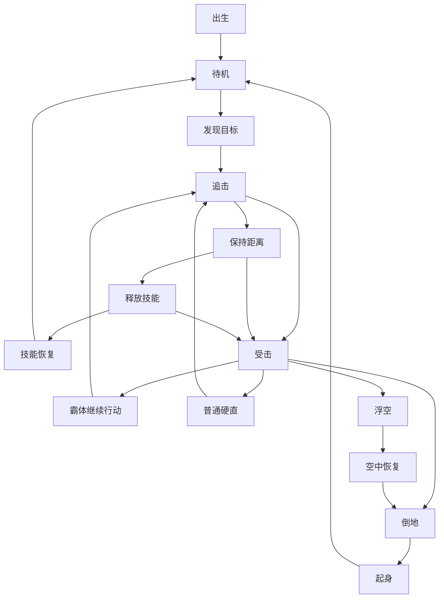
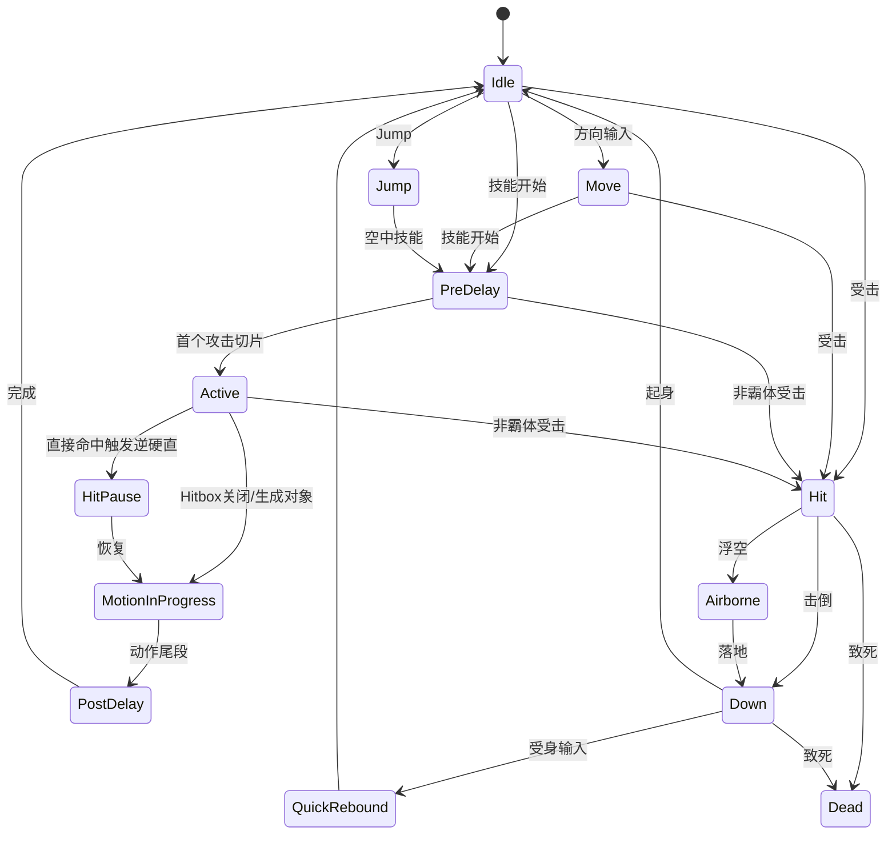

# DNF/DFO 战斗系统实现细节研究报告

## 执行摘要

这份报告的核心结论只有一句话：**如果目标是“可直接用于 1:1 复刻”，首先必须把目标版本锁死到某个具体构建号/赛季，再把 `Script.pvf`、`ImagePacks2/NPK`、技能脚本、ANI 帧数据、对象脚本、怪物 AI 脚本统一进同一份版本化数据仓**。公开资料足以重建**数据模式、判定框字段、部分技能坐标样例、元素算法、状态层级、怪物 AI 参数族、取消窗口/后摇语义、逆硬直触发条件**；但**不能**直接给出“当前 live 全职业全技能完整逐帧真值表”。公开可追溯的最强证据链是：官方开发者文档与更新说明、公开 API 说明中对 live `Script.pvf` 的描述、公开 PVF/NPK 解析器、以及经典版本逆向社区对 ANI/PVF 字段的逐项解释。citeturn8view0turn8view1turn13search5turn14search0turn36search2

在“能直接落地”的层面，公开资料已经足够支持以下工程决策：
其一，**判定驱动必须是“帧时间线 + 局部空间盒体/圆体 + 状态位”**，而不是把判定写死在代码里；ANI 资料明确给出了 `[DELAY]`（毫秒）、`[ATTACK BOX]`、`[DAMAGE BOX]`、`[DAMAGE TYPE]` 这些逐帧字段。其二，**碰撞核应采用 2.5D 的 AABB/投影盒体模型**；韩国重制分析明确认为 DNF 风格命中判断不是跟着旋转图像做 OBB，而是按未旋转的盒体处理。其三，**直接近身判定技能与“生成子对象/子弹对象”的技能，在 hit pause（逆硬直）、取消、命中去重上必须分开建模**；公开分析已经观察到投射/对象型技能常常不触发与近身挥砍相同的逆硬直。citeturn42search1turn42search0turn28search1turn27view0turn37search3

在伤害模型上，公开资料能稳定确认三件事：
一是**暴击**至少在社区长期整理的 DFO 世界维基中仍维持“物理/魔法暴击分离，暴击造成 50% 额外伤害”的经典语义；二是**元素乘区**存在稳定公式，韩服官方社区帖可见 `(((攻击属强 - 敌方属抗) * 0.0045) + 1.05)` 这一表达；三是**不同伤害类别在不同版本有不同叠加规则**，例如经典“增伤/暴伤”类存在“同类取最高/或按版本限定”的规则，而“技能攻击力”类通常按乘算叠加，105/110 时代又引入了 `Atk. Increase`、`Final Damage` 等新类别。也就是说，**1:1 复刻不能只写一个公式，必须写成版本可切换的规则引擎**。citeturn9search0turn39search13turn39search5turn39search7turn40search8turn10search0turn39search11

在状态系统与 AI 上，公开资料已经足够重建一个很像 DNF 的决策层：
官方访谈型更新明确描述了**一般受击 / 超级护甲 / 抓取免疫（或 Holding 不可）**等状态层级、**Holding Gauge** 随受击动作填充并在满值后短时免疫硬直/抓取、**Break 标签技能**可以打掉超级护甲、以及**空中连段存在额外收益**这样的现代 DNF 逻辑；社区公开的 `aicharacter` 与 `ACT` 文档则已经暴露出 AI 侧常见字段与选择器，如**攻击速度、视野、好战度、换目标时间、与目标保持距离、攻击距离、远距离反应几率、最后攻击者、最后攻击成功、全体敌人、队伍目标**等，这足够直接落成数据驱动的状态机或行为树。citeturn8view3turn29search0turn29search1

最后必须强调版本与法律边界：
**现代官方版本与经典 70/85/86 社区可见版本在系统层面差异很大**。现代官方有明显的防御、无敌、Neutralize、Ignite、Counter/Attack Stance 等重构；经典逆向资料则更容易拿到 ANI/PVF 的底层字段和具体坐标。另一方面，公开逆向社区页面本身常附带“仅供学习交流”“请在 24 小时内删除”等免责声明，部分工具贴甚至直接提到“绕过验证”，这意味着它们对工程验证有价值，但对商业使用、资产再分发、供应链安全都具有显著法律与伦理风险。本文因此**只提取字段、结构与现象，不提供私服部署、破解器、泄露客户端下载或任何绕过步骤**。citeturn32search5turn41view0turn36search1turn36search2turn29search0

## 证据基线与版本边界

**结论。** 想做 1:1 复刻，最重要的不是先写代码，而是先确定“你到底在复刻哪一个 DNF”。公开资料显示，官方 live 版本近年连续改动了防御、无敌、Neutralize、Ignite、Counter 与装备伤害词条；而经典台服/旧版逆向社区则保留了大量更接近“资源原貌”的 ANI/PVF/对象脚本信息。**建议把证据分成三层：官方层、近源层、实验层。** 前两层决定“真值”，第三层只负责补洞。citeturn32search5turn41view2turn10search0turn39search7

**建议采用如下证据层级。**

| 证据层 | 典型来源 | 可用于什么 | 不可用于什么 |
|---|---|---|---|
| 官方层 | 官方开发者文档、官方更新说明、官方访谈/更新日志 | 版本语义、系统定义、词条类别、系统重构方向 | 逐帧 hitbox 真值、所有技能完整帧表 |
| 近源层 | 公开 PVF/NPK 解析器、公开 API 指南、工程化复刻博客 | 数据模式、字段名、解析流程、2.5D 坐标/碰撞设计 | 商业法务安全背书 |
| 实验层 | 经典台服/旧版社区逆向帖、ANI 教程、对象脚本说明 | 具体坐标样例、AI 字段、ANI 标签、经典版本现象验证 | 现代 live 的全量真值、合法可再分发资产来源 |

这套分层的依据很明确：官方开发者门户确有 DFO Open API；DFO World 的 API 指南又直接说明该 API 文档涵盖当前韩服 live `Script.pvf` 的技能/物品信息；同时 GitHub 上存在公开的 PVF/NPK 读取库，社区则长期公开 ANI/PVF 字段说明。把它们串起来，就形成了“官方语义 + 公共解析 + 实验验证”的可落地方法。citeturn8view0turn13search5turn14search0turn42search1

**版本边界建议如下。**

| 目标类型 | 推荐证据主轴 | 原因 |
|---|---|---|
| 现代官方服复刻 | 官方更新说明 + 开发者 API 语义 + 自行本地解析目标客户端 | 词条、Neutralize、Ignite、防御/无敌改动都在持续演化 |
| 经典 60/70/85/86 复刻 | 经典客户端资源 + ANI/PVF 社区字段说明 + 经典现象录像 | 更容易拿到底层资源结构与社区修复经验 |
| PvP 特化复刻 | 经典资源 + Arena 更新说明 + 训练场帧步回放 | Arena 与 PvE 参数、后摇和判定经常并不相同 |
| 仅做“像 DNF”的战斗原型 | 韩国 MakeDNF 工程复刻思路 + 官方系统语义 | 投入最低，适合先把引擎搭出来 |

这个分法的重要性在于：**同一个技能名，在 PvE / Arena、经典 / 现代、角色本体 / 子弹对象 / Active Object 之间，可能对应完全不同的判定路径。** 公开社区就已经能看到，漫游的乱射如果只找角色本体 `randomshoot.ani` 会看到 `[DAMAGE BOX]` 而不是攻击框，真正的 `[ATTACK BOX]` 藏在 `character/gunner/effect/animation/bullet/randomshoot.ani`；又如剑魂某个 PVP 武器动画修 bug 时，直接就是补 `rapidmoveslashmove*.ani` 的逐帧 `ATTACK BOX`。citeturn37search3turn36search0

**法律与伦理风险必须前置写进研发规范。** 公开逆向社区页面自己就写着“素材多源于网络”“仅供单机学习交流”“请在 24 小时内删除”；某些工具贴还写出需要“绕过验证”。这说明这些资料在**结构研究**上有价值，但不应被当成可直接进入商业仓库的“干净素材”。建议研发制度上明确：**字段结构可以借鉴，任何原始资产、脚本、可执行文件、登录器、补丁二进制一律不入库；只能导出自建 JSON/CSV/Proto 的“事实表”进入项目。**citeturn36search1turn36search2turn29search0

## 技能判定框与帧数据

**结论。** DNF 风格技能判定的核心不是“动画播到哪一张图”，而是“当前时间线切到了哪一个帧切片，切片上挂了哪些局部空间盒体、什么状态位、是否转交给了子对象”。公开 ANI 资料已经清楚给出逐帧字段：`[FRAME MAX]`、`[IMAGE POS]`、`[DELAY]`（毫秒）、`[DAMAGE TYPE]`、`[ATTACK BOX]`、`[DAMAGE BOX]`；其中 `ATTACK BOX` / `DAMAGE BOX` 都是两组 XYZ 坐标，天然适合导入为 2.5D 的局部 AABB。citeturn42search1turn42search0

**逐帧字段到运行时结构的直接映射如下。**

| ANI 字段 | 公开语义 | 推荐运行时字段 | 实现注意点 |
|---|---|---|---|
| `[FRAME MAX]` | 总帧段数 | `frameCount` | 代表切片数，不等于 60fps 的逻辑帧数 |
| `[IMAGE POS]` | 图像基点/Pivot | `spritePivot` | 作为局部空间判定框原点参考 |
| `[DELAY]` | 当前帧持续毫秒 | `durationMs` | 不要丢成 float 秒，保留整数毫秒 |
| `[DAMAGE TYPE]` | 逐帧附加状态，如 `SUPERARMOR` | `stateFlags` | 霸体/无敌不要写死在技能代码里 |
| `[ATTACK BOX]` | 攻击判定框，X1Y1Z1 / X2Y2Z2 | `attackBoxes[]` | 局部空间 min/max |
| `[DAMAGE BOX]` | 受击框，X1Y1Z1 / X2Y2Z2 | `hurtBoxes[]` | 某些 down/air/downed 动画可特化 |
| `[IMAGE RATE]` / `[RGBA]` / 旋转 | 视觉层 | 可选 visual-only | 默认不影响碰撞核 |

上表并不是“推测”，而是直接来自公开 ANI 结构说明；同一批资料也明确把 `[DAMAGE TYPE] SUPERARMOR`、`[ATTACK BOX]` 与 `[DAMAGE BOX]` 放在每帧字段里。另一个公开帖还给出 `ATTACK BOX` 的十六进制落盘示例，说明这不是 UI 层概念，而是实打实的二进制资源字段。citeturn42search1turn42search0turn19view0

**碰撞形状建议采用“局部空间 AABB + 2.5D 投影”实现。** 韩国的 MakeDNF 重建分析专门拿“量子爆弹导弹图像旋转但判定并不跟着旋转”的现象做了验证，结论是 DNF 风格判定更像**AABB 而不是 OBB**；其实现上把 XZ 平面的 hitbox 做成 Box/Circle 两类，把 XY 平面统一为 Box，再做投影重叠测试。对 1:1 复刻而言，这个思路非常重要，因为它能解释很多“图像明明斜着飞，为什么边擦到也算中”的 DNF 味道。citeturn28search1

**公开能验证到的坐标样例如下。**

| 样例文件 | 阶段 | 局部最小点 `(x1,y1,z1)` | 局部最大点 `(x2,y2,z2)` | 盒体尺寸 `(dx,dy,dz)` | 备注 |
|---|---|---:|---:|---:|---|
| `rapidmoveslashmove1.[pvp].ani` | 已公开第 2 帧 | `(-57,-20,71)` | `(66,35,107)` | `(123,55,36)` | 典型“突进前段”长条盒 |
| `rapidmoveslashmove2.[pvp].ani` | 第 1 帧 | `(-17,-15,28)` | `(99,30,120)` | `(116,45,92)` | 更厚的中段盒体 |
| `rapidmoveslashmove2.[pvp].ani` | 第 2 帧 | `(-37,-15,50)` | `(88,30,120)` | `(125,45,70)` | 盒体向前收窄、向中线聚拢 |
| `rapidmoveslashmove2.[pvp].ani` | 第 3 帧 | `(-52,-15,50)` | `(70,30,120)` | `(122,45,70)` | 尾段继续收窄 |
| 通用 `ATTACK BOX` 样例 | 单帧 | `(21,-15,27)` | `(46,30,69)` | `(25,45,42)` | 可用于校验解析器坐标顺序 |

这些坐标来自公开索引可见的修复帖与 ANI 教程；需要注意的是，同一修复帖中 `rapidmoveslashmove1` 的第一帧在索引页里出现了**坐标项丢失/排版损坏**，只能把它视为“公开记录不完整”，必须在本地解析目标版本 ANI 后再确认。也正因为这种情况存在，**量产级 1:1 项目不能手抄论坛坐标，必须自动抽取资源。**citeturn36search0turn19view1turn42search0

**下面给出一个适合开发团队直接落库的“逐帧时间线模板”。**

| 时间线切片 | 源文件 | `durationMs` | `attackBoxes[]` | `hurtBoxes[]` | `stateFlags` | `cancelFlags` | 公开可得性 |
|---|---|---:|---|---|---|---|---|
| Startup | `rapidmoveslashmove1.[pvp].ani` f1 | 待本地抽取 | 公开索引不完整 | 待本地抽取 | 待本地抽取 | 待本地抽取 | 部分缺失 |
| Active-A | `rapidmoveslashmove1.[pvp].ani` f2 | 待本地抽取 | 1 个盒体 | 待本地抽取 | 待本地抽取 | 待本地抽取 | 已知坐标 |
| Active-B | `rapidmoveslashmove2.[pvp].ani` f1 | 待本地抽取 | 1 个盒体 | 待本地抽取 | 待本地抽取 | 待本地抽取 | 已知坐标 |
| Active-C | `rapidmoveslashmove2.[pvp].ani` f2 | 待本地抽取 | 1 个盒体 | 待本地抽取 | 待本地抽取 | 待本地抽取 | 已知坐标 |
| Active-D | `rapidmoveslashmove2.[pvp].ani` f3 | 待本地抽取 | 1 个盒体 | 待本地抽取 | 待本地抽取 | 待本地抽取 | 已知坐标 |
| Recovery | 尾段 ANI/State | 待本地抽取 | 无 | 待本地抽取 | 待本地抽取 | PostDelay/可取消点 | 需本地验证 |

这个模板故意把未知值标成“待本地抽取”，因为公开网页确实没有把所有 `DELAY`、`DAMAGE BOX`、取消标记都展示出来。但它已经足够说明如何落地：**所有技能都应该被编译成一个 `SkillTimelineAsset`，每个切片都同时携带时间、盒体、状态、取消信息。**citeturn42search1turn36search0turn17search17turn17search10

**取消点不能只看 ANI，还要看技能逻辑。** 公开资料已经给出三种典型取消语义：
其一，**后摇取消**，例如一些技能“can be canceled during the post-casting delay”；其二，**命中后取消**，如 “can be canceled … after a successful hit”；其三，**地面/空中双向衔接取消**，如 Quick Move 一类技能能在 post-delay 中再衔接其他技能。也就是说，`cancelFlags` 至少要拆成 `CancelOnPostDelay`、`CancelOnHit`、`CancelOnAir`、`CancelToSkillMask` 等数据位，而不是一个简单布尔值。citeturn17search17turn17search10turn17search7

**很多技能并不是“一个会移动的 hitbox”，而是“多个静态 hitbox 在不同切片启用”。** 韩国 MakeDNF 的“Half Moon/반월(半月)”分析很有价值：作者起初以为 hitbox 会跟着剑气运行时移动，后来逐帧观察发现更像是**一个攻击内存在多个 hitbox**，按动画时序切换启用。对于 DNF 这类横版 ACT，这个结论非常实用，因为它能避免运行时拖动 collider 带来的误差与调试困难。citeturn25view1

**投射物与主动对象必须单独建模。** 乱射的公开排错帖说明，本体动画里看到的是 `[DAMAGE BOX]`，真正的攻击框在 bullet/effect 动画里；而逆硬直分析帖则观察到，**直接由 Skill 类判定命中的技能**与**生成 Projectile/Object 再命中的技能**，在逆硬直和取消的体感上并不一致。工程上应把这两类都纳入统一 `AttackEmitter` 接口，但内部区分 `DirectEmitter` 与 `ObjectEmitter` 两条路径。citeturn37search3turn27view0

**可直接使用的解析伪代码如下。**

```pseudo
function BuildSkillTimeline(aniFile, actorFacing):
    timeline = []
    currentMs = 0

    for frame in aniFile.frames:
        slice = FrameSlice()
        slice.startMs = currentMs
        slice.endMs   = currentMs + frame.delayMs
        slice.pivot   = frame.imagePos
        slice.flags   = ParseDamageType(frame.damageType)

        for box in frame.attackBoxes:
            slice.attackBoxes.add(ToLocalAABB(box.x1, box.y1, box.z1, box.x2, box.y2, box.z2))

        for box in frame.damageBoxes:
            slice.hurtBoxes.add(ToLocalAABB(box.x1, box.y1, box.z1, box.x2, box.y2, box.z2))

        timeline.add(slice)
        currentMs = slice.endMs

    return timeline
```

**实现注意点。**
第一，`[DELAY]` 是毫秒，不要一开始就换成浮点秒；后续转逻辑 tick 时再量化。第二，X 方向要乘朝向符号，角色朝左时要做 min/max 交换。第三，若技能生成子对象，则本体时间线只负责“生成时刻”和“可取消点”；真正的攻击盒在对象时间线上。第四，要有 `alreadyHitTargets` 或 `hitWindowId`，否则多帧持续 hitbox 会把同一目标每 tick 都打一遍。citeturn42search1turn24view0

**测试用例。**
建议至少覆盖六组：单帧 hitbox；多帧持续 hitbox 命中去重；角色朝向翻转；子弹/对象型技能；后摇取消；边缘 Z 轴擦边命中。测试判定时必须同时显示 `ATTACK BOX`、`DAMAGE BOX`、当前切片索引、状态位、已命中列表。ANI 可视化编辑工具帖子里甚至专门提到过 “BOX 原点默认显示” 的修复，这说明“看到盒体”在 DNF 类项目里不是锦上添花，而是基本研发能力。citeturn36search2

## 伤害计算与属性算法

**结论。** 公开资料不足以无歧义重建“当前 live 全部职业、全部词条、全部副本规则下的唯一伤害真公式”，但足以重建一个**版本可切换、工程可落地**的伤害框架：
`基础段伤害 × 攻击力/主属性项 × 元素项 × 暴击项 × 词条项 × 模式项 × 目标修正`。其中**元素项与暴击项有公开公式/公开常识**，**词条项的叠加类别能从官方社区帖得到稳定规则**，而“基础段伤害常数、舍入时机、某些版本特有乘区”则必须回到目标版本客户端或实测中补齐。citeturn9search0turn39search13turn40search8turn10search0

**先把公开能确定的部分固定下来。**

| 模块 | 公开可确认内容 | 实现建议 |
|---|---|---|
| 暴击 | 物理/魔法暴击分离；暴击额外 50% 伤害 | `critMult = 1.5`，按攻击类型分别判定 |
| 元素乘区 | `(((攻击属强 - 敌方属抗) * 0.0045) + 1.05)` | 作为独立乘区 `M_elem` |
| 属性追加伤害 | `属性追加伤害 = M_elem × 属性追加数值` | 作为“追加伤害”族的一部分 |
| 经典伤害类别 | 不同类别通常乘算；部分同类只取最高或同类内特殊叠加 | 版本化规则表 |
| 现代 105+/110+ 类别 | `Atk. Increase`、`Final Damage`、`Skill Atk.` 等 | 同样做成版本化规则表 |
| 穿透/破防 | 现代官方明确删除过“怪物防御贯通伤害”等不直观机制 | 不要硬编码统一 def-pen 乘区，按版本插件化 |

上表几乎都能从公开资料里找到支撑：DFO World 的状态页给出暴击额外 50% 伤害；韩服官方社区帖给出元素公式；2017 和后续官方社区分析帖则明确讲了“同类/异类”的叠加区分以及“技能攻击力”为乘算；现代官方更新页又持续出现 `Atk. Increase`、`Overall Damage`、`Skill Atk.`、`All Elemental Damage` 等新类目。citeturn9search0turn39search13turn39search5turn40search3turn40search8turn10search0turn32search11

**推荐的统一公式如下。**

\[
D_i = \Big\lfloor B_i \cdot M_{atk} \cdot M_{stat} \cdot M_{elem} \cdot M_{crit} \cdot M_{opt} \cdot M_{mode} \cdot M_{target} \Big\rfloor
\]

其中：

- \(B_i\)：第 \(i\) 段技能基础伤害或段系数。**这是最需要从目标版本客户端抽取的真值表。**
- \(M_{atk}\)：武器攻击/独立攻击/技能攻击类型相关项。
- \(M_{stat}\)：力量/智力等主属性项。
- \(M_{elem}\)：元素乘区。
- \(M_{crit}\)：暴击乘区。
- \(M_{opt}\)：装备/被动/增伤词条乘区。
- \(M_{mode}\)：模式项，如 Counter、Aerial、Arena Combo Limit、Neutralize 规则。
- \(M_{target}\)：敌方专属修正，如敌类型、阶段、特殊破防状态。

**元素项可以直接落地为：**

\[
M_{elem}= \max(M_{elem,min}, 1.05 + 0.0045 \cdot (E_{atk}-R_{target}))
\]

这里 \(E_{atk}\) 是角色最终属强，\(R_{target}\) 是敌方最终属抗。公开官方社区帖已经把“敌方属抗”写进公式，因此如果你的目标版本存在“属抗削减/忽略属抗/属性穿透”，工程上最稳妥的做法不是再强行加一个额外乘区，而是把它们**折叠进 \(R_{target}\) 的求值**。citeturn39search13turn39search7

**暴击项建议写成：**

\[
M_{crit}=
\begin{cases}
1, & \text{未暴击} \\
1.5 \cdot (1 + C_{bonus}), & \text{暴击}
\end{cases}
\]

其中 `C_bonus` 是否存在、同类如何叠加，取决于目标版本。对经典版本，可按“暴击伤害增幅类同类规则”做版本化；对现代版本，则把这些选项归入 `OptionCategoryRules`。公开来源能稳定支持的是“暴击 1.5 倍”和“物理/魔法暴击分离判定”。citeturn9search0

**词条叠加一定要做成数据表，不要写死。** 比较稳妥的结构是：

```pseudo
enum StackRule {
    HighestOnly,     // 同类只取最高
    Additive,        // 同类加算
    Multiplicative,  // 同类乘算
    VersionScripted  // 版本脚本自定义
}

struct OptionCategoryRule {
    categoryId
    stackRuleWithinCategory
    multiplyWithOtherCategories
    appliesOnlyIfCritical
    appliesOnlyIfHitSuccess
}
```

这是因为公开资料已经反复说明了 DNF 伤害项并非一个统一逻辑：旧时代“增伤/暴伤”这类项目与“技能攻击力”类的叠加规则不同；新版本又引入新的主词条体系。如果你不把规则外置，后续版本迁移会非常痛苦。citeturn40search8turn10search0turn39search11

**“基础伤害、分段、连击系数”应该这样处理。**
基础伤害 `B_i` 以**每段**为单位存储，而不是一个总伤害再平均分摊。分段一旦独立，才能正确支持：多段 hitbox、部分段命中、对象型额外段、不同段触发不同效果、Aerial 只加后续空中段等需求。至于“连击系数”，公开资料对全局 PvE 通用 combo coefficient 并不充分，但 DFO World 的 PvP 机制页摘要确实提到**standing combos 存在 damage limit**，而官方访谈又明确提到某些内容里存在**aerial damage increase**。工程上最稳妥的方案是：**把 combo / aerial / counter 当作 mode-specific 规则，而不是强行假设所有 PvE 都有统一连击倍率。**citeturn9search3turn8view3turn32search17

**防御穿透与防御公式不要臆造。** 现代官方明确承认过历史上存在“怪物使用防御贯通伤害”这类不直观机制，并说明后来做了删除和防御体系重构。这至少证明了两件事：一，**防御相关机制是版本高度敏感的**；二，**不能把某个社区传公式当成跨版本真理。** 因此，如果你的目标是经典复刻，优先从目标客户端/录像实测得到防御收益表；如果目标是现代复刻，则把防御、减伤、Ignore/Break 统一做成版本插件。citeturn41view0turn41view1turn41view2

**可直接运行的伪代码如下。**

```pseudo
function CalcHitDamage(attacker, target, skillId, segmentId, ctx):
    seg = SkillTable[skillId].segments[segmentId]        // 真值表
    M_atk   = EvalAttackTerm(attacker, skillId, ctx.version)
    M_stat  = EvalMainStatTerm(attacker, skillId, ctx.version)
    M_elem  = max(ctx.elemMin, 1.05 + 0.0045 * (attacker.elemPower - target.elemResEffective))
    M_crit  = EvalCritTerm(attacker, skillId, ctx.attackType, ctx.version)
    M_opt   = EvalOptionMultipliers(attacker, target, skillId, segmentId, ctx.version)
    M_mode  = EvalModeMultipliers(ctx.mode, ctx.isCounter, ctx.isAerial, ctx.comboState)
    M_tgt   = EvalTargetModifiers(target, ctx)

    raw = seg.baseValue * M_atk * M_stat * M_elem * M_crit * M_opt * M_mode * M_tgt
    return ApplyDeterministicRounding(raw, ctx.versionRoundingProfile)
```

**一个数值示例。**
假设某一段 `seg.baseValue = 1000`，角色有效属强 300，敌方有效属抗 50，则：

\[
M_{elem}=1.05 + 0.0045 \times (300-50) = 2.175
\]

再假设该段发生暴击，且当前版本中 `Skill Atk.` 组合后为 `1.20`，其他乘区合并后 `M_mode \times M_target = 1.10`，则：

\[
D = \lfloor 1000 \times 2.175 \times 1.5 \times 1.20 \times 1.10 \rfloor
  = \lfloor 4306.5 \rfloor = 4306
\]

如果这是一个两段技能，且两段基础值分别为 400 与 600，那么应该分别结算为 1722 与 2583，再按 UI 需要聚合，而不是先聚总再分段。这个做法更接近 DNF 的“段驱动”实现，也更容易对齐 hitbox 与 hit pause。元素项与暴击项的数值来源是公开可确认的，舍入点位则务必按目标版本做回归。citeturn39search13turn9search0

**测试用例。**
至少覆盖：零暴击/满暴击；正属抗/负属抗；属性削抗；同类伤害词条只取最高；技能攻击力重复乘算；两段技能只命中一段；Counter/Aerial 打开与关闭；版本切换前后同样面板输出变化。所有回归应保存“每段中间项日志”，否则你只会知道最终数值错了，却不知道是错在元素、暴击还是词条类别。citeturn40search8turn39search7

## 怪物受击逻辑与 AI

**结论。** DNF 风格怪物逻辑应拆成两层：**受击判定层**与**行为决策层**。受击判定层解决“这一击能不能让怪硬直/浮空/倒地/抓取/Break”；行为决策层解决“怪现在该追谁、离多远、用哪个技能、多久换目标”。公开资料已经把这两层都暴露得足够清楚：官方更新访谈描述了**一般 / 超级护甲 / 抓取免疫**、**Holding Gauge**、**Break 技能**与**空中追加收益**；社区 `aicharacter` 文档给出**攻击速度、好战度、视野、攻击距离、换目标时间、保持距离**等参数，`ACT` 条件对象文档又给出**目标选择器与最近攻击者/攻击成功事件**。citeturn8view3turn29search0turn29search1

**受击优先级建议按下面的层级实现。**

| 层级 | 命中后是否掉血 | 命中后是否硬直 | 命中后是否可被抓/控 | 典型来源 |
|---|---|---|---|---|
| 无敌 / 无受击框 | 否或规则特判 | 否 | 否 | 官方无敌改动、down/特殊动画 |
| 抓取免疫 / Holding 不可 | 通常是 | 否或弱反馈 | 否 | 官方对怪物受击层级的说明 |
| 超级护甲 | 是 | 通常否，除非 Break | 一般否 | `DAMAGE TYPE SUPERARMOR` / 官方访谈 |
| 普通受击 | 是 | 是 | 视技能而定 | 普通 hit |

官方访谈对“몬스터의 피격 조건(怪物受击条件)”已经给出了很直接的三分法：一般、超级护甲、Holding 不可；它还明确说 Healing/Holding Gauge 会随着受击动作持续而增长，满值后一定时间内会对硬直和 Holding 免疫，而带 `[Break]` 标签的技能可以打掉超级护甲。这个说明已经足够支撑一个完全工程化的数据模型。citeturn8view3

**一个可直接落地的受击解析器应先判 `DAMAGE BOX`，再判状态，再判反馈。**
也就是说，命中流程不应直接写成“碰到就受击”，而应是：

1. 是否存在 `DAMAGE BOX` / 是否处于可受击动画。
2. 是否处于 `Invincible` 或“当前不响应受击”的特殊状态。
3. 如果是 grab/hold 技能，目标是否 `HoldImmune`。
4. 如果目标是 `SuperArmor`，本击是否带 `Break`。
5. 只有在以上条件通过后，才决定 `feedbackType = Flinch / Launch / Knockdown / Hold / None`。

这个顺序也能解释社区里“给 `down.ani` 加上 `[DAMAGE BOX]` 后就能打浮空连击”的现象：**down 状态下有没有受击框，直接改变了目标是否还能被继续当作空中/倒地连段对象处理。**citeturn38search0turn42search1

**怪物行为参数，公开资料已经给了很好的“数据表骨架”。**

| 参数族 | 社区公开语义 | 运行时字段建议 |
|---|---|---|
| 等级/基础状态 | 人偶/APC 等级、状态/速度 | `level`, `moveProfile` |
| 攻击速度 | 直接写在 `.aic` | `attackSpeedScale` |
| 远距反应几率 | 远距离攻击反应概率 | `rangedReactChance` |
| 技能代码/技能值覆写 | 可修改使用技能与某些技能值 | `skillSet[]`, `skillOverrides[]` |
| 发呆时间 | 不动作的停顿时间 | `idleMsRange` |
| 更换目标时间 | 多久换目标 | `retargetCooldownMs` |
| 与目标保持距离 | 保持的安全/追击距离 | `maintainDistance` |
| 好战度 | Aggro 倾向 | `aggressionWeight` |
| 视野 | 感知半径 | `sightRange` |
| 攻击距离 | 技能释放距离 | `attackRange` |
| 出现地点 | 坐标 | `spawnPoint` |
| 调用文件 | 行为/按键顺序/释放脚本 | `behaviorScriptRef` |

这些字段的精确定义在社区文档里仍有“具体作用自测”的部分，但对开发团队来说足够了：**字段存在本身就是最大的信息**。只要你的 AI 系统支持这些参数，你就能把绝大多数 DNF 怪 AI 做成“数据配置问题”，而不是把每只怪写成独立脚本。citeturn29search0

**目标选择器也已经可以直接翻译成行为树黑板键。**

| 公开选择器 | 推荐黑板键 |
|---|---|
| `[TARGET]` | `bb.target` |
| `[LAST ATTACKER]` | `bb.lastAttacker` |
| `[LAST ACTIVE ATTACKER]` | `bb.lastActiveAttacker` |
| `[LAST ATTACKSUCCESS]` | `bb.lastAttackSuccessTarget` |
| `[CHARACTER ATTACKSUCCESS]` | `bb.characterAttackSuccess` |
| `[ALL ENEMY]` | `bb.allEnemies[]` |
| `[PARTY TARGET]` | `bb.partyTargets[index]` |
| `[INCLUDE DEAD]` / `[CHECK NEXT]` | 查询开关 |

`ACT` 资料把这些目标对象写得非常直白，这对 AI 工程有直接价值：你不需要“推测 DNF 会不会记住最后一个打我的人”，因为文档已经告诉你这类对象是存在的。citeturn29search1

**公开没有给出“仇恨值公式”，所以仇恨必须按可观测字段重建。** 推荐的仇恨函数写成：

```pseudo
score(target) =
    wSight      * InSight(target)
  + wDistance   * DistanceScore(target, maintainDistance, sightRange)
  + wDamage     * RecentDamageFrom(target)
  + wLastAtk    * Bool(target == lastAttacker)
  + wSuccess    * Bool(target == lastAttackSuccessTarget)
  + wTaunt      * TauntLevel(target)
  - wSwitchLock * Bool(now < nextRetargetAllowedTime)
```

其中 `w*` 全由怪的 `AIProfile` 提供。这个公式不是公开真值，而是**对公开字段的最合理工程化落地**：如果你已经有“视野、保持距离、最后攻击者、换目标时间”，那仇恨系统最自然的写法就是围绕这些字段。公开资料没有给更具体的数值，所以请把权重留给数据表。citeturn29search0turn29search1

下面这张流程图对应的就是一个 DNF 风格怪物状态机，足够直接放进开发文档里。



这张图与公开资料的对应关系是：目标获取/更换来自 `aicharacter` 的视野、保持距离、换目标时间、好战度；受击层级来自官方对一般/超级护甲/Holding 不可与 Break 的描述；倒地后是否还能继续被打，则受 `DAMAGE BOX` 是否存在影响。citeturn29search0turn8view3turn38search0

**测试用例。**
首先测“最后攻击者抢仇恨”；其次测“保持距离型怪在远近切换时是否来回抖动”；再次测“超级护甲 + Break 技能”是否从无硬直切到可硬直；再测“倒地动画移除/添加 `DAMAGE BOX`”是否改变空中连段；最后测 “retargetCooldownMs” 是否防止怪在多人战里每帧切目标。没有这些回归，AI 看起来就会像“能打”，但不会像 DNF。citeturn29search0turn38search0

## 主角动作系统、逆硬直与空中规则

**结论。** DNF 风格主角动作最适合用**“循环状态 + On/Off 行为开关”**来实现：`Idle/Attack/Hit/Down/Dead` 这些是循环状态，`Move/Jump` 则像附着在状态上的 capability flag。韩国 MakeDNF 的实现分享正是这样做的；这个做法非常贴合 DNF，因为角色完全可能在某些技能中禁移禁跳，也可能在另一些技能中保留位移或空中衔接能力。citeturn25view0

**推荐的玩家动作状态表如下。**

| 状态 | 进入条件 | 退出条件 | 可移动 | 可跳跃 | 典型数据 |
|---|---|---|---|---|---|
| Idle | 无动作/动作结束 | 攻击、跳跃、受击 | 是 | 是 | `CanMove=true` |
| Move | 摇杆输入 | 摇杆释放/切状态 | 是 | 可 | `moveSpeed` |
| Jump | 跳跃输入 | 落地/空中技能 | 视版本 | 否 | `jumpArc` |
| Attack.PreDelay | 技能开始 | 到首个判定切片 | 通常否 | 通常否 | `startupMs` |
| Attack.Active | hitbox 开启 | hitbox 关闭/生成对象 | 通常否 | 技能特化 | `attackBoxes[]` |
| Attack.MotionInProgress | active 后动画延续 | 进入后摇 | 视技能 | 视技能 | `comboBufferOpen` |
| Attack.PostDelay | 尾部恢复 | 回到 Idle/被取消 | 视技能 | 视技能 | `cancelFlags` |
| Hit | 受击成立 | 恢复、浮空、倒地 | 否 | 否 | `hitReactionType` |
| Down | knockdown | 起身/Quick Rebound | 否 | 否 | `downedState` |
| Dead | HP<=0 | 复活/场景结束 | 否 | 否 | `respawnPolicy` |

之所以这样拆，是因为公开复刻博客明确提到他们把 `MoveBehaviour` 与 `JumpBehaviour` 做成了 On/Off，而 `Idle/Attack/Hit` 则是循环状态；同时，Ground Monk / Fire Knight 的基础连段分析又说明“追加输入窗口”是在特定攻击子阶段开启的，而不是整个攻击过程中始终开启。citeturn25view0turn23view1

**输入缓冲与连段窗口建议按“HitboxActive + MotionInProgress”建模。** 韩国复刻项目在 Ground Monk 与 Fire Knight 的基础攻击分析里都提到，追加输入只在 `HitboxActive` 与 `MotionInProgress` 两段开放。这和 DNF 体感很一致：很多普通攻击/低阶技能允许你在命中切片与动作延续切片中提前输入下一段，但在纯 startup 或某些硬直状态里并不能接。工程上可以直接给每个 `FrameSlice` 或 `AttackSubState` 挂一个 `bufferMask`。citeturn23view1

**无敌、霸体、普通受击不是“效果”，而是 hitbox state。** 韩国的 hitbox 外轮廓实现分析明确写到：DNF 风格存在三种 hitbox 状态——普通、超级护甲、无敌；并且在视觉上通过不同颜色/外轮廓反馈出来。这个观察与官方对“部分无敌技改为超级护甲、其余保留无敌”的更新说明相互印证。也就是说，角色自身应至少有一个 `HitboxState` 枚举，而不是把无敌写成“跳过 OnDamage 的一个临时 if”。citeturn23view0turn41view0

**逆硬直要单独建模，且直接判定与对象判定要分开。** 韩国“恶即斩/악즉참”逆硬直分析的核心结论很实用：**近身或直接由 Skill 本体做命中判定的技能，会出现更明显的逆硬直；而生成 Projectile/Object 再伤害的技能，逆硬直表现不同，甚至可视为不走同一路径。** 这意味着你的运行时里最好把 `hitPauseOnDirectHit` 和 `hitPauseOnObjectHit` 分成两个字段。citeturn27view0

**推荐的逆硬直处理伪代码如下。**

```pseudo
function OnHitConfirmed(attacker, defender, emitter):
    ApplyDamage(defender)

    if emitter.type == DirectEmitter and emitter.recoilTicks > 0:
        attacker.anim.pause(emitter.recoilTicks)
        attacker.logic.lockFor(emitter.recoilTicks)

    if emitter.cancelOnHit:
        attacker.OpenCancelWindow(emitter.cancelMask)
```

这里的 `pause` 与 `lock` 最好用逻辑 tick，而不是浮点秒。因为韩国实现分析专门提到过，靠 `deltaTime` 和动画速度倒数去算时间，很容易因为浮点误差与动画速度变化造成时序不稳；他们后来才转向依赖 AnimatorStateInfo/状态切片去捕获准确时机。对 1:1 复刻而言，**更进一步的做法是彻底不用运行时浮点算帧，而是预编译离散时间线。**citeturn27view1

**空中战斗规则必须至少支持以下几条。**

| 规则 | 公开支持程度 | 工程实现建议 |
|---|---|---|
| 目标被上挑后可继续空连 | 官方访谈明确存在 aerial bonus 场景 | `target.airborne=true` 后开放空中受击表 |
| down/倒地状态是否还能被打 | 社区现象表明取决于 down.ani 是否存在 `DAMAGE BOX` | `downedHurtboxProfile` 独立配置 |
| 超级护甲目标是否会被打上天 | 取决于是否被 Break、是否允许 launch | `feedbackPolicy` 按状态表走 |
| 空中优先级 | 未见统一官方完整表 | 数据驱动：`Grab > Break > Launch > Down > Flinch` 作为默认草案 |
| 落地硬直 | 未公开统一数值 | 配 `landingRecoveryMs`，按目标体型/状态分层 |
| 空中技能取消 | 公开技能页可见部分技能可 ground/air 使用并在 post-delay 取消 | `cancelOnAir` 数据位 |

官方访谈已经明说过：某些玩法里，先把敌人打到“무방비(无防备)（无防备）”状态，再用升龙类技能把敌人挑起，后续空中连段会得到额外伤害反馈；而社区帖子又明确展示了通过给 `down.ani` 加上 `DAMAGE BOX` 能让原本不可再打的 down 怪继续被浮空连击。这两者一起说明：**空中规则并不是简单的“在空中就能一直打”，而是受受击框与反馈状态强烈控制。**citeturn8view3turn38search0

**防倒地起身与回避技能要走独立状态。** DFO World 的技能页摘要给出两个非常有代表性的例子：`Quick Rebound` 会让角色从倒地快速恢复并在短时间内进入无敌/无受伤区间；`Quick Move` 则可在地面或空中使用，并且能够在 post-delay 中再取消到别的技能。再加上 `Phase Shift` 这种“0.5 秒无敌 + temporary recoil”的技能，可以得出一个明确设计：**Backstep / Quick Rebound / Quick Move / Phase Shift 这类动作不应混在普通 AttackState 里，而应作为具有更高优先级的 UtilityAction。**citeturn17search6turn17search7turn17search0

**“切换武器”没有公开可确认的统一战斗内状态机。** 目前公开资料里看到的更多是“技能依赖武器类型修改攻击范围/抓取范围/后摇”，而不是一个所有职业通用的战斗内切武系统。因此如果你的项目目标是复刻 PC DNF/DFO，建议把“武器切换”标注为**无公共统一约束**：
如果某个目标版本或某个职业的确存在技能驱动的武器形态切换，就把它当成技能状态变化；否则不要在主控状态机里硬加一个全局 `WeaponSwap`。这个结论来自公开资料“缺失”，而不是来自一个具体明文规则。citeturn32search9turn32search6

下面这张状态图可以直接作为程序和动画团队的共识图。



**测试用例。**
建议至少做：未命中完整后摇；命中触发逆硬直；命中后取消；空中技能接地面技能；倒地受身；超级护甲吃 hit 不进 `Hit`；Break 打断超级护甲；带/不带 `DAMAGE BOX` 的 down 动画对比。只有这些都过了，角色才会真正“像 DNF”。citeturn27view0turn17search6turn8view3

## 开发实现模型与网络同步

**结论。** 如果团队要把这份资料直接转为工程，最佳路线不是“先写玩法代码”，而是先做**一条从资源到运行时资产的编译链**：`PVF/NPK/ANI -> 中间格式 -> 运行时 Timeline/Collider/AI 资产 -> 回放与校验工具`。公开资料已经足够支持这条链的字段设计、碰撞算法、Hit dedupe、动画时序同步和 AI 参数仓设计。至于网络层，公开资料只说明了 DNF 当年把“网络技术”视为核心竞争力，并没有公开明确协议，因此**在网络同步上暂无可声称的“官方特定约束”**；最稳妥的做法是用服务器权威 + 固定 tick + 输入/事件日志回放。citeturn33search0turn34view1turn24view0turn27view1

**推荐的数据结构如下。**

```pseudo
enum HitboxState {
    Normal,
    SuperArmor,
    Invincible
}

enum FeedbackType {
    None,
    Flinch,
    Launch,
    Knockdown,
    Hold,
    Break
}

struct Box3i {
    int x1, y1, z1;
    int x2, y2, z2;
}

struct FrameSlice {
    int startMs;
    int endMs;
    Vec2i spritePivot;
    HitboxState hitboxState;
    List<Box3i> attackBoxes;
    List<Box3i> hurtBoxes;
    Bitset cancelFlags;
    int hitWindowId;
    string spawnObjectRef;
}

struct SkillTimelineAsset {
    int skillId;
    string sourceAni;
    List<FrameSlice> slices;
    bool isDirectEmitter;
    int recoilTicks;
    Option<CancelMask> cancelOnHit;
    Option<CancelMask> cancelOnPostDelay;
}

struct DamageRuleProfile {
    string versionTag;
    Map<OptionCategory, StackRule> optionRules;
    bool useModernAtkIncrease;
    bool useArenaComboLimit;
    RoundingPolicy rounding;
}

struct MonsterAIProfile {
    int level;
    float attackSpeedScale;
    float aggressionWeight;
    int sightRange;
    int attackRange;
    int maintainDistance;
    int retargetCooldownMs;
    float rangedReactChance;
    List<int> skills;
    string behaviorScriptRef;
}
```

这组结构背后的依据是公开资料已经明确出现了：逐帧 `ATTACK BOX`/`DAMAGE BOX`/`DAMAGE TYPE`、`AlreadyHitTargets` 去重、攻击者/受击者的双 hitbox controller、AABB 2.5D、以及 `aicharacter` 的参数族。也就是说，它不是凭空设想，而是把公开可见的 DNF 风格组织方式做了一次工程化归纳。citeturn42search1turn24view0turn28search1turn29search0

**碰撞检测建议采用“XZ + XY 双投影重叠”。**

```pseudo
function Intersects(attBox, hurtBox):
    overlapXZ = Overlap(attBox.x1, attBox.x2, hurtBox.x1, hurtBox.x2)
             && Overlap(attBox.z1, attBox.z2, hurtBox.z1, hurtBox.z2)

    overlapXY = Overlap(attBox.x1, attBox.x2, hurtBox.x1, hurtBox.x2)
             && Overlap(attBox.y1, attBox.y2, hurtBox.y1, hurtBox.y2)

    return overlapXZ && overlapXY
```

如果目标版本要求圆形/扇形地面判定，可以在 XZ 平面额外提供 `Shape2D`，但**先把盒体版做对**，因为公开分析已经表明 DNF 风格的很多“看起来很斜”的对象实际上用的还是盒体思路。citeturn28search1

**采样频率推荐固定为 60Hz 逻辑 tick，但内部时间线保留毫秒。** ANI 资料把 `DELAY` 明确写成毫秒，而韩国实现分析又指出用 `deltaTime` 与动画速度倒数组合去推时机，容易因为浮点误差和速度变化产生偏差。综合来看，最稳妥的落地是：
**资源层保留整数毫秒；运行时把毫秒时间线映射到 60Hz 固定 tick；动画只负责显示，不负责真值时序。**citeturn42search1turn27view1

**一个推荐的命中求解循环如下。**

```pseudo
fixedTick():
    UpdateFSM()
    AdvanceSkillTimelines()
    UpdateSpawnedObjects()

    for each emitter in activeEmitters:
        activeSlice = emitter.timeline.GetSliceByMs(emitter.localTimeMs)

        if activeSlice.attackBoxes.empty():
            continue

        candidates = QueryTargetsByLayer(emitter.targetLayer)

        for target in candidates:
            if target.id in emitter.alreadyHitTargets[activeSlice.hitWindowId]:
                continue

            if ResolveHit(emitter, target, activeSlice):
                emitter.alreadyHitTargets[activeSlice.hitWindowId].add(target.id)
```

`alreadyHitTargets` 不应只有一个全局集合，而应该至少按 `hitWindowId` 或“第几段”分桶。这样才能同时支持：
单段持续 hitbox 防止重复打；多段技能允许每段各打一次；地面持续对象按 `periodic window` 重置命中。这个设计与公开的 `AlreadyHitTargets` 分析完全一致。citeturn24view0

**动画同步与调试方法建议如下。**

| 目标 | 推荐做法 | 原因 |
|---|---|---|
| 精确保留时序 | 资源编译时离散化切片 | 避免运行时浮点误差 |
| 可视化判定 | Scene/战斗调试层常显盒体、Pivot、状态色 | DNF 类项目不看盒体无法调 |
| 回归验证 | 录制输入流 + 状态快照 + 每段伤害日志 | 便于逐段核对 |
| 版本对比 | 同一场景双版本回放 | 看 patch 前后哪一层出差异 |
| 取消窗口调试 | UI 叠加显示 `canCancel/canBuffer` | 动作团队与程序共享真值 |
| AI 调试 | 显示 `targetId、aggro score、retarget cooldown` | 避免“看起来随机” |

**网络同步建议。**
公开资料没有给出 PC DNF 的确切帧同步/状态同步协议，因此这里必须按“建议”而不是“真值”来写。最稳妥的建议是：

- **PvE：服务器权威。** 客户端上送输入事件与技能请求，服务器持有伤害、命中、AI、掉落真值；客户端可本地前演，用服务器事件纠正。
- **PvP：固定 tick + 输入日志。** 若必须追求格斗手感，可在局部战斗房间使用有限 rollback，但**只有在内容资产、时序、舍入全部完全确定后**再做。
- **所有模式：战斗核心必须确定性。** 不允许把伤害、盒体、AI 判定放在非确定浮点路径里。
- **无特定官方约束。** 目前公开来源只能证明原作极度重视网络技术，没有公开能还原精确同步协议的材料。citeturn33search0turn34view1

**测试用例与调试方法。**
最低限度建议做四套自动化：
一套“资源编译单测”，验证每个 `ATTACK BOX` / `DAMAGE BOX` 坐标都满足 min<=max；一套“战斗 determinism 回放测”，同样输入在三台机器上得到同样的每段输出；一套“边界回归”，专测 Z 轴薄盒、朝向翻转、对象生成；一套“版本差异回放”，把 patch 前后同一输入序列并排重播。没有这四套，1:1 复刻项目很容易在后期变成“大家都觉得差不多，但没人知道哪里不一样”。citeturn36search2turn24view0

## 术语对照、来源与实现清单

**关键术语对照表如下。**

| 中文 | English | 韩语 |
|---|---|---|
| 判定框 | Hitbox | 攻击判定框/受击判定框 |
| 受击框 | Hurtbox / Damage Box | 被击框/伤害框 |
| 前摇 | Startup | 前摇 |
| 后摇 | Recovery / Post-delay | 后摇/后延迟 |
| 活跃帧 | Active Frames | Active Frames(活跃帧) |
| 取消点 | Cancel Window | 取消窗口/取消点 |
| 受击硬直 | Hitstun | 硬直/被击硬直 |
| 倒地 | Knockdown / Downed | 다운 |
| 浮空 | Launch / Airborne | 浮空/空中状态 |
| 受身 | Quick Rebound | Quick Rebound(快速起身) |
| 逆硬直 | Recoil / Hit Pause | 逆硬直 |
| 霸体 / 超级护甲 | Super Armor | 슈퍼아머(超级护甲) |
| 无敌 | Invincible / Invulnerability | 무적 |
| 抓取 | Grab / Hold | 抓取/控制 |
| 抓取免疫 | Grab-immune / Hold-immune | 抓取免疫 |
| 破招 / 反击命中 | Counter | 反击/破招 |
| 空连 | Air Combo | 空中连击 |
| 属性强化 | Elemental Strength | 属性强化 |
| 属性抗性 | Elemental Resistance | 属性抗性 |
| 技能攻击力 | Skill Attack | 技能攻击力 |
| 攻击力增加 | Atk. Increase | 攻击力增加 |
| 最终伤害 | Final Damage / Overall Damage | 最终伤害 |
| 多段伤害 | Segmented Damage / Multi-hit | 多段攻击 |
| 主动对象 | Active Object | Active Object(主动对象) |
| 被动对象 | Passive Object | Passive Object(被动对象) |
| 投射物 | Projectile | 投射物 |
| 仇恨值 | Aggro / Threat | 仇恨值 |
| 视野 | Sight Range | 视野 |
| 攻击距离 | Attack Range | 攻击距离 |
| 帧同步 | Frame Sync | 帧同步 |
| 固定 tick | Fixed Tick | 固定Tick |
| AABB | Axis-Aligned Bounding Box | AABB(轴对齐边界框) |

**对开发者友好的 1:1 实现清单如下。**

| 阶段 | 优先级 | 里程碑 | 完成标准 |
|---|---|---|---|
| 锁版本与建仓 | P0 | 固定目标版本、保存 PVF/NPK/可执行哈希 | 任意成员都能拿到同一构建的哈希与资源清单 |
| 资源编译链 | P0 | ANI/PVF/NPK 解析到统一 JSON/Proto | 任意技能可导出 `FrameSlice[]`、对象引用、AI 参数 |
| 碰撞核 | P0 | 2.5D AABB/投影盒碰撞跑通 | 可视化显示 hitbox/hurtbox，朝向翻转正确 |
| 技能时间线 | P1 | `PreDelay/Active/PostDelay/Cancel` 跑通 | 至少 3 个基础技能在回放中可稳定复现 |
| 伤害规则引擎 | P1 | 版本化 `DamageRuleProfile` | 元素、暴击、词条类别单测全绿 |
| 怪物 AI | P1 | `AIProfile + Blackboard + Retarget` | 怪物能按视野/距离/仇恨稳定选敌 |
| 逆硬直与空战 | P2 | Direct/Object emitter 区分 | 近战命中有 recoil，对象命中路径独立 |
| Arena/PvP 差异层 | P2 | 独立 `BattleRuleProfile` | PvE/PvP 参数可热切换，互不污染 |
| 网络与回放 | P2 | 输入日志、状态快照、服务器权威 | 同一输入三次回放结果逐段一致 |
| 回归实验室 | P3 | 版本对比、技能对比、Boss 对比 | 每次改动都能自动输出差异报告 |

**验收标准建议写成“可观察事实”，不要写模糊形容词。**
例如：
“角色朝向翻转后，`ATTACK BOX` 的世界 X 范围镜像但 Y/Z 保持一致”；
“持续 5 个切片的 hitbox 在同一 `hitWindowId` 内只命中一次”；
“给 `down.ani` 去掉 `DAMAGE BOX` 后，该怪在倒地期间不再被空中连段命中”；
“元素强度从 300 提升到 315 时，输出提升符合 `1.05 + 0.0045 * 属强` 比例”；
“Quick Rebound 输入成功时，倒地状态中断并进入短暂无敌”。这些都是团队能直接测出来的真标准。citeturn42search1turn38search0turn39search7turn17search6

**公开资料中仍然拿不到、但项目又必须有的数据。**
第一，全职业全技能的**完整逐帧 `DELAY` / `ATTACK BOX` / `DAMAGE BOX` 真值表**；第二，现代 live 的**完整伤害乘区与舍入时机**；第三，PC DNF 的**精确网络同步协议**；第四，怪物受击硬直与浮空参数的**全量数值表**。这些项目在公开网页中不是零信息，而是“信息不足以形成全量真值”。因此建议用下面这套反向工程流程补齐：

1. 固定目标 build，做哈希快照。
2. 用公开解析器/编辑器抽出全部 ANI/PVF 到中间格式。
3. 批量生成 `FrameSlice`。
4. 用训练场录像逐帧对照切片，校正取消与对象生成时点。
5. 对 Boss/精英单独导出 `down/standup/airhit` 类动画的 `DAMAGE BOX`。
6. 用输入回放做舍入点位穷举，反推 `RoundingPolicy`。
7. 对 PvP 单独建立 `BattleRuleProfile_Arena`。

这个流程本质上就是把公开资料中“能看到字段但看不到全真值”的缺口，用自动抽取和控制变量实验补齐。citeturn14search0turn36search2turn27view1turn37search3

**来源清单如下。以下均为正文中已用到的可点击来源，按语言标注。**

- Neople Developers API Docs（官方开发者文档）[English] citeturn8view0
- Neople Developers API Docs（韩文版）[韩语] citeturn8view1
- DFO World Wiki：Neople Developers API Guide（说明 API 对应 live `Script.pvf`）[English] citeturn13search5
- GitHub：`flwmxd/DNF-Porting`（公开 PVF/NPK 解析库）[English] citeturn14search0
- 韩服官方杂志/开发说明：防御改版、无敌与超级护甲调整 [韩语] citeturn41view0turn41view1turn41view2
- 韩服官方访谈/更新：Holding Gauge、Super Armor Break、Aerial Damage [韩语] citeturn8view3
- 韩服官方更新：Neutralize / Ignite / Combat System Improvements [English] citeturn32search5
- 韩服官方社区帖子：元素公式与伤害词条分析 [韩语] citeturn39search13turn39search5turn39search7turn40search8turn10search0
- DFO World Wiki：Status / Quick Rebound / Quick Move / Phase Shift / PvP Mechanics 摘要 [English] citeturn9search0turn17search6turn17search7turn17search0turn9search3
- ThisIsGame：DNF 押注网络技术（AOGC 报道摘要）[韩语] citeturn33search0turn33search3
- Game Developer 采访：金允钟谈 DFO 与网络环境 [English] citeturn34view1
- 韩国 MakeDNF 工程复刻博客：碰撞、状态机、逆硬直、半月多 hitbox、命中去重 [韩语] citeturn28search1turn25view0turn24view0turn25view1turn27view0turn27view1turn23view0
- 中文 ANI 基础/转换教程：`[DELAY]`、`[ATTACK BOX]`、`[DAMAGE BOX]`、`[DAMAGE TYPE] SUPERARMOR` [中文] citeturn42search1turn42search0
- 中文社区样例：剑魂 `rapidmoveslashmove*.ani` 公开坐标片段 [中文] citeturn36search0turn19view1
- 中文社区样例：乱射的攻击框在 bullet/effect 动画而非本体动画 [中文] citeturn37search3
- 中文社区样例：给 `down.ani` 加 `DAMAGE BOX` 可改变空连结果 [中文] citeturn38search0
- 中文社区 AI/PVF 说明：`aicharacter` 参数与 `ACT` 条件对象 [中文] citeturn29search0turn29search1
- 中文社区可视化工具贴：ANI 可视化编辑、BOX 原点显示 [中文] citeturn36search2

**最终建议。**
如果你们团队明天就要开工，不要先做“所有职业”，先做三条竖切：
一条“直接近身判定技能”；一条“子弹/对象型技能”；一条“带超级护甲/可 Break 的 Boss”。
只要这三条竖切使用**同一套 Timeline、同一套 DamageRuleProfile、同一套 AIProfile** 跑通，DNF/DFO 的“骨架”就已经立住了；剩下的工作不是重写战斗系统，而是规模化采样、校准和回归。
