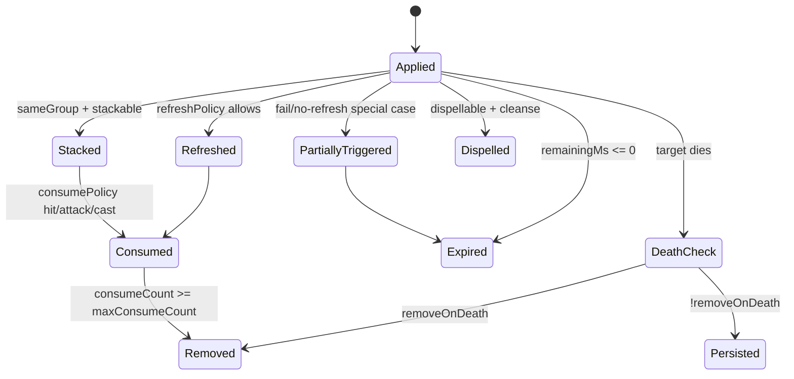
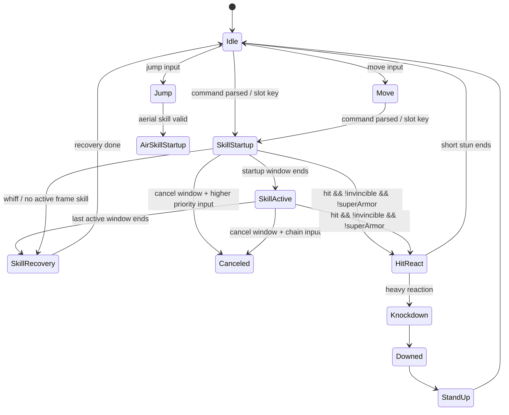

# DNF战斗系统复刻研究报告

## 执行摘要

在本次检索到的公开证据里，**最接近“可直接指导 1:1 实现”的真源头不是现成的全职业逐技能帧表，而是可批量生成帧表的客户端底层数据**：官方公开的技能接口已经暴露出 `skillId / desc / descDetail / descSpecial / consumeMp / coolTime / castingTime / levelInfo` 等结构化字段，但**没有**公开 hitbox、hurtbox、逐帧 active window、霸体窗、无敌窗等字段；与之对应，公开的 PVF/NPK 解析器源码明确显示动画帧里存在 `delay`、`attackBox`、`damageBox`、`damageType`、`flipType`、`clip`、`setFlag` 等逐帧可解析数据。换句话说，**官方接口负责“技能语义层”，客户端动画资源负责“逐帧判定层”**，两者拼起来才够做高精度复刻。citeturn36view0turn36view2turn21view0turn21view1turn23view0

从公开源码与社区工具的交叉证据看，DNF/DFO 的核心碰撞判定更接近**2.5D 的“地面平面 + Z 轴高度”的 6 参数盒体系统**，而不是多边形或像素级碰撞：解析器把 `attackBox` 和 `damageBox` 都读取为 6 个 `int32`，社区 ANI 编辑工具则明确说明“原点在对象脚下”“XY 平面的中心为原点”“实际 Z 起点由下坐标确定，高度由长度决定”。据此，最稳妥的实现模型是**带 Z 高度的轴对齐长方体（AABB prism）**，并把 `attackBox` 视为 hitbox，把 `damageBox` 视为 hurtbox。citeturn21view0turn23view0turn28view0

关于战斗规则，公开资料至少确认了以下关键事实：动画帧可携带 `NORMAL / SUPERARMOR / UNBREAKABLE` 的逐帧受击类型；官方更新已明确“所有角色的一觉期间改为无敌”；韩服/国际服更新里反复出现“前摇缩短”“攻击范围扩大”“多段 hit 数改动但总攻击力不变”“充能时间越长攻击距离/攻击范围越大”“技能可在某个动作后再被 cancel”等表述，这说明**动画、判定、hit count、取消窗口、无敌/霸体窗**在引擎层都是彼此独立、可单独调优的对象。citeturn23view0turn33search4turn33search1turn33search6turn33search8

需要明确的边界是：**用户未指定“复刻的是哪一代 DNF/DFO”**。而 DNF 的战斗公式、装备乘区、Counter 语义、Buff 表征、技能成长字段，在不同年代有显著演化。为了避免把现代 live 服逻辑与经典台服/旧客户端逻辑混用，本文采用“**版本化实现**”策略：把**可由源码/官方接口确认的部分**当作硬约束，把**公开资料未指明**的部分明确标记为“未指定”，并以可配置的 `EraConfig`、`SkillSpec`、`BoxSpec`、`BuffSpec`、`FormulaModule` 交给开发团队落地。citeturn36view2turn45view0turn26search5turn37search4

下表给出本报告最重要的可操作结论。

| 结论 | 优先来源 | 可信度 |
|---|---|---|
| 技能帧判定必须从客户端动画层抽取，官方 OpenAPI 不足以直接生成 hitbox/hurtbox 帧表 | 官方 OpenAPI + 公开解析器源码 citeturn36view0turn36view2turn21view0turn23view0 | 高 |
| 判定形状应优先实现为 6 参数 2.5D 盒体，而非多边形/像素碰撞 | 公开源码 + ANI 编辑工具 citeturn21view0turn23view0turn28view0 | 高 |
| Counter/破招是**时间窗口标志**，不是永久属性；背击对爆炸类技能可按爆点判断 | 官方更新说明 citeturn40search5turn40search10 | 高 |
| 无敌/霸体应建模为**逐帧窗口**，不能只做技能级布尔值 | 动画 `damageType` + 官方技能改动说明 citeturn23view0turn33search4turn33search0 | 高 |
| Buff/Debuff 生命周期必须建模“叠层 / 刷新 / 覆盖 / 消耗 / 图标计时同步” | 官方装备/界面规则 + 官方社区例子 citeturn44search6turn41search1turn41search2 | 中高 |
| 网络同步细节官方未公开；只能确认游戏内有延迟监测与严格协议限制 | 官方说明 + EULA citeturn41search4turn45view0 | 中 |

## 证据链与版本边界

本报告把证据分成四层。**第一层**是官方文档与更新：以 entity["company","Neople","game developer"] Developers OpenAPI、国际服更新公告、韩服 entity["company","Nexon","game publisher"] 社区更新、EULA 为主；这部分最适合确认“字段存在”“规则存在”“术语定义”和“合规边界”。**第二层**是公开解析器/工具源码：以 entity["company","GitHub","software company"] 上的 `DNF-Porting`、`DFOToolBox`、`OjoDnfExtractor`、`PvfPlayer` 为主；这部分最适合确认 PVF/NPK/ANI 的数据结构。**第三层**是官方站玩家技术帖与社区 wiki；这部分可用于补充术语、输入习惯、乘区心得、取消反馈。**第四层**是台服改单机/私服/逆向社区；这部分只能作为文件路径、字段名称、编辑器行为的旁证，必须单独降级使用。citeturn36view0turn36view2turn45view0turn24search1turn12view0turn12view2turn37search4turn28view0

就“版本边界”而言，官方 OpenAPI 代表的是**当前 live 数据接口**，而公开的台服相关工具与后台项目则明显指向**经典客户端/灰色台服生态**。这两类来源可以一起用来做“字段交集”，但**不能默认现代 live 服的数值乘区等于经典台服客户端的内部计算**。因此，开发时不能把公式写死在单一路径里，而要把职业、技能、判定、伤害模块全都做成**可按版本切换**。citeturn36view2turn37search4turn38search1turn38search5

本次检索中，最值得长期保留的优先资料站如下。

| 类别 | 资料站 / 资料形态 | 语言 | 主要用途 | 备注 |
|---|---|---|---|---|
| 官方 | DFO OpenAPI / Developers | 英文、韩文 | 技能 ID、coolTime、castingTime、levelInfo、职业/技能列表 | 缺少 hitbox/hurtbox 帧数据 citeturn36view0turn36view1turn36view2 |
| 官方 | DFO/韩服更新公告、角色改动、内容规则 | 英文、韩文 | 无敌、取消、hit count、攻击范围、Counter、复活与冷却规则 | 最强规则证据层 citeturn33search1turn33search4turn33search6turn33search8turn40search5turn44search15 |
| 官方 | EULA | 英文 | 逆向、抓包、协议模拟的法律边界 | 必查合规风险 citeturn45view0 |
| 公开源码 | `DNF-Porting` | 英文/源码 | PVF、ANI、NPK、字符串表、帧字段解析 | 关键结构证据 citeturn24search1turn12view1turn20view2turn21view0turn23view0 |
| 公开工具 | `DFOToolBox` / `OjoDnfExtractor` | 英文、中文 | NPK/IMG 查看、导出、GIF 验证 | 适合做资源校验 citeturn12view0turn12view2 |
| 公开工具 | `PvfPlayer` | 英文 | 台服 PVF unpack/pack 旁证 | 仅作研究旁证 citeturn24search5turn37search4 |
| 社区 | 韩服官方社区技术帖 | 韩文 | 手动 command、`&` 语义、取消体感 | 技术术语价值高 citeturn30search1turn30search3 |
| 社区 | DFO World Wiki / 官方站玩家帖 | 英文、韩文 | 暴击、元素、状态、乘区解释 | 需与官方交叉验证 citeturn46search1turn46search5turn42search0turn42search5 |
| 灰度旁证 | 台服改单机/逆向论坛 | 中文 | 文件路径、ANI 坐标系、AI 脚本块、skilltree 路径 | 仅降级采用 citeturn25search1turn26search5turn28view0turn29search12 |

为便于中英韩资料交叉检索，下面给出关键术语对照。该表用于统一搜索词与工程命名，不代表所有术语都有单一官方定义。citeturn30search1turn40search10turn40search5turn9search1turn33search4

| 中文 | 英文 | 韩文 |
|---|---|---|
| 背击 | Back Attack / Rear Attack | 백어택 |
| 破招 | Counter | 카운터 |
| 霸体 | Super Armor | 슈퍼아머 |
| 无敌 | Invincible / Invincibility | 무적 |
| 冷却时间 | Cooldown | 쿨타임 |
| 指令施放 / 手搓 | Manual / Command Cast | 커맨드 |
| 攻击范围 | Attack Range | 공격 범위 |
| 前摇 / 后摇 | Startup / Recovery | 선딜 / 후딜 |
| 命中数 | Hit Count / Multi-Hit Count | 히트 수 / 다단히트 |

## 客户端数据与判定模型

从公开解析器源码可以直接还原 ANI/PVF 动画的基础结构：动画头里先读 `framesCount` 与资源表；每一帧先读盒体数量，再逐个读取盒体类型与 6 个 `int32`；然后继续读取 `imgId`、`imgParam`、`x/y`、`delay`、`damageType`、`flipType`、`clip[4]`、`setFlag`、`loopStart / loopEnd`、`sound` 等属性。头文件进一步证明 `damageBox` 与 `attackBox` 都是 `vector<array<int32_t,6>>`，`DamageType` 枚举为 `NORMAL / SUPERARMOR / UNBREAKABLE`。这意味着**逐帧命中窗、逐帧受击窗、逐帧霸体窗**全部可以在资源层恢复。citeturn21view0turn21view1turn21view4turn23view0

公开的字符串表解析也很关键。`stringtable.bin` 与 `n_string.lst` 被解析器和中文 PVF 文档共同指出是脚本字符串索引系统；文档还说明 `.str` 资源可以带地区后缀，例如 `.kor.str`。这意味着，你要满足“中文、英文、韩文资料均需检索”和后续多语种工具链需求，**不要只存本地化后的技能名**，而要存 `skillId + localeKey + localizedText` 三元组，并把字符串表做成可替换资源层。citeturn20view2turn25search1

就判定形状而言，**现有证据更支持“矩形盒 + Z 轴”的 2.5D 盒体系统**。原因有三点：其一，源码明确是 6 整数；其二，社区 ANI 工具明确用“脚下原点 + XY 平面 + Z 起点/高度”绘框；其三，官方 bugfix 说明某些爆炸/投掷类技能的正背击判定按“爆炸点中心”判定，这更符合“以命中点生成盒体并做相对朝向判断”的实现，而不是像素级遮罩。基于目前证据，**不建议第一版就实现多边形碰撞或像素碰撞**。citeturn21view0turn23view0turn28view0turn40search10

下图给出推荐的 2.5D 盒体解释。盒体 6 参数的**字段顺序本次检索未被官方显式命名**，但结合 ANI 编辑器的说明，最稳妥的工程表达是 `left/right/front/back/zBase/zHeight`；若后续从本地样本回放中发现顺序不同，只需在 `BoxCodec` 层重排即可。前述字段顺序属于**推定**，不是官方文本直给。citeturn23view0turn28view0

```mermaid
flowchart LR
    A[Actor Root<br/>脚下原点] --> B[Ground Collider<br/>地面体积碰撞]
    A --> C[damageBox[]<br/>Hurtbox 受击框]
    A --> D[attackBox[]<br/>Hitbox 攻击框]
    A --> E[Facing/Dir<br/>朝向]
    D --> F[Hit Confirm]
    C --> F
    E --> G[Back Attack Test]
    H[Monster Counter Window] --> F
    F --> I[Damage / Hit React / Buff Proc]
```

围绕上述模型，建议把客户端抽取层与引擎消费层统一成下面这组数据结构。它们与公开源码字段一一对齐，额外只增加了工程上需要的窗口标记与版本标签。citeturn21view0turn23view0turn36view2

```text
type Fixed32 = int32

enum DamageType {
  NORMAL,
  SUPERARMOR,
  UNBREAKABLE,
  UNSPECIFIED
}

struct Box3D {
  Fixed32 left;      // 推定
  Fixed32 right;     // 推定
  Fixed32 front;     // 推定
  Fixed32 back;      // 推定
  Fixed32 zBase;     // 推定
  Fixed32 zHeight;   // 推定
}

struct AniFrame {
  int frameIndex;
  int delayMs;
  int imgId;
  string spritePath;
  Fixed32 x;
  Fixed32 y;
  float rateX;
  float rateY;
  int rotate;
  uint32 rgba;
  int setFlag;
  DamageType damageType;
  bool loopStart;
  int loopEnd;
  int16 clip[4];
  vector<Box3D> hitboxes;   // attackBox
  vector<Box3D> hurtboxes;  // damageBox
  bool inferredInvincible;  // 若 hurtboxes 为空且技能/公告声明无敌，可推断
  bool inferredCancelable;
}

struct SkillTimeline {
  string eraTag;
  string jobId;
  string jobGrowId;
  string skillId;
  string localizedNameKey;
  int castingTimeMs;        // 官方 API
  vector<AniFrame> frames;  // 客户端动画
  vector<Window> startup;
  vector<Window> active;
  vector<Window> recovery;
  vector<Window> iframe;
  vector<Window> superArmor;
  vector<Window> cancel;
}
```

下面这段伪代码对应公开的 `PvfAnimation` 读取顺序；它已经足够直接交给工具开发同学实现批量抽取器。源码级证据存在，因此这部分可信度高。citeturn21view0turn21view1turn23view0

```text
function ParseAni(buffer) -> AnimationClip:
    r = BinaryReader(buffer)

    framesCount      = r.readU16()
    spriteCount      = r.readU16()
    sprites          = []

    repeat spriteCount:
        nameLen      = r.readI32()
        sprites.push(lowercase(r.readAscii(nameLen)))

    globalParamCount = r.readU16()
    clip.meta.loop   = false
    clip.meta.shadow = false

    repeat globalParamCount:
        t = r.readU16()
        if t == LOOP:   clip.meta.loop   = r.readI8()
        if t == SHADOW: clip.meta.shadow = r.readI8()

    for i in [0 .. framesCount-1]:
        f = AniFrame()
        boxCount = r.readU16()

        repeat boxCount:
            boxType = r.readU16()
            box     = Box3D(
                r.readI32(), r.readI32(), r.readI32(),
                r.readI32(), r.readI32(), r.readI32()
            )
            if boxType == ATTACK_BOX: f.hitboxes.push(box)
            if boxType == DAMAGE_BOX: f.hurtboxes.push(box)

        f.imgId      = r.readU16()
        f.imgParam   = r.readU16()
        f.spritePath = sprites[f.imgId]
        f.x          = r.readI32()
        f.y          = r.readI32()

        propertyCount = r.readU16()
        repeat propertyCount:
            p = r.readU16()
            switch p:
                case DELAY:        f.delayMs     = r.readI32()
                case DAMAGE_TYPE:  f.damageType  = r.readU16()
                case FLIP_TYPE:    f.flipType    = r.readU16()
                case SET_FLAG:     f.setFlag     = r.readI32()
                case LOOP_START:   f.loopStart   = true
                case LOOP_END:     f.loopEnd     = r.readI32()
                case CLIP:         f.clip[0..3]  = r.readI16()*4
                case IMAGE_RATE:   f.rateX       = r.readF32(); f.rateY = r.readF32()
                case IMAGE_ROTATE: f.rotate      = r.readI32()
                case RGBA:         f.rgba        = r.readU32()
                case PLAY_SOUND:   f.sound       = r.readAscii(r.readI32())
                default:           skipByType(p)

        clip.frames.push(f)

    return clip
```

围绕“职业→技能→帧数据→判定框参数”的交付要求，公开资料层面**没有现成的全职业完整矩阵**；因此正确的工程交付应是“**批量生成矩阵的模板 + 已公开样例 + 未指定项显式留空**”。下表给出推荐的最终产物结构，以及此次检索能确认到的公开样例。citeturn36view0turn36view2turn26search5turn26search7turn26search9

| 职业 | 技能 | 文件/标识 | 已公开静态值 | 帧数据 | 判定框参数 | 结论 |
|---|---|---|---|---|---|---|
| 女格斗家→气功师 | 光之兵刃 | 社区 skill 样例 | 有效范围 `900 px`；武器攻击力比率 `95%`；持续 `120秒/120000` | 未指定 | 无攻击判定（Buff） | 仅能确认脚本层静态值，不能直接得出 startup/active/recovery citeturn26search7 |
| 男枪手→枪炮师 | 重火器奥义 | 社区 skill 样例 | 被动影响 `M-137格林机枪 / BBQ / 激光炮 / 量子爆弹` 等列表 | 不适用 | 不适用 | 说明 skill 脚本可枚举关联技能，但不是 hitbox 样例 citeturn26search9 |
| 男法师→冰结/元素分支示例 | `ATMage/WindStrikex.skl` | `pvf/clientonly/skilltree/atmage_sp.co` | 可见 skill 文件与 skill tree 文件关系 | 未指定 | 未指定 | 能确认技能树与技能脚本的挂接路径模式 citeturn26search5 |
| 任意主动技能 | OpenAPI `skillId` + ANI | `castingTime / coolTime / levelInfo` + `delay / attackBox / damageBox / damageType` | 可批量抽取 | 可批量抽取 | 可批量抽取 | 这是实际可落地的全职业矩阵生成路径 citeturn36view0turn36view2turn21view0turn23view0 |

对于“单位未指定”的问题，建议工程上把作者单位统一为 `client_px`，把动画时间统一为 `delayMs`，然后在运行时做换算：`worldUnit = client_px * scale`，`tick = round(delayMs * fixedHz / 1000)`。因为公开资料同时出现了“范围 900 px”“frame.delay 为 int32”“ANI 播放按延迟内容播放”等证据，这条转换路径最少假设、最利于做 deterministic replay。citeturn26search7turn21view1turn28view0

## 伤害公式与状态生命周期

先说可以确认的部分。官方/社区英文资料可确认**物理暴击与魔法暴击均为正常伤害的 1.5 倍**；英文社区 wiki 还能给出元素乘区的常见表达：`1 + (your Element Damage + 11 - Enemy's Elemental Resistance) / 222`；韩服官方站玩家技术帖则明确了“同类攻击力增加选项相加、最终伤害选项相乘”，以及“属性追加伤害 = (0.0045 * 属性强化 + 1.05) * 追加伤害数值”这类可直接编程的子公式。也就是说，**完整公式的主体结构应该是‘基础攻击模块 × 技能系数 × 元素乘区 × 攻击力增加族 × 最终伤害族 × 暴击乘区 × 防御/减伤/异常修正’**，只是“基础攻击模块”和“防御减伤模块”的精确版本值需要按年代配置。citeturn46search1turn46search5turn42search0turn42search5turn42search10

以下是建议直接落地的**版本化公式框架**。其中 `BaseDamageModule` 与 `DefenseModule` 应该按年代注入；而 `CritModule / ElementModule / AttackIncreaseModule / FinalDamageModule / AdditionalElementModule` 则可直接按公开规则实现。由于官方公开资料未在本次检索里给出完整的“旧台服经典防御公式”与“所有年代通用整数舍入规则”，这两块必须标记为“未指定 / 待样本校准”。citeturn42search5turn42search10turn46search1turn42search0

```text
function ComputeDamage(ctx, era):
    // 1) 基础伤害模块：按版本切换
    base = ResolveBaseDamage(ctx.attacker, ctx.skill, era.baseDamageModule)
    // 例如：物理/魔法/独立攻击路线、固定伤害路线、Damage Value 路线

    // 2) 技能分段
    segmentBase = base * ctx.segment.skillRate

    // 3) 元素主乘区（公开可实现）
    elementMul = 1 + (ctx.elementDamage + 11 - ctx.target.elementRes) / 222.0

    // 4) 攻击力增加族（同族求和）
    atkIncMul = 1 + SumAll(ctx.mods.attackIncrease)

    // 5) 最终伤害族（乘算）
    finalMul = Product(1 + each(ctx.mods.finalDamage))

    // 6) 暴击
    critMul = ctx.isCritical ? 1.5 * (1 + SumAll(ctx.mods.criticalDamageBonus)) : 1.0

    // 7) 属性追加伤害（若有）
    elemAddMul = 1 + ((0.0045 * ctx.elementDamage + 1.05) * ctx.mods.additionalElementDamageRate)

    // 8) 背击 / 破招 / 特判
    situationalMul = ResolveSituational(ctx, era)

    // 9) 防御 / 减伤 / 穿透
    defenseMul = ResolveDefense(ctx.target, ctx.mods.penetration, era.defenseModule)

    // 10) 最终汇总
    raw = segmentBase * elementMul * atkIncMul * finalMul * critMul * elemAddMul * situationalMul * defenseMul

    // 11) 舍入
    return RoundByEra(raw, era.roundMode)  // 未指定：建议默认 floor，支持逐阶段 floor 配置
```

为了让研发更快对齐，下面给一个**可复现的演示计算**。注意：这个例子只演示已确认的子乘区如何参与；其中 `BaseDamage = 100000`、`AttackIncrease=25%`、`FinalDamage=10%` 是示例输入，并非官方默认值。元素部分使用可公开实现的公式；暴击部分使用 1.5 倍。citeturn42search0turn42search5turn46search1

| 项目 | 输入 | 计算 |
|---|---:|---:|
| 基础伤害 | 100000 | 100000 |
| 攻击力增加 | 25% | × 1.25 |
| 最终伤害 | 10% | × 1.10 |
| 属性强化 / 敌方抗性 | 220 / 30 | 元素乘区 `1 + (220 + 11 - 30) / 222 = 1.905405...` |
| 暴击 | 是 | × 1.5 |
| 最终结果 |  | `floor(100000 × 1.25 × 1.10 × 1.905405 × 1.5) = 392989` |

Buff / Debuff 的生命周期是另一块必须做成数据驱动的内容。公开资料已经能证明 DNF/DFO 的 buff 系统至少存在：**最大层数、持续时间、到期清除、按攻击次数消耗、触发即生效、失败不移除、只执行部分效果但不刷新计时、图标和剩余时间界面同步**。例如官方装备选项里有“Max Stacks: 5”“施放技能得到 buff，10 攻击后取消”的模式；官方社区例子里又出现“中첩 가능합니다（可叠加）”“失败也不会让 buff 消失”“只做普通净化，不刷新时间”的模式；官方 Raid 状态板还能显示当前队伍已应用 Buff 与剩余时间。由此可以确定 Buff 不能只做一个 `duration + value` 的简化结构。citeturn44search6turn41search1turn41search2

建议直接采用下面这套生命周期模型。`stackPolicy / refreshPolicy / replacePolicy / consumePolicy / uiSyncPolicy` 都应是显式枚举，而不是写在技能逻辑里。这样既能还原 DNF 风格的复杂装备/技能 buff，也能让策划在表里配置。citeturn44search6turn41search1turn41search2

```text
enum StackPolicy      { NO_STACK, ADD_STACK, REPLACE_STACK, CAP_AND_REFRESH, CAP_NO_REFRESH }
enum RefreshPolicy    { RESET_DURATION, EXTEND_DURATION, NO_REFRESH }
enum ReplacePolicy    { HIGHEST_PRIORITY, SAME_SOURCE_ONLY, SAME_GROUP_HIGHEST_VALUE, ALWAYS_REPLACE, NEVER_REPLACE }
enum ConsumePolicy    { NONE, ON_HIT, ON_ATTACK, ON_SKILL_CAST, ON_DAMAGE_TAKEN, ON_TIMER }
enum UiSyncPolicy     { HIDDEN, ICON_ONLY, ICON_WITH_TIMER, PARTY_PANEL, RAID_PANEL }

struct BuffSpec {
  string buffId;
  string groupId;
  int priority;
  int maxStacks;
  int durationMs;
  StackPolicy stackPolicy;
  RefreshPolicy refreshPolicy;
  ReplacePolicy replacePolicy;
  ConsumePolicy consumePolicy;
  UiSyncPolicy uiSyncPolicy;
  int maxConsumeCount;       // 例如“10 attacks then cancel”
  bool dispellable;
  bool removeOnDeath;
  bool persistThroughRoom;
  bool persistThroughRevive;
  map<string, number> statMods;
}

struct BuffInstance {
  BuffSpec spec;
  int stacks;
  int remainingMs;
  int consumedCount;
  ActorId source;
  ActorId target;
}
```

异常状态方面，本次证据链里**能被官方清楚确认的核心伤害型异常状态**至少包括 Bleed、Burn、Poison、Shock；官方更新还说明“游戏用语词典新增了伤害型状态异常信息”，但本轮检索没有拿到一份官方完整异常状态总表。因此，若要做一份“完全 1:1 的异常状态全集”，仍需要结合本地客户端资源继续抽取；在当前阶段，建议先把异常状态框架分为 `DoT / Control / Movement / DefenseBreak / SpecialScripted` 五族，并把公开确认的几类先做进去，把其余留给版本表。citeturn40search1turn40search7

死亡 / 复活 / 战斗闭环在公开资料中也呈现出明显的“内容特例化”特征：有些副本是队伍共享 Life Token 次数；有些内容在 Named/Boss 击杀后会自动复活全队并重置硬币限制；而在副本内使用 Life Token 时，当前技能冷却会被保留，**不会**帮你重置 CD。因此，死亡/复活闭环不能只做一条全球规则，必须做成“content rules（内容规则）+ combat rules（战斗规则）”分层。citeturn44search0turn44search8turn44search5turn44search15

下面这个状态机可以直接作为状态系统与 UI 同步的蓝图。citeturn44search6turn41search2turn44search15



## 动作输入交互与怪物AI

动作系统最关键的落地点是：**把官方 `castingTime`、客户端 `delayMs`、逐帧 Box、逐帧 damageType、取消窗口、输入缓冲统一到一个固定时序器上**。官方 API 只给到 `castingTime`；客户端动画才给到逐帧 `delay`；韩服/国际服更新又明确说明“前摇缩短”“攻击时间缩短”“取消窗口后移”“上挑动作触发后也可 cancel”等细粒度改动。最稳妥的实现法是**以 `delayMs` 为事实时间轴，以 60Hz fixed step 做运行时离散化**。citeturn36view2turn21view1turn33search1turn33search8

在输入层，公开资料已经给出两个很重要的 DNF 特征。第一，官方支持手动 command 施放，且新版本界面支持批量锁定/解锁 command；第二，韩服社区技术帖明确解释了 `&` 的含义：原本 `← + Z` 是“先按方向再按技能键”，而 `←&` 则表示“在持续按住方向键的状态下，只要再按 Z 也能触发”。这意味着 DNF Command Parser 不是单纯的顺序键串，而是同时检测**tap / hold / still-held** 三类输入条件。citeturn30search0turn30search1

取消窗口同样不是抽象概念，而是可感知的时序窗口。韩服官方社区玩家帖提到：取消成功时角色身上会出现绿色残影；若在按住方向键的情况下失败错过 cancel timing，后摇释放后角色会直接开始移动。官方国际服更新则明确写出某些技能“现在在攻击动作发动后也能被某类技能 cancel”。因此研发上应做一个**动作帧窗口表**：`startup / active / recovery / cancel / invincible / superArmor / commandAccept / bufferConsume`，并保证窗口评估发生在固定 step，而不是依赖动画事件回调。citeturn30search3turn33search1

下面这套输入与动作状态机，已经足够作为工程默认实现。citeturn30search1turn30search3turn33search1



输入缓冲建议最少做成 8 帧窗口，并显式区分“普通键位技能”和“手搓 command 技能”。`&` 语义要求解析器支持“方向键仍保持按下”的状态匹配；Cancel 则应消费一个**已排队但尚未失效的技能请求**。下面的伪代码可直接交给客户端逻辑层。citeturn30search0turn30search1turn30search3

```text
function PushInput(frameNo, rawKeyEvent):
    inputBuffer.push({frameNo, rawKeyEvent})
    discard inputs older than frameNo - 8

function MatchCommand(commandSpec, inputBuffer, heldKeys):
    for token in reverse(commandSpec.tokens):
        if token.type == TAP:
            require keyDown event in buffer order
        if token.type == HOLD:
            require heldKeys[token.key] == true
        if token.type == HOLD_AND_CAST:   // '&'
            require heldKeys[token.dir] == true
            require keyDown(token.castKey) within buffer
    return matched

function TryIssueSkill(actor, nowFrame):
    candidates = gather slotSkills + commandSkills
    sort by priority DESC, commandSpecificity DESC
    for skill in candidates:
        if skill.slotPressed or MatchCommand(skill.commandSpec, actor.inputBuffer, actor.heldKeys):
            if actor.state allows skill.enterWindow:
                actor.pendingSkill = skill
                return true
    return false

function StepAction(actor):
    if actor.pendingSkill and actor.state in actor.currentState.cancelableStates:
        ConsumeBufferedInputs(actor.pendingSkill)
        EnterStartup(actor.pendingSkill)
```

交互与碰撞方面，本轮公开资料**足以确认判定盒与动作盒是分离的**，但**不足以给出全局精确的角色推挤 / 阻挡 / 穿模公式**。因此，建议把系统分成三层：地面体积碰撞（Move Collider）、攻击判定（Attack Boxes）、受击判定（Hurt Boxes）。地面体积碰撞只参与寻路、占位、推挤与阻挡；攻击/受击盒只参与命中计算。这样才能复现“看起来身体重叠但仍可被特定高度或深度的盒体命中”的 DNF 风格。公开的 AI 区域判断函数 `is target in attack area()` 也说明战斗决策先看一个近似盒/范围，而不是直接拿 hurtbox 做高成本判定。citeturn28view0turn29search2

背击与破招的规则在公开资料中有两个强信号。其一，官方说明“怪物只会在其攻击模式的特定时刻进入 Counter mode”，这说明 **Counter / 破招 = 一个与怪物攻击动作绑定的短暂窗口标志**；其二，官方 bugfix 明确说明男女弹药的手雷类技能，正面/背击判定改为“以爆炸点为中心决定”，说明背击判定并不总是只看施法者面朝方向，而可能取**爆点或命中点**作为参照。工程上建议把 `rearAttackOriginPolicy` 做成可配置：`CASTER_FACING / PROJECTILE_FACING / IMPACT_POINT`。citeturn40search5turn40search10

```text
function ResolveRearAttack(hit):
    origin = switch hit.skill.rearAttackOriginPolicy:
        case CASTER_FACING:   hit.attacker.position
        case PROJECTILE_FACING: hit.projectile.position
        case IMPACT_POINT:    hit.impactPoint

    toOrigin = normalize(origin.xy - hit.target.position.xy)
    facing   = hit.target.facing.xy
    return dot(facing, toOrigin) > rearAttackThreshold

function ResolveCounter(hit):
    return hit.target.state == ATTACKING
       && hit.target.counterWindowOpen == true
       && hit.hitFrame in hit.target.counterWindow
```

怪物 AI 的可公开信息主要来自 PVF/社区逆向层。社区资料显示 `.mob` 配置里可引用 `[ai pattern] Event.ai / DestinationSelect.ai / Action.ai / MoveMethod.ai`，并存在 `[key stream]` 段；AI 逻辑里还能看到 `is target in attack area()`、`get random()`、`is the skill in cooltime()` 等函数块，最终返回某个技能序号。这个模式非常接近“近/中/远距离区间 + 随机权重 + 冷却检查”的规则树。**因此，怪物 AI 可以不必先做行为树，直接做规则树/决策表就能高度贴近证据链。**citeturn29search12turn28view0turn29search2

```text
struct AiZoneRule {
  Rect2D localArea;
  vector<WeightedSkillEntry> entries;
}

struct WeightedSkillEntry {
  int skillIndex;
  float minRoll;
  float maxRoll;
  bool requireOffCooldown;
}

function StepMonsterAi(monster, target):
    for zone in monster.ai.zones ordered by priority:
        if IsTargetInArea(monster, target, zone.localArea):
            roll = Random(0, 100)
            for entry in zone.entries:
                if roll in [entry.minRoll, entry.maxRoll]:
                    if !entry.requireOffCooldown || !IsSkillInCooldown(monster, entry.skillIndex):
                        return UseSkill(entry.skillIndex)
            return NoOp()
    return MoveOrChase()
```

关于怪物掉落 / 仇恨 / 生成规则，公开资料能确认的是：大量内容规则按 Named/Boss 进行掉落表和奖励表设计，Life Token 和内容时间限制也常绑定副本内容；但**通用仇恨权重公式、出生点规则、刷新上限规则**在本轮检索中未获取到统一官方定义。因此，这部分必须标记为“未指定”，并建议通过样本副本录像 + 本地客户端脚本继续抽取。citeturn31search0turn31search2turn44search0turn44search8

## 网络边界合规与开发交付

网络/同步方面，**官方公开资料并没有披露 DNF/DFO 使用的是帧同步、状态同步、客户端预测还是回滚**；本轮检索里能确认的只有两点：一是游戏内存在 `//monitor` 来查看队友延迟，说明网络延迟会直接影响实时副本体验；二是 EULA 明确禁止协议拦截、协议模拟、packet sniffing、unauthorized connections 等行为。换言之，**官方未公开同步细节，且合规边界很严格**。因此，任何“原服协议级 1:1 联机复刻”都不应作为默认路线。citeturn41search4turn45view0

在没有官方同步细节的前提下，若你的目标是“复刻战斗手感”而不是“复刻原协议”，建议采用下列架构：**服务端权威的状态同步 + 客户端局部预测**。客户端预测仅覆盖移动、转身、跳跃和本地动画启动；真正的 hit confirm、Counter 窗口、背击、伤害结算、Buff 叠层、死亡/复活都以服务端为准；服务端以固定 60Hz 或 120Hz 步长运行，这样最容易保证 deterministic replay 与多人一致性。由于官方未指定，这一段属于**实现建议**而非“已证实原作协议”。其证据基础仅限于公开的延迟监测与严格协议边界。citeturn41search4turn45view0

合规与道德上，边界必须写清楚：国际服 EULA 明确禁止“decompile, disassemble or otherwise reverse engineer”“packet sniffing”“protocol emulation”“unauthorized connections”，也禁止私服式的匹配服务、资源拦截、协议重定向与多类第三方程序。因此，**你可以做的是**：研究公开说明、阅读开源解析器、用自有授权资源做离线格式分析、做原创战斗系统实现；**不应该做的是**：分发原始客户端资源、提供绕过授权的联机方案、给出协议复用/抓包/注入的操作步骤。citeturn45view0

下面给出面向开发团队的**可直接交付清单**。其中“必须做”的部分都是从前文证据链直接推出来的；“待校准”的部分则是公开资料未指定、需要本地样本回放补齐的项。citeturn36view2turn21view0turn23view0turn41search2turn44search15

| 交付物 | 内容 | 状态 |
|---|---|---|
| `PvfReader` | 读取 `stringtable.bin / n_string.lst / .skl / .co / .mob / .ai` | 必须做 |
| `AniReader` | 读取逐帧 `delay / attackBox / damageBox / damageType / clip / flip / setFlag` | 必须做 |
| `SkillTableBuilder` | 合并 OpenAPI `skillId / castingTime / coolTime / levelInfo` 与本地 ANI 数据生成全职业矩阵 | 必须做 |
| `EraConfig` | 版本标签、基础伤害模块、防御模块、舍入策略、背击/Counter 规则来源策略 | 必须做 |
| `CombatStateMachine` | Idle / Move / Jump / Startup / Active / Recovery / HitReact / Downed / StandUp | 必须做 |
| `BuffSystem` | 叠层、刷新、覆盖、消耗、死亡持久性、图标/计时器同步 | 必须做 |
| `MonsterAiRuleEngine` | 区域判断、权重随机、冷却检查、技能索引调用 | 必须做 |
| `NetworkAuthorityLayer` | 服务端命中/伤害权威，客户端移动与动画局部预测 | 建议做 |
| `LegacyDefenseModule` | 经典年代防御/减伤公式 | 待校准 |
| `PerSkillFrameSheet` | 全职业逐技能逐帧的最终 CSV / Parquet | 由工具批量生成 |

建议使用如下接口签名。它们偏工程，可直接放进客户端/服务器共用协议层。前半部分与公开数据结构对齐，后半部分是为测试和回放准备的。citeturn21view0turn23view0turn36view2

```text
LoadPvf(path: string) -> PvfBundle
ParseAni(bytes: byte[]) -> AnimationClip
BuildSkillTimeline(skillMeta: ApiSkillMeta, clip: AnimationClip, era: EraConfig) -> SkillTimeline
ResolveHitWindows(timeline: SkillTimeline) -> ResolvedWindows
CheckBoxOverlap(attackerBox: Box3D, defenderBox: Box3D) -> bool
ResolveHitEvent(ctx: HitContext, era: EraConfig) -> HitResult
ComputeDamage(ctx: DamageContext, era: EraConfig) -> int64
ApplyBuff(actor: CombatActor, buff: BuffSpec, source: CombatActor) -> BuffApplyResult
TickBuffs(actor: CombatActor, deltaMs: int) -> void
StepAction(actor: CombatActor, inputs: InputFrame, deltaMs: int) -> void
StepMonsterAi(monster: CombatActor, target: CombatActor, deltaMs: int) -> AiCommand
SerializeCombatState(frameNo: int) -> bytes
ReplayCombatLog(log: CombatEventLog) -> ReplayResult
```

最后是验证方法。真正能把“像 DNF”收敛成“足够接近 1:1”的，不是多写文档，而是**把可验证样例做成自动化回归**。建议测试集至少覆盖下面八类。citeturn25search1turn21view0turn40search10turn40search5turn44search15turn41search1turn30search1

| 测试用例 | 断言 |
|---|---|
| PVF 字符串回归 | `stringtable.bin / n_string.lst / .str` 可正确还原 skill name、locale key、tooltip 文本 |
| ANI 帧解析回归 | `framesCount`、`delayMs`、`attackBox`、`damageBox`、`damageType` 与样本工具显示一致 |
| 判定盒回归 | 以 ANI 编辑器截图为基准，盒体位置、朝向翻转、Z 高度计算一致 |
| 背击回归 | 以爆炸点为中心的投掷/爆炸技能，背击方向判定符合官方 bugfix 语义 |
| Counter 回归 | 只有怪物攻击模式特定时刻开放 `Counter mode` |
| Buff 生命周期回归 | “Max Stacks”“10 attacks then cancel”“失败不刷新时间”等规则正确 |
| 复活回归 | 使用 Life Token 后 CD 保留；特定内容中 Named/Boss 击杀后自动复活与重置生效 |
| 输入/取消回归 | `&` 命令、方向保持、取消成功残影反馈、错过 cancel 后移动外泄行为被正确模拟 |

如果你的目标是给开发团队做“首版可落地”的任务分发，那么最合理的切分方式不是按职业分工，而是按**五条流水线**分工：**资源抽取、时间线生成、盒体/动作求值、伤害/状态系统、AI 与网络层**。只要这五条线先打通，再把 `EraConfig` 与 `PerSkillFrameSheet` 做成持续产物，DNF/DFO 风格的 1:1 复刻就会从“资料收集问题”变成“样本校准问题”。这一点，正是本次检索里最确定、也最值得直接执行的结论。citeturn36view2turn21view0turn23view0turn28view0turn45view0
