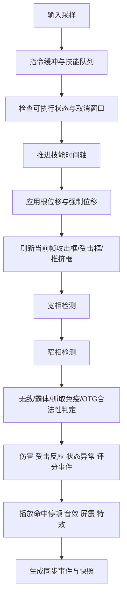
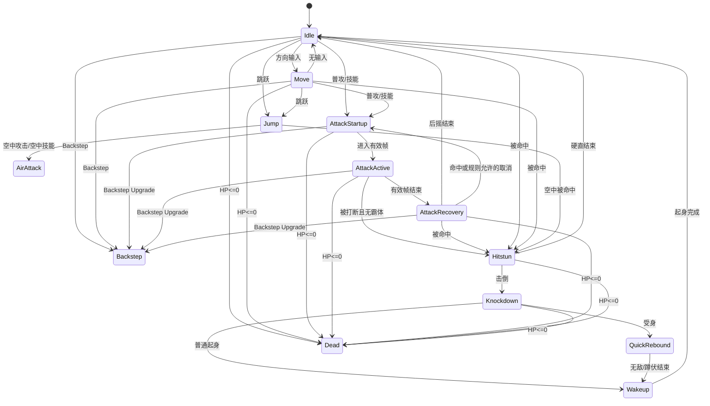
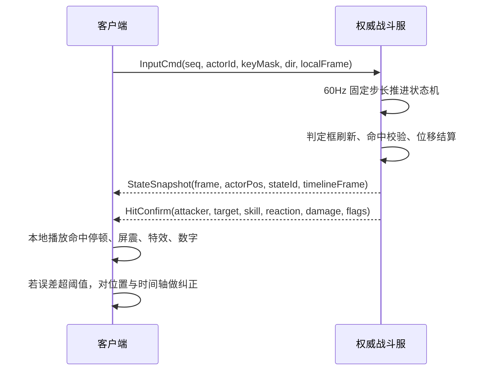

# DNF/DFO 战斗系统复刻实现研究报告

## 执行摘要

公开资料已经足够证明：这套战斗系统不是“几段动画 + 几个碰撞盒”的简单拼接，而是**脚本层、动画帧层、判定层、状态层、位移层、评分层、网络同步层**共同驱动的数据化系统。官方开发者文档与公开技能页表明，技能数据至少包含冷却、施放时间、成长表、范围信息、特殊功能等描述；公开解析代码进一步显示，动画帧里还带有 `attackBox` / `damageBox`、`delay`、`x/y` 偏移、循环、插值、翻转、音效、伤害类型等字段。citeturn7search10turn26search8turn41search2turn18view0turn15view0

如果目标是“手感上尽量贴近原作”，最关键的工程决策不是先写 AI，而是先确定三个基线：**固定步长模拟、三轴坐标系、以帧为中心的状态驱动**。公开英文维基对 DFO 的 PvP 机制明确写出了 X/Y/Z 三轴；公开技能页又多次直接使用 `px` 作为移动距离、攻击范围、扩散半径等单位，因此最稳妥的实现方案是：**逻辑层统一按 60Hz 运行，世界单位统一到像素系，判定采用“XY 矩形重叠 + Z 高度区间重叠”**。citeturn43view0turn41search3turn38search8turn27search0

伤害公式方面，公开资料存在明显的**时代差异**。老版本中文合作站资料仍然保留了经典的 `0.004 × 力量/智力`、`暴击 1.5x`、`破招 1.25x`、`属强/属抗 ÷ 220` 这一套；现代英文维基则把百分比技能、固伤技能、独立攻击、元素倍率拆得更细，同时出现了 `1 + (属强 + 11 - 属抗)/222` 的现代写法。要做到“可执行的开发文档”，不能只给一套公式，必须把**怀旧版 Profile**与**现代版 Profile**并行建模。citeturn28search6turn28search2turn27search1turn26search4turn27reddit44

公开补丁说明还暴露出大量运行时边界条件：有的技能“攻击判定先于特效输出”；有的技能在高攻速和组队时会“偶发不命中”；有的技能会出现“施法者与受击者位置不一致”；有的技能在目标无敌时曾经带有“停止并等待无敌结束后再攻击”的补正逻辑。对开发来说，这些比任何“伤害面板公式”都更重要，因为它们直接说明：**真正需要服务器权威裁定的，是命中、位移、多段计数、取消合法性与状态切换，而不是单纯的视觉播放**。citeturn24view0turn34search1turn37search0turn37search4turn37search5

## 资料基线与可信度

官方层面最有价值的，是 entity["company","Neople","game studio"] / entity["company","Nexon","game publisher"] 的开发者 API、补丁公告与技能页中公开可见的 API 链接；第二层是英文维基、韩文攻略媒体、老版本合作站；第三层才是公开托管在 entity["company","GitHub","software hosting"] 的解析项目、论坛流出的 `.skl` / PVF 片段和私有研究社区。本文只使用**公开可访问资料**与**高层级逆向线索**，不提供绕过校验、注入、封包或分发受版权保护资源的方法。citeturn7search10turn26search8turn41search2turn18view0turn50search3

| 可信度 | 来源类型 | 本文用途 | 风险 |
|---|---|---|---|
| A | 官方开发者 API、官方补丁/活动说明 | 技能字段、数值改动、状态机制、边界条件 | 最低 |
| B | DFO World Wiki、韩文攻略媒体 | 技能公开参数、范围信息、状态说明、怪物行为 | 中等，需交叉验证 |
| C | 公开解析项目、论坛片段、老版合作站公式贴 | 动画帧结构、脚本字段命名、怀旧版公式线索 | 最高，必须标注假设 |

围绕“能否 1:1 复刻”这件事，当前公开资料里最不确定的有四项。第一，**逻辑帧率**并没有在公开资料里找到官方硬编码说明，因此本文把 60Hz 作为首选假设，而 30FPS 仅作为渲染层或移动端兼容方案。第二，动画解析代码虽然能看到每帧都有 6 整数的 `attackBox` / `damageBox`，但没有公开字段名，所以“这 6 个数分别是什么”仍要靠可视化校准。第三，元素倍率存在 `220` 与 `222/+11` 两套写法，说明不同年代/服务器/整理者口径并不完全一致。第四，论坛里能看到 `.skl` 和 `[executable states]`，但这类资料只能当作“结构线索”，不能当最终真值。citeturn18view0turn27search1turn26search4turn27reddit44turn50search3

基于这些不确定项，最实际的落地方式不是追求“先验绝对真值”，而是把系统做成**可切换版本配置**：同一套 Runtime，允许切换 `classic_60`、`modern_global`、`pvp_arena` 三类规则集；所有关键争议项都做成参数，而不是写死在代码里。这个设计选择本身就是对原资料状态的回应。citeturn28search6turn27search1turn43view0turn46search0

## 客户端资源结构与运行时模型

### 静态数据层

官方技能页和开发者 API 链接已经说明，技能至少有 `skillId`、阶级成长信息、冷却、施放时间、特殊功能和范围信息；公开博客中的 `.equ` 示例则显示，装备/被动脚本能够以 `[if] -> [attack success] -> [then] -> [add absolute damage] / [passive object]` 这样的结构挂接到战斗链路里。再结合论坛中出现的 `.skl` 片段与 `[executable states]` 字段，可以合理推断：**技能释放条件、命中附加效果、派生对象生成、武器/装备附伤，本来就是数据驱动而不是硬编码分支**。citeturn26search8turn41search2turn23search3turn50search3

下表是建议直接落库的“战斗静态数据层”模型。它不是对客户端原始文件名的逐字转抄，而是为工程实现重整后的等价结构；字段来源分别对齐到官方技能页、公开脚本片段与动画解析代码。citeturn26search8turn23search3turn18view0turn50search3

| 表名 | 关键字段 | 说明 |
|---|---|---|
| `skill_meta` | `skill_id`, `class_id`, `required_level`, `cooldown_ms`, `casting_time_ms`, `cube_cost`, `speed_policy`, `special_flags` | 技能基础表现层 |
| `skill_level_curve` | `skill_id`, `level`, `damage_coeff`, `hit_count`, `range_rate`, `launch_rate`, `status_rate` | 成长曲线 |
| `skill_exec_rule` | `skill_id`, `executable_state_mask`, `air_ok`, `downed_ok`, `cancel_from_mask`, `cancel_to_mask` | 释放合法性与取消关系 |
| `skill_timeline` | `skill_id`, `state_id`, `frame_idx`, `delay_f`, `phase`, `root_dx`, `root_dy`, `root_dz`, `event_mask` | 帧级逻辑 |
| `skill_box` | `skill_id`, `frame_idx`, `box_kind`, `x1`, `y1`, `x2`, `y2`, `z1`, `z2`, `flags` | 判定框 |
| `on_hit_script` | `owner_id`, `trigger`, `condition_expr`, `effect_expr`, `spawn_object_id` | 命中触发脚本 |
| `passive_object` | `object_id`, `timeline_id`, `ai_profile`, `life_time_ms`, `collision_profile` | 飞行物/召唤物/残影等 |

### 动画帧层与贴图层

公开解析代码给出的信息非常关键：动画文件会先读 `framesCount` 与资源列表，然后逐帧读取 `damageBox` / `attackBox`，每个 Box 是 **6 个整数**；随后还会读取 `imgId`、`x`、`y`、`delay`、`loop`、`shadow`、`interpolation`、`coord`、`image_rate`、`rotate`、`rgba`、`damageType`、`sound`、`setFlag`、`flipType`、`loopStart`、`loopEnd`、`clip` 等字段。这意味着复刻时不能只把动画当作“贴图序列”，而必须把它当作**带逻辑轨道的时间轴资源**。citeturn18view0turn15view0

在术语上，结合动作游戏通用命名，`attackBox` 最合理地理解为**攻击判定框**，`damageBox` 最合理地理解为**受击框**；但由于公开源码片段没有字段注释，所以这是工程推断而不是官方命名。本文建议把这 6 个整数先解释为 `{x1, y1, x2, y2, z1, z2}`，也就是“XY 矩形 + Z 高度区间”，然后在工具里做逐帧可视化校准。citeturn18view0turn43view0turn35search2

### 运行时执行顺序

官方补丁里出现过三类很有代表性的修正：其一，“攻击判定在特效输出前就已生效”的问题；其二，“攻击判定动作不再受攻速影响”的修正；其三，“施法者与受击者位置不一致”的修正。把这三类问题放在一起看，可以得到一个非常明确的 Runtime 结论：**视觉层不是战斗真相，真实顺序必须是“状态与位移 -> 判定 -> 结果 -> 反馈”**，而不是反过来。citeturn24view0turn34search1turn37search0

下面这条执行链，适合作为复刻版的主循环基准：



如果目标平台是 PC，最优方案是**逻辑层 60Hz 固定步长，渲染层可插值**；如果是移动端且为了节能想降到 30FPS，也建议保留 60Hz 逻辑，仅让渲染每 2 个逻辑帧采样一次。原因很简单：公开资源本身就是“逐帧 `delay` + 逐帧 Box”的思路，而官方补丁又反复证明“攻击判定”和“视觉攻速”要分开管理。citeturn18view0turn37search0turn39search0

### 命中处理伪代码

下面的伪代码适合作为战斗核心里“技能推进 + 判定 + 结果生成”的骨架。它不是照搬客户端实现，而是把上面的公开证据翻译成可以直接编码的 형태。

```text
function update_actor_skill(actor, dt_fixed):
    if actor.pending_command:
        try_enqueue_or_cast(actor.pending_command)

    state = actor.state
    state.advance(dt_fixed)

    frame = state.timeline.current_frame()

    apply_root_motion(actor, frame.root_dx, frame.root_dy, frame.root_dz)
    apply_forced_motion(actor, dt_fixed)

    atk_boxes  = transform_boxes(frame.attack_boxes, actor.pos, actor.facing)
    hurt_boxes = transform_boxes(frame.damage_boxes, actor.pos, actor.facing)
    push_box   = build_push_box(actor.collision_profile, actor.pos, actor.facing)

    candidates = broadphase_query(atk_boxes.bounds)

    for target in candidates:
        if not overlap(atk_boxes, target.hurt_boxes):
            continue
        if not z_overlap(atk_boxes, target.hurt_boxes):
            continue
        if already_hit_this_contact(actor, target, frame.hit_group):
            continue
        if target.invulnerable:
            continue
        if frame.flags.requires_ground and not target.is_grounded:
            continue
        if frame.flags.otg_only and not target.is_knocked_down:
            continue
        if frame.flags.grab and target.grab_immune:
            continue

        result = resolve_damage_and_reaction(actor, target, frame)
        emit_hit_event(result)
        mark_hit(actor, target, frame.hit_group)
```

## 判定框、帧数据与位移

### 坐标系、单位与判定体划分

公开英文维基对 DFO 的解释非常直接：X 轴是左右、Y 轴是场景纵深、Z 轴是上下高度；而多份技能页又直接把范围、滑行距离、扩散半径写成 `px`。因此，复刻时最稳妥的统一口径是：**世界坐标用像素系；角色脚底落点作为 Pivot；朝向翻转只镜像 X；Y 表示房间纵深；Z 表示离地高度**。citeturn43view0turn41search3turn38search8turn27search0

基于这个坐标系，建议把每个 Actor 的判定拆成四类，而不是混用一个盒子：**Pushbox、Hurtbox、Hitbox、Grabbox**。公开解析代码只明确显示了 `attackBox` 和 `damageBox`，但格斗游戏通用建模与 DFO 的三轴战斗都要求至少再补一个推挤盒，否则“角色互顶”“贴身穿模”“墙边连段”会很难复现。这里的 Pushbox 是工程补完，不是从原始公开片段直接读出来的。citeturn18view0turn35search2turn43view0

建议的表结构如下。Box 坐标建议全部以**角色 Pivot 为局部原点**存储，运行时再转换到世界坐标。citeturn18view0turn43view0

| 字段 | 类型 | 说明 |
|---|---|---|
| `box_kind` | enum | `push / hurt / hit / grab / reflect / guard` |
| `x1,y1,x2,y2` | int16 | XY 平面局部矩形 |
| `z1,z2` | int16 | 高度区间 |
| `hit_group` | int16 | 同一帧多段命中去重组 |
| `flags` | bitmask | `otg`, `air_only`, `ground_only`, `ignore_sa`, `grab`, `projectile` 等 |
| `facing_mirror` | bool | 是否随朝向镜像 |
| `bone_tag` | optional | 若后期引入骨骼/挂点，可对齐到骨骼 |

### 帧表模板与公开可确认样例

公开技能页已经足够说明：很多技能不只是“有没有伤害”，而是自带**移动距离、攻击次数、充能时长、范围、发射数量、位移方向修正、能否跳跃取消、是否基础攻击取消**。例如 `Surprise Attack` 明确写着基础位移 300 px、按下后方向键只走 50 px、总射击数 15；`Palm Blast` 明确写着最大蓄力 0.3 秒、可按后方向键原地释放、满蓄时施法动作附带 Super Armor 并让目标撞墙反弹；`Wrath of God` 标了 600 px 的攻击范围。换句话说，帧表里必须给“位移”和“交互”留字段，不能只存伤害。citeturn41search3turn38search9turn38search8

建议的技能帧表模板如下：

| 字段 | 说明 |
|---|---|
| `skill_id` | 技能 ID |
| `state_id` | `startup / active / recovery / loop / finisher` |
| `frame_idx` | 逻辑帧号 |
| `delay_f` | 本帧持续帧数 |
| `phase_tag` | `startup / active / recovery / invuln / armor / cancelable` |
| `pivot_x,pivot_y` | 当前帧枢轴偏移 |
| `root_dx,root_dy,root_dz` | 根位移增量 |
| `attack_box_ref` | 当前帧攻击框索引 |
| `damage_box_ref` | 当前帧受击框索引 |
| `push_box_ref` | 当前帧推挤框索引 |
| `damage_coeff_ref` | 伤害系数/多段组 |
| `launch_ref` | 击退/浮空/拉扯参数 |
| `cancel_mask` | 允许转入的技能/通用动作 |
| `event_mask` | 音效、屏震、残影、生成物、镜头标记 |

下面这张表不是“完整帧表”，而是把**公开网页里能直接确认的字段**先落到统一模型里，便于程序和 TA 协作。citeturn41search3turn38search9turn44search6turn44search8

| 示例技能 | 公开可确认参数 | 建议映射到 Runtime 的字段 |
|---|---|---|
| Surprise Attack | `Basic Moving Distance = 300 px`、`Down Key Distance = 50 px`、`Shot Count = 15`、`Basic Attack Cancelable` | `root_motion_curve`、`alt_root_motion_curve`、`multi_hit_count`、`cancel_mask` |
| Palm Blast | `Max Charge Time = 0.3 sec`、`Attack Speed +41.4%`、后方向键原地释放、满蓄附加 Super Armor 与墙反弹 | `charge_window_f`、`speed_policy`、`cast_variant`、`armor_window`、`wall_bounce_flag` |
| Meteor Assault | 蓄力增加冲刺距离、速度、浮空强度；回到原位阶段无敌 | `charge_curve`、`launch_curve`、`return_invuln_window` |
| Moving Shot | 技能持续期间边移动边射击，按跳跃取消，默认附带 Super Armor，竞技场中关闭 | `mode_state`、`move_while_fire`、`jump_cancel`、`armor_profile_by_mode` |

### 根位移与技能强制位移

在 DFO 里，位移不是一个统一公式，而是“动作模式”本身。公开技能页反复出现“滑行 300 px”“蓄力后增加突进距离”“回原位阶段无敌”“可按后方向键减少位移”“按下/后改变落点”等描述，这说明复刻时必须把位移拆成两层：**根位移 Root Motion** 与 **受击/吸附/击飞强制位移 Forced Motion**。前者跟着施法者时间轴走，后者跟着受击者反应走。citeturn41search3turn38search9turn44search6turn44search8

更关键的是，官方补丁明确修过“被打飞时的上升力不再受角色 Jump 力影响”和“施法者与受击者位置偶发不一致”。这两条其实给了很明确的技术约束：**技能造成的击退/击飞应当使用技能专属冲量或专属位移曲线，不应直接复用角色跳跃参数；位移结算也必须在服务器或权威逻辑侧统一裁定**。citeturn24view0turn37search0

建议工程上使用以下四类强制位移标签：

| 标签 | 含义 | 典型来源 |
|---|---|---|
| `launch` | 赋予 `vz > 0` 的浮空 | 上勾、踢飞、炮击上挑 |
| `knockback` | 纯 XY 推离 | 突进拳、枪击、冲撞 |
| `pull` | 向施法者/中心点吸附 | 聚怪、旋风、法阵 |
| `snap/return` | 瞬时贴点或返回原位 | 抓取收束、突进后回位 |

对于插值，建议**逻辑层只存每帧的根位移整数或定点数，不对命中判定做插值**；插值只用于渲染位置与特效跟随。这样能最大程度减少“看起来在打，但逻辑已经错过命中帧”的问题。

### 判定重叠的推荐算法

从公开资料看，最合适的窄相判定不是 Capsule，也不是 OBB，而是**轴对齐矩形 + 高度区间**。实现上可以这样做：

```text
function overlap_2p5d(a, b):
    return (
        a.x1 < b.x2 and a.x2 > b.x1 and
        a.y1 < b.y2 and a.y2 > b.y1 and
        a.z1 < b.z2 and a.z2 > b.z1
    )
```

宽相阶段使用房间网格或 Sweep-and-Prune 都可以。因为房间制横版场景的活跃单位数通常远低于开放世界，**按房间分桶 + 局部网格**已经足够接近原作负载形态，不必上过于复杂的通用物理引擎。

## 伤害、属性与受击规则

### 伤害公式的双 Profile 建模

如果目标是怀旧版 DNF 的“味道”，经典中文合作站给出的那套公式依然非常有参考价值：物攻/魔攻跟 `0.004 × 力量/智力` 相关，暴击为 150% 伤害，破招为 125% 伤害，属强与属抗的关系常被写成 `(属强 - 属抗)/220`。与此同时，现代英文维基把百分比技能和固定技能分得更清楚：百分比技能吃基础物攻/魔攻，固伤技能吃独立攻击；力量/智力每 250 点约等价于 100% 伤害增益，而元素倍率又常被写成 `1 + (属性强化 + 11 - 敌方属性抗性)/222`。这两套信息并不矛盾，它们更像是不同时代的同一系统演化结果。citeturn28search6turn28search2turn39search0turn27search1turn26search4turn27reddit44

因此，最可执行的做法不是争论谁“绝对正确”，而是把规则明确分成两个版本：

| 配置档 | 适用目标 | 公式核心 |
|---|---|---|
| `classic_60_70` | 60/70 级怀旧服、老国服/老韩服手感 | `武器攻/技能基础攻 × (1 + 力/智 ÷ 250)`，`暴击=1.5x`，`破招=1.25x`，元素近似 `÷220` |
| `modern_global` | 现行 DFO / 现代平衡体系 | 百分比技能走 `Base Phys/Magic Atk`，固伤走 `Independent Atk`，元素优先用 `1 + (Ele + 11 - Res)/222`，装备增益分类乘区更细 |

如果你希望代码层可维护，建议不要在 `DamageCalculator` 里硬编码一长串 if-else，而是把公式拆成“乘区节点图”：

```text
BaseSkill
-> AttackBase             // 物攻/魔攻/独立
-> StatScale              // 力量/智力
-> MasteryOrClassScale    // 精通/职业被动
-> ElementScale           // 属强/属抗
-> DefenseScale           // 防御/减伤
-> CritScale              // 暴击
-> CounterScale           // 破招
-> BackAtkScale           // 背击/被动背击
-> AdditionalProc         // 白字/附伤/装备脚本
-> FinalDamage
```

### 推荐的公式实现

如果你的目标是“尽可能像老版本”，下面这组公式最适合直接上代码。它们综合了老版合作站与现代维基的共同部分，并把争议项显式留成参数。citeturn28search6turn28search2turn39search0turn27search1

```text
// 经典怀旧档
stat_scale_physical = 1 + STR / 250
stat_scale_magical  = 1 + INT / 250
crit_scale          = is_crit ? 1.5 : 1.0
counter_scale       = is_counter ? 1.25 : 1.0
element_scale_220   = max(0, 1 + (elem_atk - elem_resist) / 220.0)

// 百分比物理
damage =
    weapon_phys_atk
  * mastery_scale
  * stat_scale_physical
  * skill_percent
  * element_scale_220
  * defense_scale
  * crit_scale
  * counter_scale

// 经典固伤物理
damage =
    skill_base_fixed
  * stat_scale_physical
  * buff_scale
  * element_scale_220
  * defense_scale
  * crit_scale
  * counter_scale
```

```text
// 现代档
stat_scale_physical = 1 + STR / 250
stat_scale_magical  = 1 + INT / 250
element_scale_222   = max(0, 1 + (elem_atk + 11 - elem_resist) / 222.0)

if skill.damage_mode == percent_physical:
    atk_base = base_physical_atk
    stat_scale = stat_scale_physical
elif skill.damage_mode == percent_magical:
    atk_base = base_magical_atk
    stat_scale = stat_scale_magical
elif skill.damage_mode == fixed_physical:
    atk_base = independent_atk
    stat_scale = stat_scale_physical
else:
    atk_base = independent_atk
    stat_scale = stat_scale_magical

damage =
    skill_coeff
  * atk_base
  * stat_scale
  * atk_enhancement_scale
  * element_scale_222
  * defense_scale
  * crit_scale
  * counter_scale
  * final_bonus_scale
```

### 属性、暴击、破招、背击与装备脚本

“属性加成”不应只被理解成最终乘一个元素倍率。老版和现代资料都表明，技能、武器、被动、装备脚本都可能在命中流程前后插入额外效果：有的只是给攻击附加属性，有的是“攻击成功时追加绝对伤害”，有的是“命中时生成被动对象”。如果你想做成真正可扩展的系统，装备/被动不该直接改写技能公式，而应该作为**命中事件监听器**挂在战斗总线上。citeturn23search3turn39search0

背击和破招同样要拆开对待。评分系统里，`Counter` 与 `Back Attack` 都是单独计分项；而角色被动里也确实存在“背击时额外暴击率”的技能。因此，工程上至少应该区分四个布尔/枚举位：`is_crit`、`is_counter`、`is_back_attack`、`is_overkill`。其中 `is_overkill` 对连击评分有意义，对伤害本身是否参与加成则由规则集决定。citeturn41search1turn41search6

### 霸体、无敌、抓取与受击反应

公开资料对 Super Armor 的描述非常清楚：它会**抵消 hitstun 与 knockdown**，但不会让你“不死”；部分抓取技能和部分怪物控制仍能对带霸体的目标生效。公开技能页甚至直接写出“可以抓取处于 Super Armor 和 Guard 状态下的敌人，但不是所有敌人都能抓”。这对复刻非常重要，因为它说明“霸体”不是一个简单的 `canBeHit = false`。citeturn39search3turn44search2

同样，Quick Rebound 的公开参数非常适合直接落地：它只能在倒地时施放，Lv1 在地下城里给 3.0 秒无敌和 0.30 秒 Super Armor，按住跳跃可以延长蹲伏期；普通起身恢复则只有很短的无敌窗口。也就是说，“倒地 -> 起身”至少要拆成 `knocked_down`、`wake_up_iframe`、`quick_rebound_crouch`、`quick_rebound_release_sa` 四个子态，而不能用一个统一的 `down` 状态糊过去。citeturn45search0turn43view0

下表给出一个适合直接实现的“受击反应分类”。其中部分数值关系是工程建议，但状态分类与行为边界都能在公开资料中找到对应现象。citeturn44search4turn44search2turn45search0turn43view0turn39search3turn42search0turn42search1

| 反应类型 | 典型触发 | 位移 | 可否被霸体忽略 | 可否 OTG | 备注 |
|---|---|---|---|---|---|
| 轻僵直 `light_flinch` | 普通近战/小型打击 | 无或极小 | 多数可忽略 | 否 | 主要受 `immobility` / `hit recovery` 影响 |
| 重僵直 `heavy_flinch` | 低踢、重拳、炮击首段 | 小幅击退 | 多数可忽略 | 部分可 | 可作为连招承接点 |
| 浮空 `launch` | 上挑、踢飞、部分蓄力技 | Z 正向 | 霸体多忽略 | 否 | 竞技场存在重力与上限保护 |
| 倒地 `knockdown` | 击倒技、墙反弹终段 | XY + Z 回落 | 霸体多忽略 | 是 | 倒地后进入起身/受身分支 |
| 抓取 `grab` | 抓取类技能 | 强制 Snap | 通常不忽略，取决于抓取免疫 | 否 | 对不可抓取目标必须显式失败 |
| 压制 `hold` | 法阵、束缚、旋风、长控 | 可有可无 | 不完全等同霸体 | 视技能 | 常见于聚怪/控制技能 |
| 无效 `ignore` | 目标无敌、Untargetable、虚化 | 无 | 不适用 | 不适用 | 不产生命中事件或只触发接触事件 |

### 命中判定顺序的推荐规则

综合官方补丁与公开状态定义，建议把受击优先级固定为：

1. **Untargetable/无敌**
2. **抓取免疫 / 不可抓取 / 建筑体**
3. **OTG 合法性**
4. **霸体/护盾/特殊减伤**
5. **命中有效后再计算僵直、击退、浮空、倒地**
6. **最后再结算装备脚本、评分事件、镜头反馈**

这样做的理由有两个。第一，官方已经出现过“目标无敌时攻击会暂停并等无敌结束后再补打”的历史逻辑修正，这说明“命中是否成立”必须先于“多段是否继续”。第二，官方也修过“攻击判定先于特效输出”的问题，所以 VFX/SFX 必须依赖最终命中结果，而不是驱动命中。citeturn24view0turn34search1

## 玩家状态机与怪物 AI

### 玩家状态机的最小可复刻形态

公开通用技能资料已经足够把玩家状态机搭起来：Backstep 是即时、可从基础攻击中取消的通用闪避；Backstep Upgrade 允许在技能中、受击后、甚至倒地后使用 Backstep，并有独立冷却；Leap 临时增加 20% 跳跃高度；Basic Training 改写普通/冲刺/跳跃攻击；Quick Rebound 则在倒地后提供受身与无敌；此外，不同职业/变身/姿态类技能还能直接改写 Basic/Dash/Jump attacks。说明玩家状态机必须既有**通用骨架**，又要支持**职业覆盖层**。citeturn47view0turn46search0turn47view1turn46search6turn45search0turn44search5turn38search3

下面这张状态图，是复刻时最推荐的“主状态机”；Buff、武器切换、变身等则建议做 Overlay，而不是做到同一个平面状态里。



建议在代码层再附一份优先级表，避免状态互卡：

| 优先级从高到低 | 状态类 |
|---|---|
| 最高 | `dead / cutscene / grab_captured` |
| 很高 | `invulnerable_rebound / wakeup` |
| 高 | `knockdown / launch` |
| 中高 | `hitstun / hold` |
| 中 | `skill_forced_motion / noncancelable_active` |
| 中低 | `cancelable_active / recovery` |
| 较低 | `backstep / jump / air_idle` |
| 最低 | `move / idle` |

这里有一个很值得直接照抄的细节：Fighter 的 `Crouch` 明确写到“蹲伏时 hit box 与倒地相同”，因此蹲伏并不是单纯的动画姿态，而是**碰撞体级别的切换**。如果要还原 DNF 式“扫上段、钻下段”的味道，这个细节不能丢。citeturn44search0

### 取消、攻速与速度策略

状态机里不要只有 `can_cancel = true/false` 一个布尔值。公开资料已经反复说明，至少要区分四类速度/取消策略：
一类是**完全不受攻速影响**的判定动作；
一类是**受 Attack Speed 影响**的普通/部分技能攻击；
一类是**受 Casting Speed 影响**的施法流程；
还有一类是**技能内部点按加速**，比如连续按键提升多段速度或命中次数。citeturn34search1turn39search0turn38search6turn38search5

因此建议在 `skill_meta` 里加入：

| 字段 | 可选值 |
|---|---|
| `speed_policy` | `fixed`, `attack_speed`, `cast_speed`, `internal_tap_rate`, `hybrid` |
| `cancel_policy` | `none`, `basic_only`, `skill_only`, `jump_cancel`, `backstep_upgrade`, `class_specific` |
| `armor_policy` | `none`, `startup_only`, `active_only`, `full_skill`, `arena_off` |

### 怪物 AI 的推荐建模

公开怪物资料告诉我们一件事：DNF 的怪物，尤其是精英和 Boss，很多时候不是“仇恨驱动优先”，而是**脚本驱动优先**。比如 GT-9600 明确写着“不可抓取、不可浮空、不可击倒”，并且会进入 Super Armor 冲刺和扫射；Tau Beast 的核心就是前方蓄力砸击；Giant Nugol 会召小虫、吞虫回血、旋转追踪并反射飞行道具；韩文攻略又反复出现“击破部位后进入可输出窗口”“血量到三分之一新增模式”“很多房间更依赖机制而非无限 hold”。这些都说明：复刻 AI 时，**普通怪可用轻量行为树，Boss 必须用数据化状态脚本**。citeturn40search7turn49search7turn49search8turn31search0turn31search4

建议怪物 AI 统一成下表：

| 状态 | 进入条件 | 更新逻辑 | 退出条件 |
|---|---|---|---|
| `idle` | 刷新/失去目标 | 播放待机/巡视 | 发现目标 |
| `acquire_target` | 发现目标 | 选择追击对象 | 对象确定 |
| `approach` | 距离过远 | 向目标靠近、修正轴线 | 进入技能距离 |
| `telegraph` | 准备出招 | 播放前摇/警告特效/锁定方向 | 前摇完成或被打断 |
| `attack` | 前摇结束 | 执行时间轴、生成判定/飞行物 | 收招或切相 |
| `recovery` | 攻击结束 | 后摇、短暂空窗 | 后摇结束 |
| `armor_attack` | 重攻击/机制技 | 带 SA 或特殊减伤执行攻击 | 动作结束 |
| `vulnerable` | 部位破坏/机制成功 | 防御下降、暴露输出窗 | 定时结束或血线转段 |
| `phase_transition` | HP 门槛或脚本事件 | 无敌/播片/召唤/清场 | 新阶段开始 |
| `summon` | 脚本触发 | 召小怪/机关/护盾 | 召唤完成 |
| `enrage` | 低血量/超时 | 提升频率/追加技能 | 死亡或战斗结束 |
| `dead` | HP<=0 | 死亡动画/掉落/清事件 | 结束 |

至于“仇恨”本身，公开资料不足以支持写出“原版精确公式”，但足以支持一个很稳妥的近似：**普通怪以最近目标为主，命中它的人次与伤害做二级修正；Boss 则让脚本自己决定这次攻击选最近、最远、当前仇恨最高、最后攻击者，还是随机有效目标**。也就是说，Boss 的目标选择不要只依赖 Threat Table，而应该支持 `target_mode` 切换。这个设计既符合公开怪物行为，也更贴合 DNF 的“机制 Boss”气质。citeturn31search0turn40search7turn49search8

### 连段保护与 PvP 机制的可借鉴部分

虽然公开的 PvP 资料不等于 PvE 真相，但它提供了最完整的“受击保护”描述：站立、空中、倒地三种连段各自有保护阈值；超过阈值后会提高额外闪避、受击恢复并加速落地；长期被压制而未脱离战斗，还会在大约 3 秒无伤后重置这些额外加成。对于复刻“原作味道”来说，这一套特别适合拿来做**精英/名望怪/Boss 的受击保护层**。citeturn43view0

推荐做法是：普通小怪仅做轻度保护，允许爽感连段；精英怪与 Boss 开启“PVP-lite”版保护计量表，包括 `combo_damage_cap`、`bonus_hit_recovery`、`gravity_scale`、`wake_up_iframe_bonus` 四项。这样既不会把刷图做成对战游戏，又能防止被无限控到死。

## 连击评分、反馈与网络同步

### 连击计数与评分系统

公开英文维基把 Rank 系统说得非常清楚：总分公式是 `Style(70) + Technique(70) - Hits`；Style 里包含 `Hit Combo`、`Aerial`、`Double/Triple/Quadruple Attack`；Technique 里包含 `Counter`、`Back Attack` 和 `Overkill`；而且“少于 5 Hit 的连击不计点数”。中文阿拉德百科的整理也与此基本一致，并补充了“额外伤害=终结一击超过目标总血量 30%”这类解释。citeturn41search1turn32search0

这意味着评分系统最好不要依附在 UI 上临时算，而应该作为真正的**战斗子系统**长期记录事件。推荐的最小事件集是：

| 事件 | 记录字段 |
|---|---|
| `hit_success` | attacker, target, skill, frame, is_air, is_back, is_counter |
| `combo_continue` | combo_id, new_count, target_group |
| `overkill` | target_id, hp_before, damage_final |
| `party_multi_hit` | same_target, simultaneous_count |
| `player_hit_taken` | victim, source, room_id |

至于“断连条件”，公开资料没有给出 PvE 的精确秒数，但维基明说“连击在时限内继续攻击即可延续”，而 PvP 的 bonus evasion/hit recovery 则在约 3 秒无伤后回到 neutral。工程上最稳妥的实现，是把 **连击续接窗口做成可调参数**：默认 `120~180` 帧，也就是 `2~3 秒 @ 60Hz`。如果目标更偏老版刷图，可取 150 帧；如果更偏竞技场节奏，可取 120 帧。citeturn41search1turn43view0

### 镜头震动、命中停顿与屏幕反馈

公开资料没有找到 DNF 官方直接给出的“屏震振幅 / 持续 / 衰减”数值，所以这里必须明确区分：**下面不是官方真值，而是适用于 DNF 风格复刻的建议值**。之所以建议这样做，是因为公开动作游戏工具文档普遍把屏震拆成“范围、时长、位移量、方向、衰减”几类参数，而 DNF 本身又是非常重视打击反馈的横版动作游戏。citeturn40search2turn40search6

建议把“命中停顿”和“屏震”统一挂到 `feedback_profile`：

| 反馈级别 | 命中停顿 | 屏震幅度 | 持续时间 | 衰减 |
|---|---:|---:|---:|---|
| `light` | 2~3f | 0~1 px | 40~60 ms | 线性快衰减 |
| `medium` | 4~5f | 2~4 px | 80~120 ms | 指数衰减 |
| `heavy` | 6~7f | 6~12 px | 120~180 ms | 指数衰减 |
| `finisher` | 8~12f | 12~20 px | 180~300 ms | 指数 + 轻微余震 |

这里再补一个非常贴近 DNF 的细节：PvP 资料指出，**高速多段打在霸体目标上会让对方“变慢”，等价于延长其霸体驻留时间**。所以命中停顿不能无脑叠加在所有目标身上；对霸体目标，建议把 Hitstop 大部分给到**攻击方与镜头**，而不是给到**受击方位移冻结**，否则手感会偏离原作。citeturn43view0

### 网络结构与公开逆向线索

官方补丁里连续出现过“组队时高攻速技能偶发不命中”“组队时多段 Hit 数重复”“施法者与受击者位置不一致”“客户端版本不一致时组队体验异常”等问题。这些问题放在一起看，结论很明确：DNF 这类战斗系统在多人环境下最容易出错的，不是贴图，而是**命中计数、位置收敛、取消窗口与状态同步**。因此复刻版若有联网需求，必须把这些逻辑放到权威侧。citeturn37search0turn37search4turn24view0turn37search5

推荐的同步模型如下：



如果要兼顾“原作手感”与“联网稳定”，推荐这样分工：

| 逻辑 | 权威侧 | 本地预测 |
|---|---|---|
| 输入缓冲 | 否 | 是 |
| 普通位移 | 是 | 是 |
| 根位移播放 | 是 | 是 |
| 是否命中 | 是 | 仅做临时特效预测 |
| 受击反应 | 是 | 是，但可被回滚 |
| 多段计数 | 是 | 否 |
| 取消合法性 | 是 | 是，靠服务器纠正 |
| 掉血/状态异常 | 是 | 仅预估显示 |

高层级逆向线索也已经足够指向一条安全而有效的工具链：优先使用**官方 API + 公开动画解析代码 + 逐帧可视化工具**来重建数据，不要把“上线联机问题”寄希望于客户端自判。citeturn26search8turn18view0turn37search0turn24view0

## 开发落地建议

### 先做工具，再做手感

如果团队资源有限，最先做的不是战斗数值，而是一个**逐帧判定可视化工具**。因为当前公开资料里最缺的不是“技能叫什么”，而是“哪一帧开始有效、判定盒到底有多大、受击盒什么时候缩小、根位移哪一帧推进”。公开解析代码已经给了你足够多的字段，技能页也给了距离、时长和特殊功能；真正差的只是把它们叠可视化。citeturn18view0turn41search3turn38search9

建议调试器至少支持以下开关：

| 调试项 | 必要性 |
|---|---|
| 当前逻辑帧编号 | 必须 |
| 当前状态 / 子状态 / 取消窗口 | 必须 |
| 攻击框 / 受击框 / 推挤框 / 抓取框 | 必须 |
| 根位移轨迹与瞬时速度 | 必须 |
| 目标受击反应标签 | 必须 |
| `is_counter / is_back_attack / is_crit / is_otg` | 必须 |
| Combo 保护条 / 额外 hit recovery | 强烈建议 |
| 屏震 / Hitstop profile | 强烈建议 |

### 版本配置要从第一天就存在

这套系统的公开资料天然横跨多个年代：老版合作站公式、现代全球服技能页、现代韩服公告、低可信度的 `.skl` 片段、偏竞技场的保护机制文档，全都不在同一个时代。最容易失败的做法，是先硬写一套逻辑，再在后面不断打补丁。正确做法是：**项目第一天就引入 Ruleset 概念**。citeturn28search6turn27search1turn43view0turn50search3

推荐的版本 Profile 如下：

| 项目 | 怀旧档 | 现代档 |
|---|---|---|
| 元素倍率 | `1 + (ele - res)/220` | `1 + (ele + 11 - res)/222` |
| 力智倍率 | `1 + stat/250` | `1 + stat/250` |
| 暴击 | 固定 1.5x | 固定 1.5x 或规则扩展 |
| 破招 | 固定 1.25x | 规则化开关 |
| Backstep Upgrade | 关闭或按旧版规则 | 开启独立冷却 |
| Combo Protection | 轻量 | 精英/Boss 启用增强版 |
| 攻速作用 | 普攻/部分技能 | 精确到 `speed_policy` |
| 装备脚本 | 简化 | 完整事件脚本 |

### 可直接开工的最小里程碑

为了让这份报告真正能指导开发，下面给出建议的最小可交付顺序：

| 里程碑 | 目标 | 产物 |
|---|---|---|
| 资源观察期 | 打通数据读取与可视化 | `skill_meta` 导入器、动画/Box 叠图工具 |
| 核心战斗期 | 完成 60Hz 状态机与命中链 | 玩家状态机、Box 检测、DamageCalculator |
| 手感校准期 | 做 3 个基准职业与 5 个基准怪 | 普攻链、上挑、低踢、突进、抓取、受身 |
| AI 脚本期 | 完成普通怪 / 精英 / Boss 三套模板 | 数据化状态脚本、部位破坏、阶段切换 |
| 联机收敛期 | 完成权威同步与纠偏 | 输入缓冲、HitConfirm、位置纠偏 |
| 验证期 | 建立黄金样本回归 | 帧表快照、命中事件日志、录像回放 |

最值得先做的“黄金样本”不是觉醒技，而是这五类动作：**普攻三段、上挑类浮空、低踢类 OTG、突进位移技、抓取技**。原因是它们几乎覆盖了整个 DNF/DFO 战斗系统的核心维度：普通连段、空中连段、倒地追击、根位移、抓取穿霸体、反馈节奏。只要这五类先做准，后面技能扩展会快很多。citeturn44search4turn44search2turn41search3turn45search0turn43view0

### 最终建议

如果你的目标是“真正能落地”，我建议把整个项目拆成一句话：**用公开 API 和帧级动画资源重建一个 60Hz、三轴像素系、数据驱动、服务器权威的横版动作战斗 Runtime；所有有争议的数值都做成版本配置，所有帧级真相都通过可视化工具确认，而不是靠记忆和面板猜。** 这是目前在公开资料条件下，最接近“1:1 复刻 DNF/DFO 战斗系统”的工程路径。 citeturn18view0turn26search8turn43view0turn37search0turn28search6turn27search1
