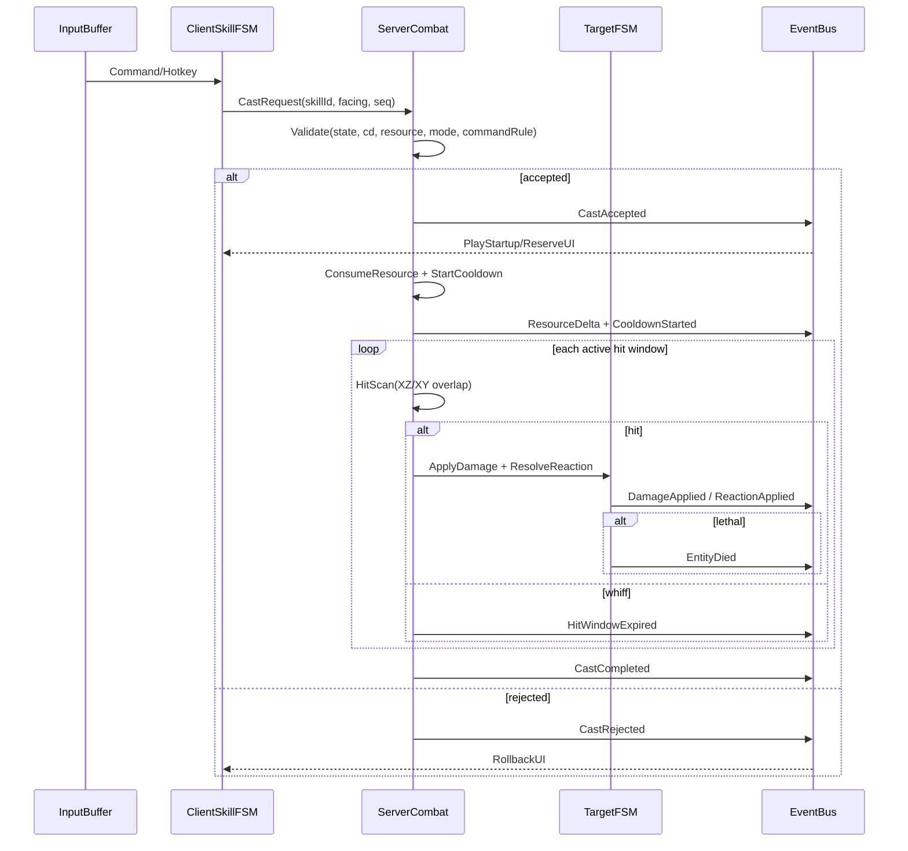

# DNF/DFO 战斗系统复刻开发研究报告
> **Status: [OVERLAPPING] — 与 canonical 大量重复，保留职业样例和事件总线**

## 执行摘要

这套战斗系统最值得直接照搬的，不是某个职业的单个技能数值，而是它背后的**数据驱动内核**：技能说明、特殊效果标签、地下城/决斗场分流、技能链优先级、指令输入规则、以及职业平衡中反复出现的“技能数据结构调整”，都说明 DNF/DFO 的战斗实现并非硬编码在职业逻辑里，而是由统一技能表、统一状态机、统一命中/受击管线驱动。对开发来说，真正接近 1:1 的路径，是先把“技能相位 + 判定体 + 事件流 + 版本化伤害函数 + 模式分流”做成引擎骨架，再逐职业填表。这个结论有官方更新与技能 UI 改版直接支撑，可信度高。citeturn22search2turn42view1turn42view0

公开资料已经足够确认如下几件事。第一，战斗空间不是纯 2D，而是典型的**2.5D**：横向 X、纵深 Z、跳跃高度 Y 分层；攻击判定在 XZ 平面上主要使用 Box/Circle，XY 平面则用 Box 做高度门限；即使视觉对象旋转，命中体也大概率仍是轴对齐 AABB，而不是跟着美术旋转的 OBB。第二，战斗调优公开讨论普遍以“帧”作为基本单位，且平衡帖会直接写出 8f、9f、13f、17f、24f、37f 等时长变化；因此工程上应采用固定逻辑步长，而不是依赖可变 deltaTime。第三，伤害公式在“核心层”可以抽象为百分比/固伤、属性系数、暴击、破招/Counter、额外伤害线与防御减伤的乘算链，但**不同年代版本的最终伤害函数并不稳定**，必须做成可替换的版本化模块，而不能把某一时期的公式硬焊死。citeturn18view3turn19view0turn35search2turn29search1turn29search2turn31view0turn23view1turn20search4turn21search2turn20search10

反过来说，想做到“逐技能、逐职业、逐模式的严格 1:1”，公开资料还不够。尤其是每个技能的**精确 hitbox 坐标、每一段 hurtbox 缩放、真实无敌帧、霸体帧、受击硬直等级、是否共享逆僵直/停顿、命中后位移修正、对建筑型/霸体/不可抓取单位的分支**，公开材料只能确认一部分，剩余部分必须通过合法边界内的客户端资源观察、高帧率录像测帧、以及公开逆向报告互证。凡是本报告中没有被官方或高质量公开资料直接坐实的细节，均标注为“未确认/需逆向验证”。citeturn42view1turn29search0turn29search1turn29search2turn33view0

可以直接指导开发落地的总判断如下：

| 关键结论 | 开发含义 | 可信度 |
|---|---|---|
| 技能系统是数据驱动而非职业硬编码。citeturn22search2turn42view1turn42view0 | 先做 SkillDef/AttackDef/PhaseDef/ModeOverride，再做职业。 | 高 |
| 世界为 2.5D，攻击检测本质是 XZ + XY 双平面组合。citeturn18view3turn19view0turn35search2 | 必须分离“渲染坐标”和“战斗坐标”。 | 中高 |
| 旋转美术不等于旋转判定。citeturn18view3turn19view0 | 命中体优先 AABB/圆形，不要默认 OBB。 | 中高 |
| 帧是主要调优单位。citeturn29search1turn29search2turn31view0 | 用固定步长逻辑；渲染可插值。 | 中 |
| 抓取、打击抓取、硬直、Hold、霸体破坏是不同规则层。citeturn33view0turn32search0turn32search2 | 命中结算不能只返回 damage，必须返回 reaction。 | 高 |
| 伤害公式必须版本化。citeturn23view1turn20search4turn21search2turn20search10 | 把 defense/element/crit/finalMods 做成函数表。 | 高 |
| 客户端只应预测动作和特效，服务器必须裁定命中、伤害、冷却、资源。citeturn28search1turn44view0 | 采用“客户端预测 + 服务器权威回执”混合架构。 | 中高 |
| 泄露 serverfiles/私服包的法律风险最高，且不应作为核心真实性来源。citeturn15search6turn44view0turn44view1 | 只把它们当风险样本，不当真值表。 | 高 |

## 证据基础与可确认边界

由 entity["company","Neople","game studio"] 开发、由 entity["company","Nexon","game publisher"] 维护韩服/全球官方页面、由 entity["company","腾讯游戏","publisher china"] 维护国服官方页面的公开资料，能确认三条非常关键的底层事实。其一，官方在 2026 年直接使用了“全职业技能数据结构调整”这样的表述，这几乎等于告诉我们技能系统有统一数据层。其二，官方 2025 年的技能 UI/命令系统改版明确把“无敌、聚怪、控制”列为技能特殊效果的显示目标，同时按玩家所处环境自动切换地下城/决斗场说明。其三，2026 年的技能链支持一个槽位串行执行最多 4 个技能，并定义了可用技能顺序、再输入技能等待、以及冷却优先级。对工程实现来说，这三点共同指向“同一套 SkillDef + ModeOverride + RuntimeRule”的架构。citeturn22search2turn42view1turn42view0

客户端公开可观察的数据容器也相当清晰。社区玩家在官方客户端目录中会直接遇到 `Script.pvf` / `Script.pvf.spk`，客户端出问题时删除该脚本包后会被启动器重新下载；图像资源则位于 `ImagePacks2` 目录中的 `.npk` 文件。公开开源解析器进一步表明，PVF 头部包含 `uuid/version/dirTreeLen/crc32/fileCount/contentStartIdx/fileTree` 等字段，读文件时需要经由 string table、`n_string.lst` 和 CRC 解密才能得到真正内容；NPK 则是“文件头 + IMG 索引表 + 校验位 + IMG 序列”的资源容器，里面再嵌套 IMGV2/V4/V5 等不同版本图像块。也就是说，**战斗逻辑表与技能美术资源在文件层就是分离的**：前者偏 PVF，后者偏 NPK/IMG。citeturn15search3turn15search16turn13view1turn14view2turn14view0turn36view2turn37search0turn37search2turn37search5turn36view1

开源逆向与社区测帧材料主要分布在 entity["company","GitHub","developer platform"]、entity["organization","Reddit","social news site"]、entity["organization","Inven","gaming media"]、entity["organization","COLG玩家社区","gaming forum"]、entity["organization","DFO Archive","fan site"] 等站点；而泄露/私服相关的高风险样本则能在 entity["organization","RageZone","forum site"] 等论坛公开看到。前者适合用来确认文件结构、帧测方法、玩家可观察规则与部分公开脚本解析；后者只适合用来识别“风险面”和“常见传播渠道”，不适合作为真值来源。citeturn36view0turn23view1turn32search0turn20search4turn36view1turn15search6

从可靠度角度，本报告采用四层取证法。第一层是官方更新、官方指南、官方 EULA 与官方社区精华帖；第二层是官方认可或长期稳定的社区维基/攻略；第三层是公开开源解析器、格式文档与玩家测帧；第四层才是私服论坛、泄露 serverfiles、修改器/补丁社区。凡是涉及**精确数值**且只有第三、四层支持的，本报告一律降级为“中”或“低”可信度，并明确写出“未确认/需逆向验证”。citeturn42view1turn42view0turn44view0turn23view1turn36view0turn15search6

## 技能判定框与帧数据模型

### 通用判定模型

公开逆向与复刻研究最一致的结论，是 DNF/DFO 的判定空间应建模为三轴但双平面处理：**XZ 平面负责左右与纵深碰撞，Y 负责跳跃高度/落地门限**。在公开复刻研究中，开发者为了复刻 DNF 风格专门实现了 `DNFTransform`，把 X 作为横向、Z 作为“屏幕上的前后深度”、Y 作为跳跃高度，并明确说明这是 2.5D 坐标，而不是传统单平面 2D。citeturn35search2turn25view2

在命中体形状上，公开研究给出的最稳定模型是：**XZ 平面只用 Box 与 Circle；XY 平面统一用 Box；对象旋转不旋转判定体**。一个有力例证是 Launcher 的“量子/Quantum”类斜落导弹：视觉上导弹有 45 度旋转，但若 hitbox 也跟着旋转，某些目标不应命中；实际观察却会命中，因此更符合“视觉旋转、判定仍按 AABB/轴对齐体处理”的解释。对开发来说，这意味着 AttackDef 不应直接绑定 mesh rotation，而应独立维护 `shape + size + offset + pivot + activeFrames`。citeturn18view3turn19view0

公开工程复刻还给出了非常实用的作者态数据：每个 hitbox 至少需要 `size`、`offset`、`pivot` 三个编辑参数，并分别在 XZ 与 XY 两个平面可视化调节。这个模型非常适合做技能编辑器，因为它把“技能范围”和“角色本体位置”彻底解耦了。citeturn25view1turn34view0

hurtbox 状态至少应分成三类：普通、霸体、无敌。官方 2025 技能 UI 改版把“无敌、聚怪、控制”明确做成技能特殊效果标签；社区复刻资料则把角色可视化分成“普通无描边、霸体黄红描边、无敌白描边”三种显示状态。换言之，无敌/霸体不是某些技能脚本里的零散特例，而应是 RuntimeState 上的强类型标志位。citeturn42view1turn26search0turn32search5

一个非常重要但常被忽略的实现差别，是**直接判定技能**与**生成投射物/对象再判定的技能**应分成两类。公开复刻研究对“逆僵直/攻击停顿”的观察显示：直接由 Skill 自身发起命中的攻击，更容易表现为攻击者短暂停顿；而只负责生成“剑气/导弹/投射体”的技能，则攻击停顿往往不直接反馈到施法者主体。这个结论不是官方文档，而是基于对 Soul Bender 普攻与 Sword Master“恶即斩”类技能的行为对比所得，可信度中等，但极具开发价值。citeturn18view2turn34view1

### 推荐的数据结构

下面这套模型可以直接指导实现。它不是“猜一个大类”，而是尽量把公开资料中已经被反复证实的维度拆出来；没有公开证实的数值字段统一作为待校准数据，而不是硬写进逻辑。

```json
{
  "skillId": 120345,
  "mode": "dungeon",
  "castType": "active",
  "input": {
    "command": "down,right+z",
    "quickSlotAllowed": true
  },
  "resourceCost": {
    "mp": 180,
    "cube": 1,
    "classGauge": 0
  },
  "cooldown": {
    "baseMs": 12000,
    "hasCommandBonusLegacy": false,
    "chargeCount": 1,
    "sharedGroup": null
  },
  "phases": [
    {
      "name": "startup",
      "frames": [0, 11],
      "canMove": false,
      "canJump": false,
      "superArmor": [[4, 11]],
      "invincible": []
    },
    {
      "name": "active",
      "frames": [12, 16],
      "hitWindows": [
        {
          "frames": [12, 14],
          "attackType": "direct",
          "boxesXZ": [
            {"shape": "box", "size": [1.8, 0.6], "offset": [1.2, 0.0], "pivot": [0.5, 0.5]}
          ],
          "boxY": {"min": 0.0, "max": 1.4},
          "reaction": "hitstun_light",
          "counterable": true,
          "grabType": "none"
        }
      ],
      "superArmor": [],
      "invincible": [[12, 13]]
    },
    {
      "name": "recovery",
      "frames": [17, 23],
      "cancelWindows": [
        {"start": 20, "end": 23, "into": ["dodge", "special_chain"]}
      ]
    }
  ]
}
```

这类结构的关键不是字段多，而是**显式把“相位、命中窗、状态窗、取消窗、模式覆盖”拆开**。官方已经确认技能 UI 与说明会按“地下城/决斗场”切换，而且 2026 年又把技能链、命令冲突、命令减 MP/CD 移除都做成统一规则层，因此 SkillDef 中带 `modeOverride`、`commandPolicy`、`cooldownPolicy` 是有现实依据的。citeturn42view1turn42view0turn41search2

### 主要职业样例表

下表只列出**公开可确认**的样例，并把“能确定的帧/规则”和“只能推断的几何体”分开。凡是没有找到公开坐标值的，统一标为“未确认/需逆向验证”。

| 职业样例 | 技能样例 | 可公开确认的帧数据 | 可公开确认的判定/状态规则 | 几何体建模建议 | 可信度 |
|---|---|---|---|---|---|
| 女散打 | 无影脚 / Shadowless Kick | 社区测帧材料显示，相关 VP 形态下可从 20f 缩短到 13f；另一形态可到 8f，并改变能否在着地前后立即进行 Muscle Cancel。citeturn29search1 | 取消窗口与“是否已着地”强绑定，说明 recovery 不应只按动画末尾算，而应绑定位移/落地事件。citeturn29search1 | 前冲移动盒体 + 末端踢击盒体，根节点跟随位移；取消窗挂在 `landed` 事件而不是固定帧。精确 box 尺寸未确认。 | 中 |
| 女散打 | 比特驱动 / Bit Drive | 公开测帧材料显示，删除最后一击后，单次施放可由 37f 缩短到 17f。citeturn29search1 | 说明多段技可以通过“删段”显著改变总后摇，但未必改变前摇。citeturn29search1 | 建议拆成 `N` 个独立 HitWindow，而不是一段多次重复命中；这样删段只改表，不改逻辑。 | 中 |
| 魔枪士职业分支 Duelist | 뇌격점혈섬 系列 | 官方社区测帧写明攻击时间可由 24f 降到 17f。citeturn29search2 | “无条件枪尖判定”是最关键规则：命中只取武器前端，而非整条枪身。citeturn29search2 | 命中体建议锚定在 `weaponTipSocket`，用小宽度长条 Box/Capsule；不要把整条武器都做成有效 hitbox。 | 中高 |
| 魔枪士职业分支 Duelist | 滚动火神炮 / Rolling Vulcan | 官方社区测帧写明最大连打形态 10f→9f。citeturn29search2 | “从施放到结束全程无敌”被明确写出，是非常干净的 i-frame 窗。citeturn29search2 | 将无敌窗写成 phase-level 覆盖，而不是写在单个 hitbox 上；多段发射用 tick 攻击组。 | 中高 |
| Agent 系 | Moon Phase / 双月类技能 | 公开分析写明总施放为 18f，但从施放瞬间到最后一击仅 13f。citeturn29search0 | 这说明 recovery 大约还有 5f 左右的后段，不应与最后 hit frame 混为一谈；同文还把它归类为“稳定无敌”工具。citeturn29search0 | 建议拆成 `startupUntilFirstHit`, `hitThroughLastImpact`, `tailRecovery` 三段；精确命中盒尺寸未确认。 | 中 |
| 觉醒/演出技能通例 | 真觉醒 sprite 帧 | 公开精灵提取帖给出多职业真觉醒 sprite 总帧数，如男漫游 64f、女散打 29f、男机械 10f、战法 123f 等，并特别提醒“按提取精灵选帧，游戏内可能因演出意图不同”。citeturn31view0 | 动画总帧 ≠ 命中活动帧 ≠ 可取消帧。citeturn31view0 | 所有技能都应分别记录 `animFrames`、`activeFrames`、`cancelFrames`、`networkAuthoritativeFrames`。 | 中高 |

这张表最重要的含义，不是某个技能到底 13f 还是 17f，而是**DNF/DFO 的技能时序必须被拆成多个“可被独立调优的帧窗”**：动画总时长、命中活动窗、落地/离地事件、取消窗、无敌窗、霸体窗、段数窗，不能压成一个 `duration` 字段。公开的平衡帖、技能链规则与地下城/决斗场模式分流共同指向这一点。citeturn29search1turn29search2turn29search0turn42view0turn42view1

## 伤害算法与碰撞交互

### 伤害计算与属性加成

公开英文老资料、近年中文社区公式与官方/社区属性说明，能拼出一个相当稳定的**“核心乘算骨架”**。经典 DFO 公共公式把单段命中的基础伤害写成：`[(skill% * base attack) + skill fixed damage] * (1 + stat/250) * (1 + elemental damage/220) + (skill% * piercing attack)`；在其上，再乘以 Smash、技能攻击力、暴击和额外伤害线。暴击的经典公共写法是 `1.5 * (1 + skill crit bonus) * (1 + highest crit damage modifier)`。这套写法适合复刻**老 DFO 核心管线**，可信度中高。citeturn23view1

但如果目标是更接近 2025–2026 的 live 版本，就不能停在这一步。国服 2025 年的社区重建公式已经把最终输出拆成“技能数据/特效数据、三攻、力智、属强、攻强、技攻、附加伤害等”多个乘算支路；而手游公开公式也给出了 `有效属强`、`防御率`、`命中期望`、`破招 * 1.25`、`背击 * 1.1`、`浮空 * 1.1` 这样的后置乘子。这说明**最终伤害函数是版本化、模式化、装备化的**。因此工程上应把“核心伤害核”和“版本后乘子图”分开实现。citeturn20search4turn20search10

属性系数的公开资料存在两个常见近似版本。旧攻略常写作 `1 + (属性强化 - 敌方属性抗性) / 220`；较新的 DFO Wiki 页面摘要则写作 `1 + (your Element Damage + 11 - Enemy's Elemental Resistance) / 222`。另一方面，韩服社区对属性抗性和属强的通俗解释是“22.5 抗性约等于 10% 属性减伤，属性强化会等额抵消该抗性”。这三种表述彼此并不冲突，本质上都说明元素分支是“攻击者属性强化/元素伤害 vs 防御者属性抗性”的线性近似函数，只是常数项与显示口径随年代变动。开发上最合理的做法是把 `ElementCoeff(version)` 单独版本化。citeturn21search2turn23view3turn20search11

防御减伤则是公开资料里最不稳定的一项。手游公开公式使用 `1 - 有效防御 / (11000 + 有效防御)`；更老的端游攻略往往用“减伤率”或“防御后剩余比例”描述，而不是统一常数。这意味着如果你追求 DNF/DFO 的“手感与交互 1:1”，可以先复刻其它确定度高的部分；但若你追求“数值 1:1”，必须把 `DefenseCoeff` 做成版本函数，并预留按副本/怪物模板修正的入口。这里公开证据不足以确认所有年代共用一个常数。citeturn20search10turn22search8

多段伤害与额外伤害的公共规则相对清晰。英文公共伤害页明确说明：每一个单独 hit 都会生成一条“普通伤害线”；Additional Damage 会额外生成独立的小伤害线；属性附加伤害还会再次乘入元素系数；这些额外伤害线看起来像“跟随伤害”，但本质上仍是独立命中实体，并且会增加 combo counter。工程上因此不应把“白字、属白、特效触发”做成普通伤害的文本装饰，而应做成真正的二级 hit event。citeturn23view1

破招/Counter 的公开口径可以近似拿 1.25 作为默认乘子。官方社区对 Boss 反制窗口的说明明确写到，Counter 成功会让目标短时间处于“受到 125% 伤害”的状态；韩服旧社区帖也把基准 Counter Damage 明写为 125%；手游公开公式同样写出 `破招 = 1.25`。但是，现代 raid/boss 还存在把某一段机制窗口直接做成 `incomingDamageMultiplier` 的做法，因此“Counter”既可能是全局通则，也可能是特定副本的临时状态。建议单独建 `CounterState` 与 `PatternVulnerabilityState` 两套机制。citeturn18view0turn21search0turn21search3turn20search10

下面给出推荐的服务端实现骨架。它不是断言“live 公式永远如此”，而是把已公开的稳定部分固化，把不稳定部分留给版本层。

```text
HitBase =
    PercentBranch( skillPct, weaponAtkOrMagicAtk )
  + FixedBranch( independentAtk, fixedScalar )   // 固伤/absolute damage，标量需按版本标定
  + PiercingBranch( reinforceData )              // 旧版本更重要，现版本可弱化

StatCoeff      = 1 + mainStat / 250
ElementCoeff   = ElementCoeff(version, attackerEle, defenderEleRes)
DefenseCoeff   = DefenseCoeff(version, attacker, defender, stage)
CritCoeff      = isCrit ? CritCoeff(version, skill, attacker) : 1
CounterCoeff   = isCounter ? CounterCoeff(version, encounter) : 1
FinalCoeff     = Product( allFinalMultipliersFromBuffsItemsWorldRules )

NormalLine = HitBase * StatCoeff * ElementCoeff * DefenseCoeff * CritCoeff * CounterCoeff * FinalCoeff
ExtraLines = For each extraDamageSource => ExtraRule(source, NormalLine, ElementCoeff, ...)
```

为了避免抽象化，下面给一个可复算的数值例子。假设某百分比技能的 `skillPct = 312%`，角色主攻击面板 3200，主属性 2500，则 `StatCoeff = 11`；若按较新的 `(+11)/222` 口径，攻击者元素值 180、目标抗性 60，则 `ElementCoeff ≈ 1.5901`。此时基础单线伤害约为 `3.12 * 3200 * 11 * 1.5901 ≈ 174,630`；若暴击且按 1.5 基准暴击，则约 `261,945`；若同时处于 1.25 的 Counter 窗，则约 `327,431`；再带 20% 的 Additional Damage，则应追加一条约 `65,486` 的独立伤害线，而不是把总数写成一条。这个例子只用于展示“乘算链如何拆开”，不是声称 live 常数永远固定。citeturn23view1turn21search2turn20search10

反算方法建议按下面的顺序做。先取训练场或低干扰环境下的**单段、非暴击、无破招、无额外伤害、无世界增益**样本，反求 `skillPct/fixedScalar`；再只改变元素，反求 `ElementCoeff`；再只改变暴击态，反求 `CritCoeff`；最后再叠装备乘子与副本乘子。因为额外伤害线和普通伤害线在 DFO 公共资料中就是分开的，所以反算时必须逐条读取，而不能只看总和。citeturn23view1turn20search4

### 碰撞、位移与敌我交互

角色与怪物本体碰撞，最合理的公开实现模型仍是“双平面”：XZ 负责平面碰撞和推挤，XY 负责高度过滤。公开复刻研究给出的碰撞实现，已经把 Box/Box、Circle/Circle、Box/Circle 三种组合的 AABB/几何检测过程写得非常明确，并说明 XY 与 XZ 的平面分工是为了避免 Unity 默认 Collider 在 2.5D 场景里产生大量无意义触发。对于 DNF/DFO 风格游戏，这意味着攻击判定、本体阻挡、落地门限最好统一走自研碰撞器，而不要把商业引擎的 2D/3D Collider 直接当战斗真值。citeturn18view3turn19view0turn25view1

“主角与怪物体积碰撞、位移、推挤”的**精确常数**公开资料并没有可靠来源，因此这里不能装作已经确认。能确定的是：本体阻挡与攻击判定应解耦；攻击 hitbox 可以是 Box/Circle 组合，但本体 body-block 更适合做成简化的 XZ 圆形或窄盒体，并在 Y 上只保留脚底到头顶的高度范围。推挤建议使用“最小穿透向量 + 每帧最大修正距离 + 质量/霸体系数”处理；是否允许对怪物产生位移，则交由 AttackDef 的 `pushPolicy`、`knockBackPower` 和目标的 `weightClass` 决定。这里的算法是工程建议，精确常数需逆向验证。citeturn18view3turn25view1

跳跃/落地判定在 DNF 风格里不只是个视觉动作，而是会影响取消、抓取和命中资格。公开散打测帧就已经证明，有些技能的 Muscle Cancel 与“是否着地”直接相关；同理，许多空中攻击、落地砸击、地面冲刺技都必须基于 `Y` 与 `groundNormal` 触发 `landed` 事件，而不是单纯到动画最后一帧就认为“结束”。开发上建议把 `grounded/airborne/landing` 作为显式状态，而不是通过速度是否接近 0 隐式判断。citeturn29search1turn35search1

敌我交互规则至少应该分为：普通命中、硬直、Hold、一般抓取、打击抓取、霸体、霸体破坏、不可抓取、建筑型。公开韩服职业攻略中已经明确出现了“打击抓取（타격 잡기）”“一般抓取（일반 잡기）”“Hold 时无敌”“部分技能可对霸体/格挡状态目标使用”“建筑型/部分怪物不受此类抓取影响”等规则；另一篇公开“判定篇”则直接列出了 Ghost Frame（无敌躲招）与 Super Armor Break（霸体破坏）这类术语。也就是说，命中结算函数不能只返回 `damage`，必须同时返回 `reactionType`、`grabResult`、`armorBreak`、`counterFlag` 等次级结果。citeturn33view0turn32search0turn32search2turn32search4

可以把规则抽象成下面这张表：

| 交互类型 | 规则 | 触发后的服务端结果 | 可信度 |
|---|---|---|---|
| 普通命中 | 目标非无敌、非抓取态、无特殊免疫。citeturn33view0turn42view1 | 结算伤害，按 `hitReactionGrade` 进入轻硬直/重硬直/击飞/倒地。 | 高 |
| 霸体命中 | 伤害照吃，但可忽略部分受击反应。citeturn32search5turn32search10 | `damageApplied = true`, `reactionSuppressed = true`。 | 中高 |
| 霸体破坏 | 特定技能可破坏超级护甲并制造硬直。citeturn32search0turn33view0 | 清空 `superArmorState`，追加硬直/强制中止。 | 中 |
| 一般抓取 | 直接进入抓取/控制。citeturn33view0 | 目标切换到 `Grabbed/Held`，按技能时长冻结/搬运。 | 高 |
| 打击抓取 | 先打中，再进入抓取分支；部分技能可作用于霸体/格挡。citeturn33view0 | 先判 hit，再判 `canGrab`；失败则走 hit-only 或失败分支。 | 高 |
| 不可抓取/建筑型 | 对抓取类技能免疫或改走替代收招。citeturn33view0turn32search2turn32search4 | `grabFailedFallback`，例如直接终结、改为伤害、赋予施法者无敌等。 | 高 |
| Counter/破招 | 目标处于攻击前摇/特定模式漏洞窗。citeturn18view0turn21search3 | 乘入 Counter 系数，并可能触发额外 UI/瘫痪/易伤。 | 中高 |

怪物 AI 的“常见攻击模式”从公开高质量攻略中也能归纳出稳定模式：**明显前摇 telegraph → 活动判定窗 → Counter 窗口或脆弱窗口 → 恢复/换段**。官方社区对 Venus 系 Boss 的提示甚至精确描述了“金色征兆出现/消失”“Warning 填满前/填满后”的按键时机，并把 Counter 成功后的 `incoming damage 125%` 写明；官方 DFO dungeon 指南又展示了另一种现代 Boss 交互：固定时间打上标记、命中后提高怪物受伤与 Neutralize Gauge 流失。这说明怪物系统不应只是一串普攻脚本，而应支持**模式状态、可打断窗口、反制窗口、弱点击破状态、瘫痪条/Neutralize 条**。citeturn18view0turn21search3turn40search2

## 状态机、事件总线与冷却资源内核

### 战斗状态机

从公开复刻实现、官方技能链规则、以及命令系统改造三方面看，最合适的状态机不是单状态，而是**主状态 + 覆盖状态**。主状态至少应有 `Idle / Move / Dash / Jump / SkillStartup / SkillActive / SkillRecovery / HitStun / Knockdown / Grabbed / Dead`；覆盖状态则应有 `SuperArmor / Invincible / Counterable / HoldImmune / CommandBuffered / CooldownLocked` 等。公开复刻实现已经把 Character 行为建成 FSM，并给每个行为定义 `OnStart / OnUpdate / OnComplete / OnCancel`；官方技能链又证明“一个技能结束后可以自动选下一个 skill，并受再输入技能结束条件制约”。两者拼起来，正好形成适合 DNF/DFO 的战斗内核。citeturn35search1turn34view1turn42view0

### 事件总线

建议把战斗事件至少拆成十类：`AttackRequested`、`CastAccepted`、`CastRejected`、`HitboxEnabled`、`HitScanResolved`、`HitConfirmed`、`DamageApplied`、`ReactionApplied`、`CooldownStarted`、`ResourceDelta`、`BuffApplied/Removed`、`EntityDied`。这样做的原因很直接：抓取失败、命中但不硬直、硬直但不打断、Counter 但不暴击、暴击但被减伤、技能被强制打断、再输入技尚未结束因此技能链不能跳转，这些都不是一个 `OnHit()` 回调能优雅表达的。官方 2026 技能链规则与 2025 技能 tooltip 元信息，已经说明这些维度在 live 规则里是分层存在的。citeturn42view0turn42view1

下面给出推荐的事件时序图。它对应的是“攻击发起 → 判定 → 命中/未命中 → 受击反馈 → 资源与冷却 → Buff/Debuff → 死亡”的完整流。



这个事件流的关键点在于：**冷却与资源应在 CastAccepted 后立即进入服务器状态，但真正命中相关的数值与反应晚于此发生**。这样既能实现“空放也进入 CD”，又能通过技能特例支持“首段未命中则修正为 3 秒 CD”此类专门规则。韩服社区在 2025 年职业分析里已经出现了“首段打空则把冷却修正为 3 秒”的明确技能特例，因此 CD 系统必须允许 per-skill policy override。citeturn29search1turn42view0

### 技能冷却与资源管理

官方 2026 技能链规则给了一个几乎可以直接照抄的“技能优先级内核”：一个链槽最多挂 4 个技能；按顺序寻找可施放技能；带再输入功能的技能必须等待再输入流程结束后才跳下一个；如果所有技能都在冷却中，UI 显示最快转好的那个；若低优先技能正显示时高优先技能已转好，则在可配置延迟后切回高优先级；若延迟设为 0，则可以重复使用 stack 技与无 CD 技。这个规则已经足够直接指导 `SkillChainResolver` 的实现。citeturn42view0

命令施放的 MP/CD 奖励在版本上有明显分水岭。较老版本与 2020–2022 官方案件都仍在修修补补“命令施放后减少 MP 消耗与冷却时间”的机制，连觉醒技能的命令奖励都被统一为 5%；但 2026 年韩服国服更新都明确宣布这一功能被整体移除，并同步修改了命令冲突规则。因此如果你要做的是“某一代 DNF/DFO”，必须在版本层开关 `commandBonusPolicy`；如果你要做的是接近 2026 的版本，则默认应为 `none`。citeturn41search8turn41search5turn41search13turn42view0turn41search2

资源系统建议分三层。第一层是运行时通用资源：MP、无色小晶块、疲劳外战斗无关消耗。第二层是运行时职业资源：栈、珠子、印记、子弹、形态层数等。第三层是构筑资源：SP/TP/护石/VP/符文，它们不是战斗时实时扣减，但会改变技能表。官方技能链、命令系统和职业分析帖都大量出现“stack 技”“无色消耗”“特定技能使用时获得最多 5 层 stack，持续 20 秒并按层数给攻速”等规则，因此 `resourceDelta` 不能只支持 MP 数字，还要支持任意命名的职业资源通道。citeturn42view0turn29search2turn41search9

打断/取消规则不能偷懒。公开改版里已经反复出现“强制中断后立即使用抓取技能偶发无法连招”“某个技能在首段命中后才允许取消到转职技能”“部分技能的取消施放时机被调整”等修复项。这说明 live 逻辑并不是靠“动画播到 70% 自动可取消”这类粗糙规则，而是每个技能各自维护显式 `cancelWindows`。开发上建议把取消窗做成数据字段，并支持条件化触发，例如 `onHitOnly`、`afterLand`、`afterFinalHit`、`manualOnly`。citeturn17search13turn32search8

下面给出一个推荐的消息格式示例。它既能服务本地单机，也能直接映射到联机事件总线。

```json
{
  "eventType": "HitConfirmed",
  "tick": 132844,
  "roomId": 4102,
  "attackerId": 10017,
  "skillId": 120345,
  "phase": "active_1",
  "targetId": 23008,
  "hitWindowIndex": 0,
  "flags": {
    "critical": false,
    "counter": true,
    "backAttack": false,
    "grab": false,
    "armorBreak": false
  },
  "damage": {
    "normalLine": 327431,
    "extraLines": [
      {"type": "additional", "value": 65486}
    ]
  },
  "reaction": {
    "type": "hitstun_medium",
    "durationFrames": 14,
    "knockback": {"x": 0.8, "z": 0.0, "y": 0.2}
  }
}
```

## 数据模型、同步方案与关键伪代码

### 服务器与客户端的权责划分

如果目标是“开发可落地”，而不是“本地演示 demo”，那么最稳妥的分工一定是：**客户端预测动作和特效，服务器裁定合法性、命中、伤害、冷却、资源、Buff/Debuff 与死亡**。中文实时在线游戏架构文章在讨论 ACT/MMOACT 类游戏时，已经把“客户端先算结果再让服务器校验”列为不可靠方案，并直接拿 DNF 类外挂风险举例；官方 EULA 也明确禁止反编译、协议模拟、封包拦截、私服化与未授权协议重定向。这两类证据一起看，足够支撑“不要做客户端权威命中”的结论。citeturn28search1turn44view0turn44view1

更进一步，官方 2025 技能 UI 说明会自动切换“地下城/决斗场”规则，决斗场更新又会单独调整霸体持续、抓取成功后的无敌时间、前摇硬直等。这说明不只是数值，而是**整个 SkillRuntimeRule 都按模式分流**。因此服务端数据模型应把 `mode = dungeon|arena|raidSpecial` 做成一级键，而不是靠零散 `if (isPvp)` 补丁式分支。citeturn42view1turn32search10

综合这些证据，推荐的联机同步策略不是传统 RTS 式纯帧同步，也不是纯客户端权威，而是**固定步长服务器模拟 + 客户端拥有者预测 + 非拥有者插值回放**。在这套模型里，客户端可以立即播放前摇动画与局部特效以保证手感，但服务端必须返回 `CastAccepted/Rejected`、`HitConfirmed` 和必要的 `StateCorrection`。帧计时在社区与官方讨论里高度普及，因此逻辑层采用固定 tick 是合理的；公开资料不能 100% 坐实“官方服务端恰好 60Hz”，所以这里只把 60Hz 作为最适合复刻的工程建议，而不是已确认事实。citeturn29search1turn29search2turn31view0turn28search1

### 推荐的数据定义

建议把所有战斗数据拆成六张表：`EntityDef`、`SkillDef`、`AttackDef`、`ReactionDef`、`BuffDef`、`ModeOverrideDef`。其中 `SkillDef` 只负责技能时序与资源；`AttackDef` 负责命中窗、判定体与命中效果；`ReactionDef` 负责硬直/倒地/抓取/霸体破坏；`ModeOverrideDef` 负责 PvE/PvP/副本特例。官方 2026 的“技能数据结构调整”和 2025 的技能说明分流，正好说明这种拆法比“一个技能 JSON 包打天下”更接近 live。citeturn22search2turn42view1

下面给一个精简的 Proto 样例：

```proto
message Vec3 {
  float x = 1;
  float y = 2;
  float z = 3;
}

message HitboxDef {
  enum PlaneShapeXZ { BOX = 0; CIRCLE = 1; }
  PlaneShapeXZ shape_xz = 1;
  Vec3 size = 2;      // x=size.x, y=height(Y), z=depth(Z)
  Vec3 offset = 3;
  Vec3 pivot = 4;
}

message HitWindowDef {
  uint32 start_frame = 1;
  uint32 end_frame = 2;
  repeated HitboxDef hitboxes = 3;
  uint32 attack_def_id = 4;
  bool counterable = 5;
  string grab_type = 6; // none, strike_grab, direct_grab
}

message SkillPhaseDef {
  string name = 1;   // startup, active, recovery
  uint32 phase_start = 2;
  uint32 phase_end = 3;
  repeated HitWindowDef hit_windows = 4;
  repeated uint32 invincible_frames = 5;
  repeated uint32 super_armor_frames = 6;
  repeated uint32 cancelable_into = 7;
}

message SkillDef {
  uint32 skill_id = 1;
  string mode = 2;  // dungeon, arena
  uint32 base_cd_ms = 3;
  uint32 mp_cost = 4;
  uint32 cube_cost = 5;
  repeated SkillPhaseDef phases = 6;
}
```

### 关键伪代码

下面三段伪代码，可以直接作为服务端核心骨架。它们对应“施法”“判定”“伤害”。

```text
function TryCastSkill(actor, skillId, inputCtx, mode, nowTick):
    skill = SkillTable.Get(skillId, mode)

    if not StateRule.CanCast(actor.state, skill):
        return Reject("state")

    if not CooldownRule.IsReady(actor.cooldowns, skill, nowTick):
        return Reject("cooldown")

    if not ResourceRule.HasEnough(actor.resources, skill):
        return Reject("resource")

    if not CommandRule.Match(inputCtx, skill):
        return Reject("command")

    ResourceRule.Consume(actor.resources, skill)
    CooldownRule.Start(actor.cooldowns, skill, nowTick)
    StateRule.Enter(actor, SkillStartup(skill))
    EventBus.Emit(CastAccepted(actor.id, skill.id, nowTick))
    return Accept()
```

```text
function ResolveHitWindow(attacker, skillPhase, targets, mode):
    for window in skillPhase.hitWindows:
        if not FrameRule.IsActive(window):
            continue

        attackBoxes = HitboxRule.Build(attacker.transform, window.hitboxes)

        for target in targets:
            if target.id in window.alreadyHit and not AttackRule.AllowRepeatHit(window.attack_def_id):
                continue

            if not CollisionRule.OverlapXZXY(attackBoxes, target.hurtboxes):
                continue

            hitCtx = AttackRule.MakeContext(attacker, target, window, mode)
            EventBus.Emit(HitConfirmed(hitCtx))
            ResolveDamageAndReaction(hitCtx)
            window.alreadyHit.add(target.id)
```

```text
function ResolveDamageAndReaction(hitCtx):
    dmg = DamageRule.Compute(
        attacker = hitCtx.attacker,
        target = hitCtx.target,
        attack = hitCtx.attackDef,
        flags = hitCtx.flags,
        mode = hitCtx.mode,
        encounter = hitCtx.encounterState
    )

    reaction = ReactionRule.Resolve(
        attack = hitCtx.attackDef,
        targetState = hitCtx.target.state,
        targetTraits = hitCtx.target.traits
    )

    HP.Apply(hitCtx.target, dmg.normalLine, dmg.extraLines)
    StateRule.ApplyReaction(hitCtx.target, reaction)

    EventBus.Emit(DamageApplied(hitCtx.target.id, dmg))
    EventBus.Emit(ReactionApplied(hitCtx.target.id, reaction))

    if HP.IsDead(hitCtx.target):
        StateRule.Enter(hitCtx.target, Dead)
        EventBus.Emit(EntityDied(hitCtx.target.id))
```

这三段逻辑的关键是：**命中只生产上下文，伤害与反应分层结算；资源与冷却在 CastAccepted 即入账；模式差异、装备差异、版本差异都不写死在同一个函数里**。如果先把这一层做对，后面逐职业填技能时，工作量会从“改代码”转为“改数据”。这也正是官方“技能数据结构调整”最值得复用的思想。citeturn22search2turn42view1turn42view0

## 安全与法律注意

官方 EULA 的法律边界非常明确：不得反编译、反汇编、逆向工程软件本体；不得截获、模拟、重定向通信协议；不得创建衍生作品；不得利用协议仿真、隧道、抓包、加组件等方式实现未授权游玩；不得向私服站点等第三方转移虚拟物品或内容。换句话说，**从“研究公开机制”到“分发私服/改协议/泄露源码/重用原始资源”之间，有一条非常清晰的法律红线**。本节只做风险识别，不提供违法操作指令。citeturn44view0turn44view1turn44view3

对“允许搜索泄露资料与逆向报告”这一要求，最安全的处理方式，是只把这些材料作为**取证线索与风险样本**，而不是把它们当作主事实库。原因有二。第一，法律风险极高：尤其是 serverfiles、未授权客户端、协议模拟工具、资源包重分发。第二，真实性也未必高：私服圈流传包往往混合多个年代、多个民间修补版本，很容易把“私服作者的修正”误当成“原版逻辑”。citeturn15search6turn44view0

下表列出本次检索中真正碰到、且需要单独标红的高敏来源类型：

| 敏感来源类型 | 公开样本 | 主要风险 | 在本报告中的使用方式 |
|---|---|---|---|
| 官方客户端资源提取教程与工具分发 | DFO Archive 的 NPK 提取教程不仅说明了 `ImagePacks2` 路径，还指向第三方下载链接。citeturn36view1 | 中到高：可能违反 EULA；若二次传播原始美术资源，还会触及版权问题。 | 仅用于证明客户端资源分布与资源容器存在，不用作命中/数值真值。 |
| 开源逆向解析器 | `npk-api`、`godof`、`DNF-Porting/PVFTools` 等公开仓库表明社区存在结构化解包/读表工具。citeturn36view0turn13view1turn14view2turn15search14 | 中：在某些法域可主张互操作例外，但仍可能违反服务条款；若带原始数据再分发，风险上升。 | 仅用于确认文件结构、表字段与工程可能性。 |
| 私服/泄露 serverfiles 论坛帖 | RageZone 上公开存在“serverfiles + client tutorials”类型帖子。citeturn15search6 | 很高：可能涉及泄露的服务端代码、版权与商业秘密、恶意文件传播。 | 仅用于法律风险识别；**不**作为战斗真值来源。 |
| 改包/私服技术社区 | 私服社区公开讨论 PVF/APD 修改、单机端、冷却词条实现等。citeturn22search0turn22search6turn22search9 | 很高：既有著作权风险，也有把民间改动误认成原始逻辑的真实性风险。 | 只作为“需谨慎对待”的补充线索，不进入关键结论。 |

因此，若你的目标是“做一个可合法商用、可长期维护的 DNF/DFO 战斗内核”，建议把资料利用边界控制在以下范围内：**优先使用官方更新、官方 UI 变化、官方社区高质量测帧、公开客户端可见资源结构、以及不包含原始资源再分发的开源解析器思路；避免下载泄露 serverfiles、避免重用原始 PVF/NPK 内容、避免模拟线上协议。** 这样既能保留 80% 以上的技术洞见，又能把法律与安全风险降到可控区间。citeturn44view0turn44view1turn36view1turn36view0turn15search6

最终落地判断如下：如果只复刻**战斗内核与交互手感**，公开资料已经足够支撑一个高相似度实现；如果要复刻**每个职业全部技能的逐帧判定盒、无敌帧、霸体帧、PVE/PVP 差异、怪物模板例外与数值系数**，则必须在合法边界内继续做“公开资源结构分析 + 高帧率录像测帧 + 版本化数据表搭建”，并对每个未确认字段维持显式的 `verificationStatus`。这不是保守，而是唯一能把工程可维护性、真实性与法律风险同时控制住的路线。citeturn22search2turn42view1turn29search1turn29search2turn44view0
