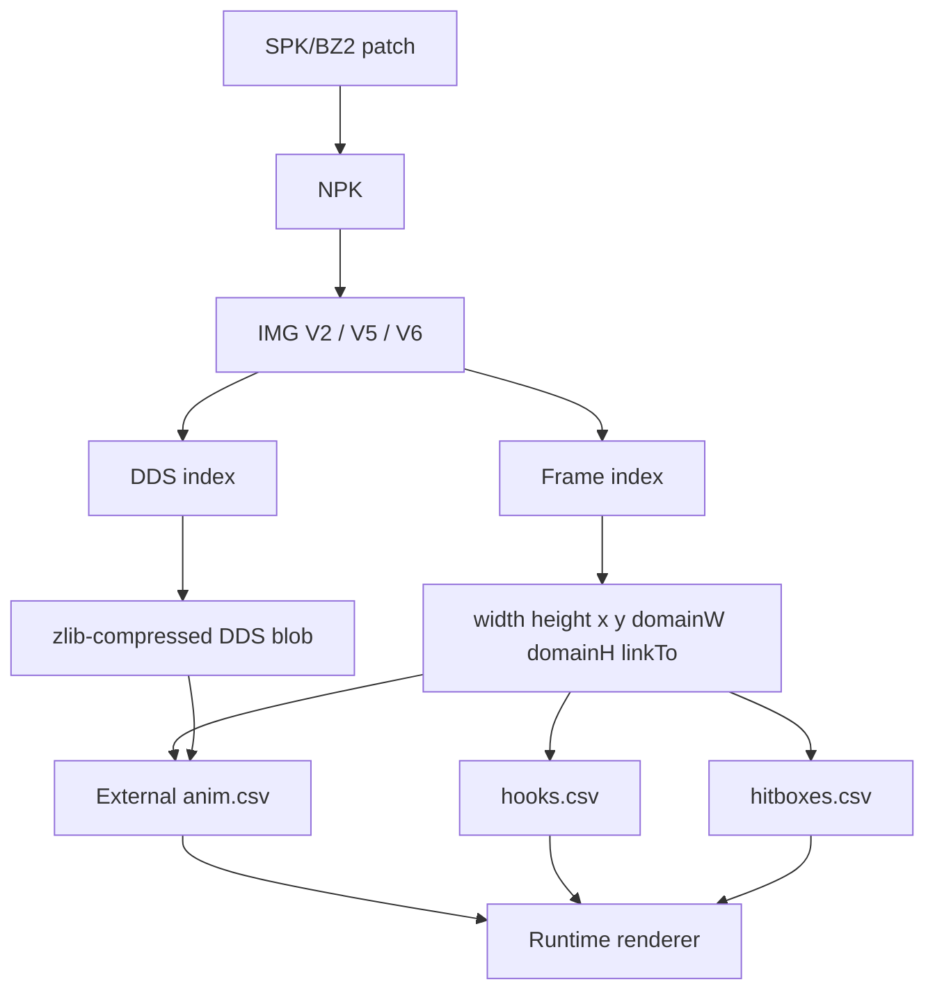
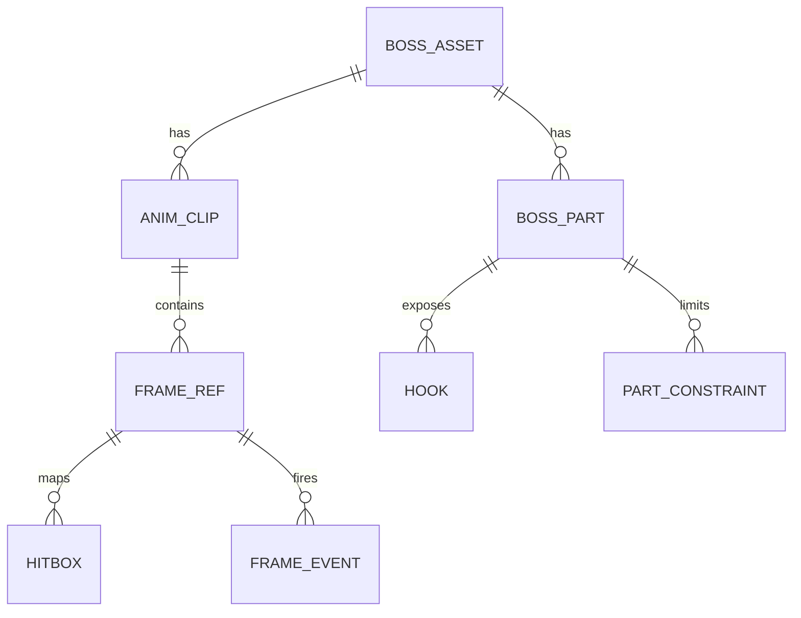

# DNF/DFO 美术系统实现细节深度研究与 1:1 复刻技术规格书

## 执行摘要

官方全球版由开发商 entity["company","Neople","game developer"] 运营；就“可指导开发团队进行 1:1 复刻”的层面而言，真正决定复刻精度的不是画风，而是客户端资源的二进制组织方式：NPK 包头、IMG 版本差异、逐帧整数坐标、指向帧复用、DDS 大图裁切、以及外部动画/事件表如何与这些帧数据耦合。公开可核验资料已经足够把**资源格式、目录规则、分层与导出模型**做成工程规格，但还不足以只靠公开网页把**每个具体怪物/Boss/技能的全部原始时长、判定帧与挂点数值**完全还原出来；这些通常仍需从团队**合法持有**的客户端样本中自动抽取。citeturn17search1turn28view2turn38view0turn37view0turn38view1

能直接确认的关键事实有四类。第一，NPK 是外层包，包头是 `NeoplePack_Bill`，每个 IMG 索引项固定 264 字节，并带有固定 32 字节校验段；对旧分析样本而言，还存在 `ImagePacks2` / `ImagePacks4` 这样的目录分工。第二，IMG 的公共字段并不存“统一帧率”，而是存每帧的宽、高、压缩方式、x/y 绘制坐标、帧域宽/高，以及 `0x11` 指向帧；因此**1:1 复刻不能把资源重切成统一格子**，必须保留逐帧整数元数据。第三，2016 年后大量技能特效转向 IMGV5，IMGV5 不是普通点阵帧，而是“ZLIB 压缩的 DDS 大图 + 普通索引项上的裁切边界 + draw offset”的组合。第四，IMGV6 通过“多调色板/颜色方案”把同形状不同配色的贴图合并，这一机制更接近“时装/换色系统”，不应误用到怪物/Boss/VFX 的主实现路径。citeturn28view2turn38view0turn38view2turn37view0turn38view1

基于这些事实，本报告给出的核心结论是：**怪物、Boss、技能特效三类模块应统一为“包级定位 → IMG 级解析 → 帧级元数据 → 外部动画表 → 运行时合成”的管线**。如果团队一定要使用骨骼或节点系统，也只能把它作为内部制作便利层；面向最终运行时和热更，仍应导出为帧表、挂点表、碰撞/受击表和事件表，否则无法做到与原客户端同级别的像素与时序一致性。citeturn38view2turn37view0turn39view0turn8view3turn5view5

## 证据基础与法律风险

本次资料同时覆盖中文、英文、韩文，并按“二进制字段级证据”“包名/目录级证据”“工程推断级建议”三层组织。中文资料主要给出了 NPK/IMG 的字段布局、版本差异和大量 `ImagePacks2` 对照表；英文资料主要提供官方 EULA、DDS/zlib/Unity/Unreal 文档与公开工具说明；韩文资料补足了“导出后如何保留 Pivot/True Coordinates”的实操细节。citeturn28view2turn38view0turn37view0turn38view1turn17search3turn18search0turn21search2turn32view2turn32view3turn20search0turn20search3turn39view0

| 语言 | 主要来源 | 本报告可证明的内容 | 证据等级 |
| --- | --- | --- | --- |
| 中文 | CSDN《NPK 文件的那些事儿》系列、GitHub 镜像、ImagePacks2 对照表、论坛代码表 citeturn28view2turn38view0turn37view0turn38view1turn14view0turn15view2turn15view3turn15view4 | NPK/IMG 字段、版本差异、怪物/Boss/技能包名、拆包后目录定位 | A |
| 英文 | Steam EULA、GitHub 工具 README、entity["company","Microsoft","software company"] DDS/zlib 文档、entity["company","Unity Technologies","game engine vendor"] 与 entity["company","Epic Games","game engine vendor"] 文档、DFO World Wiki 条目检索 citeturn17search3turn8view1turn8view2turn8view3turn18search0turn18search6turn21search2turn32view2turn32view3turn20search0turn20search3turn23search0turn23search1turn22search1 | 合同风险、现代引擎映射、纹理压缩语义、公开实例链接 | A/B |
| 韩文 | Tistory 复刻开发日志、Unity 韩文 API 页面 citeturn39view0turn18search8 | Pivot/True Coordinates 导出、引擎参数术语对齐 | B/A |

**法律与伦理风险需要单独标红。** Steam 上的 DFO EULA 至少明确要求用户避免使用会修改软件或游戏体验的 hacks、cracks、bots 与第三方软件；因此，客户端解包、改包、导入私有/泄露资源、分发导出贴图、以及拿历史样本做生产素材，都存在合同与版权风险。公开网络上也确实能检索到一些“台服流出/私服起源”的讨论页，但我没有找到足以独立核验的官方公告、法院文书或权威调查报道，因此**不能把“台服已确认泄露”当作事实前提**；这类线索最多只能作为高风险、低可信的样本来源，不能直接纳入企业流水线。这里不是法律意见；真正落地前应由法务确认客户端样本来源、使用边界与内部保留期限。citeturn17search3turn16search0turn16search5

## 底层资源格式与目录系统

最关键的底层结构可以压缩成一句话：**外层 NPK 负责“包级目录”，内层 IMG 负责“帧级图像与偏移”，动画播放速度、状态机、打击事件等则必须外置。** 这是因为 NPK/IMG 的公开字段说明里出现了偏移、大小、名字、宽高、坐标、帧域、调色板、DDS 裁切边界等字段，但没有出现“统一 FPS”这样的全局动画字段。换言之，NPK/IMG 本身更像“渲染原料”，不是完整的行为图。citeturn28view2turn38view0turn38view2turn37view0turn38view1

| 层级 | 精确结构/规则 | 对 1:1 复刻的直接含义 | 来源 |
| --- | --- | --- | --- |
| NPK | 包头 `NeoplePack_Bill`；索引项含 offset/size/name；每项 264 字节；校验段 32 字节；逻辑上可分为 data1~data4 四段 | 读取器必须先做“包级目录解析”，再进入 IMG；重打包时必须同步回写偏移与校验 | citeturn28view2turn38view0 |
| 旧目录分工 | 早期分析明确记录 `ImagePacks2` 与 `ImagePacks4` 的差异，后者存在加扰；`SoundPacks` 也长期独立存在 | 做历史客户端比对时，必须把“资源包路径层”纳入抽取脚本，不要只扫扩展名 | citeturn28view0turn11search4 |
| IMG 公共层 | 每个 IMG 至少有文件头、图像帧索引表、ZLIB 压缩图像数据；图像帧分实际图像帧与 `0x11` 指向帧 | 去重/节省内存时，应把 `0x11` 看成引用而不是独立纹理 | citeturn38view2turn37view0 |
| IMGV2 | 普通点阵；每帧字段包括颜色格式、压缩格式、宽、高、大小、x、y、帧域宽、帧域高 | 不存在统一网格尺寸；要按帧保留整数元数据原样导入 | citeturn28view2turn38view2 |
| IMGV5 | DDS 索引表 + 普通索引表；DDS 数据先经 ZLIB 压缩；DDS 图宽高一般要求被 4 整除；普通索引项给出 draw offset 与裁切边界 | 特效与部分怪物/Boss 不能简单当“独立 PNG 帧序列”，而要恢复 DDS 大图裁切关系 | citeturn37view0turn18search0turn21search2 |
| IMGV6 | 多颜色方案/多调色板；运行时选择某个颜色索引表；同形状多配色合并 | 更像换色系统，不建议拿来承担怪物/Boss 主体动画资料结构 | citeturn38view1 |
| SPK | 公开拆解文档称官方补丁下载文件大量为 SPK，且基于 BZ2 | 版本考古与差分对比时要先做 SPK→NPK 还原链路 | citeturn25view3turn26search2 |

从命名和目录上，怪物、美术零件、技能特效的包名具有很强的可检索规律：`sprite_monster_*` 对应怪物主体，`sprite_monster_*_equipment_*` 明确指出“零件/拆件”，`sprite_monster_*_effect*` 指向怪物/Boss 附属特效，`sprite_character_*_effect_*` 则常对应角色技能特效包。公开对照表已经列出了如 `sprite_monster_magma_equipment_goliath.NPK`、`sprite_monster_cataclysm_act6_scasa_effect.NPK`、`sprite_monster_stormofmetastasis_falls_to_the_sky_boss_gigalodon.NPK`、`sprite_character_gunblader_effect_crescentmoonslash.NPK` 这样的明确例子。citeturn15view2turn15view3turn15view4turn14view0

```text
# 推荐的抽取后目录镜像（engine-agnostic）
client_root/
  ImagePacks2/
    sprite_monster_magma.NPK
    sprite_monster_magma_equipment_goliath.NPK
    sprite_monster_cataclysm_act6_scasa_effect.NPK
    sprite_monster_stormofmetastasis_falls_to_the_sky_boss_gigalodon.NPK
    sprite_character_gunblader_effect_crescentmoonslash.NPK
  ImagePacks4/                  # 仅历史样本中可能出现
  SoundPacks/
  extracted/
    npk_index.csv
    img_meta/
    frames_png/
    frames_dds/
    anim/
    hooks/
    hitboxes/
    events/
```

对坐标系统的结论也必须说清楚。**源数据应视为“逐帧整数 draw offset + 帧域”的 top-left 体系，不应在导入阶段强行归一化成单一 Sprite Pivot。** 韩文复刻日志清楚记录了：ExtractorSharp 直接导出 PNG 时会忽略 Pivot，只按 Size 导出；作者最后只能勾选 `True Coordinates`，把原始 pivot 关系保留在一个 800×600 的导出画布上，其中一例给出的坐标是 pivot 位于左上角，图像放置点为 `(189,231)`，尺寸 `71×107`。这说明“导出画布”可以是调试/验证手段，但**不是资源本体的统一尺寸真相**；真正应该保存的是原始 x/y 与 frame-domain。citeturn39view0turn38view2turn37view0



## 怪物与 Boss 美术系统实施规格

从资源系统角度看，普通怪物与大型 Boss 的差异，不在“文件格式不同”，而在**是否需要外部装配图**。普通怪物通常是“单包+单帧流”；大型 Boss 则更像“主体包 + 零件包 + 特效包 + 外部部件层序/挂点/碰撞表”。公开对照表中，`sprite_monster_magma_equipment_goliath.NPK` 被直接标注为“歌利亚的零件”，而 `sprite_monster_cataclysm_act6_scasa_effect*.NPK` 又把斯卡萨的特效拆到独立包；这已经足以证明 Boss 系统不是单纯的大号序列帧，而是天然支持拆件与附属效果。citeturn15view4turn15view1

| 模块 | 资源形态 | 精确元数据 | 合成逻辑 | 对开发团队的硬要求 | 来源 |
| --- | --- | --- | --- | --- | --- |
| 普通怪物 | 单 NPK 下的 IMG 序列，既可为点阵也可含指向帧 | 每帧 `w/h/size/x/y/domainW/domainH`，指向帧 `0x11 -> linkTo` | 按状态机顺序播放；逐帧整数偏移；不可重切统一格 | 保留 raw frame offset；把 linkTo 当引用 | citeturn38view2turn37view0 |
| 大型 Boss 主体 | 主体包 + 零件包 + 独立 effect 包 | 各部件仍是逐帧元数据；部件层序、挂点、判定必须外置 | 先主体后零件后前景效果；按 part graph 合成 | 必须建立 `boss_parts.csv` 与 `hooks.csv` | citeturn15view4turn15view1turn8view2 |
| Boss 特效子包 | `*_effect*` 或独立技能/落地/地震包 | 常见 IMGV5，附 DDS 裁切边界与 draw offset | 与主体动画时间轴对齐，独立材质混合 | 特效不能烘进主体序列，否则难做事件同步 | citeturn15view1turn37view0 |

这里给出**无引擎通用规范**。第一，运行时统一数据模型应是：`Asset -> Clip -> Frame -> Part -> Hook/Hitbox/Event`，而不是“每个 PNG 一把梭”。第二，`x/y` 为源数据绘制起点，统一保留为 `int32`；`domainW/domainH` 也是 `int32`，不能丢，因为它们决定了帧对齐基准。第三，所有渲染坐标必须走**整数像素对齐**；不允许亚像素插值，否则攻击前摇、抖动和 Boss 多部位接缝会与原作明显不同。第四，若引擎内部想用骨骼或节点，只能把它当 authoring convenience，最终导出仍必须回到“每帧位移/旋转/缩放表”，因为公开 NPK/IMG 证据只直接证明帧动画、指向帧和 DDS 裁切，并没有公开证据显示怪物/Boss 常规资源依赖统一骨骼文件格式。citeturn38view2turn37view0turn39view0

大型 Boss 的拆分规则，我建议按以下严格模型落地。**部件层级**至少要有 `root / torso / head / arm_l / arm_r / leg_l / leg_r / weapon / rear_fx / front_fx` 这一级，而不是把所有零件摊平成一层。**连接点**必须定义成显式挂点，不允许“看起来差不多”地手工摆。**部件变形约束**建议用“位移自由、旋转有限、缩放默认锁 1.0，只有特定 squash/stretch 特效允许非等比缩放”的策略；这样既能容纳原作的夸张姿态，又不会让部件错位像橡皮。**碰撞盒与受击判定**不要直接绑在大图，而要绑在 part-local space，再通过 part graph 累积到世界空间，这样才能同时兼容主体拆件、镜像方向和事件帧。以上约束是工程归纳，但它与公开资源已显示出的“零件包/效包分离”和“逐帧 offset 驱动”完全一致。citeturn15view4turn15view1turn8view2



下面这两个文件，是我建议你直接交给客户端、工具链、QA 三方共用的最小公共规格。

```json
{
  "assetId": "sprite_monster_magma_equipment_goliath",
  "assetType": "boss_multipart",
  "sourceNpk": [
    "ImagePacks2/sprite_monster_magma.NPK",
    "ImagePacks2/sprite_monster_magma_equipment_goliath.NPK"
  ],
  "imgVersion": "V2_or_V5_per_img",
  "coordinateSystem": {
    "origin": "top-left",
    "unit": "pixel",
    "integerOnly": true
  },
  "parts": [
    {
      "partId": "torso",
      "parentPart": null,
      "defaultLayer": 300,
      "pivotMode": "raw_offset",
      "hooks": ["neck", "arm_l", "arm_r", "fx_mouth"],
      "rotationLimitDeg": [-15, 15],
      "scaleLimit": [1.0, 1.0]
    }
  ],
  "frames": [
    {
      "frameId": 0,
      "clip": "idle",
      "partId": "torso",
      "w": null,
      "h": null,
      "x": null,
      "y": null,
      "domainW": null,
      "domainH": null,
      "ddsRef": null,
      "cropL": null,
      "cropT": null,
      "cropR": null,
      "cropB": null,
      "linkTo": null
    }
  ]
}
```

```csv
part_id,parent_part,layer,hook_name,hook_x,hook_y,rot_min_deg,rot_max_deg,scale_x_min,scale_x_max,scale_y_min,scale_y_max
torso,,300,neck,NULL,NULL,-15,15,1,1,1,1
head,torso,340,mouth_fx,NULL,NULL,-25,25,1,1,1,1
arm_l,torso,280,weapon,NULL,NULL,-35,35,1,1,1,1
arm_r,torso,320,weapon,NULL,NULL,-35,35,1,1,1,1
rear_fx,torso,120,,NULL,NULL,0,0,1,1,1,1
front_fx,torso,420,,NULL,NULL,0,0,1,1,1,1
```

Unity 与 Unreal 的映射也必须做成“保真导入”，而不是“方便导入”。在 Unity 中，`Sprite.Create` 的 `rect`、`pivot`、`pixelsPerUnit`、`extrude` 都基于单个 sprite rect 定义；因此，**不要**把源数据的 `x/y` 直接粗暴转成统一 normalized pivot，最佳做法是“保持 sprite rect 只对应真实贴图区域，原始 `x/y` 作为子节点 localPosition 存储”。Sprite Atlas 的 `Allow Rotation`、`Tight Packing`、`Padding`、`Mip Maps`、`Read/Write` 等都是可控项；为了 1:1 还原外部 UV/裁切/偏移关系，怪物/Boss/VFX 运行时图集通常应关闭 Rotation 与 Tight Packing，并把 Padding 控在至少 4 px，调试阶段关闭 Read/Write 复制。citeturn32view2turn32view3

在 Unreal 的 Paper2D 方案里，`Default Pixels Per Unreal Unit`、Sprite Texture Group、Compression、Masked/Translucent/Unlit 材质、以及从 JSON/TexturePacker 导入 sprite sheet 都有现成的官方入口；同时，`SetNewPivot` 与 `GetUnrealUnitsPerPixel` 提供了 pivot 和像素尺度的 API 支点。对 1:1 复刻而言，建议同样采用“SceneComponent 记录原始 `x/y` 偏移，PaperSprite 只存真实 rect”的方式，而不是在导入时把所有偏移烘坏。citeturn20search0turn20search3turn18search7turn20search5

## 技能特效帧图系统实施规格

技能特效是当前最明确能与 IMGV5 对应上的模块。公开格式说明直接写明：2016 年后绝大部分技能特效转向 V5；V5 使用 DDS 大图，经 ZLIB 压缩保存，实际可见帧通过“引用某个 DDS 索引项 + 裁切左上右下边界 + draw offset”恢复。也就是说，斩击、魔法环、冲击波、爆炸火花这几类效果，底层都应统一成“**大图裁切帧**”，而非人工拆成一堆独立 PNG。citeturn38view2turn37view0

| 特效子类 | 推荐源格式 | 精确字段 | 运行时合成 | 1:1 复刻建议 |
| --- | --- | --- | --- | --- |
| 动漫斩击类 | IMGV5 优先，少量旧资源可为 IMGV2 | `ddsRef + cropL/T/R/B + x/y + w/h` 或普通点阵字段 citeturn37view0 | 主刀光用 Alpha/Translucent，描边辉光单独发光层 | 刀光主体与辉光分层，不要扁平合并 |
| 魔法阵/法球类 | IMGV5 优先 | 同上，DDS 图宽高一般要求 4 对齐 citeturn37view0turn18search0 | 主层循环，次层旋转/闪烁，事件驱动爆发层 | 生命周期分 pre-cast / loop / burst / dissipate |
| 冲击/爆炸类 | IMGV5 或 IMGV2 | 同上；链到命中帧和伤害事件 | 烟尘与火光拆材质，地面 decal 独立 | 命中盒与视觉盒分离，避免“看见就判定” |

必须强调：**IMG 结构没有给出一个“特效就该 12 FPS / 15 FPS / 30 FPS”的固定答案。** 因为公开字段只有帧级图像元数据，没有全局帧时长字段，所以真实的播放速率、循环次数、命中窗口与音效同步，必须放在外部动画表或脚本表中。最安全的 1:1 做法，是给每个 clip 明确做 `duration_ms` 与 `event_frame`，并通过导出器把它们和图像帧分离管理。citeturn38view2turn37view0

```csv
clip,seq,frame_id,duration_ms,event_name,sfx_id,damage_window,loop
cast_pre,0,12,33,,,
cast_pre,1,13,33,whoosh,sfx_skill_001,,
cast_hit,0,14,33,hit_start,,open,false
cast_hit,1,15,33,damage_apply,,close,false
cast_fade,0,16,50,,,
cast_fade,1,17,50,,,
```

VFX 管线建议分成四步。第一步，把 IMGV5 的 DDS 引用项和普通索引项恢复成“逻辑帧”，不要在导出时丢掉 `ddsRef` 与裁切边界。第二步，在 DCC 或内部工具里只做**非破坏性**标注，如 `clipName / event / lifetime / blendHint / loop`。第三步，构建目标引擎 atlas，但保持 source→runtime 的一一映射关系。第四步，用 QA 自动化做“逐帧屏幕差分”而不是主观肉眼校色。这个流程与公开工具链能力相吻合：DFOToolBox 明说可做可视化编辑与 GIF，ExtractorSharp 明说支持编辑 NPK/IMG/PVF，并可导出 XML/CSV/JSON/YAML/LUA，`npk-api` 则明确把读写与自制客户端集成当成目标场景。citeturn8view1turn5view5turn8view3

现代引擎上的压缩与内存优化，应遵循“**保真优先、压缩次之**”。entity["company","Microsoft","software company"] 的 DDS 文档说明 DDS 从 DirectX 7 起就用于存储压缩纹理；BC7 文档又明确指出 BC7 采用 4×4 texel 固定块、每块 16 字节。对复刻项目而言，这意味着：开发期保留原始 PNG/RGBA 或可逆导出；上线期再根据平台将大型运行时图集编码到 BC1/3/7、UI2D 或 2D pixel preset。若目标是严格像素风保真，Mip Maps 通常应关闭；若存在远缩放、镜头拉远或大特效平滑需求，再为特定图集单独开启。citeturn18search0turn18search6turn32view3turn20search0

## 逆向解析方法、实例模板与交付物

逆向/客户端分析的方法论，应该限定在**合法持有样本、只做格式兼容与内部复刻验证、不分发原始资产业务闭环以外的内容**。技术上可以做，法律上不能默认安全；因此流程里必须把“来源审计、Hash 留档、导出物访问控制、禁止外发原图”当成第一等公民。citeturn17search3

适合作为开发 SOP 的最小步骤如下表所示。

| 步骤 | 目标 | 可检索签名/文件名 | 输出物 |
| --- | --- | --- | --- |
| 包定位 | 找到包和版本 | `ImagePacks2/`, `ImagePacks4/`, `SoundPacks/`, `sprite_monster_*`, `sprite_character_*_effect_*` citeturn14view0turn15view2turn15view3turn15view4turn28view0 | `npk_index.csv` |
| 包解析 | 解析 NPK 目录 | `NeoplePack_Bill`, 264-byte index, SHA256 segment citeturn28view2turn38view0 | `npk_manifest.json` |
| IMG 判型 | 判断 `Neople Image File` / `Neople Img File` 与版本号 | `Neople Image File`, `Neople Img File`, version=2/5/6 citeturn28view0turn28view2turn37view0turn38view1 | `img_meta.json` |
| 图像恢复 | 解压位图或 DDS | ZLIB 常见前缀 `0x78 0x9C`；IMGV5 有 DDS 索引与 crop 边界 citeturn38view2turn37view0turn21search2 | `frames_png/`, `frames_dds/` |
| 元数据恢复 | 建立帧表/挂点表/判定表 | `w/h/x/y/domainW/domainH/linkTo/ddsRef/crop*` citeturn38view2turn37view0turn38view1 | `frames.csv`, `hooks.csv`, `hitboxes.csv` |
| 运行时校验 | 验证层序与原点 | `True Coordinates` 导出、GIF 对比、像素差分 citeturn39view0turn8view1 | `golden_frames/`, `diff_report.html` |

下列三个实例中，**包名、归属关系和在线条目链接是可直接核验的**；而帧表、挂点表、事件表中的具体数字，应由团队在合法样本上跑导出器自动填充。也就是说，下面给出的不是“猜测原始资源值”，而是你们应该真正交付的**模板结构**。citeturn15view2turn15view3turn15view4turn23search0turn23search1turn22search1

image_group{"layout":"carousel","aspect_ratio":"16:9","query":["Dungeon Fighter Online Gigalodon boss screenshot","Dungeon Fighter Online Goliath boss screenshot","Dungeon Fighter Online Scasa boss screenshot","Dungeon Fighter Online gunblader crescent moon slash screenshot"],"num_per_query":1}

| 实例 | 可核验资源包 | 资源结构判断 | 可用在线页面 |
| --- | --- | --- | --- |
| 鲨鱼王加顿 Gigalodon | `sprite_monster_stormofmetastasis_falls_to_the_sky_boss_gigalodon.NPK` citeturn15view2 | 单 Boss 主体包，预计伴随独立小怪/场景特效包；适合作为“大体型单主体 Boss” 模板 | DFO World 条目可作截图/名称比对 citeturn23search0 |
| 歌利亚 Goliath | `sprite_monster_magma.NPK` + `sprite_monster_magma_equipment_goliath.NPK` citeturn15view4 | 主体与零件分离，是“多部位 Boss/精英怪”最重要的公开例子 | DFO World 条目可作可视验证 citeturn23search1 |
| 弧月斩 Crescent Moon Slash | `sprite_character_gunblader_effect_crescentmoonslash.NPK` citeturn15view3 | 典型技能特效包；适合验证 IMGV5/VFX 外部事件表 | DFO World 技能条目可作动作参考链接 citeturn22search1 |

这三类实例，建议统一导出成三张表。

```csv
# frames.csv
asset_id,clip,seq,part_id,frame_type,w,h,x,y,domain_w,domain_h,dds_ref,crop_l,crop_t,crop_r,crop_b,link_to
sprite_monster_stormofmetastasis_falls_to_the_sky_boss_gigalodon,idle,0,body,bitmap,NULL,NULL,NULL,NULL,NULL,NULL,NULL,NULL,NULL,NULL,NULL,NULL
sprite_monster_magma_equipment_goliath,idle,0,torso,bitmap,NULL,NULL,NULL,NULL,NULL,NULL,NULL,NULL,NULL,NULL,NULL,NULL
sprite_character_gunblader_effect_crescentmoonslash,cast,0,fx_main,dds_ref,NULL,NULL,NULL,NULL,NULL,NULL,NULL,NULL,NULL,NULL,NULL,NULL
```

```csv
# hooks.csv
asset_id,part_id,hook_name,hook_x,hook_y,note
sprite_monster_magma_equipment_goliath,torso,neck,NULL,NULL,连接头部
sprite_monster_magma_equipment_goliath,torso,arm_l,NULL,NULL,连接左臂
sprite_monster_magma_equipment_goliath,head,mouth_fx,NULL,NULL,喷火/吼叫特效
```

```csv
# events.csv
asset_id,clip,seq,event_type,event_key,arg0,arg1
sprite_monster_stormofmetastasis_falls_to_the_sky_boss_gigalodon,attack_bite,3,sfx,bite_start,,
sprite_monster_stormofmetastasis_falls_to_the_sky_boss_gigalodon,attack_bite,5,damage,open,hurtbox_jaw,
sprite_character_gunblader_effect_crescentmoonslash,cast,1,sfx,slash_whoosh,,
sprite_character_gunblader_effect_crescentmoonslash,cast,2,notify,flash_peak,,
```

最后给出**可直接交付开发团队**的任务清单和验收标准。这里我按优先级排序，不做“越多越好”的泛列表，而只保留真正决定项目能否复刻成功的项。

| 优先级 | 交付物 | 最低验收标准 | 推荐工具/依据 |
| --- | --- | --- | --- |
| P0 | `npk_reader` / `img_reader` | 能识别 NPK、V2、V5、V6；能导出 `frames.csv` 与原始位图/DDS；校验 `linkTo` 解析正确 | NPK/IMG 文档、`npk-api`、ExtractorSharp citeturn38view0turn37view0turn38view1turn8view3turn5view5 |
| P0 | `offset_preserve_renderer` | 同一帧在 Debug Canvas 与运行时的像素位置一致；不得出现 subpixel 抖动 | 韩文 Pivot/True Coordinates 经验、Unity/Unreal pivot API citeturn39view0turn32view2turn18search7 |
| P1 | `anim_table` + `event_table` | 能独立定义帧时长、循环、音效、伤害窗；同一视觉帧可绑定多个事件 | IMG 结构缺少统一 FPS 字段这一事实本身 citeturn38view2turn37view0 |
| P1 | `boss_part_composer` | 支持 part graph、hook、层序、可选镜像、part-local hitbox；Boss 拆件无缝合成 | `*_equipment_*` / `*_effect_*` 包名证据 citeturn15view4turn15view1 |
| P1 | `vfx_player` | 支持 IMGV5 DDS 裁切帧、生命周期段、材质切换、事件同步 | IMGV5 结构与 DDS 文档 citeturn37view0turn18search0turn21search2 |
| P2 | `runtime_atlas_builder` | 不破坏原始 crop/offset；Padding 可控；支持平台压缩策略 | Unity / Unreal / BC7 文档 citeturn32view3turn20search0turn20search3turn18search6 |
| P2 | `golden_frame_diff` | 每个实例保留 golden capture；升级导出器后自动比对像素误差 | DFOToolBox GIF 能力与 QA 差分流程建议 citeturn8view1 |

如果要把这份研究真正落成“团队可执行规格”，我建议最终文档包至少包含以下六个文件：`SPEC_asset_formats.md`、`SPEC_anim_events.md`、`SPEC_boss_parts.md`、`SCHEMA_frames.csv`、`SCHEMA_hooks.csv`、`SCHEMA_events.csv`。其中前三个用于讲规则，后三个用于强制工具和运行时共用同一数据面。只要你们坚持“**源格式不丢、偏移不归一、事件外置、Boss 拆件显式化、所有坐标整数化**”这五条原则，再配合合法客户端样本跑自动抽取，1:1 复刻就会从“风格模仿”变成“二进制兼容级复刻”。citeturn38view0turn38view2turn37view0turn39view0turn5view5turn8view3