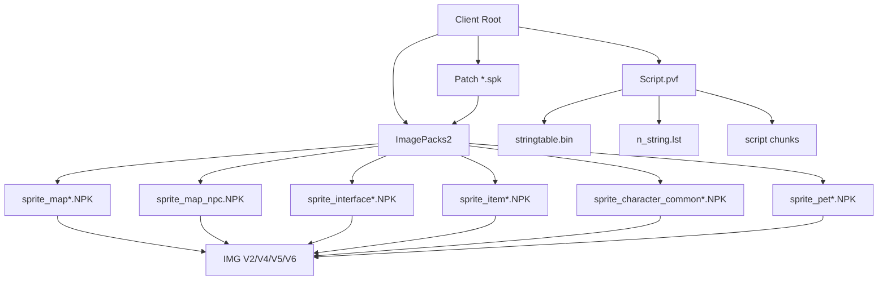
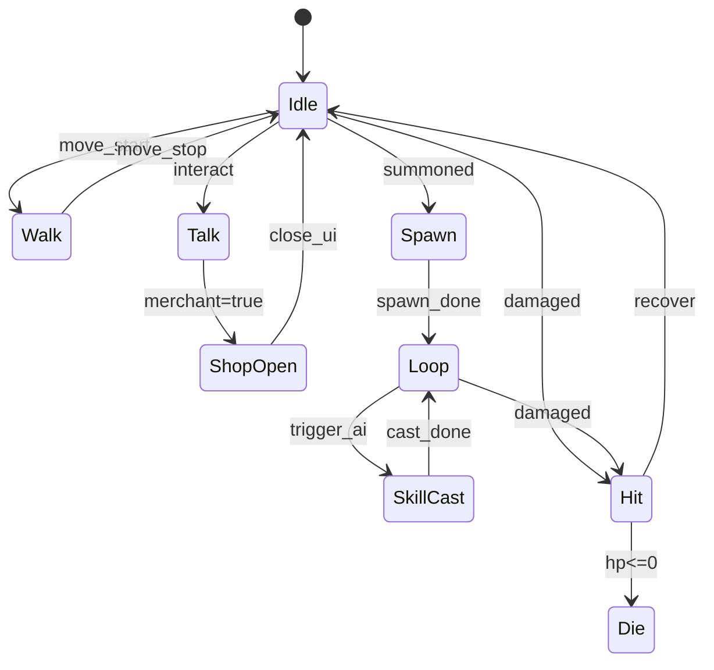

# DNF/DFO 美术资源系统兼容级复刻研究报告

## 执行摘要

这套资源系统从公开资料看，至少可以被拆成四层：补丁分发层 `SPK`、渲染包层 `NPK`、图像/帧层 `IMG`、逻辑脚本层 `PVF`。其中 `NPK` 以 `NeoplePack_Bill` 为文件头、带 264 字节 IMG 索引项和 32 字节校验位；`IMG` 至少有文件头、帧索引表和 ZLIB 压缩图像数据；`PVF` 则保存文件树、字符串表和脚本 chunk；`SPK` 是客户端下载/更新时使用的块级补丁容器，按块做 BZ2 或直存并带 SHA256。公开逆向资料已经足以支撑“容器解析—帧抽取—脚本解码—重新打包—运行时加载”的兼容级工程实现。citeturn8view0turn12view2turn10view0turn11view0turn23view3turn27view0turn45view0

资源命名与分包也有相当稳定的规律：`sprite_map*` 负责场景背景、环境置物、可破坏物与副本门，`sprite_map_npc.NPK` 对应站街 NPC 外观，`sprite_interface.NPK` 汇集大量界面、NPC 立绘、事件贴图和部分对话头像，`sprite_item_*` 负责物品与武器图标，`sprite_character_common*` 负责通用技能图标与角色侧 UI，`sprite_pet_common.NPK` 负责宠物通用效果与宠物相关图标。也就是说，地图物件、NPC、宠物/UI 这几条线在包级别上是可以稳定归类的。citeturn35view0turn40search0turn35view1turn38search1turn38search9turn39search1

运行时瓶颈的证据也比较清晰。entity["company","Nexon","game publisher south korea"] NDC 2014 的公开讲稿显示，客户端曾经面对 54 万数据文件、动画文件占到总文件量约一半、单角色加载会创建 2000+ 动画对象、图像资源总量超过 4GB 等历史包袱；他们把非图像数据做 64KB 分块压缩后，总量可从 642MB 降到约 35MB，并带来 100MB 以上的内存下降；后续又通过“按地下城/技能/时间窗口生成预读列表”的方法减少首发技能卡顿。这说明要复刻的重点不是单纯“会读图”，而是“会分层打包、会预读、会池化、会按上下文回收”。citeturn17view0turn18view0turn19view0

本轮公开检索没有拿到几个关键点的可靠原始规格：一是 `.ani` 的二进制布局；二是 IMGV2 全部颜色格式枚举；三是通用骨骼动画容器；四是九宫格、碰撞盒、挂点是否存在统一的原版通用存储字段。因此，这几个部分在报告中会统一标注为“未公开/需逆向”，并给出可落地的 clean-room 再实现模型。citeturn17view0turn12view2turn10view0turn11view2

## 研究边界与证据等级

本报告只讨论“系统层 1:1 兼容”，即：文件容器、帧数据、图集/调色板/DDS 处理、资源目录、导入流程、运行时加载与动画逻辑；不主张直接再发布原始美术内容，也不附泄露客户端、私服整包或未授权镜像下载路径。证据优先级按“官方页面/NDC/官网协议 → 开源解析器与文档 → 中英文/韩文社区目录对照与工具贴”排序。官方可核验基线主要来自 entity["company","Neople","game developer south korea"] 的 DFO EULA、韩服更新公告与 NDC 公开讲稿；技术细节则大量来自开源文档与解析器。citeturn31view0turn33view0turn33view2turn17view0turn21view0turn21view1

| 子系统 | 已公开证据 | 系统层 1:1 可达性 | 当前结论 |
|---|---|---:|---|
| 地图物件 / 环境置物 / 可破坏物 / 地牢道具 | `sprite_map*`、`sprite_map_*_breakableobject.NPK`、`sprite_map_pathgate*` 等命名与用途在社区目录中较稳定；IMG 公开字段含宽高、大小、x/y、帧域宽高。citeturn35view0turn40search11turn12view2turn10view0 | 高 | 包级分类、帧抽取、原点复原、图集与渲染兼容可做；房间机关语义仍需结合脚本/关卡逻辑补齐。 |
| NPC 系统 | `sprite_map_npc.NPK` 对应站街外观；`sprite_interface.NPK` 含 NPC 立绘/事件贴图；英文 wiki 区分 NPC sprites / NPC images / Dialogue Portraits。citeturn40search0turn35view1turn37search2turn37search3turn37search6 | 中高 | 2D 站街帧、对话头像、商人立绘可分层落地；具体内部 IMG 命名需逐包索引。 |
| 宠物 / 召唤物 | 已见 `sprite_pet_common.NPK` 与个别 `sprite_pet_*` 命名；动画文件在原客户端极多，且技能/召唤/骑乘历史上存在大量硬编码例外。citeturn39search1turn18view0 | 中 | 资源层与运行时触发层可兼容再做；原版统一“骨骼”格式未公开，建议帧动画优先，骨骼作为扩展层。 |
| UI 图标资源 | `sprite_character_common.NPK` 为通用技能图标，`sprite_item_stackable.NPK` 为消耗/材料/商城类图标，`sprite_item_weapon_*` 为职业武器图标，`sprite_interface*` 为大量窗口与事件 UI。citeturn38search9turn38search1turn35view1 | 高 | 图标/背包/技能/UI 资源可以做高精度兼容；九宫格规则未见公开字段，建议外置。 |
| 动画与骨骼 | NDC 公开只明确说 `.ani` 是“按帧记录用哪张图、按什么顺序播放”的动画文件；没有公开可信资料证明 PC 原版广泛使用类似 Spine 的统一骨骼容器。citeturn17view0turn18view0 | 中 | 帧序列与状态机可高复刻；真骨骼格式标注为“未公开/需逆向”。 |

从工程风险看，真正“难”的不是 PNG 是否能导出来，而是“哪类元数据真在原包里、哪类元数据其实在上层脚本或代码里”。在已经公开的 IMG 字段表中，能确认的是颜色格式、压缩方式、宽高、大小、x/y、帧域宽高，以及 link frame；没有看到统一九宫格、碰撞盒、挂点的通用字段。因此，若你的目标是交付开发团队，最稳的策略不是盲猜原版一定“内置了一个通用 hitbox/sockets 子结构”，而是把这些字段设计成 sidecar，并允许后续对单独子系统替换为更接近原版的专用解析器。citeturn12view2turn10view0turn11view2

## 资源文件格式与目录组织

公开资料足以还原出一条原版资源主链：官方安装产物里存在 `ImagePacks2/*.NPK` 这类包；更新流程可经 `*.spk` 下发；NPK 内部以 IMG 为最小图像集合；而逻辑与字符串表则在 `Script.pvf` 这一层。PVF 文件树路径在公开文档中按 CP949 解码，`stringtable.bin` 与 `n_string.lst` 又引入 BIG5/地区化字符串映射，这意味着多语言资源绝不能在工具链里写死 UTF-8。citeturn40search1turn38search6turn23view3turn27view0turn45view0



### 常见文件扩展名、容器与字段

| 扩展名 / 容器 | 作用 | 公开可证实的关键字段 / 特征 | 建议实现要点 |
|---|---|---|---|
| `.spk` | 补丁/分发容器 | 公开文档给出 `magic=0x1B111`、260 字节文件名、块表、每块 48 字节头、块级 SHA256、块内 BZ2 或直存；示例可把 `sprite_interface.NPK.spk` 还原为 `sprite_interface.NPK`。citeturn45view0 | 作为“热更外壳层”实现，不要直接让运行时读 SPK；启动器先解成 NPK。 |
| `.npk` | 图像/音效包 | 16 字节固定头 `NeoplePack_Bill` + 4 字节 IMG 数量；每个 IMG 索引项 264 字节（offset、size、nameEnc[256]）；32 字节校验位；后接 IMG 数据序列。贴图 NPK 含 IMG，音效 NPK 含 OGG。citeturn8view0 | 把 NPK 视为“二级 pack”；索引先常驻、体数据按需 mmap/stream。 |
| `.img` | 图像帧集 | 至少含 `Neople Img File` 头、索引表和 ZLIB 压缩图像数据；索引分“实际帧”和“link frame(0x11)”。实际帧公开字段有：颜色格式、压缩格式、宽、高、大小、x、y、帧域宽、帧域高。citeturn12view2 | 这是导入器的真核心；要支持 link frame 去重。 |
| IMGV2 | 常规彩色图 | 大量 UI、图标、地图、标记、称号等使用；特点是“图像数据不做额外处理而直接压缩”，适合复杂颜色。citeturn12view2 | 默认导出为 RGBA atlas 页；确切颜色枚举表未公开，需样本回归。 |
| IMGV4 | 调色板索引图 | 用于后期时装；前置调色板，图像体由 4 字节像素变成 1 字节索引；图片型索引项 36 字节；颜色系统已公开值 `0x0E`；压缩值 `0x05` 未压缩、`0x06` ZLIB。citeturn10view0 | 运行时必须支持 palette variant；这是时装/染色系统关键。 |
| IMGV5 | DDS 效果图 | 多用于后期技能特效；有 DDS 索引表与普通索引表；DDS 索引项 28 字节；宽高一般要求 4 的倍数；块内仍可 ZLIB；公开文档把像素格式记录为 `0x12/0x13/0x14`。citeturn10view1turn11view0turn11view1 | 把 IMGV5 独立为“效果材质通道”；不要与普通 UI atlas 混打。 |
| IMGV6 | 多调色板索引图 | 公开文档显示它是 V4 的上位形式：一个索引数据对应多个调色板方案；调色板头先写“方案数”，每个方案再写颜色数与 RGBA 表。citeturn11view2 | 适合皮肤/时装色板切换；运行时需传入 palette index。 |
| `.pvf` | 逻辑脚本包 | 结构包括 `uuidLength / uuid / fileVersion / dirTreeLength / dirTreeCrc32 / headerFilesCount / encHeaderTree / filePack`；文件树项含 `fileNumber / filePathLength / filePath / fileLength / fileCrc32 / relativeOffset`。citeturn23view3 | 作为“逻辑真源”；客户端内道具、技能、地图、任务等索引不应散落在美术 import 代码里。 |
| `stringtable.bin` / `n_string.lst` / `.lst` | 字符串表与列表 | `stringtable.bin` 给字符串索引区间；`n_string.lst` 把 StringTable 索引映射到文本文件；公开示例中 `equipment/equipment.lst` 可直接按路径读取。脚本 chunk 的 `ScriptType` 公开到 Int/Float/Section/Command/String/StringLink。citeturn23view3turn21view0turn27view0 | 本地化、显示名、路径反查，都必须先过这一层。 |
| `.ani` | 动画文件 | NDC 公开说明：`.ani` 是 2D 游戏里“每帧用什么图、按什么顺序播放”的文件；但二进制格式本轮未获得公开稳定规格。citeturn17view0turn18view0 | 标注“未公开/需逆向”；运行时先实现 clip-schema，后续再替换底层 parser。 |
| `.ogg` | 音频 | 音效 NPK 内为 OGG。citeturn8view0 | 与美术系统并行，不混入图集流水线。 |

下面这个二进制示例不是原样转储，而是把公开字段整理成开发团队更容易实现的结构体骨架。其目的是统一数据模型，不是声明“原版源码必然就是这样写”。citeturn8view0turn10view0turn23view3turn45view0

```c
// NPK
struct NpkHeader {
    char magic[16];      // "NeoplePack_Bill"
    uint32_t imgCount;
};

struct NpkIndexEntry {
    uint32_t offset;     // IMG absolute offset in file
    uint32_t size;       // IMG size
    uint8_t  nameEnc[256];
};

// IMG common
struct ImgHeader {
    char magic[16];      // "Neople Img File" (V4/V6 docs show 20B string incl. terminator/padding)
    uint32_t indexSize;
    uint32_t reserved;
    uint32_t version;
    uint32_t indexCount;
};

// V4/V6 image frame entry
struct ImgFrameEntry {
    uint32_t colorMode;
    uint32_t compression;
    uint32_t width;
    uint32_t height;
    uint32_t dataSize;
    int32_t  x;
    int32_t  y;
    uint32_t frameWidth;
    uint32_t frameHeight;
};
```

### 图集布局、透明通道、单位与 sidecar 原则

在可公开核验的字段里，`x/y` 与 `frameWidth/frameHeight` 都是像素意义上的绘制参数；韩服官方公告里，某技能的搜索范围也直接用 `X축 600 PX / Y축 250 PX` 来描述，这说明原系统至少在大量美术/命中相关逻辑上是“以像素为第一单位”而不是以米、厘米或抽象 world unit 为第一单位。我的建议是：**authoring 全部用像素，runtime 再做相机和窗口缩放**。citeturn10view0turn11view2turn33view0

对透明通道的处理可以按三类落地：V2 走常规 RGBA/颜色格式枚举解释；V4/V6 走 `palette[index] -> RGBA8888`；V5 走 DDS 块压缩页，宽高按 4 对齐，不和普通 atlas 混合。公开资料没有给出一个通用九宫格、碰撞盒、挂点字段，因此这些内容建议全部放到 sidecar 元数据里，而不是塞进伪造的 IMG 私有扩展里。这样做的好处是：后续如果拿到更接近原版的逆向结果，你只需要替换 sidecar 生成器，不必重写运行时。citeturn12view2turn10view0turn11view0turn11view2

建议的 sidecar 元数据最小集合如下。`pivot_px` 直接承接 IMG 的 `x/y` 语义；`nine_slice_px`、`collision_boxes_px`、`sockets_px` 明确标注为“再实现字段”。这些字段如果未来证明原版存在专用脚本承载，也可以无缝迁移。  

```json
{
  "asset_id": "npc.seria.idle",
  "source_pack": "sprite_map_npc.NPK",
  "source_img": "seria_idle.img",
  "img_version": 2,
  "palette_variant": null,
  "frames": [
    {
      "frame_index": 0,
      "width_px": 64,
      "height_px": 86,
      "pivot_px": [-19, -74],
      "frame_box_px": [0, 0, 96, 96],
      "compression": "zlib",
      "link_to": null
    }
  ],
  "nine_slice_px": null,
  "collision_boxes_px": [
    { "name": "body", "x": -10, "y": -24, "w": 20, "h": 36 }
  ],
  "sockets_px": {
    "origin": [0, 0],
    "hand_r": [12, -28],
    "fx_root": [0, -40]
  }
}
```

### 原版目录镜像与推荐工程目录

社区目录对照已经足够支撑一个“原版镜像目录表”；但为了长期维护，我建议工程内部再建一个“规范化目录镜像”，把原包名、解包结果和运行时资源 ID 分开。下面第一棵树是“原版镜像”；第二棵树是“建议工程树”。citeturn35view0turn35view1turn38search1turn38search9turn39search1

```text
# 原版镜像（只镜像，不改名）
ClientRoot/
  ImagePacks2/
    sprite_map.NPK
    sprite_map_npc.NPK
    sprite_interface.NPK
    sprite_item_stackable.NPK
    sprite_item_weapon_swordman.NPK
    sprite_character_common.NPK
    sprite_character_common_customui.NPK
    sprite_pet_common.NPK
  Script.pvf
  patch/
    sprite_interface.NPK.spk
```

```text
# 建议工程树（供开发团队长期维护）
dnf_res/
  source/
    official_client/
    original_hash_manifest.json
  unpacked/
    npk/<pack-name>//
    pvf/tree.json
    pvf/stringtable.json
  normalized/
    atlases/base/@1x/
    atlases/ui/@1x/
    atlases/effect_dds/
    metadata/frames/
    metadata/ui/
    metadata/anim/
    metadata/ai/
    localization/ko-KR/
    localization/zh-CN/
    localization/en-US/
  runtime/
    bundles/base.resbundle
    bundles/ui.resbundle
    bundles/effect.resbundle
```

建议的命名规则如下：

| 原始命名 | 规范化资源 ID | 用途 | 语言 / 分辨率策略 |
|---|---|---|---|
| `sprite_map_act6_temptation_breakableobject.NPK` | `map.act6.temptation.breakable` | 地图可破坏物 | 原包名不变；atlas 变体加 `@1x/@0.75x` |
| `sprite_map_npc.NPK` | `npc.world.standing` | 站街 NPC sprite | 如有地区差异，locale 放到 `metadata/localization` |
| `sprite_interface.NPK` | `ui.interface.core` | 窗口、NPC 立绘、事件图 | 对话头像与大图分组导出 |
| `sprite_item_stackable.NPK` | `item.icon.stackable` | 消耗/材料/商城图标 | 图标页单独 atlas |
| `sprite_character_common.NPK` | `skill.icon.common` | 通用技能图标 | 技能图标与角色特效拆 atlas |
| `sprite_character_common_customui.NPK` | `ui.character.custom` | BUFF/角色自定义 UI | 强制九宫格 sidecar |
| `sprite_pet_common.NPK` | `pet.common` | 宠物效果、宠物装备/蛋/粮食图标 | 宠物 UI 与宠物展示帧分开 |

本地化处理不要模仿原版把一切都硬塞进一个大包里。原系统已经出现了 `sprite_Interface_Localization_china.NPK` 这样的地区化特例；而 PVF 字符串层又存在 CP949/BIG5 解码问题。工程上应该把“包名兼容”与“文本/地区差异”分离：保留原包名做取证和回归，运行时统一走 `locale -> stringtable/n_string -> display name -> override atlas/UI json` 的覆盖链。citeturn35view1turn23view3turn27view0

## 动画模型与运行时逻辑

NDC 公开讲稿对动画层释放了一个非常重要的信号：原版客户端里动画文件量极大，而且 `.ani` 本质上是“帧序文件”，保存“每一帧用哪个图片、按什么顺序播”。这比“统一骨骼容器”更接近传统 2D 横版 MMO 的做法。再结合 IMG 公开字段里存在 `link frame(0x11)`，但没有公开通用骨骼节点/层级/插值矩阵字段，可以合理判断：**原 PC 版主流路径是帧动画优先，link frame 去重，调色板/特效页做变体；真骨骼格式若存在，也不是本轮公开证据里能可靠复刻的主干。**citeturn17view0turn18view0turn12view2

### 公开可证实的动画语义与建议兼容模型

| 主题 | 已公开能确认的部分 | 未公开 / 需逆向 | 建议兼容实现 |
|---|---|---|---|
| 逐帧动画 | `.ani` 存“每帧哪张图、按什么顺序”。citeturn17view0turn18view0 | `.ani` 二进制字节序与字段布局 | 自定义 `clip.json`，后续再接真正 parser。 |
| 帧去重 | IMG 存 link frame，标识值 `0x11`。citeturn12view2 | link frame 在 `.ani` 中如何引用 | 导入时把 `link_to` 直接映射到前序帧索引。 |
| 调色板变体 | V4/V6 有单/多调色板方案。citeturn10view0turn11view2 | 原版角色/皮肤/时装如何绑定 palette index | 在动画状态上挂 `palette_selector`。 |
| 特效播放 | V5 走 DDS 通道，多见于技能特效。citeturn12view2turn11view0 | 原版 effect shader 全参数 | 把 V5 独立成 effect material pipeline。 |
| 骨骼/slot | 本轮没有拿到可信公开容器 | 骨骼层级、插值、slot 绑定 | 作为“增强层”；不影响基础兼容。 |
| 挂点/碰撞盒 | IMG 通用字段未见公开定义 | 是否位于专用脚本/代码 | sidecar + 可视化编辑器。 |

更重要的运行时结论来自原版优化实践：首发技能卡顿并不是靠“给骨骼做插值优化”解决的，而是靠**预读列表、对象池、按上下文保持热点动画驻留**来解决。原版团队甚至通过采集“技能释放—图像读取”的日志关系、用 20 秒窗口做相关性分析，再生成地下城/职业/技能的预读集。这一点非常值得直接复用成你们自己的资源系统设计原则。citeturn18view0turn19view0

### 动作状态机建议表

下表不是原版逐职业精确导表，而是给开发团队的**兼容默认骨架**。帧率为建议值；原版并无公开统一全局 FPS。资源侧应该把 FPS 设为 clip 元数据，而不是写死在代码里。  

| 动作名 | 建议帧率 | 播放方式 | 典型挂点事件 | 说明 |
|---|---:|---|---|---|
| `idle` | 8 | 循环 | `breath`, `blink` | NPC/宠物待机，小幅摆动 |
| `walk` | 10 | 循环 | `foot_l`, `foot_r` | 站街移动、宠物跟随 |
| `talk` | 8 | 循环或短循环 | `mouth`, `portrait_swap` | NPC 对话站姿 |
| `open_shop` | 12 | 一次性 → `shop_idle` | `ui_open`, `paper_flip` | 商人交互 |
| `hit` | 12 | 一次性 | `hurt_flash` | NPC/召唤物受击 |
| `die` | 10 | 一次性 | `drop`, `fade` | 可破坏物/NPC 特例 |
| `spawn` | 12 | 一次性 | `owner_bind`, `summon_fx` | 宠物/召唤物出现 |
| `loop` | 8~12 | 循环 | `trail`, `aura` | 召唤物在场心跳 |
| `skill_cast` | 12~15 | 一次性 | `socket_hand_r`, `fx_root` | 宠物/召唤主动技 |
| `effect_burst` | 24 | 一次性 | `screen_shake`, `sfx` | V5 特效页，短促爆发 |

下面这个状态机图建议用于 NPC 商店与宠物/召唤共用的“基础行为层”；具体职业与 AI 差异再通过脚本触发器扩展。  



### 状态机与 pet/summon 绑定 JSON 示例

下面两个例子是**可直接交给客户端/工具链团队落地的 sidecar 格式**。它们不是原始导出的 DNF 文件，而是把公开语义翻译成工程上可维护的数据模型。  

```json
{
  "state_machine_id": "npc.merchant.generic",
  "initial_state": "idle",
  "states": {
    "idle": {
      "clip": "npc.merchant.idle",
      "fps": 8,
      "loop": true,
      "events": []
    },
    "talk": {
      "clip": "npc.merchant.talk",
      "fps": 8,
      "loop": true,
      "events": [
        { "frame": 1, "name": "portrait_swap", "arg": "merchant_smile" }
      ]
    },
    "open_shop": {
      "clip": "npc.merchant.open_shop",
      "fps": 12,
      "loop": false,
      "events": [
        { "frame": 3, "name": "ui_open", "arg": "shop_panel" }
      ],
      "next": "talk"
    }
  },
  "transitions": [
    { "from": "idle", "to": "talk", "on": "interact" },
    { "from": "talk", "to": "open_shop", "on": "open_shop" },
    { "from": "talk", "to": "idle", "on": "end_dialog" }
  ]
}
```

```json
{
  "pet_ai_id": "pet.common.follow_attack",
  "bind": {
    "owner_socket": "pet_anchor",
    "spawn_offset_px": [24, -18]
  },
  "follow": {
    "min_distance_px": 32,
    "max_distance_px": 96,
    "teleport_back_if_farther_px": 220
  },
  "triggers": [
    { "when": "owner_enter_dungeon", "do": "spawn" },
    { "when": "owner_skill_tag", "tag": "pickup", "do": "cast_pickup" },
    { "when": "enemy_in_range_px", "value": 140, "do": "attack_basic" }
  ],
  "clips": {
    "spawn": "pet.owl.spawn",
    "idle": "pet.owl.idle",
    "move": "pet.owl.fly",
    "attack_basic": "pet.owl.peck"
  }
}
```

对“宠物骨骼/帧动画”这件事，我的结论是：**第一期不要赌骨骼**。先把帧动画、palette 变体、effect DDS、事件挂点、owner bind 做完，系统已经足以覆盖大多数可见行为；等你们真的拿到可信 `.ani` 或某个宠物专用格式后，再把底层 clip provider 从 JSON 替换成原版 parser 即可。这样做能最大限度降低因错误逆向造成的大面积返工。citeturn17view0turn18view0turn19view0

## 导入工具链与编辑器需求

可执行的导入链建议按“**取样—解包—归一化—建图集—生成运行时 bundle—回归比较**”六段走。公开工具已经覆盖了解包的绝大部分工作：`DFOToolBox` 提供浏览 NPK 和 `npk2gif` 这类 CLI 工具；`OjoDnfExtractor` 的公开说明支持 DNF 图片格式 1–6 版并可导出为 `png/json/xml/gif/mp4`；`npk-api` 的 `doc/` 目录系统整理了 NPK/IMG/SPK；`pvfDotnet` 能按路径读取 `equipment/equipment.lst`；`PvfPlayer` 明确面向“Dungeon Fighter Taiwan”的 PVF unpack/pack；`PVFEditor` 明确支持技能、装备、物品、怪物、任务、地图、副本搜索。换句话说，**你们不需要从零造轮子，但需要把这些轮子统一封成自己的 CI 级命令行。**citeturn29search0turn0search4turn47view0turn21view0turn20search2turn21view1

### 建议工具栈与查看路径

| 工具 / 资料 | 公开用途 | 查看路径 | 适合接入方式 |
|---|---|---|---|
| `LHCGreg/DFOToolBox` | 浏览 `.NPK`，带 `npk2gif` 命令行工具。citeturn29search0 | GitHub 仓库根目录 / README | 给 QA/TA 做快速人工验包；也可做 golden sample 生成。 |
| `HsOjo/OjoDnfExtractor` | 公开说明支持 DNF 图片格式 1~6 版，导出 `png/json/xml/gif/mp4`。citeturn0search4 | GitHub 仓库根目录 | 作为“批量抽帧后端”。 |
| `hooyantsing/npk-api` | 文档化 NPK、IMG、SPK 格式。citeturn8view0turn10view0turn11view0turn45view0 | GitHub `doc/` 目录 | 作为 pack/unpack 与格式回归的参考实现。 |
| `similing4/pvf` | `getPvfFileByPath("equipment/equipment.lst")` 式读取 PVF。citeturn21view0 | GitHub README / `chunk.md` | 作为 PVF 路径型读取库。 |
| `ariakeumi/PvfPlayer` | 面向台服 PVF 脚本 unpack/pack。citeturn20search2turn43search8 | GitHub 仓库根目录 / README | 适合多地区客户端对照实验。 |
| `kahotv/PVFEditor` | 快速搜索技能、物品、怪物、任务、地图、副本。citeturn21view1 | GitHub README | 适合设计/策划核对逻辑脚本与资源索引。 |

### 建议自建统一 CLI

下面的命令不是现有开源工具的原生命令，而是我建议你们封装的一层统一接口。这样做的好处是：底层可以随时替换，CI 与文档不用跟着变。  

```bash
# 1) 把客户端下载补丁先还原成 NPK
dnfres unpack-spk \
  --in source/official_client/patch/sprite_interface.NPK.spk \
  --out unpacked/ImagePacks2/

# 2) 解包 NPK -> IMG -> 帧/索引
dnfres unpack-npk \
  --in unpacked/ImagePacks2/sprite_interface.NPK \
  --out unpacked/npk/sprite_interface/

# 3) 解包 PVF -> 文件树 + 字符串表 + 逻辑脚本
dnfres unpack-pvf \
  --in source/official_client/Script.pvf \
  --out unpacked/pvf/

# 4) 按类型建图集
dnfres build-atlas \
  --in unpacked/npk \
  --profile atlas/gameplay_1x.yaml \
  --out normalized/atlases/base/@1x/

# 5) 生成 sidecar 与运行时 bundle
dnfres bake-runtime \
  --in normalized \
  --out runtime/
```

### 贴图打包参数与批处理规则

由于原版在运行时真正痛的是 I/O 与对象创建，而不是纯渲染 fill-rate，所以建图集的目标不是“把一切尽可能塞进一个超大图里”，而是“**减少状态切换，同时不破坏预读/回收边界**”。建议分包规则如下：地图页、NPC 页、图标页、UI 页、V5 效果 DDS 页分别构建；同一 atlas 页内只混合同 blend mode、同 filter policy、同 palette policy 的资源；V5 效果页单独材质；padding 建议 `2px@1x / 4px@2x`；图标页优先 2048，场景页与角色页可到 4096；所有帧的 `pivot_px` 与 `frame_box_px` 保持整数，不允许图集器做小数重排。这样既保留像素精度，也减少后续状态机与命中特效的“漂帧”。citeturn17view0turn19view0turn10view0turn11view0

建议的配置文件如下：  

```yaml
name: gameplay_1x
page_sizes: [2048, 4096]
padding_px: 2
trim_mode: preserve_pivot
allow_rotation: false
group_by:
  - source_pack_prefix
  - material_domain   # ui / gameplay / effect_dds
  - blend_mode
  - palette_policy    # none / single / multi
split_rules:
  - if: material_domain == effect_dds
    page_size: 2048
  - if: source_pack_prefix == sprite_item
    page_size: 2048
  - if: source_pack_prefix == sprite_map
    page_size: 4096
```

### 自动生成碰撞 / 挂点与可视化预览

因为公开格式里没有统一碰撞盒/挂点定义，所以第一期工具链应提供“自动猜测 + 人工修正”的工作流。对角色/NPC，可以通过 alpha 边界、脚底线、手部局部极值先生成默认 `body`、`foot`、`hand_r`、`fx_root`；对可破坏物，可按非透明像素外接矩形生成 `collision_box_px`。然后在可视化预览器里叠加 frame、pivot、hitbox、socket 和 palette variant。  

```python
from pathlib import Path
import json
from PIL import Image

def guess_meta(png_path: str):
    img = Image.open(png_path).convert("RGBA")
    xs, ys = [], []
    for y in range(img.height):
        for x in range(img.width):
            if img.getpixel((x, y))[3] > 0:
                xs.append(x)
                ys.append(y)

    left, right = min(xs), max(xs)
    top, bottom = min(ys), max(ys)

    meta = {
        "collision_boxes_px": [
            {"name": "body", "x": left, "y": top, "w": right - left + 1, "h": bottom - top + 1}
        ],
        "sockets_px": {
            "origin": [img.width // 2, bottom],
            "fx_root": [img.width // 2, top]
        }
    }
    return meta

out = guess_meta("npc_seria_idle_000.png")
Path("npc_seria_idle_000.meta.json").write_text(json.dumps(out, ensure_ascii=False, indent=2), encoding="utf-8")
```

预览器必须支持的面板，我建议最少包含这几项：原始包树、IMG 帧索引表、link frame 关系、palette 切换、DDS 页面查看、pivot/hitbox/socket 叠加、状态机预演、对话头像/立绘/站街帧联动预览、以及“原包 vs 规范化输出”的像素差异视图。理由并不抽象：原版自己就曾因为资源预读、索引与外部改包不一致而出现 UI 破碎等问题，所以你们一定要把“索引一致性”和“视觉回归”做成工具链内建能力。citeturn19view0

### 运行时加载、热更、内存与性能目标

原版经验非常明确：启动器层处理 SPK；客户端层处理 NPK/IMG/PVF；运行时优先做预读、池化和上下文回收。建议运行时遵循以下原则：

| 设计点 | 建议做法 | 依据 |
|---|---|---|
| 索引常驻 | 启动后仅常驻 NPK 索引、PVF 文件树、字符串表；体数据延迟加载 | 原版大量文件问题主要在 I/O 与对象创建。citeturn17view0turn19view0 |
| 预读 | 入图前按“地图 + 职业 + 常用技能 + NPC + pets”预读，离图回收 | 原版通过地下城/技能相关性生成预读集减少卡顿。citeturn18view0turn19view0 |
| 内存池 | AnimationClip、FrameRef、PaletteVariant、DDSPage 全部对象池化 | 单角色加载 2000+ 动画对象是历史卡点。citeturn17view0 |
| 分块压缩 | 自研 bundle 也按 64KB 块存，块级索引 + 异步解压队列 | 原版公开案例中 64KB 是重要经验值。citeturn17view0 |
| 回收策略 | “地图卸载 / 地牢结束 / UI 关闭”三层回收；不要等 GC | 原版继续推进后预计可腾出 500MB+ 余量。citeturn19view0 |
| 渲染策略 | 先保 I/O，再谈 draw；V5 效果单材质通道 | 原版讲稿直说 2D sprite 渲染不是主要瓶颈。citeturn19view0 |

在分辨率策略上，建议把“原始 1x 美术”视为唯一权威源，然后提供三档显示/打包策略：  
低档：`0.75x` 运行时缩放或更小 atlas 页，面向低显存；  
中档：`1.0x`，完全像素基准；  
高档：游戏 sprite 仍坚持整数倍缩放，UI/文字/立绘允许单独锐化或高分辨率变体。这个结论与韩服官方后来做“wide mode + UI sharpen + 高分辨率选项”是一致的：他们优化的是显示与锐化，不是彻底更换整套旧 sprite 的 authored resolution。citeturn33view0turn33view2

如果需要面向不同引擎落地，我建议这样切：

| 引擎 | 建议 |
|---|---|
| 通用实现 | 自建 `ResourceDB + BundleIndex + ClipProvider + PaletteProvider + StateMachine + PrefetchScheduler` 六件套，所有引擎共享规范。 |
| Unity | 以 `ScriptedImporter`/自定义 EditorWindow 导入；`SpriteAtlas` 只做最终页，不做权威源；保持 `Pixels Per Unit = 1`；Addressables 只承载 bundle，不承载原始 NPK。由 entity["company","Unity Technologies","game engine vendor us"] 生态落地最省人力。 |
| Unreal | 用 `UFactory` 导入规范化 JSON/atlas；UI 走 Slate/UMG，角色/特效可用 Paper2D 或自定义 sprite component；bundle 走 Pak/IoStore；DDS 效果页保留单独材质域。面向 entity["company","Epic Games","game engine vendor us"] 生态时，不要把 Paper2D 当唯一真源。 |
| 自研 | 直接用 64KB block bundle + lock-free IO/decode queue + per-scene residency graph；这是最接近原版优化哲学的方案。 |

## 逆向证据与可交付物

### 公开可引用证据清单

下表只列**可以公开引用**的路径；对泄露客户端镜像、私服整包、未授权台服资源包，本报告不附下载链接。理由很简单：你要复刻的是系统，不是拿一份高风险镜像当“生产依赖”。真正要做样本取证，建议仅在法务批准下由内部受控环境统一获取、统一哈希、统一留痕。citeturn31view0

| 类型 | 来源 | 能证明什么 | 查看路径 |
|---|---|---|---|
| 官方协议 | DFO EULA | 个人/非商用、禁止 reverse engineer / derivative work / redistribute 等限制 | `dfoneople.com` 的 `policy/eula` 页面。citeturn31view0 |
| 官方韩文公告 | 韩服 wide mode / UI sharpen / 新分辨率公告 | 高分辨率、16:9/16:10、UI 锐化、PX 级逻辑范围 | `df.nexon.com` 更新/公告页面。citeturn33view0turn33view2 |
| 官方技术演讲 | NDC 2014 客户端加载优化 | 54 万文件、动画文件占比、64KB 分块压缩、预读列表、内存与加载瓶颈 | `ndcreplay.nexon.com` 的 `NDC2014_0066`。citeturn17view0turn18view0turn19view0 |
| 中文逆向文档 | `npk-api/doc/` | NPK/IMG/SPK 格式字段、版本差异 | GitHub 仓库 `hooyantsing/npk-api` 的 `doc/`。citeturn8view0turn10view0turn11view0turn45view0 |
| PVF 结构文档 | `similing4/pvf` / `chunk.md` | PVF header tree、CP949 路径、stringtable/n_string/script type | GitHub 仓库根目录与 `chunk.md`。citeturn21view0turn23view3turn27view0 |
| 英文工具 | `DFOToolBox` | NPK 浏览与 GIF 导出 | GitHub 仓库 `LHCGreg/DFOToolBox`。citeturn29search0 |
| 中文/多地区工具 | `OjoDnfExtractor`、`PvfPlayer`、`PVFEditor` | 抽帧、台服 PVF unpack/pack、技能/道具/地图搜索 | GitHub 仓库根目录 / README。citeturn0search4turn20search2turn21view1 |
| 社区目录对照 | cnblogs、DNF173、Arad 论坛、DFO World wiki、Reddit | NPK 命名规律、NPC/UI/图标分包范围、头像/立绘路径线索 | 页面标题所示目录/条目。citeturn35view0turn35view1turn40search0turn37search2turn34search3 |

### 可直接交付给开发团队的产物清单

| 交付物 | 文件名示例 | 内容 | 验收标准 |
|---|---|---|---|
| 资源规范文档 | `docs/dnf_resource_spec.md` | 容器层、字段层、命名规则、目录树、sidecar 约束 | 新人按文档可独立导入一个 NPK/PVF 样本 |
| 示例 sprite sheet 与源文件 | `examples/npc/seria_idle.psd`、`seria_idle.png` | 原点、frame box、socket、collision overlay | 预览器中 pivot/hitbox 对齐 |
| 导入脚本 | `tools/dnfres_import.py` | SPK/NPK/PVF 解包、归一化、atlas 生成 | CI 可批量跑完并输出 manifest |
| 动作状态机示例 | `examples/anim/npc_merchant_state_machine.json` | clip、fps、loop、event、transition | 运行时能无代码驱动商店 NPC |
| 宠物/召唤绑定示例 | `examples/ai/pet_common_follow_attack.json` | owner bind、follow 范围、触发器 | 可在地图内跟随、攻击、回收 |
| 渲染/内存基准测试 | `bench/render_memory_bench.yaml` | town/dungeon/profile 预读、I/O、内存回收 | 首发技能不卡顿、离图可回收 |
| 结构图/流程图 | `diagrams/resource_flow.mmd`、`state_machine.mmd` | 目录、ER、状态流程 | Mermaid 可直接渲染 |
| 回归样本 | `tests/golden/sprite_interface.monsterdialogface.snap.json` | 原包输出与规范化输出 hash/像素对比 | 结构与画面对齐通过 |

建议额外再交一个 `manifest.json`，记录每个原包样本的 `sha256 / source / parser-version / locale / pack-name / img-count / decode-status`。这不是花活，而是为了防止后续多地区样本、补丁版本、工具版本混用时失去可追溯性。原版补丁与索引一旦不一致，历史上就真实出现过 UI/界面碎裂的副作用；你们自己的系统不应重蹈这一坑。citeturn19view0

## 法律风险与合规建议

先把边界说清楚：官方 EULA 直接把 reverse engineer、decompile、derivative work、非个人非商用使用、分发与转让列为限制事项；英文版还明确说明软件仅授权你在自己控制的机器上、为个人非商业娱乐目的安装和使用。这意味着“直接复用原包中的美术内容、改包后再分发、把逆向得到的数据和原作资产一起打进商用项目”都处在高风险区。citeturn31view0

因此，合规上我建议至少做四件事。第一，**做 clean-room 分层**：A 组只写规格与 parser，不接触新项目资源；B 组只根据规格产出替代资源与运行时。第二，**不要把原始资产进入正式代码库**：正式仓库只存 hash、截图、元数据与测试结果。第三，**所有样本来源必须留痕**：官方客户端下载、官方补丁、公开 GitHub 工具、公开论坛目录对照分别记录 provenance。第四，**在准备对外发布或商业化前，让专业法律顾问审一次**，尤其是地区化字符串、商人立绘、对话头像这类高度可辨识内容。citeturn31view0turn35view1turn37search2

最后再强调一次“未公开/需逆向”的位置：`.ani` 真规格、通用骨骼格式、通用碰撞盒/挂点内嵌字段、IMGV2 全颜色格式映射，这几项在本轮公开资料中都不足以直接做法律上与技术上都稳妥的“原版精确声明”。正确做法不是硬写死一个你以为“应该是原版”的结构，而是把运行时先做成**兼容层**，然后只在拿到可靠样本与回归证据后再逐项替换底层。这样既能指导开发团队立刻开工，也能把错误逆向带来的制度性返工压到最低。citeturn17view0turn12view2turn10view0turn11view2