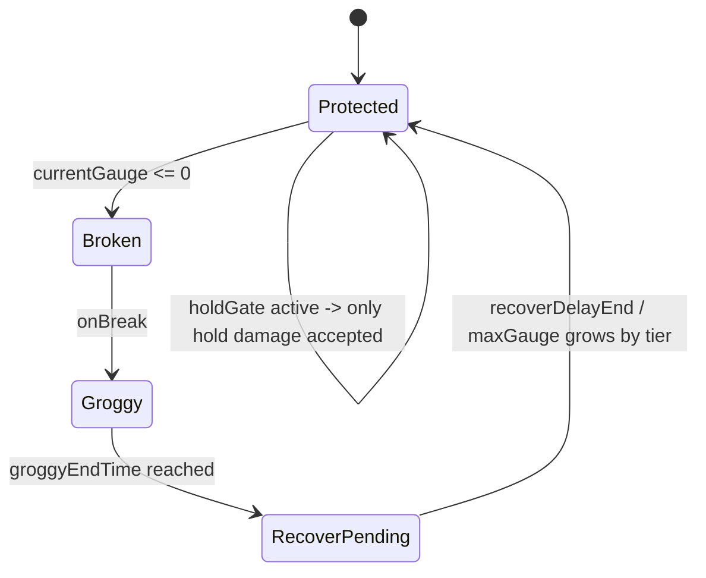
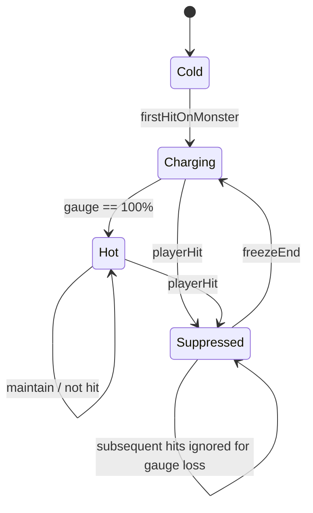
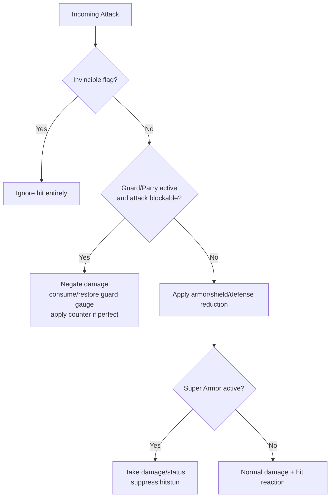

# DNF战斗系统复刻实现研究报告

## 执行摘要

公开可验证资料显示，DNF/DFO 的战斗控制系统在近几年至少经历了两次核心演进：第一阶段是 2022 年上线的“无力化/Neutralize”弱点驱动系统，核心是“怪物弱点 + 异常/控制类型命中 → 无力化条削减 → 条破后进入 Groggy/爆发窗口”；第二阶段是 2025 年韩国服“中天”战斗系统重做，把原先复杂的无力化计算简化为“与角色造成伤害成比例”，并新增了个人单位的“点火/Ignite”系统，用来实时放大无力化削减效率。官方同时保留了“条破后短时间更易受伤”的爆发窗口，但**爆发窗口的时长、增伤倍率、后续回条行为**仍然明显是**怪物脚本参数**，而不是全局常量。citeturn43view0turn44view0turn5view0turn44view2turn45search2

就“能直接指导开发”的实现层面而言，现有公开证据足够确认三件事。第一，**无力化条的当前主逻辑必须服务器权威**，因为它决定 Boss 相位、Groggy 触发、增伤窗口以及多人协作收益；客户端只能做 UI 预测与动画预演。第二，**点火是严格的个人状态**，其升降完全可由“时间 + 是否被击中”驱动，适合做确定性预测，但服务器仍应在伤害结算端重算最终的无力化削减量。第三，**无敌、霸体、格挡/招架并不是同一类保护状态**：公开补丁多次把技能某些帧从 Super Armor 改成 Invincibility，或从 Invincibility 改回 Super Armor，这说明零售客户端/服务端内部至少把这几种保护帧作为独立标志处理，而不是一个统一的“免伤等级”字段。citeturn28view0turn33view2turn34view0turn34view1turn34view2

需要明确的是，用户要求中的“精确数值公式、客户端内存偏移、零售客户端运行时结构体布局”，公开资料**并没有完整公开**。可以确认的是资产层的组织方式：当前全球客户端公开清单显示包含大量 NPK 资源包，而公开解析仓库则已经把 PVF/NPK/IMG 的读取层拆成 `PvfReader`、`PvfScript`、`PvfNode`、`ImgFile`、`Npk` 等组件；这说明**脚本资源层与运行时战斗态之间存在明确分层**。但**运行中的 BossCombatState/PlayerCombatState 真正偏移与对象布局，未公开/未找到**。因此，本报告对“公式、状态机、网络协议、运行时结构”一律分为两类：**已确认事实**与**复刻建议**；前者严格基于官方与公开实测，后者是为 1:1 复刻目标给出的工程化近似。citeturn39search0turn20view0turn41search0turn47view0

## 证据与建模边界

本报告采用五级证据体系。A 级为官方更新说明/官方游戏指南；B 级为全球服同步页面、中文官方职业/系统页面；C 级为韩国官方社区高质量实测帖；D 级为公开逆向/PVF/NPK 解析资料；E 级为“未公开/未找到”，只做边界标记，不把它伪装成已知事实。A/B 级用于确定机制方向与规则；C 级用于补足倍率范围、窗口时长、被击中时的边缘行为；D 级只用于说明**资源组织与脚本容器**，不等同于 retail 运行时内存偏移。citeturn45search2turn44view2turn33view2turn41search0turn47view0

本轮公开证据能够确认：韩国服与全球服官方文档都已经存在完整的 Neutralize/Ignite/Guard 术语与 UI 说明；中文官方页面可以确认“无敌/霸体”以及“格挡/招架”在技能与装备文案中是分离概念；但**中文服、台服关于“2025 新版无力化 + 点火”的完整系统页，公开索引中未检到可直接引用页面**，因此本报告中的区服差异会把中服/台服在该项标为“未公开/未找到”。citeturn5view0turn44view2turn33view2turn34view2turn11search8turn11search2

还有一个重要边界：公开官方只给出了**单调关系**，没有给出“点火从 0 到 100 的精确填充秒数”“被击后冻结多久”“条破后每次回条增长多少”“满点火时的全局公式”这一类开发最想要的数字。相反，社区实测只能给出样本，比如“同一技能在满点火与停滞点火状态下，无力化削减约为 10% 对 2%”，或“部分 Boss 的无力化 Groggy 为 +50% 10 秒，另一些 Boss 是 8 秒/15 秒，甚至与当时的伤害倍率脚本联动”。因此，严格意义上的“原厂精确常数”并未公开；本报告给出的数值模型是**复刻级工程模板**，不是声称从零售客户端拿到了真实常量。citeturn28view0turn30search0turn30search4

## 无力化与 Groggy 爆发窗口系统

### 已确认机制与版本演进

2022 年首版 Neutralize Gauge 的设计逻辑非常清楚：Named/Boss 在特定区域与模式下带有 Neutralize Gauge；每个怪物有不同弱点与不同条量；打中其弱点并把条削空后，怪物会对异常、控制、硬直等更多减益变得脆弱；一段时间后条会恢复，而且恢复后的最大条量会比之前更高。官方后来在 Ispins 阶段又统一加上“所有攻击”与“除伤害型异常之外的所有异常”作为共通弱点，以降低职业之间因异常/控制构成不同而产生的削条差距。到了 2025 年韩国服战斗系统重做，官方把“复杂计算式”明确改为“与角色造成伤害成比例”，并且加入点火来实时提高削条率。citeturn43view0turn44view0turn5view0turn44view2

韩国官方战斗系统指南还明确写明：当无力化条被削空时，怪物会进入一段“Groggy 状态”，在这段时间里承受更大伤害；而无力化条的削减与“给怪物造成的伤害量”成比例。也就是说，**新版系统的主驱动已经从“异常/控制类型命中”转到“伤害驱动”，弱点与点火变成乘区或修正器**，而不再是唯一入口。citeturn45search2turn44view2

社区高质量实测又补足了三个实现层关键点。第一，旧版弱点异常在实践中常按 **2 倍** 处理；第二，部分 Boss 在特定内容里有“Hold Gate/控场门”，例如某些怪在 Hold Gauge 未满足前，只吃“홀딩 무력화”，不吃打击无力化或异常无力化，实测样本给出了大约 **8 秒**的 Hold 满足门槛；第三，Groggy 的“时长/倍率”明显是怪物脚本参数——当前内容样本里既有“无力化成功后 +50% 伤害、持续 10 秒”，也有 8 秒、15 秒甚至按 Boss 当前脚本倍率落在 125%/135%/160%/180% 档位的情况。citeturn30search2turn30search4turn30search0

### 复刻参数表

| 参数项 | 已确认事实 | 复刻建议 | 置信度 |
|---|---|---|---|
| 条拥有者 | 仅 Named/Boss 或特定高难怪拥有。citeturn43view0turn45search2 | `MonsterCombatState.neutralize` 仅挂在可脚本化精英/Boss 上。 | A |
| 弱点类型 | 2022 首版按怪物弱点与异常/控制关联；Ispins 后加“所有攻击”“所有非伤害型异常”为共通弱点。citeturn43view0turn44view0 | 保留 `weaknessMask`，并支持“共通弱点层”。 | A |
| 削条主驱动 | 2025 版明确变为“按造成伤害成比例”。citeturn5view0turn44view2 | `delta = damage * coeff * igniteMul * weaknessMul * specialMul`。 | A/B |
| 弱点倍率 | 旧版社区实测常按 2 倍。citeturn30search2turn42search5 | 旧版模板 `weaknessMul=2.0`；新版可保留为可配参数，不写死。 | C |
| 条破效果 | 条破后进入 Groggy，承受更多伤害；并对更多减益开放。citeturn43view0turn45search2 | `state=Groggy`，开启 `damageTakenMul>1`，放开受控/受异常标志。 | A |
| Groggy 时长 | 官方只说“持续一段时间”；社区样本出现 6/8/10/15 秒。citeturn45search2turn30search4 | `groggyDurationMs` 做怪物脚本字段，不用全局常量。 | A/C |
| Groggy 倍率 | 官方只说“更大伤害”；社区样本有 +50%、125%~180%、150%、250%。citeturn30search0turn30search4 | `groggyDamageMul` 做怪物脚本字段。 | A/C |
| 回条行为 | 官方确认恢复后最大条量会更高。citeturn43view0 | 用 `recoveryTier` + 成长表控制，而不是简单倍数。 | A/B |
| Hold Gate | 非全局系统，仅部分怪/内容存在。citeturn30search2 | `optional holdGate`；未配置时关闭。 | C |

### 状态机



上图中，`Broken` 与 `Groggy` 在实现上可以合并，但建议拆开：`Broken` 负责“一次性条破事件触发”，`Groggy` 负责“持续态增伤窗口”；这样更容易在脚本里挂接转阶段动画、Boss 语音、摄像机、QTE 与 UI 锁定。官方能确认“条破后有一段更易受伤时间”，社区样本进一步证明这个窗口在不同怪脚本里差异极大。citeturn45search2turn30search4turn30search0

### 数值公式与实现建议

**已确认的最低真值**只有三条：旧版有弱点；新版是伤害成比例；点火会实时提高削条率。基于这些证据，最接近当前版本、又适合直接落地开发的统一公式是：

\[
\Delta N = \min \Big(
D \cdot K_{d2n} \cdot M_{ignite}(g) \cdot M_{weak}(tags, boss) \cdot M_{phase}(boss) \cdot M_{buff}(player,boss),
N_{cur}
\Big)
\]

其中：

- \(D\)：本次命中最终有效伤害。
- \(K_{d2n}\)：伤害转削条系数，按怪物模板配置。
- \(M_{ignite}(g)\)：点火倍率；官方未公开，建议做可调线性/分段函数。
- \(M_{weak}\)：弱点修正；旧版模板可用 2.0，当前版建议保留为数据项。
- \(M_{phase}\)：按 Boss 当前相位/脚本倍率修正。
- \(M_{buff}\)：装备、被动、内容 Buff 对削条的增减。

如果要兼容 2022 旧式系统，再补一套“非伤害驱动”的前置分支即可：

\[
\Delta N_{legacy}= (H_{hit} + H_{status} + H_{hold}) \cdot M_{weak} \cdot M_{special}
\]

其中 `H_hit/H_status/H_hold` 分别对应打击削条、异常削条与 Hold 削条；当怪物存在 Hold Gate 时，只允许 `H_hold` 生效，直到 Gate 满足为止。这个分支正好对应官方首版 Neutralize 与 Ispins 改造的时代。citeturn43view0turn44view0turn30search2

### 关键伪实现

```cpp
enum class NeutralizeVersion : uint8_t {
    LegacyWeakness,   // 2022~2024
    DamageDriven      // 2025+
};

struct HoldGateConfig {
    bool enabled = false;
    float requiredHoldSeconds = 0.0f;   // 样本怪可约 8s；未公开时由脚本配置
    float accumulatedHoldSeconds = 0.0f;
};

struct GroggyConfig {
    float durationMs = 10000.0f;        // 只作默认值；必须允许怪物覆写
    float damageTakenMul = 1.5f;        // 1.5 = +50%
};

struct NeutralizeProfile {
    NeutralizeVersion version;
    float baseGauge;
    float damageToGaugeCoeff;
    float gaugeGrowthPerRecoveryTier;
    float maxGaugeCap;
    float weaknessMultiplier;           // 旧版弱点可设为 2.0
    GroggyConfig groggy;
    HoldGateConfig holdGate;
    uint64_t weaknessMask;
};

struct MonsterCombatState {
    float currentGauge;
    float maxGauge;
    uint8_t recoveryTier;
    bool inGroggy;
    uint64_t groggyEndServerMs;
};

float ComputeNeutralizeDelta(
    const NeutralizeProfile& profile,
    const MonsterCombatState& boss,
    float finalDamage,
    float igniteMul,
    uint64_t hitTags,
    float hitNeutralize,
    float abnormalNeutralize,
    float holdNeutralize)
{
    if (profile.holdGate.enabled &&
        profile.holdGate.accumulatedHoldSeconds < profile.holdGate.requiredHoldSeconds) {
        return std::min(holdNeutralize, boss.currentGauge);
    }

    float weaknessMul = ((hitTags & profile.weaknessMask) != 0)
        ? profile.weaknessMultiplier
        : 1.0f;

    float delta = 0.0f;
    if (profile.version == NeutralizeVersion::DamageDriven) {
        delta = finalDamage * profile.damageToGaugeCoeff * igniteMul * weaknessMul;
    } else {
        delta = (hitNeutralize + abnormalNeutralize + holdNeutralize) * weaknessMul;
    }
    return std::min(delta, boss.currentGauge);
}

void ApplyNeutralize(
    const NeutralizeProfile& profile,
    MonsterCombatState& boss,
    float delta,
    uint64_t nowMs)
{
    boss.currentGauge -= delta;
    if (boss.currentGauge > 0.0f) return;

    boss.currentGauge = 0.0f;
    boss.inGroggy = true;
    boss.groggyEndServerMs = nowMs + static_cast<uint64_t>(profile.groggy.durationMs);
}

void EndGroggyAndRecover(const NeutralizeProfile& profile, MonsterCombatState& boss)
{
    boss.inGroggy = false;
    boss.recoveryTier += 1;

    float nextGauge = profile.baseGauge +
        profile.gaugeGrowthPerRecoveryTier * static_cast<float>(boss.recoveryTier);

    boss.maxGauge = std::min(nextGauge, profile.maxGaugeCap);
    boss.currentGauge = boss.maxGauge;
}
```

这段伪码的关键不是“数值绝对正确”，而是结构上同时容纳了**旧版弱点削条**、**新版伤害驱动削条**、**Boss 特例 Hold Gate** 与**怪物脚本化 Groggy 参数**。它与公开证据的拟合度最高，也最接近实际线上内容表现。citeturn43view0turn44view0turn5view0turn30search2turn30search4

### 可直接落地的 JSON 数据模型

```json
{
  "monsterId": 9102101,
  "neutralize": {
    "version": "damage_driven",
    "baseGauge": 100000.0,
    "damageToGaugeCoeff": 0.00012,
    "weaknessMask": [
      "all_attack",
      "all_non_damage_status",
      "freeze",
      "stun"
    ],
    "weaknessMultiplier": 1.25,
    "recovery": {
      "growthPerTier": 12000.0,
      "maxGaugeCap": 160000.0
    },
    "holdGate": {
      "enabled": true,
      "requiredHoldSeconds": 8.0
    },
    "groggy": {
      "durationMs": 10000,
      "damageTakenMultiplier": 1.5,
      "unlockStatuses": true,
      "unlockImmobility": true
    }
  }
}
```

### 网络同步、预测与安全

从机制权重看，无力化/Groggy 必须采用**服务器权威 + 客户端预测显示**。客户端可以在本地根据自己发出的伤害命中、当前点火值与怪物模板去预测无力化条 UI，但**不能决定条破时刻**；真正的条破、Groggy 开始、Groggy 结束、下次回条 tier 增长，都必须由服务器广播。否则任何“削条倍率补丁”“本地点火伪造”“强制进入 Groggy”都能直接破坏组队内容与排名内容。citeturn45search2turn37search6turn37search0

推荐的网络策略是：客户端上报 `skillCast/inputSeq`，服务端以服务端时间轴重放技能帧并结算伤害；每次命中返回 `S_HitConfirm` 时顺带携带 `bossNeutralizeDelta` 和 `bossNeutralizeCur`。当服务端判定 `currentGauge<=0`，才下发 `S_NeutralizeBreak{monsterId, groggyEndTime, damageTakenMul}`。客户端如果本地预估已经接近 0，可以提前开始“破条闪烁”和“镜头预热”，但在收到 `S_NeutralizeBreak` 前不真正切换 Boss 逻辑态。安全上要重点防三类手段：伪造伤害转削条系数、重复发送 Hold 计数包、以及本地替换 Boss 弱点表。最稳妥的办法是把怪物弱点表和削条系数视为服务器配置，只让客户端持有只读镜像。citeturn30search2turn37search6turn37search0

## 点火系统

### 已确认机制

韩国服 2025 战斗系统改版与全球服新版指南都确认了点火系统的核心定义：它是一个**按个人计算**的战斗节奏条；从“第一次打到怪”开始，随时间增长；点火值越高，无力化条削减效率越高；角色被怪物击中时，点火会下降并停止增长；停滞一段时间后又重新开始增长。韩国官方还明确写过“角色被击中时，点火计量条停止的时间在 First Server 对比 Live 时被进一步提高”，说明“被击后的冻结持续时长”确实是内部参数。citeturn5view0turn44view2turn45search2

社区实测把这个系统的边缘条件补得很完整。首先，点火是**队员各自独立**的，某个队友被击并不会让全队点火掉条。其次，**霸体硬吃攻击仍然算被击中**，因此会掉点火；相反，**无敌或社区所称的 “Stuck” 回避**不会被当成被击，不会掉点火。再次，在一个被击后的停滞阶段里，**只有第一下真正扣点火**，后续连续挨打不再重复扣，因为系统已经被切入“Suppressed/冻结”态。最后，样本测试显示同一组技能在“满点火”与“点火停滞”两种情况下，对无力化条削减大约是 **10% 对 2%**，即约 5 倍级差距。这个 5 倍不是官方常数，但足以说明点火不是一个轻微 buff，而是当前版本**真正决定条破速度的乘区**。citeturn28view0turn45search1turn45search3

### 复刻参数表

| 参数项 | 已确认事实 | 复刻建议 | 置信度 |
|---|---|---|---|
| 作用域 | 个人单位，不共享。citeturn5view0turn28view0 | `PlayerIgniteState` 绑定角色实例。 | A |
| 启动条件 | 第一次打到怪后开始随时间增长。citeturn5view0turn45search2 | 由 `OnFirstRelevantHit(monsterId)` 启动。 | A |
| 初始值 | 进怪或 Boss 生成后从 0 开始增长。citeturn45search0turn45search3 | `gauge=0`，进入 `Charging`。 | C |
| 提升效果 | 实时提高无力化削减率。citeturn5view0turn44view2 | 作为无力化公式中的独立乘区。 | A |
| 被击行为 | 被击则下降并冻结；First Server 后冻结时长增加。citeturn5view0turn45search2 | 配置 `hitPenalty` 与 `freezeMs`。 | A/B |
| 霸体吃击 | 霸体顶伤害也会掉点火。citeturn28view0 | `superArmor` 不改变 `isHit=true`。 | C |
| 无敌回避 | 无敌/Stuck 规避不算被击。citeturn28view0turn45search1 | `invincible => no ignite penalty`。 | C |
| 连续多段受击 | 停滞期只在首段受击时扣点火。citeturn28view0 | 增加 `suppressed` 态与 `firstHitOnly`。 | C |
| 乘区范围 | 官方未公开；样本约 5 倍差。citeturn28view0 | 默认 `igniteMul=[1.0,5.0]`，支持线性/分段。 | C |

### 状态机



这个状态机的重点是把“扣点火”和“停增长”拆成两个动作：先应用一次 `hitPenalty`，然后进入 `Suppressed`，在 Suppressed 内不再重复扣。这样才能复现社区观测到的“第一下扣、后面不再扣”的行为。citeturn28view0

### 数值公式与实现建议

点火系统的官方表达是“点火值越高，无力化条削减率越高”，但没有公开函数形状。为了同时满足“官方单调关系”和“社区约 5 倍样本”，建议使用下面这套**分段线性**复刻函数：

\[
M_{ignite}(g)=
\begin{cases}
1.0 + 2.0g, & 0 \le g < 0.5 \\
2.0 + 6.0(g-0.5), & 0.5 \le g \le 1.0
\end{cases}
\]

它在 \(g=0\) 时是 1.0，在 \(g=1\) 时是 5.0；低点火阶段成长平缓，高点火阶段成长更陡，比较符合“后半段明显更有价值”的体感。如果想要更接近街机式爽感，也可以换成简单线性：

\[
M_{ignite}(g)=1.0 + 4.0g
\]

而点火本体的演化可写为：

\[
g_{t+\Delta}=
\begin{cases}
\min(1, g_t + r_{fill}\Delta), & \text{Charging/Hot 且未被击}\\
\max(0, g_t - p_{hit}), & \text{进入 Suppressed 的首击}\\
g_t, & \text{Suppressed}
\end{cases}
\]

其中 `r_fill`、`p_hit`、`freezeMs` 都必须做数据配置，因为官方已经明确在平衡流程中调过“被击后的停止时间”。citeturn5view0turn44view2turn28view0

### 关键伪实现

```cpp
enum class IgniteState : uint8_t {
    Cold,
    Charging,
    Hot,
    Suppressed
};

struct IgniteConfig {
    float fillPerSecond = 0.20f;    // 复刻建议值；官方未公开
    float hitPenalty = 0.25f;       // 首击扣除比例；官方未公开
    uint32_t freezeMs = 2500;       // 被击后冻结；官方确认有该参数，但未公开具体值
    float minMul = 1.0f;
    float maxMul = 5.0f;
};

struct PlayerIgniteState {
    IgniteState state = IgniteState::Cold;
    float gauge01 = 0.0f;
    uint64_t freezeUntilMs = 0;
};

float ComputeIgniteMul(const IgniteConfig& cfg, float gauge01) {
    float g = std::clamp(gauge01, 0.0f, 1.0f);
    return cfg.minMul + (cfg.maxMul - cfg.minMul) * g;
}

void OnRelevantMonsterHit(PlayerIgniteState& st) {
    if (st.state == IgniteState::Cold) {
        st.state = IgniteState::Charging;
    }
}

void OnPlayerDamaged(
    const IgniteConfig& cfg,
    PlayerIgniteState& st,
    bool wasInvincible,
    bool tookBlockedByParry,
    bool tookHitThroughSuperArmor,
    uint64_t nowMs)
{
    // 无敌或成功格挡/招架不应视为 ignite hit
    if (wasInvincible || tookBlockedByParry) return;

    // 霸体硬吃攻击：仍视为 hit
    if (st.state != IgniteState::Suppressed) {
        st.gauge01 = std::max(0.0f, st.gauge01 - cfg.hitPenalty);
    }

    st.state = IgniteState::Suppressed;
    st.freezeUntilMs = nowMs + cfg.freezeMs;
}

void TickIgnite(const IgniteConfig& cfg, PlayerIgniteState& st, float dt, uint64_t nowMs) {
    if (st.state == IgniteState::Suppressed) {
        if (nowMs >= st.freezeUntilMs) {
            st.state = (st.gauge01 >= 1.0f) ? IgniteState::Hot : IgniteState::Charging;
        }
        return;
    }

    if (st.state == IgniteState::Charging || st.state == IgniteState::Hot) {
        st.gauge01 = std::min(1.0f, st.gauge01 + cfg.fillPerSecond * dt);
        st.state = (st.gauge01 >= 1.0f) ? IgniteState::Hot : IgniteState::Charging;
    }
}
```

### 可直接落地的 JSON 数据模型

```json
{
  "ignite": {
    "scope": "per_player",
    "startOnFirstMonsterHit": true,
    "fillPerSecond": 0.22,
    "hitPenalty": 0.28,
    "freezeMs": 2500,
    "multiplierCurve": {
      "type": "piecewise_linear",
      "points": [
        [0.0, 1.0],
        [0.5, 2.0],
        [1.0, 5.0]
      ]
    },
    "hitRules": {
      "superArmorCountsAsHit": true,
      "invincibleCountsAsHit": false,
      "parryCountsAsHit": false,
      "onlyFirstHitAppliesPenaltyDuringFreeze": true
    }
  }
}
```

### 网络同步、预测与安全

点火是三套子系统里最适合做**本地预测**的一个，因为它本质上是一个单人状态机：只依赖“我有没有开始打怪”“我有没有被击中”“我是否处于冻结”。因此客户端完全可以本地推进点火条 UI，不需要每帧等服务器广播；但服务器仍应在伤害结算时使用**服务器版本的点火值**计算最终削条量，并周期性把 `igniteGauge01` 纠偏给客户端。citeturn5view0turn28view0

安全风险主要有三类：第一，客户端跳过被击后的冻结；第二，把霸体受击伪装成“未命中”从而不掉点火；第三，加速点火填充。解决办法是服务端不要接受客户端上传的“当前点火值”，而只接受“技能命中事件”和“受击判定事件”；点火值由服务端根据事件时间轴自行推导。客户端提交的只是输入，不是状态。这样即使玩家本地篡改 UI，也无法影响真实的无力化削减结果。citeturn28view0turn37search6

## 无敌、霸体、护甲、格挡、招架优先级系统

### 术语收敛

官方战斗系统指南只明确给出了两种核心保护态：**无敌**与**超级霸体**。无敌的定义是“使用特定技能时不会被怪物攻击命中”；超级霸体的定义是“即使受到攻击也不会进入硬直”。这两者已经足够说明：**无敌处理的是命中判定层，霸体处理的是受击反应层**。它们不是一回事。citeturn45search2turn9search1

“格挡/招架”则是另一条线。全球服与韩服 Nabel Raid 官方页确认了一个**内容专属通用 Guard**：它可以通过 Dungeon Special Key 触发，能阻挡来袭攻击或反制特殊攻击，入场有 1 格 Guard Gauge，上限 3 格，随时间恢复；成功防住紫/白预警或带盾标攻击时还会立即返还消耗的 Guard Gauge，并可能直接打断机制或提供战斗优势。另一方面，中服官方页面又能确认职业/装备层面一直存在“格挡、招架、武器格挡、盾牌格挡、远程格挡”等独立概念，且精确格挡会强制控制敌人 2 秒。citeturn33view2turn33view0turn11search8turn11search2

用户问题中的“护甲”在公开官方文档里**并没有一个单独、统一、横跨全职业的运行时状态名**。公开材料里真正出现的是“防御公式”“被击伤害减少”“护甲精通”“减伤技能”“坐骑模式 50%→20% 受伤减免”这一类内容。因此，若你要做复刻引擎，最稳妥的抽象不是给 DNF 硬套一个神秘的 `ARMOR_STATE`，而是把“护甲”建模成**伤害减免/护盾/Armor Mastery/防御换算**这一层，与“无敌/格挡/霸体”分开。citeturn43view0turn44view0

### 优先级表

| 机制 | 是否命中成立 | 是否吃伤害 | 是否吃硬直 | 是否影响点火受击 | 典型来源 | 复刻优先级 |
|---|---|---|---|---|---|---|
| 无敌 | 否。攻击直接不命中。citeturn45search2turn34view0 | 否 | 否 | 否。社区实测无敌不视为点火受击。citeturn28view0 | 角色技能帧 | 最高 |
| 格挡/招架 | 命中先进入可格挡检查。成功则阻挡或反制。citeturn33view2turn11search8 | 一般否；内容脚本可定义反制收益 | 否 | 建议否；成功 Guard/Parry 不应掉点火。 | 通用 Guard / 职业格挡 | 高 |
| 护甲/减伤层 | 是 | 是，但按减伤/护盾后处理。citeturn43view0turn44view0 | 取决于是否另有霸体 | 是，除非同时无敌/格挡成功 | 被动、防御、护盾 | 中 |
| 霸体 | 是 | 是 | 否。只取消硬直。citeturn45search2turn34view2 | 是。霸体硬吃攻击会掉点火。citeturn28view0 | 技能帧/BUFF | 低于格挡 |
| 普通受击 | 是 | 是 | 是 | 是 | 所有命中 | 最低 |

这张表背后的核心证据是：官方多次在技能平衡里把同一个技能的某些帧从 Super Armor 改成 Invincibility，或反过来；这说明二者在底层不是优先级不同的同一状态，而是**两个独立标志位**。同理，通用 Guard 又是第三条处理链，因为它既有独立资源槽（Guard Gauge），也有独立触发对象（紫/白预警、盾标），还允许取消多数动作直接进入防御姿态。citeturn34view0turn34view1turn34view2turn33view2

### 推荐的命中解析流程



这个流程不是“我觉得应该这样”，而是最能同时解释官方和社区证据的实现方式。无敌必须先判，因为官方定义已经是“不会被命中”；Guard/Parry 必须在减伤与霸体之前，因为它的定义就是“阻挡攻击或反制特殊攻击”；护甲/减伤层是数值修正，不应替代命中结果；霸体是“受击后不硬直”，所以天然排在命中与伤害已经成立之后。citeturn45search2turn33view2turn44view0turn28view0

### 关键伪实现

```cpp
enum ProtectionFlags : uint32_t {
    PF_None        = 0,
    PF_Invincible  = 1 << 0,
    PF_SuperArmor  = 1 << 1,
    PF_Guard       = 1 << 2,
    PF_PerfectParry= 1 << 3,
    PF_Shield      = 1 << 4,
    PF_DamageReduce= 1 << 5
};

struct DefenseState {
    uint32_t flags;
    float damageReduceRate;       // e.g. 0.20 = 20%减伤
    float shieldHp;
    uint8_t guardGauge;
    uint64_t guardWindowEndMs;
    uint64_t perfectParryEndMs;
};

struct AttackContext {
    bool blockable;
    bool parryable;
    float rawDamage;
    uint64_t nowMs;
};

enum class HitResolution {
    IgnoredByInvincible,
    Guarded,
    Parried,
    DamagedWithSuperArmor,
    DamagedNormally
};

HitResolution ResolveIncomingHit(
    DefenseState& def,
    AttackContext atk,
    float& outFinalDamage,
    bool& outCountsAsIgniteHit)
{
    // 1) 无敌
    if (def.flags & PF_Invincible) {
        outFinalDamage = 0.0f;
        outCountsAsIgniteHit = false;
        return HitResolution::IgnoredByInvincible;
    }

    // 2) 格挡 / 招架
    bool guardActive = (def.flags & PF_Guard) && atk.nowMs <= def.guardWindowEndMs;
    bool perfectActive = (def.flags & PF_PerfectParry) && atk.nowMs <= def.perfectParryEndMs;

    if (guardActive && atk.blockable && def.guardGauge > 0) {
        def.guardGauge -= 1;
        outFinalDamage = 0.0f;
        outCountsAsIgniteHit = false;

        if (perfectActive && atk.parryable) {
            return HitResolution::Parried;
        }
        return HitResolution::Guarded;
    }

    // 3) 护甲 / 护盾 / 减伤
    float dmg = atk.rawDamage;
    if (def.flags & PF_DamageReduce) {
        dmg *= (1.0f - def.damageReduceRate);
    }
    if ((def.flags & PF_Shield) && def.shieldHp > 0.0f) {
        float absorbed = std::min(def.shieldHp, dmg);
        def.shieldHp -= absorbed;
        dmg -= absorbed;
    }

    // 4) 霸体
    outFinalDamage = std::max(0.0f, dmg);
    outCountsAsIgniteHit = (outFinalDamage > 0.0f); // 霸体依然算 hit

    if (def.flags & PF_SuperArmor) {
        return HitResolution::DamagedWithSuperArmor;
    }

    // 5) 普通受击
    return HitResolution::DamagedNormally;
}
```

### 可直接落地的 JSON 数据模型

```json
{
  "skillDefenseProfile": {
    "skillId": 44051,
    "windows": [
      {
        "startMs": 0,
        "endMs": 180,
        "flags": ["invincible"]
      },
      {
        "startMs": 181,
        "endMs": 540,
        "flags": ["super_armor", "damage_reduce"],
        "damageReduceRate": 0.3
      }
    ],
    "guardOverride": {
      "allowCancelIntoGuard": true,
      "excludeStates": ["awakening", "grabbed", "script_locked"]
    }
  }
}
```

### 网络同步、预测与安全

保护状态是最容易被篡改、也最需要“体感顺滑”的部分，因此建议采用**服务端时间轴权威 + 客户端帧窗预测**。客户端根据本地技能施法与动画可提前亮起白边（无敌）、红边（霸体）或 Guard 姿态，但真正的“这一下算不算打到人”，必须由服务器根据**技能启动时间、当前帧窗配置、攻击可格挡标志、Guard 输入时戳**统一判定。Nabel 的通用 Guard 因为直接影响机制成功与失败，更不能由客户端说了算。citeturn33view2turn45search2

在反作弊上，最危险的不是简单的“无敌全开”，而是把技能中后摇的 Super Armor 偷换成 Invincibility，或伪造 Perfect Parry 输入时戳。因为公开补丁已经证明官方经常按帧去微调“这段是霸体还是无敌”，说明这些窗口是战斗平衡的直接控制点。解决办法是：所有技能防御帧窗由服务器端技能表导出；客户端只缓存只读镜像；Guard/Parry 输入附带 `inputSeq` 和本地时间，但服务器要用接收时刻和技能状态重建判定。citeturn34view0turn34view1turn34view2

## 客户端数据、网络同步与来源索引

### 资产层、脚本层与运行时层

当前全球客户端公开清单显示，DFO 的资源粒度非常细：公开清单可见 **13,459 个 NPK**、**5,263 个 REP**、**44 个 DLL** 等文件类型；而公开的 PVF/NPK 解析仓库已经把读取层拆成 `BufferReader`、`ImgFile`、`Npk`、`NpkLoader`、`Pvf`、`PvfAnimation`、`PvfDocument`、`PvfNode`、`PvfReader`、`PvfScript`、`PvfString`、`ValueType` 等类。这说明在可见资产层，DNF/DFO 的内容组织是“容器文件 + 脚本节点 + 渲染/动画数据”三层分离的。citeturn39search0turn20view0turn19view0

公开中文 PVF 资料还能确认 `.lst -> 抽象路径 -> .equ/.stk 类脚本` 这种典型组织方式：例如 `equipment.lst` 负责 ID 到抽象路径的映射，而 `.equ` 文件采用带方括号标签的结构化键值与脚本块；NPK/IMG 公开解析资料则说明了 IMG 的多版本分工，尤其是 IMGV5 大量用于技能特效并以 DDS 方式存储。对复刻项目而言，这个信息非常关键，因为它意味着**战斗规则最好不要硬写在代码里，而要分成“服务端运行态 + 可热更新模板”**。citeturn41search0turn47view0

但要再次强调：**零售客户端运行时对象偏移、VTable、内存布局未公开/未找到**。因此下面这套结构体不是“泄露结构”，而是基于公开规则整理出的**推荐运行时布局**：

```cpp
#pragma pack(push, 1)
struct RuntimeIgniteState {
    uint32_t ownerEntityId;      // 0x00
    float gauge01;               // 0x04
    uint64_t freezeUntilMs;      // 0x08
    uint8_t state;               // 0x10
    uint8_t reserved[3];         // 0x11
};

struct RuntimeNeutralizeState {
    uint32_t monsterEntityId;    // 0x00
    float currentGauge;          // 0x04
    float maxGauge;              // 0x08
    uint8_t version;             // 0x0C
    uint8_t recoveryTier;        // 0x0D
    uint8_t inGroggy;            // 0x0E
    uint8_t holdGateEnabled;     // 0x0F
    uint64_t groggyEndMs;        // 0x10
    uint64_t weaknessMaskLo;     // 0x18
    uint64_t weaknessMaskHi;     // 0x20
};

struct RuntimeDefenseState {
    uint32_t ownerEntityId;      // 0x00
    uint32_t flags;              // 0x04
    float damageReduceRate;      // 0x08
    float shieldHp;              // 0x0C
    uint8_t guardGauge;          // 0x10
    uint8_t reserved[3];         // 0x11
    uint64_t guardWindowEndMs;   // 0x14
    uint64_t parryWindowEndMs;   // 0x1C
};
#pragma pack(pop)
```

### 推荐报文模型

为了让战斗既有 DNF 的“手感”，又有 MMO 内容需要的安全性，推荐的报文形态如下：

```json
{
  "C_SkillCast": {
    "entityId": 1001,
    "skillId": 44051,
    "inputSeq": 991827,
    "clientTimeMs": 1829371
  },
  "C_GuardInput": {
    "entityId": 1001,
    "inputSeq": 991833,
    "clientTimeMs": 1829440
  },
  "S_HitConfirm": {
    "attackerId": 1001,
    "targetId": 9102101,
    "finalDamage": 182334.5,
    "igniteGauge01": 0.84,
    "neutralizeDelta": 8321.0,
    "neutralizeCur": 14550.0
  },
  "S_NeutralizeBreak": {
    "monsterId": 9102101,
    "serverTimeMs": 1829504,
    "groggyEndMs": 1839504,
    "damageTakenMultiplier": 1.5
  },
  "S_DefenseResolution": {
    "ownerId": 1001,
    "result": "guarded",
    "guardGauge": 2
  }
}
```

这套报文的原则非常简单：**客户端发输入，服务器发状态结果**。客户端绝不上传“我现在点火 83%”“我现在无敌中”“我刚刚把 Boss 破条了”，因为这些都属于可篡改状态。客户端至多上传“我在某时点按了技能/按了 Guard”；后续一切由服务端以服务端技能表与服务端时间轴重演。citeturn37search6turn37search0

### 区服差异结论

可公开确认的演进路径是：韩国服 2022 建立初版 Neutralize Gauge；同年 Ispins 调整为加入共通弱点；2025 韩国服“中天”把无力化改成伤害驱动并加入点火；全球服随后提供了对应的 Neutralize/Ignite 指南与 Nabel Guard 官方页面。中文官方页面能确认无敌/霸体与格挡/招架概念一直独立存在，但本轮没有在公开索引中拿到中服/台服关于“新版点火 + 伤害驱动无力化”的完整系统页，因此在该项上只能标注为“未公开/未找到”。citeturn42search0turn44view0turn5view0turn44view2turn33view2turn34view2turn11search8

### 主要来源索引

以下来源都可作为继续向实现细节深挖时的起点，其中多条页面自带官方 UI 截图或机制示意图：

- 韩服《Season 10. 中天 : THE NEW WAVE》战斗系统改版页，含“伤害驱动无力化 + 点火”总说明与 First Server 调整说明。citeturn5view0
- 韩服/全球《战斗系统》与《Neutralize Gauge》指南，含无力化、点火、无敌、霸体的 UI 示意。citeturn45search2turn44view2
- 韩服/全球《Nabel Raid Guard》官方页，含 Guard 图示、Gauge、可取消动作范围。citeturn33view0turn33view2
- 2022 首版 Neutralize 系统与 2022 Ispins 共通弱点改造说明。citeturn42search0turn44view0
- 韩国官方社区高质量实测：点火独立性、霸体受击是否掉点火、无敌是否算被击、满点火与停滞点火的削条差。citeturn28view0turn45search1
- 韩国官方社区高质量实测：Boss 无力化 Groggy 时间/倍率样本、Hold Gate 样本。citeturn30search0turn30search2turn30search4
- 中文官方页面中关于“无敌/霸体转换”“格挡/招架术语”的技能与装备文案。citeturn34view2turn11search8turn11search2
- 公开客户端资源与解析资料：当前客户端文件构成、公开 PVF/NPK 解析仓库、PVF/NPK/IMG 结构说明。citeturn39search0turn20view0turn19view0turn41search0turn47view0

综合来看，如果目标真的是“1:1 复刻 DNF/DFO 当前战斗控制系统”，最可靠的工程路线不是去赌某个所谓“泄露公式”，而是采用本报告给出的三层建模：**怪物脚本化 Neutralize/Groggy、个人状态机式 Ignite、按命中层级解析的防御优先级链**。公开资料已经足够把这三层做得非常接近线上体验；真正仍然缺失的，是零售客户端未公开的常数与内存偏移，这些部分应明确标注为“未公开/未找到”，不要在实现文档里伪装成已知。citeturn5view0turn44view2turn33view2turn20view0