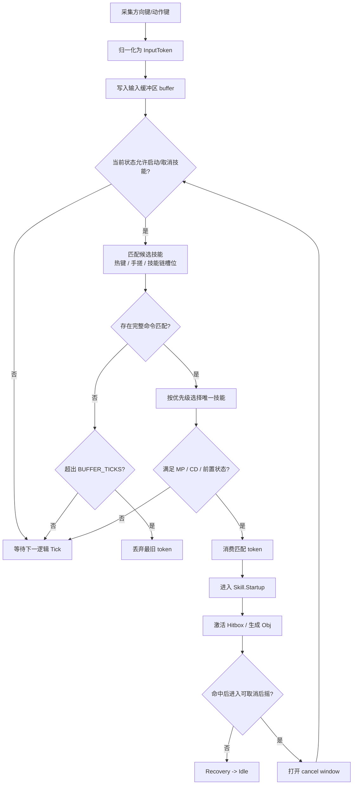

# DNF/DFO 战斗系统复刻技术研究报告

## 执行摘要

这份报告的核心结论是：如果目标是为开发团队准备接近 **1:1 复刻** 的可实施资料，公开互联网中**最高可信**、且可程序化接入的来源，是 Open API、官方更新说明、官方/半官方技能页与社区逆向资料的**组合链路**，而不是单一站点。公开官方接口已经能稳定拿到 `skillId`、技能描述、`coolTime`、`castingTime`、`levelInfo`、`evolution`、`enhancement` 等字段，但**不会直接给出 Hitbox 坐标、完整激活帧/后摇帧/硬直帧**；因此，真正可落地的 1:1 数据集一定要走“**Open API / skill.lst 定位技能 → PVF/SKL 取静态参数 → NUT/SQR 取状态机与取消窗 → ANI/NPK 取动画帧与枢轴 → OBJ/ATK 取攻击信息 → 归一化输出表**”的流水线。官方 API 文档与 DFO World 对 Neople API 的说明都指向这一点。citeturn22view2turn21search1turn20search0

就可公开验证的**客户端实现模型**而言，台服 70 级生态与社区工具已经把技能文件链路暴露得相当清晰：一个主动技能通常由 `skl` 参数文件、`obj` 特效对象、`nut/sqr` 执行脚本、`ani` 动画、`equ` 动作/时装绑定与技能树条目联合构成；参数在运行态会按 `skl -> nut -> dword/po -> obj/atk` 的路径传递，社区示例还能看到 `sq_GetCurrentAttackInfo()`、`sq_SetCurrentAttackBonusRate()`、`onKeyFrameFlag_*`、`onAttack_*`、`sq_HoldAndDelayDie()` 等脚本入口与攻击信息修改函数。与此同时，`pvfUtility` 这类工具已经明确支持 PVF 打开/保存，并在导入/解压时自动处理 `ani` 的加解密。citeturn35search0turn36search1turn36search0turn10view3

就**碰撞与 2.5D 判定**而言，公开资料的最重要观察不是“3D 盒体”，而是“**三轴位置 + 分平面检查 + 非旋转盒体为主**”。PvP 机制页明确说明战场存在 X/Y/Z 三轴，必须沿轴理解技能范围；而工程复刻博客通过“量子爆弹导弹视觉上旋转 45°，但实战判定仍更符合 AABB 而非 OBB”的例子，推导出 DNF 风格技能判定更接近**不随美术旋转而旋转的轴对齐盒**。另一篇实现文进一步指出，许多“看起来像移动 Hitbox”的技能，实际更可能是**多个离散 Hitbox 按动画帧依次激活**，而不是把一个盒子连续平移。citeturn27search0turn29view2turn40view0

就**输入系统、取消、连招**而言，公开资料能确认四个关键事实。第一，手搓输入本质上是“**1~4 个方向键 + 1 个动作键**”，支持 `hold` 形式的方向输入，而且方向键与动作键的组合语法比很多团队想象得更严格。第二，现代技能系统中的“取消窗”通常挂在**后摇阶段**，官方平衡说明经常以 “Can be canceled … during the post-casting delay.” 的形式修改。第三，实际取消成功时，会出现韩服玩家指南反复提到的**绿色残影**反馈。第四，2026 年技能链系统本质上是一个**四技能轮转调度器**，并不是传统格斗游戏意义上的自动连段系统；它还有“再输入技能尚未结束就切到下一个技能”的已知异常行为。citeturn10view8turn24view1turn24view2turn24view4turn24view5turn10view10turn10view9

就**伤害公式**而言，公开可核对、可直接实现的部分主要集中在“经典/100 级前”的主公式。DFO World 的状态页明确给出：**STR/INT 每 250 点对应 100% 伤害增幅**，固定伤害技能走 `Independent Atk.`，元素增伤按 `1 + (your Element Damage + 11 - Enemy's Elemental Resistance)/222` 计算，物理/魔法暴击基础上造成 **50%** 额外伤害。较早的 DFO 社区公式又把 percent/fixed/piercing/additional/crit 分层展开成程序员更容易实现的形式。对 105/110/115 级的现代装备层，公开资料能明确存在 `Atk. Increase`、`Atk. Amp.`、`Overall Damage Increase`、`Convert Abnormal Status Dmg.`、`Final Cooldown Reduction` 等乘区/层级概念，但**完整公开的官方排序与闭式公式并不充分**，实践中应将它们设计为可配置的 runtime multiplier stack，并通过战斗日志回归拟合。citeturn25search1turn14search7turn26search0

最重要的**缺口**也非常明确：公开官方接口和公开技能页**都没有直接给出**“每职业主要技能的判定框坐标/尺寸、完整帧数据、全动作帧表”。因此，这部分如果不接触本地客户端资源与运行时脚本，就只能做到“字段模型 + 提取算法 + 高可信样表”，做不到“全职业、全技能、全坐标、全帧常数”的一次性公开确认。换句话说，本报告能给出**可执行的数据模型、提取路径、公式与样例**；而“全量、全职业精确坐标与帧表”必须标记为 **未确认/需逆向验证**。citeturn22view2turn21search1turn20search0turn25search1

## 来源与合法性

官方一手材料主要来自 entity["company","Neople","game developer"] 与 entity["company","Nexon","game publisher"] 提供的 Open API 和更新说明；代码侧交叉验证则依赖 entity["company","GitHub","code hosting"] 上公开工具与社区逆向仓库。citeturn22view2turn24view1turn24view2turn10view4

| 可信度层级 | 适用内容 | 代表来源 | 语言 |
|---|---|---|---|
| 官方一手 | 技能字段、接口结构、版本更新、取消窗/后摇/范围调整 | Neople Developers API Docs；DFO/韩服官方更新说明 citeturn21search1turn22view2turn24view1turn24view2turn24view4turn24view5 | 英/韩 |
| 半官方整理 | 技能页字段、状态效果、PvP 三轴与保护机制、技能页上的手搓减 MP/减 CD、Attack Range/Distance 等 | DFO World Wiki / 技能页 / 状态页 citeturn25search0turn25search1turn27search0turn27search1turn41search2turn41search5turn41search9 | 英 |
| 社区逆向 | PVF/NUT/SQR/ANI/OBJ 的文件链、脚本函数名、参数传递方式、台服样本文件结构 | 台服 DNF 吧精品贴、阿拉德论坛、pvfUtility、DNF-Porting citeturn35search0turn36search0turn36search1turn10view3turn10view4 | 中/英 |
| 工程推断 | 2.5D 复刻实现、AABB/OBB 推断、多 Hitbox 方案、输入优先级、反向硬直实现 | MakeDNF 系列开发日志 citeturn29view0turn29view1turn29view2turn31view0turn32view0turn33search0turn40view0 | 韩 |

从合规角度看，**官方 Open API、官方更新说明、公开技能页**适合直接进入企业内部知识库与自动化抓取流程；而“台服泄露客户端/双端镜像/私服脚本”虽然在公开互联网与社区中长期流传，并有公开搭建讨论、样本名与工具生态，但其来源显然**不是官方授权公开发行**，因此更适合被视为**内部互操作性验证样本**，而不是可再分发资产。工程上应坚持“**只提取行为与字段，不分发原始资源**”：保留自建 JSON/CSV、自动化测试向量、日志对拍结果，避免把原始 PVF/NPK/ANI/NUT 放进可交付包。citeturn15search8turn15search4turn35search5turn10view3

## 客户端资源与数据模型

### 资源链路与字段映射

公开资料已经足够把“技能从静态配置到运行时命中”的链路拼起来。官方 API 侧，技能详情接口可以提供 `skillId`、`requiredLevel`、`consumeMp`、`coolTime`、`castingTime`、`levelInfo`、`evolution`、`enhancement` 等字段；逆向社区侧，则能补到 `skl`、`nut/sqr`、`obj/atk`、`ani`、`equ` 之间的文件级关联。citeturn21search1turn22view2turn35search0turn10view3

| 层 | 文件/API | 可公开确认的字段/职责 | 复刻用途 |
|---|---|---|---|
| 职业与技能索引 | `/df/jobs`，`/df/skills/:jobId`，`/df/skills/:jobId/:skillId` | `jobId`、`skillId`、`coolTime`、`castingTime`、`levelInfo`、`evolution`、`enhancement` citeturn21search1turn22view2 | 建立全职业 skill registry |
| 技能静态参数 | `skill.lst`、`*.skl` | 技能树挂载、技能等级参数、静态说明；社区教程把 `skl` 视为主动技能的参数文件 citeturn35search0turn35search5 | 读出等级倍率、MP/CD 等基值 |
| 运行时脚本 | `nut/sqr` | 社区教程列出 `onStart`、`onEnd`、`onKeyFrameFlag_*`、`onAttack_*`、`pushState` 等入口citeturn35search0turn36search0 | 提取状态机、取消窗、抓取/强控逻辑 |
| 参数桥接 | `po` / `dword` | `skl -> dword -> po -> obj/atk` 传参，示例中使用 `sq_GetCurrentAttackInfo` 与 `sq_SetCurrentAttackBonusRate` citeturn36search1turn36search2 | 把等级倍率注入命中对象 |
| 命中/特效对象 | `obj` / `atk` | 攻击信息、判定与伤害对象；社区函数表含 `sq_HoldAndDelayDie`、`sq_SetChangeStatusIntoAttackInfo` 等 citeturn36search0 | 生成 hit segment、异常状态、抓取效果 |
| 动画资源 | `ani` + `npk` | 动画帧、帧序、枢轴/偏移；`pvfUtility` 支持自动解密 `ani` citeturn10view3 | 生成 startup/active/recovery 帧表 |
| 动作绑定 | `equ` | 角色动作/时装映射；社区教程把它列为完整技能链的一部分 citeturn35search0 | 解决各职业/武器动作差异 |

### 建议的统一数据对象

为了把官方、英文、韩文、中文与逆向样本统一起来，建议把技能数据拆成四层：

1. **SkillMeta**：职业、技能名、多语种别名、`skillId`、`jobId`、等级区间、CD、施法时间、资源消耗。
2. **SkillState**：`state_id`、`state_name`、进入条件、退出条件、可取消目标、是否可被普通攻击/其他技能打断。
3. **HitSegment**：段号、Hitbox 类型、偏移、尺寸、激活起止帧、攻击属性、抓取/强控/异常状态标签、单段倍率。
4. **MotionProfile**：动画总帧数、关键帧、手搓减 MP/CD、攻速/施放速度缩放规则、武器速度依赖。citeturn22view2turn35search0turn36search0turn41search1

### 批量抽取流水线

下述流程根据官方 API 字段、社区技能脚本结构与动画资源链路综合而成；其中“帧常数”和“精确盒体坐标”必须以后续本地解析结果回填。citeturn22view2turn35search0turn36search0turn10view3

```pseudo
for job in GetJobsFromApi():
    skill_ids = GetSkillsByJob(job.jobId, job.jobGrowId)

    for skill_id in skill_ids:
        meta = GetSkillDetail(job.jobId, skill_id)  // coolTime, castingTime, levelInfo...
        skl_path = ResolveSkillLstOrPvfPath(skill_id)
        skl = ParseSkl(skl_path)

        runtime_scripts = ResolveNutOrSqr(skill_id)
        states = ParseStateMachine(runtime_scripts)
        // detect pushState, onStart, onKeyFrameFlag, onAttack, onEndCurrentAni
        
        ani_refs = ResolveAniRefs(states, skl)
        animations = ParseAniFrames(ani_refs)        // total frame count, frame duration, pivot
        
        attack_objs = ResolveObjAtkRefs(states, skl)
        hit_defs = ParseAtkObjects(attack_objs)      // attack info, status, hold/grab, hit count
        
        segments = Join(states, animations, hit_defs)
        EmitNormalizedRows(meta, states, segments)
```

## 输入系统与连招规则

### 输入语法、消费规则与优先级

公开英文手册已经足够确认手搓输入的基本语法：**通常由方向键序列加一个动作键构成**；最多可注册 **4 个方向键**；也可以注册“长按方向键”的 `hold` 形式；但普通攻击键与跳跃键**不能单独**作为命令输入。这个系统本质上不是“字符串宏”，而是“方向 token + 终结动作键”的有限状态匹配器。citeturn10view8

在工程实现上，**方向输入要单独建模为历史序列，而不能只读当前轴值**。原因很直接：DNF 风格输入允许“按住左，再按右，人物立即向右；松开右后仍向左”；MakeDNF 的实现记录了这一行为，并把它归结为“按轴记录最后一个按下的方向”。这不是官方文档，但它与玩家体感、以及 Unity 默认 `GetAxisRaw` 的问题恰好形成反证，因此适合作为复刻时的默认方向优先策略。citeturn29view1

简化为一句话：**方向键用 last-pressed-wins；技能命令用 exact sequence match；动作键决定命令终止；当前角色状态决定缓冲输入是“立即消费”“延迟消费”还是“过期丢弃”**。其中“全局 buffer 长度常数”在公开资料中**未确认/需逆向验证**，所以不应该硬编码为单一数字，而应做成 per-action/per-state 数据字段。citeturn10view8turn29view1turn24view1

> KR 原文：“좌측 방향키를 누른 상태로 우측 방향키를 누르면 캐릭터가 우측으로 이동한다.”  
> 中文含义：按住左后再按右，角色应立即向右移动。citeturn29view1

### 取消窗与技能链

官方更新说明反复表明，**取消窗通常是技能后摇的一部分，而不是任意时刻都可切**。例如，Female Brawler 的网类技能被修改为“Can be canceled by certain skills during the post-casting delay.”；Inquisitor 的 Purifying Flames 被改为“can now be canceled more quickly during the post-casting delay”；Vagabond 的 Soaring Blade 相关取消也被统一为“during the post-casting delay”。这说明复刻时不要把 `can_cancel=true` 理解成“施法全程可切”，而要把它实现成 **[state, start_frame, end_frame, allowed_targets]** 的数据结构。citeturn24view1turn24view2turn24view5

韩国玩家指南则提供了取消成功的外部反馈信号：取消成功会看到**绿色残影**；如果按住方向键而错过取消时点，角色会在后摇结束后“直接走出去”；实战中玩家还会看剩余冷却是否异常来判断失误。这对复刻团队很重要，因为这类“给玩家确认取消成功的反馈”通常不在数值层，而在 VFX/UI/输入确认层。citeturn10view10turn12search3

> KR 原文：“캐릭터에 초록색 캔슬 성공 잔상이 뜨는거”  
> 中文含义：取消成功时，角色身上会出现绿色残影反馈。citeturn10view10

2026 年新增的技能链系统则更像**调度器**：一个槽位可挂 **最多 4 个技能**；如果技能带“再输入/二段输入”，理论上要等再输入结束才能轮到下一个，但社区已经记录到“当前存在再输入判定中也会跳到下一个技能”的 bug；同时它支持 **0~5 秒** 的优先级显示延迟。也就是说，技能链实现上需要一个**带冷却感知、优先级与再输入锁的轮转器**，而不是简单的“按一次 -> 放下一个”。citeturn10view9turn12search0

### 输入消费状态机

下面这个状态机把上面几条规则压缩成可编码模型：其中特定技能的取消窗、手搓匹配串、手搓收益、技能链轮转顺序都应该是数据表，而不是埋在代码里的 `if-else`。图中的 `BUFFER_TICKS`、`cancel_open_frame` 属于 **未确认/需逆向验证** 字段。上述图式依据官方取消说明、手搓输入语法与社区实测抽象而来。citeturn10view8turn24view1turn24view2turn10view9turn10view10



### 输入与取消伪代码

```pseudo
function update_input_system(now_tick):
    tokens = read_raw_input()                  // direction history + action key
    buffer.push(tokens)

    skill_candidates = []
    for skill in skill_registry:
        if skill.command.matches(buffer) and actor.state.allows_start(skill):
            skill_candidates.append(skill)

    if actor.state.has_cancel_window:
        skill_candidates += actor.state.allowed_cancel_targets

    skill = choose_by_priority(skill_candidates)
    // 推荐优先级：
    // 1) 指定热键直发
    // 2) 技能链调度中的当前槽位技能
    // 3) 手搓命令匹配
    // 注：此顺序是工程建议，精确优先级未公开，需逆向验证

    if skill and resource_ok(skill) and cooldown_ok(skill):
        buffer.consume(skill.command.token_count)
        actor.start_skill(skill)
```

## 2.5D 判定、碰撞、抓取与异常状态

### 三轴命名与空间投影

公开英文 PvP 机制页把 DFO 的战场拆成 **X / Y / Z** 三轴：X 是左右，Y 是地图纵深，Z 是跳跃高度；而韩语工程复刻文常把“地面平面”记为 **XZ**，把跳跃高度记为 **Y**。这不是逻辑冲突，而是命名习惯不同。对开发团队来说，最重要的是**固定一种内部坐标约定**，不要让“深度轴”和“跳跃轴”在策划表、客户端运行时、服务器判定层来回对调。citeturn27search0turn30view0

一个很实用的内部约定是：

- **X**：横向
- **Y**：垂直高度
- **Z**：纵深

然后把屏幕坐标作为投影结果：

\[
screenX = x,\qquad screenY = y + z \cdot k
\]

韩语工程文给出的等价实现是 `ConvertDNFPosToWorldPos(dnfPosition) = (x, y + z * CONV_RATE, 0)`；这正好说明“真正参与判定的是三轴位置，真正参与渲染的是投影视图”。citeturn30view0

### 碰撞算法

对 DNF 风格复刻，最稳妥的方案是**逻辑自管碰撞**，而不是把 2D/3D 引擎 Collider 直接当作权威。原因是：视觉上不重叠的对象，可能只是在“深度轴”错开；如果直接把它们交给 2D 碰撞组件，会产生不必要的碰撞事件。韩语实现文因此采用自定义 Hitbox，并把 Hitbox 最小集合归结为 `Size / Offset / Pivot` 三元组。citeturn29view0

更关键的一点，是**是否旋转 Hitbox**。从“Launcher 量子导弹美术旋转 45°，但实际更符合 AABB 命中”的观察来看，DNF 样式的技能判定更应优先尝试 **AABB（轴对齐包围盒）**，而不是 OBB（有向包围盒）；只有在你拿到反例脚本/资源后，才需要引入 OBB。citeturn29view2

用一句程序员能直接写的规则表示，就是：

1. 先做 **地面平面 AABB** 检查。
2. 再做 **高度轴 gate**。
3. 再做 **状态门**：无敌、霸体、抓取免疫、倒地 Ghost Frame、AlreadyHitTargets。
4. 最后分发 **Hit / Hold / Grab / Status / Knockback**。citeturn10view5turn32view0turn25search0turn27search0

### 单段命中、持续命中与多 Hitbox

公开工程文非常明确地指出：很多攻击不是一个 Hitbox “跟着刀尖移动”，而是**同一技能挂多个离散 Hitbox**，并在不同动画帧里切换激活。文章用 Soul Bender 普攻与 Crescent 类技能举例：同一段攻击可能需要 **2 个** 甚至 **3 个** Hitbox 才能解释真实命中顺序。这个结论对 1:1 复刻尤其关键，因为它直接决定你是维护 `segments[]` 还是维护一个“随动画连续插值移动”的盒体。citeturn40view0

持续判定技能还要有“**已命中目标排重**”机制。另一篇实现文给出的方案是 `AlreadyHitTargets`：当 Hitbox 连续激活多个帧时，1 次性技能不能让目标每帧都受伤；多段与地板类技能则通过 `CalculateOnHit()` 决定是否重新命中。这个结构非常接近 DNF 实战里“持续伤害技能有自己的跳伤间隔，而不是每帧都结算一次”的体验。citeturn32view0

### 抓取、供给/被攻击关系与异常状态优先级

抓取和 Super Armor 的关系，公开资料里有两条很硬的规则。第一，**抓取通常无视 Super Armor**；Status Effects 页明确写到，像 Smasher、Suplex 这样的抓取会忽略霸体并播放抓取动画，只要目标不是抓取免疫。第二，某些技能会有 **Grab Decision** 或 fallback 规则——例如 Atomic Smash 的技能页明确写明：如果目标处于 Super Armor 或抓取免疫，**只结算旋转段伤害**，不进入抓取流程。citeturn25search0turn27search5

异常状态层建议按下面的优先级实现；这不是单纯的“谁覆盖谁”，而是“谁先截断命中结算”：

| 优先级 | 状态 | 推荐实现 | 依据 |
|---|---|---|---|
| 最高 | 无敌 Invincibility | 直接吞掉命中，不进入受击 | Status Effects：无敌不可被命中/受伤；技能页中也常声明“Invincible when cast” citeturn25search0turn24view3 |
| 很高 | 抓取免疫 / 不可抓取 | 抓取失败，若技能有 fallback 仅打非抓取段 | Atomic Smash 的 Grab Decision citeturn27search5 |
| 很高 | 已成功抓取 / Hold Motion | 进入专属控制状态，常屏蔽普通击退 | Blood Snatch / Ice Trap / Hold 类说明 citeturn27search4turn41search6 |
| 高 | Full Super Armor | 受伤但不被击退/击倒/浮空 | Status Effects / Super Armor 页 citeturn25search0turn25search2 |
| 中高 | Breakable Super Armor | 先扣 SA 量表，表空后退化为普通状态 | Status Effects 页citeturn25search0 |
| 中 | Half Super Armor | 仅对远程攻击生效 | Status Effects 页citeturn25search0 |
| 中 | Bind / Slow / Petrify / Freeze / Stun | 叠加为“受控模板”改变移动/动作/受击 | Status Effects 页citeturn25search0 |
| 低 | DoT 类异常 | 挂在状态层，按定时器跳伤 | Status Effects 页citeturn25search0 |

其中 DoT 的公开常数很值得直接抄进配置：

- **Bleeding**：总伤害平均分布到 **3 秒**，每 **0.5 秒** 跳一次。citeturn25search0  
- **Burn**：总伤害分布到 **5 秒**，每 **0.5 秒** 跳一次；并把 **10%** 的灼烧伤害扩散给 **150 px** 内目标。citeturn25search0  
- **Poison**：总伤害分布到 **5 秒**，每 **0.5 秒** 跳一次。citeturn25search0  
- **Shock**：在 **10 秒** 内按“设定次数 × 设定伤害”分发，不是简单平均 tick。citeturn25search0  
- **Rupture**：提高目标承伤，最多 **3 层**，新层会刷新栈计数。citeturn25search0  

### 2.5D 命中判定伪代码

```pseudo
function resolve_hit(attacker, attack_seg, defender):
    if defender.state.invincible:
        return MISS_INVINCIBLE

    if attack_seg.target_id in attack_seg.already_hit and !attack_seg.can_rehit:
        return MISS_ALREADY_HIT

    if !AABB_XZ_Overlap(attack_seg.xz_box, defender.hurtbox_xz):
        return MISS_XZ

    if attack_seg.height_gated and !HeightOverlap(attack_seg.y_box, defender.hurtbox_y):
        return MISS_HEIGHT

    if attack_seg.is_grab:
        if defender.state.grab_immune:
            if attack_seg.has_fallback_damage:
                apply_damage(defender, attack_seg.fallback_profile)
                return HIT_FALLBACK
            return MISS_GRAB_IMMUNE

        defender.enter_hold_or_grab_state(attack_seg.hold_profile)
        attacker.enter_grab_motion(attack_seg.attacker_motion)
        return HIT_GRAB

    if defender.state.super_armor == HALF and attack_seg.attack_attr != RANGED:
        // half SA ignored against melee
        pass
    elif defender.state.super_armor in [FULL, BREAKABLE, HALF]:
        apply_damage_without_knock(defender, attack_seg.damage_profile)
        if defender.state.super_armor == BREAKABLE:
            defender.sa_gauge -= attack_seg.sa_break_value
        return HIT_SUPER_ARMOR

    apply_damage_and_reaction(defender, attack_seg.damage_profile, attack_seg.reaction_profile)
    attack_seg.already_hit.add(defender.id)
    return HIT_NORMAL
```

## 伤害计算公式与属性加成

### 经典主公式与现代乘区的分层实现

如果你的目标是复刻**台服 70 级/老端/100 级前**的战斗核心，那么公开资料已经足以实现一版相当接近的主公式。DFO World 的状态页明确写出：STR/INT 每 250 点相当于 **100%** 伤害提升；Independent Atk. 用于固定伤害技能；元素乘区使用 `1 + (你的属性强化 + 11 - 敌方属性抗性)/222`；物理/魔法暴击的基础倍率是 **1.5x**。r/DFO 的旧公式则进一步把技能百分比、固定伤害、piercing attack、Smash、Crit Damage、Additional Damage 分成可编码的阶段。citeturn25search1turn14search7turn26search0

因此，推荐的“经典主公式”可以写成：

\[
\text{StatMul} = 1 + \frac{\text{STR or INT}}{250}
\]

\[
\text{ElemMul} = 1 + \frac{E + 11 - R}{222}
\]

\[
\text{CritMul} =
\begin{cases}
1.5 \cdot (1+\text{SkillCritBonus}) \cdot (1+\text{CritDamageMod}) & \text{if crit}\\
1 & \text{otherwise}
\end{cases}
\]

\[
\text{BasePercentHit} = s\% \cdot A \cdot \text{StatMul}
\]

\[
\text{BaseFixedHit} = F \cdot \text{StatMul}
\]

\[
\text{RawHit} = (\text{BasePercentHit} + \text{BaseFixedHit}) \cdot \text{ElemMul} + \text{PiercingTerm}
\]

\[
\text{NormalLine} = \text{RawHit} \cdot \text{DefenseMul} \cdot \text{SmashMul} \cdot \prod \text{SkillAtkLayers}
\]

\[
\text{FinalLine} = \text{NormalLine} \cdot \text{CritMul}
\]

这里有一个必须点明的版本差异：**PiercingTerm 放在元素乘区前还是后**，公开资料并不完全一致。r/DFO 的旧公式倾向把 `skill% * piercing attack` 作为元素乘区后的附加项；而 DFO World 的 status 页更偏向按“基础攻击 × 属性/防御/强化选项”的展开方式描述。工程上最稳妥的做法，是给 `piercingPlacement` 做版本开关，并用目标版本日志做回归比对。citeturn14search7turn25search1

### 属性强化、抗性、暴击、Additional Damage

对于属性强化，**最稳的实现公式**仍然是：

\[
\text{ElemMul} = 1 + \frac{E + 11 - R}{222}
\]

这和近年的韩服社区估算式 `(1.05 + 0.0045*속강)` 在数值上是同一类线性近似，只是一个直接面向运行时命中、一个用于装备收益比较。也就是说，复刻引擎可以内部统一用运行时公式，而策划工具层用“前后配置比值”来做收益分析。citeturn25search1turn15search11

对暴击，公开资料给出的核心结论有两条：**物理/魔法暴击独立**，且基础暴击造成 **50%** 额外伤害；旧社区公式再叠上 `skill crit bonus` 与“最高 applicable Crit Damage modifier”。如果目标版本是 100 级前，这套足够直接实现；如果目标版本是 105+/115+，则建议把 Crit Damage 相关乘区也抽象成可配置列表，而不要写死为只有一个 `crit_dmg` 字段。citeturn25search1turn14search7

对 Additional Damage / Bonus Damage / Elemental Additional Damage，旧社区资料把它们定义为**额外伤害线**，即在 normal line 之外再生成一条或多条伤害线。复刻时，不要把它们做成“把总伤害乘上去”的黑盒，而要做成：

```pseudo
extra_line_i = final_normal_line * extra_modifier_i
```

这样才能对应游戏里“主白字 + 多条额外白字/属白”的展示与结算结构。citeturn14search7

### 防御、减伤、穿透与怪物承伤

公开权威来源对于“**防御值如何映射成防御减伤率**”没有给出完整闭式公式；DFO World 只明确说明 Physical Defense / Magical Defense 是“对等等级敌人造成的伤害减免百分比”。因此，复刻时不要把“防御值 -> 减伤率”的换算硬编码在战斗引擎里，而要把引擎设计成接受**已经算好的 `enemy.physDefRate` / `enemy.magDefRate`**。这样你既能兼容老端，也能兼容现代版本。citeturn25search1

“穿透”同理。旧公式里出现过 `piercing attack` 项，但公开资料并没有把现代版本的“防御穿透、抗性穿透、减伤穿透”统一为一个官方闭式。最好的办法，是将它们拆为三个钩子：

- `preDefenseFlat`：防御前附加项
- `defenseIgnoreRate`：忽略部分防御率
- `elementResIgnore`：忽略部分属性抗性

然后在版本配置里决定开启哪些钩子。citeturn14search7turn25search1

### 连击、Hit Stun、Combo Protection 与“连击加成”

这里要特别避免一个常见误判：公开资料中**没有可靠证据表明 PvE 存在一个通用的“全局连击伤害加成系数”**。公开可证的是：

- PvP 存在 **Combo Protection**、伤害上限标记、额外回避、Hit Recovery、Wakeup Ghost Frames。citeturn27search0  
- 某些职业/技能有各自的连击子系统，例如 Hit End、Mirage、Shadow Step 再输入、Muscle Shift、Dry Out。citeturn12search10turn41search2turn41search3turn41search8  
- 现代有技能链调度器，但它不是全局承伤加成。citeturn10view9  

因此，**全局 `comboDamageBonus` 应默认是 1.0**；只有在职业技能、被动、装备、状态（例如 Rupture）明确指定时，才引入额外乘区。若目标版本存在尚未公开的 PvE 连击修正，应标记为 **未确认/需逆向验证**。citeturn27search0turn25search0

### 可执行伪代码

```pseudo
function calc_final_damage(ctx):
    // ctx:
    // version, skillSegment, attackerStats, defenderStats, runtimeMultipliers

    statMul = 1.0 + ctx.mainStat / 250.0
    elemMul = 1.0 + (ctx.elementEnhance + 11.0 - ctx.enemyElementRes) / 222.0
    elemMul = max(elemMul, 0.0)  // 防止极端负抗性/高抗导致负值

    if ctx.skillSegment.damageType == PERCENT_PHYS:
        atkBase = ctx.weaponPhysicalAtk
    elif ctx.skillSegment.damageType == PERCENT_MAG:
        atkBase = ctx.weaponMagicalAtk
    else:
        atkBase = ctx.independentAtk

    basePercent = ctx.skillSegment.skillPct * atkBase * statMul
    baseFixed   = ctx.skillSegment.fixedDamage * statMul

    raw = (basePercent + baseFixed) * elemMul

    if ctx.version.piercingPlacement == POST_ELEMENT:
        raw += ctx.skillSegment.skillPct * ctx.piercingAtk
    else:
        raw = (basePercent + baseFixed + ctx.skillSegment.skillPct * ctx.piercingAtk) * elemMul

    defenseMul = 1.0 - ctx.enemyDefenseRate
    normalLine = raw * defenseMul

    normalLine *= ctx.runtimeMultipliers.smash
    for mul in ctx.runtimeMultipliers.skillAttackLayers:
        normalLine *= mul

    if ctx.isCrit:
        normalLine *= 1.5
        normalLine *= (1.0 + ctx.runtimeMultipliers.skillCritBonus)
        normalLine *= (1.0 + ctx.runtimeMultipliers.critDamage)

    // 105+/115+：保留为可配置层
    for mul in ctx.runtimeMultipliers.modernLayers:
        normalLine *= mul

    extraLines = []
    for extra in ctx.runtimeMultipliers.additionalDamageLines:
        extraLines.append(normalLine * extra)

    dotPackets = []
    for statusConv in ctx.runtimeMultipliers.statusConversions:
        dotPackets.append(convert_to_dot(normalLine, statusConv))

    return normalLine, extraLines, dotPackets
```

## 技能判定与核心动作帧表

### 公开可证的技能样表

先说结论：**公开来源能稳定确认的是“施法时间、CD、手搓收益、范围/距离、Hit 数、取消/再输入、霸体/无敌/抓取说明”**；而**矩形坐标、精确激活帧、持续帧、后摇帧、霸体帧、硬直帧**大多仍要从本地资源和运行时脚本抽取。因此，下表故意把这些无法公开确认的字段直写成 **未确认/需逆向验证**，避免把推测写成事实。citeturn21search1turn22view2turn41search2turn41search5turn41search9

| 职业 | 技能 | 公开可证判定/数值 | 取消/再输入 | 霸体/无敌 | 坐标/帧数据 |
|---|---|---|---|---|---|
| Hitman | Surprise Attack | 即发；CD **7 sec**；**15** 发；基础位移 **300 px**；按下/后键位移 **50 px**；手搓 **MP -2% / CD -1%**；Basic Attack Cancelable citeturn41search9 | 可通过方向键缩短滑行距离 citeturn41search9 | 未见公开无敌常数 | Hitbox 坐标、激活帧、持续帧、后摇帧：**未确认/需逆向验证** |
| Secret Agent | Shadow Step | 即发；CD **20 sec**；最多 **3** 组攻击；连按再输入有效期 **4 sec**；最大索敌范围 **1200 px**；组后无敌 **0.5 sec**；手搓 **MP -4% / CD -2%** citeturn41search2 | 可取消到大量技能；最后一击可让位给其他技能 citeturn41search2 | 每组后有 **0.5 sec** 无敌 citeturn41search2 | 精确盒体/帧：**未确认/需逆向验证** |
| Monk | Wrath of God | 施法 **0.5 sec**；CD **180 sec**；范围 **600 px**；手搓 **MP -5% / CD -5%**；Basic Attack Cancelable citeturn41search5 | “不能被其他技能通过 Dry Out 取消” citeturn41search5 | 未见公开 SA 帧；不可经 Dry Out 再取消 citeturn41search5 | 精确盒体/帧：**未确认/需逆向验证** |
| Male Striker | Dragon Kick | 即发；CD **45 sec**；手搓 **MP -4% / CD -2%**；Basic Attack Cancelable；备注写明“大 X 轴 Hitbox，可打到身后” citeturn41search8 | 落地后可接 Muscle Shift 取消；Arena 中不可取消 citeturn41search8 | 未见公开无敌常数 | 精确盒体坐标与落地取消帧：**未确认/需逆向验证** |
| Glacial Master | Ice Trap | 即发；CD **20 sec**；束缚概率 **100%**；手搓 **MP -4% / CD -2%**；Basic Attack Cancelable citeturn41search6 | 连打攻击键可提高多段攻击速度 citeturn41search6 | Airborne 状态被 Hold 时会落地 citeturn41search6 | 精确盒体/帧：**未确认/需逆向验证** |
| Demon Slayer | Bleeding Blades | 即发；CD **20 sec**；基础多段 **10**、连打后 **14**；手搓 **MP -4% / CD -2%**；Basic Attack Cancelable citeturn41search7 | 多段期间可按 Jump 取消技能 citeturn41search7 | 未见公开无敌常数 | 多段节拍与各段盒体：**未确认/需逆向验证** |
| Skirmisher | Ground Seeker | 即发；CD **6 sec**；地面举升强度 **490%**；对倒地敌人的举升强度为基础的 **70%**；Basic Attack Cancelable citeturn41search0 | 可在走路、冲刺、普攻、其他技能中使用 citeturn41search0 | 未见公开无敌常数 | 命中框与举升帧：**未确认/需逆向验证** |
| Avenger | Demonize | 施法 **0.5 sec**；CD **200 sec**；变身持续 **50 sec**；Demon Guard 伤害减免 **90%**；手搓 **MP -5% / CD -5%**；Basic Attack Cancelable citeturn41search4 | 变身后替换普攻/跳攻/冲刺攻等动作 citeturn41search4 | 变身时“temporarily makes you Invincible” citeturn41search4 | 变身前后动作帧：**未确认/需逆向验证** |
| Berserker | Blood Snatch | 即发；CD **30 sec**；手搓 **MP -4% / CD -2%**；Basic Attack Cancelable citeturn27search4 | 前键可突进抓取 citeturn27search4 | 施放时有 SA；成功抓取后，爆炸期间与稍后一小段时间无敌 citeturn27search4 | 抓取判定框与爆炸 active frames：**未确认/需逆向验证** |

另有一些“范围变化”可以直接灌进配置而不必逆向。例如 Female Brawler 的 Explosive Hook 在职业更新后把**爆炸范围百分比固定为 100%**，Mount 也把**冲击波范围固定为 100%**，并把爆炸/冲击波的尺寸增长改成复利/复合行为；这类数值非常适合当成技能成长表的 patch diff。citeturn24view4

### 关键动作与动作帧的可抽取模板

下面这张表不是“已经确认的全动作帧常数”，而是**面向提取器的动作帧模板**。现有公开资料能确认“Jump 至少分为预备、上升、下降、落地后延迟四相”“普通攻击可以是带连击输入的多状态技能”“命中时会有逆硬直/受击中断”等，但**精确帧数**仍要依赖 ANI 与脚本关键帧抽取。citeturn29view1turn31view0turn33search0

| 动作 | 可公开确认 | 提取规则 | 当前公开值 |
|---|---|---|---|
| 移动 Move | 输入层要求维护方向历史；相反方向最后按下者优先 citeturn29view1 | 起步帧 = 第一个速度非零的动画/逻辑帧；停止帧 = 速度回零帧 | **未确认/需逆向验证** |
| 跳跃 Jump | JumpBehaviour 被拆成 `PreDelay -> JumpUp -> JumpDown -> PostDelay` 四相 citeturn8search8 | 分四段从 ANI/状态机导出 | 相位存在已确认；精确帧值 **未确认** |
| 普攻 Basic Attack | 可能是连点输入型多段技；示例把普攻做成最多 3 连状态 citeturn31view0 | 每一段单独导出 startup/active/recovery | **未确认/需逆向验证** |
| 技能施放 Cast | 官方能直接给 `castingTime`，很多技能标注 Instant Cast / 0.5 sec / 0.7 sec 等 citeturn25search2turn41search4turn41search5 | `cast_frames = castingTime * logic_tick_hz` | `logic_tick_hz` **未确认** |
| 命中/逆硬直 Hit / Hitstop | 公开工程文说明：有些近战本体判定技能会发生“命中时攻击者短暂停顿”；某些生成对象型技能则不一定如此 citeturn33search0 | 从 `onAttack_*` + 动画速度冻结/暂停时长导出 | **未确认/需逆向验证** |
| 受击 Hit Reaction | 工程实现中 OnDamage 会取消当前行为并切到 hit 行为；Super Armor/Invincible 改写该流程 citeturn32view0turn25search0 | 由 hurt animation + reaction profile 导出 | **未确认/需逆向验证** |
| Buff / 变身 | 官方可确认 castingTime、持续时间、部分无敌/霸体说明 citeturn41search4turn25search2 | 起手帧/无敌窗从技能页+脚本补齐 | 部分秒数已确认；帧值 **未确认** |
| Death / Weapon Switch | 本次检索中未见公开同源精确帧表 | 必须依赖客户端动画脚本导出 | **未确认/需逆向验证** |

### 运行时帧抽取建议

社区的 `sqr` / `nut` 函数表里已经暴露出抽取帧表最关键的几个 runtime hook：`obj.sq_GetCurrentAni`、`obj.sq_GetCurrentFrameIndex`、`sq_GetCurrentTime`、`onKeyFrameFlag_*`、`onAttack_*`。这意味着你完全可以在本地测试客户端里做**运行时日志注入**，把“某技能某状态在第几帧打开了命中、取消、抓取、霸体、动画结束”记录成 CSV。这个方法对“官方没公开、网页也没有”的帧级数据尤其有效。citeturn36search0

```pseudo
on_skill_state_tick(obj):
    ani   = obj.sq_GetCurrentAni()
    frame = obj.sq_GetCurrentFrameIndex()
    time  = sq_GetCurrentTime(ani)

    log_state(obj.skill_id, obj.state_id, ani.name, frame, time)

onKeyFrameFlag_*(obj, flag):
    log_keyflag(obj.skill_id, obj.state_id, obj.frame, flag)

onAttack_*(obj, target):
    attackInfo = sq_GetCurrentAttackInfo(obj)
    log_attack(obj.skill_id, obj.state_id, obj.frame, attackInfo, target.id)
```

## 可导入数据样例与复刻建议

### JSON 样例

下面的样例刻意把“公开可证”的字段填实，把“必须本地抽取”的字段置为 `null` 或“未确认/需逆向验证”。在团队协作时，这种写法比“先拍脑袋填值，后面再改”更可控，也更利于自动比对与回归。样例中的技能数值取自公开技能页与官方更新说明。citeturn41search2turn41search5turn41search9turn27search4

```json
{
  "schema_version": "dnf-combat-v1",
  "job": {
    "name_zh": "特工",
    "name_en": "Secret Agent",
    "name_ko": "시크릿 에이전트",
    "job_id": "UNCONFIRMED_LOCAL_ALIAS"
  },
  "skill": {
    "name_zh": "暗月秘步",
    "name_en": "Shadow Step",
    "name_ko": "암월비보",
    "skill_id": "UNCONFIRMED_NEOPLE_SKILL_ID",
    "cast_type": "instant",
    "casting_time_ms": 0,
    "cooldown_ms": 20000,
    "command_bonus": {
      "mp_cost_delta_pct": -4.0,
      "cooldown_delta_pct": -2.0
    },
    "reinput_window_ms": 4000,
    "target_search_range_px": 1200,
    "post_set_invincible_ms": 500,
    "flags": {
      "basic_attack_cancelable": true,
      "can_cancel_into_other_skills": true,
      "is_grab": false
    }
  },
  "states": [
    {
      "state_id": "startup",
      "startup_frames": "未确认/需逆向验证",
      "cancel_window": null
    },
    {
      "state_id": "set_1",
      "active_frames": "未确认/需逆向验证",
      "reinput_accepts": true,
      "cancel_to": [
        "Black Crescent",
        "Rabbit Punch",
        "Consecutive Shots"
      ]
    }
  ],
  "hit_segments": [
    {
      "segment_index": 0,
      "box_shape": "rect",
      "offset_xyz": [null, null, null],
      "size_whd": [null, null, null],
      "attack_attr": "slash_or_null_unconfirmed",
      "hit_count": 2,
      "super_armor_frames": "未确认/需逆向验证",
      "hard_stun_frames": "未确认/需逆向验证"
    }
  ],
  "confidence": {
    "public_fields": "high",
    "box_coords": "unconfirmed",
    "frame_data": "unconfirmed"
  }
}
```

### CSV 样例

```csv
job_zh,job_en,skill_zh,skill_en,skill_ko,cast_type,casting_time_ms,cooldown_ms,command_mp_delta_pct,command_cd_delta_pct,range_px,move_distance_px,reinput_window_ms,segment_index,box_type,offset_x,offset_y,offset_z,width,height,depth,startup_frames,active_start_frame,active_end_frame,recovery_frames,cancel_open_frame,cancel_close_frame,superarmor_start_frame,superarmor_end_frame,invincible_start_frame,invincible_end_frame,status,source_confidence
枪剑士(男),Hitman,奇袭打击,Surprise Attack,기습타격,instant,0,7000,-2,-1,,300,,0,rect,,,,,,,未确认/需逆向验证,未确认/需逆향验证,未确认/需逆向验证,未确认/需逆向验证,未确认/需逆向验证,未确认/需逆向验证,未确认/需逆向验证,未确认/需逆向验证,未确认/需逆向验证,未确认/需逆向验证,public-partial
枪剑士(男),Secret Agent,暗月秘步,Shadow Step,암월비보,instant,0,20000,-4,-2,1200,,4000,0,rect,,,,,,,未确认/需逆向验证,未确认/需逆向验证,未确认/需逆向验证,未确认/需逆向验证,未确认/需逆向验证,未确认/需逆向验证,未确认/需逆向验证,未确认/需逆向验证,0,500,public-partial
圣职者(男),Monk,神之愤怒,Wrath of God,신의 분노,cast,500,180000,-5,-5,600,,,0,rect,,,,,,,未确认/需逆向验证,未确认/需逆向验证,未确认/需逆向验证,未确认/需逆向验证,未确认/需逆向验证,未确认/需逆向验证,未确认/需逆向验证,未确认/需逆向验证,未确认/需逆向验证,未确认/需逆向验证,public-partial
鬼剑士(男),Berserker,血气掠夺,Blood Snatch,블러드 스내치,instant,0,30000,-4,-2,,,,0,grab,,,,,,,未确认/需逆向验证,未确认/需逆向验证,未确认/需逆향验证,未确认/需逆向验证,未确认/需逆向验证,未确认/需逆向验证,cast,until_grab_or_end,grab_success,during_explosion_plus_short_after,public-partial
```

### 复刻落地建议

如果团队要把这份资料真正变成“可直接使用”的工程资产，建议按下面的顺序落地：

首先，把**公开接口与公开技能页**做成一个“高可信元数据层”。它至少要覆盖 `jobId / skillId / coolTime / castingTime / levelInfo / command bonus / public range`。这一层可以每天重抓，成本低，也合法。官方文档已经给了接口结构、鉴权方式、每秒 **500** 次调用额度和 `GET` 调用方式。citeturn22view2turn20search3

其次，把 `PVF/SKL/NUT/SQR/ANI/OBJ/ATK` 的本地解析器做成**离线导出器**，不要直接让线上逻辑依赖原始客户端文件。离线导出后，运行时只吃己方定义的 JSON/CSV/二进制表。这样既能做版本冻结，也能降低合规压力。社区资料已经说明这条链路是存在的，而且 `ani`、`onKeyFrameFlag`、`sq_GetCurrentFrameIndex` 这类字段足以支撑全动作帧表与取消窗导出。citeturn10view3turn35search0turn36search0

再次，把公式层做成**版本化 multiplier stack**。经典版可以直接放进明确公式；现代版则把 `Atk Increase / Atk Amp / Overall Damage Increase / Convert Abnormal Status Damage / Cooldown Recovery` 设计成表驱动乘区。这样当你以后需要对接 70 级老端、100 级旧公式、110+ 新系统时，不需要重写整个战斗引擎。citeturn25search1turn26search0

最后，把以下字段在仓库中统一标成 **未确认/需逆向验证**，直到本地对拍完成为止：**每技能每段 Hitbox 坐标、逻辑 tick 频率、动作总帧数、startup/active/recovery 帧、霸体帧、硬直帧、通用输入 buffer 长度、武器切换锁帧、死亡动作锁帧**。这些字段之所以必须保留“未确认”标签，不是因为它们不重要，而是因为在本次公开检索所能引用的官方/半官方来源中，它们**没有被直接公开**。citeturn22view2turn21search1turn25search1

综合来看，最接近“1:1 复刻”的现实路线，不是等待某个现成全量表，而是采用**官方元数据 + 社区逆向脚本链 + 本地运行时打点**的三层法：前两层保证结构正确，最后一层把关键帧与命中框补齐。对 DNF/DFO 这种长期演化、职业众多、取消窗经常被改在“后摇阶段”的动作 MMO 来说，这也是唯一兼顾精确度、可维护性与可交付性的方案。citeturn24view1turn24view2turn24view4turn24view5turn27search0turn35search0turn36search0