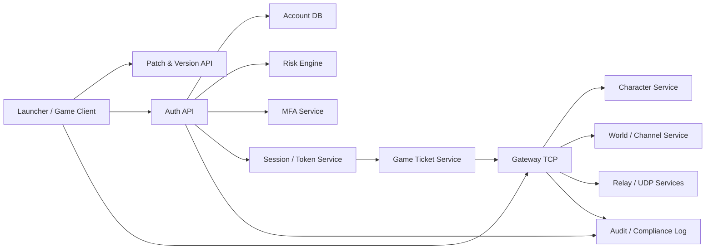
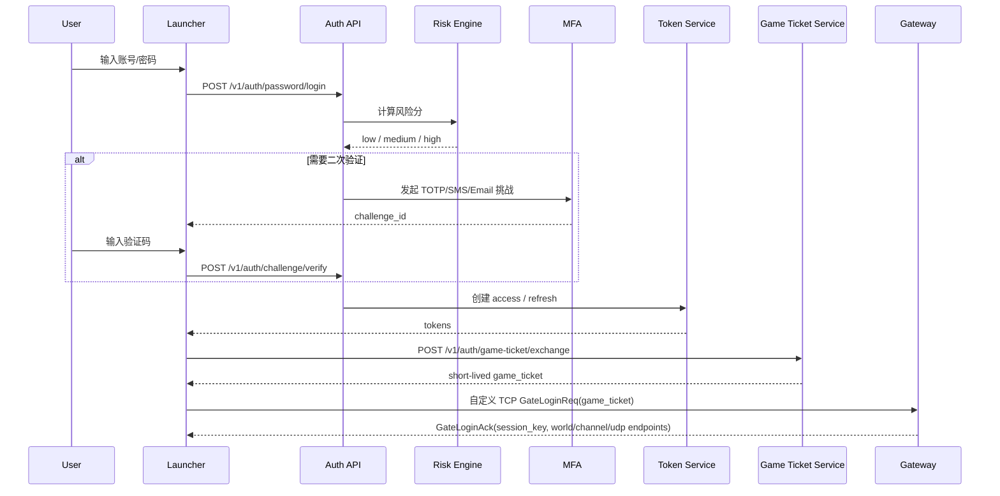
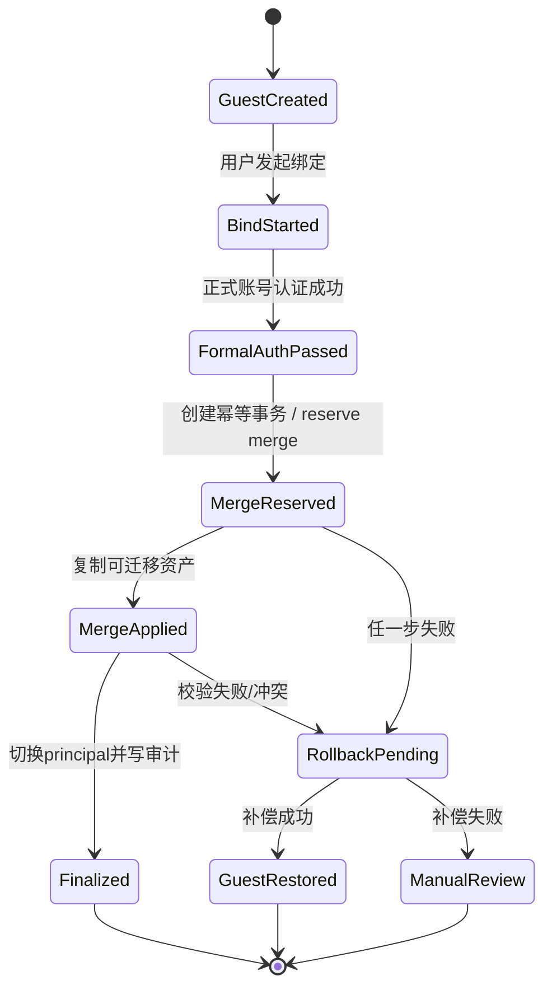
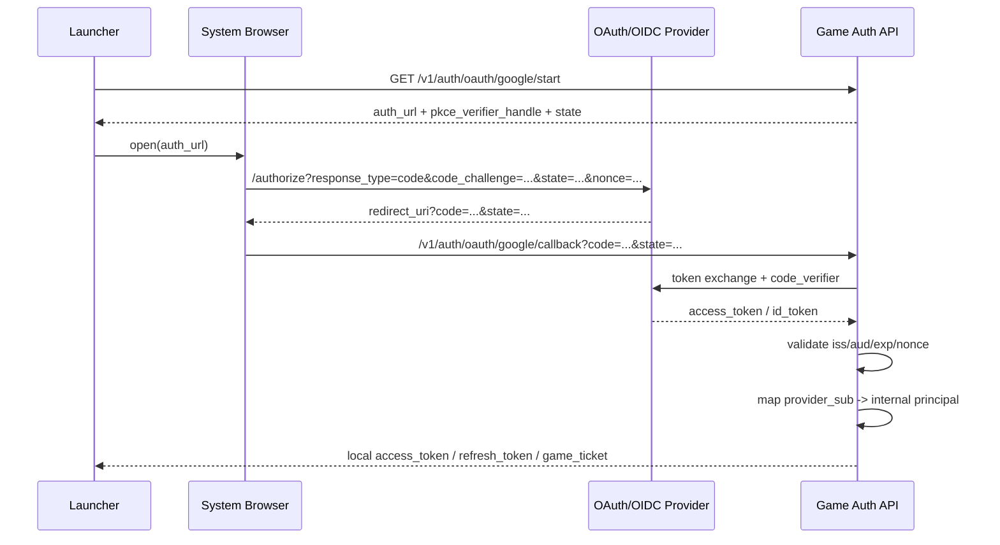
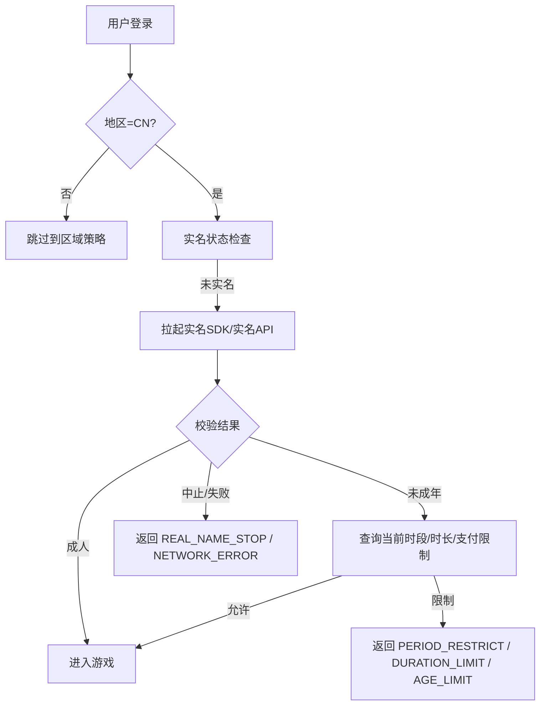
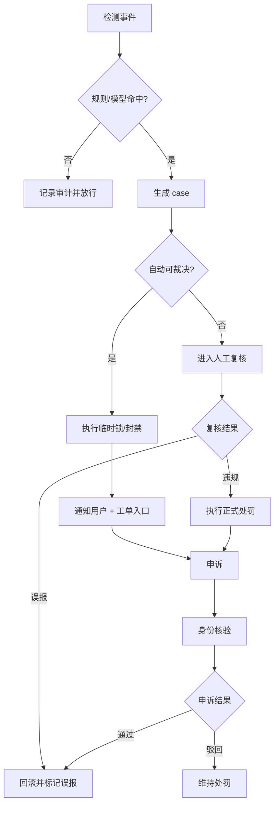
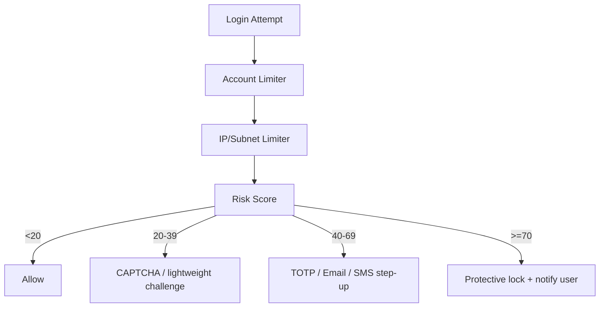

# DNF／DFO风格账号与登录子系统深度研究报告

## 执行摘要

本报告把“**可公开证实的 DNF/DFO 事实**”与“**可直接指导实现的 clean-room 重建设计**”严格分开。公开官方资料能够证实：国际服安全中心长期使用 Google Authenticator、二次密码／Goblin PIN 一类的二次验证；韩区账号体系则由 entity["company","Nexon","game publisher"] 保安中心提供 OTP、登录历史、信任设备、海外登录阻断等能力；中国大陆现行规则要求网络游戏接入实名与防沉迷，并禁止未实名或游客模式进入在线游戏；公开逆向/私服生态材料则反复出现 `start.dnf.tw`、`publickey.pem`、`dxf.exe` 启动参数凭据、`d_taiwan.accounts` 查询、以及分离的 TCP/UDP 频道与组队/中继端口等线索。citeturn16search0turn16search1turn32search1turn32search2turn32search11turn32search16turn8search4turn41view0turn42view0turn35view0

因此，若目标是“**1:1 复刻相似体验**”，最可行的做法不是照搬泄露实现，而是采用一套**协议边界相似、分层架构相似、登录/进服体验相似、风控与合规能力现代化**的 clean-room 方案：Launcher 负责补丁与前置登录，Auth API 负责注册、密码验证、风控与会话签发，Game Ticket Service 负责把 Web 会话换成极短时效的游戏门票，Gateway 则负责 TCP/UDP 入场、角色服跳转与会话续约；密码存储使用 Argon2id，refresh token 采用 rotation，第三方登录坚持 Authorization Code + PKCE + OIDC nonce/state，二次验证支持 TOTP/短信/邮箱/设备可信任，所有封禁、申诉与实名限时都进入统一审计模型。citeturn14search0turn18view0turn18view1turn19view1turn14search2turn14search3turn24search1turn21view2

需要特别强调三点。第一，**大陆版与国际版/韩台版不能共用游客策略**：2019 年通知仍允许“游客体验模式”，但 2021 年进一步收紧后，在线游戏必须实名注册与登录，且不得以任何形式向未实名账号提供服务；这意味着大陆版“游客绑定正式账号”只能保留为**本地设备占位态**，而不能作为可联网可游玩的真实账户态。第二，韩国公开制度重心已从强制熄灯制转向“游戏时间选择制”和身份核验能力；台湾公开制度则更强调分级、定型化契约与个资保护，而不是公开统一国家防沉迷接口。第三，泄露客户端、私钥、PVF、补丁和私服服务端都具有明显的版权、商业秘密和服务条款风险，本报告只抽取其**公开页面可见的路径、主机名、配置字段与行为模式**作为 clean-room 观察材料，不提供下载、替换、直连或实装私钥的操作方案。citeturn8search1turn8search4turn10search0turn10search2turn27search4turn27search6turn11search1turn13search0turn13search6turn12search0turn7search6turn42view0turn35view0

下文为了把实现细节说清楚，默认示例技术栈为：**C# Launcher + HTTP/JSON Auth API + PostgreSQL 16 + Redis 7 + NGINX/TLS + 可选 gRPC 内部服务**。这只是讲解载体，不构成强制技术选型。

## 证据边界与 clean-room 复刻方法

本次检索的证据可分为四层。第一层是**规范与官方原始资料**：IETF RFC、NIST、OWASP、国际服 DFO 官网页面、中国大陆监管通知、韩国法规/部委公开材料、台湾法规与政府公开制度说明。这一层可信度最高、法律风险最低，应该作为架构和安全基线。第二层是**官方 SDK/渠道接入文档**，例如 entity["company","TapTap","game platform"] 与 entity["company","华为","technology company"] 的实名认证/防沉迷开发文档，它们通常不会暴露底层监管接口，但会给出真实产品字段、回调码、集成顺序与支付限制检查方式，适合作为“公开可落地字段模型”。第三层是**公开 clean-room/逆向仓库**，包含公开托管在 GitHub 的台服登录器和私服后台项目，它们提供了 `analysis.md`、`publickey.pem`、`start.dnf.tw`、`dxf.exe`、`Script.pvf`、`df_game_r`、`d_taiwan.accounts` 等线索，但不应被当成正式服权威文档。第四层是**博客/论坛**，它们能辅助印证文件路径、端口、配置项命名，但法律和可信度都最低，只能当作“旁证”，不能直接复制实现。citeturn14search0turn18view0turn20search0turn7search6turn8search4turn10search0turn12search0turn29view1turn28search0turn42view0turn41view0turn35view0

公开逆向材料能相对稳定地证实几件事：一是台服/私服生态常把 `start.dnf.tw` 做 hosts 重定向；二是登录器项目中公开携带 `publickey.pem`，并把一段 **344-byte 的 base64 凭据** 交给 `dxf.exe` 作为登录参数；三是 `analysis.md` 明确写到从 `d_taiwan.accounts` 按 `accountname` 与 `password` 查找账户，“密码是 MD5”，拿到账户 `uid` 后再加固定后缀做 RSA，最后把加密字符串作为连接凭据。与此同时，独立博客中又能看到 `channel.cfg`、`game/cfg/cain0x.cfg`、`udp_ip_of_hades`、`ipg_ip`、`relay_ip`、`stun_ip`、`tcp_port`/`udp_port`、以及 `31001/9006/7200/2311-2313` 这类联机与中继端口配置名称。对工程实现来说，这足够说明：**账号层、网关层、频道层、组队/中继层是分开的**；但它仍不足以权威证明正式服当前线上真实包号、真实签名算法、真实票据字段与真实风控规则。citeturn42view0turn41view0turn35view0

因此，推荐的 clean-room 方法不是“照着源码敲”，而是采用“**行为抽象** → **契约重写** → **安全替换**”三段式。具体做法是：先把公开材料里已经暴露的**行为边界**记成抽象需求，例如“Launcher 需要把 Web 登录换成短期游戏凭据”“Game Gateway 需要接受 TCP 入口并告知 UDP/relay 信息”“角色/频道登录与 Web 会话是解耦的”；然后由另一组开发者按照现代安全规范把这些边界重写成自有协议与表结构；最后把所有旧实现中明显不安全的做法，例如 MD5 密码比对、静态私钥长期驻留客户端目录、host 文件重写、宽松端口暴露，全部替换为 Argon2id + TLS + 设备级短期 ticket + 服务器端校验。这样做既能保留 DNF/DFO 风格登录体验，也能显著降低版权与安全风险。citeturn42view0turn14search0turn25view3turn26view0turn18view1

下面的系统设计默认遵守这个原则：**凡是写成“观察到/公开材料显示”的，都是证据层；凡是写成“建议/推荐/示例”的，都是 clean-room 重建设计**。

## 账号注册、登录、会话与游客绑定

### 总体架构

公开材料显示，老式 DNF/DFO 风格的账号入口通常不是“浏览器网页登录后游戏自然继承”，而是“**Launcher/登录器先做版本与认证，再把一个短时凭据交给游戏进程和网关**”。结合国际服官方安全页面与公开逆向线索，最稳妥的重建设计是：Launcher 负责补丁、版本与首次登录；Auth API 完成密码认证、风险评分、二次验证与 access/refresh token；Game Ticket Service 把 Web 登录态换成极短时效的 game ticket；Gateway 只认 ticket，不直接认密码；Character/World/Channel 服务只认 gateway 下发的 session key。这样既符合 DNF/DFO 体验，也符合现代口令、会话与最小暴露面原则。citeturn16search0turn16search1turn42view0turn41view0turn18view1turn19view1



### 标准登录流程

公开标准的会话规范要求：密码验证必须运行在受保护信道内，session secret 必须随机、强熵、不可放进 URL，refresh token 要么 sender-constrained，要么采用 rotation；而 DFO 官方安全页又给出了一个很有参考价值的用户摩擦阈值——二次验证连续失败 5 次后限制 5 分钟。将这两类证据合并，比较适合 DNF/DFO 风格 PC 客户端的方案是：**密码登录 → 可能触发 step-up → 签发 5 分钟 access token + 30 天单次轮换 refresh token + 30 秒 game ticket**；同一账户允许多终端保留少量 refresh session，但同时只允许 1 个活跃 game session。citeturn18view1turn19view1turn19view0turn17search3turn16search1



### 密码存储与加密算法

NIST 明确要求口令 verifier 使用**带盐、单向、抗离线攻击**的 KDF，优先选择 memory-hard 函数；RFC 9106 把 Argon2 规范化；OWASP 则给出了可直接落地的最低建议：**Argon2id，至少 19 MiB 内存、迭代 2、并行度 1**。同时，NIST 不再建议强制复杂度规则，而要求最少 8 位、建议允许到 64 位、支持 Unicode、禁止静默截断、在线认证必须限速，并对弱口令/已泄露口令做黑名单检查。也就是说，真正适合现代 DNF/DFO 风格系统的口令层，不应该复刻公开逆向材料中提到的 MD5 查询，而应在 clean-room 实现里把它作为**历史兼容的迁移路径**，不是事实标准。citeturn25view0turn25view3turn14search0turn26view0turn42view0

建议的落地规则如下：
第一，新增口令统一存成 PHC string，例如 `$argon2id$v=19$m=19456,t=2,p=1$...`；第二，可选 pepper 放在 HSM 或 secrets vault，绝不和用户表放在同库；第三，若必须兼容历史散列，则只保留短期 `legacy_hash_alg` 与 `legacy_hash`，用户下次成功登录后立即重算 Argon2id 并擦除旧散列；第四，所有登录 API 只接受 TLS，客户端绝不自行“先 MD5 再上传”替代 TLS。后者在历史游戏生态里很常见，但并不能替代传输层保护。citeturn26view0turn25view3turn18view1

```sql
-- PostgreSQL 16 示例
CREATE TABLE accounts (
    account_id           BIGSERIAL PRIMARY KEY,
    principal_id         UUID NOT NULL UNIQUE,      -- 稳定主体ID / stable subject / 韩: 안정적 주체 ID (稳定主体ID)
    account_type         SMALLINT NOT NULL,         -- 0=guest 1=regular 2=oauth_only
    state                SMALLINT NOT NULL DEFAULT 1, -- 1=active 2=locked 3=banned 4=deleted
    region_code          VARCHAR(8) NOT NULL,
    display_name         VARCHAR(32),
    email                VARCHAR(320),
    email_verified       BOOLEAN NOT NULL DEFAULT FALSE,
    phone_e164           VARCHAR(20),
    phone_verified       BOOLEAN NOT NULL DEFAULT FALSE,
    created_at           TIMESTAMPTZ NOT NULL DEFAULT now(),
    updated_at           TIMESTAMPTZ NOT NULL DEFAULT now()
);

CREATE TABLE account_credentials (
    credential_id        BIGSERIAL PRIMARY KEY,
    account_id           BIGINT NOT NULL REFERENCES accounts(account_id),
    credential_type      VARCHAR(16) NOT NULL,      -- password/totp/email_otp/sms_otp
    password_phc         TEXT,                      -- Argon2id PHC string
    pepper_key_version   SMALLINT,
    legacy_hash_alg      VARCHAR(16),               -- md5/sha1/bcrypt_legacy 等迁移占位
    legacy_hash_value    TEXT,
    password_changed_at  TIMESTAMPTZ,
    compromised_at       TIMESTAMPTZ,
    UNIQUE(account_id, credential_type)
);

CREATE TABLE account_sessions (
    session_id           UUID PRIMARY KEY,
    account_id           BIGINT NOT NULL REFERENCES accounts(account_id),
    session_family_id    UUID NOT NULL,
    access_jti           UUID NOT NULL UNIQUE,
    refresh_nonce        UUID NOT NULL UNIQUE,
    refresh_token_hash   BYTEA NOT NULL,
    device_id            VARCHAR(128) NOT NULL,
    device_trust_level   SMALLINT NOT NULL DEFAULT 0, -- 0 unknown / 1 remembered / 2 trusted
    client_type          VARCHAR(16) NOT NULL,        -- launcher/web/mobile
    ip_addr              INET NOT NULL,
    user_agent           TEXT,
    issued_at            TIMESTAMPTZ NOT NULL,
    access_expires_at    TIMESTAMPTZ NOT NULL,
    refresh_expires_at   TIMESTAMPTZ NOT NULL,
    rotated_from         UUID,
    revoked_at           TIMESTAMPTZ,
    revoked_reason       VARCHAR(32)
);
```

上面三张表已经足够承载正式账号、游客账号、会话轮换、历史散列迁移与设备级会话治理。对于 Argon2id 验证，推荐在服务端按“**新哈希优先，历史哈希兜底，然后立刻升级**”处理。

```python
from argon2 import PasswordHasher
import hashlib

ph = PasswordHasher(memory_cost=19 * 1024, time_cost=2, parallelism=1)

def verify_and_upgrade(cred_row, plaintext: str) -> tuple[bool, str | None]:
    """
    返回 (是否通过, 新PHC字符串或None)
    """
    if cred_row.password_phc:
        try:
            ph.verify(cred_row.password_phc, plaintext)
            if ph.check_needs_rehash(cred_row.password_phc):
                return True, ph.hash(plaintext)
            return True, None
        except Exception:
            return False, None

    # 遗留兼容路径：只在迁移窗口保留
    if cred_row.legacy_hash_alg == "md5":
        if hashlib.md5(plaintext.encode("utf-8")).hexdigest() == cred_row.legacy_hash_value:
            return True, ph.hash(plaintext)
    return False, None
```

### 访问令牌、刷新令牌与多设备策略

NIST 把 session management 视为与认证同等重要的强项，OWASP 要求 idle timeout、absolute timeout 和服务器端失效；RFC 9700 则要求 public client 的 refresh token 采用 sender-constraining 或 rotation。把这些要求应用到游戏登录，推荐参数为：**access token 5 分钟、refresh token 30 天、idle 超时 14 天、绝对超时 30 天、每次 refresh 必须换发新 refresh token、旧 token 立即失效**；一旦检测到 refresh replay，就吊销整条 `session_family_id`。Web/Launcher 可以同时保持最多 3 个活跃 refresh session；但 Gateway 层只允许 1 个 `active_game_session`，重复登录时执行“新登录生效，旧游戏会话进入 15 秒保存/踢线窗口”。citeturn18view1turn21view2turn19view1turn19view2

### 游客账号与正式账号绑定

公开中国大陆规则已经使“真正可玩的游客账号”在大陆版基本失去合规空间，但国际版、韩台版以及企业内部测试环境仍可以保留 guest→formal 升级。因此，这一模块应该做成**可按区服/发行区域开关的策略模块**。推荐把游客账号设计成“**同样拥有 `accounts` 记录，但没有可充值资格、没有外部身份绑定、没有高价值资产、并带 auto-expire**”；绑定的本质是把 `guest principal` 的可迁移资产并入 `regular principal`，而不是简单改主键。大陆版若必须保留“游客”入口，则只能保留为**设备本地临时档案**，在实名或正式登录完成前不允许进入在线世界服。citeturn8search1turn8search4



关键点不在“绑定按钮”，而在**冲突、回滚与幂等**。推荐规则如下。
其一，`guest_bind_txn.idempotency_key` 由客户端生成，服务器强唯一；重复提交直接返回同一结果。
其二，自动合并只合并**软资产**：教程进度、设置、非稀缺绑定道具、低价值货币、成就标记；对角色、角色名、公会、拍卖、邮件、付费货币采用**默认不自动合并**策略。
其三，如果 guest 与 formal 都已有角色，则进入 `REVIEW_REQUIRED`，由后台工具发起定向迁移；不要尝试“自动角色合并”。
其四，整个过程必须记录 `merge_plan_json` 和 `rollback_cursor`，这样任何一步失败都能补偿。
其五，正式账号一旦绑定成功，guest principal 应立刻冻结可登录能力，只保留审计可追溯性。

```sql
CREATE TABLE guest_bind_txn (
    bind_txn_id          UUID PRIMARY KEY,
    idempotency_key      UUID NOT NULL UNIQUE,
    guest_account_id     BIGINT NOT NULL REFERENCES accounts(account_id),
    target_account_id    BIGINT NOT NULL REFERENCES accounts(account_id),
    state                VARCHAR(24) NOT NULL, -- STARTED/AUTHED/RESERVED/APPLIED/FINALIZED/ROLLED_BACK/REVIEW_REQUIRED
    merge_plan_json      JSONB NOT NULL,
    rollback_cursor      JSONB,
    conflict_flags       JSONB,
    requested_at         TIMESTAMPTZ NOT NULL DEFAULT now(),
    finalized_at         TIMESTAMPTZ
);

CREATE UNIQUE INDEX uq_guest_bind_once
ON guest_bind_txn(guest_account_id)
WHERE state IN ('RESERVED','APPLIED','FINALIZED');
```

可直接落地的绑定 API 示例：

```http
POST /v1/auth/guest/bind/start
Content-Type: application/json
Authorization: Bearer <guest_access_token>

{
  "idempotencyKey": "8f0c9d66-9e18-4fd6-8fb1-7f7df253d6b7", // zh-CN: 幂等键 | en: idempotency key | 韩: 멱등 키 (幂等键)
  "targetLoginId": "alice@example.com",                    // zh-CN: 目标正式账号登录ID | en: target formal account login ID | 韩: 대상 정식 계정 로그인 ID (目标正式账号登录ID)
  "targetPassword": "********",                            // zh-CN: 目标账号密码 | en: target account password | 韩: 대상 계정 비밀번호 (目标账号密码)
  "mergePolicy": "SAFE_ONLY"                               // zh-CN: 仅安全资产自动合并 | en: merge safe assets only | 韩: 안전 자산만 자동 병합 (仅安全资产自动合并)
}
```

```json
{
  "bindTxnId": "273cd1b5-2be7-49fb-b864-ab8fe4b173f0",
  "state": "RESERVED",
  "nextAction": "COMMIT",
  "summary": {
    "movableAssets": ["tutorial_progress", "achievement_flags", "cosmetic_prefs"],
    "blockedAssets": ["characters", "guild_membership", "auction_items"]
  }
}
```

### 自定义二进制协议的 clean-room 重建

公开逆向资料给到的最重要线索不是完整包结构，而是**凭据交换模式**：登录器项目 README 明示存在一段 “返回登陆凭据(base64 344byte)”；`analysis.md` 说明这段凭据是把 `uid + 后缀(41 byte)` 用 RSA 处理后，作为 `dxf.exe` 的连接凭据；其他博客则显示网关/频道/组队层由多份 cfg 与多组 TCP/UDP 端口组成。也就是说，能够被公共证据支持的“相似点”是：**Password 不直接进游戏网关；Launcher 获取短时 ticket；游戏进程拿 ticket 进 Gate；Gate 再下发世界/频道/UDP 信息。**citeturn41view0turn42view0turn35view0

在 clean-room 设计里，建议把“344-byte base64 RSA blob”替换成**JWS 或 PASETO 格式的短时 `game_ticket`**，但仍保留“Login API 与 Gateway 分离”的体验。下面给出一个推荐的 Gate 二进制包，而不是声称它等同于正式服：

```c
// Little-endian, clean-room recommended packet
struct GateLoginReq {
    uint16_t magic;              // 0x55AA
    uint16_t opcode;             // 0x0101 GateLoginReq
    uint32_t total_len;          // 整包长度 | total packet length | 韩: 전체 길이 (整包长度)
    uint16_t protocol_ver;       // 协议版本 | protocol version | 韩: 프로토콜 버전 (协议版本)
    uint64_t principal_id_low;   // 主体ID低64位 | low 64 bits of principal | 韩: 주체 ID 하위 64비트 (主体ID低64位)
    uint32_t launcher_session;   // 登录会话号 | launcher session | 韩: 런처 세션 (登录会话号)
    uint16_t ticket_len;         // game_ticket长度 | ticket length | 韩: 티켓 길이 (游戏票长度)
    uint8_t  ticket[ticket_len]; // 短时签名门票 | short-lived signed ticket | 韩: 단기 서명 티켓 (短时签名门票)
    uint16_t device_hash_len;    // 设备指纹长度 | device fingerprint length | 韩: 기기 지문 길이 (设备指纹长度)
    uint8_t  device_hash[32];    // 推荐固定32字节
    uint32_t crc32;              // 轻量完整性校验
};

struct GateLoginAck {
    uint16_t magic;              // 0x55AA
    uint16_t opcode;             // 0x8101 GateLoginAck
    uint32_t total_len;
    uint16_t result_code;        // 0=OK, non-zero=error
    uint32_t world_id;
    uint32_t channel_id;
    uint32_t session_key_len;
    uint8_t  session_key[32];    // 网关临时会话密钥
    uint8_t  relogin_grace_sec;  // 重复登录踢线缓冲
    uint16_t tcp_port;           // 角色/世界服端口
    uint16_t udp_relay_port;     // 中继端口
    uint16_t stun_a_port;        // 如需保留老式联机风格
    uint16_t stun_b_port;
    uint16_t stun_c_port;
};
```

建议的 ticket 载荷如下：

```json
{
  "iss": "auth.example.com",           // zh-CN: 签发方 | en: issuer | ko: 발급자
  "sub": "7fd8f6d3-...",               // zh-CN: 主体ID | en: principal id | ko: 주체 ID
  "sid": "62f96763-...",               // zh-CN: 登录会话ID | en: session id | ko: 세션 ID
  "aud": "game-gateway",               // zh-CN: 受众 | en: audience | ko: 대상
  "rid": "global-pc",                  // zh-CN: 区服/区域 | en: region id | ko: 리전 ID
  "cid": 11,                           // zh-CN: 频道ID | en: channel id | ko: 채널 ID
  "deviceHash": "sha256:...",          // zh-CN: 设备摘要 | en: device digest | ko: 기기 해시
  "risk": 18,                          // zh-CN: 风险分 | en: risk score | ko: 위험 점수
  "amr": ["pwd", "totp"],              // zh-CN: 认证方式 | en: auth methods | ko: 인증 방식
  "iat": 1777660000,
  "exp": 1777660030,
  "jti": "c6ed17c3-..."
}
```

### 关键登录 API 与错误码

下面的 HTTP 错误码表是**建议实现**，其中 `1030/1050/1100/1200/9002` 直接参考了 TapTap 防沉迷 SDK 公布的回调码，其余为 clean-room 建议。TapTap 公开文档同时说明：开始认证时要传 `userIdentifier`，建议使用 `openId` 或 `unionId`；支付前要检查限制，失败建议最多重试三次。citeturn29view1

| code | zh-CN | en | ko |
|---|---|---|---|
| AUTH-1001 | 账号或密码错误 | invalid login id or password | 계정 또는 비밀번호 오류 |
| AUTH-1002 | 需要二次验证 | step-up verification required | 추가 인증 필요 |
| AUTH-1003 | 登录频率过高 | too many attempts | 로그인 시도 과다 |
| AUTH-1004 | 账号锁定 | account locked | 계정 잠금 |
| AUTH-1005 | 会话失效 | session expired | 세션 만료 |
| AUTH-1006 | refresh 重放检测 | refresh token replay detected | 리프레시 토큰 재사용 감지 |
| AUTH-1007 | 重复游戏登录 | concurrent game login denied | 중복 게임 로그인 거부 |
| COMPLIANCE-1030 | 当前时段不可游戏 | period restricted | 현재 시간대 이용 제한 |
| COMPLIANCE-1050 | 今日无剩余时长 | no remaining duration | 당일 잔여 시간 없음 |
| COMPLIANCE-1100 | 年龄限制不允许进入 | age-restricted entry denied | 연령 제한으로 입장 불가 |
| COMPLIANCE-1200 | 合规服务或网络错误 | client or network error | 클라이언트 또는 네트워크 오류 |
| COMPLIANCE-9002 | 实名流程中止 | real-name flow stopped | 실명 인증 중단 |

## 第三方登录与账号映射

对于原生 Launcher、桌面客户端和移动端，OAuth/OIDC 的现代最佳实践已经很清楚：核心框架来自 OAuth 2.0；原生应用必须走 Authorization Code Flow，并用 PKCE 防 code interception；OIDC 在此基础上附加用户身份层，并要求在使用时校验 `nonce`；OAuth Security BCP 进一步建议不要用 implicit grant，并要求严控 redirect URI、refresh token replay 与 token sender constraining。对于桌面 Launcher，这意味着**不要在嵌入式 WebView 里自己接账号密码**，而要尽可能使用系统浏览器或受控 external user-agent 完成授权。citeturn36search0turn14search2turn14search3turn24search1turn19view3turn36search1turn18view2



### 账号映射策略

OIDC 映射的主键应当是：`(issuer, subject)`，即 `(iss, sub)` 的唯一组合，而不是 email。email 最多作为**辅助提示**，不应自动决定绑定，因为一个邮箱可以跨供应商复用，也可能以后被交易、回收或变更。推荐的数据结构是：内部 `principal_id` 永久不变，一个 principal 可关联多个外部身份；每个外部身份只能绑定到一个 principal；如果回调到来时发现 `(iss, sub)` 已绑定给别的 principal，直接报冲突，不做自动合并。若用户想把第三方登录“补绑”到现有口令账户，应要求用户先用现有强认证登录，再完成 link，且 link 行为本身应触发 step-up。citeturn14search3turn24search1turn18view2turn19view1

```sql
CREATE TABLE oauth_identities (
    oauth_identity_id     BIGSERIAL PRIMARY KEY,
    account_id            BIGINT NOT NULL REFERENCES accounts(account_id),
    provider              VARCHAR(24) NOT NULL,      -- google/apple/steam/kakao/...
    issuer                TEXT NOT NULL,
    subject               TEXT NOT NULL,
    email                 VARCHAR(320),
    email_verified        BOOLEAN,
    profile_json          JSONB NOT NULL DEFAULT '{}'::jsonb,
    linked_at             TIMESTAMPTZ NOT NULL DEFAULT now(),
    revoked_at            TIMESTAMPTZ,
    UNIQUE(provider, issuer, subject)
);
```

### 回调安全与 token 交换

回调安全上有五个硬约束。
第一，`redirect_uri` 必须精确匹配，绝不做前缀匹配。
第二，`state` 必须和本地会话绑定，且单次使用。
第三，原生客户端一律启用 PKCE。
第四，OIDC 必须校验 `id_token` 的 `iss`、`aud`、`exp`、必要时 `azp`，并在请求里携带 `nonce`，回调时核对 `nonce`。
第五，refresh token 一律通过 rotation 管理，或者进一步用 DPoP/mTLS 绑定。对公开客户端尤其如此。citeturn14search2turn14search3turn24search1turn19view1turn36search2turn36search3

```python
# Python 伪代码：OIDC callback 核验
def handle_oidc_callback(code, state, expected_state, expected_nonce, code_verifier):
    assert state == expected_state, "state mismatch"

    token_resp = provider.exchange_code(
        code=code,
        code_verifier=code_verifier,
        redirect_uri="mylauncher://oauth/callback"
    )

    id_token = verify_jwt_with_jwks(token_resp["id_token"])
    assert id_token["iss"] == EXPECTED_ISSUER
    assert CLIENT_ID in ([id_token["aud"]] if isinstance(id_token["aud"], str) else id_token["aud"])
    assert id_token["nonce"] == expected_nonce
    assert id_token["exp"] > now_ts()

    # 用 (iss, sub) 做映射，不用 email 直接合并
    principal = find_or_create_principal(issuer=id_token["iss"], subject=id_token["sub"])
    return issue_local_tokens(principal)
```

### 推荐 API 设计

```http
GET /v1/auth/oauth/{provider}/start
```

```json
{
  "authorizationUrl": "https://accounts.example.com/authorize?...",
  "stateHandle": "b53d6c8f-...",      // zh-CN: 服务端保存的state句柄 | en: server-side state handle | ko: 서버 상태 핸들
  "pkceHandle": "34d9d3da-...",       // zh-CN: code_verifier句柄 | en: code verifier handle | ko: 코드 검증기 핸들
  "expiresIn": 300
}
```

```http
POST /v1/auth/oauth/callback
Content-Type: application/json

{
  "provider": "google",
  "code": "4/0AX4Xf...",
  "state": "client-returned-state",
  "stateHandle": "b53d6c8f-...",
  "pkceHandle": "34d9d3da-..."
}
```

```json
{
  "result": "OK",
  "linkState": "BOUND",               // zh-CN: 已绑定 | en: bound | ko: 연동됨
  "accessToken": "eyJ...",
  "refreshToken": "rt_...",
  "gameTicket": "gt_..."
}
```

## 实名认证与防沉迷

### 区域差异与产品策略

中国大陆、韩国、台湾在账号实名与未成年人保护上**不是同一套制度**。大陆方面，entity["organization","国家新闻出版署","china publishing regulator"] 在 2019 年要求实名注册并允许受限游客体验模式，但 2021 年又明确要求所有在线游戏接入国家防沉迷实名验证系统，所有用户必须以真实有效身份信息注册与登录，并明确禁止未实名及游客模式提供在线服务；未成年人仅可在周五、周六、周日和法定节假日每日 20:00-21:00 获得 1 小时服务。韩国方面，entity["organization","韩国文化体育观光部","south korea ministry"] 已公开宣布强制“熄灯制”废止，制度重心转向家长/青少年自选的游戏时间选择与保护机制，同时身份核验能力依赖受指定的本人确认机构。台湾方面，公开制度材料更集中在游戏分级、网络连线游戏服务定型化契约与个资法，公开检索到的制度重点不是统一国家防沉迷实名接口，而是**年龄分级、消费者保护、家长/监护与资料最小化**。citeturn8search1turn8search4turn10search0turn10search2turn10search6turn27search4turn27search6turn11search1turn13search0turn13search6turn12search0

这直接决定产品设计：
**大陆版**：实名与防沉迷是登录前置条件，guest 不能作为可游玩的在线账户。
**韩国版**：做强身份核验 + 可配置未成年人时段策略 + 监护人通知/控制。
**台湾版**：做年龄分级适配、未成年人同意流程、消费限制与隐私合规，不要假设存在公开统一防沉迷校验 API。
如果你的系统要服务多发行区域，最好的工程方法不是写三套 Auth，而是写一个 `policy_engine`，把“是否允许匿名”“是否强制实名”“是否限制当前时段”“是否限制支付”全部做成**区域+年龄段+发行渠道**策略矩阵。

### 大陆版实名与防沉迷接入

公开官方接入文档中，TapTap 的合规 SDK 已经把很多关键字段暴露出来：开始认证时需传 `userIdentifier`，建议使用 `openId/unionId`；SDK 回调会返回 `500 LOGIN_SUCCESS`、`1030 PERIOD_RESTRICT`、`1050 DURATION_LIMIT`、`1100 AGE_LIMIT`、`1200 INVALID_CLIENT_OR_NETWORK_ERROR`、`9002 REAL_NAME_STOP`；支付前可以用 `checkPaymentLimit` 预检查，失败最多建议重试三次。TapTap 产品介绍还明示：未实名玩家登录时会展示实名认证界面，帮助开发者调用中宣部系统做真实校验，并按国家规则做时长与充值限制。华为文档则说明，中国大陆发布的游戏在使用华为账号登录时，会自动引导实名认证，公开示例里已有 `getPlayerCertificationInfo` 和 `hasAdult` 一类字段。citeturn29view1turn29view3turn28search0turn28search3turn28search7turn28search10



推荐的内部数据表如下：

```sql
CREATE TABLE real_name_verifications (
    verification_id       BIGSERIAL PRIMARY KEY,
    account_id            BIGINT NOT NULL REFERENCES accounts(account_id),
    region_code           VARCHAR(8) NOT NULL,       -- CN/KR/TW
    provider              VARCHAR(32) NOT NULL,      -- internal/taptap/huawei/pass/idp
    verification_state    VARCHAR(24) NOT NULL,      -- UNVERIFIED/VERIFIED_ADULT/VERIFIED_MINOR/FAILED/ABORTED
    age_band              VARCHAR(24),               -- adult/u8/u8_16/u16_18/minor_unknown
    subject_ref           VARCHAR(128),              -- 外部不可逆引用，不存明文身份证/주민번호
    full_name_ciphertext  BYTEA,
    id_last4              VARCHAR(8),
    verified_at           TIMESTAMPTZ,
    raw_result_json       JSONB NOT NULL DEFAULT '{}'::jsonb,
    created_at            TIMESTAMPTZ NOT NULL DEFAULT now()
);

CREATE TABLE anti_addiction_quotas (
    quota_id              BIGSERIAL PRIMARY KEY,
    account_id            BIGINT NOT NULL REFERENCES accounts(account_id),
    policy_date           DATE NOT NULL,
    region_code           VARCHAR(8) NOT NULL,
    age_band              VARCHAR(24) NOT NULL,
    allowed_seconds       INTEGER NOT NULL,
    used_seconds          INTEGER NOT NULL DEFAULT 0,
    payment_allowed_cent  BIGINT,
    payment_used_cent     BIGINT NOT NULL DEFAULT 0,
    state                 VARCHAR(24) NOT NULL,      -- OK/PERIOD_RESTRICT/DURATION_LIMIT/PAYMENT_LIMIT
    UNIQUE(account_id, policy_date, region_code)
);
```

建议的实名 API 载荷：

```http
POST /v1/compliance/real-name/verify
Content-Type: application/json
Authorization: Bearer <access_token>

{
  "region": "CN",                           // zh-CN: 地区 | en: region | ko: 지역
  "provider": "taptap",                     // zh-CN: 渠道/实名提供方 | en: verification provider | ko: 인증 제공자
  "userIdentifier": "unionId_xxx",          // zh-CN: 玩家唯一标识 | en: unique user id | ko: 사용자 고유 ID
  "fullName": "张三",                        // 仅在必须直连实名时使用
  "nationalId": "1101********1234"          // 仅在必须直连实名时使用
}
```

```json
{
  "verificationState": "VERIFIED_MINOR",
  "ageBand": "u16_18",
  "playState": "PERIOD_RESTRICT",
  "nextAllowedWindow": [
    {
      "start": "2026-05-02T20:00:00+08:00",
      "end": "2026-05-02T21:00:00+08:00"
    }
  ]
}
```

**隐私建议**：如果接入的是渠道实名能力，就优先存 `subject_ref / unionId / external verification reference`，不要重复长期保存完整身份证号。若业务确实需要本地直连实名，应将明文号段只存在短生命周期内存中，落库仅保留**密文、后四位、校验状态、时间戳、操作者与法规版本号**。这一点同时符合大陆个保法、台湾个资法、以及一般审计最小化原则。citeturn37search3turn37search2turn12search0

### 韩国版与台湾版实现建议

韩国侧的重点不是照抄大陆的“统一实名 + 统一在线时长接口”，而是把登录、年龄校验、未成年人保护、监护控制拆开。公开制度可见：强制熄灯制已经废止，政策转向“游戏时间选择制”；同时本人确认机构制度明确了替代居民号码的本人确认方式，并定义了中복가입확인정보/联接信息等数据结构。工程上最好的做法是：**接入合法的本人与年龄核验提供方，存 provider token / DI-CI / verification result，不自行长期保存 주민등록번호；登录后根据年龄段和家长配置决定是否允许进入、是否需要监护通知、是否限制深夜游戏。**citeturn10search0turn10search2turn10search6turn27search4turn27search6

台湾侧，公开制度更集中在**游戏分级、定型化契约、消费者保护与个资法**。因此工程上建议做三件事：其一，按照游戏分级体系和渠道自报年龄做入口 gating；其二，对未成年人高风险操作——例如高额充值、账号资料变更、解绑 MFA、跨区资料迁移——要求监护同意或更强 challenge；其三，保留服务契约版本号、监护人同意凭证、以及账号删除/停用流程，以满足个资法下的权利行使。公开检索范围内没有看到大陆式统一国家防沉迷 API 文档，所以不建议台湾版架构建立在这一假设之上。citeturn11search1turn13search0turn13search4turn12search0

## 封禁、解封、证据链与审计

国际服官方社区规则已经明确写到：违规处罚会按严重程度分级，最严重可到 account termination；官方在账号被盗调查时也会让账户暂时不可游玩，要求用户提交工单；而隐私政策则明示在进行访问、更改或恢复时会采取合理步骤核验身份。这三点合起来，基本勾勒出一个成熟账号处罚系统应有的骨架：**处罚是等级化的；高风险账户可先保护性冻结；账号恢复必须做身份核验；所有决定都要有可回溯审计链。**citeturn7search4turn16search0turn7search1

推荐把封禁拆成六类：
**登录保护锁**：疑似撞库/盗号，15 分钟到 24 小时；
**交易冻结**：仅冻结拍卖、邮寄、赠送、解绑；
**角色层限制**：禁言、频道禁入、活动参与禁用；
**充值/提现限制**：高欺诈风险或拒付调查；
**账号暂停**：1/3/7/30 天阶梯；
**永久封禁**：机器人、RMT、外挂、严重骚扰/歧视、盗刷。
其中“登录保护锁”和“账号暂停”必须从审计模型上分开，因为前者是**保护性动作**，后者是**处罚性动作**。



```sql
CREATE TABLE account_bans (
    ban_id                BIGSERIAL PRIMARY KEY,
    account_id            BIGINT NOT NULL REFERENCES accounts(account_id),
    ban_scope             VARCHAR(24) NOT NULL,      -- login/trade/chat/account/payment
    ban_type              VARCHAR(24) NOT NULL,      -- protective/punitive
    reason_code           VARCHAR(32) NOT NULL,      -- BOT/RMT/ABUSE/ATO/CHARGEBACK/...
    severity              SMALLINT NOT NULL,
    starts_at             TIMESTAMPTZ NOT NULL,
    ends_at               TIMESTAMPTZ,
    status                VARCHAR(24) NOT NULL,      -- ACTIVE/EXPIRED/REVOKED
    detector_type         VARCHAR(24),               -- rule/model/manual
    detector_ref          VARCHAR(128),              -- rule_id/model_version/operator
    created_by            VARCHAR(64) NOT NULL,
    created_at            TIMESTAMPTZ NOT NULL DEFAULT now(),
    revoked_at            TIMESTAMPTZ,
    revoked_by            VARCHAR(64),
    revoke_reason         TEXT
);

CREATE TABLE ban_evidence (
    evidence_id           BIGSERIAL PRIMARY KEY,
    ban_id                BIGINT NOT NULL REFERENCES account_bans(ban_id),
    event_time            TIMESTAMPTZ NOT NULL,
    evidence_type         VARCHAR(24) NOT NULL,      -- log/packet/screenshot/video/model_score/gm_note
    content_hash_sha256   CHAR(64) NOT NULL,
    storage_uri           TEXT NOT NULL,
    meta_json             JSONB NOT NULL DEFAULT '{}'::jsonb
);

CREATE TABLE appeal_cases (
    appeal_id             BIGSERIAL PRIMARY KEY,
    ban_id                BIGINT NOT NULL REFERENCES account_bans(ban_id),
    account_id            BIGINT NOT NULL REFERENCES accounts(account_id),
    appeal_state          VARCHAR(24) NOT NULL,      -- OPEN/VERIFYING/RESOLVED_REVOKE/RESOLVED_KEEP
    claimant_channel      VARCHAR(24) NOT NULL,      -- web/ticket/email/cs
    claimant_note         TEXT,
    identity_check_json   JSONB NOT NULL DEFAULT '{}'::jsonb,
    resolution_note       TEXT,
    created_at            TIMESTAMPTZ NOT NULL DEFAULT now(),
    resolved_at           TIMESTAMPTZ
);
```

### 自动与人工判定规则

自动规则适合“可量化、可重复、低歧义”的事件，例如：
单 IP 10 分钟内撞 50 个账号；
同账号 30 分钟内从 2 个高风险 ASN 刷新 replay；
角色登录后 90 秒内清仓、邮寄、改密、解绑；
客户端完整性校验失败且重复触发；
交易图谱显示异常资金回流。
这些规则适合先做**保护性冻结**。而外挂、脚本、RMT、辱骂、盗刷等，尤其涉及货币回收或永久封禁时，应强制进入人工复核，人工界面直接展示 `rule hits + model score + packet hash + screen evidence + previous offenses + appeal history`。OWASP 对 REST 安全和审计的建议同样适用：安全事件前后都要记日志、避免错误信息泄露、并注意日志注入防护。citeturn20search4turn23view3

### 回滚策略

误封回滚时，不建议“完全恢复原会话”。更安全的做法是：**撤销 ban → 标记误报 → 清除风控阻断 → 强制改密或 step-up → 重新签发会话**。这既照顾用户，又能避免误封期间可能存在的真实盗号风险。同时，所有回滚动作必须写入 `audit_log`，并能关联到原 ban、appeal 与 evidence。申诉通过后的奖励补发、道具恢复、交易解冻都应由 outbox 事件驱动，保证可重试与可审计。citeturn16search0turn7search1turn20search4

## 二次验证、异常登录检测与风控模型

### 二次验证能力矩阵

DFO 国际服与韩区官方页面已经给出非常明确的产品样板：国际服公开使用 Google Authenticator、二次密码/Goblin PIN；韩区公开页面则有 Nexon OTP、信任设备、海外登录阻断、登录历史与账户保护锁。OWASP 则补充了抽象原则：真正的 MFA 必须是不同因素的组合；OTP/TOTP 是典型 possession factor；风险型认证可以只在高风险场景触发 step-up。综合这些线索，适合 DNF/DFO 风格账号系统的因素优先级应为：**TOTP/OTP > 设备可信任 > 邮箱 OTP > 短信 OTP**；如果技术栈允许，Passkey/FIDO2 可以作为增强项，但不必成为首发阻断项。citeturn16search0turn16search1turn32search1turn32search2turn32search11turn32search16turn21view3turn22view0

RFC 6238/4226 定义了 TOTP/HOTP 的标准算法；对游戏账号系统，最兼容的做法仍是 6 位 TOTP、30 秒时间步长、允许 ±1 个步骤的时钟漂移、服务端只存 seed 的加密版或 HSM 包装版，验证失败次数进入独立限速器。国际服官方页面还展示了一个很实用的 UX 基准：**二次验证失败 5 次 → 暂时限制 5 分钟**，这可以直接转化为你的默认 TOTP 验证器阈值。citeturn17search0turn17search1turn17search12turn17search9turn16search1

```sql
CREATE TABLE mfa_factors (
    factor_id              BIGSERIAL PRIMARY KEY,
    account_id             BIGINT NOT NULL REFERENCES accounts(account_id),
    factor_type            VARCHAR(16) NOT NULL,      -- totp/email_otp/sms_otp/trusted_device
    factor_state           VARCHAR(16) NOT NULL,      -- pending/active/revoked
    secret_ciphertext      BYTEA,
    seed_fingerprint       CHAR(64),
    delivery_target_masked VARCHAR(128),
    verified_at            TIMESTAMPTZ,
    created_at             TIMESTAMPTZ NOT NULL DEFAULT now()
);
```

### 异常登录检测规则

OWASP 的 Credential Stuffing 与 MFA/Adaptive Auth 指南给出了非常适合游戏登录的信号集合：新设备或浏览器、异常国家/地区、匿名代理/VPN、单 IP 试图登录多个账户、可疑脚本化行为、设备指纹与连接指纹不一致等。Nexon 官方保安中心又提供了“海外登录阻断”“登录历史”“信任设备”的现实产品范式。因此，建议把风险特征分成四组：
**账户特征**：失败次数、改密时间、是否刚解绑 MFA、是否申诉中；
**设备特征**：新设备、设备 hash 漂移、可信设备命中与否、Launcher 完整性；
**网络特征**：ASN、代理/VPN/TOR、IP 历史风险、geovelocity、不可能旅行；
**行为特征**：登录后立刻改资料/删角色/清邮件/大额交易/跨服登录。
设备指纹可以采集，但 OWASP 也明确提醒它可能被伪造，因此不能单独作为封禁依据，只能用于**加权**。citeturn21view1turn22view1turn22view2turn22view0turn32search11turn32search16

推荐的阈值模型如下：
`score < 20`：放行；
`20 <= score < 40`：要求 CAPTCHA 或轻量 challenge；
`40 <= score < 70`：要求 step-up（TOTP/邮箱/短信/可信设备确认）；
`score >= 70`：拒绝登录并进入保护性锁定。
这是一个非常适合游戏账号的起点，因为它把“低成本误报”放到 challenge，把“高置信风险”放到临时锁定。

```python
def calc_login_risk(ctx) -> int:
    score = 0
    if ctx.new_device: score += 20
    if ctx.ip_reputation_high: score += 20
    if ctx.uses_vpn_or_tor: score += 25
    if ctx.impossible_travel: score += 35
    if ctx.password_failures_10m >= 5: score += 20
    if ctx.ip_attempted_accounts_10m >= 10: score += 25
    if ctx.refresh_replay_detected: score += 60
    if ctx.launcher_integrity_failed: score += 25
    if ctx.account_changed_password_within_24h: score += 10
    if ctx.login_after_unban_or_appeal: score += 10
    return min(score, 100)

def risk_action(score: int) -> str:
    if score >= 70:
        return "BLOCK_AND_PROTECTIVE_LOCK"
    if score >= 40:
        return "STEP_UP_MFA"
    if score >= 20:
        return "CAPTCHA_OR_EMAIL_CHALLENGE"
    return "ALLOW"
```

### 验证码、挑战与限速

NIST 要求 verifier 对失败的认证尝试做有效 rate limiting；OWASP 进一步要求登录错误返回统一消息，避免泄露“账号不存在 / 密码错误 / 已锁定”的差异；CAPTCHA 只应作为 defense-in-depth，且更适合作为“少量失败后再出现”的挑战。把这些原则落地到游戏登录，建议使用三层限速器：
**账号维度**：5 次/10 分钟后进入 challenge；10 次/30 分钟保护性锁 15 分钟；
**IP/Subnet 维度**：同源对 20 个不同账户尝试后进入全局减速和验证码；
**设备维度**：同设备反复切账号时提高权重。
所有失败都返回统一文案，例如“登录失败，请检查凭据或完成安全验证”。不要返回“账号不存在”“该账号被封禁”“该账号已锁定”。citeturn25view3turn23view0turn23view1turn23view2turn22view3



### 会话失效与主动登出

OWASP session 指南要求 idle timeout、absolute timeout、renewal timeout 都由服务端强制执行，并且用户登出时必须服务端失效会话，而不仅是客户端删 cookie/token；NIST 也明确指出 session secret 不能放到 URL 参数里。对 Launcher 和游戏服来说，这意味着：
一，Web/Launcher refresh 登出应调用 `/v1/auth/token/revoke` 或内部等价接口，按 `session_family_id` 失效；
二，Game Gateway 登出、踢线、重复登录、封禁、改密、解绑 MFA 都应触发 session purge；
三，所有 token 错误、refresh replay、登录保护锁都要写审计日志。citeturn21view2turn18view1turn17search3turn20search4

## 开发排期、测试清单、来源优先级与术语对照

### 开发任务清单

下表按“可最早上线的闭环”排序，估时按 **2 名后端 + 1 名客户端 + 1 名 QA** 的小组估算，单位为人周。属于 clean-room 设计建议，不是外部事实。

| 优先级 | 模块 | 关键输出 | 估时 |
|---|---|---|---|
| P0 | 核心账号与密码登录 | 注册、登录、Argon2id、统一错误响应、基础审计 | 2.0 |
| P0 | 会话与 token | access/refresh、rotation、revoke、session family | 1.5 |
| P0 | Launcher→Game Ticket | game ticket exchange、gateway 验票、单活游戏会话 | 2.0 |
| P0 | 游客账号与绑定 | guest principal、幂等绑定、回滚、冲突检测 | 2.0 |
| P1 | MFA 与挑战 | TOTP、邮箱 OTP、短信 OTP、trusted device | 2.0 |
| P1 | 风控 | risk score、rate limit、IP intelligence、challenge orchestration | 2.5 |
| P1 | 第三方登录 | OIDC code+PKCE、state/nonce、provider mapping | 每个provider 1.5 |
| P1 | 封禁/申诉/证据链 | ban case、evidence store、appeal workflow、后台裁决页 | 2.0 |
| P1 | 大陆合规适配 | 实名结果接入、时段/时长策略、支付前检查 | 2.5-4.0 |
| P2 | 韩国/台湾策略适配 | age gate、guardian workflow、policy engine regionalization | 1.5-2.0 |
| P2 | 观测与运维 | SIEM、风控指标、异常告警、操作审计 | 1.5 |

### 测试用例示例

下面列的是首轮必须进入自动化或准自动化回归的样例：

| 用例ID | 场景 | 预期 |
|---|---|---|
| AUTH-LOGIN-OK | 正确密码登录 | 返回 access/refresh/game ticket |
| AUTH-LOGIN-ENUM | 不存在账号与错误密码 | 响应文案与状态码保持统一 |
| AUTH-LOGIN-RATE | 5 次失败后再次尝试 | 触发 challenge 或短时限制 |
| AUTH-REFRESH-ROTATE | 正常 refresh | 新 refresh 生效，旧 refresh 失效 |
| AUTH-REFRESH-REPLAY | 旧 refresh 二次使用 | 检测重放并吊销 session family |
| AUTH-GAME-CONCURRENT | 同账号第二台机器进游戏 | 新登录生效，旧游戏会话进入踢线缓冲 |
| BIND-IDEMPOTENT | 相同 idempotencyKey 重复提交 | 返回同一 bindTxn 结果 |
| BIND-CONFLICT-CHAR | guest 与 formal 都有角色 | 进入 REVIEW_REQUIRED |
| OIDC-STATE | 回调 state 错误 | 拒绝并写审计 |
| OIDC-NONCE | id_token nonce 不匹配 | 拒绝登录 |
| CN-REALNAME-UNVERIFIED | 大陆未实名登录 | 禁止进游戏并拉起实名 |
| CN-PERIOD-RESTRICT | 大陆未成年非允许时段登录 | 返回 period restrict |
| SEC-TOTP-FAIL5 | TOTP 连输错 5 次 | 5 分钟限制验证 |
| BAN-APPEAL-REVOKE | 误封申诉通过 | ban 撤销、旧会话不恢复、要求 step-up |
| PRIV-DELETE-ACCOUNT | 用户请求删除/停用账号 | 状态迁移、数据最小化留存、审计完备 |

### 公开资料来源优先级与风险提示

| 层级 | 来源示例 | 可信度 | 法律/合规风险 | 建议用途 |
|---|---|---:|---:|---|
| A | IETF RFC 9106/9700/7636/6749/6238/4226/7009、NIST SP 800-63B、OWASP Cheat Sheets、国际服官网、Nexon 保安中心、中国大陆监管通知、韩国法规与部委、台湾法规与数位产业署资料 citeturn14search0turn18view2turn14search2turn36search0turn17search0turn17search1turn17search3turn18view0turn20search0turn16search0turn32search1turn8search4turn10search0turn12search0turn13search0 | 高 | 低 | 规范基线、法律边界、产品能力边界 |
| B | TapTap/华为实名认证与防沉迷开发文档 citeturn29view1turn29view3turn28search0turn28search3 | 中高 | 低 | 字段名、回调码、接入顺序、支付前检查 |
| C | 公开 GitHub 登录器/私服后台/analysis.md，如 `publickey.pem`、`start.dnf.tw`、`d_taiwan.accounts`、`dxf.exe`、344-byte credential 等线索 citeturn41view0turn42view0 | 中 | 中高 | 只做 clean-room 行为参考，不直接复制 |
| D | 博客/论坛里出现的 `Script.pvf`、`df_game_r`、cfg、relay/STUN 端口与路径旁证 citeturn35view0turn34search10turn34search14 | 低到中 | 高 | 仅做命名/路径/端口印证，禁止当作正式实现依据 |

### 中英韩关键术语对照表

| 中文 | English | 한국어 |
|---|---|---|
| 游客账号 | guest account | 게스트 계정 |
| 正式账号 | formal account / regular account | 정식 계정 |
| 账号绑定 | account binding / account linking | 계정 연동 |
| 主体ID | principal ID | 주체 ID |
| 访问令牌 | access token | 액세스 토큰 |
| 刷新令牌 | refresh token | 리프레시 토큰 |
| 会话族 | session family | 세션 패밀리 |
| 单次轮换 | token rotation | 토큰 순환 |
| 二次验证 | step-up verification / MFA | 추가 인증 / MFA |
| 一次性密码 | one-time password | 일회용 비밀번호 |
| 时间型 OTP | TOTP | 시간 기반 OTP |
| 可信设备 | trusted device | 신뢰 기기 |
| 设备指纹 | device fingerprint | 디바이스 지문 |
| 登录限速 | login throttling | 로그인 속도 제한 |
| 风险评分 | risk scoring | 위험 점수 |
| 验证码 | CAPTCHA / challenge | 캡차 / 도전과제 |
| 实名认证 | real-name verification | 실명 인증 / 본인 확인 |
| 防沉迷 | anti-addiction / playtime restriction | 과몰입 방지 / 이용시간 제한 |
| 年龄分级 | age rating | 연령 등급 |
| 封禁 | ban / suspension | 이용정지 / 계정정지 |
| 解封 | unban / reinstatement | 정지 해제 |
| 申诉 | appeal | 이의신청 |
| 证据链 | chain of evidence | 증거 체인 |
| 幂等键 | idempotency key | 멱등 키 |
| 回滚 | rollback | 롤백 |
| 网关 | gateway | 게이트웨이 |
| 角色服 | character server | 캐릭터 서버 |
| 中继/联机 | relay / matchmaking transport | 릴레이 / 매칭 전송 |

在“类似 DNF/DFO 的账号与登录子系统”这个目标下，真正可直接实施的结论是：**复刻体验要基于官方制度与现代规范，复刻“入口分层、票据入场、二次验证、风控和区服策略”，而不是复刻历史不安全细节**。公开逆向材料足以帮助你把握 DNF/DFO 风格的登录形态与模块边界；真正的工程价值，则来自把这些边界重新实现为一套**密码强存储、会话可撤销、区域合规可切换、风控可审计、争议可申诉**的现代账号系统。citeturn42view0turn18view0turn19view1turn8search4turn10search0turn12search0
