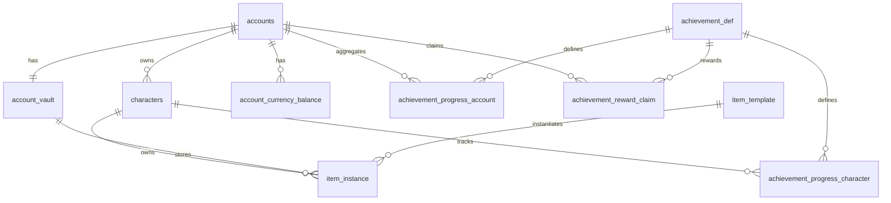
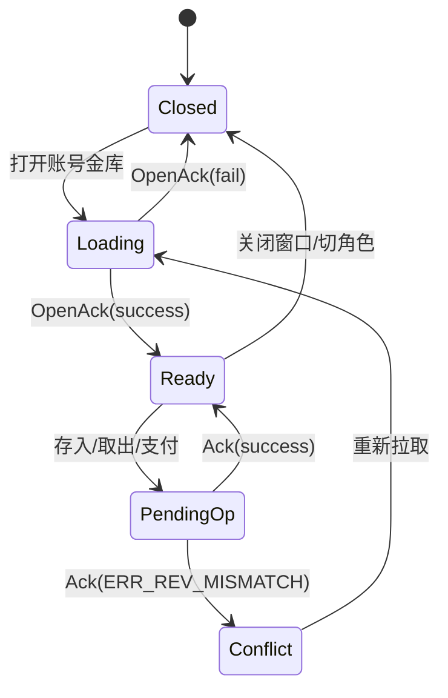

# DNF资产与成就子系统复刻研究报告

## 法律合规与风险提示

根据 entity["company","Neople","korean game developer"] 在 DFO EULA 中公开的限制条款，官方明确禁止对软件进行反编译、逆向工程，禁止截获、仿真、重定向通信协议，禁止通过协议仿真、隧道、抓包、数据挖掘、未授权连接等方式实现“未经授权的游戏接入”或服务替代；这些行为还被官方明确表述为可能触犯民事或刑事法律。其母公司 entity["company","Nexon","game publisher"] 体系下的官方页面同样将此类行为纳入受限制范围。基于这一点，本报告**不提供**未授权客户端、数据库、PCAP、密钥、精确私有 opcode 的获取方法，也**不提供**面向官方服的拦截、仿真、重定向连接操作步骤。文中凡标记为“Clean-room 建议”的内容，都是为了让开发团队在**不依赖泄露物料**的前提下，做出行为一致、可维护、可验证的工程实现，而不是对官方未公开实现的逐位照抄。citeturn45search0

结合官方材料与公开社区仓库，可将资料风险分为四层。第一层是官方公开文档、更新公告、商城页、开发者 API，**可信度最高、法律风险最低**；第二层是公开社区开源实现，例如公开网关、后台、PVF 解析器、背包 BLOB 编辑工具，它们自称用于学习或开源研究，但通常明显带有私服/逆向生态痕迹，**可信度中等、法律风险中高**；第三层是“一键端”、容器整合包、登录器、管理后台等公开发布物，它们往往直接面向非官方运行时，**法律风险高**；第四层是泄露客户端、数据库快照、未授权 PCAP、密钥与内部文档，**法律风险极高**，本报告只做风险列举，不直接采用、不摘录、不复现。公开社区仓库中，ThePeppy 的网关仓库明确写有“仅用于学习探讨，不得用于商业，不得盗版”，Zageku 的工具仓库明确声明可读取台服 PVF 与数据库背包 BLOB 字段，1995chen 的仓库则公开提供“DNF 容器版本”的 Docker 化部署说明，onlyGuo 的仓库公开了后台、PVF 管理、角色发物品、登录器版本配置等功能；这些都属于**可作对照、不可直接视为合法或官方依据**的中高风险资料。citeturn16view0turn15view0turn26view1turn37view0

下表给出本报告采用的来源分级与使用策略。该分级是对官方 EULA、官方系统页、官方 API 与公开社区仓库自述信息的综合判断。citeturn45search0turn18view0turn22view0turn16view0turn15view0turn37view0turn26view1

| 来源类别 | 代表样本 | 可信度 | 法律风险 | 在本报告中的使用方式 |
|---|---|---:|---:|---|
| 官方公开资料 | 韩服官网 Guide/FAQ/Update、DFO 官网更新页、Neople OpenAPI、EULA | 高 | 低 | 作为“已证实行为”的主证据 |
| 公开社区源码 | ThePeppy/eto-gateway、Zageku/DNF_pvf_python、onlyGuo/dnf-server-public | 中 | 中高 | 仅作为协议形态、数据组织、工程结构参考 |
| 公开整合部署物 | 1995chen/dnf 等 | 中低 | 高 | 仅用于观察运行时常见端口、日志、数据库初始化形态 |
| 泄露物料/未授权抓包 | 泄露客户端、数据库、私有 PCAP、密钥 | 不确定 | 极高 | 不采用；只标记风险，不提供细节 |

## 执行摘要与研究边界

从官方公开页面可以证实，DNF 至少已经公开暴露了四种与本报告高度相关的“真实行为边界”。其一，**账号共享资产**确实存在，且体现在“账号金库/Explorer Club/账号范围索引”三条产品线：韩服 Guide 说明金库分为“个人金库”和“账号金库”，后者用于账号内角色间转移物品，并要求角色等级达到 60 才能开启；FAQ 又公开了账号金库各阶段槽位数；更新页进一步公开了账号金库扩容后可保管金币上限；另有官方更新说明“金库材料可直接用于商店购买”，以及 DFO/国服系页面说明账号内物品搜索、全角色金币查看与“优先消耗已设置材料，不足时再消耗账号绑定材料”等体验优化。换句话说，官方行为已经明确支持“账号级物品容器”“账号级金币容器”“账号级材料可见性和可支付性”这三件事。citeturn18view0turn18view1turn18view5turn18view7turn18view8turn19search3turn19search6turn22view1

其二，**绑定状态机**在官方页面中是可观察的。官方英文商城/活动页重复出现三类最关键文案：`Account-bound`、`Tradable 1 time (Account-bound after being traded)`、`untradable`；某些道具还公开写明“只能装备在不可交易 Avatar 上”。这说明 DNF 的绑定模型不是单一布尔值，而至少包含“未绑定/账号绑定/一次交易后账号绑定/不可交易/装备前置条件”等复合状态，很多行为应当由**模板规则 + 实例状态**共同决定。citeturn21search5turn21search9turn21search7turn21search3turn21search17turn21search15

其三，**账号级成就**在官方公开资料中是最清楚的一块。2022 年官方更新明确写出：Achievement 被加入 Explorer Club，包含 5 个大类；完成成就会累积总成就阶段点数，达到条件后升级并发奖；每个大类下有多个细分类，完成细类阶段也会发奖；旧的 Explorer Club challenge 被并入成就体系；成就还会产出 Reputation，并可在角色名上方显示昵称。2024 年官方又公开了“成就点数改版、加入奖杯、记录达成日期、无法达成成就的处理、Shift+点击聊天超链接”等后续 UI/规则变化；2026 年官方补丁继续公开“奖杯悬停最多展示 10 条最近达成成就”“新职业并入角色等级/名望/训练等级相关成就”“新副本成就直接加入成就系统并发放账号绑定奖励”等细节。citeturn22view0turn23view1turn23view2turn18view4turn22view1turn22view2turn22view3

其四，**角色级事件流**虽然在公开网页里没有被完整拆成“独立角色成就系统”，但已经有足够多的官方旁证支持将其 clean-room 地拆出来实现。Neople OpenAPI 公开了角色时间线接口及代码表，覆盖角色创建、转职、最高等级达成、道具强化/增幅/锻造、道具获取、道具超越传送等大量角色事件；官方成就更新又明确提到“角色等级、名望、训练等级相关成就”“特定高难度无 Buff 通关计入成就次数”等内容。对工程团队来说，这足以支撑“账号级聚合成就 + 角色级挑战/展示/重置规则”两层模型。citeturn10view0turn11view0turn22view2turn21search8

公开社区实现进一步给出了**工程落地样式**。ThePeppy 的网关仓库展示了一个非常典型的登录链路：Go + gin 网关、`application/x-protobuf` 登录入口、`LoginRequest{accountname,password}` 与 `LoginResponse{code,msg,data}` 的 Protobuf 消息、UID 加密后转成 base64 token 的处理；同仓库也提供 JSON 登录路由示例。onlyGuo 的后台仓库展示了另一条常见路线：Spring Boot + MySQL + Web 管理后台 + PVF 上传解析 + 角色发物品/角色属性编辑 + 登录器版本管理。Zageku 的工具仓库则直接说明其工具基于“PVF + 数据库背包 BLOB 字段读取”，并将“物品栏/穿戴栏/宠物栏/仓库”作为可编辑标签页。综合来看，若目标是让团队**直接开发**而不是复刻旧私服的历史包袱，最合理的 clean-room 落点是：**登录/启动链路采用 HTTPS + JSON/Protobuf，游戏内链路采用自定义 TCP 二进制帧，存储层采用行式 item_instance/achievement_progress 作为真相源，必要时提供 Legacy BLOB 适配器用于验证与迁移。**citeturn30view0turn35view0turn16view0turn37view0turn8view0turn15view0

为方便团队区分“官方已证实”和“可直接开发的 clean-room 设计”，本报告统一采用四级证据标签。A 代表“官方明确写出”；B 代表“官方 API 或官方旁证能验证”；C 代表“公开社区可见实现，只能作参考”；D 代表“为保证可开发性而做的明确工程建议”。后文所有表结构、协议 ID、伪代码默认都属于 **D 级 clean-room 建议**；只有写明“已证实的 DNF 行为”时，才主张与当前公开资料存在直接对应关系。citeturn18view0turn22view0turn10view0turn30view0

下图是本文建议的统一核心数据模型。它并非官方数据库摘录，而是把官方可观察行为与公开社区实现的共性抽象成一个适合长期维护、事务一致性更好的行式模型。其设计依据是：官方已公开账号金库、账号级成就、角色级事件与多种绑定状态，而公开社区工具又反复暴露出“PVF 元数据 + 背包/仓库实例字段”的实现形态。citeturn18view0turn22view0turn11view0turn15view0turn37view0



## 账号共享资产系统

### 已证实的 DNF 行为

官方韩服 Guide 明确写出：金库分为“我自己的金库”和“账号金库”，账号金库用于账号内角色之间移动物品，并要求角色等级 60 以上才能开启。FAQ 又公开了账号金库从 8 格开始逐级扩容的槽位数。后续更新页继续公开：账号金库扩容后，金币保管上限会随槽位扩展，在 88 格及以上时达到 8 亿。另一份 Guide 还写明“金库材料可直接用于购买”，且当金库或账号金库存有材料时，购买时会弹出消耗确认窗口。DFO/国服系页面则公开了账号内跨角色物品搜索、全角色金币查看，以及材料购买时优先消耗已设置材料、不足时消耗账号绑定材料的逻辑。这些点足以证明官方系统的核心不是“共享背包 UI”而是“账号级容器 + 账号级检索 + 可支付资产接入交易流程”。citeturn18view0turn18view1turn18view5turn18view7turn18view8turn19search3turn19search6turn22view1

### 功能需求清单

**核心用例。** 账号共享资产系统至少要覆盖六类动作。第一类是账号金库解锁：当账号下任一角色满足开放条件时，角色进入仓库 NPC/UI 后可解锁账号金库。第二类是账号金库存取：角色可将允许共享的物品或金币存入账号金库，并从中取出到当前角色。第三类是账号级检索：按模板 ID、名称、品类搜索“当前账号全角色 + 个人金库 + 账号金库”的资产位置。第四类是交易/商店支付接入：商店购买、修理、分解、特殊商店兑换等流程可直接读取账号金库金币或材料。第五类是跨角色并发访问：两个在线角色同时打开同一账号金库时，后提交的一方必须基于 revision 冲突处理。第六类是异常回滚：购买成功但发奖失败、角色背包已满、网络中断、重复提交等情况必须做到资产不丢不重。上述用例的“存在性”都有官方行为旁证；其中并发一致性与回滚是工程实现的 clean-room 强化要求。citeturn18view0turn18view5turn18view8turn22view1

**触发条件与边界。** 需要特别固化的边界包括：未到开放等级时 UI 不应显示可写入口；超出账号金库槽位或金币上限时必须拒绝；同一模板不同绑定状态不能自动合并；支付时若角色背包/金库/账号金库同时有材料，应按产品规则排序扣除；当账号金库被一个角色打开，并不等于另外一个角色不能读，但第二个角色的写操作必须基于最新版本重新校验；断线重连后只允许重放带幂等键且未提交成功的请求。官方页面已经提供了等级、槽位、金币上限、支付可用性等边界；其余边界属于实现侧必须补齐的条件。citeturn18view0turn18view1turn18view5turn18view7

### 数据模型

**推荐建模结论。** 不建议把账号金库继续建成单一 BLOB 字段。公开社区工具表明，旧生态里大量依赖“数据库背包 BLOB + PVF 元数据”去编辑角色物品、仓库和字节流，这会让并发控制、索引查询、审计、反作弊都变得困难。更适合团队长期开发的做法，是把“元数据”和“实例状态”拆开：`item_template` 由 PVF 导入；`item_instance` 只负责实例化状态；`account_vault` 和 `account_vault_slot` 管容器；`account_currency_balance` 管账号共享货币；`asset_ledger` 管审计流水。必要时，再加一个 `legacy_blob_adapter` 做兼容。citeturn15view0turn25view1turn37view0

**建议表结构。** 下面给出以 MySQL 8 为基线、PostgreSQL 15 可一比一迁移的 DDL 级建议。字段名、类型、索引都已经压到可直接开发表的粒度。

```sql
CREATE TABLE account_vault (
  vault_id            BIGINT PRIMARY KEY,
  uid                 BIGINT NOT NULL UNIQUE,
  unlocked            TINYINT(1) NOT NULL DEFAULT 0,
  unlocked_by_char_id BIGINT NULL,
  unlock_level_gate   SMALLINT NOT NULL DEFAULT 60,
  slot_count          SMALLINT NOT NULL DEFAULT 8,
  gold_balance        BIGINT NOT NULL DEFAULT 0,
  gold_cap            BIGINT NOT NULL DEFAULT 400000000,
  revision            BIGINT NOT NULL DEFAULT 0,
  last_op_seq         BIGINT NOT NULL DEFAULT 0,
  created_at          DATETIME NOT NULL,
  updated_at          DATETIME NOT NULL,
  INDEX idx_account_vault_revision(uid, revision),
  CONSTRAINT fk_account_vault_uid FOREIGN KEY (uid) REFERENCES accounts(uid)
);

CREATE TABLE account_vault_slot (
  vault_id            BIGINT NOT NULL,
  slot_no             SMALLINT NOT NULL,
  item_uid            BIGINT NULL,
  locked              TINYINT(1) NOT NULL DEFAULT 0,
  PRIMARY KEY (vault_id, slot_no),
  UNIQUE KEY uk_account_vault_item(item_uid),
  CONSTRAINT fk_avs_vault FOREIGN KEY (vault_id) REFERENCES account_vault(vault_id)
);

CREATE TABLE account_currency_balance (
  uid                 BIGINT NOT NULL,
  currency_code       VARCHAR(32) NOT NULL,
  balance             BIGINT NOT NULL DEFAULT 0,
  spendable_balance   BIGINT NOT NULL DEFAULT 0,
  bind_scope          ENUM('ACCOUNT') NOT NULL DEFAULT 'ACCOUNT',
  revision            BIGINT NOT NULL DEFAULT 0,
  updated_at          DATETIME NOT NULL,
  PRIMARY KEY (uid, currency_code),
  CONSTRAINT fk_acb_uid FOREIGN KEY (uid) REFERENCES accounts(uid)
);

CREATE TABLE item_instance (
  item_uid            BIGINT PRIMARY KEY,
  template_id         INT NOT NULL,
  owning_uid          BIGINT NOT NULL,
  owner_char_id       BIGINT NULL,
  container_type      ENUM('CHAR_INV','CHAR_EQUIP','CHAR_VAULT','ACCOUNT_VAULT','MAIL') NOT NULL,
  container_id        BIGINT NOT NULL,
  slot_no             SMALLINT NOT NULL,
  stack_count         INT NOT NULL DEFAULT 1,
  bind_scope          ENUM('NONE','ACCOUNT','CHARACTER') NOT NULL DEFAULT 'NONE',
  trade_remaining     TINYINT NOT NULL DEFAULT 0,
  expire_at           DATETIME NULL,
  flags_json          JSON NULL,
  version             BIGINT NOT NULL DEFAULT 0,
  created_at          DATETIME NOT NULL,
  updated_at          DATETIME NOT NULL,
  INDEX idx_item_owner(owning_uid, owner_char_id),
  INDEX idx_item_container(container_type, container_id, slot_no),
  INDEX idx_item_template(template_id),
  INDEX idx_item_bind(bind_scope, trade_remaining)
);

CREATE TABLE asset_ledger (
  ledger_id           BIGINT PRIMARY KEY,
  uid                 BIGINT NOT NULL,
  char_id             BIGINT NULL,
  op_id               VARCHAR(64) NOT NULL,
  op_type             VARCHAR(32) NOT NULL,
  asset_kind          ENUM('ITEM','GOLD','CURRENCY') NOT NULL,
  asset_ref           VARCHAR(64) NOT NULL,
  delta               BIGINT NOT NULL,
  before_value        BIGINT NULL,
  after_value         BIGINT NULL,
  reason_code         VARCHAR(64) NOT NULL,
  related_msg_seq     BIGINT NULL,
  related_order_id    VARCHAR(64) NULL,
  created_at          DATETIME NOT NULL,
  UNIQUE KEY uk_asset_ledger_op(op_id, asset_kind, asset_ref),
  INDEX idx_asset_ledger_uid(uid, created_at)
);
```

**示例记录。** 官方公开并不披露数据库，所以示例记录是 clean-room 建议，但字段取值遵循官方公开边界，例如 60 级开放、88 格后 8 亿上限。citeturn18view0turn18view1turn18view7

| 表 | 样例字段 | 示例值 |
|---|---|---|
| account_vault | uid / unlocked / slot_count / gold_balance / gold_cap / revision | 1001001 / 1 / 88 / 235000000 / 800000000 / 182 |
| account_currency_balance | uid / currency_code / balance / spendable_balance | 1001001 / `ACCOUNT_BIND_MATERIAL` / 8200 / 8200 |
| item_instance | item_uid / template_id / container_type / slot_no / stack_count / bind_scope | 900000811 / 30312 / `ACCOUNT_VAULT` / 17 / 250 / `ACCOUNT` |
| asset_ledger | op_id / op_type / asset_kind / delta / reason_code | `av-20260430-000812` / `WITHDRAW` / `ITEM` / -120 / `SHOP_PURCHASE` |

### 协议与接口

**官方可证实的公开协议样本只有登录链路，不包括金库内部 opcode。** 公开社区网关仓库给出了一个明确的 Protobuf 登录模型：`LoginRequest { accountname, password }`，`LoginResponse { code, msg, data }`；同时服务端 Go 代码展示了 `application/x-protobuf` 返回、UID 加密后生成 base64 token，以及独立 JSON 登录接口。这说明“启动器/网关层走 HTTPS + JSON/Protobuf、游戏内层再走自定义协议”是一个现实且常见的工程划分。citeturn30view0turn35view0turn16view0

**登录样本。** 这是公开社区样本中少数能直接落到字段级的协议片段。它不是官方 DNF 金库协议，但很适合作为你的启动器/网关层参考。citeturn30view0turn35view0

```proto
syntax = "proto3";
package game;

message LoginRequest {
  string accountname = 1;
  string password = 2;
}

message LoginResponse {
  int32 code = 1;
  string msg = 2;
  string data = 3;
}
```

**Protobuf 二进制示例。** 以 `accountname=alice`、`password=p@ss` 为例，序列化后的 body 可以是：

```text
0A 05 61 6C 69 63 65 12 04 70 40 73 73
```

`0A` 是字段 1 的 tag，`05` 是长度，随后是 `alice`；`12` 是字段 2 的 tag，`04` 是长度，随后是 `p@ss`。该示例与公开 `login.proto` 的字段顺序和 wire type 一致。citeturn30view0

**账号共享资产系统的 Clean-room 消息设计。** 由于公开合法材料里没有可信、稳定、可复现的官方金库 opcode，本报告给出一套可直接开发、便于抓包和压测的自定义 TCP 帧方案。建议统一头：

```text
struct MsgHeader {
  u16 msg_id;       // little-endian
  u16 flags;        // bit0=ack, bit1=err
  u32 seq;
  u64 uid;
  u64 char_id;
  u32 body_len;
  u32 crc32;
}
```

推荐的消息表如下：

| msg_id | 方向 | 名称 | body 字段顺序 |
|---|---|---|---|
| `0x4201` | C→S | AccountVaultOpenReq | `client_revision:u64` |
| `0x4202` | S→C | AccountVaultOpenAck | `result:u16, vault_id:u64, slot_count:u16, gold_balance:u64, gold_cap:u64, revision:u64, items:repeated<ItemView>` |
| `0x4203` | C→S | AccountVaultDepositReq | `op_id:str, src_container:u8, src_slot:u16, qty:u32, dst_slot:u16` |
| `0x4204` | S→C | AccountVaultDepositAck | `result:u16, revision:u64, changed_slots:repeated<SlotPatch>` |
| `0x4205` | C→S | AccountVaultWithdrawReq | `op_id:str, src_slot:u16, qty:u32, dst_container:u8, dst_slot:u16` |
| `0x4206` | S→C | AccountVaultWithdrawAck | `result:u16, revision:u64, changed_slots:repeated<SlotPatch>` |
| `0x4207` | C→S | AccountVaultSpendReq | `op_id:str, spend_kind:u8, asset_code:str, amount:u64, target_context:str` |
| `0x4208` | S→C | AccountVaultSpendAck | `result:u16, revision:u64, remain:u64` |
| `0x4209` | S→C | AccountVaultDeltaPush | `revision:u64, patches:repeated<Patch>` |

**JSON 示例。** 这类 JSON 建议只用于 GM 后台、Web 角色页、测试桩，不建议直接用于高频战斗期链路。

```json
POST /api/v1/accounts/1001001/shared-assets/withdraw
{
  "opId": "av-20260430-000812",
  "charId": 8877331,
  "srcSlot": 17,
  "templateId": 30312,
  "qty": 120,
  "dstContainer": "CHAR_INV",
  "dstSlot": 9,
  "clientRevision": 182
}
```

### 服务端逻辑与伪代码

**事务策略。** 账号金库相关操作必须在单事务内同时锁定三类对象：`account_vault` 头、涉及的 `item_instance` 行、目标角色容器头。MySQL 8 用 `SELECT ... FOR UPDATE` 足够；PostgreSQL 可用 `FOR UPDATE SKIP LOCKED` 做后台队列。Redis 只能做辅助锁或只读投影，不能当资产真相源。公开社区整合仓库和后台仓库都在 MySQL 语境下运行，而登录/网关样本展示了独立服务边界，这更适合拆成“AccountAssetService + ItemService + Gateway”。citeturn26view1turn8view0turn35view0

```pseudo
function withdraw_from_account_vault(uid, charId, req):
    assert req.opId is not empty
    begin transaction

    if exists asset_ledger(op_id=req.opId):
        return previous_result   // 幂等

    vault = select * from account_vault where uid=? for update
    if vault.unlocked != 1:
        rollback; return ERR_NOT_UNLOCKED

    if req.clientRevision != vault.revision:
        rollback; return ERR_REV_MISMATCH

    src = select * from item_instance
          where container_type='ACCOUNT_VAULT'
            and container_id=vault.vault_id
            and slot_no=req.srcSlot
          for update

    dst_head = lock_character_inventory_head(charId)

    if not can_withdraw(src, req.qty, charId):
        rollback; return ERR_RULE

    if not has_capacity(dst_head, src.template_id, req.qty):
        rollback; return ERR_NO_SPACE

    patches = move_or_split_stack(src, dst_head, req.qty, req.dstSlot)

    vault.revision += 1
    update account_vault set revision=? ...

    insert asset_ledger(... op_type='WITHDRAW', reason='USER_ACTION')
    commit

    push AccountVaultDeltaPush(uid, vault.revision, patches)
    return OK
```

**支付接入。** “从账号金库或账号绑定材料直接购买”是官方明确有的用户体验，因此商店服务不应该自己偷偷读数据库，而应调用 `ReserveSharedAssetForOrder()` 进行预占，再在订单提交成功时 `CommitReserve()`，否则取消。这样可以解耦“购买逻辑”和“共享资产逻辑”。官方 Guide 已明确说明购买时会弹出消耗确认，因此客户端也需要显示“本次将从账号金库消耗 X”的预览。citeturn18view5turn19search3turn19search6

### 客户端与 UI 流程

**界面元素。** 建议 UI 至少包含：账号金库标签页、金币区、过滤器、排序器、账号全资产搜索入口、可支付资产预览区、版本冲突重载提示。国服/韩服公开页面分别验证了“账号内物品搜索”“账号内金币查看”“购买时直接读金库材料”“部分菜单支持 Vault Gold”这些能力，因此 UI 不应把账号金库做成孤岛窗口，而应把它纳入“搜索—支付—容器”一体化体验。citeturn18view8turn18view5turn22view1

**推荐状态机。**



**交互细节。** 当系统检测到某材料只能账号共享不可角色转移时，拖拽应直接拒绝；当道具可放入账号金库但当前槽位不足时，应支持自动整理到空位；当 revision 冲突时，不应用“最后写入覆盖”，而要提示“已被其他角色修改，正在重新同步”。这些都是 MMO 资产系统防复制、防错付、防玩家误会的必要交互。官方的“确认弹窗”“账号搜索”“Vault Gold 使用入口”等旁证，已经说明此类资产操作本身就需要强反馈。citeturn18view5turn22view1turn18view8

### 同步、持久化与缓存

**推荐策略。** `account_vault` 头部、`account_currency_balance` 头部、全账号资产索引可以进 Redis；`item_instance` 与 `asset_ledger` 必须落库后再通知。建议使用“数据库提交成功 → 发布事件 → Redis 投影更新 → 网关推送 delta”的标准顺序，绝不允许先更新缓存再异步落库。因为社区旧生态里大量围绕 BLOB 做直接编辑，这天然增加了脏写风险；clean-room 实现最大的收益就是让 revision 和 ledger 成为第一公民。citeturn15view0turn25view1turn37view0

**缓存键建议。**
- `av:head:{uid}`：`slot_count/gold_balance/gold_cap/revision`
- `av:slots:{uid}:{page}`：分页槽位快照
- `acct:asset_index:{uid}:{template_id}`：全账号资产位置索引
- `acct:currency:{uid}`：共享货币视图

### 安全与反作弊

共享资产系统最怕的是**跨角色并发复制**、**请求重放**、**客户端伪造可共享性**、**支付与发货拆事务**。防护点应当是：所有规则都在服务端判断；每个请求带 `op_id` 和 `seq`；每个容器带 `revision`；任何“道具可否进账号金库”“材料是否可用于支付”“金币是否可从账号金库读”都由模板规则和实例状态联合判定；库存不足时必须整体回滚；下游发奖励失败时通过 mail fallback 重新投递而不是就地吞掉。官方 EULA 已把协议拦截、未授权连接、数据挖掘等列为限制行为；从运营角度看，这意味着你的实现也必须把“日志审计”和“异常检出”做成内建能力，而不能只靠 GM 肉眼排查。citeturn45search0turn22view0

### 兼容迁移

如果已有旧服或实验服使用“仓库 BLOB/背包 BLOB”，建议分三步迁移。第一步，新增行式 `item_instance` 与 `account_vault`，保留原 BLOB；第二步，登录时双读比对，只允许行式写入；第三步，跑完一致性校验后再去掉 BLOB 写路径。迁移脚本要特别处理堆叠物、过期物、一次交易后账号绑定物、旧版本无模板 ID 映射的孤儿物。公开社区工具已经暴露了“导出字段/导入字段”“生成字节复制物品”的用法，这恰恰说明**BLOB 只适合兼容，不适合当最终主模型**。citeturn25view1

### 测试、验证与可复用模块

**测试矩阵。** 至少做以下 12 项：解锁前访问、解锁后首次建仓、8/88/208 格边界、4 亿/8 亿金币边界、相同模板不同绑定状态并存、两角色同时取同一堆叠、支付预占成功/取消、支付提交成功但背包发货失败、断线重试、重复 `op_id`、索引搜索命中位置正确、跨角色上线后的 delta 推送一致。上述边界大多有官方公开值可对照。citeturn18view1turn18view7turn18view8

**可复用模块。**
- `AccountVaultService`：共享金库读写与 revision 管理。
- `AssetLedgerService`：幂等与审计。
- `AccountAssetIndexProjector`：全账号搜索投影。
- `SharedPaymentAdapter`：商店/修理/分解接入。
- `LegacyBlobAdapter`：旧 BLOB ↔ 行式物品适配。
- `PvfIngestor`：PVF 模板导入与 MD5 版本标记；社区工具已有按 MD5 缓存 PVF 的实践可参考。citeturn15view0

## 角色绑定资产系统

### 已证实的 DNF 行为

官方英文页面持续出现三种非常关键的交易说明：一是“获得后即账号绑定”；二是“可交易 1 次，交易后账号绑定”；三是“不可交易”；个别页面还写明“金色徽章只能装备在不可交易 Avatar 上”。国服优化页则说明在某些商店购买里，系统会优先消耗已设置材料，余额不足时再消耗账号绑定材料，且不必再先把账号绑定道具转换成无法交易道具。这说明 DNF 的绑定系统并非单独存在，而是和**交易系统、装备系统、支付系统、模板限制**交叉耦合。citeturn21search5turn21search9turn21search3turn19search3

### 功能需求清单

角色绑定资产系统建议覆盖四类主路径。第一类是**模板驱动的自动绑定**：获得即角色绑定、装备即角色绑定、交易后账号绑定、开封后不可交易等。第二类是**实例驱动的状态迁移**：交易成功后 `trade_remaining` 归零并转账号绑定；装备成功后触发 `bind_scope=CHARACTER`；镶嵌/附魔到不可交易装备后继承更严格限制。第三类是**白名单解绑**：如果你要做可运营活动，解绑必须只允许“模板白名单 + 道具白名单 + 次数限制”三重校验。第四类是**显示与过滤**：背包、仓库、拍卖行、邮件、商店、装备页都必须共用同一套 bind-rule 解释器。官方页面能证实前三种绑定态和装备前置条件，但没有公开“通用解绑”存在，因此“通用解绑”只能作为设计扩展，而不能宣称是 DNF 已证实功能。citeturn21search5turn21search9turn21search3

### 数据模型

**推荐实例字段。** 绑定系统不要只存一个 `is_bind`。最少应包含：
- `bind_scope`：`NONE / ACCOUNT / CHARACTER`
- `bind_trigger`：`ON_OBTAIN / ON_TRADE / ON_EQUIP / ON_USE / MANUAL`
- `trade_remaining`：还能交易几次
- `equip_lock`：是否只能挂到不可交易装备/Avatar
- `bind_reason_code`：运营、活动、模板、强化、镶嵌等原因
- `bind_at` / `bind_char_id`
- `unbind_ticket_id` / `unbind_count`

建议附加表：

```sql
CREATE TABLE item_bind_rule (
  template_id         INT PRIMARY KEY,
  default_bind_scope  ENUM('NONE','ACCOUNT','CHARACTER') NOT NULL,
  bind_on_obtain      TINYINT(1) NOT NULL DEFAULT 0,
  bind_on_trade       TINYINT(1) NOT NULL DEFAULT 0,
  bind_on_equip       TINYINT(1) NOT NULL DEFAULT 0,
  trade_limit         TINYINT NOT NULL DEFAULT 0,
  require_untradable_equip TINYINT(1) NOT NULL DEFAULT 0,
  unbind_policy       ENUM('NONE','TICKET','ADMIN_ONLY') NOT NULL DEFAULT 'NONE',
  rule_json           JSON NULL
);

CREATE TABLE item_bind_history (
  id                  BIGINT PRIMARY KEY,
  item_uid            BIGINT NOT NULL,
  from_scope          ENUM('NONE','ACCOUNT','CHARACTER') NOT NULL,
  to_scope            ENUM('NONE','ACCOUNT','CHARACTER') NOT NULL,
  from_trade_remaining TINYINT NOT NULL,
  to_trade_remaining  TINYINT NOT NULL,
  trigger_code        VARCHAR(32) NOT NULL,
  actor_char_id       BIGINT NULL,
  related_op_id       VARCHAR(64) NOT NULL,
  created_at          DATETIME NOT NULL,
  INDEX idx_item_bind_history_item(item_uid, created_at)
);
```

**示例记录。**

| 表 | 样例字段 | 示例值 |
|---|---|---|
| item_bind_rule | template_id / default_bind_scope / bind_on_trade / trade_limit | 610201 / `NONE` / 1 / 1 |
| item_instance | item_uid / bind_scope / trade_remaining / equip_lock | 99002218 / `ACCOUNT` / 0 / 1 |
| item_bind_history | item_uid / from_scope / to_scope / trigger_code | 99002218 / `NONE` / `ACCOUNT` / `TRADE_SETTLED` |

### 协议与接口

由于官方未公开角色绑定相关 opcode，建议直接做成“解释器 + 少量状态迁移消息”。

| msg_id | 方向 | 名称 | body |
|---|---|---|---|
| `0x4301` | C→S | ItemBindPreviewReq | `item_uid:u64, action:u8, target_ctx:u8` |
| `0x4302` | S→C | ItemBindPreviewAck | `result:u16, current_scope:u8, next_scope:u8, current_trade_remaining:u8, next_trade_remaining:u8, hints:repeated<string>` |
| `0x4303` | C→S | ItemBindCommitReq | `op_id:str, item_uid:u64, action:u8, target_ctx:u8, ticket_item_uid:u64?` |
| `0x4304` | S→C | ItemBindCommitAck | `result:u16, item_uid:u64, bind_scope:u8, trade_remaining:u8, version:u64` |
| `0x4305` | S→C | ItemTooltipRefreshPush | `item_uid:u64, badges:repeated<string>` |

**JSON 示例。**

```json
POST /api/v1/items/99002218/bind/preview
{
  "charId": 8877331,
  "action": "TRADE_SETTLED",
  "targetContext": "AUCTION"
}
```

### 服务端逻辑与伪代码

```pseudo
function settle_trade_and_update_bind(itemUid, buyerUid, sellerUid, opId):
    begin transaction
    item = select * from item_instance where item_uid=? for update
    rule = select * from item_bind_rule where template_id=? for share

    if exists item_bind_history where related_op_id=opId and item_uid=itemUid:
        return idempotent_ok

    assert item.owning_uid == sellerUid
    assert item.trade_remaining > 0 or rule.trade_limit > 0

    transfer_ownership(item, buyerUid)

    old_scope = item.bind_scope
    old_trade = item.trade_remaining

    if rule.bind_on_trade:
        item.trade_remaining = max(item.trade_remaining - 1, 0)
        if item.trade_remaining == 0:
            item.bind_scope = ACCOUNT

    update item_instance ...
    insert item_bind_history(...)
    commit
```

**事务要点。** 交易结算、所有权变更、绑定态变化、拍卖行余额结算必须是一个原子事务；不能先把钱转了再改绑定，不能先改绑定再失败回滚到未交易但已绑定状态。官方“可交易 1 次，之后账号绑定”的文案本质上就是一个有条件状态机，必须用事务实现。citeturn21search5turn21search9

### 客户端与 UI 流程

角色绑定系统的 UI 成败，取决于你是否把“绑定状态”做成统一徽标系统。建议 Tooltip 至少显示：
- `账号绑定`
- `角色绑定`
- `可交易 1 次`
- `交易后账号绑定`
- `无法交易`
- `仅可装备于不可交易装备/Avatar`

装备、交易、邮寄、拍卖、分解、合成、镶嵌、附魔等窗口都调用同一 `BindRuleInterpreter`。这样一来，策划只改模板规则，所有界面同步生效。官方页面里同一类文案在不同活动和商城页反复出现，正说明客户端应把其视为统一体系，而不是每个系统各写一份 if/else。citeturn21search5turn21search9turn21search17

### 同步、持久化与缓存

绑定规则建议热加载到内存并挂版本号；`item_bind_rule` 可以 Redis 缓存，`item_instance` 不能。对高频检验路径，可以把模板规则压成 bitset／枚举常量：`canTrade / bindOnTrade / bindOnEquip / requireUntradableEquip / unbindPolicy`。这样交易、装备、邮件、商店支付都能 O(1) 做前置判断。

### 安全与反作弊

绑定系统的高风险点有三个：一是客户端伪造“仍可交易”；二是跨系统状态不一致，比如邮件系统允许发出但拍卖系统禁止；三是 GM/活动配置引入批量可解绑漏洞。解决办法是：所有系统统一走 `BindRuleEngine`；每次状态迁移都写 `item_bind_history`；GM 操作要求双人审批或临时授权码；任何“解绑券”都必须白名单模板化。公开后台仓库已经展示了“超管临时密码表”“后台账号管理”“角色发物品”“上传 PVF 后发物品”等能力，说明只要后台操作不做强约束，绑定系统很容易被运营/GM 破坏。citeturn41search0

### 兼容迁移

从旧 BLOB 系统迁移时，优先把 `trade_remaining` 与 `bind_scope` 拆成显式字段，然后再慢慢把 `flags_json` 归一化。否则你以后做“交易后账号绑定”“只有不可交易 Avatar 可镶嵌”一类规则时，根本没法靠索引排查异常。

### 测试、验证与可复用模块

测试应覆盖：可交易一次物品首次交易、二次交易拒绝、装备即绑定、镶嵌到不可交易装备、从账号金库存取后保持绑定态、白名单解绑成功、非白名单解绑失败、拍卖上架前后 bind_preview 一致、所有 UI Tooltip 文案一致。
可复用模块建议：
- `BindRuleEngine`
- `ItemEligibilityService`
- `TooltipBadgeComposer`
- `ItemBindHistoryAuditor`
- `ManualUnbindPolicyGuard`

## 账号级成就系统

### 已证实的 DNF 行为

2022 年韩服/DFO 官方系统页已经把账号级成就系统的骨架写得非常完整：成就被加入 Explorer Club，有 5 个类别；完成成就会累积总成就阶段点数，达到 100% 后会提升等级并发奖；每个类别含多个细分类，细分类完成也有奖励；旧的 Explorer Club 挑战合并为成就类别；成就会带来 Reputation，并能在角色名上方显示昵称。2024 年韩服更新页继续公开：成就分数改版、加入 Trophy、增加达成日期、无法达成成就的处理、Shift+点击聊天超链接、点击弹出成就详情。2026 年 DFO 更新又公开：奖杯悬停显示最近达成成就、每奖杯最多 10 条；新职业被纳入角色等级/名望/训练等级相关成就；新副本成就加入后可发放账号绑定奖励。综合这些证据，可以把“账号级成就 = 账号-聚合器 + 类别/细分类 + 奖励发放 + 外显称号/声望 + 不可达状态处理”视为 A/B 级已证实行为。citeturn22view0turn23view1turn23view2turn18view4turn22view1turn22view2turn22view3

### 功能需求清单

账号级成就系统建议实现成五层能力。第一层是**定义层**：类别、细分类、条件表达式、奖励、外显称号/声望。第二层是**聚合层**：跨角色统计账号内满足次数、首通、最高值、累计值。第三层是**奖励层**：细分类阶段奖励、总阶段奖励、称号/声望激活。第四层是**展示层**：类别页、最近达成、奖杯页、完成日期、聊天超链接、无法达成状态。第五层是**迁移层**：把旧 challenge、已删除内容、已发奖励内容平滑并入，不重复发奖。所有五层都能在官方公开文本中找到直接或间接证据。citeturn22view0turn18view4turn22view1turn22view3

### 数据模型

**定义表。**

```sql
CREATE TABLE achievement_def (
  def_id               BIGINT PRIMARY KEY,
  scope                ENUM('ACCOUNT','CHARACTER') NOT NULL,
  category_code        VARCHAR(32) NOT NULL,
  subcategory_code     VARCHAR(32) NOT NULL,
  name                 VARCHAR(128) NOT NULL,
  description          TEXT NOT NULL,
  trigger_code         VARCHAR(64) NOT NULL,
  target_type          ENUM('COUNT','FIRST_TIME','MAX_VALUE','UNIQUE_SET') NOT NULL,
  target_value         BIGINT NOT NULL DEFAULT 1,
  condition_json       JSON NOT NULL,
  reward_json          JSON NULL,
  score_value          INT NOT NULL DEFAULT 0,
  reputation_code      VARCHAR(64) NULL,
  unobtainable_policy  ENUM('HIDE_IF_NO_PROGRESS','SHOW_DISABLED') NOT NULL DEFAULT 'HIDE_IF_NO_PROGRESS',
  reset_policy         ENUM('NEVER','SEASON','MANUAL') NOT NULL DEFAULT 'NEVER',
  enabled              TINYINT(1) NOT NULL DEFAULT 1,
  created_at           DATETIME NOT NULL,
  updated_at           DATETIME NOT NULL,
  INDEX idx_ach_scope_category(scope, category_code, subcategory_code, enabled)
);

CREATE TABLE achievement_progress_account (
  uid                  BIGINT NOT NULL,
  def_id               BIGINT NOT NULL,
  progress_value       BIGINT NOT NULL DEFAULT 0,
  progress_json        JSON NULL,
  status               ENUM('IN_PROGRESS','COMPLETED','CLAIMED','UNOBTAINABLE') NOT NULL,
  completed_at         DATETIME NULL,
  completed_by_char_id BIGINT NULL,
  last_event_id        VARCHAR(64) NULL,
  version              BIGINT NOT NULL DEFAULT 0,
  updated_at           DATETIME NOT NULL,
  PRIMARY KEY (uid, def_id),
  INDEX idx_apa_status(uid, status, updated_at)
);

CREATE TABLE achievement_reward_claim (
  uid                  BIGINT NOT NULL,
  def_id               BIGINT NOT NULL,
  stage_no             SMALLINT NOT NULL DEFAULT 1,
  claimed_at           DATETIME NOT NULL,
  claim_op_id          VARCHAR(64) NOT NULL,
  PRIMARY KEY (uid, def_id, stage_no),
  UNIQUE KEY uk_ach_claim_op(claim_op_id)
);

CREATE TABLE account_achievement_profile (
  uid                  BIGINT PRIMARY KEY,
  total_score          INT NOT NULL DEFAULT 0,
  total_level_points   INT NOT NULL DEFAULT 0,
  total_level          INT NOT NULL DEFAULT 0,
  current_reputation   VARCHAR(64) NULL,
  recent_completed_json JSON NULL,
  trophy_json          JSON NULL,
  updated_at           DATETIME NOT NULL
);
```

**示例记录。**

| 表 | 样例字段 | 示例值 |
|---|---|---|
| achievement_def | def_id / scope / category_code / trigger_code / target_type / target_value | 500021 / `ACCOUNT` / `COLLECTION` / `DUNGEON_CLEAR` / `COUNT` / 100 |
| achievement_progress_account | uid / def_id / progress_value / status / completed_by_char_id | 1001001 / 500021 / 100 / `COMPLETED` / 8877331 |
| achievement_reward_claim | uid / def_id / stage_no / claim_op_id | 1001001 / 500021 / 1 / `ach-claim-20260430-77` |
| account_achievement_profile | uid / total_score / total_level / current_reputation | 1001001 / 8420 / 37 / `CONTAGION_ENDER` |

### 协议与接口

**事件输入。** 账号成就绝不能让客户端直接上报“我现在进度 +1”。只能收业务子系统的权威事件。最适合做事件源的，是角色/副本/物品/成长系统已经产生的完成事件。Neople OpenAPI 公开的角色时间线代码可以作为验证词典，例如角色创建、最高等级达成、强化、增幅、超越、掉落、交易等，说明这些事件本身具备稳定编码思路。citeturn10view0turn11view0

**推荐消息。**

| msg_id | 方向 | 名称 | body |
|---|---|---|---|
| `0x4401` | C→S | AchievementListReq | `scope:u8, category_code:str?` |
| `0x4402` | S→C | AchievementListAck | `profile:ProfileView, defs:repeated<AchDefView>, progress:repeated<AchProgressView>` |
| `0x4403` | S→C | AchievementProgressPush | `def_id:u64, old_value:u64, new_value:u64, status:u8, completed_at:i64?` |
| `0x4404` | C→S | AchievementClaimReq | `op_id:str, def_id:u64, stage_no:u16` |
| `0x4405` | S→C | AchievementClaimAck | `result:u16, rewards:repeated<RewardView>, new_profile:ProfileView` |
| `0x4406` | C→S | ReputationSelectReq | `op_id:str, reputation_code:str` |
| `0x4407` | S→C | ReputationSelectAck | `result:u16, current_reputation:str` |
| `0x4408` | C→S | AchievementLinkPreviewReq | `target_uid:u64, def_id:u64` |
| `0x4409` | S→C | AchievementLinkPreviewAck | `owner_name:str, achievement:AchLinkCard` |

**JSON 示例。**

```json
POST /api/v1/accounts/1001001/achievements/claim
{
  "opId": "ach-claim-20260430-77",
  "defId": 500021,
  "stageNo": 1,
  "charId": 8877331
}
```

### 服务端逻辑与伪代码

```pseudo
function on_authoritative_event(evt):
    // evt = {event_id, uid, char_id, trigger_code, value, meta}
    begin transaction

    if exists achievement_event_dedup(event_id):
        commit; return

    defs = select * from achievement_def
           where scope='ACCOUNT'
             and trigger_code=evt.trigger_code
             and enabled=1

    for def in defs:
        prog = select * from achievement_progress_account
               where uid=evt.uid and def_id=def.def_id
               for update

        new_prog = reduce(def, prog, evt)
        if new_prog.changed:
            upsert achievement_progress_account(...)
            if new_prog.completed_now:
                append_recent_completed(evt.uid, def.def_id)

    insert achievement_event_dedup(event_id)
    recalc_profile_if_needed(evt.uid)
    commit

    publish progress push
```

**实现细节。**
一，`reduce()` 必须纯函数化，这样回放历史事件时不会出歧义。
二，`achievement_reward_claim` 必须独立于 `achievement_progress_account`，防止一个进度多阶段发奖。
三，`UNOBTAINABLE` 不是删除，必须保留定义与旧进度，因为官方明确写了“某些无法再满足条件的成就若没有数据则不显示，有数据则保留不可达状态”以及“旧 challenge 已领奖不会重复领奖”。citeturn18view4turn22view0

### 客户端与 UI 流程

官方已经给出几项关键 UI 约束：入口在 Explorer Club；有 5 个大类；支持 Reputation 昵称切换；支持 Trophy；支持最近达成悬停预览；支持聊天框超链接；支持达成日期。你的客户端最好直接按这个模型组织，而不是做成平铺列表。citeturn22view0turn23view2turn18view4turn22view1

建议主界面包含：
- 顶部：总分、总阶段点数、总等级、当前声望昵称
- 中部：5 个 Trophy/Category 卡片
- 右侧：最近达成（最多 10 条）
- 下方：细分类分页 + 进度条 + 奖励预览
- 详情窗：条件、达成日期、贡献角色、奖励领取状态、聊天分享按钮

### 同步、持久化与缓存

账号成就很适合“写库、读缓存”的模式。`account_achievement_profile` 和“最近达成”可做 Redis 投影；`achievement_progress_account` 作为真实进度行。进入角色时拉一次快照；战斗后收到 `AchievementProgressPush` 做增量更新即可。因为成就通常是低频写、高频读，比共享资产更适合缓存。

### 安全与反作弊

账号成就不能信任客户端统计，尤其是“通关次数”“无 Buff 通关”“职业集合”“训练等级”“名望阈值”这些条件。所有事件都要来自有权威性的服务，比如副本结算、物品结算、成长结算。对“聊天超链接查看他人成就”，服务端只能给公开字段，不能把完整条件 JSON 直接吐出去。对奖励领取，必须幂等；对已删内容成就的迁移，必须阻止二次补发。

### 兼容迁移

官方已经给出台阶：旧的 Explorer Club challenge 合并到 achievements category；部分失效 challenge 不再可达；旧奖励不给重复发；更新前达成的成就统一打更新日期。照这个思路实现迁移最稳妥：
第一阶段，导入旧挑战定义并映射到新 `achievement_def`；
第二阶段，把旧进度灌入 `achievement_progress_account`；
第三阶段，对已领奖的 challenge 直接回填 `achievement_reward_claim`；
第四阶段，对被删内容按 `UNOBTAINABLE` 标记。citeturn22view0turn18view4

### 测试、验证与可复用模块

**测试重点。** 跨角色累计 100 次副本；同一账号多个角色同时触发同一成就；一条事件命中多个成就定义；迁移后旧成就不重复发奖；成就完成日期对新旧数据分别正确；无法达成成就在“无进度/有进度”两种情况展示不同；最近达成列表保持上限 10；切换声望昵称后所有在线角色头顶刷新。
**可复用模块。**
- `AchievementDefinitionRegistry`
- `AchievementReducer`
- `AchievementEventDeduper`
- `AchievementProfileProjector`
- `RewardIssuer`
- `PublicShareCardBuilder`

## 角色级成就系统

### 已证实的 DNF 行为与研究边界

需要先说清楚边界：在本次可抓取到的官方公开文本里，最明确的是“Explorer Club/账号级成就系统”，而不是一个完全独立、文档化的“角色成就页”。但官方公开材料同时又反复出现**角色级触发因素**：角色时间线接口公开了角色创建、转职、最高等级、强化/增幅/获取事件；2026 年成就更新明确新职业会并入与“Character Levels、Fame、Training Levels”相关的成就；另有具体更新写明某些高难度无 Buff 通关会增加成就计数。也就是说，**角色级条件存在，只是公开资料里没有把它完全独立成一个产品名**。因此本节采用的做法是：把官方已证实的角色级触发因素整理出来，再给出一个适合开发团队落地的角色级成就 clean-room 拆分。citeturn10view0turn11view0turn22view2turn21search8

### 功能需求清单

角色级成就建议聚焦三类内容。第一类是**单角色里程碑**：升级、转职、达到指定名望、到达指定训练等级、第一次通关某副本、第一次完成某职业/转职专属目标。第二类是**单角色挑战**：无 Buff、无复活、限定时间、限定装备分流、限定职业组成、限定操作条件。第三类是**单角色展示和重置**：角色个人成就页、可置顶展示、赛季重置、角色删除策略、转职/职业变更后的保留策略。前两类有明显官方旁证；第三类主要是为了让工程结构和 UI 更清晰。citeturn10view0turn22view2turn21search8

### 数据模型

```sql
CREATE TABLE achievement_progress_character (
  char_id               BIGINT NOT NULL,
  def_id                BIGINT NOT NULL,
  progress_value        BIGINT NOT NULL DEFAULT 0,
  progress_json         JSON NULL,
  status                ENUM('IN_PROGRESS','COMPLETED','CLAIMED','RESETTED','UNOBTAINABLE') NOT NULL,
  completed_at          DATETIME NULL,
  completion_snapshot_json JSON NULL,
  reset_count           SMALLINT NOT NULL DEFAULT 0,
  version               BIGINT NOT NULL DEFAULT 0,
  updated_at            DATETIME NOT NULL,
  PRIMARY KEY (char_id, def_id),
  INDEX idx_apc_status(char_id, status, updated_at)
);

CREATE TABLE character_achievement_showcase (
  char_id               BIGINT NOT NULL,
  slot_no               TINYINT NOT NULL,
  def_id                BIGINT NOT NULL,
  pinned_at             DATETIME NOT NULL,
  PRIMARY KEY (char_id, slot_no),
  UNIQUE KEY uk_showcase_unique(char_id, def_id)
);

CREATE TABLE achievement_reset_policy_log (
  id                    BIGINT PRIMARY KEY,
  char_id               BIGINT NOT NULL,
  def_id                BIGINT NOT NULL,
  old_status            VARCHAR(16) NOT NULL,
  new_status            VARCHAR(16) NOT NULL,
  trigger_code          VARCHAR(32) NOT NULL,
  created_at            DATETIME NOT NULL,
  INDEX idx_arp_char(char_id, created_at)
);
```

**示例记录。**

| 表 | 样例字段 | 示例值 |
|---|---|---|
| achievement_progress_character | char_id / def_id / progress_value / status | 8877331 / 880101 / 1 / `COMPLETED` |
| character_achievement_showcase | char_id / slot_no / def_id | 8877331 / 1 / 880101 |
| achievement_reset_policy_log | char_id / def_id / trigger_code | 8877331 / 880101 / `SEASON_RESET` |

### 协议与接口

| msg_id | 方向 | 名称 | body |
|---|---|---|---|
| `0x4501` | C→S | CharAchievementListReq | `char_id:u64, category_code:str?` |
| `0x4502` | S→C | CharAchievementListAck | `char_profile:CharAchProfile, defs:repeated<AchDefView>, progress:repeated<CharAchProgressView>` |
| `0x4503` | S→C | CharAchievementProgressPush | `char_id:u64, def_id:u64, old_value:u64, new_value:u64, status:u8` |
| `0x4504` | C→S | CharAchievementShowcaseSetReq | `op_id:str, char_id:u64, slot_no:u8, def_id:u64` |
| `0x4505` | S→C | CharAchievementShowcaseSetAck | `result:u16, showcase:repeated<ShowcaseView>` |
| `0x4506` | C→S | CharAchievementResetPreviewReq | `char_id:u64, reset_scope:u8` |
| `0x4507` | S→C | CharAchievementResetPreviewAck | `affected_defs:repeated<u64>, reward_loss:repeated<RewardRef>` |

**JSON 示例。**

```json
POST /api/v1/characters/8877331/achievements/showcase
{
  "opId": "char-showcase-20260430-11",
  "slotNo": 1,
  "defId": 880101
}
```

### 服务端逻辑与伪代码

```pseudo
function on_character_event(evt):
    begin transaction

    defs = select * from achievement_def
           where scope='CHARACTER'
             and trigger_code=evt.trigger_code
             and enabled=1

    for def in defs:
        prog = select * from achievement_progress_character
               where char_id=evt.char_id and def_id=def.def_id
               for update

        new_prog = reduce(def, prog, evt)
        if new_prog.changed:
            upsert achievement_progress_character(...)

    commit
    publish char progress push
```

**重置规则建议。**
- `NEVER`：职业里程碑、首次转职、一次性挑战。
- `SEASON`：赛季竞速、限时挑战、周期玩法。
- `CLASS_CHANGE_REEVAL`：如果存在“角色职业重置/觉醒变更”玩法，则对职业专属成就重算。
官方公开材料能证实“等级/名望/训练等级/高难度挑战”这些角色触发因素，但未公开一个完整的角色成就重置制度，因此这里是工程建议而非官方复刻。citeturn22view2turn21search8

### 客户端与 UI 流程

建议把角色级成就页挂在角色 Profile 或成就总览的二级标签里，而不是混进账号级列表。
推荐 UI：
- 左：角色头像、职业、名望、当前展示成就
- 中：类别树（成长 / 挑战 / 副本 / 职业）
- 右：条件、录像占位、完成快照、赛季标记、展示按钮

对“展示成就”建议允许 3~6 个插槽，因为账号级 Reputation 与角色级 Showcase 的外显逻辑不同：前者像称号/昵称，后者更像角色履历墙。

### 同步、持久化与缓存

角色级成就可以按 `char_id` 分片缓存；上线拉快照，结算推增量。若一个账号多角色同时在线，账号级成就要广播到所有角色；角色级成就只需推给当前角色或同账号在看该角色档案的观察者。

### 安全与反作弊

角色级挑战比账号级更容易被脚本伪造，因为很多条件和战斗过程相关。因此：
- “无 Buff”“无复活”“限定时间”等条件只能由副本结算服判定；
- “训练等级/名望阈值”只能由成长服推事件；
- “首次通关”必须有 `(char_id, dungeon_id, difficulty)` 唯一约束；
- 录像/快照若接入，必须在服务端签名后再展示。

### 兼容迁移

如果你的项目已经先实现了账号级成就，最稳妥的切法是：先把所有**明显角色触发**的定义复制成 `scope='CHARACTER'`，同时保留一个账号级聚合定义。也就是“一份事件，两份 reducer”：角色层记个人成绩，账号层记总成绩。这样最符合官方公开材料里“角色等级/名望/训练等级”与“Explorer Club 聚合”并存的形态。citeturn22view0turn22view2

### 测试、验证与可复用模块

重点测试：
- 单角色首次通关 + 账号聚合同步增加；
- 两个角色分别完成同职业收集条件，账号聚合与角色展示都正确；
- 赛季重置只影响 `SEASON`，不影响 `NEVER`；
- 角色转职/新职业加入后，职业专属定义重新评估；
- 展示成就替换、冲突、删除角色后的回收逻辑。
可复用模块：
- `CharacterAchievementReducer`
- `ShowcaseSlotService`
- `ChallengeSnapshotSigner`
- `SeasonResetExecutor`

## 跨来源差异、测试矩阵与可复用模块

### 不同来源实现差异对照

下表把官方公开行为、公开社区实现和本报告的 clean-room 建议并列。它的核心目的不是证明“社区实现就是 DNF 原样”，而是告诉开发团队：哪些地方可以直接照官方可观察行为做，哪些地方只能借社区源码看工程套路，哪些地方必须自己立规范。表中关于官方行为、公开网关、公开后台、PVF/BLOB 工具的描述分别来自官方文档、官方更新、Neople OpenAPI 与公开仓库源码页。citeturn18view0turn22view0turn10view0turn30view0turn35view0turn15view0turn37view0turn26view1

| 主题 | 官方公开能看到的内容 | 公开社区常见做法 | 本报告建议 |
|---|---|---|---|
| 账号共享资产 | 账号金库、60 级开放、槽位与金币上限、可直接用金库材料/金币支付、账号级物品/金币查询 | 通过 MySQL + 后台 + 网关管理，部分生态仍保留旧仓库/BLOB 逻辑 | 行式 `account_vault + item_instance + asset_ledger`，共享支付走预占/提交 |
| 绑定状态 | 账号绑定、一次交易后账号绑定、不可交易、装备前置限制 | 多由模板 + 实例位标识共同决定，常见于 PVF + 背包编辑工具 | `item_bind_rule + item_bind_history + item_instance.bind_scope/trade_remaining` |
| 账号级成就 | Explorer Club 五大类、细分类奖励、总阶段点数、声望昵称、奖杯、达成日期、不可达状态 | 公开社区很少有完整成就 schema，更多集中在后台/登录器/PVF | 事件驱动 + `achievement_def/progress/profile/reward_claim` |
| 角色级成就 | 官方公开的是角色触发因素，不是完整独立产品文档 | 社区较少完整实现公开 | 用 `scope='CHARACTER'` 从账号成就体系拆出角色层 |
| 登录/网关协议 | 官方未公开游戏内部子系统 opcode | Go + gin + Protobuf 登录、base64 token、JSON 登录接口 | 启动器/网关用 HTTPS + JSON/Protobuf，游戏内用自定义 TCP 帧 |
| 元数据与存储 | 官方不公开数据库，但 OpenAPI 暴露角色时间线代码与部分读接口 | PVF 解析、背包 BLOB 读取/编辑广泛存在 | 元数据入 `item_template`，实例入 `item_instance`，保留 BLOB 适配器仅做兼容 |

### 验证方法与抓包/逆向边界

**安全可行的验证路径**应分成三层。第一层是**官方黑箱验收**：只对照官方可观察行为，不截获官方通信。比如验证账号金库在 60 级前后 UI 开放差异，验证 8/88 格与 4 亿/8 亿金币上限，验证成就 5 大类、声望昵称、达成日期、最近达成 10 条展示、聊天成就超链接、账号绑定与“一次交易后账号绑定”的 Tooltip 文案。所有这些都可直接依据官方页面设计验收用例。citeturn18view0turn18view1turn18view7turn22view0turn18view4turn22view1turn21search5turn21search9

第二层是**自有实现抓包**：只抓你自己的启动器、网关和测试服流量。社区公开网关已经提供了 Protobuf 登录样本与 JSON 登录样本，因此你的测试桩可以直接复用该结构，对照 `login.proto` 验证编码正确、字段顺序正确、token 返回正确。这个步骤只针对你的实现，不碰官方服，也不触碰 EULA 禁区。citeturn30view0turn35view0turn16view0

第三层是**Legacy 兼容回归**：如果你必须兼容旧 BLOB 存档，可用公开 PVF/BLOB 工具暴露出来的“导出字段/导入字段/生成字节/仓库标签页”思路，给自己的 `LegacyBlobAdapter` 做回归测试：同一件物品做 BLOB→行式→BLOB 的 round-trip 后，模板 ID、堆叠数、绑定态、位置、过期时间都不变。公开社区工具说明其支持背包、穿戴、宠物、仓库四个页面及字节导入导出，这正适合作为兼容回归的用例来源，但不应被当成正版协议依据。citeturn25view1

需要特别强调的是：**面向官方服的抓包、协议仿真、流量重定向、未授权连接、数据挖掘不建议实施**。这不是工程难度问题，而是官方 EULA 已明确禁止，并且对外部实现匹配服务端通信协议持否定态度。若团队有任何出于研究目的的例外主张，也必须在所在地法律意见和权利人授权框架内进行。citeturn45search0

### 可复用模块清单

最终建议把四个子系统拆成九个可复用模块：

1. `PvfIngestor`：负责把 PVF/CSV 中的模板信息整理进 `item_template`，并保留 `meta_version_hash`。公开工具已采用按 PVF MD5 缓存的方式，这一点值得保留。citeturn15view0
2. `LegacyBlobAdapter`：只做兼容与回归，不做主模型。citeturn25view1
3. `BindRuleEngine`：所有交易/装备/商店/邮件/拍卖统一调用。
4. `AccountVaultService`：账号金库、共享货币、revision、delta push。
5. `AssetLedgerService`：流水、幂等、审计、对账。
6. `AchievementDefinitionRegistry`：定义热更新、版本控制、灰度发布。
7. `AchievementReducer`：账号级与角色级共用的纯函数 reducer。
8. `RewardIssuer`：背包发奖、邮箱兜底、重复领取防护。官方任务系统已公开“背包装不下则发邮箱”的模式，这个策略也适合成就奖励。citeturn22view0
9. `ProfileProjector`：把账号级总分/总等级/最近达成、角色级展示页投影到 Redis/read-model。

### 结论

如果目标是“可直接指导开发团队逐字段、逐接口、逐数据结构实现”，最稳妥的路线不是去追逐未公开 opcode 或泄露客户端，而是以官方已公开行为为准绳，用 clean-room 方式重建四条骨架：
账号共享资产用**账号金库 + 共享货币 + 可支付资产适配器 + 审计流水**；
角色绑定资产用**模板规则 + 实例状态机 + 历史审计**；
账号级成就用**定义表 + 事件聚合 + 奖励认领 + 声望外显**；
角色级成就用**角色触发器 + 个人展示 + 赛季/重置策略**。
官方页面已经足够定义这些系统的外部行为边界；公开社区源码则足够提示工程团队常见的网关、存储、元数据与兼容套路。剩下不能从官方合法公开材料直接证明的部分，应统一按本文给出的 clean-room 规范落地，而不是继续向高风险资料深入。citeturn18view0turn22view0turn10view0turn30view0turn35view0turn15view0turn37view0turn45search0
