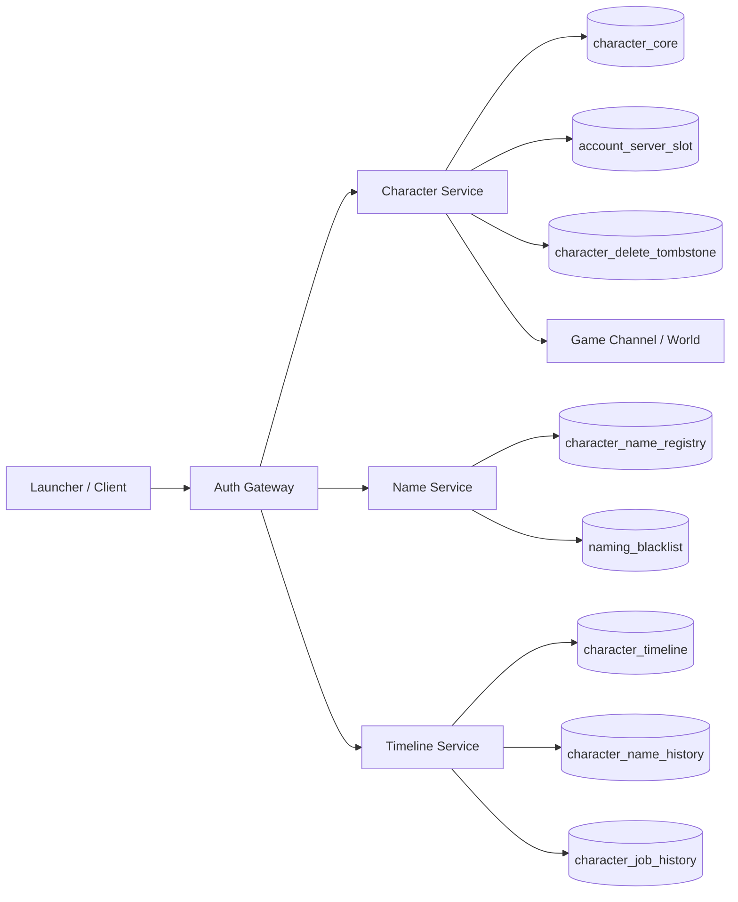
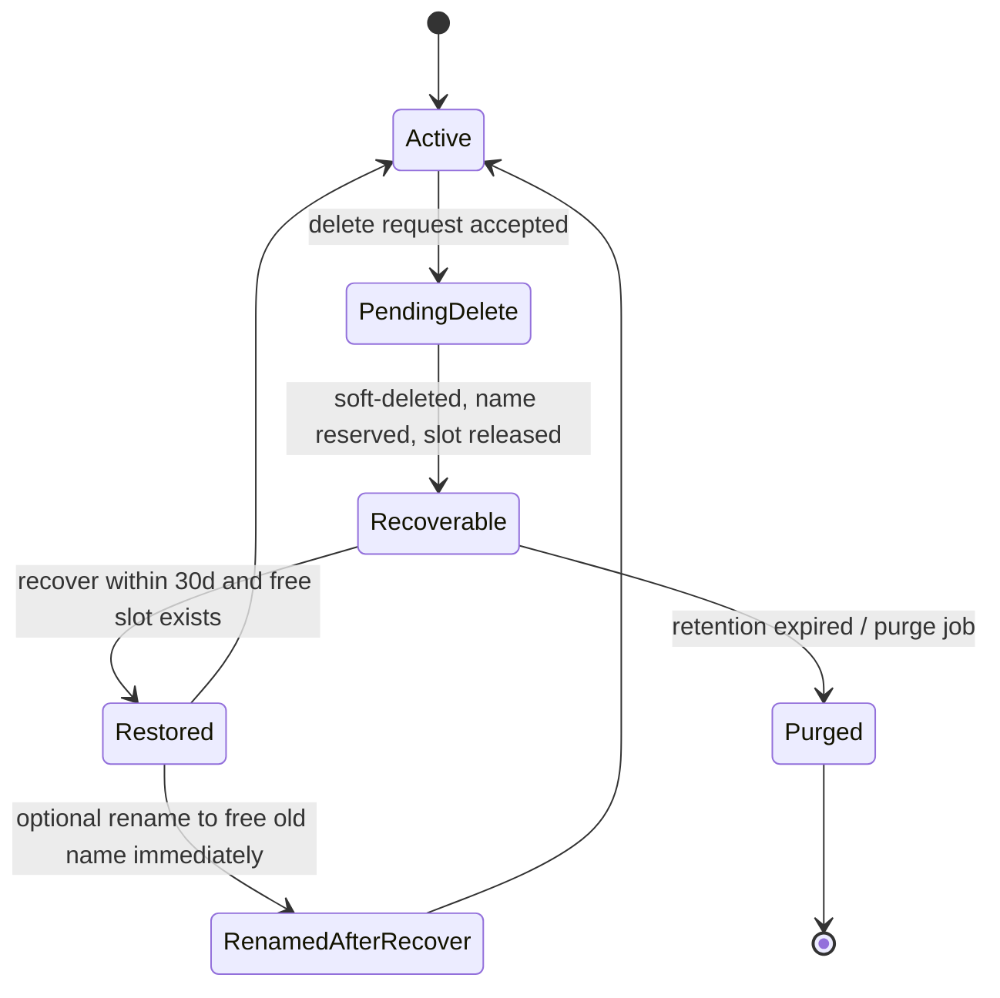
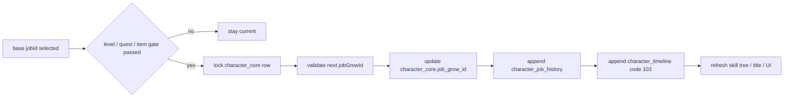

# DNF 角色侧子系统深研实现报告

## 执行摘要

这份报告把你要求的六个子系统——角色创建、角色槽位、角色删除、角色恢复、角色改名、职业选择与转职记录——拆成“**可证实的外显行为**”与“**可直接工程落地的内部实现**”两层来写。高把握证据主要来自 entity["company","Neople","south korean developer"] 开发者文档、entity["company","Nexon","game publisher"] 韩服 FAQ/更新，以及英文全球服公告；中把握证据来自公开流传的台服泄露端安装文档、数据库字段对照、触发器示例、登录器/网关说明和客户端资源逆向工具文档。官方层已经能确认 `jobId` / `jobGrowId`、时间线事件码 101/102/103、`beforeName` / `afterName`、删除保留约 30 天、恢复要求空槽位、已删除名字在保留期内不可直接复用、角色槽扩展按服务器维度生效、现代版本角色创建流程已简化为“职业选择 → 名称确认 → 游戏开始”等关键行为。台服泄露侧则能确认 `d_taiwan.limit_create_character`、`slang_list_name`、`taiwan_cain.charac_info`、`charac_view.charac_slot_limit`、`slot_effect_count`、`last_play_time`、`publickey.pem`、`Script.pvf`、`relay_ip`/`stun_ip` 等表名、字段名与部署元素确实存在。 citeturn28search0turn28search1turn29search0turn29search1turn39view0turn40view0turn42view2turn24search1turn24search6turn36search0turn27search2turn27search7

因此，**最稳妥的工程策略不是机械复刻泄露库 DDL，而是做“外显行为 1:1，内部模型归一化，保留旧字段别名与兼容层”**。也就是说：对外要做到和目标版本相同的角色名占用规则、删除/恢复时间线、职业/转职展示与日志语义；对内则使用更规范的 `character_core / character_name_registry / character_job_history / character_delete_tombstone / account_server_slot` 等归一化表，以便事务控制、审计、迁移和横向扩展。报告里所有“示例 SQL / 接口 / 二进制帧 / 客户端伪代码”均按这个原则给出；其中凡是不能从可信公开源直接确认到“官方原始 opcode/原始 DDL”的部分，我都显式标为**推定 / 兼容实现**，便于你在后续拿到更准的客户端 build、PVF、pcap 或原库时再替换。 citeturn29search1turn40view0turn24search5turn24search6turn34search1

## 证据分级与适用边界

这次检索能够把材料分成三层。**A 级证据**是官方公开文档：Neople Developers 的 DNF Open API 文档明确公开了 `/df/jobs`、`jobId`、`jobGrowId`、`jobGrowName`、时间线代码 101/102/103，以及名称变更所对应的 `beforeName` / `afterName` 字段；韩服 FAQ 明确公开了删除角色数据约保留 30 天、恢复需有空槽位、重复删恢复可能被限制、同名不可立即重建；韩服与全球服公告公开了槽位按服务器计、槽位扩展、现代角色创建 UI 流程、角色改名 Ticket 的检查与专用 UI，以及 2025 年 DFO 全服把“特殊符号可用于新建角色名”补到了创建流程里。 citeturn28search0turn28search1turn29search1turn39view0turn40view0turn41view2turn42view2turn43view0turn44search0

**B 级证据**是高风险但高价值的公开流传资料：台服泄露端教程、论坛表结构对照、触发器与活动配置例子，能够确认数据库库名/表名/字段名和多服务部署痕迹，例如 `d_taiwan.limit_create_character.count`、`slang_list_name`、`taiwan_cain.charac_view.charac_slot_limit`、`slot_effect_count`、`charac_stat.last_play_time`，以及 `/home/neople/game` 下的 `Script.pvf`、`publickey.pem`、`df_game_r`，登录器与网关、`relay_ip`、`stun_ip` 的存在。这些材料不适合作为可复制部署件，但非常适合作为“字段命名与系统边界”的参照物。 citeturn24search1turn24search5turn24search6turn34search1turn35search0turn36search0turn27search2turn27search7turn15view0

**C 级证据**是公开逆向工具与社区经验：例如 KoishiEx API 的 Wiki 文档能证明客户端 NPK/IMG 资源解析、职业类型资源浏览、ImagePack2 资源抽取在社区中已经工具化；而“带网关的简易登录器”社区帖子则直接指出“客户端登录器直连数据库”在安全上非常糟糕，采用网关层更合理。这层证据不解决官方行为定义，但能很好地指导“客户端资源组织方式”和“登录/网关安全边界”怎么设计。 citeturn45search0turn45search1turn38search1

基于这三层证据，本报告中的表结构与接口遵循三条边界：**官方可证实行为按官方来；泄露端字段名在兼容层保留；拿不到官方原始封包/DDL 的地方，不伪称‘已证实’，而是给出可执行的兼容实现方案。** 这是既能直接指导工程、又不把不确定信息冒充“原样复刻”的唯一稳妥写法。 citeturn29search1turn40view0turn24search6turn38search1

## 统一数据底座与服务拓扑

公开泄露端材料显示，典型 DNF 旧服/台服系部署至少包含：登录器与网关、游戏核心二进制 `df_game_r`、内容文件 `Script.pvf`、密钥文件 `publickey.pem`、以及若干频道/组队/中继相关配置项，如 `relay_ip`、`stun_ip`、`udp_ip_of_hades`、`ipg_ip`；同时还存在 `d_taiwan / taiwan_cain / taiwan_login / taiwan_billing` 这类分库。这说明角色相关子系统并不是“单体账号服务”能包掉的，而应拆成**认证层、角色服务、名称服务、历史/时间线服务、槽位/配额服务**。 citeturn15view0turn27search2turn27search5turn27search7turn36search0turn24search1turn24search4

下面这张图给出一个既能兼容旧式多服务拓扑、又适合现代后端落地的统一结构。图里的 `Character Service`、`Name Service`、`Timeline Service` 是我建议从 `charac_info`、`charac_view`、`slang_list_name`、官方 timeline 语义中抽出来的逻辑服务边界；如果你以后要做 API 兼容层，它们会非常有用。官方时间线对 101/102/103 的定义，也使“创建/改名/转职”天然适合事件化日志。 citeturn29search1turn28search0turn24search6turn24search5



公开源已经能确认部分旧表名和字段名，因此建议做**归一化表 + 旧字段别名映射**。这样既能让现代工程容易维护，也能在导入旧数据、做 GM 工具、跑兼容脚本时减少摩擦。下表里“泄露/公开字段”是有源痕迹，“目标归一化表”是工程落地建议。 `slot_effect_count` 的精确业务语义公开源并未完整解释，只能确认它属于“角色栏相关”字段，因此我把它归到“槽位 UI/展示扩展属性”而不是核心容量字段。 citeturn24search6turn24search5turn24search1turn34search1

| 泄露/公开表字段 | 可确认含义 | 目标归一化表 | 设计说明 |
|---|---|---|---|
| `d_taiwan.limit_create_character.count` | 角色创建限制/计数 | `account_server_slot.create_count_daily` | 用于配额与风控，不建议直接控制实际槽位 |
| `d_taiwan.slang_list_name` | 禁止取名列表 | `naming_blacklist` | 名称校验强依赖 |
| `taiwan_cain.charac_info` | 角色主信息 | `character_core` | 主键建议继续保留 bigint `char_id` |
| `taiwan_cain.charac_view.charac_slot_limit` | 角色槽开启数 | `account_server_slot.slot_limit` | 槽位上限的权威字段 |
| `taiwan_cain.charac_view.slot_effect_count` | 角色栏相关展示字段 | `account_server_slot.slot_effect_count` | 只做 UI/特效扩展，不作为容量真值 |
| `taiwan_cain.charac_stat.last_play_time` / `charac_info.last_play_time` | 最近游玩时间 | `character_core.last_play_at` | 删除恢复、回归活动、名称回收都要用 |
| 官方 timeline code `101/102/103` | 创建/改名/转职 | `character_timeline` | 强烈建议原码保留 |
| 官方 `beforeName/afterName` | 改名前后名称 | `character_name_history` | 审计、恢复与 API 兼容都要用 |
| 官方 `jobId/jobGrowId` | 职业主类 / 转职类 | `character_core` + `character_job_history` | 不要只存一个字段 |

表里的泄露字段和官方时间线字段都能在公开材料中找到；`character_*` 系列表是按照这些字段和官方行为做的归一化工程实现。 citeturn28search0turn28search1turn29search1turn24search5turn24search6turn34search1

因为公开台服资料和绝大多数示例触发器都采用 MySQL 风格，下面的可执行 DDL 以 **MySQL 8 + InnoDB** 为默认落地基线；如果你最后选 PostgreSQL，只需要把枚举、`ON DUPLICATE KEY`、时间默认值这些语法平移即可。这里的 DDL 不是泄露库原文，而是“兼容行为 + 明确事务语义”的整理版。 citeturn24search3turn24search6turn34search1turn35search0

```sql
CREATE TABLE account_server_slot (
    account_id           BIGINT      NOT NULL,
    server_id            VARCHAR(16) NOT NULL,
    slot_limit           SMALLINT    NOT NULL DEFAULT 2,
    slot_cap             SMALLINT    NOT NULL DEFAULT 100,
    used_count           SMALLINT    NOT NULL DEFAULT 0,
    slot_effect_count    SMALLINT    NOT NULL DEFAULT 0,
    create_count_daily   SMALLINT    NOT NULL DEFAULT 0,
    create_quota_reset_at DATETIME   NOT NULL,
    updated_at           DATETIME    NOT NULL DEFAULT CURRENT_TIMESTAMP
                                       ON UPDATE CURRENT_TIMESTAMP,
    PRIMARY KEY (account_id, server_id),
    KEY ix_slot_server (server_id, slot_limit)
) ENGINE=InnoDB;

CREATE TABLE character_core (
    char_id              BIGINT       NOT NULL AUTO_INCREMENT,
    account_id           BIGINT       NOT NULL,
    server_id            VARCHAR(16)  NOT NULL,
    slot_no              SMALLINT     NULL,
    char_name            VARCHAR(64)  NOT NULL,
    name_norm            VARBINARY(128) NOT NULL,
    job_id               VARCHAR(64)  NOT NULL,
    job_grow_id          VARCHAR(64)  NULL,
    level                INT          NOT NULL DEFAULT 1,
    state                ENUM('active','pending_delete','purged') NOT NULL DEFAULT 'active',
    created_at           DATETIME     NOT NULL DEFAULT CURRENT_TIMESTAMP,
    last_play_at         DATETIME     NULL,
    delete_requested_at  DATETIME     NULL,
    delete_expire_at     DATETIME     NULL,
    version              INT          NOT NULL DEFAULT 0,
    PRIMARY KEY (char_id),
    UNIQUE KEY uq_slot_active (account_id, server_id, slot_no),
    KEY ix_account_server_state (account_id, server_id, state),
    KEY ix_server_name (server_id, name_norm)
) ENGINE=InnoDB;

CREATE TABLE naming_blacklist (
    match_type           ENUM('exact','contains','regex') NOT NULL,
    pattern_text         VARCHAR(128) NOT NULL,
    locale               VARCHAR(16)  NOT NULL DEFAULT 'global',
    enabled              TINYINT(1)   NOT NULL DEFAULT 1,
    PRIMARY KEY (match_type, pattern_text, locale)
) ENGINE=InnoDB;

CREATE TABLE character_name_registry (
    server_id            VARCHAR(16)     NOT NULL,
    name_norm            VARBINARY(128)  NOT NULL,
    char_id              BIGINT          NULL,
    status               ENUM('active','deleted_reserved','released') NOT NULL,
    delete_expire_at     DATETIME        NULL,
    updated_at           DATETIME        NOT NULL DEFAULT CURRENT_TIMESTAMP
                                          ON UPDATE CURRENT_TIMESTAMP,
    PRIMARY KEY (server_id, name_norm),
    KEY ix_name_status_expire (status, delete_expire_at)
) ENGINE=InnoDB;

CREATE TABLE character_name_history (
    id                   BIGINT       NOT NULL AUTO_INCREMENT,
    char_id              BIGINT       NOT NULL,
    server_id            VARCHAR(16)  NOT NULL,
    before_name          VARCHAR(64)  NULL,
    after_name           VARCHAR(64)  NOT NULL,
    timeline_code        INT          NOT NULL, -- 101 create / 102 rename
    reason               VARCHAR(32)  NOT NULL, -- create / rename_ticket / admin / recovery_rename
    actor_account_id     BIGINT       NOT NULL,
    created_at           DATETIME     NOT NULL DEFAULT CURRENT_TIMESTAMP,
    PRIMARY KEY (id),
    KEY ix_char_time (char_id, created_at DESC)
) ENGINE=InnoDB;

CREATE TABLE character_job_history (
    id                   BIGINT       NOT NULL AUTO_INCREMENT,
    char_id              BIGINT       NOT NULL,
    job_id               VARCHAR(64)  NOT NULL,
    from_job_grow_id     VARCHAR(64)  NULL,
    to_job_grow_id       VARCHAR(64)  NULL,
    stage                SMALLINT     NOT NULL, -- 0=create/base, 1=1st, 2=2nd, 3=true/neo
    timeline_code        INT          NOT NULL, -- 101 / 103
    source               VARCHAR(32)  NOT NULL, -- create / quest / item / admin
    created_at           DATETIME     NOT NULL DEFAULT CURRENT_TIMESTAMP,
    PRIMARY KEY (id),
    KEY ix_job_hist (char_id, created_at DESC)
) ENGINE=InnoDB;

CREATE TABLE character_delete_tombstone (
    char_id              BIGINT       NOT NULL,
    account_id           BIGINT       NOT NULL,
    server_id            VARCHAR(16)  NOT NULL,
    released_slot_no     SMALLINT     NULL,
    deleted_name         VARCHAR(64)  NOT NULL,
    name_norm            VARBINARY(128) NOT NULL,
    deleted_at           DATETIME     NOT NULL,
    recover_until        DATETIME     NOT NULL,
    recoverable          TINYINT(1)   NOT NULL DEFAULT 1,
    restored_at          DATETIME     NULL,
    purged_at            DATETIME     NULL,
    PRIMARY KEY (char_id),
    KEY ix_recover_until (server_id, recover_until, recoverable)
) ENGINE=InnoDB;

CREATE TABLE character_timeline (
    id                   BIGINT       NOT NULL AUTO_INCREMENT,
    char_id              BIGINT       NOT NULL,
    server_id            VARCHAR(16)  NOT NULL,
    code                 INT          NOT NULL, -- official style timeline code
    payload_json         JSON         NOT NULL,
    created_at           DATETIME     NOT NULL DEFAULT CURRENT_TIMESTAMP,
    PRIMARY KEY (id),
    KEY ix_timeline_char_time (char_id, created_at DESC),
    KEY ix_timeline_code_time (code, created_at DESC)
) ENGINE=InnoDB;
```

统一接口层建议同时支持 **REST（Launcher/Web/GM/Admin）** 与 **二进制 RPC（客户端网关）**。公开材料虽然能证明登录器、公钥、网关、多端口和数据库存在，但没有找到可信、可合法直接引用的官方原始 opcode/pcap，因此下面的网络帧我会按“兼容实现示意”来给，而把真正需要严格对外一致的语义放进 REST + timeline 事件层；这能把大部分不确定性收束到网关适配层。 citeturn15view0turn27search2turn36search0turn38search1turn29search1

并发与事务方面，六个子系统都可以复用同一套基线：**账户-服务器槽位行锁、名称注册行锁、角色主行锁、历史表只追加、时间线只追加**。这样大多数关键路径都能在 `READ COMMITTED + SELECT ... FOR UPDATE` 下安全完成，不必全局上 `SERIALIZABLE`。最怕的是“同账号并行建角”“改名与删除并发”“恢复与新建抢同一空槽”“同名竞争”，这些都应该靠**窄行锁 + 幂等键 + 唯一索引**解决，而不是靠悲观大事务包住整库。官方行为里“恢复需要空槽位”“已删除名称不能立即复用”正好为这种实现提供了外显依据。 citeturn40view0turn24search3turn24search5

## 角色创建与角色槽位

### 角色创建系统

韩服 2026 年的角色选择窗口更新已经把新建角色流程明确改成“**职业选择 → 角色名确定 → 游戏开始**”，并且空槽位会出现更强的“+”视觉提示；DFO 2025 公告则说明角色创建名字符集与改名名字符集在 2025 年 4 月后被对齐，特殊符号不再只限改名 Ticket。这说明角色创建系统至少要满足四件事：**槽位可见且可分配、职业选择绑定创建本身、名称校验与改名共用同一套规则、创建动作即时落到时间线 101**。 citeturn39view0turn42view2turn29search1

| 类别 | 角色创建系统需求清单 | 证据/把握 |
|---|---|---|
| 认证 | 只能在已登录、已选服务器上下文创建 | 高 |
| 槽位 | 仅在可用槽位内创建；空槽位可视化 | 高 |
| 职业 | 创建时至少选择 `jobId`，现代版本可同时落 `jobGrowId` | 高 |
| 名称 | 与改名分享统一校验器、黑名单和唯一性规则 | 高 |
| 历史 | 创建必须写 timeline 101 和名称历史首条记录 | 高 |
| 扩展 | 可挂接“新角色特权/回归活动/赠礼”等 post-create hook | 中 |
| 风控 | 同账号建角频控、幂等、重放保护、名称抢注保护 | 高 |
| 客户端 | 创建成功后可直接进入游戏，不必回角色列表二跳 | 高 |

台服泄露文档里 `limit_create_character.count` 被用来做“创建角色限制/计数”的修改，甚至有论坛通过 trigger 或 event 把它持续改回 0 来绕过限制；另有活动贴出现 `EventNewCharacterReward` 这类新角色特权事件配置。这两类信息表明：旧系实现不仅有“槽位”概念，还有“**配额/活动门禁**”概念，而且新建角色后常常会触发额外逻辑。因此工程上不要把 `slot_limit` 和 `create_count_daily` 混为一谈，它们应是两个不同维度。 citeturn24search3turn24search6turn34search1turn33search3

下面是我建议的创建接口。由于 `jobId` / `jobGrowId` 已在官方 Open API 中公开，建议内部接口也直接使用这两组 canonical id，而不是自造一个“职业整型码”。这样以后接入外部角色检索、技能树、排行、时间线时最省事。 citeturn28search0turn28search1

```http
POST /v1/characters
Authorization: Bearer <account-session>
Idempotency-Key: 8b1d2a63-6f9b-4df4-a5a9-2a1c1d0f77d2
Content-Type: application/json

{
  "serverId": "cain",
  "slotNo": 11,
  "jobId": "slayer_m",
  "jobGrowId": null,
  "name": "AresX1",
  "clientBuild": "2026.03.11-kdnf",
  "creationMode": "base_only"
}
```

```json
{
  "characterId": 912345678,
  "serverId": "cain",
  "slotNo": 11,
  "jobId": "slayer_m",
  "jobGrowId": null,
  "state": "active",
  "timeline": {
    "code": 101,
    "id": 600000321
  },
  "enterGameDirectly": true
}
```

这个接口的关键校验规则建议写死在服务端，而不是信任客户端。公开源已经证明名称黑名单表确实存在，并且缺失 `slang` / `slang_list_name` 会导致 global data 初始化失败；因此名称校验绝不能只写在前端。推荐校验顺序是：**Unicode 归一化（NFKC）→ 空白/不可见字符剔除 → 长度 → `slang_list_name` 精确/包含/正则匹配 → 服务器内唯一性 → 删除保留名检查 → 特殊符号白名单检查**。其中“特殊符号是否开放”应是配置项，因为 DFO 直到 2025-04-15 才把它补进新建流程。 citeturn35search0turn24search6turn42view2

```sql
START TRANSACTION;

-- 1) 锁账户/服务器槽位
SELECT slot_limit, used_count, create_count_daily, create_quota_reset_at
FROM account_server_slot
WHERE account_id = :account_id AND server_id = :server_id
FOR UPDATE;

-- 2) 锁名称注册
SELECT status, char_id, delete_expire_at
FROM character_name_registry
WHERE server_id = :server_id AND name_norm = :name_norm
FOR UPDATE;

-- 3) 插入角色主表
INSERT INTO character_core (
    account_id, server_id, slot_no, char_name, name_norm,
    job_id, job_grow_id, level, state, created_at, version
) VALUES (
    :account_id, :server_id, :slot_no, :char_name, :name_norm,
    :job_id, :job_grow_id, 1, 'active', NOW(), 0
);

SET @new_char_id = LAST_INSERT_ID();

-- 4) 占用名称
INSERT INTO character_name_registry(server_id, name_norm, char_id, status, updated_at)
VALUES (:server_id, :name_norm, @new_char_id, 'active', NOW());

-- 5) 更新槽位占用与当日创建计数
UPDATE account_server_slot
SET used_count = used_count + 1,
    create_count_daily = CASE
        WHEN create_quota_reset_at <= NOW() THEN 1
        ELSE create_count_daily + 1
    END,
    create_quota_reset_at = CASE
        WHEN create_quota_reset_at <= NOW() THEN DATE_ADD(CURDATE(), INTERVAL 1 DAY)
        ELSE create_quota_reset_at
    END
WHERE account_id = :account_id AND server_id = :server_id;

-- 6) 写时间线与历史
INSERT INTO character_name_history (
    char_id, server_id, before_name, after_name,
    timeline_code, reason, actor_account_id
) VALUES (
    @new_char_id, :server_id, NULL, :char_name, 101, 'create', :account_id
);

INSERT INTO character_job_history (
    char_id, job_id, from_job_grow_id, to_job_grow_id,
    stage, timeline_code, source
) VALUES (
    @new_char_id, :job_id, NULL, :job_grow_id, 0, 101, 'create'
);

INSERT INTO character_timeline (
    char_id, server_id, code, payload_json
) VALUES (
    @new_char_id, :server_id, 101,
    JSON_OBJECT('name', :char_name, 'jobId', :job_id, 'jobGrowId', :job_grow_id, 'slotNo', :slot_no)
);

COMMIT;
```

如果你需要客户端网关走二进制协议，下面这个帧可以作为**兼容实现示意**。它不是官方 pcaps 的原样复刻，而是我基于“多服务网关 + 数据库落库 + 时间线事件 + 可配置职业 id”的证据重构出来的建议帧；真正的官方 opcode/帧头没有可靠公开源可直接引用。 citeturn15view0turn36search0turn29search1turn28search0

```text
CREATE_CHARACTER_REQ  (illustrative, little-endian)

001D | 1201 | 00003039 | 000000000000007B | 00 | 01 | 0B | 07 736C617965725F6D | 00 | 06 417265735831
len  | op   | seq      | account_id        | fl | svr|slot| jobId("slayer_m")  | 00 | name("AresX1")
```

客户端逻辑建议和服务端职责明确分离。新版韩服已经把创建成功后的跳转缩短为直接游戏开始，这意味着客户端不再应该自己拼装复杂状态机，只要做表单校验、能力查询与幂等提交即可。 citeturn39view0

```ts
async function createCharacter(form: CreateForm) {
  const normalizedName = normalizeName(form.name);   // 前端预检，后端仍需复检
  const slot = await api.getSlotAvailability(form.serverId, form.slotNo);
  if (!slot.creatable) throw new Error(slot.reason);

  const res = await api.createCharacter({
    serverId: form.serverId,
    slotNo: form.slotNo,
    jobId: form.jobId,
    jobGrowId: form.jobGrowId ?? null,
    name: normalizedName
  }, { idempotencyKey: crypto.randomUUID() });

  await cache.put(`char:${res.characterId}`, res);
  if (res.enterGameDirectly) {
    return gateway.enterGame(res.characterId);
  }
  return ui.backToCharacterSelect();
}
```

异常与恢复流程上，创建系统至少要覆盖四类故障：其一，**名称已被并发占用**，直接返回 `NAME_TAKEN`；其二，**槽位在确认页后被并发消费**，返回 `SLOT_FULL` 并刷新列表；其三，**DB 已提交但 ACK 丢失**，依赖 `Idempotency-Key` 返回已创建结果；其四，**post-create hook 失败**，不能回滚主角色，必须把失败写入补偿队列，避免“角色没了但赠礼也没了”的双损状态。后一种尤其重要，因为公开活动示例已经体现出“新角色特权事件”是独立于主创建事务之外的附加行为。 citeturn33search3turn39view0

### 角色槽位系统

韩服官方材料可以确认三个关键点：**槽位扩展按服务器生效、槽位扩展是即时生效、现代角色选择页会按槽位数扩展偏好页/显示能力**。历史上 2011 年先是按服务器出售槽位扩展套件，购买后新槽位出现在角色列表底部；2014 年官方又把可购扩展数提升到 75 个，并明确总槽位可扩至 100。现代更新仍强调偏好页扩展信息是“服务器별 개별 적용(按服务器单独适用)”，说明“每账号每服务器”仍然是正确的主键粒度。 citeturn43view0turn44search0turn39view0

| 类别 | 角色槽位系统需求清单 | 证据/把握 |
|---|---|---|
| 粒度 | 槽位按 `account_id + server_id` 管理 | 高 |
| 生效 | 槽位扩展即时生效，不走异步审批 | 高 |
| UI | 空槽位、偏好页、隐藏角色等都受槽位数影响 | 高 |
| 上限 | 历史资料可证实总上限至少到 100；当前区域上限应配置化 | 高 |
| 恢复 | 被删角色恢复时需要空槽位 | 高 |
| 风控 | 槽位解锁须幂等，商城/奖励双写需防重复发放 | 高 |
| 兼容 | 保留 `charac_slot_limit` 和 `slot_effect_count` 兼容字段 | 中 |

公开泄露端把 `charac_view.charac_slot_limit` 和 `slot_effect_count` 标成“角色栏相关”，另有教程通过 trigger 把 `charac_slot_limit = 18` 改回 2 来测试“新账号只锁 2 个角色”。从工程角度，这进一步印证 `charac_slot_limit` 更像账户-服务器级槽位开关，而不是某一角色自身属性。建议把它抽成 `account_server_slot` 的权威字段，并只把旧字段当成兼容投影。 citeturn24search5turn24search6

槽位查询接口建议独立出来，因为创建、恢复、商城发货、GM 补偿都要用。现代 DFO 还支持在 Content Status UI 里隐藏角色，且“每账号最多可隐藏 100 个角色”；这说明 UI 层“可显示角色集”和“可创建槽位集”应该分离，不要把隐藏和删除混成一个状态。 citeturn41view2

```http
GET /v1/character-slots?serverId=cain
Authorization: Bearer <account-session>
```

```json
{
  "serverId": "cain",
  "slotLimit": 28,
  "slotCap": 100,
  "usedCount": 24,
  "freeSlots": [24, 25, 26, 27],
  "ui": {
    "slotEffectCount": 3,
    "favoritePageCount": 2
  }
}
```

```http
POST /v1/character-slots/unlock
Authorization: Bearer <account-session>
Idempotency-Key: 70d7cf59-f595-4e47-af13-7e58d0743278
Content-Type: application/json

{
  "serverId": "cain",
  "source": "shop_item",
  "sourceRef": "item:2660239",
  "count": 1
}
```

```sql
START TRANSACTION;

SELECT slot_limit, slot_cap
FROM account_server_slot
WHERE account_id = :account_id AND server_id = :server_id
FOR UPDATE;

UPDATE account_server_slot
SET slot_limit = LEAST(slot_limit + :count, slot_cap),
    updated_at = NOW()
WHERE account_id = :account_id AND server_id = :server_id;

INSERT INTO character_timeline(char_id, server_id, code, payload_json)
VALUES (
    0, :server_id, 901,
    JSON_OBJECT('type','slot_unlock','accountId',:account_id,'count',:count,'source',:source,'sourceRef',:source_ref)
);

COMMIT;
```

槽位系统的核心并发点只有两个：**解锁**与**消费**。消费发生在创建/恢复时，解锁发生在商城/补偿/活动发放时。你可以把所有消费逻辑都收束到“账户-服务器槽位行锁”上，从而避免扫描角色表做 `COUNT(*)`。而恢复系统之所以要单独强调“需空槽位”，恰恰说明删除本身应该释放槽位占用，否则恢复时不可能额外要求空槽。这个推断和官方 FAQ 完全一致，也比“墓碑继续占槽”的实现更接近官方外显行为。 citeturn40view0

## 删除恢复与改名

### 角色删除与恢复系统

韩服 FAQ 对删除/恢复系统给出的约束非常具体：已删除角色数据**约保留 30 天**；超过期限不可恢复；恢复时**若角色槽不足则不可恢复**；同名删除角色在保留期内会拦住新建；如果先恢复删除角色，再改成别名，则原名可以立刻被别人/自己使用；反复删除与恢复还可能被人工限制；甚至“决斗场角色删除后不可恢复”。这已经足以定义出一个完整的状态机，而不用猜。 citeturn40view0



这套行为最自然的实现并不是“真删”，而是**软删除 + 墓碑表 + 名称保留表**。删除时把 `character_core.state` 置为 `pending_delete`，把槽位释放回 `account_server_slot`，把名称在 `character_name_registry` 里改成 `deleted_reserved`，同时写入 `character_delete_tombstone`。恢复时再重新分配一个空槽位，把状态改回 `active`。这样才能同时满足“删除后槽位可继续使用”和“恢复时必须有空槽位”这两个官方行为。 citeturn40view0

| 类别 | 删除/恢复系统需求清单 | 证据/把握 |
|---|---|---|
| 保留期 | 删除后约 30 天可恢复 | 高 |
| 槽位 | 删除释放槽位；恢复需有空槽 | 高（后半为官方，前半为基于官方行为的强推定） |
| 名称 | 删除后原名继续保留，不可直接抢注 | 高 |
| 改名联动 | 恢复后改名可立即释放旧名 | 高 |
| 风控 | 反复删恢复需限频或人工介入 | 高 |
| 类型限制 | 某些特殊角色可声明不可恢复 | 高 |
| 历史 | 删除/恢复都必须留审计数据 | 高 |
| 回收 | 到期 purge 释放名称并做最终清理 | 高 |

删除接口建议做成**两段式验证**：先要求密码/OTP/二次确认，再下发真正删除请求。因为公开泄露端环境里“登录器直连数据库”“固定密钥可推启动参数”的风险已经被社区明确指出过；只要你把“删除角色”做成弱认证动作，就等于把最难恢复的数据暴露在最脆弱的链路上。 citeturn38search1turn27search2

```http
POST /v1/characters/{characterId}/delete
Authorization: Bearer <account-session>
Idempotency-Key: 2af0e4b9-6fe8-4bbd-8c75-8fcde0c2372d
Content-Type: application/json

{
  "stepUpToken": "otp:998271",
  "reason": "user_request"
}
```

```json
{
  "characterId": 912345678,
  "state": "pending_delete",
  "deletedAt": "2026-04-30T12:03:24+08:00",
  "recoverUntil": "2026-05-30T12:03:24+08:00",
  "releasedSlotNo": 11,
  "nameReserved": true
}
```

```sql
START TRANSACTION;

SELECT char_id, account_id, server_id, slot_no, char_name, name_norm, state
FROM character_core
WHERE char_id = :char_id AND account_id = :account_id
FOR UPDATE;

SELECT slot_limit, used_count
FROM account_server_slot
WHERE account_id = :account_id AND server_id = :server_id
FOR UPDATE;

SELECT status
FROM character_name_registry
WHERE server_id = :server_id AND name_norm = :name_norm
FOR UPDATE;

UPDATE character_core
SET state = 'pending_delete',
    delete_requested_at = NOW(),
    delete_expire_at = DATE_ADD(NOW(), INTERVAL 30 DAY),
    slot_no = NULL,
    version = version + 1
WHERE char_id = :char_id;

UPDATE account_server_slot
SET used_count = GREATEST(used_count - 1, 0)
WHERE account_id = :account_id AND server_id = :server_id;

UPDATE character_name_registry
SET status = 'deleted_reserved',
    delete_expire_at = DATE_ADD(NOW(), INTERVAL 30 DAY),
    updated_at = NOW()
WHERE server_id = :server_id AND name_norm = :name_norm AND char_id = :char_id;

INSERT INTO character_delete_tombstone(
    char_id, account_id, server_id, released_slot_no,
    deleted_name, name_norm, deleted_at, recover_until
) VALUES (
    :char_id, :account_id, :server_id, :old_slot_no,
    :char_name, :name_norm, NOW(), DATE_ADD(NOW(), INTERVAL 30 DAY)
);

INSERT INTO character_timeline(char_id, server_id, code, payload_json)
VALUES (
    :char_id, :server_id, 902,
    JSON_OBJECT('type','delete','recoverUntil',DATE_ADD(NOW(), INTERVAL 30 DAY))
);

COMMIT;
```

恢复接口则必须把**槽位重新分配**放进同一个事务。这里不要尝试“恢复到原槽位”，因为原槽位可能已经被别人/自己新建角色占掉；恢复动作应该只保证“恢复为 active 且占用一个当前可用槽”。这比坚持原槽位更符合官方“只要有空槽就能恢复”的描述。 citeturn40view0

```http
POST /v1/characters/{characterId}/recover
Authorization: Bearer <account-session>
Idempotency-Key: 53780baa-44b4-4da3-87d3-6d70f977b473
Content-Type: application/json

{
  "stepUpToken": "otp:551204",
  "preferredSlotNo": 11
}
```

```sql
START TRANSACTION;

SELECT char_id, account_id, server_id, name_norm, recover_until, recoverable, restored_at, purged_at
FROM character_delete_tombstone
WHERE char_id = :char_id AND account_id = :account_id
FOR UPDATE;

SELECT slot_limit, used_count
FROM account_server_slot
WHERE account_id = :account_id AND server_id = :server_id
FOR UPDATE;

-- 通过 application logic 选择一个 free slot_no，并保证不与 active 角色重复
-- 如 preferredSlotNo 不可用，则回退到最小空槽

UPDATE character_core
SET state = 'active',
    slot_no = :allocated_slot_no,
    delete_requested_at = NULL,
    delete_expire_at = NULL,
    version = version + 1
WHERE char_id = :char_id;

UPDATE account_server_slot
SET used_count = used_count + 1
WHERE account_id = :account_id AND server_id = :server_id;

UPDATE character_name_registry
SET status = 'active',
    char_id = :char_id,
    delete_expire_at = NULL,
    updated_at = NOW()
WHERE server_id = :server_id AND name_norm = :name_norm;

UPDATE character_delete_tombstone
SET restored_at = NOW(),
    recoverable = 0
WHERE char_id = :char_id;

INSERT INTO character_timeline(char_id, server_id, code, payload_json)
VALUES (
    :char_id, :server_id, 903,
    JSON_OBJECT('type','recover','slotNo',:allocated_slot_no)
);

COMMIT;
```

需要重点测试的边界有：**恢复时无空槽**、**恢复窗口刚好过期**、**已被标记不可恢复的特殊角色**、**角色主表恢复成功但名称注册更新失败**、**purge 定时任务与人工恢复同时操作**。其中最后一个最容易出事故，必须让 `character_delete_tombstone` 成为恢复与最终清理的唯一锁点。官方 FAQ 还明确提到删除角色可通过时间线页面辅助确认，这意味着删除/恢复过程本身应具备可追溯审计而不是只靠客服人工记忆。 citeturn40view0turn29search0

### 角色改名系统

官方已经明确公开了两条对改名系统极关键的信息。第一，时间线字段里存在 `beforeName` / `afterName`，且时间线代码 102 对应“角色名变更”；第二，DFO 公告说明 2025-04-15 之后“创建角色”与“角色改名 Ticket”在特殊符号字符集上被对齐，且 DFO 还给 Ticket UI 增加了，可理解为“查重 / 检查可用性”的显式按钮。**这意味着改名不能只是 `UPDATE charac_info SET name=?`，而必须是‘名称注册变更 + 名称历史追加 + 时间线 102 事件 + 名称可用性查询接口’的组合事务。** citeturn28search1turn29search1turn41view2turn42view2

| 类别 | 改名系统需求清单 | 证据/把握 |
|---|---|---|
| 唯一性 | 服务器维度唯一，必须支持显式可用性检查 | 高 |
| 历史 | 必须记录前名与后名 | 高 |
| 时间线 | 写 102 事件 | 高 |
| 字符集 | 与创建共享规则；特殊符号按 build/region 配置 | 高 |
| 删除联动 | 被删角色保留的名字在保留期内不可抢注 | 高 |
| 恢复联动 | 恢复后改名应立即释放旧名 | 高 |
| 审计 | 必须记录操作者、来源（ticket/admin/support） | 高 |
| 风控 | 改名频率、ticket 消耗、客服强制改名都要分来源记录 | 高 |

推荐把“名称可用性”做成独立接口，因为现代 DFO Ticket UI 已经有显式 Check Availability 按钮；如果不单独做，你的客户端就只能不断试提交，再依赖错误码兜底，体验和官方不一致。 citeturn41view2

```http
GET /v1/characters/name-availability?serverId=cain&name=AresX1
Authorization: Bearer <account-session>
```

```json
{
  "serverId": "cain",
  "name": "AresX1",
  "normalized": "aresx1",
  "available": false,
  "reason": "deleted_reserved"
}
```

```http
POST /v1/characters/{characterId}/rename
Authorization: Bearer <account-session>
Idempotency-Key: 240e6c70-8769-48b7-8f1e-397de4c13fbe
Content-Type: application/json

{
  "newName": "AresX2",
  "source": "rename_ticket",
  "sourceRef": "ticket:character_rename_2025"
}
```

```json
{
  "characterId": 912345678,
  "beforeName": "AresX1",
  "afterName": "AresX2",
  "timeline": {
    "code": 102,
    "id": 600000511
  }
}
```

```sql
START TRANSACTION;

SELECT char_id, account_id, server_id, char_name, name_norm, state
FROM character_core
WHERE char_id = :char_id AND account_id = :account_id
FOR UPDATE;

SELECT status, char_id, delete_expire_at
FROM character_name_registry
WHERE server_id = :server_id AND name_norm = :new_name_norm
FOR UPDATE;

SELECT status
FROM character_name_registry
WHERE server_id = :server_id AND name_norm = :old_name_norm
FOR UPDATE;

UPDATE character_name_registry
SET status = 'released',
    updated_at = NOW()
WHERE server_id = :server_id
  AND name_norm = :old_name_norm
  AND char_id = :char_id
  AND status = 'active';

INSERT INTO character_name_registry(server_id, name_norm, char_id, status, updated_at)
VALUES (:server_id, :new_name_norm, :char_id, 'active', NOW())
ON DUPLICATE KEY UPDATE
    char_id = VALUES(char_id),
    status = 'active',
    delete_expire_at = NULL,
    updated_at = NOW();

UPDATE character_core
SET char_name = :new_name,
    name_norm = :new_name_norm,
    version = version + 1
WHERE char_id = :char_id;

INSERT INTO character_name_history(
    char_id, server_id, before_name, after_name,
    timeline_code, reason, actor_account_id
) VALUES (
    :char_id, :server_id, :old_name, :new_name, 102, :reason, :account_id
);

INSERT INTO character_timeline(char_id, server_id, code, payload_json)
VALUES (
    :char_id, :server_id, 102,
    JSON_OBJECT('beforeName', :old_name, 'afterName', :new_name, 'source', :reason)
);

COMMIT;
```

如果你需要二进制网关帧，改名请求可以参考下面这个**兼容实现示意**。同样强调：这是为了帮助你把网关适配层做出来，不是官方 opcode 揭示。真正必须一致的是它在事务层写出的 `beforeName/afterName` 和 timeline 102。 citeturn29search1turn41view2turn42view2

```text
RENAME_CHARACTER_REQ (illustrative, little-endian)

0018 | 1205 | 0000303A | 4E6F653600000000 | 00 | 4E6F6536 | 06 417265735832
len  | op   | seq      | char_id          | fl | char_id | newName("AresX2")
```

改名校验的关键算法，建议采用下面这组规则。它们几乎都能直接映射到官方/泄露端的材料：`slang_list_name` 负责脏词，官方改名/创建共用字符规则，已删除名在保留期内锁定，时间线保存前名后名。唯一需要你自己补的，是**Unicode 混淆字符（confusable）** 防护与**频率限制**。这两项虽然不是公开源直接写出来的，但在现代正式服里几乎是必需的。 citeturn35search0turn40view0turn42view2turn29search1

客户端逻辑伪代码如下：

```ts
async function renameCharacter(characterId: number, newName: string) {
  const normalized = normalizeName(newName);
  const check = await api.checkNameAvailability(currentServerId(), normalized);
  if (!check.available) throw new Error(check.reason);

  const res = await api.renameCharacter(characterId, {
    newName: normalized,
    source: 'rename_ticket',
    sourceRef: consumeRenameTicket()
  }, { idempotencyKey: crypto.randomUUID() });

  ui.toast(`已改名：${res.beforeName} -> ${res.afterName}`);
  timeline.invalidate(characterId);
  roster.refresh();
}
```

## 职业选择与转职记录

### 职业选择系统

官方 Open API 已经把 `jobId`、`jobName`、`jobGrowId`、`jobGrowName`、`/df/jobs` 和 `/df/skills/:jobId?jobGrowId=...` 这套职业主数据模型公开得很清楚；韩服角色页则把“主职业族 → 转职分支 → 一觉/二觉/真觉醒”的视觉层级展示得非常明确，像 검귀(鬼剑/剑鬼)、데몬슬레이어(恶魔猎手) 这类页面都能看到 1 次觉醒 Lv.50、2 次觉醒 Lv.75、真觉醒 Lv.100 的节奏。换句话说，**职业选择系统内部必须至少保存两层 id：职业族 `jobId`，以及当前转职 `jobGrowId`。** 只存其中之一，后面无论做技能树、时间线还是外部 API 兼容都会很痛苦。 citeturn28search0turn28search1turn48search0turn48search1turn48search3

还有一个很重要的版本差异。现代韩服更新文案只写“职业选择 → 角色名确定 → 游戏开始”，但并没有在这一句里限定到底是“只选 base class”还是“可直接选具体转职”；而官方职业数据模型又天然分成 `jobId` / `jobGrowId`。因此工程上最好的方式是把创建模式做成配置：**`creation_job_mode = base_only | allow_subclass_at_create`**。这样既能兼容经典 60/70/85 系构建，也能兼容现代直接选分支的客户端。 citeturn39view0turn28search0

| 类别 | 职业选择系统需求清单 | 证据/把握 |
|---|---|---|
| 主数据 | 职业族与转职类必须拆成 `jobId` / `jobGrowId` | 高 |
| 版本兼容 | 创建时是否允许直接选转职应配置化 | 高 |
| 技能树 | 技能列表按 `jobId + jobGrowId` 联合定位 | 高 |
| 展示 | 角色列表、角色详情、时间线都要能显示 `jobGrowName` | 高 |
| 创建联动 | 创建成功时 `character_job_history` 必有 stage 0 记录 | 高 |
| 审计 | 任何职业来源变更都要追踪 | 高 |

建议准备一个职业主数据表，用于承接官方 `/df/jobs` 导出的 canonical ids，也用于本地静态配置。对于老版本 PVF，你可以把它作为“显示层映射表”；对于现代版本，你可以直接用它做真实 master data。 citeturn28search0turn48search0

| 表 | 核心字段 | 说明 |
|---|---|---|
| `job_master` | `job_id PK`, `job_name`, `class_family_order`, `enabled` | 主职业族 |
| `job_grow_master` | `job_id`, `job_grow_id PK`, `job_grow_name`, `stage`, `required_level`, `enabled` | 转职与觉醒链 |
| `job_skill_binding` | `job_id`, `job_grow_id`, `skill_id`, `required_level` | 如需内建技能树缓存 |

一个实用的职业选择接口如下：

```http
POST /v1/characters/{characterId}/job-select
Authorization: Bearer <account-session>
Idempotency-Key: 6c903627-0d8d-42c2-b3c6-6022497dec8a
Content-Type: application/json

{
  "jobId": "slayer_m",
  "jobGrowId": "ghostblade",
  "mode": "allow_subclass_at_create"
}
```

如果目标版本是经典服，创建阶段只写 `jobId`，`jobGrowId = null`；如果目标版本是现代直选分支，创建阶段就应同时填充二者，并把 `character_job_history.stage = 0` 或 `1` 做得跟客户端表现一致。重点不是“全版本统一一个流程”，而是“内部模型统一、外部行为按 build 控制”。这是整个职业系统最关键的兼容点。 citeturn28search0turn39view0turn48search0

### 转职记录系统

官方 timeline code 已经给了我们一个非常宝贵的锚点：**103 = 角色转职**。这意味着不论你内部是不是要拆“一觉/二觉/真觉醒/特例职业变更”，对外都应至少能映射为统一的 103 事件；同时，官方公开字段还有 `jobGrowId`，这使得“转职记录”最合理的形态不是覆盖式更新，而是**追加式历史表**。 citeturn29search1turn28search0



| 类别 | 转职记录系统需求清单 | 证据/把握 |
|---|---|---|
| 事件码 | 对外记录必须可映射为 timeline 103 | 高 |
| 主键 | 以 `char_id + created_at` 或自增 id 追加，不覆盖旧值 | 高 |
| 内容 | 保存 `from_job_grow_id`、`to_job_grow_id`、`stage`、`source` | 高 |
| 外部兼容 | 最终能还原 `jobGrowName` 与技能树定位 | 高 |
| 历史保留 | 内部建议永久保留；若仿官方 API，可对外只暴露最近 1 年 | 高 |
| 幂等 | 同一转职动作重复提交不得写两次 | 高 |

需要特别区分**存储历史**和**外部公开窗口**。Neople 的时间线 API 文档说角色时间线信息只对最近 1 年内接入/活跃角色提供；这不应该被你误解成“历史表只留一年”。正确做法是：**内部永久留全量历史；如果你要做外部兼容 API，再在输出层截断到一年。** 这对客服审计、争议处理、数据迁移都非常重要。 citeturn29search0turn29search1

下面是建议 SQL：

```sql
START TRANSACTION;

SELECT char_id, account_id, server_id, level, job_id, job_grow_id, state
FROM character_core
WHERE char_id = :char_id AND account_id = :account_id
FOR UPDATE;

SELECT job_id, job_grow_id, stage, required_level, enabled
FROM job_grow_master
WHERE job_id = :job_id AND job_grow_id = :next_job_grow_id
FOR UPDATE;

-- application logic:
-- 1) 校验当前等级是否达到 required_level
-- 2) 校验 next_job_grow_id 是否为当前 job_id 下的合法下一跳
-- 3) 校验不是重复提交

UPDATE character_core
SET job_grow_id = :next_job_grow_id,
    version = version + 1
WHERE char_id = :char_id;

INSERT INTO character_job_history(
    char_id, job_id, from_job_grow_id, to_job_grow_id,
    stage, timeline_code, source
) VALUES (
    :char_id, :job_id, :current_job_grow_id, :next_job_grow_id,
    :stage, 103, :source
);

INSERT INTO character_timeline(char_id, server_id, code, payload_json)
VALUES (
    :char_id, :server_id, 103,
    JSON_OBJECT(
        'jobId', :job_id,
        'fromJobGrowId', :current_job_grow_id,
        'toJobGrowId', :next_job_grow_id,
        'stage', :stage,
        'source', :source
    )
);

COMMIT;
```

客户端伪代码可以保持极轻，只负责读取当前职业树、展示可达下一跳，并把选择交给服务端验证。公开角色页给出的 Lv.50 / 75 / 100 节奏，可以直接用于 UI 提示，但不要让客户端自己决定是否可转职。 citeturn48search1turn48search3

```ts
async function advanceJob(characterId: number, nextJobGrowId: string) {
  const tree = await api.getJobTree(characterId);
  const next = tree.options.find(x => x.jobGrowId === nextJobGrowId);
  if (!next) throw new Error("illegal next job");

  const res = await api.advanceJob(characterId, {
    nextJobGrowId,
    source: "quest"
  }, { idempotencyKey: crypto.randomUUID() });

  ui.showAdvancementCinematic(res.toJobGrowName);
  skills.invalidate(characterId);
  timeline.invalidate(characterId);
}
```

## 测试矩阵、迁移兼容、合规风险与待补参数

先说测试。因为官方已经把创建/改名/转职的 timeline 代码和删除恢复外显行为说得很明确，所以测试一定要围绕“**状态是否正确 + 历史是否追加 + 名称/槽位是否一致**”来做，而不是只看接口 200 不 200。下面这组用例足以覆盖大部分线上事故面。 citeturn29search1turn40view0turn39view0

| 子系统 | 测试用例 | 预期结果 |
|---|---|---|
| 创建 | 同账号双端并发抢最后一个空槽 | 仅一个成功，另一个 `SLOT_FULL` |
| 创建 | 两人并发抢同名 | 仅一个成功，另一个 `NAME_TAKEN` |
| 创建 | 创建已提交但客户端超时重试 | 通过幂等键返回同一 `characterId` |
| 槽位 | 商城重复投递同一槽位道具 | 只生效一次 |
| 槽位 | 隐藏角色 100 个上限 | 第 101 个应报 UI/业务错误 |
| 删除 | 删除后立即新建填满槽位 | 应允许；恢复时再要求空槽 |
| 删除 | 删除后尝试直接复用旧名 | 应失败，理由 `deleted_reserved` |
| 恢复 | 删除 29 天恢复 | 成功 |
| 恢复 | 删除 31 天恢复 | 失败，理由 `RECOVERY_EXPIRED` |
| 恢复 | 无空槽恢复 | 失败，理由 `NO_FREE_SLOT` |
| 改名 | 恢复后先改名，再新建旧名 | 新建旧名应成功 |
| 改名 | 改名掉线重提 | 幂等返回，不重复写 history |
| 职业选择 | 经典模式创建时传入 `jobGrowId` | 应按配置拒绝或忽略 |
| 转职 | 等级不足直接提交下一阶段 | 失败，理由 `ADVANCEMENT_GATE_FAILED` |
| 转职 | 重复提交同一 `next_job_grow_id` | 只落一条历史 |
| 历史 | 查询某角色 timeline | 必含 101/102/103，改名含 before/after |

数据迁移方面，最优路线不是把泄露端库直接原样背下来，而是**先导入到 staging，再映射到归一化表，并保留 view/别名适配旧工具**。例如：`taiwan_cain.charac_info` 迁到 `character_core`，`d_taiwan.slang_list_name` 迁到 `naming_blacklist`，`charac_view.charac_slot_limit` 迁到 `account_server_slot.slot_limit`，`charac_info.last_play_time` 迁到 `character_core.last_play_at`；如果旧库没有 `character_name_history` / `character_job_history`，就用当前值补一条“基线快照历史”作为迁移第一条记录。这样以后再把官方 101/102/103 timeline 兼容层接上去，就不会出现“当前数据有了，历史全空白”的问题。公开台服活动贴里把 `charac_stat.last_play_time` 同步回 `charac_info.last_play_time` 的 trigger，也说明“最近游玩时间”在旧库里本来就存在多表冗余，迁移时最该顺手做的，就是把它归一到一个权威字段。 citeturn24search1turn24search6turn34search1

如果你必须兼容旧式 GM 工具、网页注册器、简易登录器，那么建议额外提供一层 SQL View 或 RPC Adapter，而不是让它们直接打新表。比如让旧工具仍能读到 `charac_view.charac_slot_limit` 的视图，同时内部真值仍写 `account_server_slot.slot_limit`。这比把新后端倒退成泄露库结构安全得多——尤其是在社区已经明确指出“无网关登录器会把数据库暴露出去”的前提下。 citeturn38search1turn27search2turn36search0

合规与风险方面，需要直说三点。第一，**泄露端表名、客户端文件、登录器源码、补丁示例都带有明显的版权、EULA、反规避与运营合规风险**；本报告可以把它们当“行为参考”和“字段命名线索”，但不建议把任何泄露件作为生产素材复用。第二，**对线上服抓包、脱壳、登录器绕过、数据库直连** 都可能触发严重的账号与法律风险，尤其是在商业化场景。第三，**名称、删除恢复、历史日志** 涉及账号标识、昵称轨迹、客服操作审计，天然带个人信息处理属性，必须单独做最小权限、审计留痕、访问审批与导出脱敏。公开材料里“固定公钥登录器”“客户端直连数据库不安全”“需要网关”这些社区经验，已经足够说明把这类高风险链路继续照搬到正式工程里是不可接受的。 citeturn27search2turn27search5turn38search1

最后，按你的要求，把**仍需你进一步提供的未指定参数清单**列出来。没有这些参数，报告里的 DDL/接口仍然可实现，但你后续一定会在分支逻辑上二次返工。

| 参数类别 | 当前状态 | 你需要补充的内容 | 为什么必须补 |
|---|---|---|---|
| 目标版本 | 未指定 | 国服 / 韩服 / DFO / 台服 70 / 台服 85 / 现代 110/115 | 决定创建是否可直选转职、名称字符集、槽位上限、觉醒链 |
| 兼容目标 | 未指定 | 是做“外显行为兼容”还是“泄露库字段 1:1 兼容” | 决定是否保留旧表原名为主存 |
| 数据库类型 | 未指定 | MySQL 8 / PostgreSQL / MariaDB / 分库分表策略 | 决定 DDL、锁模型、JSON 字段写法 |
| 认证方式 | 未指定 | Web JWT / Session Ticket / Launcher Ticket / 二次 OTP | 决定删除、改名的 step-up 实现 |
| 名称规则 | 未指定 | 长度、允许字符、是否允许 emoji、是否允许特殊符号 | 直接影响创建与改名校验 |
| 服务器模型 | 未指定 | 单区单服 / 多区多服 / 每账号跨服共享槽位与否 | 决定 `PRIMARY KEY(account_id, server_id)` 是否成立 |
| 客户端 build | 未指定 | 具体客户端版本号、PVF hash、是否掌握 `publickey.pem` / `Script.pvf` | 决定网关适配与客户端逻辑分支 |
| 删除策略 | 未指定 | 是否坚持韩服约 30 天，是否自助恢复，是否客服审核 | 决定 tombstone 生命周期 |
| 改名经济 | 未指定 | 是否存在改名 Ticket、冷却时间、赠送来源 | 决定 `source/sourceRef` 与风控 |
| 职业模式 | 未指定 | base-only / 允许创建直选转职 / 是否含转职书改职业 | 决定 `creation_job_mode` 与历史写法 |
| 并发规模 | 未指定 | 峰值 QPS、同账号并发、多节点部署 | 决定是否需要分布式锁或仅 DB 行锁 |
| 审计保留 | 未指定 | 名称历史、转职历史、客服操作日志保留多久 | 决定归档与清理策略 |
| GM/客服工具 | 未指定 | 是否要兼容旧 GM 工具/网页注册器/旧登录器 | 决定是否提供旧字段视图与 adapter |
| 协议层 | 未指定 | 只做 REST，还是还要做游戏网关二进制协议 | 决定是否继续细化 packet header / opcode 表 |

如果你下一轮把这些参数补齐，我可以在这份报告的基础上继续收敛成**某一具体版本的最终 DDL、完整 API 契约、状态码枚举、错误码表、以及按版本细化的网关封包草案**。
