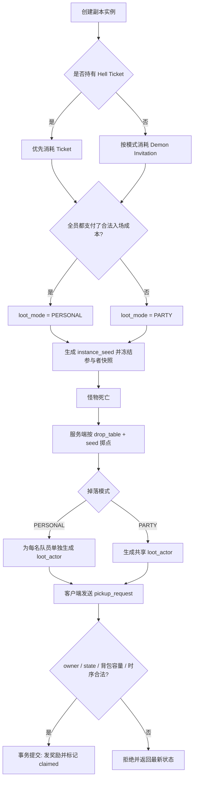
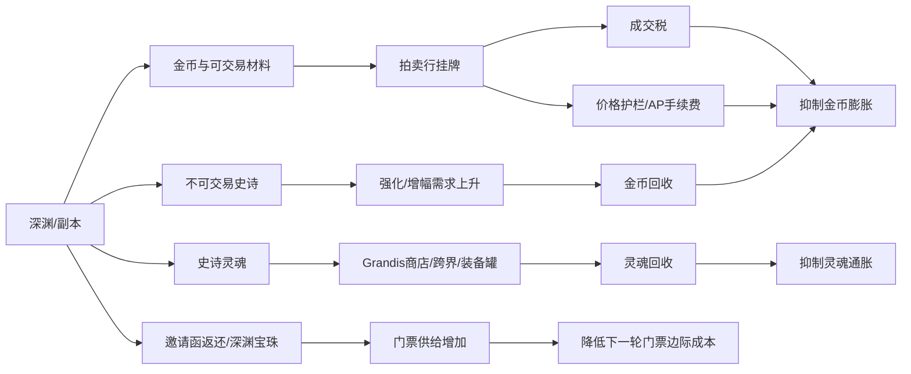

# DNF经典深渊、经济与公会组队系统复刻研究报告

## 执行摘要

如果开发团队的目标是**尽可能接近“邀请函时代”的经典 DNF/DFO 深渊—经济—组队闭环**，最稳妥的基线不是直接照搬 2026 年的 115 级版本，而是采用“**经典深渊主线 + 近年仍沿用的现代交易/公会/并发防护机制**”的混合复刻方案。原因很简单：用户点名的 **Demon Invitation、Epic Fragment、Epic Soul** 这些关键词，本质上都属于 70–95 级“邀请函深渊”体系；而拍卖行防炒价、近期购买价、AP 手续费、公会周结算、共享复活币等，则在近年版本里有更清晰、公开且可验证的规则说明。公开资料已经能确认：经典深渊的门票消耗随地区/模式变化，典型值包括 24/26/28/30 张，哈林深渊 30 张，天体裂缝 40 张外加 4 个探测石，时空裂缝固定 6 FP 且不掉史诗灵魂/深渊宝珠但有更高史诗率。citeturn31search1turn10view1turn29search15turn32view0

真正的“1:1 难点”不在门票和 UI，而在**未公开的核心概率层**。官方公开资料长期只说到“某模式史诗率更高”“碎片数量随难度提高”“某次改版后史诗装备总掉率维持不变”，但**没有公开经典 Hell Party 的确切史诗装备基础掉率、每件装备的权重、服务器随机种子算法，也没有公开掉率是否按服务器负载、时间窗口、角色状态重标定**。因此，开发上必须把这些做成**服务端可配置参数**，并通过大样本回灌校准。公开社区样本里，80–90 cap 时代经典 Hell 的史诗装备掉率常见估计大致在 **4%–7%/次**，但这只能作为“拟合起点”，不能当成官方值。citeturn18search2turn12search4turn11search2turn11search3turn11search15

经济层面，公开资料能较精确复刻的是**金币回收机制**而不是“市场价格本身”。韩服现行拍卖行公开规则已经明确：成交税 3%，上架押金 1 万金币，账号级上架位 10/20，堆叠物一次最多 2000，批量购买 10 秒冷却，并且存在“近期购买价/市场均价 + AP 递进手续费 + 重挂冷却”的防倒卖机制；交易系统还有 3% 基础手续费、装备再额外 2%，邮件有 100 金币基础费、每件附件 1000 金币和寄金 5%（上限 1 万）的回收逻辑。公会与组队方面，公开资料足以复刻出“每周贡献结算—公会币发放—个人/公会 Buff—副本共享复活币—个体掉落可见性隔离”的完整服务端状态机。citeturn42view0turn6view1turn37search0turn16view0turn15view0turn15view1turn17search5turn17search10

## 版本基线与证据口径

本报告默认把“复刻对象”拆成两层。第一层是**经典邀请函深渊线**，即 70–95 级期间以深渊派对邀请函、史诗碎片、史诗灵魂为核心的系统，这一层对应用户最关心的门票、爆装、碎片、拾取与掉落归属。第二层是**现代可验证运营系统线**，即近年仍公开存在并且适合作为服务端模板的拍卖行、公会、组队同步与并发控制机制。这样做的好处是：把“名词与核心玩法”尽量复刻成经典体验，把“防作弊、市场治理、分发结算”做成现代稳定实现。citeturn10view0turn31search4turn34search13turn42view0turn15view1

为了避免把社区传闻误写成官方规则，下面所有数值按四档处理。**A 级**表示官方公告、官方指南或官方版本说明中能直接验证；**B 级**表示官方社区文章、合作资料站转述官方测试服信息；**C 级**表示大样本社区估计或多年通行说法；**D 级**表示本报告的工程推定。凡是不能在公开资料中拿到确值的地方，我都明确写成“**未公开/需数据挖掘**”，并给出拟合方法。citeturn30view0turn12search4turn11search2turn41view0

## 深渊模式与掉落拾取

经典深渊最重要的不是“哪张图更容易出货”，而是**进入成本、掉落类型、是否个体掉落、碎片产量、是否返票/给灵魂**这几个维度。公开资料显示，随着版本推进，普通深渊、时空裂缝、天空裂缝、天体裂缝的成本和奖励结构都明显不同；其中**时空裂缝的核心差异**最适合作为服务端里独立 dungeon\_mode 的配置模板：更高史诗率、固定 6 FP、不给史诗灵魂/深渊宝珠、碎片不共享。citeturn32view0turn9search0turn29search15

| 模式 | 区服/时期 | 单次门票消耗 | 其他消耗 | 公开奖励差异 | 证据等级 | 来源 |
|---|---|---:|---:|---|---|---|
| 经典普通深渊 | 国服 2017 资料页 | 时空之门 24 / 能源中心 26 / 寂静城 28 / 地轨中心 30 | 按地图 FP | 典型邀请函深渊成本线 | A | citeturn31search1 |
| 经典普通深渊 | DFO 2017 | 时空之门 20–22 / 能源中心 23–24 / 寂静城 26 / 地轨中心 28 | 按地图 FP | DFO 同时期成本略低，说明区服/时期配置并不完全一致 | A | citeturn32view0 |
| 地轨中心深渊 | 韩服 2016 | 28 | 按地图 FP | 出 85–90 级史诗；可掉深渊宝珠 500 邀请函 | A | citeturn9search7 |
| 哈林深渊 | 韩服 2018 | 30 | 按地图 FP | 90–95 级史诗；不掉史诗碎片，改掉异形碎片；全员付票时个体掉落 | A | citeturn10view1turn10view0 |
| 天空裂缝 Sky Rift | 韩服 2018 | 30 | 2 个裂缝探测石 | Hell 怪掉落与普通哈林深渊相同，额外追加泰波尔斯命名怪与额外掉落 | A | citeturn10view1 |
| 时空裂缝 Temporal Rift | DFO 2017 | 时空之门 24 / 能源中心 26 / 寂静城 28 / 地轨中心 30 | 固定 6 FP | 史诗率相对更高；不掉史诗灵魂/深渊宝珠；碎片不共享 | A | citeturn32view0 |
| 天体裂缝 Celestial Rift | 韩服/DFO 2019 | 40 | 4 个 Rift Sensor Stones + 8 FP | 泰波尔斯史诗装备概率为天空裂缝的 2 倍 | A | citeturn9search0turn29search15 |

公开能拿到的掉落“硬数值”，主要集中在**史诗碎片量**和**部分材料返还**，而不是史诗装备本体概率。2015 年韩服测试服改版说明显示，经典 Hell 在不同普通难度下固定给 **5/6/8/9/10** 个史诗碎片；随后 2016 年 DFO 官方又明确“各难度 Hell Party 碎片掉落量再 +1”，于是 DFO 2017 时常见的正式服碎片量变成 **6/7/9/10/11**。与此同时，官方说明“史诗装备总掉率维持不变”，说明那次改版更像是**掉落结构重排**，不是简单上调史诗产率。citeturn12search4turn12search14turn18search2

| 指标 | 公开值 | 备注 | 证据等级 | 来源 |
|---|---|---|---|---|
| 经典 Hell 史诗装备基础掉率 | **未公开/需数据挖掘** | 官方长期未给确值 | A | citeturn18search2turn10view0 |
| 社区常见估计的经典 Hell 史诗装备率 | **约 4%–7%/次** | 仅作拟合起点，不可视为官方值 | C | citeturn11search2turn11search3turn11search15 |
| 2015 经典 Hell 碎片量 | Normal 5 / Expert 6 / Master 8 / King 9 / Slayer 10 | 韩服测试服改版信息 | B | citeturn12search4 |
| 2016+ DFO 经典 Hell 碎片量 | Normal 6 / Expert 7 / Master 9 / King 10 / Slayer 11 | 官方明确“各难度 +1”后的结果 | A | citeturn12search14turn32view0 |
| Temporal Rift 碎片量 | 普通 11 / 特殊图 13 | 特殊宇宙恶魔图额外 +2 | A | citeturn32view0 |
| 返票量 | 0–5 张/次 | 难度越高期望越高 | B | citeturn12search4 |
| 史诗灵魂来源 | 分解史诗必得 1；深渊 APC 可掉 | 经典主来源 | A | citeturn7search0turn33search2 |
| 史诗图鉴制作 | 目标装备碎片 1000 + 传奇灵魂 + 史诗灵魂 | 灵魂具体数量在公开片段中未指明 | A | citeturn34search7 |
| Gabriel 碎片兑换 | 1 个史诗灵魂可换 5 个指定碎片 | 哈林时期新增 | A | citeturn10view1 |

**掉落维度的“有/无影响因素”**也可以从公开资料里做出比较清晰的工程判断。地区/地图显然影响掉落池级别；模式（普通 Hell、时空裂缝、天空裂缝、天体裂缝）影响史诗率和附带掉落；普通难度确定地影响碎片量和返票期望；但对“连击、仇恨、贡献度影响爆率”这类说法，公开资料里看不到支持。相反，英文社区长期的主流说法是：**普通副本难度更多影响碎片/一般材料，史诗装备本体爆率更多取决于 Hell 模式本身**。因此，做 1:1 经典复刻时，**不要默认把 combo、aggro、DPS 贡献绑进 Hell 掉落公式**，除非你们准备做的是“类 DNF 的现代化变体”，而不是经典复刻。citeturn10view0turn32view0turn12search2turn18search14

门票收支可以直接按公开 FP 与单次成本推导。DFO 官方指南给出基础 FP=156、Premium Contract Plus 后 FP=273；国服新手引导给出每日 6 点恢复 156 点、黑钻 188 点。按“满图平均 8 FP/次”的常见哈林/地轨/天体类副本假设，日/周/月门票消耗可以直接拿去做服务器指标预算。citeturn26search0turn26search2turn26search3

| 日常体力方案 | FP/日 | 8 FP 满图次数/日 | 地轨 28票 日/周/月 | 哈林 30票 日/周/月 | 天体 40票 日/周/月 |
|---|---:|---:|---|---|---|
| 基础体力 | 156 | 19 | 532 / 3724 / 15960 | 570 / 3990 / 17100 | 760 / 5320 / 22800 |
| 国服黑钻 | 188 | 23 | 644 / 4508 / 19320 | 690 / 4830 / 20700 | 920 / 6440 / 27600 |
| Premium+ | 273 | 34 | 952 / 6664 / 28560 | 1020 / 7140 / 30600 | 1360 / 9520 / 40800 |

上表是**直接计算值**。如果采用时空裂缝那种 6 FP 固定副本，基础 156 FP 可以做 26 次、188 FP 做 31 次、273 FP 做 45 次，这会显著提高门票日耗，但其副作用是**不产史诗灵魂和深渊宝珠**，因此不能简单拿“更高史诗率”抵消经济侧的副产物缺口。citeturn32view0turn26search0turn26search2turn26search3

掉落归属方面，公开规则其实相当明确。2013 年韩服官方专文已经确认：在应用“个体掉落系统”的普通地下城里，**金币/道具按角色独立掉落，只能拾取自己屏幕上可见的掉落；其他人无法捡你的掉落；即便因背包满或超重导致物品重新落地，别人也看不到**。只有“你主动把自己包里的可交易物品扔到地上”时，才会重新暴露给别人。该文还明确：**角色死亡且不复活时，从下一房间开始不再获得金币和物品掉落权益**。citeturn30view0

更重要的是，2018 年哈林更新把 Hell Party 的队伍掉落规则砍得很清楚：**如果所有队员都支付了邀请函或 Hell Party Ticket，则 Hell 掉落按个体掉落发放；该变更适用于所有地区的 Hell Party；但如果是组队刷图时随机触发的 Hell Party，则不适用个体掉落，仍按队伍掉落/队伍获取处理**。同时，哈林 Hell 的出口门要求是：**所有队员把自己可见掉落全部拾取完，并站上出口门，才会一起离场**。中文官方新手引导也直接写过“组队通关时，各队员掉落独立计算”。citeturn10view1turn10view0turn29search6

| 规则 | 公开结论 | 对复刻实现的含义 | 证据等级 | 来源 |
|---|---|---|---|---|
| 普通地下城个体掉落 | 每个队员各自掉金/掉物，只能捡自己的可见掉落 | 掉落应按 owner\_id 实例化，不做公共地面物 | A | citeturn30view0 |
| 主动丢弃包中可交易物 | 会暴露给别人并可被拾取 | 地面物需区分“系统掉落”和“玩家丢弃”两种 actor 类型 | A | citeturn30view0 |
| 3–4 人组队 | 邀请函/挑战书、活动物、制作材料、消耗品、徽章等掉率增加 | 经典队伍奖励可做独立 `party_bonus_table`，但不要默认加史诗本体率 | A | citeturn30view0 |
| 角色死亡但不复活 | 下一房间起失去掉落资格 | 副本成员状态机需要 `drop_eligible=false` | A | citeturn30view0 |
| Hell：全员付票 | 掉落按个体发放 | 进入时就锁定 `loot_mode=personal` | A | citeturn10view1turn10view0 |
| Hell：随机乱入 | 不适用个体掉落 | `loot_mode=party`，不能按个人实例化 | A | citeturn10view1turn10view0 |
| 哈林 Hell 离场 | 所有人拾完并到门口才离场 | 需要“个人已拾取完成”与“门口 Ready”双同步 | A | citeturn10view1turn10view0 |

下面这个流程图，把上面的官方规则翻译成**服务端状态机**。其核心是：消费在前、模式先锁、掉落全在服务端生成、拾取按 owner 验证。相关行为依据见上表。citeturn10view1turn10view0turn30view0



就“掉落表样例”而言，公开资料只够支撑**结构**，支撑不了**权重真值**。所以推荐把经典 Hell 的数据表拆成三层：`dungeon_mode` 决定门票、FP、是否掉灵魂/宝珠；`reward_family` 决定普通 Hell / Temporal / Sky / Celestial 这些族；`drop_entry` 决定具体物品池和权重。一个足够实用的样例是：普通 Hell 始终给固定碎片量；再在独立权重池里滚“史诗装备 / 史诗灵魂 / 深渊宝珠 / 邀请函返还 / Gabriel 触发”。但这些权重值本身必须标成**未公开/需数据挖掘**，不能写死成“官方 5%”。这也是 1:1 项目里应该优先做模拟校准，而不是先做美术还原的原因。citeturn32view0turn12search4turn10view0

## 拍卖行、金币与无色晶块经济

DNF 的经济不是一个“只看掉金量”的系统，而是一个**高频小额税费 + 大额强化/增幅消耗 + 不可交易终装减小直接供给**的混合系统。经典深渊本身掉的是不可交易史诗，所以它对市场的影响主要是**间接影响**：改变门票需求、史诗灵魂价值、裂缝石/引导石等等价物价格，以及最终装备到手之后引发的金币强化需求。官方交易规则越严格，这个间接影响越不会演化成纯粹的投机盘。韩服近年的 AP 手续费、近期购买价、重挂冷却、本服统一拍卖与价格历史查询，本质上都在做这件事。citeturn42view0turn6view2turn27search3turn36search2

| 货币/材料 | 主要来源 | 主要去向 | 公开或可验证公式 | 来源 |
|---|---|---|---|---|
| 金币 | 地下城通关、售店、活动、拍卖行售出 | 拍卖税、交易税、邮件费、强化/增幅、修理、NPC 商店 | 韩服拍卖成交税 3%；交易税 3%，装备再额外 2%；邮件基础费 100 + 每附件 1000 + 寄金 5%（上限 10000） | citeturn42view0turn6view1turn37search0turn37search4 |
| 无色小晶块 / Clear Cube Fragment | 装备分解、活动、部分材料/盒子 | 技能施放、强化、合成、部分彩装/契约系统 | 中文官方明确：强化消耗无色小晶块和金币；大量技能/道具也直接消耗无色 | citeturn35search1turn35search3turn35search11turn35search20 |
| 史诗灵魂 / Epic Soul | 分解史诗、经典 Hell APC、周常/商店/活动 | Grandis 商店、跨界/超越、图鉴/定向兑换、部分现代装备箱/决议制作 | 分解史诗必得 1；哈林期可换裂缝反应石，每日最多 10 次；110 神话跨界要 168；115 套装装备罐开启要 10 | citeturn7search0turn34search14turn13search11turn34search10 |
| 公会硬币 / Guild Coin | 周贡献结算、公会地下城、公会周目标 | 公会商店、能力强化、支援道具 | 贡献结算阶梯 300–2500；现代上限 15000（旧版 5000） | citeturn16view0turn16view1turn14search8 |
| 深渊派对邀请函 / Demon Invitation | Hell 副产物、深渊宝珠、商店、活动、等级奖励、Raid 商店 | 经典 Hell / Temporal / Sky / Celestial 等模式入场 | DFO 还存在 40 不屈意志换 160 张、每角色每周最多 10 盒的官方商店来源 | citeturn33search7turn33search3turn31search19 |

拍卖行的“可 1:1 复刻参数”比价格本身更重要。韩服现行官方指南已经给出一整套足以直接翻成后端变量的参数：搜索、批量购买、价格历史查询、成交税、押金、账号级上架位、堆叠物上限、AP 超价费、近期购买价窗口和修改行为导致的记忆失效。中文老版本则公开过“低于均价 40% 不可上架、40%–150% 区间手续费 5%、用优惠券后 1%、再往上手续费急剧增大”的定价护栏。两者虽然不是同一时代，但都表达了同一设计思想：**不是做订单簿撮合，而是做“挂牌市场 + 税费护栏 + 价格锚”**。citeturn42view0turn19search0turn19search3

| 参数 | 推荐复刻值 | 公开依据 | 说明 | 来源 |
|---|---:|---|---|---|
| 成交税 | 3% | 韩服现行官方指南 | 适合作为默认金币回收率 | citeturn42view0 |
| 上架押金 | 10000 金币 | 韩服现行官方指南 | 流拍或售出退回 | citeturn42view0 |
| 上架位 | 10 / 20 | 账号等级 1–15 / 16+ | 账号成长抑制刷号倒货 | citeturn42view0 |
| 单个堆叠上架上限 | 2000 | 韩服现行官方指南 | 堆叠物不可同时拆多单卖 | citeturn42view0 |
| 批量购买冷却 | 10 秒 | 韩服现行官方指南 | 防高频脚本扫货 | citeturn42view0 |
| 价格历史窗口 | 最近 100 笔或最多 1 个月 | 韩服更新说明 | 用于 UI 展示与定价锚 | citeturn27search3turn27search0 |
| 超价 AP 费阈值 | 现行 50%；曾经 20% | 韩服 2024 更新为 20%，现行指南为 50% | 需要按赛季配置 | citeturn6view2turn42view0 |
| 无 AP 时最高上架价 | 不可超过阈值价 | 韩服现行官方指南 | 直接阻断极端炒价 | citeturn42view0 |
| 最近购买价记忆 | 3 周 | 韩服现行官方指南 | 强化/增幅/镶嵌等行为会重置 | citeturn42view0 |
| 设备重挂冷却 | 1 周 | 韩服 2024 反倒卖改版 | 防买入即倒手 | citeturn6view2 |
| 国服旧价保护栏 | <40% 禁售；40%–150% 手续费 5%；用券后 1% | 中文旧版公开页 | 可作为经典国服模式参数 | citeturn19search0turn19search3 |

强化/增幅是最重要的**长期金币黑洞**。中文官方明确写过“强化需要消耗无色小晶块和一定数量的金币”；DFO 现行装备系统页面则把 115 级安全强化/安全增幅的金币与材料数值公开到了可直接录表的程度。对复刻团队最重要的结论不是某一级“到底要 356 还是 357 个核心”，而是**系统曲线形状**：低级高成功率、接近阈值时成本陡增、失败后要么掉级、要么破坏、要么累积保底补正值，最终形成稳定的长期金币回收。citeturn35search3turn25view0turn25view1

| 系统 | 公开规则/数值 | 复刻含义 | 来源 |
|---|---|---|---|
| 武器强化失败惩罚 | +0~+10 无惩罚；+10→+11 与 +11→+12 失败掉 3；+12→+13 起失败破坏 | 经典“冲高成本”必须保留 | citeturn24view1 |
| 防具/首饰/特殊装备强化 | +0~+10 无惩罚；+10→+11 起失败破坏 | 非武器高强风险更陡 | citeturn24view1 |
| 安全强化 +10→+11 | Leiern Core 356 + 2,153,040 Gold，成功率 8%，失败补正 2%p | 现代赛季可直接录表 | citeturn25view0 |
| 安全强化 +11→+12 | Leiern Core 1108 + 6,704,400 Gold，成功率 3%，失败补正 1%p | 金币 sink 峭壁点 | citeturn25view0 |
| 增幅失败惩罚 | +0~+7 无惩罚；+7→+8、+8→+9、+9→+10 掉级；+10 起失败破坏 | 形成比强化更昂贵的终局 sink | citeturn24view1 |
| 安全增幅 +9→+10（武器） | Harmonious Crystal 320 + 5,084,870 Gold，成功率 30%，失败补正 5%p | 现代赛季可直接录表 | citeturn25view1 |
| 安全增幅 +9→+10（非武器） | Harmonious Crystal 277 + 2,937,440 Gold，成功率 30%，失败补正 5%p | 可直接录表 | citeturn25view1 |

如果把这些规则转换成服务器经济模型，一个够用的复刻框架是：

- **金币存量方程**
  `Gold_t+1 = Gold_t + DungeonGold + VendorGold + AHNetSale - AHTax - TradeFee - MailFee - ReinforceCost - AmplifyCost - RepairCost - NPCShopCost`
- **邀请函存量方程**
  `DI_t+1 = DI_t + HellReturn + HellOrb + RaidShop + GuildShop + EventGrant - HellEntryCost`
- **史诗灵魂存量方程**
  `Soul_t+1 = Soul_t + EpicDisassembly + HellDrop + WeeklyShop - TransferCost - GrandisCost - PotOpenCost`

在这个框架里，**深渊本身并不直接制造可交易毕业装备**，所以它对 AH 的主要影响，不是“拍卖行被深渊装备砸穿”，而是**门票与等价物价格、金币 sink 强度、灵魂与碎片的影子价格**。换句话说，深渊越慷慨，AH 上最先塌的往往不是终装，而是“终装获取过程中的影子材料”。这也是为什么韩服会同时上 3% 交易税、AP 护栏、近期购买价、重挂冷却这些抑制投机的规则。citeturn42view0turn6view2turn34search14turn33search7

至于“常见装备/材料的历史价格区间”，公开资料能确认的是：**韩服拍卖行内置最近交易记录查询，且最多回看 100 笔或 1 个月；国服 DNF 助手也公开提供拍卖行实时物价与价格走势**。但这两者都不是对外开放的长期、可下载历史库，因此**长期历史价格区间在公开 web 资料中并未系统公开**。如果项目必须做到接近真实物价走势，建议的做法不是手填价格，而是做一个 `market_snapshot` 采集任务，从官方客户端/AH 历史、移动端助手、或开放 API 衍生站抓取每日中位价和成交量，再离线回灌到测试服经济模拟器里。citeturn27search3turn27search1turn36search2turn40view0

下面这个图更适合给策划和后端一起看，因为它把“深渊产出如何穿透到拍卖行和金币通胀”用最少的结构画清楚了。其逻辑依据见上文的税费、灵魂和强化公开规则。citeturn42view0turn35search3turn25view0turn25view1turn34search14



## 公会与组队机制

公会系统方面，公开资料足够支持一个完整的、可上线的复刻实现。早期 DFO 官方更新写明创建公会需要 **300,000 Gold**，创建时自动建立公会据点并带 8 格默认仓库；2019–2026 的韩服/DFO 资料则把“公会贡献—周结算—公会币—个人能力强化—公会商店—排名点数返还”这一整套循环说得非常清楚。换句话说，如果你的项目不是只想做“一个聊天频道”，而是要做接近 DNF 的公会系统，就应该把公会当成**有经济结算功能的小型组织系统**来做。citeturn15view2turn15view1turn15view0

| 公会机制 | 公开值/规则 | 复刻说明 | 来源 |
|---|---|---|---|
| 创建公会费用 | 300,000 Gold | 作为一次性金币 sink | citeturn15view2 |
| 创建时默认设施 | 公会据点 + 默认仓库 8 格 | 直接体现在 `guild_storage_capacity` | citeturn15view2 |
| 周贡献主要来源 | 登录 100、工会聊天 50、最优等级地下城 10、特殊地下城 50、Raid 250、公会地下城 60/80/100/150 | 适合做 `guild_contribution_source` 枚举表 | citeturn15view1 |
| 与公会成员组队倍率 | 1 名同公会成员 ×1.5；2 名 ×3；3 名 ×4（Raid 至多 ×4） | 这是真正影响“鼓励同会组队”的杠杆 | citeturn15view1 |
| 周公会币结算 | 贡献 1–1000=300；1001–3000=500；3001–5000=700；5001–8000=1000；8001–10000=1500；10001–15000=2000；15001+=2500 | 直接可做阶梯表 | citeturn16view0turn14search8 |
| 公会币上限 | 旧版 5000；新版 15000 | 必须版本化配置 | citeturn15view1turn16view1 |
| 个人公会能力强化 | 常驻四维 +60；消耗 400 公会币可再加 +40，持续 5 天，可叠到 60 天 | 个人 Buff，不是全会全局 Buff | citeturn15view0turn16view2 |
| 公会队伍 Buff | 2/3/4 人同会：移速 5/10/15%，攻速 5/10/15%，施速 10/15/20%，四维 15/30/50，全属强 5/10/15 | 只在普通地下城等适用场景生效 | citeturn16view0 |
| 驱魔/抗魔类公会 Buff | +30，持续 12 个非 Raid 地下城 | 适合做“消耗次数型 dungeon buff” | citeturn16view0 |

组队系统方面，公开资料透露的关键不是“UI 怎么点”，而是**队伍人数如何影响掉落与容错成本**。经典个体掉落系统推出后，普通地下城的掉金/掉物已经对每个成员独立计算，并且 3–4 人组队会提高邀请函/挑战书、活动物、制作材料、消耗品和徽章等的掉率；但到 Hell Party 里，掉落模式又进一步细分成“全员付票=个人掉落”和“随机乱入=队伍掉落”。这意味着服务端不能只有“party shared / party instanced”两档，而是要有**至少三档**：普通 instanced、Hell paid instanced、随机乱入 shared。citeturn30view0turn10view1turn29search6

| 组队/进入规则 | 公开结论 | 实现含义 | 来源 |
|---|---|---|---|
| 老式快速组队 | 同大区、同频道、同难度、同副本自动匹配 | 适合低门槛副本的 `quick_match_bucket` | citeturn38search7 |
| 现代 Raid 匹配 | 最多 4 人预组后进入匹配；系统可对故意拖进度者禁用匹配模式 | 需要 `premade_party_id` 与不良行为标记 | citeturn38search6 |
| 副本推荐队伍标签 | “1~4” 表示有 1/2/3/4 人独立血量；“1,4” 表示只有单人或四人血量 | 这是副本配置，不是 UI 文案 | citeturn38search5 |
| 巴卡尔类显示 | Life Tokens 在队伍内共享 | 使用 `shared_revive_budget(party_id)` | citeturn17search5 |
| 迪瑞吉 Raid（2026 国服） | 复活币以攻坚队为单位共享；开局补 10 个；特定进度可返 1 个 | Raid 用 `shared_revive_budget(raid_id)` | citeturn17search10 |
| 普通/部分团本限制 | 组队与单刷时复活币往往都有次数限制，且经常共享 | 复活币不是背包道具而是实例预算更贴近实装 | citeturn17search14turn17search17 |

这直接影响 Raid 设计。如果你把稀有掉落仍做成地面共享，会重新制造 DNF 在 2013 年之前那种“主力先捡、弱势玩家丢奖励、地图切房抢落物”的摩擦；而如果你把所有东西都做成纯个人邮件，又会丢掉 DNF 特有的“同屏掉落反馈”。更接近官方演化路径的方式是：**普通/深渊掉落做地面个体实例化；Raid 常规奖励做过关翻牌/邮件；超稀有可交易物做战后竞拍或公会内部分配**。DFO 现行“神雾 Raid Loot Auction System”已经明确写了：通关后按难度几率生成竞拍物，拍卖结束后**中标金额扣除服务费，再分发给全部参与者**。这非常适合作为高价值可交易物的模板。citeturn29search2

## 可直接落地的服务端实现

先给结论：如果你们真的想做“可直接实现”的复刻，后端里至少要有四个核心原则。第一，**所有掉落、门票、灵魂、复活币、竞拍都必须服务端权威**；第二，**实例种子与参与者快照要在进图时冻结**，而不是战斗过程中临时生成；第三，**地面掉落必须有 owner、state、version 三元组**，否则同步和反作弊会非常脆；第四，**金币与材料变动全部走 ledger**，绝不能让业务表直接“改余额不留痕”。这些原则虽然是工程建议，但它们正好对应了上文已公开的官方规则：先消费、再入场、再决定个体/队伍掉落、拾取时验证可见性和归属。citeturn10view1turn30view0turn42view0

下面三段伪代码，分别针对**门票消耗计数**、**掉落分配**、**拍卖行撮合**。它们不是声称“官方源码长这样”，而是把公开规则翻译成最小可用实现。

```pseudo
function enterHellDungeon(request):
    # request: {character_id, party_id, dungeon_mode_id, difficulty, client_req_id}

    assert idempotency_not_used(request.client_req_id)

    mode = loadDungeonMode(request.dungeon_mode_id)
    party = loadPartySnapshot(request.party_id)
    members = party.members

    begin_tx()

    # 1) 冻结参与者快照
    for m in members:
        lockCharacterCurrencies(m.character_id)
        lockInventory(m.character_id)

    # 2) 先判定“全员付票”资格
    all_paid = true
    for m in members:
        if hasItem(m.character_id, mode.hell_ticket_item_id):
            consumeItem(m.character_id, mode.hell_ticket_item_id, 1)   # 优先消耗 Ticket
        elif hasItem(m.character_id, mode.invite_item_id, mode.invite_cost):
            consumeItem(m.character_id, mode.invite_item_id, mode.invite_cost)
        else:
            all_paid = false
            break

    if not all_paid and mode.require_full_party_payment:
        rollback_tx()
        return ERR_NOT_ENOUGH_TICKET

    # 3) 锁定掉落模式
    if mode.source_type == "RANDOM_HELL":
        loot_mode = "PARTY"
    elif all_paid:
        loot_mode = "PERSONAL"
    else:
        loot_mode = "PARTY"

    # 4) 生成实例种子并持久化
    instance_id = newInstanceId()
    seed = HMAC_SHA256(server_secret,
                       concat(instance_id, request.dungeon_mode_id, party.party_id, server_day()))
    createDungeonInstance(instance_id, party.party_id, loot_mode, seed, mode)

    # 5) 初始化掉落资格
    for m in members:
        setDropEligibility(instance_id, m.character_id, true)

    saveIdempotency(request.client_req_id, instance_id)
    commit_tx()

    return {instance_id, loot_mode}
```

```pseudo
function onMonsterDeath(instance_id, monster_id, room_no):
    inst = loadInstance(instance_id)
    seed = deriveSeed(inst.seed, monster_id, room_no, inst.kill_counter + 1)
    rng  = RNG(seed)

    reward_family = loadRewardFamily(inst.dungeon_mode_id, inst.difficulty, monster_id)

    if inst.loot_mode == "PERSONAL":
        for member in inst.members:
            if not isDropEligible(instance_id, member.character_id):
                continue

            rolls = rollRewardFamily(rng.fork(member.character_id), reward_family, member.character_id)
            # 史诗碎片等固定量，按难度直接给 count
            fixed_rewards = getFixedDifficultyRewards(inst.dungeon_mode_id, inst.difficulty)

            createLootActors(
                instance_id=instance_id,
                owner_id=member.character_id,
                monster_id=monster_id,
                rewards=merge(rolls, fixed_rewards),
                visible_to=[member.character_id],
                state="VISIBLE"
            )

    else:  # PARTY 模式
        shared_rewards = rollRewardFamily(rng, reward_family, null)
        createLootActors(
            instance_id=instance_id,
            owner_id=null,
            monster_id=monster_id,
            rewards=shared_rewards,
            visible_to=inst.members,
            state="VISIBLE"
        )

function pickupLoot(character_id, loot_actor_id, client_req_id):
    assert idempotency_not_used(client_req_id)

    begin_tx()
    loot = lockLootActor(loot_actor_id)
    inv  = lockInventory(character_id)

    if loot.state != "VISIBLE":
        rollback_tx(); return ERR_ALREADY_CLAIMED

    if loot.owner_id != null and loot.owner_id != character_id:
        rollback_tx(); return ERR_NOT_OWNER

    if !inventoryCanHold(inv, loot.rewards):
        rollback_tx(); return ERR_NO_SPACE

    grantRewards(character_id, loot.rewards)
    loot.state = "CLAIMED"
    loot.claimed_by = character_id
    save(loot)

    saveIdempotency(client_req_id, loot_actor_id)
    commit_tx()
    return OK
```

```pseudo
function buyAuctionStack(buyer_id, listing_id, buy_qty, max_unit_price, client_req_id):
    assert idempotency_not_used(client_req_id)

    begin_tx()

    listing = lockAuctionListing(listing_id)
    buyer_wallet = lockWallet(buyer_id)
    seller_wallet = lockWallet(listing.seller_id)

    if listing.state != "ACTIVE":
        rollback_tx(); return ERR_LISTING_CLOSED

    if listing.unit_price > max_unit_price:
        rollback_tx(); return ERR_PRICE_MOVED

    if listing.remaining_qty < buy_qty:
        buy_qty = listing.remaining_qty

    total_price = buy_qty * listing.unit_price
    if buyer_wallet.gold < total_price:
        rollback_tx(); return ERR_NOT_ENOUGH_GOLD

    # 金币扣除与货物转移
    buyer_wallet.gold -= total_price

    sold_gold = total_price
    tax_gold  = floor(sold_gold * AH_TAX_RATE)        # 默认 3%
    seller_net = sold_gold - tax_gold

    seller_wallet.gold_pending_mail += seller_net
    createMailToSeller(listing.seller_id, seller_net, tax_gold, listing.item_id, buy_qty)

    transferAuctionItemToBuyer(buyer_id, listing.item_serials.take(buy_qty))

    listing.remaining_qty -= buy_qty
    if listing.remaining_qty == 0:
        listing.state = "SOLD_OUT"

    appendLedger("AH_BUY", buyer_id, -total_price, listing_id)
    appendLedger("AH_TAX", "SYSTEM", +tax_gold, listing_id)
    appendLedger("AH_SELL_NET", listing.seller_id, +seller_net, listing_id)

    saveIdempotency(client_req_id, listing_id)
    commit_tx()
    return OK
```

数据库结构建议如下。为了满足“字段、索引、示例行”要求，我把最关键的表压成一张总表，开发时再拆成 DDL。

| 表名 | 关键字段 | 关键索引 | 用途 | 示例行 |
|---|---|---|---|---|
| `dungeon_mode` | `mode_id, season_tag, source_type, invite_item_id, invite_cost, fp_cost, reward_family_id, require_full_party_payment` | PK(`mode_id`), IDX(`season_tag`,`source_type`) | 定义“哈林 Hell / Temporal Rift / Celestial Rift”这类模式 | `harlem_hell_2018, classic95, NORMAL_HELL, demon_invite, 30, map_fp, rf_harlem_01, true` |
| `difficulty_reward_cfg` | `mode_id, difficulty, epic_fragment_count, invite_return_min, invite_return_max, fixed_extra_drop_json` | PK(`mode_id`,`difficulty`) | 固定量奖励，不把碎片写进随机表 | `harlem_hell_2018, slayer, 0, 0, 0, {"otherverse_frag": 8}` |
| `drop_pool_entry` | `pool_id, entry_id, reward_type, item_id, weight, qty_min, qty_max, owner_scope, season_tag` | PK(`entry_id`), IDX(`pool_id`,`season_tag`) | 随机权重表；官方未公开权重时仍可配置 | `pool_harlem_boss, 101, EPIC_SOUL, epic_soul, 120, 1, 1, PERSONAL, classic95` |
| `instance_run` | `instance_id, party_id, mode_id, loot_mode, seed, state, create_ts` | PK(`instance_id`), IDX(`party_id`,`state`) | 记录实例与种子 | `987654321, 12345, harlem_hell_2018, PERSONAL, 0xA17..., RUNNING, ...` |
| `instance_member` | `instance_id, character_id, drop_eligible, revive_budget_snapshot, ready_to_exit` | PK(`instance_id`,`character_id`) | 记录成员资格、死亡后是否还有掉落权 | `987654321, 10001, true, 3, false` |
| `loot_actor` | `loot_id, instance_id, owner_id, monster_id, state, rewards_json, visible_mask, version` | PK(`loot_id`), IDX(`instance_id`,`state`), IDX(`owner_id`,`state`) | 地面掉落对象；支持 owner 隔离与幂等拾取 | `777001, 987654321, 10001, mob_43, VISIBLE, [{"item":"epic_soul","n":1}], bitset(...), 1` |
| `currency_ledger` | `ledger_id, character_id, currency_type, delta, reason, ref_id, ts` | PK(`ledger_id`), IDX(`character_id`,`ts`), IDX(`reason`,`ts`) | 金币/票/灵魂全量记账 | `9001, 10001, GOLD, -2130000, SAFE_REINFORCE, reinf_abc, ...` |
| `auction_listing` | `listing_id, seller_id, item_id, unit_price, remaining_qty, state, deposit, ap_fee, created_ts, relist_cooldown_until` | PK(`listing_id`), IDX(`item_id`,`state`,`unit_price`,`created_ts`) | 拍卖挂牌，不做撮合订单簿 | `50001, 10001, clear_cube, 120, 2000, ACTIVE, 10000, 0, ..., null` |
| `auction_trade_log` | `trade_id, listing_id, buyer_id, seller_id, qty, gross_gold, tax_gold, seller_net, ts` | PK(`trade_id`), IDX(`listing_id`), IDX(`buyer_id`,`ts`) | 完整成交审计 | `70001, 50001, 20002, 10001, 500, 60000, 1800, 58200, ...` |
| `guild_member_weekly` | `guild_id, character_id, week_key, contribution, settled, reward_coin` | PK(`guild_id`,`character_id`,`week_key`), IDX(`guild_id`,`week_key`,`settled`) | 周贡献与结算快照 | `guild_88, 10001, 2026W18, 5625, false, 1000` |
| `guild_policy` | `guild_id, coin_cap, split_mode, threshold_score, guild_buff_cfg_json` | PK(`guild_id`) | 保存公会主/副会长设置 | `guild_88, 15000, DIFFERENTIAL, 800, {...}` |
| `idempotency_key` | `req_id, scope, result_ref, expire_ts` | PK(`req_id`,`scope`) | 入场、拾取、购买统一幂等 | `cli-uuid-1, PICKUP, loot_777001, ...` |

并发控制与网络同步，请把下面几点当成**必要项**，不是优化项。首先，**进图扣票必须是事务**：锁角色币包、优先消费 Hell Ticket、再消费邀请函、记录实例种子、写幂等键，全部成功才算进图成功。其次，**拾取必须是“请求—验证—提交”而不是客户端本地先拿后回写**：客户端只发 `pickup_request(loot_id)`，服务端检查 state、owner、背包空间、version，再写账本和状态。第三，**拍卖行购买必须锁 listing 与 buyer wallet（必要时也锁 seller wallet / mail outbox）**，否则会出现双买同单、余额穿透、税金重复入账。第四，**公会周结算必须以周快照为基准**，一次只允许一个 `settlement_batch_id` 成功，防止会长/副会长重复点结算。以上设计正对应了官方的“全员付票才切个体掉落”“批量购买有 10 秒冷却”“战后竞拍通过邮件发放”等规则形态。citeturn10view1turn42view0turn29search2

反作弊上，建议至少做四层。第一层是**掉落不可由客户端生成**；第二层是**地面掉落 actor 带 server version**，防止旧包重放；第三层是**实例 seed 使用 HMAC(server\_secret, instance\_id...)**，即便客户端抓到一局的掉落也无法反推其他局；第四层是**经济异常检测**，对拍卖行内短时高频扫货、超价上架、跨小号洗金币做规则与特征双检测。官方没有公开这些内部实现，但公开的 AP 护栏、批量购买冷却、近期购买价与重挂冷却已经说明：原作本身就在强烈防范刷单、倒货和脚本扫盘。citeturn42view0turn6view2

## 测试与验证

在这个项目里，测试不应该只测“能不能进图”，而应该测**概率、归属、并发、恢复、经济**五个层面。尤其是深渊和拍卖行，功能测一遍完全不够，必须做**大样本统计回归**和**并发压测**，否则上线后一定会在“感觉不对”“玩家认为被吞票/吞货/吞税”这类问题上爆雷。公开规则可以直接变成测试断言，比如“Hell Ticket 优先消耗”“全员付票才切个体掉落”“死亡不复活下一房间无掉落权”“批量购买 10 秒冷却”“Bakal 类副本复活币队伍共享”。citeturn9search1turn10view1turn30view0turn42view0turn17search5

| 测试用例 | 步骤 | 预期结果 | 验证方式 |
|---|---|---|---|
| Hell Ticket 优先消耗 | 背包同时放 Ticket 与邀请函进图 | 先扣 Ticket，不扣邀请函 | 对照物品 ledger 与背包快照 |
| 四人哈林深渊全员付票 | 4 人组队，各有足额邀请函/票 | `loot_mode=PERSONAL`；每人只能看见并拾取自己的掉落 | 抓包 + 服务端 `loot_actor.owner_id` |
| 组队随机乱入 Hell | 普通组队刷图触发随机 Hell | `loot_mode=PARTY`；不走全员个体掉落 | 实例日志与拾取权限断言 |
| 角色死亡后不复活 | 在第 2 房死掉；后续继续推进 | 第 3 房起该角色不再生成金币/物品掉落 | 对照 `instance_member.drop_eligible` |
| 哈林 Hell 出口同步 | 某队员未拾完掉落或未站门 | 全队不能离场；满足条件后同时离场 | 事件日志与门状态 |
| 拍卖行同一单并发双买 | 两客户端同时购买同 listing | 只有一方成功或按剩余量正确拆分；不会超卖 | 事务日志 + listing 版本号 |
| 批量购买冷却 | 10 秒内连续发起多次 batch buy | 超频请求被拒或排队 | 接口限流日志 |
| 公会周结算幂等 | 会长与副会长同时点结算 | 仅生成一个 `settlement_batch` | DB 唯一键 + 结果对账 |
| 队伍共享复活币 | 巴卡尔/类似队伍副本中一人用币 | 预算在队伍内减少，所有人 UI 同步 | 实例内预算值与广播 |
| 实例重放重连 | 掉落已生成后角色断线重连 | 原掉落仍可见且不可重复生成 | 通过 `instance_id + seed + loot_actor` 恢复 |

数据验证建议按三条线跑。第一条是**概率线**：用 Monte Carlo 或离线模拟跑 100 万到 1000 万次，看每个 reward family 的经验分布是否落在目标置信区间内。第二条是**经济线**：按天汇总 `Gold faucet / Gold sink / AH 成交额 / 史诗灵魂净增量 / 邀请函覆盖天数`，如果金币 faucet 长期大于 sink 而没有新的大额消耗点，拍卖行价格一定上行。第三条是**体验线**：看“单角色满 FP 深渊 7 天后，玩家能获得多少有感知的进展”，这里建议把**直接史诗掉落、可制作碎片进度、史诗灵魂库存、强化开销**一起做成面板，而不是只看“爆了几件史诗”。citeturn26search0turn26search2turn32view0turn25view0turn25view1

如果需要一个可执行的校准优先级，我建议按这个顺序推进：先校准**门票消耗与副产物流速**，再校准**碎片曲线**，再校准**史诗装备本体率**，最后才校准**特定单件权重**。原因是前两者都有公开硬边界，后两者才是未公开概率层。换句话说，项目最开始就追“我要某一件耳环的真实权重”，是性价比最低的事情。公开资料已经足够让你们把 70% 的系统体验做对，剩下 30% 要靠数据挖掘和封测统计来补。citeturn32view0turn12search4turn34search7

## 术语对照与优先来源

| 中文 | English | 한국어 | 说明 |
|---|---|---|---|
| 深渊派对 | Hell Party | 지옥파티 | 经典邀请函深渊的总称 |
| 深渊派对邀请函 | Demon Invitation | 지옥파티 초대장 | 经典 Hell 门票 |
| 深渊派对通行证 | Hell Party Ticket | 지옥파티 프리패스 / Ticket | 优先于邀请函消耗 |
| 史诗碎片 | Epic Fragment | 에픽 조각 | 用于图鉴/定向制作 |
| 史诗灵魂 | Epic Soul | 에픽 소울 | 分解史诗与深渊掉落的重要中间货币 |
| 深渊宝珠 | Hell Orb | 지옥 구슬 | 经典门票返还道具 |
| 时空裂缝 | Temporal Rift | 시공의 틈 | 更高史诗率，但不掉灵魂/宝珠 |
| 天空裂缝 | Sky Rift | 천공의 균열 | 哈林时期追加模式 |
| 天体裂缝 | Celestial Rift | 천체의 균열 | 40 邀请函 + 4 探测石 |
| 拍卖行 | Auction Hall | 경매장 | 挂牌市场，不是连续订单簿 |
| 无色小晶块 | Clear Cube Fragment | 무색 큐브 조각 | 技能、强化与若干合成系统的重要材料 |
| 公会硬币 | Guild Coin | 길드 주화 | 公会结算与商店货币 |
| 复活币 | Life Token / Coin | 코인 | 队伍或攻坚队共享，视副本而定 |
| 跨界 / 超越 | Transcendence / Transfer | 초월 | 史诗灵魂重要消耗点 |

按语言分组，建议开发团队优先采信下列来源顺序。中文官方层面，优先看由 entity["company","Tencent","game publisher"] 运营的国服官网新手引导、版本专题页、维护公告，以及 DNF 助手里可见的拍卖行价格走势功能；这些来源适合校准**国服门票成本、旧拍卖行规则、国服黑钻体力、匹配与攻坚 UI 行为**。citeturn31search1turn31search4turn19search0turn26search2turn36search2

英文官方层面，优先看由 entity["company","Neople","game developer"] 维护的 DFO 官方更新与指南页面，特别是 **Hell Party Renewed、Temporal Rift、Celestial Rift、Equipment System、Guild Updates、Trading and Auction Hall** 这几类页面；这些页面最适合直接落成表配置，因为数字最完整。citeturn18search2turn32view0turn9search0turn25view0turn25view1turn29search2

韩文官方层面，优先看由 entity["company","Nexon","game publisher"] 发布的韩服游戏指南、版本更新页和官方社区专题，尤其是 **地轨中心/哈林深渊、拍卖行指南、交易指南、公会指南、2013 个体掉落系统专文**。如果项目需要最接近“原始行为”的细节，韩文官方文档通常是最值得先翻的那一批。citeturn9search7turn10view0turn10view1turn42view0turn6view1turn30view0turn15view0turn16view0

社区与数据挖掘层面，建议把它们当作**拟合与补洞来源**，不要让它们覆盖官方。英文可优先参考 entity["organization","Reddit","online forum"] 上的 DFO 老帖样本，用来估计 80–90 cap 时代的体感爆率区间与玩家策略；韩文可参考 entity["organization","Inven","game media"] 的测试服报道与专题；中文可参考 entity["organization","COLG","game community"] 等合作资料站与社区大样本整理。它们最有价值的地方，不是“给你官方值”，而是告诉你**哪些东西官方根本没公开、玩家会怎样体感这些未公开概率**。citeturn11search2turn11search3turn12search4turn41view0turn18search15

最后，针对本次需求中尚无法公开精确给出的条目，建议团队直接标记为：

- **经典 Hell 史诗装备基础掉率：未公开/需数据挖掘**
- **单件史诗装备权重与职业/部位子池：未公开/需数据挖掘**
- **服务器随机种子算法与重现方式：未公开**
- **拍卖行真实成交排序细则（是否严格价格优先/同价先挂先得）：未公开**
- **公开可下载的长期历史价格区间：未系统公开**
- **经典普通强化全等级金币/无色精确表：公开片段不足，需客户端/数据挖掘补齐**

这些地方不要硬编。更好的做法是：**先按本报告的 A/B 级公开规则把骨架做对，再用抓包、开放 API 站点、封测样本和离线回归去补 C/D 层**。就工程风险来说，这比试图从传闻里“猜一个官方真值”可靠得多。citeturn32view0turn42view0turn40view0turn11search2turn41view0
