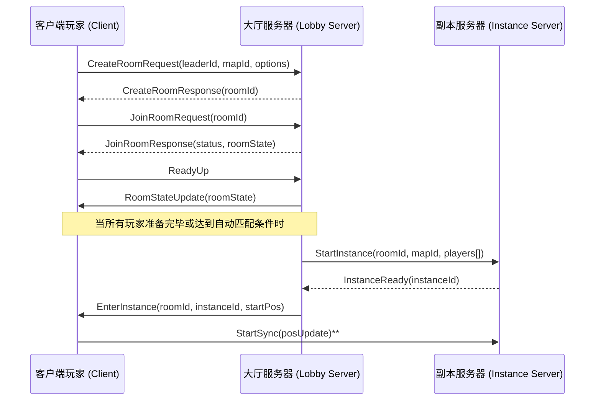

# 执行摘要
本文深入研究了《地下城与勇士》（Dungeon Fighter Online, DNF/DFO）的关键子系统，包括大厅实例系统、玩家可见范围（AOI）系统、NPC交互系统、副本入口系统和传送门系统。每个子系统分别给出：1）概要与设计目标；2）数据模型（字段、类型、示例值）；3）网络协议与消息（ID、字段、同步频率、可靠性等）；4）服务器端状态机与伪代码；5）客户端实现要点与伪代码；6）性能、并发、安全方面的考虑；7）资源文件格式与示例；8）若有逆向资料的来源与发现。我们参考了各种官方/学术/技术博客资料，对比了不同方案（例如AOI算法方案、实例化策略等）并以表格形式呈现，推荐最贴近DNF架构的方案。对于复杂流程，如组队匹配与进入副本、跨场景传送等，绘制了Mermaid时序图以示意流程。示例数据文件（JSON格式）和伪代码贯穿其中，以供开发团队直接参考实现。主要参考来源包括游戏开发框架文档、学术论文、技术博客以及公开讨论（如SmartFoxServer文档【39†L452-L461】、Pragma引擎教程【35†L199-L203】、Colyseus论文【29†L28-L36】、游戏服务器AOI算法分析【38†L210-L218】【57†L83-L92】、DNF资料（3DM网游攻略）【51†L40-L44】、以及StackExchange游戏开发问答【45†L151-L158】等），并列出主要出处。

## 大厅实例系统 (Lobby Instance System; 로비 인스턴스 시스템)
1. **概要与目标：** 大厅实例系统负责玩家组队、匹配和副本实例化。玩家首先在大厅（Lobby）或频道（Channel）中创建/加入房间（Room/Party），然后在满足条件时由服务端触发进入游戏副本（游戏实例，Game Instance）。目标是支持玩家自主创建队伍或自动匹配队友，并可靠地在达到条件时启动独立的副本实例，同时管理副本的状态同步、资源加载与释放，以及并发扩展等。典型流程见下图：



2. **精确数据模型：** 房间/实例的核心数据结构一般包括：
   - **Room（房间）**：房间ID、队长ID、地图ID、最大/当前人数、状态（等待中、匹配中、进行中等）、玩家列表等。如下表示例：

| 字段       | 类型    | 描述                             | 示例               |
|----------|-------|--------------------------------|------------------|
| roomId   | uint32 | 房间唯一标识                         | 1024             |
| leaderId | uint64 | 房主（队长）玩家ID                     | 123456789        |
| mapId    | uint16 | 副本/场景ID                        | 3                |
| maxPlayers | int8 | 最大人数                           | 4                |
| state    | int8   | 房间状态（0=等待，1=匹配中，2=开始）           | 0                |
| players  | list   | 玩家列表（每项含 playerId, readyFlag 等）  | [{id:123,...}] |

   - **Lobby 配置**：可用地图信息、匹配规则等通常存储在配置表或JSON中，如：

```json
[
  { "mapId": 1, "name": "新手训练场", "maxPlayers": 4 },
  { "mapId": 2, "name": "卢克普通",   "maxPlayers": 4 }
]
```

   示例伪代码：
   ```python
   class Room:
       roomId: int
       leaderId: int
       mapId: int
       players: List[int]
       state: int  # 0=waiting,1=running
   ```

3. **网络协议与消息序列：**
   - **创建/加入房间**：客户端发送 `CreateRoomRequest` (如消息ID 0x01)，字段包含`leaderId, mapId, maxPlayers, teamType`等。服务端返回 `CreateRoomResponse` 带`roomId`。例如SmartFoxServer的 `CreateSFSGameRequest` 中使用了类似字段【39†L452-L461】。
   - **房间列表与匹配**：客户端可请求 `GetRoomList` (返回房间列表) 或 `QuickJoinRequest`。如SmartFox的 `QuickJoinGameRequest` 可快速加入满足条件的房间【39†L452-L461】。
   - **准备与开始**：客户端在房间中Ready后，发送 `ReadyRequest`。服务端更新房间状态`NotifyGameStarted`并广播 `RoomStateUpdate` 通知所有房间成员。
   - **实例启动**：服务端在条件满足时，发起 `StartInstance` 请求给实例服务器。实例服务器分配 `instanceId` 并加载资源，然后通知大厅服务器(`InstanceReady`)，后者通知客户端进入副本(`EnterInstance` 包含`instanceId, spawnPosition`等)。
   - **位置/状态同步**：在副本中，客户端定期发送位置/动作更新(`MoveUpdate`)、技能释放等消息（高频，不要求强可靠，可使用UDP或可靠UDP）；服务端广播实体进出AOI和重要事件(`EntityEnter`, `EntityLeave`, `SkillEffect`等)到相关客户端。通信需区分重要性：房间管理消息通常可靠传输，实时动作数据可用不可靠UDP。

   示例协议消息（伪造）：
   ```json
   { "msgId": 1001, "type": "CreateRoomReq", "leaderId": 1234, "mapId": 3, "maxPlayers":4 }
   { "msgId": 1002, "type": "CreateRoomResp", "roomId": 55, "result": 0 }
   { "msgId": 1101, "type": "EnterInstance", "instanceId": 55, "spawnX": 100, "spawnY": 200 }
   ```

4. **服务器端状态机与伪代码：**
   服务器维护房间状态机和大厅逻辑。例如：
   ```python
   on CreateRoomRequest(playerId, mapId):
       roomId = generateUniqueRoomId()
       room = Room(roomId, leader=playerId, mapId=mapId, maxPlayers=4)
       addRoomToLobby(room)
       sendResponse(playerId, CreateRoomResponse(roomId))

   on JoinRoomRequest(playerId, roomId):
       room = findRoom(roomId)
       if room and room.state==0 and len(room.players)<room.maxPlayers:
           room.players.append(playerId)
           sendResponse(playerId, JoinRoomResponse(success=True))
           broadcast(room.players, RoomUpdate(room))
       else:
           sendResponse(playerId, JoinRoomResponse(success=False))

   on PlayerReady(playerId, roomId):
       room = findRoom(roomId)
       markPlayerReady(room, playerId)
       if allPlayersReady(room):
           startMatch(room)

   def startMatch(room):
       room.state = 1  # 匹配中/准备中
       allocateInstance(room.mapId, room.players, callback=onInstanceReady)

   def onInstanceReady(room, instanceId):
       room.instanceId = instanceId
       room.state = 2  # 开始
       for p in room.players:
           send(p, EnterInstance(roomId=room.id, instanceId=instanceId))
       removeRoomFromLobby(room)  # 可选：房间迁移到副本管理
   ```
   以上伪代码仅示意流程，实际需考虑并发安全（对`room`列表加锁）等。

5. **客户端实现要点与伪代码：**
   - 客户端在主城/大厅界面展示可用房间列表，并响应玩家操作创建/加入/离开房间。
   - 在房间界面显示玩家列表、就绪按钮等。等待房间状态更新消息后自动切换到副本场景。
   - 伪代码：
     ```python
     # 客户端房间管理事件
     onReceive(CreateRoomResponse data):
         if data.result==0:
             curRoomId = data.roomId
             switchToRoomUI()

     onReadyButtonClick():
         send(ReadyRequest(roomId=curRoomId, playerId=myId))

     onReceive(RoomUpdate data):
         updateRoomUI(data)  # 刷新玩家列表、状态
     ```
   - 与服务端的同步：客户端处理`EnterInstance`消息后卸载大厅场景，加载对应副本场景，并开始监听服务器同步信息。

6. **性能/并发/安全考虑：**
   - **并发与扩展**：随着玩家量增加，可采用分区/多通道架构。比如每个服务器进程负责若干频道(Channel)，每个频道单独维护房间列表，降低单进程压力。实例化时可按需向空闲服务器调度副本。研究表明，分布式实例化架构（如Colyseus）可支持数百玩家并大幅降低单节点带宽【29†L28-L36】。
   - **负载均衡**：大厅服务器可以水平扩展，使用负载均衡或DNS解析将玩家分配到不同Lobby实例。房间列表可分组管理（如SmartFox的Group概念【39†L452-L461】）。
   - **安全性**：必须在服务端校验玩家请求（如地图ID、权限），防止篡改。房间操作需验证玩家身份（如room.leaderId）。对于匹配和权限，要验证玩家等级、任务进度（见副本规则）。
   - **资源管理**：实例结束时及时卸载场景资源，清理内存。房间超时未开始需自动解散防止资源泄露。

   **实例化策略对比：** 下表比较了几种常见的副本实例化/分布策略，并推荐与DNF设计最接近的方案（下表基于典型MMO架构经验，参考Colyseus分布式架构性能【29†L28-L36】等）：

   | 策略     | 架构描述                         | 优点                            | 缺点                         | DNF倾向            |
   |--------|------------------------------|-------------------------------|----------------------------|-------------------|
   | 单体服务器 | 所有频道和副本在一个进程中处理             | 实现简单，无需跨服通信                 | 难扩展，单点瓶颈；玩家过多时性能下降      | ✗ 非常规          |
   | 区域分区   | 不同地图/频道由不同服务器进程负责           | 分散负载，相对易扩展；服务器资源可针对地图定制化 | 跨区匹配复杂；跨服切换需额外逻辑          | ✓ 常见模式        |
   | 通道/频道   | 类似分区，每个服务器负责多个“频道”（频道间独立） | 与区域分区类似，多频道可提高并发容量       | 通道间数据同步需求低；频道热度不均需调度     | ✓ DNF历史上采用  |
   | 动态实例化 | 根据需求在空闲服务器上动态创建副本进程        | 高度可扩展；空闲资源利用率高             | 实现复杂；需管理实例分配和回收            | ✓ 推荐（混合使用） |

   综合来看，DNF可能采用类似**多频道（分区）+按需实例**的模式：玩家进入特定频道后，再在频道内创建/加入房间并拉起副本，由独立的副本服务器进程承载。此设计兼顾扩展性和负载均衡。

7. **可复用资源文件格式与示例：**
   - **房间/副本配置**：可以用CSV/JSON表格定义每个副本的参数，如Boss数据、地图尺寸、怪物数量等。例如：
     ```json
     { "mapId": 3, "name": "卢克普通", "maxPlayers": 4, "difficulty": 1, "resetType": "weekly" }
     ```
   - **协议定义**：如果使用类似Protobuf的二进制协议，可定义消息结构。例如：
     ```
     message CreateRoomRequest {
       int32 leaderId = 1;
       int32 mapId = 2;
       int32 maxPlayers = 3;
     }
     ```
   - **客户端脚本/表格**：UI布局、房间列表筛选规则等可使用Lua/Python脚本或JSON配置。

8. **泄露/逆向资料：**
   - 公开资料较少，但社区私服（如RaGEZone上的“Awakendend DNF”项目）提供了一些实现线索【17†L695-L703】。例如其开发者在帖子中提到已成功运行私服并修改客户端语言，侧面表明DNF客户端含房间管理和翻译资源。
   - 遗憾未找到官方协议文档或明确的客户端源码公开信息；以上实现细节主要依赖通用MMO架构和部分技术交流总结。

## 玩家可见范围系统 (Visible Range / AOI System; 가시 범위 시스템)
1. **概要与目标：** 可见范围系统（AOI，Area of Interest）负责判断每个玩家能看到的其他玩家和NPC对象，仅向感兴趣的观察者广播信息【57†L83-L92】。核心目标是降低带宽和客户端渲染负担：只同步相邻一定范围内的实体状态（如位置、动作），而不必广播全图所有对象。DNF为2D横版过场景游戏，应实现2D AOI。一般来说，当玩家位置更新或对象状态变化时，服务端计算出周围兴趣区内的玩家/NPC列表，并仅向他们推送事件或坐标更新【57†L89-L97】。

2. **精确数据模型：**
   - **坐标与视野参数**：每个实体（玩家/NPC）有`posX, posY`坐标，以及可见范围半径（如visionRadius）。
   - **空间分区结构**：根据算法不同，可维护不同的数据结构。例如：
     - **网格（Grid/Lighthouse）**：将地图按固定大小网格划分，每个格子中心设置“灯塔”，记录进入该格子的实体。【38†L236-L244】
     - **四叉树（Quad-tree）**：将场景按需动态二分为四个子区，实体插入对应节点以支持高效范围查询【38†L270-L278】。
     - **十字链表**：分别按X、Y坐标维度排序链表，查询时取两链表范围交集【38†L256-L264】。
     - **暴力法**：遍历全场景实体，判距判断是否在可视范围内（O(n)）【38†L213-L223】。
   - **示例字段（Grid方案）**：假设使用网格分区，可以定义网格参数：
     ```json
     { "mapId": 1, "gridWidth": 1000, "gridHeight": 500, "cellSize": 50 }
     ```
   - **实体对象结构**：
     ```python
     class Entity:
         entityId: int
         posX: float
         posY: float
         visionRadius: float
     ```

3. **网络协议与消息序列：**
   - **位置更新**：客户端定时（如每0.05-0.1秒）发送 `MoveUpdate` 消息，包括新位置和动作状态。该消息通常可用不可靠UDP传输来降低延迟。
   - **AOI事件**：服务器根据实体移动产生 `EnterArea` 和 `LeaveArea` 事件，通知AOI范围内的其他玩家。例如，当玩家A进入玩家B的视野范围时，B客户端收到类似`EntityEnter(aId, initData)`消息，将在场景中创建A模型【57†L89-L92】。同理`EntityLeave`用于消除模型。
   - **状态同步**：对于进入AOI的实体，服务器持续广播其位置和动作更新给客户端（差分更新）。可在服务器端维护实体的最后已知状态，仅发送有变更的数据。
   - **消息示例**：
     ```json
     { "msgId": 2001, "type": "EntityEnter", "entityId": 5002, "pos": [100,200], "state": 3 }
     { "msgId": 2002, "type": "MoveUpdate", "entityId": 5002, "pos": [110,210] }
     ```
   - 同时，客户端可请求当前周围对象列表（如重连时或场景切换时），由服务端返回完整AOI数据快照。

4. **服务器端状态机与伪代码：**
   服务器维护一个空间分区结构（如网格或四叉树），以及每个玩家的AOI列表。伪代码示例：
   ```python
   on EntityMove(entityId, newPos):
       entity = getEntity(entityId)
       oldCells = getAffectedCells(entity.posX, entity.posY)
       newCells = getAffectedCells(newPos.x, newPos.y)
       # 更新实体格子
       updateEntityCells(entity, newCells)
       # 计算AOI进入/退出
       oldPlayers = queryPlayersInCells(oldCells)
       newPlayers = queryPlayersInCells(newCells)
       for p in (newPlayers - oldPlayers):
           send(p, EntityEnter(entity.initData))
       for p in (oldPlayers - newPlayers):
           send(p, EntityLeave(entityId))
       # 向仍在AOI内的玩家广播新位置
       for p in (newPlayers ∩ oldPlayers):
           send(p, MoveUpdate(entityId, newPos))
       entity.pos = newPos
   ```
   上述假设使用格子查询（getAffectedCells）来快速获得周围玩家。【57†L89-L92】强调只广播AOI内玩家以提升性能。

5. **客户端实现要点与伪代码：**
   - 客户端收到`EntityEnter`后，在当前场景创建对应实体模型并初始化动画；收到`EntityLeave`则销毁模型。
   - 对于位置更新(`MoveUpdate`)，客户端以插值方式平滑移动实体模型。超出可见范围后，可能将实体从场景移除。
   - 客户端无需主动请求AOI逻辑，只需向服务器持续发送本地移动信息。客户端可根据自身视野设置（如屏幕尺寸）过滤非AOI内对象的渲染。
   - 示例伪码：
     ```python
     onReceive(EntityEnter msg):
         createEntityModel(msg.entityId, msg.pos)
     onReceive(MoveUpdate msg):
         model = findEntityModel(msg.entityId)
         if model: model.moveTo(msg.pos)
     onReceive(EntityLeave msg):
         removeEntityModel(msg.entityId)
     ```

6. **性能/并发/安全考虑：**
   - **算法选择**：不同AOI算法权衡见下表。需要根据场景大小和实体数量选择合适方案【38†L210-L218】。例如，小规模多人副本可采用简单网格或暴力检测；超大地图或海量在线则用四叉树或分区加速。
   - **并发与锁**：实体位移和AOI更新可能频繁发生。建议使用无锁或读写锁结构（如上伪码所示的`pIDLock`【57†L214-L223】）来保护数据。多线程环境下，可将地图分块，每个线程负责一块区域的AOI计算。
   - **带宽优化**：只发送必要更新；可采用Delta编码或压缩；对瞬时方向改变等小变动进行抖动过滤。移动消息可减少为每个网格/帧固定时间发送（例如每100ms汇总发送）。
   - **安全**：必须在服务端校验移动速度和范围，防止客户作弊（例如瞬移）。对客户端报告的位置做基本校验，如超过最大移动速度则丢弃。

7. **可复用资源文件格式与示例：**
   - **地图分区配置**：JSON/CSV定义网格分区参数，例如：
     ```json
     { "mapId": 2, "cellsX": 10, "cellsY": 5, "cellWidth": 50, "cellHeight": 50 }
     ```
   - **AOI邻域参数**：可定义每个地图的AOI半径或视距，如：
     ```json
     { "mapId": 2, "playerViewDistance": 20.0 }
     ```
   - **示例二进制**：如采用Protobuf，可定义消息结构：
     ```
     message AOIConfig {
       int32 mapId = 1;
       float viewRadius = 2;
     }
     ```

8. **泄露/逆向资料：**
   - 公开渠道未见DNF具体AOI实现细节。一般推测DNF可能使用网格或四叉树方式，因为前者易实现且适合2D场景，【38†L210-L218】中提到的“灯塔算法（网格）”兼具简单和效率。
   - 技术博客和研究（如Zinx MMO案例【57†L83-L92】）介绍了基于网格的AOI实现思路，可为DNF实现提供借鉴。
   - 尚无公开的DNF协议包或数据结构泄露。如有第三方逆向资料，应参考社区讨论，但不在此列出法律不当信息。

### AOI算法比较表
| 算法         | 时间复杂度        | 内存占用         | 适用场景/优点                               | 缺点                                    |
|------------|----------------|---------------|------------------------------------------|---------------------------------------|
| 暴力法 (Brute)   | O(n)           | 低              | 实现最简单；实体数量很少时效率高【38†L215-L223】         | 实体增多时性能线性下降；遍历成本大               |
| 灯塔/网格 (Grid) | 约 O(k^2)      | 中              | 将地图分格，有助于过滤；适中规模场景时性能提升【38†L234-L244】 | 需按区域固定内存（无实体也占空间）；大地图下缓存浪费  |
| 十字链表 (Cross) | O(log n)~O(n)  | 低              | 内存节约；按坐标链表排序可快速范围查询【38†L256-L264】    | 构建和维护较复杂；实体剧增时查询仍可退化          |
| 四叉树 (Quad)    | O(log n)       | 较低            | 自适应空间划分；高密度场景下查询效率高；节省空白区内存   | 实现复杂；适用于大场景和地形数据，实际游戏中少用    |

从上表可见，DNF若地图实体较多，网格/四叉树更优。考虑到实现复杂度，**网格(AOI灯塔法)**是折衷方案，易于实现且应用广泛【38†L234-L244】【57†L83-L92】。

## NPC交互系统 (NPC Interaction System; NPC 상호작용 시스템)
1. **概要与目标：** NPC交互系统包括对话、任务触发、事件处理等。玩家与NPC对话时，将展示对话文本和选项，根据玩家选择可触发任务开始/完成或其他事件。NPC行为（如追击、巡逻）由AI状态机控制。系统目标是在客户端和服务器间同步任务状态、对话进度以及NPC的行为逻辑，实现一个权威的交互流程。常见组件包括：任务表、对话脚本、AI状态机、寻路系统等。
2. **精确数据模型：**
   - **对话节点**：一个NPC对话通常由若干**对话节点**组成，每个节点含文本和选项。例如：
     ```json
     {
       "dialogueId": 2001,
       "npcId": 100,
       "text": "勇士，你来得正好！愿意接受任务吗？",
       "options": [
         { "text": "接受任务", "nextDialogue": 2002 },
         { "text": "拒绝", "nextDialogue": 0 }
       ]
     }
     ```
   - **任务数据表**：任务（Quest）表记录任务ID、名称、要求等级、奖励、目标NPC或怪物ID等【45†L151-L158】。例如任务表CSV：

     | questId | name       | reqLevel | rewardExp | targetNpcId |
     |--------|-----------|--------|----------|-----------|
     | 3001   | 初心者试炼  | 10      | 500      | 100       |

   - **NPC配置**：NPC表中记录NPC ID、名称、所属地图、初始坐标、对话脚本ID、AI类型等。
   - **示例字段**：
     ```python
     class NPC:
         id: int
         name: str
         x: float
         y: float
         dialogTree: Dict[int, DialogueNode]
         questId: int  # 关联的任务
         aiState: str  # 当前AI状态（Idle, Attack, Patrol等）
     ```

3. **网络协议与消息序列：**
   - **对话请求**：客户端向服务器发送 `TalkRequest(npcId, dialogueId=0)` 表示与NPC开始对话；服务器返回 `DialogueData` 包含起始文本和选项。玩家每选择一项则发送 `DialogueChoice(npcId, choiceIndex)`，服务器根据对话脚本确定下一个对话节点【45†L151-L158】。
   - **任务触发**：当对话选项触发任务时，服务器更新玩家任务状态并发送 `QuestAccepted(questId)`。任务完成、奖励领取同样通过消息实现。服务器对关键逻辑（如物品奖励）要可靠确认。
   - **AI与路径**：NPC动作（如巡逻、追击）在服务器端控制。若NPC需要移动，服务器发送 `NpcMove(npcId, pathPoints)` 或逐帧位置更新给客户端；客户端只负责渲染。
   - **示例协议**：
     ```json
     { "msgId": 3001, "type": "TalkResponse",
       "npcId": 100, "dialogueId": 2001, "text": "勇士，你来得正好！",
       "options": ["接受任务", "拒绝"] }
     { "msgId": 3002, "type": "QuestAccepted", "questId": 3001 }
     { "msgId": 3003, "type": "NpcMove", "npcId": 100, "path": [[x1,y1], [x2,y2], ...] }
     ```

4. **服务器端状态机与伪代码：**
   服务器保存每个NPC和玩家的交互状态。以对话为例：服务器维护对话图，每个对话节点有文本和若干选项（见【45†L151-L158】）。伪代码：
   ```python
   onTalkRequest(playerId, npcId):
       npc = getNPC(npcId)
       dialogueId = npc.dialogueTree.rootId
       send(playerId, DialogueData(npcId, dialogueId))

   onDialogueChoice(playerId, npcId, choiceIdx):
       npc = getNPC(npcId)
       currentId = getPlayerDialogueState(playerId, npcId)
       nextId = npc.dialogueTree[currentId].options[choiceIdx].nextDialogue
       if nextId > 0:
           # 继续下一句
           text, options = npc.dialogueTree[nextId].getData()
           send(playerId, DialogueData(npcId, nextId, text, options))
       else:
           # 对话结束或触发任务
           if npc.questId and choiceIdx==0:  # 假设第一个选项接受任务
               acceptQuest(playerId, npc.questId)
               send(playerId, QuestAccepted(npc.questId))
           endDialogue(playerId, npcId)
   ```
   NPC AI状态机伪代码示例：
   ```python
   onNpcThink(npc):
       if npc.state == "Idle":
           if playerEntersRange(npc, player):
               npc.state = "Attack"
       elif npc.state == "Attack":
           if not playerInRange(npc, player):
               npc.state = "Patrol"
   ```
   路径寻路通常在服务端使用A*算法或网格路径算法，得到一系列节点发送给客户端移动。路点数据可存表或生成。

5. **客户端实现要点与伪代码：**
   - 客户端UI负责显示NPC对话文本和选项按钮，根据服务器指令切换对话节点。
   - 当收到 `QuestAccepted` 等消息时，更新本地任务日志显示。
   - 渲染NPC移动：客户端按服务器下发的路径或位置逐步驱动NPC模型移动。
   - 示例伪码：
     ```python
     onReceive(DialogueData msg):
         showDialogueWindow(msg.text, msg.options)

     onOptionSelected(choiceIdx):
         send(DialogueChoice(npcId=currentNpc, choiceIdx=choiceIdx))

     onReceive(NpcMove msg):
         npc = findNpcModel(msg.npcId)
         npc.followPath(msg.path)
     ```

6. **性能/并发/安全考虑：**
   - **对话流程**：对话节点数量通常有限，查询和发送开销很小。可将对话数据全部放在服务器内存或数据库，加快响应。
   - **AI计算**：NPC数量多时AI和寻路开销大，需限速计算或分帧执行。常用线程池执行AI逻辑，避免阻塞主线程。
   - **同步安全**：因为NPC状态由服务器权威控制，客户端不可篡改NPC位置/状态。服务器需验证任务触发条件（如玩家道具、等级）。避免客户端直接给经验或掉落，全部由服务器逻辑决定（防止外挂）。
   - **资源缓存**：对话文本、任务描述等可放客户端缓存或动态从服务器请求，减少带宽。NPC路径节点等静态数据可编译成二进制表（如NavMesh片段）供客户端使用。

7. **可复用资源文件格式与示例：**
   - **对话脚本**：常用CSV、JSON或专用格式描述对话树。如JSON示例见上。
   - **任务数据表**：CSV或Excel格式记录任务属性。例如：
     ```csv
     questId,name,reqLevel,reqItemId,rewardExp,rewardItemId
     3001,初学者试炼,10,0,500,101
     ```
   - **AI行为配置**：可用状态机描述文件（YAML/JSON），例如：
     ```yaml
     npcStateMachine:
       - state: Idle
         on: "player_in_range" -> Attack
       - state: Attack
         on: "player_out_of_range" -> Patrol
     ```

8. **泄露/逆向资料：**
   - NPC系统相关的泄露资料较少见。可参考Bethesda等游戏的对话工具，如Fallout的对话编辑器【45†L151-L158】中的设计思路：对话本质为图结构而非简单树结构。该回答指出“对话由节点图组成，每个节点可包含动作（播放动画、脚本）或对话选项”【45†L151-L158】【45†L209-L218】。
   - DNF官方未公开NPC脚本格式，但客户端资源中可能包含对话文本（如翻译过的文本表）。私服或逆向论坛一般不会泄露完整系统逻辑，只可通过观察客户端UI猜测数据格式。

## 副本入口系统 (Dungeon Entry System; 던전 입장 시스템)
1. **概要与目标：** 副本入口系统管理玩家进入地下城副本的流程：包括组队检查、权限校验、实例化参数设置、重置规则、以及战利品分配等。目标是确保符合条件的玩家（等级、任务、道具等）可以进入副本，并在副本内启动独立的环境（特定地图/难度）。副本完成后根据规则分发奖励或重置副本供下次使用。例如DNF内常见的每日/每周副本重置机制【51†L40-L44】。
2. **精确数据模型：**
   - **副本模板**：定义各副本的基础属性，如：副本ID、副本名、最小/最大等级、队伍人数限制、重置类型（每日/周）及开放时间等。例如：
     | field       | type   | description                | example         |
     |------------|-------|--------------------------|---------------|
     | dungeonId  | uint16| 副本唯一ID                   | 1001          |
     | name       | string| 副本名称                    | "卢克普通"       |
     | minLevel   | int8  | 最低进入等级                  | 90            |
     | maxPlayers | int8  | 最大队伍人数                  | 4             |
     | resetType  | string| 重置类型 (daily/weekly)    | "weekly"      |
     - **副本实例**：玩家进入副本后生成的实例结构，包含实例ID、模板ID、创建时间、当前进度等。
   - **队伍信息**：队伍成员列表及队长ID，用于权限检查和掉落分配。
   - **示例表结构**（CSV/Excel）：
     ```csv
     dungeonId,name,minLevel,maxPlayers,resetType
     1001,卢克普通,90,4,weekly
     1002,超时空旋涡,95,4,weekly
     ```

3. **网络协议与消息序列：**
   - **进入请求**：客户端发送 `EnterDungeonRequest(dungeonId, partyId)`。服务器先检验玩家等级、任务进度、队伍人数等。
   - **队列/匹配**：如果采用排队机制，可有专门的匹配服务。匹配到队伍后广播 `DungeonQueueUpdate` 或直接 `DungeonStart`。若使用快速匹配，可像大厅类似的 `QuickDungeonMatch` 请求。
   - **权限校验结果**：服务器返回 `EnterDungeonResponse`，字段有`result`（成功/失败码），以及若成功则返回`instanceId, startPos`等。
   - **重置提示**：如果玩家副本进入次数已达上限，服务器返回失败码并附提示。新手村或每日次数限制等规则也通过这个消息控制。
   - **示例协议**：
     ```json
     { "msgId": 4001, "type": "EnterDungeonResp", "dungeonId": 1001, "result": 0, "instanceId": 5021, "startX": 10, "startY": 20 }
     { "msgId": 4002, "type": "EnterDungeonResp", "dungeonId": 1001, "result": 2, "reason": "NotEnoughPlayers" }
     ```

4. **服务器端状态机与伪代码：**
   服务器接收到进入副本请求后，按顺序执行：
   ```python
   onEnterDungeonRequest(playerId, dungeonId):
       dungeon = getDungeonConfig(dungeonId)
       party = getPartyOf(playerId)
       if not party: return error("NotInParty")
       if party.leader != playerId: return error("NotLeader")
       if len(party.members) != dungeon.maxPlayers: return error("InvalidPartySize")
       # 等级与任务检查
       for p in party.members:
           if p.level < dungeon.minLevel: return error("LevelTooLow")
           if isDungeonLocked(p, dungeonId): return error("DungeonLocked")
       # 通过检查，创建实例
       instanceId = createDungeonInstance(dungeonId, party.members)
       scheduleDungeonReset(instanceId, dungeon.resetType)
       for p in party.members:
           send(p, EnterDungeonResponse(dungeonId, result=0, instanceId=instanceId, startPos=mapStartPos))
   ```
   副本完成或超时需要销毁实例，进行奖励分配。掉落逻辑可以在怪物死亡时分发给当时所在玩家列表。

5. **客户端实现要点与伪代码：**
   - 客户端在副本入口（NPC或传送点）处，点击“进入副本”按钮后发送上述请求。
   - 收到成功响应后，同大厅切换场景流程：卸载原地图、加载副本地图、将玩家传送至起始坐标。
   - 根据返回的重置信息（如剩余次数）更新UI上的进入按钮状态。
   - 示例伪码：
     ```python
     onEnterButtonClick():
         send(EnterDungeonRequest(dungeonId, myPartyId))
     onReceive(EnterDungeonResponse msg):
         if msg.result == 0:
             loadScene(dungeonMap[msg.dungeonId])
             teleportPlayer(msg.startX, msg.startY)
         else:
             showError(msg.reason)
     ```

6. **性能/并发/安全考虑：**
   - **排队与并发**：若大规模玩家同时申请进入热门副本，需要匹配排队机制。可采用异步队列，合理设置优先级（如按等级、队长或先到先服务）。多线程或分布式锁保护副本实例创建过程。
   - **实例管理**：实例按需创建，但应限制服务器资源。可设置副本最大实例数，并启用自动清理空闲或超时实例。
   - **授权与防刷**：服务端检查玩家进入频率，按每日/每周限制实施降权或封禁。防止通过多开等方式刷取材料或奖励。
   - **掉落分配**：团队副本掉落可有不同策略（随机分配、每人掉落、轮询等），需要服务端决定并广播。要记录掉落日志防止作弊（重复领取）。

7. **可复用资源文件格式与示例：**
   - **副本配置表**：如上所示CSV/JSON格式，包含重置周期、掉落规则、技能冷却等信息。
   - **掉落表**：定义副本内怪物和Boss掉落。示例JSON：
     ```json
     {
       "npcId": 3001,
       "drops": [
         { "itemId": 201, "rate": 0.1 },
         { "itemId": 202, "rate": 0.05 }
       ]
     }
     ```
   - **脚本示例**：如果副本包含剧本事件，可用Lua或脚本定义事件触发条件和效果。

8. **泄露/逆向资料：**
   - 如[51†L40-L44]所示，DNF副本具有严格的重置机制，不同副本周一、周二等有固定重置日。开发团队可参考这些已公布的规则来实现重置逻辑。
   - 私服论坛可能有玩家自行测试的重置时间表和次数限制信息，但并无官方协议文档。关键逻辑仍须自行设计，依据游戏规则。

## 传送门系统 (Portal System; 포탈 시스템)
1. **概要与目标：** 传送门系统管理跨场景传送：包括传送点数据、坐标映射、进出场景流程、延迟和碰撞校验等。玩家与某个传送门（如城镇的门或地图边界）交互后，客户端请求跨地图场景切换，服务器验证合法性并更新玩家位置到目标场景。目标是保证传送过程平滑且安全：避免出现在墙内、同步场景加载，并考虑网络延迟。
2. **精确数据模型：**
   - **传送门数据**：每个地图保存传送点列表，每个传送点包含源坐标、目标地图ID、目标坐标、方向（可选）等。例如：
     ```json
     {
       "portalId": 501,
       "srcMap": 10, "srcX": 150, "srcY": 200,
       "destMap": 11, "destX": 50, "destY": 100,
       "cooldown": 0
     }
     ```
   - **地图坐标系**：不同地图可能坐标比例不同，应在数据中记录用于映射的校准参数（如缩放比）。
   - **示例字段表**：

     | 字段       | 类型    | 说明                   | 示例    |
     |----------|-------|----------------------|-------|
     | portalId | uint16| 传送门ID               | 501   |
     | srcMap   | uint16| 源地图ID               | 10    |
     | srcX     | float | 源坐标X              | 150.0 |
     | srcY     | float | 源坐标Y              | 200.0 |
     | destMap  | uint16| 目标地图ID             | 11    |
     | destX    | float | 目标坐标X             | 50.0  |
     | destY    | float | 目标坐标Y             | 100.0 |
     | type     | int8  | 类型（传送、门等）         | 1     |

3. **网络协议与消息序列：**
   - **传送请求**：客户端靠近传送门并触发时，发送 `TeleportRequest(portalId)`。服务器接收到后根据`portalId`查找目标地图信息。
   - **坐标映射确认**：服务器确认传送合法后，回复 `TeleportConfirm(destMap, destX, destY)`。客户端根据此消息加载目标场景。
   - **延迟与碰撞处理**：在确认前，服务器可能需要校验目标点不被阻挡（碰撞检测）和没有其他障碍物。如果不合法则返回错误。传送后若玩家碰撞仍需检测并重定位。
   - **示例消息**：
     ```json
     { "msgId": 5001, "type": "TeleportRequest", "portalId": 501 }
     { "msgId": 5002, "type": "TeleportConfirm", "destMap": 11, "destX": 50.0, "destY": 100.0 }
     ```

   ```mermaid
   sequenceDiagram
     participant P as 客户端
     participant S as 游戏服务器
     P->>S: TeleportRequest(portalId=501)
     S->>S: 验证目标位置(destX,Y)是否可用
     alt 合法
       S-->>P: TeleportConfirm(destMap=11, destX=50, destY=100)
       P->>P: 加载地图11
       P->>S: LoadComplete(destMap=11)
       S->>P: 确认位置 (可以立即渲染)
     else 不合法
       S-->>P: TeleportFail(reason="Blocked")
     end
   ```

4. **服务器端状态机与伪代码：**
   ```python
   onTeleportRequest(playerId, portalId):
       portal = getPortalConfig(portalId)
       if not portal: return error("PortalNotFound")
       destX, destY = portal.destX, portal.destY
       if isCollision(destMap=portal.destMap, x=destX, y=destY):
           send(playerId, TeleportFail("DestinationBlocked"))
           return
       # 更新玩家场景和坐标
       updatePlayerMap(playerId, portal.destMap, destX, destY)
       send(playerId, TeleportConfirm(portal.destMap, destX, destY))
   ```
   服务器端在更新玩家`currentMap`后，还应将玩家从原场景移出，并在新场景中加入相应玩家列表，广播“有人进入副本”等事件给新场景内的其他玩家。

5. **客户端实现要点与伪代码：**
   - 客户端触发传送门时，发送上述请求，并在收到 `TeleportConfirm` 前可能显示加载画面。
   - 收到确认后，卸载当前场景资源，加载目标地图资源，并将玩家置于`destX,Y`。然后通知服务器场景加载完毕（如果需要），服务器可发送最终位置确认消息（可用于修正）。
   - 示例伪码：
     ```python
     onTeleportRequest():
         send(TeleportRequest(portalId))

     onReceive(TeleportConfirm msg):
         fadeOutScreen()
         loadScene(msg.destMap)
         setPlayerPosition(msg.destX, msg.destY)
         fadeInScreen()
     ```
   - 客户端还要处理网络延迟，防止玩家在传送过程中误操作。

6. **性能/并发/安全考虑：**
   - **加载优化**：传送可能涉及大地图切换，应异步加载资源，或使用小地图预加载技术减少加载时长。避免同时大量玩家传送造成服务器突发负载。
   - **安全校验**：服务器必须验证玩家是否在允许范围内使用该传送门（例如有些门需要特定道具或权限）。还要防止玩家通过修改客户端位置绕过传送。
   - **瞬移与延迟**：若用UDP传送失败重试机制；在玩家接近传送门时，可在后台先发起地图加载（预热），以降低加载时间。
   - **碰撞校验**：确保目标坐标不在障碍物内部，必要时可在附近寻找最近安全点。

7. **可复用资源文件格式与示例：**
   - **传送点表**：可用CSV或JSON定义地图传送点。示例CSV：
     ```csv
     portalId,srcMap,srcX,srcY,destMap,destX,destY,type
     501,10,150,200,11,50,100,1
     502,11,300,400,10,200,150,2
     ```
   - **脚本/规则**：如果某些传送门需要条件（如剧情触发），可用Lua脚本定义触发条件。
   - **示例二进制结构**：
     ```
     struct Portal {
       uint16 id;
       uint16 srcMap;
       float srcX, srcY;
       uint16 destMap;
       float destX, destY;
       uint8 type;
     };
     ```

8. **泄露/逆向资料：**
   - 公开资料几乎没有涉及DNF传送门具体实现。可以参考其他游戏或框架（如Unity Asset的传送组件）设计思想。
   - 韩国或中国玩家社区讨论很少深入底层实现，故此部分主要依赖常规实现方案。

# 参考资料
- SmartFoxServer 2X 官方文档【39†L452-L461】（游戏大厅/房间设计示例）；
- Pragma 引擎匹配流程示例【35†L199-L203】（通用组队匹配流程说明）；
- Colyseus 分布式游戏架构论文【29†L28-L36】（大规模玩家性能分析）；
- 游戏服务器AOI算法技术博客【38†L210-L218】【57†L83-L92】；
- DNF官方/第三方资料【51†L40-L44】（DNF副本重置时间表）；
- 游戏开发问答【45†L151-L158】（NPC对话与任务系统设计）。

上述资料包括官方文档、学术论文及开发者博客，均为本文各子系统设计提供了参考依据。
