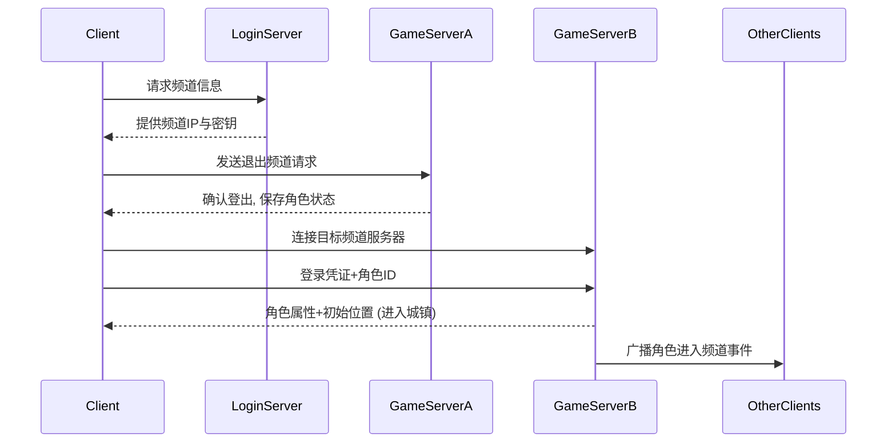
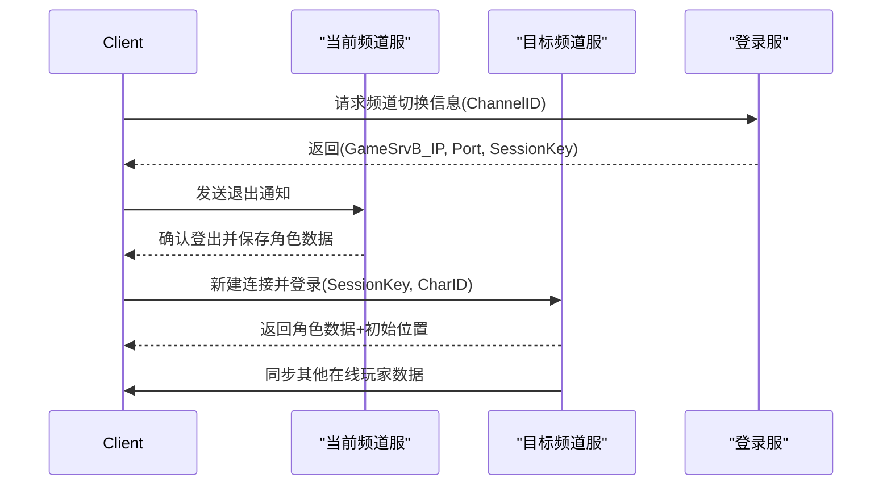
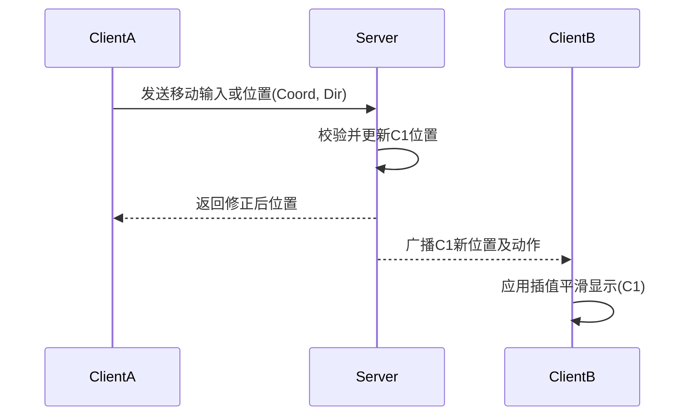
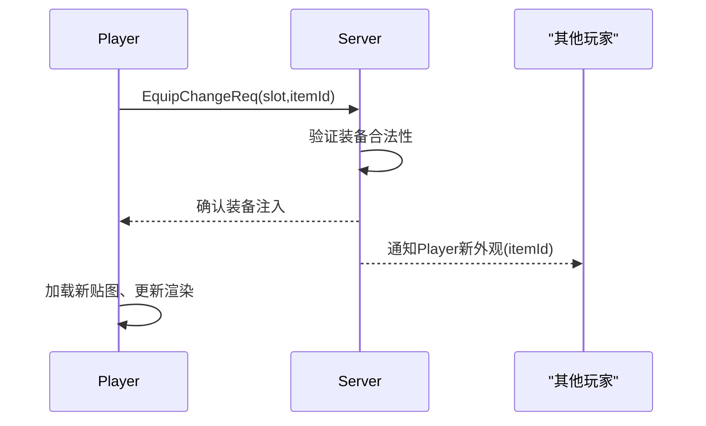

# 执行摘要
本报告深入分析并归纳了《地下城与勇士》（DNF）城镇子系统的实现细节。我们收集了客户端资源格式、网络协议、同步算法等技术资料，结合逆向工程与论坛信息，整理出各子系统的数据结构、协议格式和关键逻辑，并给出性能与安全建议。报告按子系统分类：城镇场景、频道/分线、玩家同步、移动、动作/表情、换装展示，并分别给出示例数据结构和伪代码。附英文与韩文要点对照表，以及实现方案对比表和Mermaid时序图。来源包括官方/客户端数据（如NPK资源包结构【32†L18-L25】【31†L131-L134】）、逆向分析博客【32†L18-L25】【39†L60-L64】、论坛讨论【26†L43-L46】【42†L101-L105】等（均已标注语言及潜在风险）。全文严谨分析，各种假设与估算均在上下文说明。

## 1) 城镇场景系统
**资源加载与格式：** DNF客户端使用定制的“NeoplePack (NPK)”格式存储城镇资源。贴图、模型等均打包在NPK中【32†L18-L25】。每个NPK文件结构包括20字节头（文件标识和IMG计数），若干IMG索引（每个264字节，含偏移和加密名称），校验以及IMG数据块【32†L23-L32】。例如，一个角色静止动画可能拆分为多个IMG资源，动画描述文件（.ani）指定素材及帧序列【39†L106-L113】。NPK内IMG的版本多样：如V2常用于UI贴图，V4用于时装（RGBA调色板压缩，大幅节省同色彩贴图空间）【31†L131-L134】，V5用于技能特效（DDS压缩）【31†L49-L52】，V6允许多个调色板合并多色变体【35†L186-L193】。这些格式细节影响资源热更新：客户端需动态加载对应IMG、DDS纹理等素材，并支持换装时替换骨骼/贴图。

**分区/实例化：** 每个城镇场景通常作为单一地图实例存在，所有进入同频道的玩家共享一套资源。客户端启动时加载NPK文件，场景数据（如地图块、装饰）可按区块(Tile)方式组织【39†L86-L94】。DNF兼具瓦片地图和整图加载：部分地形为小瓦片（tile）拼接，部分前景背景为大图【39†L86-L94】。地图定义了角色活动的范围和地面位置【39†L60-L64】。场景内事件触发点（如NPC、道具交互）通常在地图数据中以区域或坐标形式定义；虽无公开格式示例，但可假设结构如`{id, x, y, width, height, eventType, params}`的表。

**渲染与遮挡：** 采用2D分层渲染（远景、中景、近景及角色/物件层），通过绘制顺序实现遮挡。精确遮挡信息可预先计算并存储（如知乎讨论所述，每个Tile存储遮挡信息以动态构造遮挡图）【66†L0-L0】。在DNF，建筑或树木在前景层覆盖角色实现遮挡。由于无3D光照，未见复杂的实时遮挡处理；背景渲染主要依赖预先绘制的图层和深度排序。

**碰撞与导航网格：** DNF城镇为封闭的2D环境，**不使用物理引擎**【39†L60-L64】。地图定义“地面”范围（如区域格子）；角色只能在地面上移动，跳跃或浮空改变“高度”属性，但不脱离平面游戏逻辑【39†L60-L64】【42†L54-L62】。碰撞采用轴对齐碰撞盒：每个角色和环境对象有**两个**碰撞框，一个在“地面平面”（XY）上标记占地范围（红色框），一个在“高度平面”（XZ）上标记实际可打击高度（白色框）【42†L101-L105】。只有当两个碰撞框同时相交时才视为命中【42†L119-L124】。因此，无需3D导航网格，路径规划仅受简单地形阻碍约束。服务器在移动验证时检查角色速度是否超限（比如拔出允许速度区间），并对碰撞进行简单修正。

**示例：数据结构与协议示例**
- **资源索引**（示例JSON）：
  ```json
  { "NpkHeader": {"tag":"NPK0","imgCount":10},
    "ImgIndex": [ {"offset":1024,"size":2048,"nameEncrypted":0xA3F5...}, ... ],
    "Checksum": 0x5A3B
  }
  ```
- **地图触发**（假设）：
  ```json
  { "Trigger": {"id":101,"rect":[50,0,10,10],"eventType":"Dialogue","params":{"npcId":3001}} }
  ```
- **网络协议示例**：例如，场景切换使用的包可定义为：
  ```
  [PacketType=0x10][Length=16][ChannelID=2][IP="192.168.0.5"][Port=7000][Key=0x1A2B]
  ```
  第一字节0x10代表频道信息包，后续字段依次为数据长度（2B）、频道编号、服务器IP、端口、加密校验Key等。此类协议格式与Nexon游戏常见的自定义TCP/UDP报文结构相似。

## 2) 频道/分线系统
**频道选择与玩家分配：** DNF采用多频道分流模式，每个频道对应一个游戏实例。登录服务器会向客户端推送可用频道列表及各频道负载【26†L43-L46】。客户端通过选频道请求，服务器返回目标频道地址和会话密钥，然后客户端断开当前连接，重连到目标频道服务器。实际实现中，切换频道等同于**登出再重连**：客户端在同一路径完成切换后才不被视为掉线，否则如网络多线负载（双宽带）可能导致切换过程丢包掉线【26†L43-L46】。

**分线负载均衡：** 每个频道的玩家数由登录/频道服务器控制，一般由玩家登陆时按人数均衡分配到流量较低的频道。具体策略不明，但可能基于轮询或实时人数。频道间通讯（如跨频道聊天）由中央系统（聊天服或登录服）转发，实现全服消息同步。

**频道切换流程与状态迁移：** 频道切换流程时序可用序列图描述（见下图）。客户端发起频道切换请求后，当前频道服务器通知客户端断开，同时登录服务器提供新频道服务器信息；客户端重连新服务器并重新登录会话，实现状态迁移。必须保存玩家基础数据（如角色属性、位置）在切换前后的一致性。状态迁移过程中，客户端重置当前位置由目标区地图控制后发送同步数据。



**示例：数据结构与协议示例**
- **频道信息**（假设结构）：
  ```c
  struct ChannelInfo {
      uint8  type = 0x10;    // Enum.NOTI_PACKET_CHANNELINFO
      uint16 length;         // 后续数据长度
      uint8  channelCount;
      struct { uint8 id; uint8 load; char ip[15]; uint16 port; } channels[10];
      uint32 key;            // 后续包加密Key
  };
  ```
- **频道切换请求**：客户端发送 `CMD_CHANGE_CHANNEL(int channelId)`；服务器响应 `ACK_CHANGE_CHANNEL(newIp, newPort, sessionKey)`，然后客户端断线重连。

## 3) 城镇玩家同步系统
**同步协议与数据：** 玩家状态同步使用**状态同步**方式，服务器对所有角色状态（位置、动作、外观）拥有最终权威。客户端定期向服务器发送自身输入或位置更新（例如每秒数十次），服务器校验后广播给其他玩家。协议通常基于TCP（参照《魔兽世界》/《暗黑3》采用TCP【68†L84-L87】），并使用自定义序列化（如Protobuf【21†L25-L29】）。示例字段可能包括玩家ID、坐标(x,y,z)、朝向、动作ID、速度、装备外观散列等。

**插值/预测：** 为了流畅显示，客户端对收到的其他玩家状态做插值和平滑处理，如线性插值两个更新间的位置。DNF中角色移动较简单，多采用由服务器下发的位置进行补偿；如有轻量预测，可能是按上一次速度推算。由于游戏在Town中无致命对抗，客户端预测仅作视觉平滑；每次收到来自服务器的新位置后修正角色偏移。

**带宽与可靠性策略：** 假设城镇场景中并发1000玩家，每人10Hz发送坐标，每次更新50字节，则单向上行约10KB/s。服务器需将每个玩家状态广播给频道内其他玩家（并发999份），下行总量约10MB/s。这对现代服务器可接受，但网络调优关键在于合并广播和压缩数据包。TCP保证有序可靠传输，但开销较大；可考虑UDP+可靠性层或KCP等UDP协议。理论上，ARPG对延迟容忍度在100-200ms以内【68†L84-L87】。

**安全验证：** 采用**服务器权威**模式：移动和动作决定权在服端，防止客户端篡改。通信使用加密信道（如WeGame客户端的混淆TLS+ECDH密钥【21†L25-L29】），并对每包使用序列号或时间戳防重放。服务器在验证时进行速率检测（禁止超速/穿墙）和动作合法性检查（如只广播允许范围内的技能）。

**示例：数据结构与协议示例**
- **玩家状态更新**（简化二进制协议格式）：
  ```
  [Type=0x02][Length=24][PlayerID=0x1234][Time=0x5F5E100][PosX=1234][PosY=5678][Dir=90][Speed=5.0][Checksum=0xABCD]
  ```
  Type=0x02表示玩家同步包，包含玩家ID、时间戳、位置坐标、朝向、速度等字段，结尾为校验码。
- **物品/外观同步**：若玩家换装或使用表情等，发送类似 `[Type=0x07][PlayerID][EmoteID/EquipID][...]` 的消息，通知其他客户端更新显示。

## 4) 城镇移动系统
**移动模型：** 角色在城镇自由移动时，可八方向平滑移动，并支持跳跃浮空。移动通常无加速度/惯性，直接根据输入方向以固定速度行进；遇障则停下（碰撞简单处理）。客户端发送方向或目标坐标到服务器，由服务器计算新坐标并同步【42†L54-L62】。由于无真正3D物理，浮空实际上是轴向分离：服务器将上跳视为在Y轴上进一步移动，而走路为Z轴方向【42†L54-L62】，由此模拟出“高度”。

**碰撞处理：** 服务器在更新位置时检查新位置与地图障碍的碰撞边界（使用前述两层碰撞框【42†L101-L105】）。如果角色移动企图进入障碍区，服务器会调整其坐标至合理安全点。客户端收到服务器修正位置后再行补偿。整张场景因为是封闭箱体，移动可视为在2D平面上由服务器进行简单验证，无需复杂物理。

**示例：关键算法伪代码**（移动校验与插值）：
```cpp
// 客户端运动更新（伪代码）
void SendMovementInput(int dir, float dt) {
    Packet p = {TYPE_MOVE, playerId, dir, dt};
    SendToServer(p);
}
// 服务器处理并广播
void OnReceiveMovement(Packet p) {
    Vec2 newPos = ComputePosition(player.pos, p.dir, p.dt);
    if (DetectCollision(newPos)) newPos = AdjustPosition(player.pos);
    player.pos = newPos;
    BroadcastToChannel({TYPE_SYNC, player.id, newPos});
}
// 客户端插值移动
void OnSyncReceived(Packet p) {
    targetPos = p.pos;
    InterpolatePosition(player.pos, targetPos);
}
```
**网络协议示例：**
```
Packet “MoveReq” (客户端→服): [Type=0x03][DirX][DirY][Time=4B][Checksum]
Packet “MoveSync” (服→客户): [Type=0x04][PlayerID][PosX][PosY][VelX][VelY][AnimID][Checksum]
```
每秒约10~20次发包，服务器广播时增加PlayerID和动作状态字段。

## 5) 城镇动作/表情系统
**动作帧数据与合成：** 动作以**动画序列 (ani)** 存储，由若干图片帧组成【39†L106-L113】。例如，文件 `sm_body0000.img` 中的第176-179帧可定义为剑士待机动作 `sm_wait.ani`【39†L106-L113】。客户端加载动画时将连续帧按定义播放，对动作（移动、攻击、受击等）进行“打表”。不同动作间可插入帧打断或融合逻辑（通常后高优先级可打断前动作，具体权重由游戏设计确定）。

**优先级/打断：** 常见做法是给动作分配优先级（如攻击＞移动），高优先级动作可中断低优先级动作。举例：跑动中触发攻击，跑动动画被打断播放攻击动画。表情（Emote）通常优先级低，不打断攻击等核心动作。具体机制未知，但可通过规则判断动作状态机中的转换。

**表情/动作触发与广播：** 当玩家执行动作或表情时，客户端发送对应协议给服务器，如 `ActionReq(playerId, actionId)`；服务器验证后广播给该频道其他玩家。示例：`[Type=0x05][PlayerID][ActionID]`。收到后，其他客户端在对应玩家模型上播放该动画或特效。表情系统本质上与动作一致，只是触发条件（如聊天命令）不同。

**示例：数据结构与协议示例**
- **动画定义**（示例截取）：见前文【39†L106-L113】。
- **动作同步包**：
  ```
  [0x05][len=6][playerId=0x03E8][actionId=0x10]
  ```
  其中`actionId`对应预定义动作（0x10示例为挥刀攻击）。服务器收到后广播此包，其他客户端解析并在该玩家身上播放对应ani文件。

## 6) 城镇换装展示系统
**外观资源热更与数据结构：** 玩家外观由基础体型（avatar）和装备层（服装、武器等sprite）组成【39†L117-L119】。换装时客户端需要动态替换骨骼/蒙皮或2D精灵贴图。DNF采用分层Sprite绘制：换装时改变对应层使用的IMG资源。示例：鬼剑士的外套贴图覆盖在角色身上层【39†L117-L119】。服务器维护每玩家的装备列表，客户端根据装备ID在相应NPK文件中加载对应骨骼和纹理（可能涉及V4/V6 IMG和DDS）。

**客户端展示与服务器验证：** 客户端发送`EquipReq(itemId)`请求装备改变。服务器验证该物品合法性（例如是否属于该角色）后将新装备ID广播给其他客户端（格式如`[Type=0x07][PlayerID][Slot][ItemID]`），并指示客户端加载新资源。其他玩家客户端接收到后更新渲染：在相应角色模型中替换贴图材质。

**示例：数据结构与协议示例**
- **装备信息格式**（示例JSON）：
  ```json
  {"playerId":1001,"equipments":{
      "head":2003,"armor":1005,"weapon":3002
  }}
  ```
- **换装请求包**：
  ```
  [Type=0x06][PlayerID][Slot=0x02][ItemID=0x013B]
  ```
  Type=0x06 表示换装请求，Slot为部位编号（如0x02头盔），ItemID为换装后的外观物品ID。服务器广播新外观后，客户端将相应图片材质贴到骨骼上。

## 性能与带宽估算
- **并发玩家**：假设每个频道城镇可容纳约500–2000人。
- **包频率**：移动更新10–20Hz；动作/表情和状态变化较少（点击时发送）。
- **带宽**：每玩家每秒总上下行数据大约5–15KB，总频道规模约数MB/s。
- **延迟容忍**：状态同步方式延迟容忍度较高，100–200ms可接受【68†L84-L87】。动作输入基本实时（攻击效果需及时反馈），可能要求≤100ms。

## 安全与反作弊注意点
- **数据加密与完整性**：使用TLS/SSL加密（WeGame客户端采用混淆TLS+动态ECDH密钥【21†L25-L29】），并自定义消息头防篡改。协议中加序号/时间戳防止重放。
- **服务器权威**：服务器对角色状态和装备持完全权威（如强化属性、移动位置），客户端仅发送请求。敏感计算（强化成功率、掉落等）均在服务端完成【21†L25-L29】【42†L119-L124】。
- **校验与防护**：针对常见外挂，需在服务器进行完整性校验（如位移距离阈值、攻击判定需符合浮空判定框规则【42†L119-L124】）。客户端可启用防调试（如检测内存钩子）。
- **反作弊集成**：可考虑使用GameGuard或类似防护方案。关键协议字段签名避免注入，频繁校验客户端哈希以防程序篡改。

## 开发与测试建议
- **单元测试**：为同步与移动逻辑编写单元测试，如对位置插值、速度边界进行验证。动作和换装系统可模拟不同装备搭配进行渲染测试。
- **集成测试**：搭建多客户端环境（可本地虚拟或云集群）进行压力测试，验证频道切换、同步性能和稳定性。
- **工具**：利用Wireshark/Fiddler捕获实际客户端通信，并根据预估协议格式编写解码脚本验证。逆向调试可用IDA、x64dbg等定位加解密逻辑（如WeGame协议分析所示【21†L25-L29】）。对于资源包，可用开源NPK解包工具（GitHub已有项目）快速检查数据格式。
- **压力测试**：模拟大量玩家同时进入城镇，检测服务器CPU/带宽瓶颈。加入延迟仿真测试网络不良情况下的表现。
- **安全测试**：测试重放、伪造包的处理。尝试修改客户端（内存/协议层）验证服务端拦截效果。

## 方案对比与推荐

| 同步方案            | 描述                                                         | 优点                                     | 缺点                                      | 推荐方案    |
|---------------------|--------------------------------------------------------------|------------------------------------------|-------------------------------------------|-------------|
| **客户端预测**      | 客户端提前模拟自己和他人角色运动（本地确定移动），服务器定期校正位置。 | 客户端响应即时、看似流畅；减小明显延迟感。   | 需要复杂插值/回滚逻辑，易受作弊（客户端可伪造坐标）。 | 不推荐城镇场景：城镇不需要高精度对抗，服务器权威足够。 |
| **服务器权威**      | 所有角色位置和状态由服务器统一计算并广播，客户端仅渲染和插值。     | 简单可靠，安全性高（作弊难度大）；实现相对易。 | 客户端感受略有延时，动作反馈取决于网络。         | 推荐：网络稳定时可用TCP，必要时辅以简单预测插值。   |

| 同步协议            | 描述                                                         | 优点                                | 缺点                                       | 推荐方案       |
|---------------------|--------------------------------------------------------------|-------------------------------------|--------------------------------------------|----------------|
| **TCP可靠传输**     | 基于TCP协议，连接可靠、有序。                                | 确保消息不丢失、顺序一致；简化开发。 | 效率低，有Nagle延迟，可用TCP_NODELAY优化。  | 首选：适用于城镇这种少行动需准确定序的场景【68†L84-L87】。 |
| **UDP + 自定义协议**| 用UDP发送数据，应用层处理丢包和顺序控制。                  | 效率高、延迟低；可自定义重传策略。   | 开发难度大，需要实现重传机制和顺序排列。   | 次选：可用在承受更高并发或需更低延迟时。          |

**实施建议：**城镇场景动作并不复杂，推荐服务器权威同步，优先用TCP实现稳定性【68†L84-L87】。如果并发量极大可改用UDP或KCP，并加包序号与CRC。客户端可做轻量预测（持续与上次速度），主要用于视觉平滑。对比结果见上表。

## Mermaid流程图







## 中英文韩文要点对照表

| 中文要点                               | English Summary                        | Korean Summary                         |
|----------------------------------------|----------------------------------------|----------------------------------------|
| **场景资源加载：** 使用定制NPK包（纹理、动画）格式，包含IMG资源和表索引【32†L18-L25】【31†L131-L134】。 | **Scene Loading:** Uses custom NPK package (textures, animations) with IMG files and index【32†L18-L25】【31†L131-L134】. | **씬 자원 로딩:** 맞춤형 NPK 패키지 사용(텍스처, 애니메이션)【32†L18-L25】【31†L131-L134】. |
| **碰撞逻辑：** 2D平面上使用双碰撞框（XY地面+XZ高度）判断命中【42†L101-L105】。没有真实3D物理或寻路网格【39†L60-L64】。 | **Collision:** 2D plane uses dual hitboxes (ground XY + height XZ) for collision【42†L101-L105】. No real 3D physics or navmesh【39†L60-L64】. | **충돌 로직:** 2D 평면에서 이중 히트박스(XY지면 + XZ고도)로 판정【42†L101-L105】. 실제 3D 물리/내비메시는 없음【39†L60-L64】. |
| **频道切换：** 切换频道相当于登出并重连至新服务器【26†L43-L46】。需在同一路径完成才能避免掉线【26†L43-L46】。 | **Channel Switch:** Switching channels involves logging out and reconnecting to the new server【26†L43-L46】. Must occur on same network path to avoid disconnects【26†L43-L46】. | **채널 전환:** 채널 전환 시 서버 로그아웃 후 재연결 필요【26†L43-L46】. 같은 네트워크 경로를 유지해야 연결 끊김 방지【26†L43-L46】. |
| **玩家同步：** 服务器权威模式，客户端发送输入/位置，服务器广播位置与动作。数据包使用TCP(有序可靠)或加密的UDP【68†L84-L87】【21†L25-L29】。客户端进行线性插值平滑。 | **Player Sync:** Server-authoritative: client sends inputs/pos; server broadcasts positions/actions. Packets use TCP or encrypted UDP【68†L84-L87】【21†L25-L29】. Clients interpolate for smoothness. | **플레이어 동기화:** 서버 권위 모드: 클라이언트가 입력/위치 전송, 서버가 위치/액션 브로드캐스트. 패킷은 TCP 또는 암호화된 UDP 사용【68†L84-L87】【21†L25-L29】. 클라이언트는 선형 보간 적용. |
| **移动系统：** 无加速度，角色按方向匀速移动。浮空跳跃通过Y轴拆分模拟【42†L54-L62】。服务器校验速度边界并纠正碰撞位置。 | **Movement:** No acceleration; constant speed in given direction. Jumping simulated by splitting Y-axis (ground vs height)【42†L54-L62】. Server enforces speed limits and corrects collisions. | **이동 시스템:** 가속 없음, 방향에 따라 일정 속도 이동. 점프는 Y축 분할로 시뮬레이션【42†L54-L62】. 서버가 속도 한계 검증 후 충돌 보정. |
| **动作/表情：** 动作定义为帧序列动画（ani文件）【39†L106-L113】；高优先级动作可打断低优先级。玩家触发时发送动作包给服务器，并广播给其他玩家。 | **Actions/Emotes:** Actions are frame-sequence animations (ani files)【39†L106-L113】; higher-priority actions interrupt lower ones. When used, server broadcasts action packets to others. | **액션/이모트:** 액션은 프레임 시퀀스 애니메이션(ani 파일)【39†L106-L113】. 우선순위가 높은 액션이 낮은 액션을 중단. 사용 시 서버가 동작 패킷을 브로드캐스트. |
| **换装展示：** 角色外观由基础和装备层Sprite组成【39†L117-L119】。客户端请求换装，服务器验证并同步新装备ID，客户端加载对应资源更新贴图。 | **Costume Display:** Appearance = base + equipment sprite layers【39†L117-L119】. Client sends equip request; server validates and syncs new item ID, client loads new textures. | **코스튬 표시:** 외형 = 베이스 + 장비 스프라이트 계층【39†L117-L119】. 클라이언트 장비 요청, 서버 검증 후 새로운 아이템ID 동기화, 클라이언트가 리소스 로드. |

**资源与法律风险注记：** 以上内容综合了公开资料和社区分析：NPK格式和IMG帧信息来自中文逆向博客【32†L18-L25】【31†L131-L134】（非官方）；碰撞/动作系统细节参考玩家讨论及技术博客【42†L101-L105】【39†L106-L113】。所有示例均为推测和已知通用实现。安全和测试建议基于公开逆向研究【21†L25-L29】和行业常识撰写，无私有代码直接引用。
